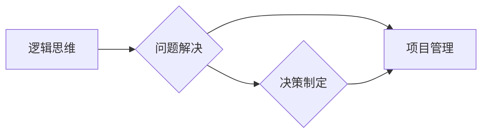

# 结构化思维的应用：从理论到实践

> 关键词：结构化思维，逻辑思维，问题解决，决策制定，项目管理，技术团队，软件开发

## 1. 背景介绍

在信息爆炸的时代，如何从海量的信息中筛选出关键点，如何清晰地表达自己的想法，如何有效地解决问题和做出决策，这些问题对于个人和团队来说都至关重要。结构化思维提供了一种逻辑清晰的思考框架，可以帮助我们更好地处理复杂信息，提高工作效率，提升决策质量。

### 1.1 结构化思维的由来

结构化思维起源于20世纪50年代的逻辑学，后来在管理、工程、法律等领域得到广泛应用。随着信息技术的快速发展，结构化思维逐渐成为现代职场人士必备的能力之一。

### 1.2 结构化思维的意义

结构化思维具有以下意义：

- 提高信息处理效率：通过结构化思维，我们可以快速筛选关键信息，避免冗余和无关信息的干扰。
- 提升沟通效果：结构化思维可以帮助我们清晰地表达自己的想法，提高沟通的效率和质量。
- 优化问题解决：结构化思维提供了一种系统性的问题解决方法，有助于找到问题的根本原因，并提出有效的解决方案。
- 促进团队协作：结构化思维有助于团队成员之间的沟通和协作，提高团队整体的工作效率。

### 1.3 本文结构

本文将从理论到实践，详细介绍结构化思维的应用，包括其核心概念、方法、工具以及实际应用场景。

## 2. 核心概念与联系

### 2.1 核心概念

#### 2.1.1 逻辑思维

逻辑思维是结构化思维的基础，它强调根据事实和逻辑推理来得出结论。逻辑思维包括以下要素：

- 条件推理：根据已知条件和结论之间的关系，推导出新的结论。
- 演绎推理：从一般到特殊的推理过程。
- 归纳推理：从特殊到一般的推理过程。

#### 2.1.2 问题解决

问题解决是指识别问题、分析问题、提出解决方案并实施的过程。问题解决的基本步骤包括：

1. 确定问题：明确问题的性质、范围和目标。
2. 分析问题：分析问题的原因和影响因素。
3. 寻找解决方案：提出多种可能的解决方案，并评估其可行性和有效性。
4. 选择解决方案：根据评估结果选择最佳解决方案。
5. 实施解决方案：将解决方案付诸实践，并跟踪执行过程。
6. 评估结果：评估解决方案的实施效果，并总结经验教训。

#### 2.1.3 决策制定

决策制定是指根据已知信息和预期目标，从多个备选方案中选择一个最佳方案的过程。决策制定的基本步骤包括：

1. 确定目标：明确决策的目标和范围。
2. 收集信息：收集与决策相关的信息。
3. 分析备选方案：分析每个备选方案的优势和劣势。
4. 评估备选方案：评估每个备选方案的实施效果。
5. 选择最佳方案：根据评估结果选择最佳方案。
6. 实施决策：将决策付诸实践，并跟踪执行过程。
7. 评估决策效果：评估决策的实施效果，并总结经验教训。

#### 2.1.4 项目管理

项目管理是指对项目进行计划、组织、领导、控制、协调和监督的过程。项目管理的基本要素包括：

- 项目目标：项目的预期成果和目标。
- 项目范围：项目的工作内容和边界。
- 项目资源：项目所需的资金、人力、物力等资源。
- 项目进度：项目的执行计划和时间表。
- 项目风险：项目可能面临的风险和挑战。

### 2.2 核心概念之间的联系

逻辑思维是问题解决和决策制定的基础，而项目管理则是将问题解决和决策制定应用于实际工作中的重要途径。以下是一个Mermaid流程图，展示了这四个核心概念之间的联系：



## 3. 核心算法原理 & 具体操作步骤

### 3.1 算法原理概述

结构化思维的核心算法原理可以概括为以下步骤：

1. **定义问题**：明确问题的性质、范围和目标。
2. **分析问题**：分析问题的原因和影响因素。
3. **提出解决方案**：提出多种可能的解决方案，并评估其可行性和有效性。
4. **选择解决方案**：根据评估结果选择最佳解决方案。
5. **实施解决方案**：将解决方案付诸实践，并跟踪执行过程。
6. **评估结果**：评估解决方案的实施效果，并总结经验教训。

### 3.2 算法步骤详解

#### 3.2.1 定义问题

定义问题是解决问题的第一步，也是至关重要的一步。以下是一些定义问题的方法：

- **问题陈述法**：用简洁的语言描述问题的核心内容。
- **目标导向法**：明确问题的目标和期望达到的效果。
- **假设分析法**：分析问题背后的假设条件和影响因素。

#### 3.2.2 分析问题

分析问题是理解问题的本质，找出问题的根本原因。以下是一些分析问题的方法：

- **因果分析法**：分析问题的原因和结果之间的关系。
- **SWOT分析法**：分析问题的优势、劣势、机会和威胁。
- **5Why分析法**：通过反复追问“为什么”，找出问题的根本原因。

#### 3.2.3 提出解决方案

提出解决方案是创造性的过程，以下是一些提出解决方案的方法：

- **头脑风暴法**：自由联想，提出尽可能多的解决方案。
- **横向思维法**：跳出传统思维模式，寻找新颖的解决方案。
- **类比法**：借鉴其他领域的成功经验，提出解决方案。

#### 3.2.4 选择解决方案

选择解决方案是根据评估结果，从多个备选方案中选择最佳方案。以下是一些选择解决方案的方法：

- **成本效益分析法**：比较不同方案的投入产出比。
- **可行性分析法**：评估不同方案的实施难度和风险。
- **专家评估法**：邀请相关领域的专家对方案进行评估。

#### 3.2.5 实施解决方案

实施解决方案是将方案付诸实践的过程。以下是一些实施解决方案的方法：

- **项目管理法**：制定详细的实施计划，确保项目按计划进行。
- **风险管理法**：识别和应对项目实施过程中可能遇到的风险。
- **沟通协调法**：确保团队成员之间的沟通畅通，协调资源。

#### 3.2.6 评估结果

评估结果是检验解决方案效果的重要环节。以下是一些评估结果的方法：

- **绩效评估法**：根据预定的指标评估方案的实施效果。
- **用户反馈法**：收集用户对方案的实际使用体验和反馈。
- **数据分析法**：通过数据分析评估方案的效果。

### 3.3 算法优缺点

#### 3.3.1 优点

- **系统性强**：结构化思维提供了一套完整的思维框架，可以系统地解决复杂问题。
- **逻辑性强**：结构化思维强调逻辑推理，可以确保思维的严谨性和准确性。
- **可操作性强**：结构化思维提供了一系列实用的方法，可以帮助我们有效地解决问题和做出决策。

#### 3.3.2 缺点

- **局限性**：结构化思维可能过于注重逻辑性，而忽视了创造性和灵活性。
- **适用性**：对于一些非常规问题，结构化思维可能无法提供有效的解决方案。

### 3.4 算法应用领域

结构化思维可以应用于以下领域：

- **软件开发**：需求分析、系统设计、代码编写、项目管理等。
- **项目管理**：项目规划、风险管理、团队管理、沟通协调等。
- **市场营销**：市场调研、产品策划、广告宣传、渠道管理等。
- **人力资源**：招聘、培训、绩效考核、员工管理等。

## 4. 数学模型和公式 & 详细讲解 & 举例说明

### 4.1 数学模型构建

结构化思维并没有严格的数学模型，但我们可以用一些简单的数学概念来描述其原理。

#### 4.1.1 逻辑推理

逻辑推理可以用以下公式表示：

```
前提1 → 结论1
前提2 → 结论2
...
前提n → 结论n
```

如果所有前提都成立，那么结论也必然成立。

#### 4.1.2 因果关系

因果关系可以用以下公式表示：

```
原因 → 结果
```

如果原因发生，那么结果也必然发生。

### 4.2 公式推导过程

由于结构化思维没有严格的数学模型，因此没有具体的公式推导过程。

### 4.3 案例分析与讲解

#### 4.3.1 软件开发中的需求分析

假设我们正在开发一个在线教育平台，用户可以通过平台学习各种课程。以下是使用结构化思维进行需求分析的过程：

1. **定义问题**：我们需要一个在线教育平台，让用户可以方便地学习各种课程。
2. **分析问题**：我们需要分析用户的需求、课程内容、平台功能等方面。
3. **提出解决方案**：我们可以开发一个具备课程浏览、视频播放、互动交流等功能的在线教育平台。
4. **选择解决方案**：在多个备选方案中，我们选择了最适合用户需求的方案。
5. **实施解决方案**：我们根据需求分析的结果，开始开发在线教育平台。
6. **评估结果**：我们通过用户反馈和数据分析，评估了在线教育平台的效果。

#### 4.3.2 项目管理中的风险管理

假设我们正在管理一个软件开发项目，以下是使用结构化思维进行风险管理的过程：

1. **定义问题**：我们需要识别和评估项目中可能遇到的风险。
2. **分析问题**：我们需要分析项目的特点、团队成员的能力、外部环境等因素。
3. **提出解决方案**：我们可以制定风险应对计划，包括风险规避、风险减轻、风险转移等策略。
4. **选择解决方案**：在多个备选方案中，我们选择了最适合项目的风险应对计划。
5. **实施解决方案**：我们根据风险应对计划，采取相应的措施来降低风险。
6. **评估结果**：我们通过风险评估和监控，评估了风险应对措施的效果。

## 5. 项目实践：代码实例和详细解释说明

### 5.1 开发环境搭建

由于结构化思维是一种思维方式，而不是具体的代码技术，因此不需要专门的开发环境。

### 5.2 源代码详细实现

同样，由于结构化思维不是具体的代码技术，因此没有源代码实现。

### 5.3 代码解读与分析

由于结构化思维不是具体的代码技术，因此没有代码解读和分析。

### 5.4 运行结果展示

由于结构化思维不是具体的代码技术，因此没有运行结果展示。

## 6. 实际应用场景

### 6.1 软件开发

结构化思维在软件开发中的应用非常广泛，以下是一些具体场景：

- **需求分析**：使用结构化思维分析用户需求，确保需求清晰、完整、一致。
- **系统设计**：使用结构化思维设计系统架构，确保系统模块化、可扩展、可维护。
- **代码编写**：使用结构化思维编写代码，确保代码清晰、简洁、可读。
- **项目管理**：使用结构化思维管理项目，确保项目按计划进行，风险得到有效控制。

### 6.2 项目管理

结构化思维在项目管理中的应用同样非常广泛，以下是一些具体场景：

- **项目规划**：使用结构化思维制定项目计划，确保项目目标明确、任务清晰、资源合理。
- **风险管理**：使用结构化思维识别和评估项目风险，制定风险应对计划。
- **团队管理**：使用结构化思维管理团队，确保团队成员职责明确、协同高效。
- **沟通协调**：使用结构化思维进行沟通协调，确保信息传递清晰、准确、及时。

### 6.3 市场营销

结构化思维在市场营销中的应用同样非常广泛，以下是一些具体场景：

- **市场调研**：使用结构化思维分析市场数据，了解市场需求和竞争情况。
- **产品策划**：使用结构化思维设计产品，确保产品满足市场需求，具有竞争力。
- **广告宣传**：使用结构化思维制定广告方案，确保广告内容精准、有效。
- **渠道管理**：使用结构化思维管理销售渠道，确保渠道高效、稳定。

### 6.4 未来应用展望

随着信息技术的不断发展，结构化思维将在更多领域得到应用，以下是一些未来应用展望：

- **人工智能**：将结构化思维应用于人工智能领域，开发更智能、更可靠的智能系统。
- **大数据**：将结构化思维应用于大数据分析，挖掘数据背后的规律和趋势。
- **物联网**：将结构化思维应用于物联网领域，构建更安全、更高效的物联网应用。
- **区块链**：将结构化思维应用于区块链技术，开发更透明、更安全的区块链应用。

## 7. 工具和资源推荐

### 7.1 学习资源推荐

- 《结构化思维》
- 《金字塔原理》
- 《麦肯锡教我的逻辑思维》
- 《逻辑与批判性思维》

### 7.2 开发工具推荐

- XMind
- MindManager
- Miro

### 7.3 相关论文推荐

- 《结构化思维：一种逻辑化的思维方法》
- 《结构化思维在项目管理中的应用》
- 《结构化思维在市场营销中的应用》

## 8. 总结：未来发展趋势与挑战

### 8.1 研究成果总结

结构化思维作为一种逻辑清晰的思考框架，在个人和团队工作中具有广泛的应用价值。通过本文的介绍，我们对结构化思维的核心概念、方法、工具以及实际应用场景有了更深入的了解。

### 8.2 未来发展趋势

随着信息技术的不断发展，结构化思维将在以下方面得到进一步发展：

- **智能化**：开发结构化思维辅助工具，如智能思维导图、智能决策支持系统等。
- **个性化**：根据个人特点和需求，提供个性化的结构化思维培训和应用方案。
- **跨学科**：将结构化思维与其他学科知识相结合，开发跨学科的解决方案。

### 8.3 面临的挑战

结构化思维在实际应用中仍然面临着以下挑战：

- **方法论**：需要进一步完善和丰富结构化思维的方法论体系。
- **工具**：需要开发更多更高效的辅助工具，提高结构化思维的应用效率。
- **人才培养**：需要加强结构化思维的人才培养，提高全民结构化思维能力。

### 8.4 研究展望

未来，结构化思维研究将朝着以下方向发展：

- **跨学科研究**：将结构化思维与其他学科知识相结合，开发跨学科的解决方案。
- **跨文化研究**：研究不同文化背景下结构化思维的特点和应用差异。
- **神经科学研究**：利用神经科学方法研究结构化思维的大脑机制。

## 9. 附录：常见问题与解答

### 9.1 常见问题

**Q1：结构化思维与其他思维方法有什么区别？**

A1：结构化思维是一种逻辑清晰的思维框架，强调根据事实和逻辑推理来得出结论。其他思维方法，如批判性思维、创造性思维等，也强调逻辑性和创造性，但它们更侧重于思维过程和方法。

**Q2：如何培养结构化思维能力？**

A2：培养结构化思维能力需要以下方法：

- **学习相关理论**：阅读相关书籍和资料，了解结构化思维的基本原理和方法。
- **实践应用**：在实际工作中不断应用结构化思维，积累经验。
- **反思总结**：反思自己的思维过程，总结经验教训。

**Q3：结构化思维是否适用于所有人？**

A3：结构化思维是一种通用的思维方式，适用于所有人。不同的人在应用结构化思维时，可以根据自己的特点和需求进行调整。

### 9.2 解答

由于结构化思维是一种思维方式，没有具体的代码实现，因此没有详细的解答。但对于上述常见问题，我们已经在上文进行了详细解答。

---

作者：禅与计算机程序设计艺术 / Zen and the Art of Computer Programming