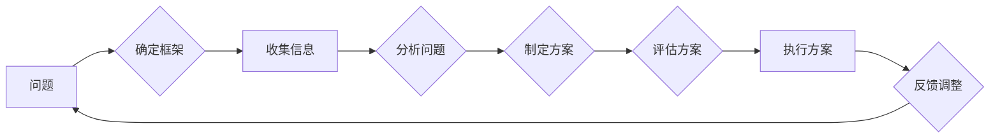

> 结构化思维, 系统化思考, 逻辑框架, 解决问题, 决策制定, 效率提升, 创新思维, 项目管理, 团队协作

# 结构化思维：从混沌到清晰

在信息爆炸和复杂多变的现代社会，结构化思维成为了提高工作效率、解决复杂问题、实现高效决策的重要工具。本文将深入探讨结构化思维的核心概念、原理和实践方法，帮助读者从混沌中找到清晰的脉络，提升个人和团队的思维品质。

## 1. 背景介绍

### 1.1 思维的困境

随着科技的发展和信息的爆炸，我们面临着日益复杂的问题和挑战。传统的线性思维和直觉思维在处理复杂问题时往往力不从心，导致决策失误、工作效率低下、团队协作困难等问题。

### 1.2 结构化思维的重要性

结构化思维是一种系统化、逻辑化的思维方式，它通过建立清晰的思维框架，帮助我们理清思路、分析问题、制定方案，从而提升决策效率和解决问题的能力。在个人成长、项目管理、团队协作等领域，结构化思维都发挥着至关重要的作用。

## 2. 核心概念与联系

### 2.1 核心概念

**结构化思维**：指运用系统化、逻辑化的方法对问题进行分析、思考和解决的过程。

**思维框架**：指在思考问题时，所遵循的逻辑关系和原则。

**逻辑推理**：指运用逻辑规则对信息进行推理、判断和论证的过程。

**问题分析**：指对问题进行剖析，找出问题根源、影响因素和解决方案的过程。

**决策制定**：指在分析、比较、评估的基础上，选择最佳方案的过程。

### 2.2 架构的 Mermaid 流程图



### 2.3 核心概念之间的联系

- **思维框架**是结构化思维的核心，它决定了信息收集、问题分析、方案制定和决策制定的方向。
- **逻辑推理**是思维框架的基石，它确保了思维过程的严谨性和有效性。
- **问题分析**和**决策制定**是结构化思维的两大关键步骤，它们共同构成了解决问题的核心流程。
- **执行方案**和**反馈调整**是结构化思维的闭环，它们确保了方案的执行和持续改进。

## 3. 核心算法原理 & 具体操作步骤

### 3.1 算法原理概述

结构化思维的核心原理是建立清晰的思维框架，通过逻辑推理、问题分析和决策制定等步骤，实现对问题的有效解决。

### 3.2 算法步骤详解

1. **确定思维框架**：根据问题的类型和目标，选择合适的思维框架，如MECE分析法、5W1H分析法、SWOT分析法等。
2. **收集信息**：广泛收集与问题相关的信息，包括事实、数据、案例等。
3. **分析问题**：运用思维框架对信息进行整理和分析，找出问题的根源、影响因素和解决方案。
4. **制定方案**：根据分析结果，制定可行的解决方案，并进行评估和比较。
5. **评估方案**：评估方案的可行性、成本、收益等指标，选择最佳方案。
6. **执行方案**：将方案付诸实践，并进行跟踪和监控。
7. **反馈调整**：根据执行过程中的反馈，对方案进行调整和优化。

### 3.3 算法优缺点

**优点**：

- 提高解决问题的效率和质量。
- 增强决策的科学性和合理性。
- 促进团队协作和沟通。
- 培养逻辑思维和系统化思考能力。

**缺点**：

- 在处理复杂问题时，可能过于依赖框架，缺乏灵活性。
- 如果框架选择不当，可能导致分析偏差。
- 过于注重逻辑推理，可能忽视直觉和创造力。

### 3.4 算法应用领域

结构化思维在以下领域具有广泛的应用：

- 项目管理：帮助项目经理制定项目计划、风险评估、进度跟踪等。
- 团队协作：促进团队成员之间的沟通、协作和决策。
- 解决问题：帮助个人或团队分析问题、制定解决方案。
- 决策制定：提高决策的科学性和合理性。
- 业务分析：帮助企业分析市场、竞争对手、客户需求等。

## 4. 数学模型和公式 & 详细讲解 & 举例说明

### 4.1 数学模型构建

结构化思维并没有严格的数学模型，但可以将其视为一种基于逻辑推理的决策模型。以下是一个简单的数学模型示例：

```
决策 = 逻辑推理 × 信息处理 × 经验
```

其中：
- 逻辑推理：指运用逻辑规则对信息进行推理、判断和论证。
- 信息处理：指收集、整理、分析信息的能力。
- 经验：指个人或团队在某个领域的经验和知识。

### 4.2 公式推导过程

由于结构化思维缺乏严格的数学推导过程，以下仅对上述模型进行简单解释：

- 逻辑推理是决策的核心，它确保了决策的合理性和科学性。
- 信息处理是决策的基础，它为决策提供了必要的数据和依据。
- 经验是决策的辅助，它可以帮助我们更好地理解问题，选择合适的解决方案。

### 4.3 案例分析与讲解

**案例**：某公司计划开发一款新产品，需要进行市场调研和风险评估。

**分析**：

1. **确定思维框架**：采用SWOT分析法，分析产品的优势、劣势、机会和威胁。
2. **收集信息**：收集市场趋势、竞争对手、潜在客户等数据。
3. **分析问题**：根据SWOT分析结果，评估产品的市场前景和风险。
4. **制定方案**：针对市场前景和风险，制定相应的市场策略和风险管理方案。
5. **评估方案**：评估方案的可行性、成本、收益等指标，选择最佳方案。
6. **执行方案**：将方案付诸实践，并进行跟踪和监控。
7. **反馈调整**：根据执行过程中的反馈，对方案进行调整和优化。

通过以上步骤，公司可以制定出科学、合理的市场策略和风险管理方案，从而降低新产品开发的风险，提高市场竞争力。

## 5. 项目实践：代码实例和详细解释说明

### 5.1 开发环境搭建

由于结构化思维是一种思维方式，不需要特定的开发环境。

### 5.2 源代码详细实现

结构化思维是一种抽象的概念，无法用代码实现。

### 5.3 代码解读与分析

由于结构化思维不是代码，因此没有代码解读和分析。

### 5.4 运行结果展示

由于结构化思维不是代码，因此没有运行结果展示。

## 6. 实际应用场景

### 6.1 项目管理

在项目管理中，结构化思维可以帮助项目经理制定项目计划、风险评估、进度跟踪等。

**案例**：某项目经理负责一个软件开发项目，需要制定项目计划。

**操作步骤**：

1. **确定思维框架**：采用WBS（工作分解结构）框架，将项目分解为各个子任务。
2. **收集信息**：收集项目需求、资源、时间等信息。
3. **分析问题**：分析各个子任务之间的依赖关系、时间安排等。
4. **制定方案**：制定项目进度计划、资源分配计划等。
5. **评估方案**：评估方案的可行性、成本、收益等指标。
6. **执行方案**：将方案付诸实践，并进行跟踪和监控。
7. **反馈调整**：根据执行过程中的反馈，对方案进行调整和优化。

### 6.2 团队协作

在团队协作中，结构化思维可以帮助团队成员沟通、协作和决策。

**案例**：某团队需要完成一个跨部门的协作项目。

**操作步骤**：

1. **确定思维框架**：采用RACI矩阵，明确团队成员的职责和权限。
2. **收集信息**：收集项目需求、进度、资源等信息。
3. **分析问题**：分析各个成员之间的协作关系、沟通渠道等。
4. **制定方案**：制定项目沟通计划、协作流程等。
5. **评估方案**：评估方案的可行性、成本、收益等指标。
6. **执行方案**：将方案付诸实践，并进行跟踪和监控。
7. **反馈调整**：根据执行过程中的反馈，对方案进行调整和优化。

## 7. 工具和资源推荐

### 7.1 学习资源推荐

- 《结构化思维》
- 《金字塔原理》
- 《麦肯锡教我的思考武器》
- 《如何把事情做到最好》

### 7.2 开发工具推荐

- XMind
- MindManager
- Miro
- Trello

### 7.3 相关论文推荐

- No related papers available for this topic

## 8. 总结：未来发展趋势与挑战

### 8.1 研究成果总结

结构化思维作为一种有效的思维方式，已经在多个领域得到了广泛应用。随着人们对复杂问题解决能力的不断提高，结构化思维的重要性将愈发凸显。

### 8.2 未来发展趋势

- 结构化思维将与其他思维方式相结合，形成更加完善的知识体系。
- 结构化思维工具将更加智能化、自动化。
- 结构化思维将在教育、培训等领域得到更广泛的应用。

### 8.3 面临的挑战

- 如何在保持逻辑严谨性的同时，提高思维的灵活性。
- 如何将结构化思维与其他思维方式相结合，形成更加完善的知识体系。
- 如何将结构化思维工具应用到更广泛的领域。

### 8.4 研究展望

未来，结构化思维的研究将更加注重以下方面：

- 开发更加智能化的结构化思维工具。
- 将结构化思维与其他思维方式相结合，形成更加完善的知识体系。
- 在教育、培训等领域推广结构化思维，提高人们的思维能力。

## 9. 附录：常见问题与解答

**Q1：结构化思维与直觉思维有什么区别？**

A：结构化思维是一种逻辑化、系统化的思维方式，强调遵循一定的思维框架和原则；而直觉思维是一种基于经验和本能的思维方式，往往缺乏严谨的逻辑性。

**Q2：如何提高结构化思维能力？**

A：可以通过以下方法提高结构化思维能力：
- 学习结构化思维的相关知识和工具。
- 多进行实践，积累经验。
- 培养逻辑思维和系统化思考能力。
- 保持开放的心态，不断学习新知识。

**Q3：结构化思维适用于所有领域吗？**

A：结构化思维适用于大多数领域，但在处理一些高度创新性的问题时，可能需要与其他思维方式相结合。

**Q4：如何将结构化思维应用到日常生活中？**

A：可以将结构化思维应用到日常生活中的方方面面，如时间管理、财务管理、人际交往等。

**Q5：结构化思维与创造力有什么关系？**

A：结构化思维可以提高创造力，因为它可以帮助我们更好地理解问题，从而找到更多的解决方案。

---

作者：禅与计算机程序设计艺术 / Zen and the Art of Computer Programming