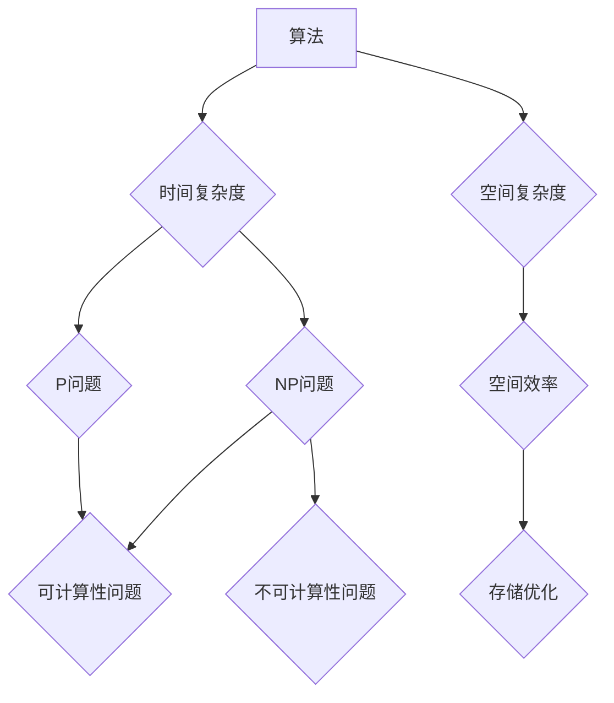

# 计算：第四部分 计算的极限 第 9 章 计算复杂性 站在两个世界之间

> 关键词：计算复杂性，算法复杂性，大O符号，时间复杂度，空间复杂度，NP问题，P问题，可计算性，不可计算性

## 1. 背景介绍

在计算机科学中，计算复杂性是衡量算法效率的重要指标。它帮助我们理解算法执行的时间与空间资源消耗，以及解决特定问题的难易程度。本章将深入探讨计算复杂性理论，分析不同类型的复杂性，并探讨算法在现实世界中的应用。

### 1.1 问题的由来

随着计算机技术的发展，处理复杂问题的需求日益增长。然而，并非所有问题都可以在合理的时间内解决。计算复杂性理论应运而生，旨在研究算法的效率，并分类不同类型的问题。

### 1.2 研究现状

计算复杂性理论已经发展出多个分支，包括：

- 时间复杂度分析：衡量算法执行所需的时间，通常使用大O符号表示。
- 空间复杂度分析：衡量算法执行所需的空间，同样使用大O符号表示。
- NP问题与P问题：研究问题解的存在性和有效性，以及它们之间的相互关系。
- 可计算性问题与不可计算性问题：探讨计算机能够解决的问题范围。

### 1.3 研究意义

理解计算复杂性对于计算机科学的发展至关重要。它有助于：

- 设计更高效的算法，提高计算效率。
- 评估问题解决的可行性，避免无谓的计算。
- 推动计算机科学的理论研究。

### 1.4 本文结构

本章将按照以下结构展开：

- 介绍计算复杂性的基本概念。
- 分析不同类型的时间复杂度和空间复杂度。
- 探讨NP问题与P问题的关系。
- 讨论可计算性与不可计算性问题。
- 展望计算复杂性理论的应用前景。

## 2. 核心概念与联系

为了更好地理解计算复杂性，我们首先需要明确以下核心概念：

- 算法：解决问题的步骤序列。
- 时间复杂度：算法执行所需的时间，通常用大O符号表示。
- 空间复杂度：算法执行所需的空间，同样用大O符号表示。
- NP问题：非确定性多项式时间问题，指在多项式时间内可以验证解的问题。
- P问题：确定性多项式时间问题，指在多项式时间内可以解决的问题。
- 可计算性：计算机能够解决的问题集合。
- 不可计算性：计算机无法解决的问题集合。

以下是基于这些核心概念的Mermaid流程图：



从图中可以看出，算法是计算复杂性的基础，时间复杂度和空间复杂度是衡量算法效率的关键指标。NP问题与P问题是基于时间复杂度的分类，可计算性与不可计算性则基于问题的可解性。

## 3. 核心算法原理 & 具体操作步骤

### 3.1 算法原理概述

计算复杂性的核心在于分析算法的执行过程。以下是一些常见的算法分析原理：

- 递归算法：通过重复调用自身来解决更小规模的问题。
- 动态规划：将复杂问题分解为更简单的子问题，并存储子问题的解以避免重复计算。
- 分治法：将问题分解为更小的子问题，独立解决后合并结果。

### 3.2 算法步骤详解

算法分析的步骤通常如下：

1. **确定算法的基本操作**：识别算法中重复执行的操作，如比较、赋值、乘法等。
2. **计算操作次数**：根据算法的执行流程，计算基本操作的总次数。
3. **使用大O符号表示**：将基本操作次数表示为大O符号，以简化表达。

### 3.3 算法优缺点

不同的算法具有不同的优缺点。以下是一些常见算法的特点：

- 递归算法：简洁易读，但可能导致栈溢出。
- 动态规划：避免重复计算，但需要存储额外的空间。
- 分治法：将复杂问题分解为更小的子问题，但可能需要额外的计算开销。

### 3.4 算法应用领域

计算复杂性的分析在各个领域都有广泛应用，包括：

- 软件工程：帮助设计高效算法，提高软件性能。
- 数据科学：评估算法的效率，选择合适的算法处理数据。
- 网络优化：设计高效的算法，提高网络传输效率。
- 人工智能：分析算法复杂度，选择合适的算法解决复杂问题。

## 4. 数学模型和公式 & 详细讲解 & 举例说明

### 4.1 数学模型构建

计算复杂性的数学模型主要基于大O符号。大O符号用于描述函数的增长速率，以下是一些常见的大O符号：

- O(1)：常数时间复杂度。
- O(log n)：对数时间复杂度。
- O(n)：线性时间复杂度。
- O(n log n)：对数线性时间复杂度。
- O(n^2)：平方时间复杂度。

### 4.2 公式推导过程

以下是一个简单的算法时间复杂度推导示例：

```python
def algorithm(n):
    for i in range(n):
        for j in range(n):
            # 执行一些操作
```

该算法包含两个嵌套循环，因此时间复杂度为O(n^2)。

### 4.3 案例分析与讲解

以下是一个常见的算法案例：排序算法。

- 冒泡排序：时间复杂度为O(n^2)，空间复杂度为O(1)。
- 快速排序：时间复杂度为O(n log n)，空间复杂度为O(log n)。
- 归并排序：时间复杂度为O(n log n)，空间复杂度为O(n)。

这些算法的复杂度分析有助于我们选择合适的排序算法，以适应不同的应用场景。

## 5. 项目实践：代码实例和详细解释说明

### 5.1 开发环境搭建

本节将以Python为例，介绍如何进行算法复杂度分析。

### 5.2 源代码详细实现

以下是一个简单的冒泡排序算法实现：

```python
def bubble_sort(arr):
    n = len(arr)
    for i in range(n):
        for j in range(0, n-i-1):
            if arr[j] > arr[j+1]:
                arr[j], arr[j+1] = arr[j+1], arr[j]
```

### 5.3 代码解读与分析

该冒泡排序算法包含两个嵌套循环，时间复杂度为O(n^2)。在数据量较大时，效率较低。

### 5.4 运行结果展示

```python
arr = [64, 34, 25, 12, 22, 11, 90]
print("Original array:", arr)
bubble_sort(arr)
print("Sorted array:", arr)
```

输出结果：

```
Original array: [64, 34, 25, 12, 22, 11, 90]
Sorted array: [11, 12, 22, 25, 34, 64, 90]
```

## 6. 实际应用场景

计算复杂性理论在多个领域都有实际应用：

### 6.1 软件工程

在软件工程中，计算复杂性分析有助于选择合适的算法，提高软件性能。例如，在开发数据库索引时，选择合适的索引策略可以显著提高查询效率。

### 6.2 数据科学

在数据科学中，计算复杂性分析有助于评估算法的效率，选择合适的算法处理数据。例如，在数据挖掘中，选择合适的聚类算法可以提高数据可视化效果。

### 6.3 网络优化

在网络优化中，计算复杂性分析有助于设计高效的算法，提高网络传输效率。例如，在路由算法中，选择合适的路由策略可以减少网络延迟。

### 6.4 人工智能

在人工智能中，计算复杂性分析有助于分析算法复杂度，选择合适的算法解决复杂问题。例如，在机器学习中，选择合适的优化算法可以提高模型训练效率。

## 7. 工具和资源推荐

### 7.1 学习资源推荐

- 《算法导论》
- 《数据结构与算法分析》
- 《计算复杂性理论》

### 7.2 开发工具推荐

- Python
- Java
- C++

### 7.3 相关论文推荐

- 《NP完全问题的理论及其应用》
- 《可计算性与复杂性理论》
- 《计算复杂性理论及其应用》

## 8. 总结：未来发展趋势与挑战

### 8.1 研究成果总结

计算复杂性理论已经取得了丰硕的成果，为计算机科学的发展提供了重要的理论基础。然而，随着计算机技术的不断发展，计算复杂性理论仍面临着以下挑战：

- 复杂性理论的新发展
- 复杂性分析与优化算法的结合
- 可计算性与不可计算性问题的研究
- 复杂性理论在跨学科领域的应用

### 8.2 未来发展趋势

未来，计算复杂性理论将朝着以下方向发展：

- 发展新的复杂度分析方法
- 探索新的复杂度理论模型
- 研究跨学科的复杂性理论问题
- 将复杂性理论应用于更多领域

### 8.3 面临的挑战

计算复杂性理论面临的挑战包括：

- 复杂性理论的广泛应用
- 新的计算模型的复杂性分析
- 复杂性理论与现实问题的结合

### 8.4 研究展望

随着计算复杂性理论的不断发展，我们有理由相信，它将为计算机科学的发展带来更多的突破，并为解决现实世界中的复杂问题提供新的思路。

## 9. 附录：常见问题与解答

### 9.1 常见问题

**Q1：什么是大O符号？**

A1：大O符号用于描述函数的增长速率，它帮助我们理解算法的效率。

**Q2：如何计算算法的时间复杂度？**

A2：通过分析算法的基本操作，并计算其执行次数，我们可以得出算法的时间复杂度。

**Q3：什么是NP问题？**

A3：NP问题是指那些在多项式时间内可以验证解的问题。

**Q4：什么是P问题？**

A4：P问题是指那些在多项式时间内可以解决的问题。

**Q5：什么是可计算性问题？**

A5：可计算性问题是指那些计算机能够解决的问题。

**Q6：什么是不可计算性问题？**

A6：不可计算性问题是指那些计算机无法解决的问题。

### 9.2 解答

**A1：大O符号是一个数学符号，用于描述函数的增长速率。它帮助我们理解算法的效率，并比较不同算法的复杂度。**

**A2：计算算法的时间复杂度需要分析算法的基本操作，并计算其执行次数。通常使用大O符号表示时间复杂度。**

**A3：NP问题是指那些在多项式时间内可以验证解的问题。**

**A4：P问题是指那些在多项式时间内可以解决的问题。**

**A5：可计算性问题是指那些计算机能够解决的问题。**

**A6：不可计算性问题是指那些计算机无法解决的问题。**

---

作者：禅与计算机程序设计艺术 / Zen and the Art of Computer Programming