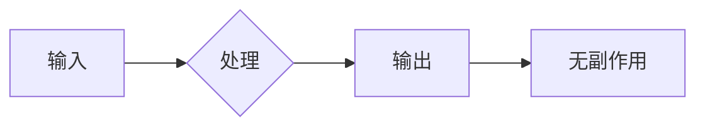
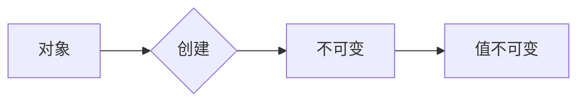
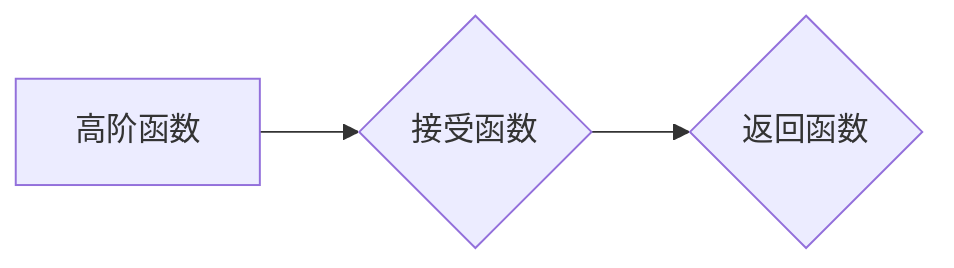
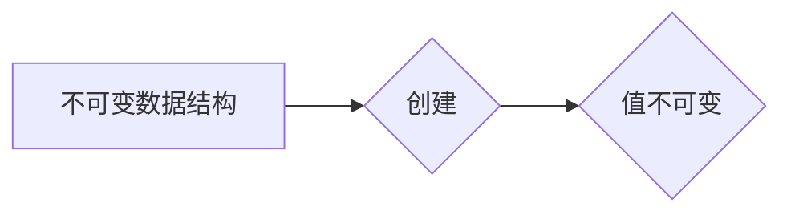

# 软件2.0的函数式编程实践

> 关键词：软件2.0，函数式编程，纯函数，不可变性，递归，高阶函数，不可变数据结构，类型系统，性能优化

## 1. 背景介绍

随着软件工程的发展，我们经历了从软件1.0到软件2.0的演变。软件1.0时代，软件开发注重的是代码的可执行性，程序流程的清晰性。而软件2.0时代，随着复杂性的增加，软件开发更加注重模块化、可重用性和可扩展性。函数式编程作为一种编程范式，以其简洁性、可预测性和易于测试等优势，逐渐成为软件2.0时代的重要编程范式之一。

函数式编程的核心思想是将计算视为数学函数的应用，强调函数的纯度和不可变性。本文将深入探讨函数式编程在软件2.0时代的实践，包括其核心概念、算法原理、应用场景以及未来发展趋势。

## 2. 核心概念与联系

### 2.1 纯函数

纯函数是指输出仅依赖于输入，且没有副作用（如修改全局状态、产生副作用等）的函数。纯函数易于测试和推理，是函数式编程的基础。



### 2.2 不可变性

不可变性是指一旦创建，对象的状态就不能被修改。在函数式编程中，数据一旦被创建，其值就不能改变，这有助于避免副作用，提高程序的可预测性和可维护性。



### 2.3 递归

递归是函数式编程中解决复杂问题的强大工具。递归函数通过重复调用自身来处理问题，避免了循环语句，使代码更加简洁。

```mermaid
graph LR
A[递归函数] --> B{递归调用}
B --> C[重复执行}
C --> D[终止条件]
```

### 2.4 高阶函数

高阶函数是指可以接受函数作为参数或返回函数的函数。高阶函数使得代码更加模块化和可重用。



### 2.5 不可变数据结构

不可变数据结构是指一旦创建，其值就不能被修改的数据结构。常见的不可变数据结构包括数组、列表、字典等。



## 3. 核心算法原理 & 具体操作步骤

### 3.1 算法原理概述

函数式编程的核心算法原理主要包括：

1. 函数组合：将多个函数组合成新的函数，实现更复杂的逻辑。
2. 惰性评估：延迟函数计算，直到需要结果时才进行计算，提高性能。
3. 演算：利用数学中的演算方法，如lambda演算、逻辑演算等，实现函数式编程。

### 3.2 算法步骤详解

1. **定义纯函数**：确保函数的输出只依赖于输入，且没有副作用。
2. **使用不可变数据结构**：在处理数据时，尽量使用不可变数据结构，避免修改原始数据。
3. **利用递归**：解决递归问题，避免使用循环语句。
4. **使用高阶函数**：将函数作为参数或返回值，实现代码的模块化和可重用性。

### 3.3 算法优缺点

#### 优点

1. **易于测试**：纯函数易于测试，可预测性强。
2. **易于维护**：不可变数据结构和纯函数有助于提高代码的可维护性。
3. **易于并发**：纯函数和不可变数据结构使得程序易于并发执行。

#### 缺点

1. **性能**：函数式编程在某些情况下可能会比过程式编程性能低。
2. **学习曲线**：函数式编程需要一定的学习成本。

### 3.4 算法应用领域

函数式编程适用于以下领域：

1. **并发编程**：利用纯函数和不可变数据结构，实现并发编程。
2. **数据处理**：利用递归和函数组合，处理大量数据。
3. **算法开发**：利用函数式编程的简洁性和可重用性，开发高效算法。

## 4. 数学模型和公式 & 详细讲解 & 举例说明

### 4.1 数学模型构建

函数式编程中的数学模型主要包括：

1. **函数**：函数是函数式编程的核心概念，用于表示计算过程。
2. **数据结构**：不可变数据结构是函数式编程中的重要数据结构，如列表、树、图等。
3. **类型系统**：类型系统用于定义数据类型和函数类型，保证程序的健壮性。

### 4.2 公式推导过程

以下是一个简单的函数式编程示例，使用递归计算阶乘：

```python
def factorial(n):
    if n == 0:
        return 1
    else:
        return n * factorial(n-1)
```

### 4.3 案例分析与讲解

以下是一个使用高阶函数实现列表映射和过滤的示例：

```python
def map(func, lst):
    return [func(x) for x in lst]

def filter(func, lst):
    return [x for x in lst if func(x)]

# 使用map和filter函数
result = map(lambda x: x * 2, [1, 2, 3, 4])
print(result)  # 输出：[2, 4, 6, 8]

result = filter(lambda x: x % 2 == 0, [1, 2, 3, 4])
print(result)  # 输出：[2, 4]
```

## 5. 项目实践：代码实例和详细解释说明

### 5.1 开发环境搭建

1. 安装Python环境（推荐使用Anaconda）。
2. 安装Python函数式编程库，如functools、numpy等。

### 5.2 源代码详细实现

以下是一个使用函数式编程实现的简易Web爬虫：

```python
import requests
from bs4 import BeautifulSoup

def fetch(url):
    return requests.get(url).text

def parse(html):
    soup = BeautifulSoup(html, 'html.parser')
    return soup.find_all('a')

def filter_links(links):
    return [link.get('href') for link in links if link.get('href')]

def get_links(url):
    html = fetch(url)
    links = parse(html)
    return filter_links(links)

# 使用函数式编程实现Web爬虫
url = 'https://example.com'
result = get_links(url)
print(result)
```

### 5.3 代码解读与分析

1. `fetch`函数负责获取网页内容。
2. `parse`函数使用BeautifulSoup解析网页内容，提取所有<a>标签。
3. `filter_links`函数过滤掉不包含href属性的链接。
4. `get_links`函数组合上述函数，实现Web爬虫功能。

### 5.4 运行结果展示

运行上述代码，将输出示例网站中的所有链接。

## 6. 实际应用场景

### 6.1 数据处理

函数式编程在数据处理领域具有广泛的应用，如：

- 数据清洗：利用函数式编程的列表推导和集合操作，简化数据清洗过程。
- 数据分析：使用函数式编程进行数据挖掘和统计分析。
- 数据可视化：利用函数式编程生成数据可视化图表。

### 6.2 并发编程

函数式编程在并发编程领域具有以下优势：

- 纯函数和不可变数据结构使得程序易于并发执行。
- 使用异步编程和Futures库，实现高效的并发编程。

### 6.3 算法开发

函数式编程在算法开发领域具有以下优势：

- 纯函数和递归使得算法开发更加简洁和易读。
- 高阶函数和组合技术提高算法的模块化和可重用性。

## 7. 工具和资源推荐

### 7.1 学习资源推荐

1. 《函数式编程原理与实践》
2. 《You Don't Know JS》
3. 《Functional Programming in JavaScript》

### 7.2 开发工具推荐

1. Python：Python是一种功能强大的编程语言，支持函数式编程。
2. Scala：Scala是一种支持函数式编程的编程语言，具有良好的性能和生态系统。
3. Haskell：Haskell是一种纯函数式编程语言，适合用于研究函数式编程。

### 7.3 相关论文推荐

1. "Lisp：The History of an Idea" by Paul Graham
2. "The Implementation of Practical Functional Programming Language Features" by John Launchbury
3. "Type Classes for Functional Programming" by Simon Peyton Jones

## 8. 总结：未来发展趋势与挑战

### 8.1 研究成果总结

本文从背景介绍、核心概念、算法原理、应用场景等方面，对软件2.0的函数式编程实践进行了全面阐述。函数式编程以其简洁性、可预测性和易于测试等优势，在软件2.0时代具有广泛的应用前景。

### 8.2 未来发展趋势

1. 函数式编程语言和框架将得到进一步发展。
2. 函数式编程将在更多领域得到应用。
3. 函数式编程与其他编程范式的融合将更加紧密。

### 8.3 面临的挑战

1. 函数式编程的学习成本较高。
2. 函数式编程的性能在某些情况下可能不如过程式编程。
3. 函数式编程的生态系统相对较小。

### 8.4 研究展望

未来，函数式编程将与其他编程范式、人工智能等领域进行深度融合，为软件开发带来更多可能性。

## 9. 附录：常见问题与解答

**Q1：函数式编程与过程式编程有何区别？**

A：函数式编程和过程式编程是两种不同的编程范式。函数式编程强调函数的纯度和不可变性，而过程式编程强调程序的执行流程。

**Q2：函数式编程有哪些优势？**

A：函数式编程具有以下优势：
- 简洁性
- 可预测性
- 易于测试
- 易于维护
- 易于并发

**Q3：函数式编程有哪些缺点？**

A：函数式编程的缺点包括：
- 学习成本较高
- 性能可能不如过程式编程
- 生态系统相对较小

**Q4：函数式编程适用于哪些领域？**

A：函数式编程适用于以下领域：
- 数据处理
- 并发编程
- 算法开发
- 科学计算
- 软件工程

---

作者：禅与计算机程序设计艺术 / Zen and the Art of Computer Programming