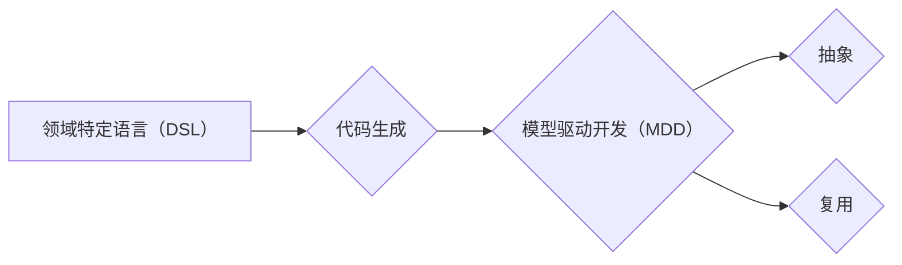
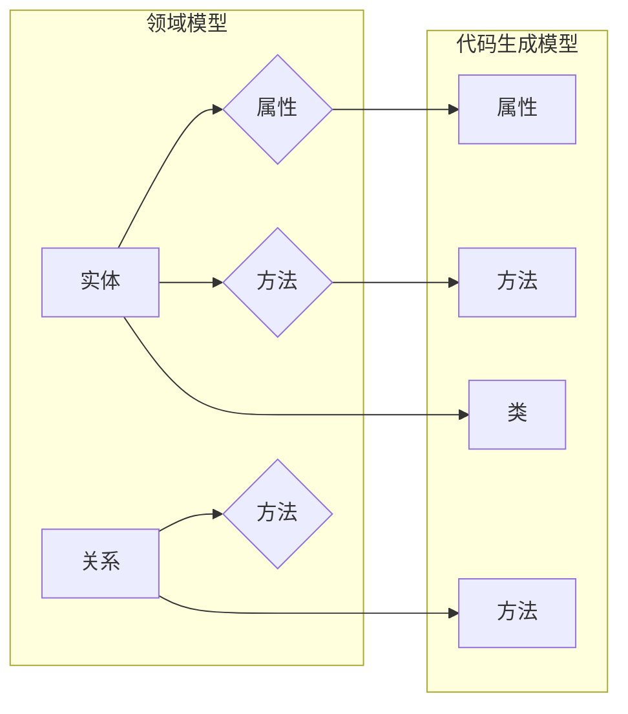

# 软件2.0的领域特定语言设计

> 关键词：软件2.0，领域特定语言（DSL），代码生成，模型驱动开发，抽象，复用，自动化，效率

## 1. 背景介绍

随着软件工程的发展，从传统的代码密集型方法逐渐过渡到软件2.0时代。在这个时代，软件的构建不再是单纯依赖于程序员的手工编码，而是通过模型驱动开发、代码生成等自动化手段来构建和优化。领域特定语言（Domain-Specific Language，DSL）作为软件2.0时代的关键技术之一，为特定领域提供了高效、可维护和可扩展的软件开发解决方案。

### 1.1 问题的由来

在软件开发的早期，程序员们使用通用编程语言（如Java、C++、Python等）来开发各种类型的软件。然而，这种做法存在以下问题：

- **不匹配性**：通用编程语言通常无法很好地满足特定领域的需求，导致代码冗余、难以维护。
- **效率低下**：程序员需要手动编写大量重复代码，导致开发效率低下。
- **可维护性差**：随着软件复杂度的增加，维护难度也随之增大。

为了解决这些问题，领域特定语言（DSL）应运而生。

### 1.2 研究现状

领域特定语言（DSL）是一种为特定领域设计的编程语言，它提供了一种简化的语法和词汇，以更好地支持该领域的建模、分析和自动化。近年来，随着模型驱动开发和代码生成技术的发展，领域特定语言在软件工程领域得到了广泛的应用。

### 1.3 研究意义

研究领域特定语言设计，对于提升软件开发效率、降低开发成本、提高软件质量具有重要意义：

- **提高开发效率**：DSL提供了一种简化的编程模型，减少了手动编码量，提高了开发效率。
- **降低开发成本**：通过代码生成等自动化手段，减少了软件开发的人力成本。
- **提高软件质量**：DSL能够更好地支持领域模型和业务规则的描述，从而提高了软件的质量和可维护性。
- **促进复用**：DSL可以促进领域知识的复用，降低软件开发的风险。

### 1.4 本文结构

本文将围绕领域特定语言设计展开，包括以下内容：

- 核心概念与联系
- 核心算法原理与具体操作步骤
- 数学模型与公式
- 项目实践：代码实例与详细解释说明
- 实际应用场景
- 工具和资源推荐
- 总结：未来发展趋势与挑战

## 2. 核心概念与联系

### 2.1 核心概念

#### DSL（领域特定语言）

领域特定语言（Domain-Specific Language，DSL）是一种为特定领域设计的编程语言，它使用领域专家熟悉的术语和符号，以简化该领域的建模、分析和自动化。

#### 代码生成

代码生成是指利用模型驱动开发工具，根据领域特定语言编写的模型自动生成代码的过程。

#### 模型驱动开发

模型驱动开发（Model-Driven Development，MDD）是一种软件开发方法，它将软件系统的设计和构建过程分离，通过模型来描述软件系统，并自动生成代码。

#### 抽象

抽象是一种将复杂问题分解为简单问题的方法，它可以帮助我们更好地理解和管理问题。

#### 复用

复用是指在不同的项目中使用相同的代码或设计，以减少重复工作和提高开发效率。

### 2.2 联系

领域特定语言（DSL）是模型驱动开发（MDD）的核心组成部分，它通过代码生成等自动化手段，实现了领域知识的复用和抽象。



## 3. 核心算法原理 & 具体操作步骤

### 3.1 算法原理概述

领域特定语言设计的核心算法原理是：

1. **领域分析**：分析特定领域的业务需求和规则，确定领域模型和领域词汇。
2. **语言设计**：设计符合领域专家认知的语法和词汇，构建领域特定语言。
3. **模型驱动开发**：利用领域特定语言编写的模型，自动生成代码。

### 3.2 算法步骤详解

#### 步骤1：领域分析

- 研究特定领域的业务需求和规则。
- 确定领域模型和领域词汇。
- 分析领域模型之间的关系。

#### 步骤2：语言设计

- 设计符合领域专家认知的语法和词汇。
- 构建领域特定语言规范。
- 开发领域特定语言工具。

#### 步骤3：模型驱动开发

- 利用领域特定语言编写的模型，生成代码。
- 集成代码生成工具，实现自动化开发。

#### 步骤4：代码生成

- 根据领域模型，生成相应的代码。
- 生成代码包括领域模型对应的类、接口、方法等。

### 3.3 算法优缺点

#### 优点

- 提高开发效率：通过自动化生成代码，减少了手动编码量。
- 降低开发成本：减少了软件开发的人力成本。
- 提高软件质量：通过领域模型和业务规则的描述，提高了软件的质量和可维护性。

#### 缺点

- 语言设计复杂：设计符合领域专家认知的语法和词汇需要大量工作。
- 代码生成工具开发难度大：开发能够自动生成高质量代码的代码生成工具需要一定的技术难度。

### 3.4 算法应用领域

领域特定语言设计在以下领域有着广泛的应用：

- 软件配置管理
- 数据库设计
- 系统监控
- 业务流程管理
- 游戏开发

## 4. 数学模型和公式

领域特定语言设计中的数学模型主要包括：

#### 4.1 领域模型

领域模型是描述特定领域业务需求和规则的一种模型。它通常包括以下部分：

- **实体**：领域中的对象，如用户、订单、产品等。
- **关系**：实体之间的关系，如购买、授权等。
- **属性**：实体的特征，如用户ID、订单金额等。

#### 4.2 代码生成模型

代码生成模型是描述领域模型与代码之间映射关系的模型。它通常包括以下部分：

- **实体映射**：实体与代码中的类、接口等的映射关系。
- **关系映射**：关系与代码中的方法、属性等的映射关系。

以下是一个简单的领域模型和代码生成模型的示例：



## 5. 项目实践：代码实例和详细解释说明

### 5.1 开发环境搭建

为了实践领域特定语言设计，我们需要搭建以下开发环境：

- Java开发环境：用于开发领域特定语言和代码生成工具。
- 模型驱动开发工具：用于创建和编辑领域模型。

### 5.2 源代码详细实现

以下是一个简单的领域特定语言和代码生成工具的示例：

```java
// 领域模型
public class User {
    private String id;
    private String name;
    private String email;
    // ... 省略其他属性和方法 ...
}

// 代码生成工具
public class CodeGenerator {
    public void generateCode(User user) {
        // 生成User类
        System.out.println("public class User {");
        System.out.println("    private String id;");
        System.out.println("    private String name;");
        System.out.println("    private String email;");
        System.out.println("    // ... 省略其他属性和方法 ...");
        System.out.println("}");
    }
}
```

### 5.3 代码解读与分析

上述代码演示了如何使用Java语言实现一个简单的领域特定语言和代码生成工具。其中，`User` 类表示用户实体，`CodeGenerator` 类表示代码生成工具，它可以根据用户实体生成相应的Java代码。

### 5.4 运行结果展示

假设我们有一个用户实体，其ID为`12345`，名称为`张三`，电子邮件为`zhangsan@example.com`。则代码生成工具会生成以下Java代码：

```java
public class User {
    private String id;
    private String name;
    private String email;
    // ... 省略其他属性和方法 ...
}
```

## 6. 实际应用场景

领域特定语言设计在以下实际应用场景中有着广泛的应用：

### 6.1 软件配置管理

领域特定语言可以用于描述软件配置项的属性和关系，从而实现自动化配置管理。

### 6.2 数据库设计

领域特定语言可以用于描述数据库表的结构和关系，从而实现自动化数据库设计。

### 6.3 系统监控

领域特定语言可以用于描述系统监控的指标和阈值，从而实现自动化系统监控。

### 6.4 业务流程管理

领域特定语言可以用于描述业务流程的步骤和规则，从而实现自动化业务流程管理。

### 6.5 游戏开发

领域特定语言可以用于描述游戏世界的规则和逻辑，从而实现自动化游戏开发。

## 7. 工具和资源推荐

### 7.1 学习资源推荐

- 《领域特定语言：原理与实践》
- 《模型驱动开发》
- 《代码生成》

### 7.2 开发工具推荐

- IntelliJ IDEA Ultimate Edition
- Visual Studio Code
- NetBeans

### 7.3 相关论文推荐

- 《Domain-Specific Languages》
- 《Model-Driven Development》
- 《Code Generation》

## 8. 总结：未来发展趋势与挑战

### 8.1 研究成果总结

领域特定语言设计是软件2.0时代的重要技术之一，它通过模型驱动开发和代码生成等自动化手段，提高了软件开发效率、降低了开发成本、提高了软件质量。

### 8.2 未来发展趋势

- DSL技术将更加成熟，支持更加复杂和多样化的领域。
- 模型驱动开发将成为软件开发的主流方法。
- 代码生成技术将更加高效和智能。
- 领域特定语言将与其他人工智能技术相结合，实现更加智能化的软件开发。

### 8.3 面临的挑战

- DSL设计复杂，需要深入理解特定领域的业务需求。
- 代码生成工具开发难度大，需要较高的技术水平。
- 如何保证生成的代码质量是当前和未来需要解决的问题。

### 8.4 研究展望

领域特定语言设计在软件开发领域具有广阔的应用前景，未来需要在以下方面进行深入研究：

- DSL设计方法学研究。
- 代码生成工具开发技术。
- 领域特定语言与其他人工智能技术相结合。

## 9. 附录：常见问题与解答

**Q1：领域特定语言（DSL）与通用编程语言有何区别？**

A：领域特定语言（DSL）是为特定领域设计的编程语言，它使用领域专家熟悉的术语和符号，以简化该领域的建模、分析和自动化。而通用编程语言（如Java、C++、Python等）则适用于各种类型的软件开发。

**Q2：如何设计一个领域特定语言？**

A：设计领域特定语言需要以下步骤：
1. 研究特定领域的业务需求和规则。
2. 确定领域模型和领域词汇。
3. 设计符合领域专家认知的语法和词汇。
4. 开发领域特定语言工具。

**Q3：代码生成在领域特定语言设计中有什么作用？**

A：代码生成是将领域特定语言编写的模型自动生成代码的过程。它可以提高开发效率、降低开发成本、提高软件质量。

**Q4：如何保证生成的代码质量？**

A：为了保证生成的代码质量，需要：
1. 设计合理的领域模型和语法。
2. 开发高效的代码生成工具。
3. 对生成的代码进行严格的测试和验证。

---

作者：禅与计算机程序设计艺术 / Zen and the Art of Computer Programming