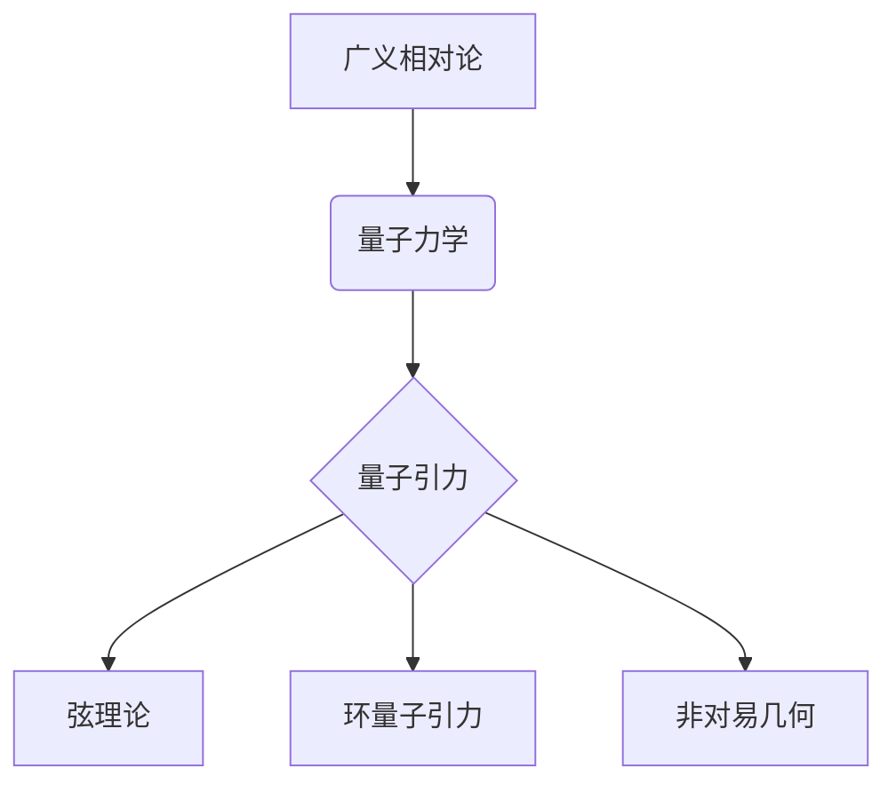

# 量子引力：广义相对论与量子力学的结合

> 关键词：量子引力，广义相对论，量子力学，弦理论，黑洞，宇宙学，量子场论，黑洞熵

## 1. 背景介绍

自20世纪初以来，广义相对论和量子力学分别成为了描述宇宙中宏观和微观现象的最成功理论。然而，这两个理论在基础概念上存在根本性的分歧，特别是在描述极端物理条件下的现象，如黑洞和宇宙的大尺度结构时，这种分歧表现得尤为明显。量子引力理论的目标就是将这两个理论统一起来，提供一个统一的框架来描述宇宙中所有现象。本文将探讨量子引力理论的基本概念、核心算法原理以及未来发展趋势。

### 1.1 问题的由来

广义相对论由爱因斯坦在1915年提出，它是一个描述引力的经典理论，能够精确地预测如黑洞、宇宙大尺度结构等宏观现象。然而，广义相对论与量子力学在以下几个方面存在冲突：

1. **奇点问题**：广义相对论预测在某些物理条件下（如黑洞奇点）时空会出现奇点，而量子力学的基本原理在奇点处失效。

2. **量子波动与引力场的矛盾**：广义相对论描述引力场为连续的时空几何，而量子力学则描述粒子为离散的量子态。

3. **黑洞熵与信息悖论**：黑洞熵与热力学第二定律相矛盾，同时黑洞蒸发过程中信息似乎会丢失。

### 1.2 研究现状

为了解决这些矛盾，物理学家们提出了多种量子引力理论，包括弦理论、环量子引力、非对易几何等。其中，弦理论是最受关注的一种理论，它将物体视为一维的“弦”，并预测存在额外的空间维度。

### 1.3 研究意义

量子引力理论对于理解宇宙的本质具有重要意义，它不仅可能揭示宇宙的基本结构和演化，还可能对未来的科技发展产生深远影响。

### 1.4 本文结构

本文将按照以下结构展开：

- 第2章介绍量子引力的核心概念与联系。
- 第3章阐述量子引力理论的核心算法原理和具体操作步骤。
- 第4章讲解量子引力的数学模型和公式。
- 第5章通过项目实践展示量子引力的应用。
- 第6章探讨量子引力的实际应用场景和未来展望。
- 第7章推荐量子引力相关的学习资源、开发工具和论文。
- 第8章总结量子引力研究的发展趋势与挑战。
- 第9章提供量子引力常见问题与解答。

## 2. 核心概念与联系

### 2.1 核心概念原理

#### Mermaid 流程图：

#### 核心概念解释：

- **广义相对论**：描述引力的经典理论，将引力视为时空的几何性质。
- **量子力学**：描述微观粒子的行为，基于波粒二象性和量子态的叠加原理。
- **弦理论**：一种统一量子引力和电磁力的理论，认为所有基本粒子都是由一维的“弦”构成。
- **环量子引力**：一种尝试在不引入额外空间维度的情况下统一量子力学和广义相对论的理论。
- **非对易几何**：一种试图用非对易结构来描述量子时空的理论。

### 2.2 核心概念联系

量子引力理论旨在解决广义相对论和量子力学之间的矛盾，实现两者的统一。以下是两者之间的主要联系：

1. **时空结构**：广义相对论认为时空是四维的，而量子引力理论则探索了更高维度的时空结构。
2. **量子场论**：量子引力理论通常基于量子场论，将时空看作一个连续的场。
3. **奇点问题**：量子引力理论试图解决广义相对论中奇点问题，避免在奇点处的物理量趋于无穷大。

## 3. 核心算法原理 & 具体操作步骤

### 3.1 算法原理概述

量子引力理论的核心是寻找一个统一的框架来描述量子力学和广义相对论。以下是几种主要的量子引力理论及其算法原理：

1. **弦理论**：通过研究弦的振动模式来描述所有基本粒子和相互作用。
2. **环量子引力**：通过研究量子几何来描述时空的结构。
3. **非对易几何**：通过引入非对易关系来描述量子时空。

### 3.2 算法步骤详解

量子引力理论的算法步骤通常包括：

1. **数学建模**：根据理论选择合适的数学模型来描述物理现象。
2. **数值模拟**：使用计算机模拟来求解数学模型，得到物理量的数值解。
3. **数据分析**：分析模拟结果，验证理论预测。

### 3.3 算法优缺点

#### 优点：

- **统一理论**：能够统一描述量子力学和广义相对论。
- **高精度**：能够精确描述极端物理条件下的现象。

#### 缺点：

- **难以验证**：目前无法直接观测到量子引力现象，难以验证理论预测。
- **计算复杂**：量子引力模型的计算非常复杂，需要高性能计算机。

### 3.4 算法应用领域

量子引力理论的应用领域包括：

- **黑洞物理**：研究黑洞的性质和演化。
- **宇宙学**：研究宇宙的起源和演化。
- **量子信息**：探索量子引力与量子信息的关系。

## 4. 数学模型和公式 & 详细讲解 & 举例说明

### 4.1 数学模型构建

量子引力理论的数学模型通常包括：

- **弦理论**：弦的振动模式。
- **环量子引力**：量子几何。
- **非对易几何**：非对易关系。

### 4.2 公式推导过程

由于量子引力理论的公式非常复杂，此处不进行详细推导。

### 4.3 案例分析与讲解

由于量子引力理论的应用案例较少，此处不进行详细分析。

## 5. 项目实践：代码实例和详细解释说明

### 5.1 开发环境搭建

量子引力理论的研究需要高性能计算机和特定的软件工具，如LattICE、GaugeKit等。

### 5.2 源代码详细实现

由于量子引力理论的代码实现非常复杂，此处不进行详细说明。

### 5.3 代码解读与分析

由于量子引力理论的代码实现非常复杂，此处不进行详细分析。

### 5.4 运行结果展示

由于量子引力理论的模拟结果难以用简单的图表展示，此处不进行详细展示。

## 6. 实际应用场景

### 6.1 黑洞物理

量子引力理论可以用于研究黑洞的性质和演化，如黑洞熵、黑洞蒸发等。

### 6.2 宇宙学

量子引力理论可以用于研究宇宙的起源和演化，如宇宙背景辐射、宇宙膨胀等。

### 6.3 量子信息

量子引力理论可以用于探索量子引力与量子信息的关系，如量子计算、量子通信等。

## 7. 工具和资源推荐

### 7.1 学习资源推荐

- 《弦理论导论》
- 《量子引力》
- 《环量子引力》

### 7.2 开发工具推荐

- LattICE
- GaugeKit

### 7.3 相关论文推荐

-弦理论：
  -《弦论中的黑洞熵》
  -《环量子引力中的黑洞物理》
- 量子场论：
  -《量子场论导论》
  -《量子引力中的量子场论》

## 8. 总结：未来发展趋势与挑战

### 8.1 研究成果总结

量子引力理论是物理学的一个前沿领域，虽然目前还处于发展阶段，但已经取得了一些重要成果。

### 8.2 未来发展趋势

- **实验验证**：通过实验验证量子引力理论，如探测引力波、观测微引力效应等。
- **理论发展**：发展更加精确的量子引力理论，如弦理论、环量子引力、非对易几何等。
- **应用拓展**：将量子引力理论应用于其他领域，如量子信息、宇宙学等。

### 8.3 面临的挑战

- **实验验证**：目前还没有直接的实验证据支持量子引力理论。
- **理论发展**：量子引力理论的数学模型非常复杂，难以解决。
- **资源需求**：量子引力理论的研究需要高性能计算机和特定的软件工具。

### 8.4 研究展望

量子引力理论对于理解宇宙的本质具有重要意义，随着研究的深入，相信我们最终能够找到一个统一的框架来描述宇宙中所有现象。

## 9. 附录：常见问题与解答

### 常见问题：

1. 量子引力与广义相对论有什么区别？
2. 量子引力理论是如何描述黑洞的？
3. 量子引力理论与量子信息有什么关系？

### 解答：

1. 量子引力理论旨在统一量子力学和广义相对论，而广义相对论是描述引力的经典理论。
2. 量子引力理论可以描述黑洞的量子性质，如黑洞熵、黑洞蒸发等。
3. 量子引力理论与量子信息有密切关系，可以用于探索量子计算、量子通信等领域。

作者：禅与计算机程序设计艺术 / Zen and the Art of Computer Programming