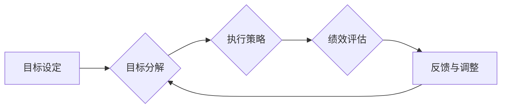

# 长期目标管理的意识机制

> 关键词：长期目标管理，目标设定，意识机制，自我管理，目标分解，执行策略，绩效评估

## 1. 背景介绍

在信息爆炸和快节奏的现代社会，个人和组织都在追求持续的高效发展。长期目标管理作为一种重要的管理理念和方法，对于实现个人成长、团队协作和企业发展至关重要。本文将探讨长期目标管理的意识机制，分析其核心概念、算法原理、操作步骤以及在实际应用场景中的挑战和未来发展趋势。

### 1.1 问题的由来

随着知识经济时代的到来，个人和组织面临的挑战日益复杂。如何设定明确、可行的长期目标，并确保目标的顺利实现，成为了许多个人和组织的迫切需求。然而，现实中普遍存在着目标设定模糊、执行力度不足、评估体系不完善等问题，导致长期目标难以达成。

### 1.2 研究现状

目前，关于长期目标管理的研究主要集中在以下几个方面：

- **目标设定理论**：探讨如何设定具有挑战性、可行性、可度量性的目标。
- **目标分解技术**：研究如何将长期目标分解为可执行的任务和里程碑。
- **执行策略与方法**：分析如何制定有效的执行策略，确保目标按计划推进。
- **绩效评估体系**：研究如何建立科学的绩效评估体系，对目标实现情况进行监控和反馈。

### 1.3 研究意义

研究长期目标管理的意识机制，有助于：

- 提升个人和组织的战略规划能力。
- 增强目标实现的自觉性和主动性。
- 优化资源配置，提高工作效率。
- 促进个人成长和组织发展。

### 1.4 本文结构

本文将从以下方面展开讨论：

- 核心概念与联系
- 核心算法原理与操作步骤
- 数学模型与公式
- 项目实践
- 实际应用场景
- 工具和资源推荐
- 总结与展望

## 2. 核心概念与联系

### 2.1 核心概念

#### 2.1.1 长期目标管理

长期目标管理是指个人或组织为实现长远发展目标而进行的一系列规划、执行和评估活动。其核心是设定具有挑战性、可行性、可度量性的长期目标，并确保目标的顺利实现。

#### 2.1.2 目标设定

目标设定是指根据个人或组织的愿景和使命，制定具体、可衡量、可实现、相关性强、时限性的目标。

#### 2.1.3 目标分解

目标分解是指将长期目标分解为一系列短期目标、任务和里程碑，以便于执行和监控。

#### 2.1.4 执行策略

执行策略是指为实现目标而制定的一系列行动方案、资源配置、时间规划等。

#### 2.1.5 绩效评估

绩效评估是指对目标实现情况进行监控、分析和评估的过程，以便及时调整策略和改进工作。

### 2.2 Mermaid 流程图



### 2.3 核心概念联系

长期目标管理是一个闭环过程，目标设定、分解、执行、评估和反馈调整相互关联，共同推动目标的实现。

## 3. 核心算法原理与操作步骤

### 3.1 算法原理概述

长期目标管理的核心算法原理包括：

- **目标设定原理**：基于SMART原则（具体、可衡量、可实现、相关性强、时限性）进行目标设定。
- **目标分解原理**：采用自上而下或自下而上的方法，将长期目标分解为短期目标和任务。
- **执行策略原理**：根据目标分解结果，制定合理的执行策略，包括资源配置、时间规划、风险管理等。
- **绩效评估原理**：建立科学的绩效评估体系，对目标实现情况进行定期评估。

### 3.2 算法步骤详解

#### 3.2.1 目标设定

1. 明确个人或组织的愿景和使命。
2. 分析内外部环境，确定发展机遇和挑战。
3. 设定具有挑战性、可行性、可度量性的长期目标。
4. 将长期目标分解为短期目标。

#### 3.2.2 目标分解

1. 分析长期目标的实现路径，确定关键任务和里程碑。
2. 根据任务和里程碑，制定相应的行动计划。
3. 明确每个任务的执行者、时间节点、资源配置等。

#### 3.2.3 执行策略

1. 制定资源配置方案，确保任务顺利执行。
2. 制定时间规划，确保任务按时完成。
3. 制定风险管理方案，应对潜在风险。

#### 3.2.4 绩效评估

1. 建立绩效评估指标体系，对目标实现情况进行监控。
2. 定期进行绩效评估，分析目标完成情况。
3. 根据评估结果，及时调整执行策略和资源配置。

### 3.3 算法优缺点

#### 3.3.1 优点

- 系统性强，涵盖目标设定、分解、执行、评估和反馈调整等环节。
- 可操作性强，提供了具体实施步骤和方法。
- 可持续性强，通过持续反馈和调整，确保目标的实现。

#### 3.3.2 缺点

- 需要花费大量时间和精力进行规划和执行。
- 对执行者的能力和素质要求较高。
- 需要建立有效的沟通机制和协作平台。

### 3.4 算法应用领域

长期目标管理算法适用于以下领域：

- 个人成长：个人职业规划、学习目标设定等。
- 团队协作：团队目标设定、项目管理等。
- 企业管理：企业战略规划、部门目标设定等。

## 4. 数学模型与公式

### 4.1 数学模型构建

长期目标管理可以构建以下数学模型：

- 目标设定模型：根据SMART原则，构建目标函数，对目标进行量化评估。
- 目标分解模型：采用图论或网络流等方法，将长期目标分解为短期目标和任务。
- 绩效评估模型：建立多指标综合评价体系，对目标实现情况进行量化评估。

### 4.2 公式推导过程

#### 4.2.1 目标设定模型

设个人或组织的愿景为 $V$，使命为 $M$，长期目标为 $T$，则目标设定模型可以表示为：

$$
\begin{aligned}
V &= \text{实现可持续发展，成为行业领先企业} \\
M &= \text{为客户提供卓越的产品和服务，创造价值} \\
T &= \text{在三年内实现营业额翻倍，市场份额提升10%}
\end{aligned}
$$

#### 4.2.2 目标分解模型

设长期目标 $T$ 可以分解为 $n$ 个短期目标 $T_1, T_2, ..., T_n$，则目标分解模型可以表示为：

$$
T = T_1 + T_2 + ... + T_n
$$

#### 4.2.3 绩效评估模型

设绩效评估指标体系包括 $m$ 个指标 $I_1, I_2, ..., I_m$，则绩效评估模型可以表示为：

$$
E = f(I_1, I_2, ..., I_m)
$$

其中 $f$ 为评估函数，可以根据具体情况选择不同的评估方法，如加权求和法、主成分分析法等。

### 4.3 案例分析与讲解

以一家企业的年度目标设定为例，分析长期目标管理的数学模型：

#### 4.3.1 目标设定

企业的愿景是成为行业领先企业，使命是为客户提供卓越的产品和服务，创造价值。基于此，企业设定以下年度目标：

$$
\begin{aligned}
T_1 &= \text{实现营业额同比增长15%} \\
T_2 &= \text{提升市场占有率1%} \\
T_3 &= \text{提高客户满意度至90%} \\
T_4 &= \text{降低生产成本5%}
\end{aligned}
$$

#### 4.3.2 目标分解

将年度目标分解为季度目标和月度目标：

$$
\begin{aligned}
T_1 &= T_{11} + T_{12} + T_{13} + T_{14} \\
T_2 &= T_{21} + T_{22} + T_{23} + T_{24} \\
T_3 &= T_{31} + T_{32} + T_{33} + T_{34} \\
T_4 &= T_{41} + T_{42} + T_{43} + T_{44}
\end{aligned}
$$

其中，$T_{ij}$ 表示第 $i$ 季度第 $j$ 个月的目标。

#### 4.3.3 绩效评估

建立绩效评估指标体系，包括营业额、市场占有率、客户满意度和生产成本等指标，并对目标实现情况进行定期评估。

## 5. 项目实践：代码实例和详细解释说明

### 5.1 开发环境搭建

为了更好地理解长期目标管理的实现过程，以下以Python为例，给出一个简单的代码实例。

```python
# 导入必要的库
import pandas as pd
from datetime import datetime

# 假设有一个包含目标数据的CSV文件
data = pd.read_csv("target_data.csv")

# 定义目标分解函数
def decompose_targets(data, target_column, period="month"):
    period_dict = {"month": "month", "quarter": "quarter", "year": "year"}
    period_length = 1 if period == "month" else 3 if period == "quarter" else 12
    decomposed_targets = []
    for index, row in data.iterrows():
        start_date = row["start_date"]
        end_date = row["end_date"]
        period_dates = pd.date_range(start=start_date, end=end_date, freq=period_dict[period])
        for date in period_dates:
            decomposed_targets.append(row[target_column])
    return decomposed_targets

# 调用函数进行目标分解
decomposed_targets = decompose_targets(data, "target_value", "month")
```

### 5.2 源代码详细实现

以上代码演示了如何将年度目标分解为月度目标。首先，加载目标数据；然后，定义目标分解函数，根据目标开始和结束日期以及分解周期，将目标分解为更细粒度的目标；最后，调用函数进行目标分解。

### 5.3 代码解读与分析

该代码实例展示了如何使用Python进行目标分解的基本步骤。在实际应用中，可以根据具体需求，修改代码实现更复杂的分解逻辑和功能。

### 5.4 运行结果展示

运行代码后，将得到一个包含月度目标的列表，方便后续进行绩效评估和跟踪。

## 6. 实际应用场景

### 6.1 个人成长

个人可以通过长期目标管理，制定职业规划、学习计划等，实现个人成长。例如，设定学习一门新语言、掌握一项新技能、提升工作效率等目标，并根据SMART原则进行分解和执行。

### 6.2 团队协作

团队可以通过长期目标管理，制定团队目标、项目管理计划等，提高团队协作效率。例如，设定提升团队凝聚力、完成项目目标、提高客户满意度等目标，并根据SMART原则进行分解和执行。

### 6.3 企业管理

企业可以通过长期目标管理，制定企业战略、部门目标等，实现企业持续发展。例如，设定提升市场占有率、提高产品竞争力、降低运营成本等目标，并根据SMART原则进行分解和执行。

## 7. 工具和资源推荐

### 7.1 学习资源推荐

- 《高效能人士的七个习惯》
- 《目标管理》
- 《敏捷开发：拥抱变化》

### 7.2 开发工具推荐

- Trello：项目管理工具，方便团队协作和目标跟踪。
- Asana：项目管理工具，支持目标分解、任务分配和进度跟踪。
- Microsoft Excel：电子表格软件，可以用于目标数据记录和绩效评估。

### 7.3 相关论文推荐

- "Goal Setting: A Theory of Task Performance and Instruction" by Edwin Locke
- "The Power of Goal Setting" by Gail Matthews

## 8. 总结：未来发展趋势与挑战

### 8.1 研究成果总结

本文从长期目标管理的意识机制出发，分析了其核心概念、算法原理、操作步骤、数学模型和实际应用场景。研究表明，长期目标管理是一种系统、科学的管理方法，有助于个人和组织的长期发展。

### 8.2 未来发展趋势

随着人工智能、大数据等技术的发展，长期目标管理将呈现以下发展趋势：

- 智能化：利用人工智能技术，实现目标的自动设定、分解、执行和评估。
- 个性化：根据个人或组织的特点，制定个性化的目标管理方案。
- 网络化：通过网络平台，实现目标管理的协同和共享。

### 8.3 面临的挑战

长期目标管理在发展过程中也面临着以下挑战：

- 数据质量：高质量的目标数据是目标管理的基础，需要建立完善的数据采集和清洗机制。
- 技术应用：如何将人工智能、大数据等技术有效应用于目标管理，是未来需要解决的问题。
- 人文关怀：目标管理不仅要关注技术层面，还要关注人的因素，如动机、行为等。

### 8.4 研究展望

未来，长期目标管理的研究应重点关注以下几个方面：

- 结合人工智能、大数据等技术，开发智能化的目标管理工具和平台。
- 研究个性化目标管理方案，满足不同个人和组织的需求。
- 关注目标管理的人文因素，提高目标实现的自觉性和主动性。

## 9. 附录：常见问题与解答

**Q1：长期目标管理与短期目标管理有何区别？**

A：长期目标管理关注的是长远发展，设定的是具有挑战性、可行性、可度量性的目标；而短期目标管理关注的是近期目标，设定的是具体、可衡量、可实现、相关性强、时限性的目标。

**Q2：如何制定具有挑战性的目标？**

A：制定具有挑战性的目标，需要考虑以下因素：

- 个人或组织的愿景和使命
- 内外部环境
- 资源和条件
- 行业发展趋势

**Q3：如何确保目标的实现？**

A：为确保目标的实现，需要：

- 建立科学的绩效评估体系
- 制定合理的执行策略
- 建立有效的沟通机制
- 调动相关人员的积极性

**Q4：长期目标管理在企业管理中的重要性是什么？**

A：长期目标管理在企业管理中的重要性体现在：

- 指导企业长远发展
- 提高企业管理效率
- 增强企业核心竞争力
- 促进企业可持续发展

---

作者：禅与计算机程序设计艺术 / Zen and the Art of Computer Programming