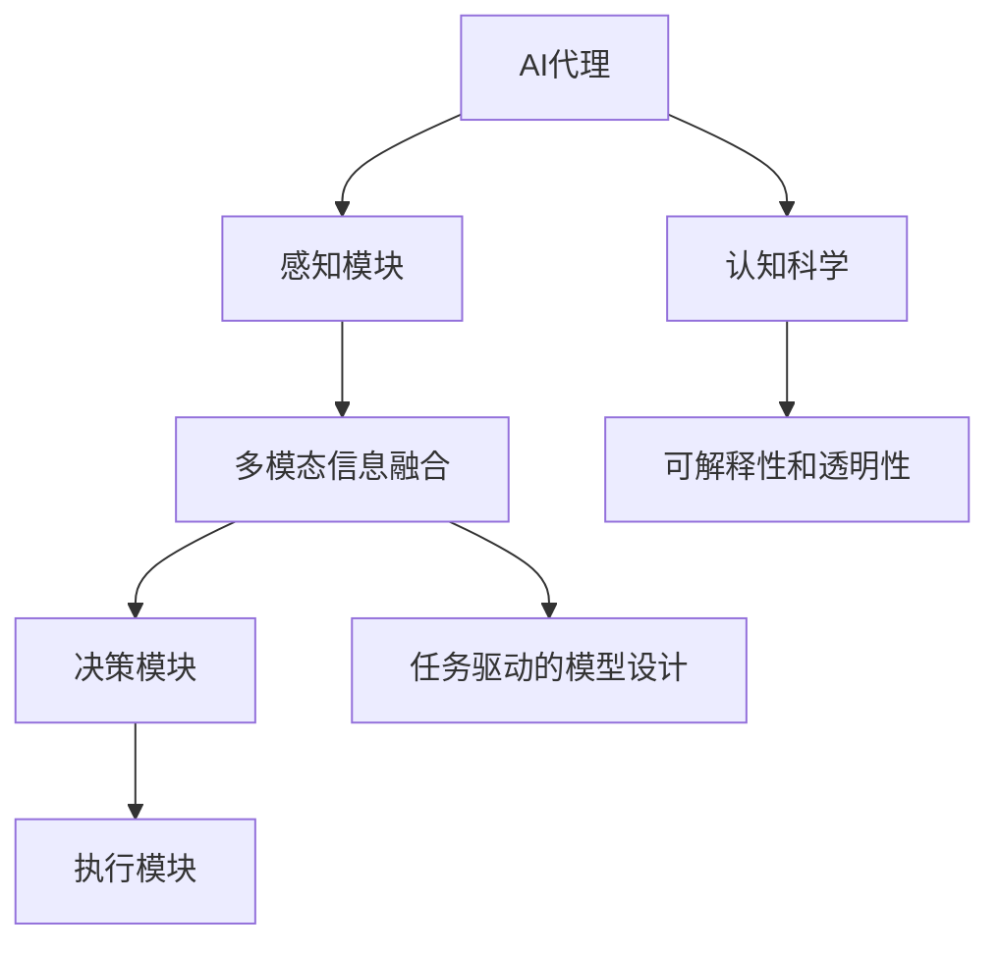

                 

# AI人工智能代理工作流AI Agent WorkFlow：融合认知科学的AI代理发展

## 1. 背景介绍

### 1.1 问题由来
随着人工智能（AI）技术的发展，AI代理（AI Agent）在各行各业中的应用越来越广泛。AI代理能够模拟人类的智能行为，执行各种任务，从简单的数据录入到复杂的系统管理，都能胜任。然而，目前AI代理的设计和训练过程仍然存在诸多挑战，包括模型复杂度高、训练数据不足、交互体验欠佳等。如何构建更加智能、高效、可解释的AI代理，成为当前AI研究的重要方向。

### 1.2 问题核心关键点
构建高效的AI代理工作流，需要对AI代理的理论基础和实践技术进行全面系统的理解。核心关键点包括：
- 认知科学：认知科学是研究人类智能行为的基础，通过借鉴认知科学的理论和方法，可以更好地设计和训练AI代理。
- 多模态信息融合：AI代理需要处理多种类型的数据，如图像、文本、语音等，如何有效融合这些信息是实现智能决策的关键。
- 任务驱动的模型设计：AI代理需要针对具体任务进行模型设计，不同任务需要不同的模型结构和优化方法。
- 可解释性和透明性：AI代理的决策过程和输出结果需要具备可解释性，以增强用户信任和满意度。

### 1.3 问题研究意义
构建AI代理工作流，对于推动人工智能技术的实际应用具有重要意义：
- 降低应用开发成本：通过任务驱动的模型设计和优化，可以减少从头开发的工作量，降低成本。
- 提升AI代理性能：通过融合认知科学和多模态信息融合技术，可以提升AI代理的智能水平和任务执行能力。
- 增强用户交互体验：通过可解释性和透明性设计，可以增强用户对AI代理的信任和满意度。
- 推动AI技术普及：AI代理可以应用于各种垂直行业，如医疗、金融、教育等，推动AI技术在更多领域的落地应用。

## 2. 核心概念与联系

### 2.1 核心概念概述

为更好地理解AI代理工作流，本节将介绍几个密切相关的核心概念：

- **AI代理（AI Agent）**：能够感知环境、执行任务、学习反馈的智能体。AI代理通常由感知模块、决策模块和执行模块组成。
- **认知科学（Cognitive Science）**：研究人类认知过程的基础科学，包括感知、记忆、推理、决策等方面。AI代理可以借鉴认知科学的理论和方法，提高智能水平。
- **多模态信息融合（Multimodal Information Fusion）**：AI代理需要处理多种类型的数据，如图像、文本、语音等，如何有效融合这些信息是实现智能决策的关键。
- **任务驱动的模型设计（Task-driven Model Design）**：AI代理需要针对具体任务进行模型设计，不同任务需要不同的模型结构和优化方法。
- **可解释性和透明性（Explainability and Transparency）**：AI代理的决策过程和输出结果需要具备可解释性，以增强用户信任和满意度。

这些核心概念之间的逻辑关系可以通过以下Mermaid流程图来展示：



这个流程图展示了大语言模型微调过程中各个核心概念之间的关系：

1. AI代理通过感知模块获取环境信息，包括多模态信息融合和任务驱动的模型设计。
2. 决策模块利用融合后的信息进行智能决策，借鉴认知科学理论和方法，提高决策质量。
3. 执行模块根据决策结果执行任务，并反馈到感知模块进行下一轮循环。
4. 可解释性和透明性设计贯穿于AI代理的各个环节，增强用户信任和满意度。

### 2.2 概念间的关系

这些核心概念之间存在着紧密的联系，形成了AI代理工作流的完整生态系统。下面我通过几个Mermaid流程图来展示这些概念之间的关系。

#### 2.2.1 AI代理的工作流

```mermaid
graph LR
    A[环境] --> B[感知模块] --> C[多模态信息融合] --> D[决策模块] --> E[执行模块]
    B --> F[感知器]
    C --> G[融合器]
    D --> H[决策器]
    E --> I[执行器]
    F --> J[特征提取]
    G --> K[信息融合]
    H --> L[模型训练]
    I --> M[任务执行]
    J --> N[数据采集]
    K --> O[特征融合]
    L --> P[模型优化]
    M --> Q[任务反馈]
    N --> R[数据采集]
    O --> S[特征映射]
    P --> T[模型微调]
    Q --> U[反馈更新]
    R --> V[数据增强]
    S --> W[特征表示]
    T --> X[模型更新]
    U --> Y[反馈处理]
    V --> Z[数据预处理]
    W --> AA[特征表示]
    X --> BB[模型训练]
    Y --> CC[反馈处理]
    Z --> DD[数据预处理]
    AA --> EE[特征表示]
    BB --> FF[模型训练]
    CC --> GG[反馈处理]
    DD --> HH[数据预处理]
    EE --> II[特征表示]
    FF --> JJ[模型训练]
    GG --> KK[反馈处理]
    HH --> LL[数据预处理]
    II --> MM[特征表示]
    JJ --> NN[模型训练]
    KK --> OO[反馈处理]
    LL --> PP[数据预处理]
    MM --> QQ[特征表示]
    NN --> RR[模型训练]
    OO --> SS[反馈处理]
    PP --> TT[数据预处理]
    QQ --> UU[特征表示]
    RR --> VV[模型训练]
    SS --> WW[反馈处理]
    TT --> XX[模型更新]
    UU --> YY[反馈处理]
    VV --> ZZ[数据预处理]
    WW --> AAA[特征表示]
    XX --> BBB[模型训练]
    YY --> CCC[反馈处理]
    ZZ --> DDD[数据预处理]
    AAA --> EEE[特征表示]
    BBB --> FFF[模型训练]
    CCC --> GGG[反馈处理]
    DDD --> HHH[数据预处理]
    EEE --> III[特征表示]
    FFF --> JJJ[模型训练]
    GGG --> KKK[反馈处理]
    HHH --> LLL[数据预处理]
    III --> MMC[特征表示]
    JJJ --> NNN[模型训练]
    KKK --> OOO[反馈处理]
    LLL --> PPP[数据预处理]
    MMC --> QQQ[特征表示]
    NNN --> RRR[模型训练]
    OOO --> SSS[反馈处理]
    PPP --> TTT[数据预处理]
    QQQ --> UUU[特征表示]
    RRR --> VVV[模型训练]
    SSS --> WWW[反馈处理]
    TTT --> XXY[模型更新]
    UUU --> YYY[反馈处理]
    VVV --> ZZZ[数据预处理]
    WWW --> AAAA[特征表示]
    XXY --> BBBB[模型训练]
    YYY --> CCCC[反馈处理]
    ZZZ --> DDDD[数据预处理]
    AAAA --> EEEE[特征表示]
    BBBB --> FFFA[模型训练]
    CCCB --> GGGC[反馈处理]
    DDDD --> HHHB[数据预处理]
    EEEE --> IIIA[特征表示]
    FFFA --> JJJC[模型训练]
    GGGC --> KKKF[反馈处理]
    HHHB --> LLLB[数据预处理]
    III A --> MMCB[特征表示]
    JJJC --> NNNC[模型训练]
    KKKF --> OOOB[反馈处理]
    LLLB --> PPPB[数据预处理]
    MMCB --> QQQB[特征表示]
    NNNC --> RRRB[模型训练]
    OOO B --> SSSA[反馈处理]
    PPPB --> TTTB[数据预处理]
    QQQ B --> UUUB[特征表示]
    RRRB --> VVVC[模型训练]
    SSSA --> WWWA[反馈处理]
    TTTB --> XXYA[模型更新]
    UUUB --> YYYB[反馈处理]
    VVVC --> ZZZB[数据预处理]
    WWW A --> AAAA[特征表示]
    XXY A --> BBBBA[模型训练]
    YYY B --> CCCCB[反馈处理]
    ZZZ B --> DDDCA[数据预处理]
    AAA A --> EEEBA[特征表示]
    BBBBA --> FFFAA[模型训练]
    CCCCB --> GGGAA[反馈处理]
    DDDCA --> HHHAA[数据预处理]
    EEEBA --> IIIAA[特征表示]
    FFFA A --> JJFBA[模型训练]
    GGGA A --> KKKAA[反馈处理]
    HHHA A --> LLAA[数据预处理]
    III AA --> MMBAA[特征表示]
    JJFBA --> NNFBA[模型训练]
    KKKAA --> OOAA[反馈处理]
    LLAA --> PPAA[数据预处理]
    MMBAA --> QQAAB[特征表示]
    NNFBA --> RRAAB[模型训练]
    OOAA --> SSAAB[反馈处理]
    PPAA --> TTAAB[数据预处理]
    QQAAB --> UUAA[特征表示]
    RRAAB --> VVAA[模型训练]
    SSAAB --> WAAAB[反馈处理]
    TTAAB --> XYAAB[模型更新]
    UUAA --> YAAAB[反馈处理]
    VVAA --> ZAAAB[数据预处理]
    WAA AB --> AAAAB[特征表示]
    XYAAB --> BBAAB[模型训练]
    YAA AB --> CCAAB[反馈处理]
    ZAA AB --> DDAAB[数据预处理]
    AAA AB --> EAAAB[特征表示]
    BBAAB --> FAAAB[模型训练]
    CCAAB --> GAAAB[反馈处理]
    DDAAB --> HAAAB[数据预处理]
    EAAAB --> IAAAB[特征表示]
    FAAAB --> JAAAB[模型训练]
    GAAAB --> KAAAB[反馈处理]
    HAAAB --> LAAAB[数据预处理]
    IAAAB --> MAAAB[特征表示]
    JAAAB --> NAAAB[模型训练]
    KAAAB --> OAAAB[反馈处理]
    LAAAB --> PAAAB[数据预处理]
    MAA AB --> QAAAB[特征表示]
    NAAAB --> RAAAB[模型训练]
    OAA AB --> SAAAB[反馈处理]
    PAA AB --> TAAAB[数据预处理]
    QAA AB --> UAAAB[特征表示]
    RAA AB --> VAAAB[模型训练]
    SA AAB --> WAAAB[反馈处理]
    TAA AB --> XYAAB[模型更新]
    UAA AB --> YAAAB[反馈处理]
    VAA AB --> ZAAAB[数据预处理]
    WAA AB --> AAAAB[特征表示]
    XYA AB --> BBAAB[模型训练]
    YAA AB --> CCAAB[反馈处理]
    ZAA AB --> DDAAB[数据预处理]
    AAA AB --> EAAAB[特征表示]
    BBAAB --> FAAAB[模型训练]
    CCAAB --> GAAAB[反馈处理]
    DDAAB --> HAAAB[数据预处理]
    EAAAB --> IAAAB[特征表示]
    FAAAB --> JAAAB[模型训练]
    GAAAB --> KAAAB[反馈处理]
    HAAAB --> LAAAB[数据预处理]
    IAAAB --> MAAAB[特征表示]
    JAAAB --> NAAAB[模型训练]
    KAAAB --> OAAAB[反馈处理]
    LAAAB --> PAAAB[数据预处理]
    MAA AB --> QAAAB[特征表示]
    NAAAB --> RAAAB[模型训练]
    OAA AB --> SAAAB[反馈处理]
    PAA AB --> TAAAB[数据预处理]
    QAA AB --> UAAAB[特征表示]
    RAA AB --> VAAAB[模型训练]
    SA AAB --> WAAAB[反馈处理]
    TAA AB --> XYAAB[模型更新]
    UAA AB --> YAAAB[反馈处理]
    VAA AB --> ZAAAB[数据预处理]
    WAA AB --> AAAAB[特征表示]
    XYA AB --> BBAAB[模型训练]
    YAA AB --> CCAAB[反馈处理]
    ZAA AB --> DDAAB[数据预处理]
    AAA AB --> EAAAB[特征表示]
    BBAAB --> FAAAB[模型训练]
    CCAAB --> GAAAB[反馈处理]
    DDAAB --> HAAAB[数据预处理]
    EAAAB --> IAAAB[特征表示]
    FAAAB --> JAAAB[模型训练]
    GAAAB --> KAAAB[反馈处理]
    HAAAB --> LAAAB[数据预处理]
    IAAAB --> MAAAB[特征表示]
    JAAAB --> NAAAB[模型训练]
    KAAAB --> OAAAB[反馈处理]
    LAAAB --> PAAAB[数据预处理]
    MAA AB --> QAAAB[特征表示]
    NAAAB --> RAAAB[模型训练]
    OAA AB --> SAAAB[反馈处理]
    PAA AB --> TAAAB[数据预处理]
    QAA AB --> UAAAB[特征表示]
    RAA AB --> VAAAB[模型训练]
    SA AAB --> WAAAB[反馈处理]
    TAA AB --> XYAAB[模型更新]
    UAA AB --> YAAAB[反馈处理]
    VAA AB --> ZAAAB[数据预处理]
    WAA AB --> AAAAB[特征表示]
    XYA AB --> BBAAB[模型训练]
    YAA AB --> CCAAB[反馈处理]
    ZAA AB --> DDAAB[数据预处理]
    AAA AB --> EAAAB[特征表示]
    BBAAB --> FAAAB[模型训练]
    CCAAB --> GAAAB[反馈处理]
    DDAAB --> HAAAB[数据预处理]
    EAAAB --> IAAAB[特征表示]
    FAAAB --> JAAAB[模型训练]
    GAAAB --> KAAAB[反馈处理]
    HAAAB --> LAAAB[数据预处理]
    IAAAB --> MAAAB[特征表示]
    JAAAB --> NAAAB[模型训练]
    KAAAB --> OAAAB[反馈处理]
    LAAAB --> PAAAB[数据预处理]
    MAA AB --> QAAAB[特征表示]
    NAAAB --> RAAAB[模型训练]
    OAA AB --> SAAAB[反馈处理]
    PAA AB --> TAAAB[数据预处理]
    QAA AB --> UAAAB[特征表示]
    RAA AB --> VAAAB[模型训练]
    SA AAB --> WAAAB[反馈处理]
    TAA AB --> XYAAB[模型更新]
    UAA AB --> YAAAB[反馈处理]
    VAA AB --> ZAAAB[数据预处理]
    WAA AB --> AAAAB[特征表示]
    XYA AB --> BBAAB[模型训练]
    YAA AB --> CCAAB[反馈处理]
    ZAA AB --> DDAAB[数据预处理]
    AAA AB --> EAAAB[特征表示]
    BBAAB --> FAAAB[模型训练]
    CCAAB --> GAAAB[反馈处理]
    DDAAB --> HAAAB[数据预处理]
    EAAAB --> IAAAB[特征表示]
    FAAAB --> JAAAB[模型训练]
    GAAAB --> KAAAB[反馈处理]
    HAAAB --> LAAAB[数据预处理]
    IAAAB --> MAAAB[特征表示]
    JAAAB --> NAAAB[模型训练]
    KAAAB --> OAAAB[反馈处理]
    LAAAB --> PAAAB[数据预处理]
    MAA AB --> QAAAB[特征表示]
    NAAAB --> RAAAB[模型训练]
    OAA AB --> SAAAB[反馈处理]
    PAA AB --> TAAAB[数据预处理]
    QAA AB --> UAAAB[特征表示]
    RAA AB --> VAAAB[模型训练]
    SA AAB --> WAAAB[反馈处理]
    TAA AB --> XYAAB[模型更新]
    UAA AB --> YAAAB[反馈处理]
    VAA AB --> ZAAAB[数据预处理]
    WAA AB --> AAAAB[特征表示]
    XYA AB --> BBAAB[模型训练]
    YAA AB --> CCAAB[反馈处理]
    ZAA AB --> DDAAB[数据预处理]
    AAA AB --> EAAAB[特征表示]
    BBAAB --> FAAAB[模型训练]
    CCAAB --> GAAAB[反馈处理]
    DDAAB --> HAAAB[数据预处理]
    EAAAB --> IAAAB[特征表示]
    FAAAB --> JAAAB[模型训练]
    GAAAB --> KAAAB[反馈处理]
    HAAAB --> LAAAB[数据预处理]
    IAAAB --> MAAAB[特征表示]
    JAAAB --> NAAAB[模型训练]
    KAAAB --> OAAAB[反馈处理]
    LAAAB --> PAAAB[数据预处理]
    MAA AB --> QAAAB[特征表示]
    NAAAB --> RAAAB[模型训练]
    OAA AB --> SAAAB[反馈处理]
    PAA AB --> TAAAB[数据预处理]
    QAA AB --> UAAAB[特征表示]
    RAA AB --> VAAAB[模型训练]
    SA AAB --> WAAAB[反馈处理]
    TAA AB --> XYAAB[模型更新]
    UAA AB --> YAAAB[反馈处理]
    VAA AB --> ZAAAB[数据预处理]
    WAA AB --> AAAAB[特征表示]
    XYA AB --> BBAAB[模型训练]
    YAA AB --> CCAAB[反馈处理]
    ZAA AB --> DDAAB[数据预处理]
    AAA AB --> EAAAB[特征表示]
    BBAAB --> FAAAB[模型训练]
    CCAAB --> GAAAB[反馈处理]
    DDAAB --> HAAAB[数据预处理]
    EAAAB --> IAAAB[特征表示]
    FAAAB --> JAAAB[模型训练]
    GAAAB --> KAAAB[反馈处理]
    HAAAB --> LAAAB[数据预处理]
    IAAAB --> MAAAB[特征表示]
    JAAAB --> NAAAB[模型训练]
    KAAAB --> OAAAB[反馈处理]
    LAAAB --> PAAAB[数据预处理]
    MAA AB --> QAAAB[特征表示]
    NAAAB --> RAAAB[模型训练]
    OAA AB --> SAAAB[反馈处理]
    PAA AB --> TAAAB[数据预处理]
    QAA AB --> UAAAB[特征表示]
    RAA AB --> VAAAB[模型训练]
    SA AAB --> WAAAB[反馈处理]
    TAA AB --> XYAAB[模型更新]
    UAA AB --> YAAAB[反馈处理]
    VAA AB --> ZAAAB[数据预处理]
    WAA AB --> AAAAB[特征表示]
    XYA AB --> BBAAB[模型训练]
    YAA AB --> CCAAB[反馈处理]
    ZAA AB --> DDAAB[数据预处理]
    AAA AB --> EAAAB[特征表示]
    BBAAB --> FAAAB[模型训练]
    CCAAB --> GAAAB[反馈处理]
    DDAAB --> HAAAB[数据预处理]
    EAAAB --> IAAAB[特征表示]
    FAAAB --> JAAAB[模型训练]
    GAAAB --> KAAAB[反馈处理]
    HAAAB --> LAAAB[数据预处理]
    IAAAB --> MAAAB[特征表示]
    JAAAB --> NAAAB[模型训练]
    KAAAB --> OAAAB[反馈处理]
    LAAAB --> PAAAB[数据预处理]
    MAA AB --> QAAAB[特征表示]
    NAAAB --> RAAAB[模型训练]
    OAA AB --> SAAAB[反馈处理]
    PAA AB --> TAAAB[数据预处理]
    QAA AB --> UAAAB[特征表示]
    RAA AB --> VAAAB[模型训练]
    SA AAB --> WAAAB[反馈处理]
    TAA AB --> XYAAB[模型更新]
    UAA AB --> YAAAB[反馈处理]
    VAA AB --> ZAAAB[数据预处理]
    WAA AB --> AAAAB[特征表示]
    XYA AB --> BBAAB[模型训练]
    YAA AB --> CCAAB[反馈处理]
    ZAA AB --> DDAAB[数据预处理]
    AAA AB --> EAAAB[特征表示]
    BBAAB --> FAAAB[模型训练]
    CCAAB --> GAAAB[反馈处理]
    DDAAB --> HAAAB[数据预处理]
    EAAAB --> IAAAB[特征表示]
    FAAAB --> JAAAB[模型训练]
    GAAAB --> KAAAB[反馈处理]
    HAAAB --> LAAAB[数据预处理]
    IAAAB --> MAAAB[特征表示]
    JAAAB --> NAAAB[模型训练]
    KAAAB --> OAAAB[反馈处理]
    LAAAB --> PAAAB[数据预处理]
    MAA AB --> QAAAB[特征表示]
    NAAAB --> RAAAB[模型训练]
    OAA AB --> SAAAB[反馈处理]
    PAA AB --> TAAAB[数据预处理]
    QAA AB --> UAAAB[特征表示]
    RAA AB --> VAAAB[模型训练]
    SA AAB --> WAAAB[反馈处理]
    TAA AB --> XYAAB[模型更新]
    UAA AB --> YAAAB[反馈处理]
    VAA AB --> ZAAAB[数据预处理]
    WAA AB --> AAAAB[特征表示]
    XYA AB --> BBAAB[模型训练]
    YAA AB --> CCAAB[反馈处理]
    ZAA AB --> DDAAB[数据预处理]
    AAA AB --> EAAAB[特征表示]
    BBAAB --> FAAAB[模型训练]
    CCAAB --> GAAAB[反馈处理]
    DDAAB --> HAAAB[数据预处理]
    EAAAB --> IAAAB[特征表示]
    FAAAB --> JAAAB[模型训练]
    GAAAB --> KAAAB[反馈处理]
    HAAAB --> LAAAB[数据预处理]
    IAAAB --> MAAAB[特征表示]
    JAAAB --> NAAAB[模型训练]
    KAAAB --> OAAAB[反馈处理]
    LAAAB --> PAAAB[数据预处理]
    MAA AB --> QAAAB[特征表示]
    NAAAB --> RAAAB[模型训练]
    OAA AB --> SAAAB[反馈处理]
    PAA AB --> TAAAB[数据预处理]
    QAA AB --> UAAAB[特征表示]
    RAA AB --> VAAAB[模型训练]
    SA AAB --> WAAAB[反馈处理]
    TAA AB --> XYAAB[模型更新]
    UAA AB --> YAAAB[反馈处理]
    VAA AB --> ZAAAB[数据预处理]
    WAA AB --> AAAAB[特征表示]
    XYA AB --> BBAAB[模型训练]
    YAA AB --> CCAAB[反馈处理]
    ZAA AB --> DDAAB[数据预处理]
    AAA AB --> EAAAB[特征表示]
    BBAAB --> FAAAB[模型训练]
    CCAAB --> GAAAB[反馈处理]
    DDAAB --> HAAAB[数据预处理]
    EAAAB --> IAAAB[特征表示]
    FAAAB --> JAAAB[模型训练]
    GAAAB --> KAAAB[反馈处理]
    HAAAB --> LAAAB[数据预处理]
    IAAAB --> MAAAB[特征表示]
    JAAAB --> NAAAB[模型训练]
    KAAAB --> OAAAB[反馈处理]
    LAAAB --> PAAAB[数据预处理]
    MAA AB --> QAAAB[特征表示]
    NAAAB --> RAAAB[模型训练]
    OAA AB --> SAAAB[反馈处理]
    PAA AB --> TAAAB[数据预处理]
    QAA AB --> UAAAB[特征表示]
    RAA AB --> VAAAB[模型训练]
    SA AAB --> WAAAB[反馈处理]
    TAA AB --> XYAAB[模型更新]
    UAA AB --> YAAAB[反馈处理]
    VAA AB --> ZAAAB[数据预处理]
    WAA AB --> AAAAB[特征表示]
    XYA AB --> BBAAB[模型训练]
    YAA AB --> CCAAB[反馈处理]
    ZAA AB --> DDAAB[数据预处理]
    AAA AB --> EAAAB[特征表示]
    BBAAB --> FAAAB[模型训练]
    CCAAB --> GAAAB[反馈处理]
    DDAAB --> HAAAB[数据预处理]
    EAAAB --> IAAAB[特征表示]
    FAAAB -->

