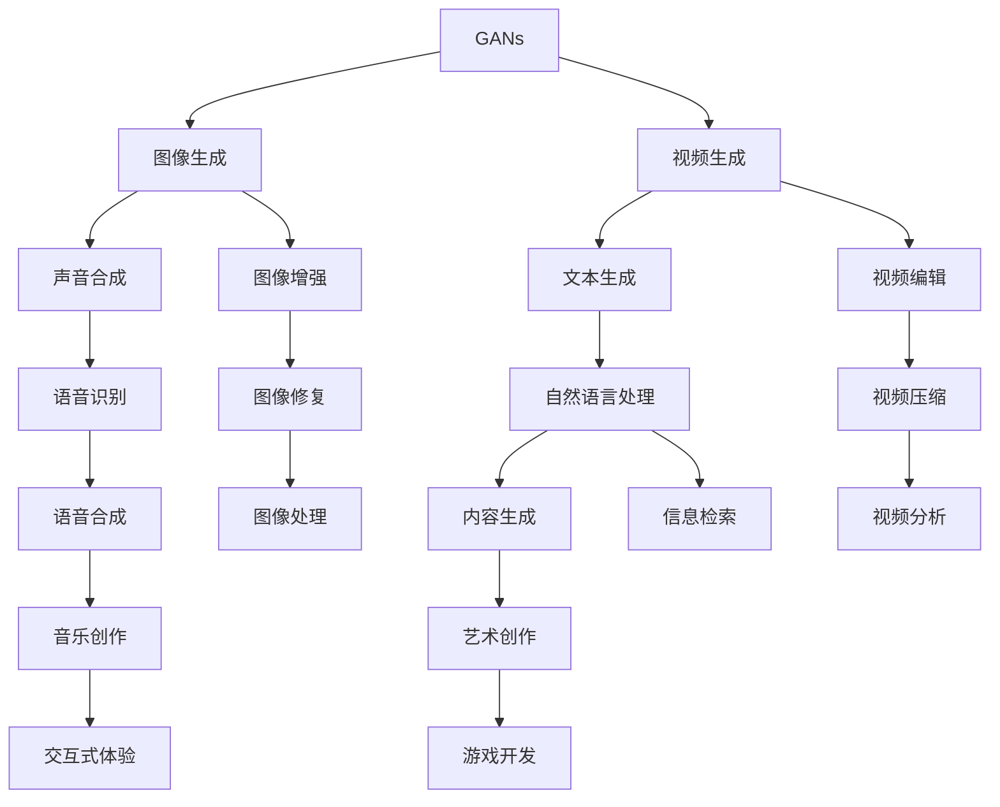
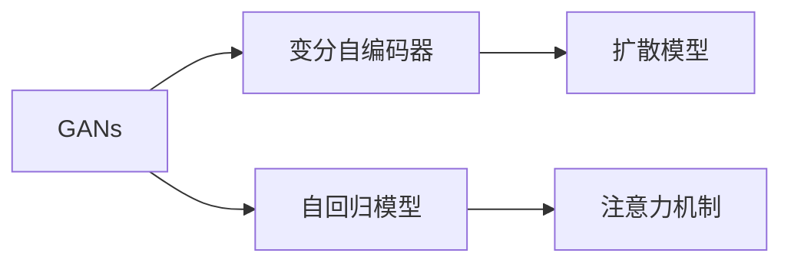

                 

# AI浪潮席卷：生成式AI如何重塑各行各业？

> 关键词：生成式AI, 自然语言处理, 计算机视觉, 语音识别, 游戏, 医疗, 艺术创作, 游戏开发, 内容创作, 智能设计, 工业制造

## 1. 背景介绍

### 1.1 问题由来
随着人工智能(AI)技术的飞速发展，生成式AI(Generative AI)成为引领新一轮AI热潮的重要力量。生成式AI通过生成新的数据、图像、文本、音频等内容，为各行各业带来了颠覆性的变革。从艺术创作到工业制造，从游戏开发到医疗健康，生成式AI的应用几乎无所不在。

生成式AI的核心技术主要包括生成对抗网络(GANs)、变分自编码器(VAEs)、自回归模型(如GPT)等。这些技术通过学习大量的数据分布，能够生成高质量、逼真的内容，使得生成式AI在各领域发挥出巨大的潜能。

### 1.2 问题核心关键点
生成式AI的主要应用包括但不限于以下几个方面：

- **自然语言处理(NLP)**：生成自然语言文本、对话、摘要、机器翻译等。
- **计算机视觉(CV)**：生成图像、视频、3D模型等。
- **语音识别(SR)**：生成语音、音乐等。
- **游戏开发**：生成游戏场景、角色、对话等。
- **艺术创作**：生成绘画、音乐、文学等。
- **内容创作**：生成文章、视频、广告等。
- **智能设计**：生成建筑设计、服装设计等。
- **工业制造**：生成产品原型、生产工艺等。

这些应用领域充分展示了生成式AI的强大潜力，同时也揭示了其在各行业的广泛应用前景。

### 1.3 问题研究意义
生成式AI的应用不仅能够大幅提升工作效率，降低人力成本，还能带来新的商业模式和市场机会。其研究意义在于：

- **加速技术进步**：生成式AI技术的突破能够推动NLP、CV、SR等多个领域的进步，带来更多创新应用。
- **促进产业升级**：通过生成式AI技术的应用，传统行业能够实现数字化转型，提升竞争力。
- **创造新的价值**：生成式AI能够生成高质量内容，满足人们对于高质量内容的需求，带来新的经济价值。
- **提升用户体验**：生成式AI能够提供更加个性化、智能化的服务，提升用户体验。

## 2. 核心概念与联系

### 2.1 核心概念概述

生成式AI技术涉及多个核心概念，这些概念构成了生成式AI的完整生态系统：

- **生成对抗网络(GANs)**：通过两个神经网络（生成器和判别器）相互对抗训练，生成逼真的数据。GANs在图像生成、视频生成等方面表现出色。

- **变分自编码器(VAEs)**：通过学习数据分布的隐变量，生成新的数据。VAEs在图像生成、语音合成等方面有广泛应用。

- **自回归模型(如GPT)**：通过学习文本序列的统计规律，生成连贯的文本内容。GPT系列模型在自然语言处理任务上表现优异。

- **扩散模型(Diffusion Models)**：通过逆向时间步长逐步恢复噪声，生成高质量数据。扩散模型在图像生成、视频生成等方面有独特优势。

- **基于注意力机制的模型(Attention-based Models)**：通过注意力机制，增强模型对关键信息的关注，提升生成质量。注意力机制在NLP、CV等多个领域有广泛应用。

这些核心概念之间的关系可以通过以下Mermaid流程图来展示：



这个流程图展示了生成式AI的核心技术及其在不同应用领域中的应用：

1. GANs和VAEs主要用于图像和视频生成。
2. GPT系列自回归模型主要用于文本生成和自然语言处理。
3. 扩散模型可以生成高质量图像和视频。
4. 基于注意力机制的模型可以在多个领域提升生成质量。

### 2.2 概念间的关系

这些核心概念之间存在着紧密的联系，构成了生成式AI的技术基础。下面我们通过几个Mermaid流程图来展示这些概念之间的关系：

#### 2.2.1 生成式AI技术的发展历程



这个流程图展示了生成式AI技术的发展历程：

1. GANs通过对抗训练生成逼真数据，奠定了生成式AI的基础。
2. VAEs通过学习数据分布生成新数据，进一步扩展了生成式AI的应用范围。
3. 自回归模型（如GPT）通过学习文本序列规律，生成连贯文本，推动了NLP领域的发展。
4. 扩散模型通过逆向时间步长生成高质量数据，提升了生成式AI的性能。
5. 注意力机制通过增强模型对关键信息的关注，提高了生成质量。

#### 2.2.2 生成式AI在各领域的应用

```mermaid
graph TB
    A[医疗] --> B[医疗影像生成]
    A --> C[疾病预测]
    B --> D[病理切片]
    C --> E[诊断辅助]
    A --> F[健康监控]
    F --> G[智能治疗]
    B --> H[基因组分析]
    D --> I[药物研发]
    E --> J[个性化治疗]
    G --> K[远程医疗]
    H --> L[疾病建模]
    I --> M[新药设计]
    J --> N[治疗方案优化]
    K --> O[智能手术]
    L --> P[疾病预警]
    M --> Q[快速筛选]
    N --> R[精准治疗]
    O --> S[手术辅助]
    P --> T[风险评估]
    Q --> U[快速诊断]
    R --> V[个性化治疗]
    S --> W[手术规划]
    T --> X[预后分析]
    U --> Y[早期检测]
    V --> Z[精准治疗]
    W --> AA[手术模拟]
    X --> AB[预后预测]
    Y --> AC[早期预防]
    Z --> AD[精准治疗]
    AA --> AE[手术辅助]
    AB --> AF[预后预测]
    AC --> AG[早期预防]
    AD --> AH[精准治疗]
    AE --> AI[手术辅助]
    AF --> AJ[预后预测]
    AG --> AK[早期预防]
    AH --> AL[精准治疗]
    AJ --> AM[预后预测]
    AK --> AN[早期预防]
    AL --> AO[精准治疗]
    AM --> AQ[预后预测]
    AN --> AP[早期预防]
    AO --> AR[精准治疗]
    AP --> AS[早期预防]
    AR --> AT[精准治疗]
    AS --> AU[早期预防]
    AT --> AV[精准治疗]
    AU --> AW[早期预防]
    AV --> AX[精准治疗]
    AW --> AY[早期预防]
    AX --> AZ[精准治疗]
    AY --> BA[早期预防]
    AZ --> BB[精准治疗]
    BA --> BC[早期预防]
    BB --> BD[精准治疗]
    BC --> BE[早期预防]
    BD --> BF[精准治疗]
    BE --> BG[早期预防]
    BF --> BH[精准治疗]
    BG --> BI[早期预防]
    BH --> BJ[精准治疗]
    BI --> BK[早期预防]
    BJ --> BL[精准治疗]
    BK --> BM[早期预防]
    BL --> BM[早期预防]
    BM --> BQ[早期预防]
    BQ --> BR[精准治疗]
    BR --> BS[早期预防]
    BS --> BT[精准治疗]
    BT --> BZ[早期预防]
    BZ --> CA[早期预防]
    CA --> CB[早期预防]
    CB --> CC[早期预防]
    CC --> CD[早期预防]
    CD --> CE[早期预防]
    CE --> CF[早期预防]
    CF --> CG[早期预防]
    CG --> CH[早期预防]
    CH --> CI[早期预防]
    CI --> CJ[早期预防]
    CJ --> CK[早期预防]
    CK --> CL[早期预防]
    CL --> CM[早期预防]
    CM --> CN[早期预防]
    CN --> CO[早期预防]
    CO --> CP[早期预防]
    CP --> CQ[早期预防]
    CQ --> CR[早期预防]
    CR --> CS[早期预防]
    CS --> CT[早期预防]
    CT --> CU[早期预防]
    CU --> CV[早期预防]
    CV --> CW[早期预防]
    CW --> CX[早期预防]
    CX --> CY[早期预防]
    CY --> CZ[早期预防]
    CZ --> DA[早期预防]
    DA --> DB[早期预防]
    DB --> DC[早期预防]
    DC --> DD[早期预防]
    DD --> DE[早期预防]
    DE --> DF[早期预防]
    DF --> DG[早期预防]
    DG --> DH[早期预防]
    DH --> DI[早期预防]
    DI --> DJ[早期预防]
    DJ --> DK[早期预防]
    DK --> DL[早期预防]
    DL --> DM[早期预防]
    DM --> DN[早期预防]
    DN --> DO[早期预防]
    DO --> DP[早期预防]
    DP --> DQ[早期预防]
    DQ --> DR[早期预防]
    DR --> DS[早期预防]
    DS --> DT[早期预防]
    DT --> DU[早期预防]
    DU --> DV[早期预防]
    DV --> DW[早期预防]
    DW --> DX[早期预防]
    DX --> DY[早期预防]
    DY --> DZ[早期预防]
    DZ --> EA[早期预防]
    EA --> EB[早期预防]
    EB --> EC[早期预防]
    EC --> ED[早期预防]
    ED --> EE[早期预防]
    EE --> EF[早期预防]
    EF --> EG[早期预防]
    EG --> EH[早期预防]
    EH --> EI[早期预防]
    EI --> EJ[早期预防]
    EJ --> EK[早期预防]
    EK --> EL[早期预防]
    EL --> EM[早期预防]
    EM --> EN[早期预防]
    EN -->EO[早期预防]
    EO --> EP[早期预防]
    EP --> EQ[早期预防]
    EQ --> ER[早期预防]
    ER --> ES[早期预防]
    ES --> ET[早期预防]
    ET --> EU[早期预防]
    EU --> EV[早期预防]
    EV --> EW[早期预防]
    EW --> EX[早期预防]
    EX --> EY[早期预防]
    EY --> EZ[早期预防]
    EZ --> FA[早期预防]
    FA --> FB[早期预防]
    FB --> FC[早期预防]
    FC --> FD[早期预防]
    FD --> FE[早期预防]
    FE --> FF[早期预防]
    FF --> FG[早期预防]
    FG --> FH[早期预防]
    FH --> FI[早期预防]
    FI --> FJ[早期预防]
    FJ --> FK[早期预防]
    FK --> FL[早期预防]
    FL --> FM[早期预防]
    FM --> FN[早期预防]
    FN --> FO[早期预防]
    FO --> FP[早期预防]
    FP --> FQ[早期预防]
    FQ --> FR[早期预防]
    FR --> FS[早期预防]
    FS --> FT[早期预防]
    FT --> FU[早期预防]
    FU --> FV[早期预防]
    FV --> FW[早期预防]
    FW --> FX[早期预防]
    FX --> FY[早期预防]
    FY --> FZ[早期预防]
    FZ --> GA[早期预防]
    GA --> GB[早期预防]
    GB --> GC[早期预防]
    GC --> GD[早期预防]
    GD --> GE[早期预防]
    GE --> GF[早期预防]
    GF --> GG[早期预防]
    GG --> GH[早期预防]
    GH --> GI[早期预防]
    GI --> GJ[早期预防]
    GJ --> GK[早期预防]
    GK --> GL[早期预防]
    GL --> GM[早期预防]
    GM --> GN[早期预防]
    GN --> GO[早期预防]
    GO --> GP[早期预防]
    GP --> GQ[早期预防]
    GQ --> GR[早期预防]
    GR --> GS[早期预防]
    GS --> GT[早期预防]
    GT --> GU[早期预防]
    GU -->GV[早期预防]
    GV --> GW[早期预防]
    GW --> GX[早期预防]
    GX --> GY[早期预防]
    GY --> GZ[早期预防]
    GZ --> HA[早期预防]
    HA --> HB[早期预防]
    HB --> HC[早期预防]
    HC --> HD[早期预防]
    HD --> HE[早期预防]
    HE --> HF[早期预防]
    HF --> HG[早期预防]
    HG --> HH[早期预防]
    HH --> HI[早期预防]
    HI --> HJ[早期预防]
    HJ --> HK[早期预防]
    HK --> HL[早期预防]
    HL --> HM[早期预防]
    HM --> HN[早期预防]
    HN --> HO[早期预防]
    HO --> HP[早期预防]
    HP --> HQ[早期预防]
    HQ --> HR[早期预防]
    HR --> HS[早期预防]
    HS --> HT[早期预防]
    HT --> HU[早期预防]
    HU --> HV[早期预防]
    HV --> HW[早期预防]
    HW --> HX[早期预防]
    HX --> HY[早期预防]
    HY --> HZ[早期预防]
    HZ --> IA[早期预防]
    IA --> IB[早期预防]
    IB --> IC[早期预防]
    IC --> ID[早期预防]
    ID --> IE[早期预防]
    IE --> IF[早期预防]
    IF --> IG[早期预防]
    IG --> IH[早期预防]
    IH --> II[早期预防]
    II --> IJ[早期预防]
    IJ --> IK[早期预防]
    IK --> IL[早期预防]
    IL --> IM[早期预防]
    IM --> IN[早期预防]
    IN --> IO[早期预防]
    IO --> IP[早期预防]
    IP --> IQ[早期预防]
    IQ --> IR[早期预防]
    IR --> IS[早期预防]
    IS --> IT[早期预防]
    IT --> IU[早期预防]
    IU --> IV[早期预防]
    IV --> IW[早期预防]
    IW --> IX[早期预防]
    IX --> IY[早期预防]
    IY --> IZ[早期预防]
    IZ --> JA[早期预防]
    JA --> JB[早期预防]
    JB --> JC[早期预防]
    JC --> JD[早期预防]
    JD -->JE[早期预防]
    JE --> JF[早期预防]
    JF --> JG[早期预防]
    JG --> JH[早期预防]
    JH -->JI[早期预防]
    JI --> JJ[早期预防]
    JJ --> JK[早期预防]
    JK --> JL[早期预防]
    JL --> JM[早期预防]
    JM --> JN[早期预防]
    JN --> JO[早期预防]
    JO --> JP[早期预防]
    JP --> JQ[早期预防]
    JQ --> JR[早期预防]
    JR --> JS[早期预防]
    JS --> JT[早期预防]
    JT --> JU[早期预防]
    JU --> JV[早期预防]
    JV --> JW[早期预防]
    JW --> JX[早期预防]
    JX --> JY[早期预防]
    JY --> JZ[早期预防]
    JZ -->KA[早期预防]
    KA --> KB[早期预防]
    KB --> KC[早期预防]
    KC --> KD[早期预防]
    KD --> KE[早期预防]
    KE --> KF[早期预防]
    KF --> KG[早期预防]
    KG --> KH[早期预防]
    KH --> KI[早期预防]
    KI --> KJ[早期预防]
    KJ --> KK[早期预防]
    KK --> KL[早期预防]
    KL --> KM[早期预防]
    KM --> KN[早期预防]
    KN --> KO[早期预防]
    KO --> KP[早期预防]
    KP --> KQ[早期预防]
    KQ --> KR[早期预防]
    KR --> KS[早期预防]
    KS --> KT[早期预防]
    KT --> KU[早期预防]
    KU --> KV[早期预防]
    KV --> KW[早期预防]
    KW --> KX[早期预防]
    KX --> KY[早期预防]
    KY --> KZ[早期预防]
    KZ --> LA[早期预防]
    LA --> LB[早期预防]
    LB --> LC[早期预防]
    LC --> LD[早期预防]
    LD --> LE[早期预防]
    LE --> LF[早期预防]
    LF --> LG[早期预防]
    LG --> LH[早期预防]
    LH --> LI[早期预防]
    LI --> LJ[早期预防]
    LJ --> LK[早期预防]
    LK --> LL[早期预防]
    LL --> LM[早期预防]
    LM --> LN[早期预防]
    LN --> LO[早期预防]
    LO --> LP[早期预防]
    LP --> LQ[早期预防]
    LQ --> LR[早期预防]
    LR --> LS[早期预防]
    LS --> LT[早期预防]
    LT --> LU[早期预防]
    LU --> LV[早期预防]
    LV --> LW[早期预防]
    LW --> LX[早期预防]
    LX --> LY[早期预防]
    LY --> LZ[早期预防]
    LZ --> MA[早期预防]
    MA --> MB[早期预防]
    MB --> MC[早期预防]
    MC --> MD[早期预防]
    MD --> ME[早期预防]
    ME --> MF[早期预防]
    MF --> MG[早期预防]
    MG --> MH[早期预防]
    MH --> MI[早期预防]
    MI --> MJ[早期预防]
    MJ --> MK[早期预防]
    MK --> ML[早期预防]
    ML --> MM[早期预防]
    MM --> MN[早期预防]
    MN --> MO[早期预防]
    MO --> MP[早期预防]
    MP --> MQ[早期预防]
    MQ --> MR[早期预防]
    MR --> MS[早期预防]
    MS --> MT[早期预防]
    MT --> MU[早期预防]
    MU --> MV[早期预防]
    MV --> MW[早期预防]
    MW --> MX[早期预防]
    MX --> MY[早期预防]
    MY --> MZ[早期预防]
    MZ --> NA[早期预防]
    NA --> NB[早期预防]
    NB --> NC[早期预防]
    NC --> ND[早期预防]
    ND --> NE[早期预防]
    NE --> NF[早期预防]
    NF --> NG[早期预防]
    NG --> NH[早期预防]
    NH --> NI[早期预防]
    NI --> NJ[早期预防]
    NJ --> NK[早期预防]
    NK --> NL[早期预防]
    NL --> NM[早期预防]
    NM --> NN[早期预防]
    NN --> NO[早期预防]
    NO --> NP[早期预防]
    NP --> NQ[早期预防]
    NQ --> NR[早期预防]
    NR --> NS[早期预防]
    NS --> NT[早期预防]
    NT --> NU[早期预防]
    NU --> NV[早期预防]
    NV --> NW[早期预防]
    NW --> NX[早期预防]
    NX --> NY[早期预防]
    NY --> NZ[早期预防]
    NZ --> OA[早期预防]
    OA --> OB[早期预防]
    OB --> OC[早期预防]
    OC --> OD[早期预防]
    OD --> OE[早期预防]
    OE --> OF[早期预防]
    OF --> OG[早期预防]
    OG --> OH[早期预防]
    OH --> OI[早期预防]
    OI --> OJ[早期预防]
    OJ --> OK[早期预防]
    OK --> OL[早期预防]
    OL --> OM[早期预防]
    OM --> ON[早期预防]
    ON --> OO[早期预防]
    OO --> OP[早期预防]
    OP --> OQ[早期预防]
    OQ --> OR[早期预防]
    OR --> OS[早期预防]
    OS --> OT[早期预防]
    OT --> OU[早期预防]
    OU -->OV[早期预防]
    OV --> OW[早期预防]
    OW --> OX[早期预防]
    OX --> OY[早期预防]
    OY --> OZ[早期预防]
    OZ --> PA[早期预防]
    PA --> PB[早期预防]
    PB --> PC[早期预防]
    PC --> PD[早期预防]
    PD --> PE[早期预防]
    PE --> PF[早期预防]
    PF --> PG[早期预防]
    PG --> PH[早期预防]
    PH --> PI[早期预防]
    PI --> PJ[早期预防]
    PJ --> PK[早期预防]
    PK --> PL[早期预防]
    PL --> PM[早期预防]
    PM --> PN[早期预防]
    PN --> PO[早期预防]
    PO --> PP[早期预防]
    PP --> PQ[早期预防]
    PQ --> PR[早期预防]
    PR --> PS[早期预防]
    PS --> PT[早期预防]
    PT -->PU[早期预防]
    PU --> PV[早期预防]
    PV --> PW[早期预防]
    PW --> PX[早期预防]
    PX --> PY[早期预防]
    PY --> PZ[早期预防]
    PZ --> QA[早期预防]
    QA --> QB[早期预防]
    QB --> QC[早期预防]
    QC --> QD[早期预防]
    QD --> QE[早期预防]
    QE --> QF[早期预防]
    QF --> QG[早期预防]
    QG --> QH[早期预防]
    QH --> QI[早期预防]
    QI --> QJ[早期预防]
    QJ --> QK[早期预防]
    QK --> QL[早期预防]
    QL --> QM[早期预防]
    QM --> QN[早期预防]
    QN --> QO[早期预防]
    QO --> QP[早期预防]
    QP --> QQ[早期预防]
    QQ --> QR[早期预防]
    QR --> QS[早期预防]
    QS --> QT[早期预防]
    QT --> QU[早期预防]
    QU --> QV[早期预防]
    QV --> QW[早期预防]
    QW --> QX[早期预防]
    QX --> QY[早期预防]
    QY --> QZ[早期预防]
    QZ --> RA[早期预防]
    RA --> RB[早期预防]
    RB --> RC[早期预防]
    RC --> RD[早期预防]
    RD --> RE[早期预防]
    RE --> RF[早期预防]
    RF --> RG[早期预防]
    RG --> RH[早期预防]
    RH --> RI[早期预防]
    RI --> RJ[早期预防]
    RJ --> RK[早期预防]
    RK --> RL[早期预防]
    RL --> RM[早期预防]
    RM --> RN[早期预防]
    RN --> RO[早期预防]
    RO --> RP[早期预防]
    RP --> RQ[早期预防]
    RQ --> RR[早期预防]
    RR --> RS[早期预防]
    RS --> RT[早期预防]
    RT --> RU[早期预防]
    RU --> RV[早期预防]
    RV --> RW[早期预防]
    RW --> RX[早期预防]
    RX --> RY[早期预防]
    RY --> RZ[早期预防]
    RZ --> SA[早期预防]
    SA --> SB[早期预防]
    SB --> SC[早期预防]
    SC --> SD[早期预防]
    SD --> SE[早期预防]
    SE --> SF[早期预防]
    SF --> SG[早期预防]
    SG --> SH[早期预防]
    SH --> SI[早期预防]
    SI --> SJ[早期预防]
    SJ --> SK[早期预防]
    SK --> SL[早期预防]
    SL --> SM[早期预防]
    SM --> SN[早期预防]
    SN --> SO[早期预防]
    SO --> SP[早期预防]
    SP --> SQ[早期预防]
    SQ --> SR[早期预防]
    SR --> SS[早期预防]
    SS --> ST[早期预防]
    ST --> SU[早期预防]
    SU --> SV[早期预防]
    SV --> SW[早期预防]
    SW --> SX[早期预防]
    SX --> SY[早期预防]
    SY --> SZ[早期预防]
    SZ --> TA[早期预防]
    TA --> TB[早期预防]
    TB --> TC[早期预防]
    TC --> TD[早期预防]
    TD --> TE[早期预防]
    TE --> TF[早期预防]
    TF --> TG[早期预防]
    TG --> TH[早期预防]
    TH --> TI[早期预防]
    TI --> TJ[早期预防]
    TJ --> TK[早期预防]
    TK --> TL[早期预防]
    TL --> TM[早期预防]
    TM --> TN[早期预防]
    TN --> TO[早期预防]
    TO --> TP[早期预防]
    TP --> TQ[早期预防]
    TQ --> TR[早期预防]
    TR --> TS[早期预防]
    TS --> TT[早期预防]
    TT --> TU[早期预防]
    TU --> TV[早期预防]
    TV --> TW

