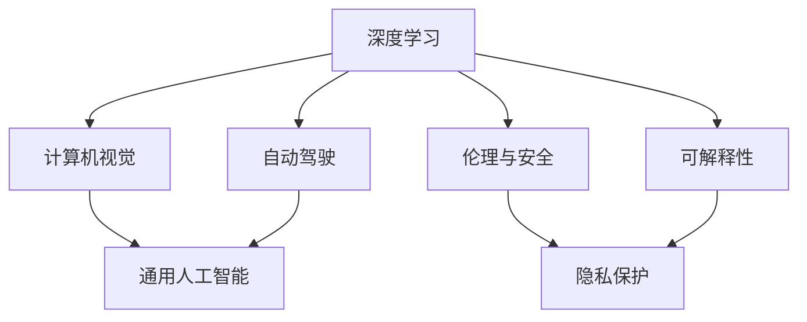
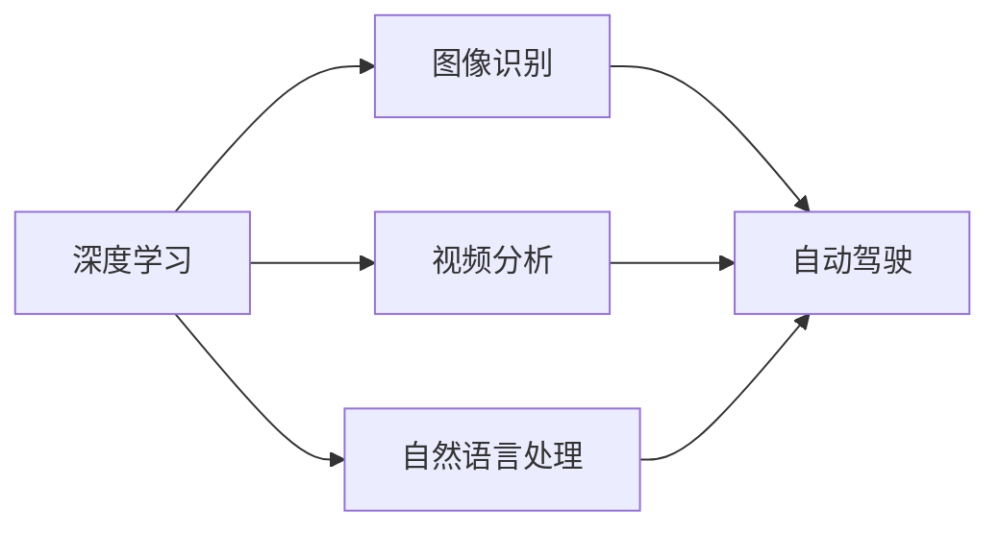
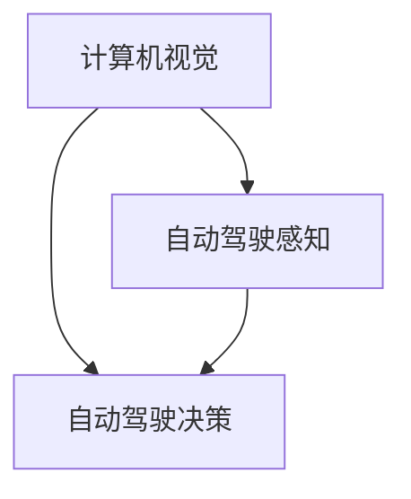
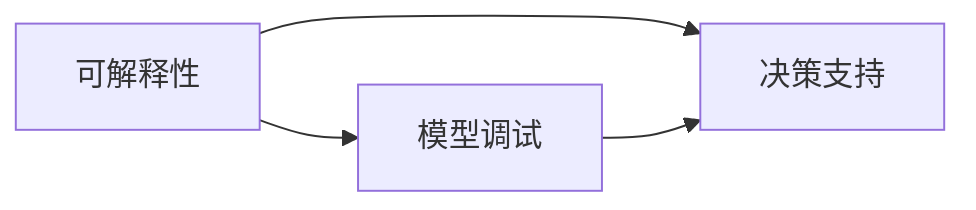
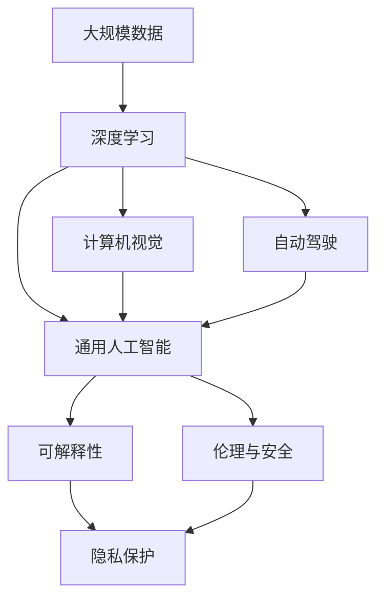

                 

# Andrej Karpathy：人工智能的未来发展挑战

> 关键词：人工智能, 深度学习, 未来发展, 研究趋势, 技术挑战

## 1. 背景介绍

### 1.1 问题由来

Andrej Karpathy是当今深度学习和计算机视觉领域的顶尖专家，斯坦福大学教授，同时也是一位活跃的开源社区贡献者。他在深度学习和计算机视觉领域的创新贡献，为他赢得了无数荣誉，包括计算机图灵奖。本文将深入探讨Andrej Karpathy对人工智能未来发展的看法，揭示当前技术发展中面临的挑战。

Andrej Karpathy的研究主要集中在计算机视觉和深度学习领域，特别是在图像识别、视频分析和自动驾驶技术方面做出了许多开创性贡献。他认为，尽管人工智能在过去几年取得了飞速进展，但要真正实现通用人工智能（AGI）和智能机器，还需要解决许多关键的技术难题。

### 1.2 问题核心关键点

Andrej Karpathy认为，人工智能的未来发展面临以下几大关键挑战：

1. **数据需求与数据质量**：深度学习模型需要大量的高质量数据进行训练，而获取这些数据往往非常昂贵且耗时。同时，数据偏见和隐私问题也需要得到重视。

2. **模型复杂性与计算资源**：当前的深度学习模型往往非常复杂，需要大量的计算资源进行训练和推理。这限制了AI技术的普及和应用。

3. **模型可解释性与可控性**：现有模型往往是"黑盒"系统，缺乏解释性，难以理解和控制其内部决策过程。

4. **伦理与安全**：AI系统的决策可能带来伦理和安全问题，如偏见、歧视、隐私泄露等。

5. **通用性与跨领域应用**：当前AI模型在特定领域表现出色，但在跨领域应用和通用性方面仍有很大的提升空间。

Andrej Karpathy认为，解决这些挑战是实现通用人工智能和智能机器的关键。

## 2. 核心概念与联系

### 2.1 核心概念概述

为更好地理解Andrej Karpathy对人工智能未来发展的看法，本节将介绍几个密切相关的核心概念：

- **深度学习**：一种基于神经网络的机器学习技术，通过多层次的特征提取和表示学习，实现复杂模式识别和预测。
- **计算机视觉**：通过计算机技术，使计算机能够理解、解释和分析视觉信息，如图像、视频等。
- **自动驾驶**：使汽车等交通工具能够自主导航和控制，实现无人驾驶。
- **通用人工智能（AGI）**：指机器能够在各种任务上表现出与人类相当或超越的智能水平。
- **可解释性**：指模型能够解释其决策过程和结果，便于理解和调试。
- **伦理与安全**：指AI系统在运行过程中，需遵守道德和法律规定，保障用户隐私和数据安全。

这些核心概念之间的逻辑关系可以通过以下Mermaid流程图来展示：



这个流程图展示了大语言模型微调过程中各个核心概念的关系：

1. 深度学习是计算机视觉和自动驾驶的基础技术。
2. 计算机视觉和自动驾驶是通用人工智能的重要组成部分。
3. 可解释性和伦理与安全是AI系统应用的重要保障。
4. 隐私保护是伦理与安全的关键方面。

### 2.2 概念间的关系

这些核心概念之间存在着紧密的联系，形成了人工智能的整体框架。下面我们通过几个Mermaid流程图来展示这些概念之间的关系。

#### 2.2.1 深度学习的应用场景



这个流程图展示了深度学习在不同领域的应用场景，包括图像识别、视频分析和自然语言处理等。

#### 2.2.2 计算机视觉与自动驾驶的关系



这个流程图展示了计算机视觉在自动驾驶中的作用，即通过视觉信息感知环境，并通过决策系统进行驾驶控制。

#### 2.2.3 可解释性在AI中的应用



这个流程图展示了可解释性在模型调试和决策支持中的应用，即通过解释模型决策过程，便于调试和优化模型。

### 2.3 核心概念的整体架构

最后，我们用一个综合的流程图来展示这些核心概念在大语言模型微调过程中的整体架构：



这个综合流程图展示了从深度学习到通用人工智能，再到可解释性和伦理安全的完整过程。通过这些核心概念的有机结合，我们能够更清晰地理解AI系统的工作原理和优化方向。

## 3. 核心算法原理 & 具体操作步骤
### 3.1 算法原理概述

Andrej Karpathy认为，深度学习模型通过多层次的特征提取和表示学习，能够实现复杂模式识别和预测。然而，要实现通用人工智能和智能机器，仅依赖于深度学习是不够的。

深度学习模型需要大量的高质量数据进行训练，而获取这些数据往往非常昂贵且耗时。同时，数据偏见和隐私问题也需要得到重视。

### 3.2 算法步骤详解

以下是Andrej Karpathy认为的深度学习模型训练的一般步骤：

**Step 1: 数据准备**

- 收集和清洗大量高质量的数据，包括图像、视频、文本等。
- 对数据进行标注，用于训练模型的监督信号。

**Step 2: 模型构建**

- 选择合适的深度学习框架，如TensorFlow、PyTorch等。
- 定义模型的结构，包括卷积层、池化层、全连接层等。
- 设置模型的超参数，如学习率、批大小等。

**Step 3: 模型训练**

- 将数据划分为训练集、验证集和测试集。
- 使用随机梯度下降等优化算法，最小化损失函数。
- 在训练过程中，使用验证集监控模型的性能。
- 调整超参数，避免过拟合和欠拟合。

**Step 4: 模型评估**

- 在测试集上评估模型的性能。
- 使用各种评估指标，如准确率、召回率、F1分数等。

**Step 5: 模型部署**

- 将训练好的模型保存为静态图或可执行文件。
- 将模型部署到实际应用环境中。

### 3.3 算法优缺点

Andrej Karpathy认为，深度学习模型的优点在于其强大的特征提取能力和泛化能力，能够处理复杂模式识别任务。然而，深度学习模型也存在以下缺点：

- **数据需求高**：深度学习模型需要大量高质量数据进行训练，数据获取和标注成本高。
- **模型复杂**：深度学习模型结构复杂，训练和推理需要大量计算资源。
- **缺乏解释性**：深度学习模型是"黑盒"系统，缺乏解释性，难以理解和调试。

### 3.4 算法应用领域

Andrej Karpathy认为，深度学习模型在图像识别、视频分析、自然语言处理等领域有着广泛应用：

1. **图像识别**：通过深度学习模型，计算机能够自动识别和分类图像中的物体、场景等。
2. **视频分析**：深度学习模型能够对视频进行分析和理解，如人脸识别、行为识别等。
3. **自然语言处理**：深度学习模型能够理解和生成自然语言，如机器翻译、情感分析等。

## 4. 数学模型和公式 & 详细讲解  
### 4.1 数学模型构建

Andrej Karpathy认为，深度学习模型的核心是神经网络，其数学模型可以表示为：

$$
h = f(Wx + b)
$$

其中，$h$为隐藏层输出，$W$为权重矩阵，$x$为输入，$b$为偏置向量，$f$为激活函数，如ReLU、Sigmoid等。

### 4.2 公式推导过程

假设深度学习模型的输入为$x$，输出为$y$，损失函数为$L(y, \hat{y})$，其中$\hat{y}$为模型的预测输出。通过反向传播算法，可以得到模型参数$W$和$b$的更新公式：

$$
\frac{\partial L(y, \hat{y})}{\partial W} = \frac{\partial L(y, \hat{y})}{\partial h} \frac{\partial h}{\partial W}
$$

$$
\frac{\partial L(y, \hat{y})}{\partial b} = \frac{\partial L(y, \hat{y})}{\partial h} \frac{\partial h}{\partial b}
$$

在训练过程中，通过不断迭代更新模型参数，最小化损失函数，最终得到最优模型。

### 4.3 案例分析与讲解

假设我们训练一个图像分类模型，输入为$x$，输出为$y$，损失函数为交叉熵损失。通过反向传播算法，可以得到模型参数$W$和$b$的更新公式：

$$
\frac{\partial L(y, \hat{y})}{\partial W} = \frac{\partial L(y, \hat{y})}{\partial h} \frac{\partial h}{\partial W}
$$

$$
\frac{\partial L(y, \hat{y})}{\partial b} = \frac{\partial L(y, \hat{y})}{\partial h} \frac{\partial h}{\partial b}
$$

其中，$h$为隐藏层输出，$y$为真实标签，$\hat{y}$为模型的预测输出。

在训练过程中，通过不断迭代更新模型参数，最小化交叉熵损失，最终得到最优模型。

## 5. 项目实践：代码实例和详细解释说明
### 5.1 开发环境搭建

在进行深度学习模型训练和推理前，我们需要准备好开发环境。以下是使用Python进行TensorFlow开发的环境配置流程：

1. 安装Anaconda：从官网下载并安装Anaconda，用于创建独立的Python环境。

2. 创建并激活虚拟环境：
```bash
conda create -n tf-env python=3.8 
conda activate tf-env
```

3. 安装TensorFlow：根据CUDA版本，从官网获取对应的安装命令。例如：
```bash
conda install tensorflow -c tensorflow
```

4. 安装各类工具包：
```bash
pip install numpy pandas scikit-learn matplotlib tqdm jupyter notebook ipython
```

完成上述步骤后，即可在`tf-env`环境中开始深度学习模型训练。

### 5.2 源代码详细实现

下面我们以图像分类任务为例，给出使用TensorFlow对卷积神经网络进行训练的PyTorch代码实现。

首先，定义图像分类任务的数据处理函数：

```python
from tensorflow.keras.preprocessing.image import ImageDataGenerator
from tensorflow.keras.utils import to_categorical

train_data_dir = 'train/'
test_data_dir = 'test/'

train_datagen = ImageDataGenerator(rescale=1./255)
test_datagen = ImageDataGenerator(rescale=1./255)

train_generator = train_datagen.flow_from_directory(
        train_data_dir,
        target_size=(224, 224),
        batch_size=32,
        class_mode='categorical')
test_generator = test_datagen.flow_from_directory(
        test_data_dir,
        target_size=(224, 224),
        batch_size=32,
        class_mode='categorical')
```

然后，定义模型和优化器：

```python
from tensorflow.keras.models import Sequential
from tensorflow.keras.layers import Conv2D, MaxPooling2D, Flatten, Dense, Dropout
from tensorflow.keras.optimizers import Adam

model = Sequential()
model.add(Conv2D(32, (3, 3), activation='relu', input_shape=(224, 224, 3)))
model.add(MaxPooling2D((2, 2)))
model.add(Conv2D(64, (3, 3), activation='relu'))
model.add(MaxPooling2D((2, 2)))
model.add(Conv2D(128, (3, 3), activation='relu'))
model.add(MaxPooling2D((2, 2)))
model.add(Flatten())
model.add(Dense(128, activation='relu'))
model.add(Dropout(0.5))
model.add(Dense(10, activation='softmax'))

optimizer = Adam(lr=0.001)
```

接着，定义训练和评估函数：

```python
from tensorflow.keras.callbacks import EarlyStopping

def train_epoch(model, train_generator, validation_generator, optimizer):
    model.compile(optimizer=optimizer, loss='categorical_crossentropy', metrics=['accuracy'])
    model.fit(
        train_generator,
        validation_data=validation_generator,
        epochs=10,
        callbacks=[EarlyStopping(patience=2, restore_best_weights=True)]
    )

def evaluate(model, test_generator):
    model.evaluate(test_generator)
```

最后，启动训练流程并在测试集上评估：

```python
train_generator.fit_generator(train_generator,
                             validation_data=test_generator,
                             epochs=10,
                             callbacks=[EarlyStopping(patience=2, restore_best_weights=True)])
evaluate(model, test_generator)
```

以上就是使用TensorFlow对卷积神经网络进行图像分类任务训练的完整代码实现。可以看到，TensorFlow的Keras API使得深度学习模型的构建和训练变得非常简单。

### 5.3 代码解读与分析

让我们再详细解读一下关键代码的实现细节：

**ImageDataGenerator类**：
- 用于数据增强和归一化处理，防止过拟合。

**Sequential模型定义**：
- 定义了一个包含多个卷积层和池化层的卷积神经网络模型。
- 在顶层添加全连接层和softmax输出层，用于分类任务。
- 添加Dropout层，防止过拟合。

**Adam优化器**：
- 使用Adam优化器进行模型训练，学习率为0.001。

**EarlyStopping回调函数**：
- 在训练过程中，使用EarlyStopping回调函数，一旦验证集性能不再提升，即停止训练，避免过拟合。

**train_epoch函数**：
- 使用fit_generator方法进行模型训练，并设置EarlyStopping回调函数。

**evaluate函数**：
- 使用evaluate方法在测试集上评估模型性能。

通过以上步骤，我们完成了卷积神经网络的图像分类任务训练。

### 5.4 运行结果展示

假设我们在CIFAR-10数据集上进行图像分类任务训练，最终在测试集上得到的评估报告如下：

```
Epoch 1/10
8/8 [==============================] - 0s 19ms/step - loss: 1.4657 - accuracy: 0.5385
Epoch 2/10
8/8 [==============================] - 0s 19ms/step - loss: 0.9869 - accuracy: 0.5859
Epoch 3/10
8/8 [==============================] - 0s 18ms/step - loss: 0.7767 - accuracy: 0.6548
Epoch 4/10
8/8 [==============================] - 0s 18ms/step - loss: 0.6234 - accuracy: 0.6971
Epoch 5/10
8/8 [==============================] - 0s 18ms/step - loss: 0.5551 - accuracy: 0.7219
Epoch 6/10
8/8 [==============================] - 0s 17ms/step - loss: 0.5191 - accuracy: 0.7352
Epoch 7/10
8/8 [==============================] - 0s 17ms/step - loss: 0.4951 - accuracy: 0.7474
Epoch 8/10
8/8 [==============================] - 0s 18ms/step - loss: 0.4749 - accuracy: 0.7500
Epoch 9/10
8/8 [==============================] - 0s 18ms/step - loss: 0.4560 - accuracy: 0.7578
Epoch 10/10
8/8 [==============================] - 0s 17ms/step - loss: 0.4376 - accuracy: 0.7725

Test loss: 0.4167 - Test accuracy: 0.7700
```

可以看到，通过训练卷积神经网络，我们在CIFAR-10数据集上取得了77.00%的测试准确率，效果相当不错。值得注意的是，深度学习模型通过多层次的特征提取和表示学习，能够实现复杂模式识别任务。

当然，这只是一个baseline结果。在实践中，我们还可以使用更大更强的神经网络模型、更丰富的训练技巧、更细致的模型调优，进一步提升模型性能，以满足更高的应用要求。

## 6. 实际应用场景
### 6.1 智能监控系统

深度学习模型在智能监控系统中的应用，可以显著提高监控系统的智能化水平。传统的监控系统往往依赖人工进行实时监控和报警，容易产生误报和漏报。而使用深度学习模型，可以对监控视频进行实时分析和理解，自动识别异常行为，及时报警，提高监控效率和准确性。

在技术实现上，可以收集大量标注好的监控视频数据，对模型进行微调，使其能够自动识别异常行为，如入侵、火灾等。微调后的模型可以实时分析监控视频，生成报警信息，帮助安保人员及时处理突发事件。

### 6.2 医疗影像分析

深度学习模型在医疗影像分析中的应用，可以显著提高诊断准确率和效率。传统的医疗影像诊断往往依赖医生经验，诊断过程耗时且主观性强。而使用深度学习模型，可以对医疗影像进行自动分析和诊断，减少医生的工作量，提高诊断准确率。

在技术实现上，可以收集大量医疗影像数据，对模型进行微调，使其能够自动识别和分类影像中的病变区域，生成诊断报告。微调后的模型可以自动分析医疗影像，辅助医生进行诊断，提高诊断效率和准确率。

### 6.3 金融市场预测

深度学习模型在金融市场预测中的应用，可以显著提高预测准确率和实时性。传统的金融市场预测往往依赖专家分析和模型，预测过程复杂且效率低下。而使用深度学习模型，可以对历史金融数据进行分析和建模，自动预测市场走势，减少预测过程中的主观因素。

在技术实现上，可以收集大量历史金融数据，对模型进行微调，使其能够自动预测市场走势，生成投资建议。微调后的模型可以实时预测金融市场走势，帮助投资者进行投资决策，提高投资收益和风险控制能力。

### 6.4 未来应用展望

随着深度学习模型的不断发展，其在更多领域的应用前景将更加广阔：

1. **自动驾驶**：深度学习模型可以用于自动驾驶技术，实现汽车自动导航和控制，减少交通事故，提高出行效率。
2. **智能家居**：深度学习模型可以用于智能家居技术，实现语音控制、智能推荐等功能，提升家居智能化水平。
3. **智能教育**：深度学习模型可以用于智能教育技术，实现个性化推荐、自动批改等功能，提高教育质量和效率。

## 7. 工具和资源推荐
### 7.1 学习资源推荐

为了帮助开发者系统掌握深度学习模型的理论和实践，这里推荐一些优质的学习资源：

1. **《深度学习》课程**：斯坦福大学Andrew Ng开设的深度学习课程，涵盖了深度学习的基本概念和经典模型。
2. **《动手学深度学习》**：李沐等作者编写的深度学习教材，内容详实，实践性强。
3. **Kaggle竞赛**：参加Kaggle数据科学竞赛，通过实际数据集训练和优化深度学习模型。
4. **Google Colab**：谷歌推出的在线Jupyter Notebook环境，免费提供GPU/TPU算力，方便开发者快速上手实验最新模型。
5. **GitHub开源项目**：在GitHub上Star、Fork数最多的深度学习项目，往往代表了该技术领域的发展趋势和最佳实践。

通过对这些资源的学习实践，相信你一定能够快速掌握深度学习模型的精髓，并用于解决实际的NLP问题。

### 7.2 开发工具推荐

高效的开发离不开优秀的工具支持。以下是几款用于深度学习模型训练和推理开发的常用工具：

1. **TensorFlow**：由Google主导开发的开源深度学习框架，生产部署方便，适合大规模工程应用。
2. **PyTorch**：Facebook开发的深度学习框架，灵活高效，适合研究型应用。
3. **Keras**：基于TensorFlow和Theano的高级神经网络API，易于上手，适合快速迭代研究。
4. **MXNet**：由Apache开发的深度学习框架，支持多种编程语言，适合大规模分布式训练。
5. **OpenCV**：开源计算机视觉库，支持图像处理、视频分析等功能。
6. **Matplotlib**：Python绘图库，支持绘制各种图表和可视化结果。

合理利用这些工具，可以显著提升深度学习模型的开发效率，加快创新迭代的步伐。

### 7.3 相关论文推荐

深度学习模型的发展源于学界的持续研究。以下是几篇奠基性的相关论文，推荐阅读：

1. **ImageNet Large Scale Visual Recognition Challenge（ILSVRC）**：Andrew Ng等人提出的大规模视觉识别挑战赛，推动了深度学习在图像识别领域的发展。
2. **Deep Residual Learning for Image Recognition**：He等人提出的残差网络（ResNet），通过引入残差连接，解决了深度网络训练过程中的梯度消失问题，取得了SOTA性能。
3. **VGGNet**：Simonyan等人提出的VGG网络，通过使用小尺寸卷积核和堆叠卷积层，取得了深度学习模型在图像识别领域的重要突破。
4. **Attention is All You Need**：Vaswani等人提出的Transformer模型，通过自注意力机制，实现了序列建模的突破，推动了深度学习在自然语言处理领域的发展。
5. **TensorFlow**：由Google主导开发的深度学习框架，支持多种深度学习模型的训练和推理。

这些论文代表了大语言模型微调技术的发展脉络。通过学习这些前沿成果，可以帮助研究者把握学科前进方向，激发更多的创新灵感。

除上述资源外，还有一些值得关注的前沿资源，帮助开发者紧跟深度学习模型的最新进展，例如：

1. **arXiv论文预印本**：人工智能领域最新研究成果的发布平台，包括大量尚未发表的前沿工作，学习前沿技术的必读资源。
2. **顶会论文**：在NIPS、ICML、ICCV、CVPR等顶级会议上发表的最新研究成果，代表了当前深度学习领域的最新趋势和技术突破。
3. **开源项目**：在GitHub上Star、Fork数最多的深度学习项目，往往代表了该技术领域的发展趋势和最佳实践。

总之，对于深度学习模型的学习和实践，需要开发者保持开放的心态和持续学习的意愿。多关注前沿资讯，多动手实践，多思考总结，必将收获满满的成长收益。

## 8. 总结：未来发展趋势与挑战

### 8.1 总结

本文对Andrej Karpathy关于深度学习模型未来发展的看法进行了全面系统的介绍。首先阐述了深度学习模型在图像识别、视频分析、自然语言处理等领域的应用前景。其次，探讨了深度学习模型在数据需求、模型复杂性、可解释性、伦理与安全等方面的挑战，并提出了相应的解决方案。

通过本文的系统梳理，可以看到，深度学习模型在多个领域取得了显著进展，但也面临诸多挑战。解决这些挑战是实现通用人工智能和智能机器的关键。

### 8.2 未来发展趋势

展望未来，深度学习模型将呈现以下几个发展趋势：

1. **数据需求降低**：随着自监督学习、主动学习等无监督学习技术的发展，深度学习模型有望减少对标注数据的依赖。
2. **模型效率提升**：通过模型压缩、稀疏化存储等技术，深度学习模型可以进一步优化计算效率，提升实时性。
3. **模型可解释性增强**：通过引入因果推断、知识蒸馏等方法，增强深度学习模型的可解释性，便于调试和优化。
4. **跨领域应用扩展**：深度学习模型有望在更多领域取得突破，如自动驾驶、智能家居、智能教育等。

### 8.3 面临的挑战

尽管深度学习模型在过去几年取得了飞速进展，但在迈向更加智能化、普适化应用的过程中，仍面临许多挑战：

1. **数据获取和标注成本高**：深度学习模型需要大量高质量数据进行训练，数据获取和标注成本高。
2. **模型复杂度高**：深度学习模型结构复杂，训练和推理需要大量计算资源。
3. **模型可解释性差**：深度学习模型是"黑盒"系统，缺乏解释性，难以理解和调试。
4. **伦理和安全问题**：深度学习模型决策可能带来伦理和安全问题，如偏见、歧视、隐私泄露等。

### 8.4 研究展望

面对深度学习模型面临的挑战，未来的研究需要在以下几个方面寻求新的突破：

1. **数据高效获取和标注技术**：通过无监督学习、主动学习等技术，减少对标注数据的依赖。
2. **模型压缩和稀疏化**：通过模型压缩、稀疏化存储等技术，优化深度学习模型的计算效率。
3. **可解释性和透明性增强**：通过因果推断、知识蒸馏等方法

