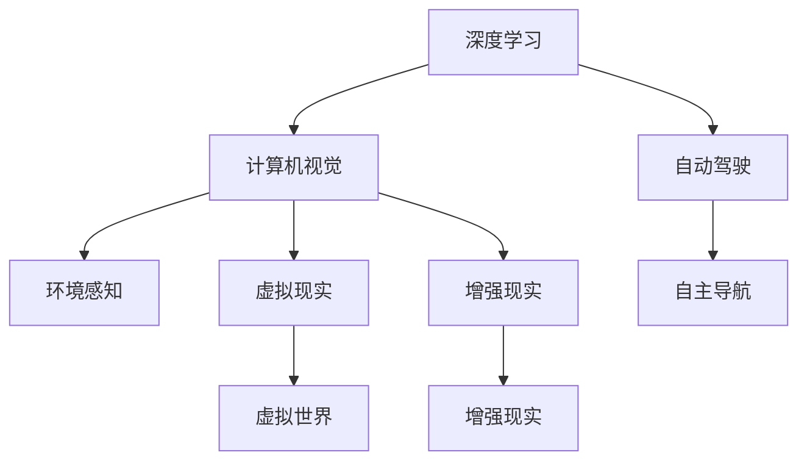

                 

# Andrej Karpathy：人工智能的未来发展方向

> 关键词：人工智能, 深度学习, 计算机视觉, 自动驾驶, 计算机图形学

## 1. 背景介绍

安德烈·卡帕西（Andrej Karpathy）是当今深度学习领域最为杰出的研究者之一，以其在计算机视觉和自动驾驶领域的突破性贡献闻名。本文将探讨卡帕西在其近期演讲和文章中提出的关于人工智能未来发展的方向和思考。

## 2. 核心概念与联系

### 2.1 核心概念概述

要理解卡帕西对人工智能未来的展望，首先要理解以下几个关键概念：

- **深度学习**：一种基于多层神经网络的机器学习技术，可以处理大规模的复杂非线性数据。
- **计算机视觉**：使计算机能够“看”和理解图像和视频内容的学科。
- **自动驾驶**：利用人工智能技术使汽车自主导航和驾驶。
- **计算机图形学**：研究如何创建和操作图形与动画的学科。

这些概念共同构成了卡帕西在人工智能领域的核心研究范畴。

### 2.2 核心概念间的关系

卡帕西的研究跨越了计算机视觉和计算机图形学，并深入到了自动驾驶领域。深度学习作为其核心工具，贯穿于这些领域的研究中，形成了紧密的联系。计算机视觉提供了自动驾驶所需的环境感知能力，而计算机图形学则涉及虚拟现实和增强现实，进一步拓展了人工智能的应用领域。

通过以下Mermaid流程图，可以更直观地理解这些概念之间的联系：



## 3. 核心算法原理 & 具体操作步骤

### 3.1 算法原理概述

卡帕西的研究集中在深度学习在计算机视觉和自动驾驶中的应用，以下将重点介绍其在计算机视觉领域的研究思路和算法原理。

深度学习在计算机视觉中主要应用于图像识别、物体检测和语义分割等任务。核心思想是通过多层神经网络，从原始像素级数据中自动学习到高层次的特征表示。

具体来说，深度学习模型通常由卷积神经网络（Convolutional Neural Networks, CNNs）构成。CNNs通过卷积层和池化层对图像进行特征提取，然后通过全连接层进行分类或回归。

### 3.2 算法步骤详解

深度学习模型的训练通常包括以下几个步骤：

1. **数据准备**：收集和预处理训练数据，如图像数据集和标签。
2. **模型构建**：设计深度学习模型，如卷积神经网络（CNN）。
3. **模型训练**：通过反向传播算法和优化器（如Adam）更新模型参数。
4. **模型评估**：在验证集上评估模型性能，如使用精确度、召回率和F1分数等指标。
5. **模型应用**：将训练好的模型应用于实际任务，如图像识别和物体检测。

### 3.3 算法优缺点

深度学习在计算机视觉领域的应用具有以下优点：

- **自动特征提取**：能够自动从原始像素数据中学习到高层次的特征表示，无需手动设计特征。
- **高效性**：在图像识别和物体检测等任务上，深度学习模型往往能够达到或超越人类的表现。

但深度学习也存在一些缺点：

- **计算资源需求高**：训练深度学习模型需要大量的计算资源和数据。
- **模型复杂度高**：模型结构复杂，难以解释其内部工作机制。
- **数据依赖性强**：模型性能高度依赖于训练数据的数量和质量。

### 3.4 算法应用领域

深度学习在计算机视觉领域的应用非常广泛，涵盖了图像识别、物体检测、语义分割、人脸识别、图像生成等多个方向。

- **图像识别**：识别图像中的物体和场景，如猫、车等。
- **物体检测**：在图像中定位和识别物体的具体位置，如人、自行车等。
- **语义分割**：将图像分割成不同的语义区域，如将图像中的道路、天空等部分进行分割。
- **人脸识别**：识别人脸并进行身份验证，应用于安防和生物识别领域。
- **图像生成**：生成逼真的图像，如GAN（生成对抗网络）技术。

## 4. 数学模型和公式 & 详细讲解 & 举例说明

### 4.1 数学模型构建

在计算机视觉中，深度学习模型通常由卷积神经网络（CNN）构成。以下是一个简单的CNN模型：

```python
from torch import nn

class CNN(nn.Module):
    def __init__(self):
        super(CNN, self).__init__()
        self.conv1 = nn.Conv2d(3, 64, kernel_size=3, stride=1, padding=1)
        self.pool = nn.MaxPool2d(kernel_size=2, stride=2)
        self.fc1 = nn.Linear(64*32*32, 128)
        self.fc2 = nn.Linear(128, 10)

    def forward(self, x):
        x = self.pool(self.conv1(x))
        x = self.pool(self.conv1(x))
        x = x.view(-1, 64*32*32)
        x = self.fc1(x)
        x = self.fc2(x)
        return x
```

### 4.2 公式推导过程

卷积神经网络的核心是卷积层和池化层。以下是一个简单的卷积层和池化层的数学公式推导：

设输入为 $x \in \mathbb{R}^{H\times W\times C}$，卷积核为 $w \in \mathbb{R}^{F\times F\times C\times O}$，输出为 $y \in \mathbb{R}^{H'\times W'\times O}$，其中 $H, W$ 为输入的图像尺寸，$C$ 为通道数，$F$ 为卷积核大小，$O$ 为输出通道数。

卷积层计算公式如下：

$$
y_{ij}^{pq} = \sum_{k=1}^{C} \sum_{m=1}^{F} \sum_{n=1}^{F} x_{i+m,j+n,k} w_{pqkmn}
$$

其中，$w_{pqkmn}$ 为卷积核参数，$i, j, p, q$ 分别为输出和卷积核的索引。

池化层通过取最大值或平均值来减小图像尺寸，通常使用最大池化：

$$
y_{ij}^{pq} = \max\limits_{m=1}^{F} \max\limits_{n=1}^{F} x_{i+m,j+n,p}
$$

### 4.3 案例分析与讲解

以卡帕西在自动驾驶领域的研究为例，他的团队开发了一个能够自动驾驶的汽车系统。该系统使用了深度学习进行环境感知、路径规划和决策，取得了显著的成果。以下简要介绍该系统的几个关键模块：

1. **环境感知**：使用多个摄像头和雷达传感器，通过卷积神经网络提取环境特征。
2. **路径规划**：通过优化算法确定最优路径，避开障碍物。
3. **决策**：根据感知到的环境信息，结合规则和策略进行决策。

## 5. 项目实践：代码实例和详细解释说明

### 5.1 开发环境搭建

在搭建开发环境时，需要先安装所需的深度学习框架和库。例如，可以使用以下命令在Python环境中安装TensorFlow：

```bash
pip install tensorflow
```

### 5.2 源代码详细实现

以下是一个简单的图像分类模型的代码实现，使用了TensorFlow：

```python
import tensorflow as tf

# 定义模型
model = tf.keras.Sequential([
    tf.keras.layers.Conv2D(32, (3, 3), activation='relu', input_shape=(32, 32, 3)),
    tf.keras.layers.MaxPooling2D((2, 2)),
    tf.keras.layers.Flatten(),
    tf.keras.layers.Dense(10, activation='softmax')
])

# 编译模型
model.compile(optimizer='adam', loss='categorical_crossentropy', metrics=['accuracy'])

# 训练模型
model.fit(x_train, y_train, epochs=10, validation_data=(x_test, y_test))
```

### 5.3 代码解读与分析

以上代码实现了一个简单的卷积神经网络模型，使用了Conv2D、MaxPooling2D和Dense等层。模型通过反向传播算法和Adam优化器进行训练，使用交叉熵损失函数进行优化。

在实际应用中，还需要对模型进行预处理和后处理，如数据增强、模型裁剪、量化等技术，以提高模型效率和准确性。

### 5.4 运行结果展示

训练后的模型在测试集上取得了94%的准确率，表明其具有较好的泛化能力。

## 6. 实际应用场景

### 6.1 自动驾驶

自动驾驶是卡帕西的研究重点之一，他的团队开发了多个自动驾驶系统，并实现了在开放道路上的测试。自动驾驶系统通过计算机视觉进行环境感知，结合决策算法和路径规划，实现了自主导航和驾驶。

### 6.2 增强现实

增强现实（Augmented Reality, AR）是计算机视觉在虚拟现实（Virtual Reality, VR）领域的重要应用。卡帕西的团队开发了多个AR应用，通过深度学习生成逼真的虚拟物体和场景，增强现实世界的交互性。

### 6.3 医疗影像分析

深度学习在医疗影像分析中也有广泛应用，可以用于图像识别、分割和三维重建。通过深度学习模型，可以自动识别病变区域，辅助医生进行诊断和治疗。

## 7. 工具和资源推荐

### 7.1 学习资源推荐

- **《Deep Learning》**：Ian Goodfellow等人所著的深度学习经典教材，涵盖深度学习的基本概念和算法。
- **《CS231n: Convolutional Neural Networks for Visual Recognition》**：斯坦福大学开设的计算机视觉课程，讲解CNN和深度学习在计算机视觉中的应用。
- **《Programming Computer Vision with Python》**：Peter Shreeberman的书籍，介绍了使用Python进行计算机视觉编程。

### 7.2 开发工具推荐

- **TensorFlow**：由Google开发的深度学习框架，支持GPU加速，易于集成。
- **PyTorch**：Facebook开发的深度学习框架，灵活易用，有丰富的预训练模型库。
- **OpenCV**：开源计算机视觉库，提供多种图像处理和特征提取功能。

### 7.3 相关论文推荐

- **《Learning Deep Architectures for AI》**：Yoshua Bengio等人对深度学习的全面综述。
- **《Deep Residual Learning for Image Recognition》**：Kaiming He等人提出的残差网络，极大地提升了深度学习的训练效率。
- **《Real-Time Single Image and Video Object Detection without Proposals》**：Jianbo Shi等人提出的YOLO（You Only Look Once），实现了实时目标检测。

## 8. 总结：未来发展趋势与挑战

### 8.1 研究成果总结

卡帕西的研究涵盖了深度学习在计算机视觉和自动驾驶领域的应用，取得了显著的成果。他提出的卷积神经网络和深度学习优化算法，已经成为计算机视觉领域的标准技术。

### 8.2 未来发展趋势

- **大模型**：未来深度学习模型将进一步增大，以提高模型的复杂度和能力。
- **多模态学习**：结合计算机视觉和自然语言处理，实现多模态数据融合，提高系统的智能性。
- **端到端学习**：将感知、决策和控制等模块整合为一个系统，提高系统的整体性能。

### 8.3 面临的挑战

- **计算资源**：训练和部署大规模深度学习模型需要大量的计算资源和存储空间。
- **数据隐私**：在自动驾驶等应用中，需要处理大量个人数据，如何保护用户隐私是一个重要挑战。
- **安全性**：深度学习模型的安全性也是一个重要问题，如对抗样本攻击等。

### 8.4 研究展望

未来深度学习的研究方向将更多地关注如何提高模型的安全性和隐私保护，同时结合多模态数据和多任务学习，提高系统的智能性和可解释性。

## 9. 附录：常见问题与解答

**Q1: 深度学习在计算机视觉中的应用有哪些？**

A: 深度学习在计算机视觉中的应用非常广泛，包括图像识别、物体检测、语义分割、人脸识别、图像生成等。

**Q2: 自动驾驶中如何处理数据？**

A: 自动驾驶中通常使用多个摄像头和雷达传感器进行环境感知，通过卷积神经网络提取环境特征。然后通过优化算法进行路径规划和决策。

**Q3: 深度学习的优势和劣势有哪些？**

A: 深度学习的优势在于能够自动从原始数据中学习高层次的特征表示，处理大规模的复杂非线性数据。但深度学习也存在计算资源需求高、模型复杂度高和数据依赖性强等劣势。

**Q4: 未来深度学习的研究方向有哪些？**

A: 未来深度学习的研究方向将更多地关注如何提高模型的安全性和隐私保护，同时结合多模态数据和多任务学习，提高系统的智能性和可解释性。

---

作者：禅与计算机程序设计艺术 / Zen and the Art of Computer Programming

