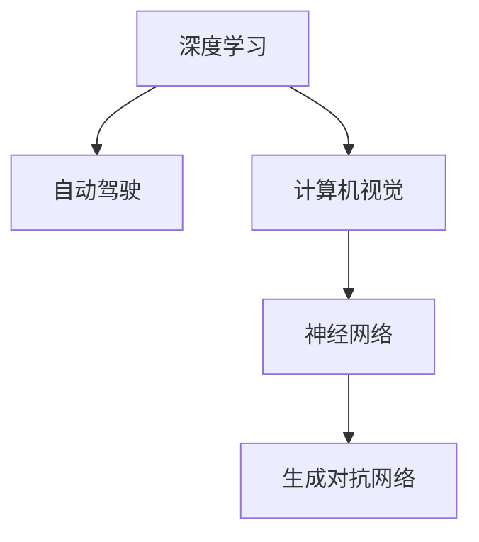

                 

# Andrej Karpathy：人工智能的未来发展趋势

## 1. 背景介绍

### 1.1 问题由来
AI领域的研究者和从业者正处于一个技术变革的加速期，诸多新兴技术与经典理论不断交汇融合，带来了前所未有的创新机遇与挑战。而作为这个时代的中坚力量，Andrej Karpathy，一位被AI界誉为"千禧一代的Yann LeCun"的顶级AI专家，以其在深度学习领域的深刻洞察和卓越贡献，不断推动AI技术的发展，并引领未来的发展趋势。

### 1.2 问题核心关键点
在过去十年间，Andrej Karpathy在神经网络、自动驾驶、计算机视觉等领域取得了诸多突破性成就。他不仅在学术研究中发表了多篇重要论文，更在工业界推动了深度学习技术的应用，如特斯拉的自动驾驶系统中的深度学习组件，就是他领导的团队开发的。Andrej Karpathy的技术视野与前瞻性思考，对于理解未来AI发展的走向具有重要意义。

### 1.3 问题研究意义
本博文聚焦于Andrej Karpathy对人工智能未来发展趋势的见解，旨在通过解读他的重要文章、演讲和访谈，探索AI技术的未来方向，帮助读者理解并把握这些技术的潜在影响。这些见解不仅能提供技术方向的参考，更能帮助我们认识到AI在未来社会、经济、伦理等方面的深远影响，为AI技术的健康发展提供思路。

## 2. 核心概念与联系

### 2.1 核心概念概述

- **深度学习（Deep Learning）**：一种基于多层神经网络的机器学习技术，能够自动从数据中学习到高级特征，广泛应用于图像识别、语音识别、自然语言处理等领域。
- **自动驾驶（Autonomous Driving）**：一种使车辆无需人类直接操作就能自主驾驶的技术，涉及到计算机视觉、深度学习、强化学习等多个前沿技术领域。
- **计算机视觉（Computer Vision）**：使计算机能够理解图像和视频内容的技术，包括图像分类、目标检测、语义分割等任务。
- **神经网络（Neural Networks）**：模仿人类神经系统的计算结构，通过多层非线性变换实现复杂模式的识别和预测。
- **生成对抗网络（Generative Adversarial Networks, GANs）**：由生成器和判别器两个网络组成的框架，能够生成逼真的合成数据，如人脸、图像等。

这些核心概念之间的联系可以通过以下Mermaid流程图来展示：



这个流程图展示了深度学习、自动驾驶、计算机视觉、神经网络和生成对抗网络之间的联系：

- 深度学习作为基础，支持计算机视觉和自动驾驶等任务。
- 神经网络作为深度学习中的重要组成部分，实现复杂的模式识别和预测。
- 生成对抗网络作为一种生成技术，为自动驾驶等任务提供数据增强和合成数据支持。

### 2.2 概念间的关系

这些核心概念之间存在着紧密的联系，形成了AI技术的完整生态系统。

- 深度学习为自动驾驶、计算机视觉等提供了强大的算法支撑。
- 自动驾驶利用计算机视觉技术进行环境感知，通过深度学习进行路径规划和决策。
- 生成对抗网络为自动驾驶提供了数据增强和合成数据，帮助模型更好地泛化。
- 计算机视觉的图像识别、目标检测等任务，是自动驾驶等任务的基础。
- 神经网络作为核心计算单元，实现了深度学习中的非线性变换。

这些概念共同构成了AI技术的核心框架，并在不断演进中推动技术的进步。

## 3. 核心算法原理 & 具体操作步骤

### 3.1 算法原理概述

**自动驾驶的深度学习架构**：自动驾驶的核心技术之一是通过深度学习实现环境感知和决策制定。具体而言，自动驾驶系统通过摄像头、激光雷达等传感器获取车辆周围的环境信息，通过计算机视觉技术进行环境理解和语义分割，然后利用神经网络对车辆进行路径规划和动作控制。

**计算机视觉中的深度学习框架**：计算机视觉任务中，深度学习主要用于图像识别和分类、目标检测、语义分割等。这些任务通常使用卷积神经网络（CNN）作为基础模型，通过迁移学习等方法进行微调，适应特定任务。

**生成对抗网络的训练方法**：GANs由生成器和判别器两个网络组成，生成器试图生成逼真的合成数据，判别器则试图区分生成数据和真实数据。训练过程通常采用对抗训练的方式，即生成器和判别器相互博弈，不断改进模型。

### 3.2 算法步骤详解

**自动驾驶的深度学习步骤**：
1. **传感器数据收集**：通过摄像头、激光雷达等传感器收集车辆周围环境信息。
2. **数据预处理**：对传感器数据进行校正、去噪等预处理操作。
3. **环境理解**：使用计算机视觉技术，如RCNN、Faster R-CNN等，对图像进行目标检测和语义分割，构建车辆周围环境的三维点云模型。
4. **路径规划**：通过神经网络对环境进行分析和预测，生成车辆路径规划方案。
5. **动作控制**：利用动作生成网络，生成车辆的加速度和转向角度，控制车辆动作。

**计算机视觉的深度学习步骤**：
1. **数据准备**：准备标注好的图像数据集，如COCO、PASCAL VOC等。
2. **模型选择**：选择合适的深度学习模型，如VGG、ResNet、Inception等。
3. **迁移学习**：在预训练模型基础上，通过微调，适应特定任务。
4. **模型评估**：在测试集上评估模型性能，调整模型超参数。
5. **部署应用**：将训练好的模型部署到实际应用场景中，如自动驾驶、人脸识别等。

**GANs的训练步骤**：
1. **模型初始化**：初始化生成器和判别器网络。
2. **对抗训练**：生成器试图生成逼真的合成数据，判别器试图区分生成数据和真实数据，两者进行博弈。
3. **模型优化**：通过反向传播，更新生成器和判别器的参数，提升模型性能。
4. **合成数据生成**：生成高质量的合成数据，用于自动驾驶等任务的数据增强。

### 3.3 算法优缺点

**自动驾驶的深度学习优势**：
- **高效感知**：通过计算机视觉和深度学习，实现车辆周围环境的精准感知。
- **鲁棒性强**：深度学习模型具有较强的泛化能力，能够适应复杂多变的环境。
- **自适应性**：通过神经网络进行路径规划和动作控制，具备较强的自适应性。

**自动驾驶的深度学习劣势**：
- **高成本**：传感器、计算硬件等成本较高，需要大量的基础设施投入。
- **安全性问题**：自动驾驶的安全性和可靠性还需要进一步提升，避免误判和错误决策。

**计算机视觉的深度学习优势**：
- **高精度**：深度学习在图像识别、分类、目标检测等任务中表现优异。
- **适用范围广**：计算机视觉技术可以应用于安防监控、智能家居、医疗诊断等多个领域。

**计算机视觉的深度学习劣势**：
- **数据依赖**：深度学习模型需要大量标注数据进行训练，获取数据成本较高。
- **解释性差**：深度学习模型通常被认为是"黑盒"模型，难以解释其内部决策过程。

**GANs的优势**：
- **数据生成**：GANs可以生成逼真的合成数据，用于数据增强和数据扩充。
- **多模态融合**：GANs可以生成多模态数据，如文本、图像、声音等，促进跨模态融合。

**GANs的劣势**：
- **训练复杂**：GANs训练过程容易发生模式崩溃，需要大量的实验调整和优化。
- **数据真实性**：生成的数据虽然逼真，但与真实数据存在差异，可能会影响实际应用效果。

### 3.4 算法应用领域

**自动驾驶**：在自动驾驶领域，深度学习用于环境感知、路径规划和决策制定，使车辆具备自主驾驶能力。特斯拉、Waymo等公司已经将其应用于实际场景中，取得了显著成效。

**计算机视觉**：计算机视觉技术在医疗诊断、安防监控、智能家居等领域广泛应用。例如，在医疗诊断中，深度学习模型可以辅助医生进行疾病诊断，提高诊断准确率。

**GANs**：GANs被广泛应用于图像生成、数据增强、视频编辑等领域。例如，GANs可以生成逼真的医疗影像数据，用于医学研究和诊断。

## 4. 数学模型和公式 & 详细讲解 & 举例说明

### 4.1 数学模型构建

**自动驾驶的深度学习模型**：自动驾驶系统中的深度学习模型通常包括卷积神经网络（CNN）和递归神经网络（RNN）等。以CNN为例，其数学模型可以表示为：

$$ y = f(x; W, b) $$

其中，$x$ 为输入数据，$y$ 为输出结果，$W$ 为权重矩阵，$b$ 为偏置向量，$f$ 为激活函数。

**计算机视觉中的深度学习模型**：计算机视觉任务中，常用的模型包括AlexNet、VGG、ResNet等。以AlexNet为例，其数学模型可以表示为：

$$ y = f(x; W_1, W_2, W_3, b_1, b_2, b_3) $$

其中，$x$ 为输入数据，$y$ 为输出结果，$W_i$ 为卷积层和全连接层的权重矩阵，$b_i$ 为偏置向量，$f$ 为激活函数。

**GANs的生成模型**：GANs由生成器和判别器两个网络组成，其数学模型可以表示为：

$$ G(z) = \mu(x; W_G, b_G) $$
$$ D(x) = \sigma(x; W_D, b_D) $$

其中，$G$ 为生成器，$D$ 为判别器，$z$ 为噪声向量，$\mu(x)$ 和 $\sigma(x)$ 分别为生成器和判别器的输出结果，$W_G$ 和 $W_D$ 分别为生成器和判别器的权重矩阵，$b_G$ 和 $b_D$ 分别为生成器和判别器的偏置向量。

### 4.2 公式推导过程

**自动驾驶中的路径规划模型**：在自动驾驶中，路径规划通常使用A*算法或D*算法等路径规划算法。以A*算法为例，其数学模型可以表示为：

$$ f(n) = g(n) + h(n) $$
$$ g(n) = \sum_{i=1}^N c_i(n_i) $$

其中，$f(n)$ 为节点$n$的启发函数值，$g(n)$ 为节点$n$到目标节点的实际距离，$h(n)$ 为节点$n$到目标节点的估计距离，$c_i(n_i)$ 为第$i$个节点的代价函数，$N$ 为节点数量。

**计算机视觉中的分类模型**：在图像分类任务中，深度学习模型通常使用softmax函数进行输出。以AlexNet为例，其数学模型可以表示为：

$$ y = softmax(f(x; W, b)) $$

其中，$f(x; W, b)$ 为卷积层和全连接层的输出结果，$softmax$ 函数将输出结果转化为概率分布。

**GANs的生成模型**：GANs的生成模型通常使用拉普拉斯分布作为噪声分布，其数学模型可以表示为：

$$ z \sim \mathcal{L}(0, 1) $$
$$ x = G(z) $$

其中，$z$ 为拉普拉斯分布的随机变量，$x$ 为生成器生成的合成数据。

### 4.3 案例分析与讲解

**自动驾驶中的感知模型**：在自动驾驶中，计算机视觉技术用于环境感知，通常使用RCNN、Faster R-CNN等模型进行目标检测和语义分割。以Faster R-CNN为例，其数学模型可以表示为：

$$ R = f(x; W, b) $$
$$ D = R + C $$

其中，$R$ 为特征图，$D$ 为检测框和语义分割结果，$W$ 为特征提取网络的权重矩阵，$b$ 为偏置向量，$C$ 为检测框和语义分割的解码器。

**计算机视觉中的分类模型**：在图像分类任务中，深度学习模型通常使用softmax函数进行输出。以AlexNet为例，其数学模型可以表示为：

$$ y = softmax(f(x; W, b)) $$

其中，$f(x; W, b)$ 为卷积层和全连接层的输出结果，$softmax$ 函数将输出结果转化为概率分布。

**GANs的生成模型**：GANs的生成模型通常使用拉普拉斯分布作为噪声分布，其数学模型可以表示为：

$$ z \sim \mathcal{L}(0, 1) $$
$$ x = G(z) $$

其中，$z$ 为拉普拉斯分布的随机变量，$x$ 为生成器生成的合成数据。

## 5. 项目实践：代码实例和详细解释说明

### 5.1 开发环境搭建

在开始代码实例之前，需要搭建好开发环境。以下是Python和TensorFlow环境的搭建步骤：

1. 安装Python：从官网下载并安装Python，确保版本为3.6或以上。
2. 安装TensorFlow：通过pip安装TensorFlow，确保版本为2.4或以上。
3. 安装相关库：安装必要的库，如numpy、scipy、sklearn等。
4. 创建虚拟环境：使用virtualenv创建虚拟环境，避免与其他项目冲突。

### 5.2 源代码详细实现

以下是一个基于TensorFlow实现的手写数字识别的示例代码：

```python
import tensorflow as tf
from tensorflow.keras import datasets, layers, models

# 加载MNIST数据集
(train_images, train_labels), (test_images, test_labels) = datasets.mnist.load_data()

# 数据预处理
train_images = train_images / 255.0
test_images = test_images / 255.0

# 创建卷积神经网络模型
model = models.Sequential([
    layers.Conv2D(32, (3, 3), activation='relu', input_shape=(28, 28, 1)),
    layers.MaxPooling2D((2, 2)),
    layers.Conv2D(64, (3, 3), activation='relu'),
    layers.MaxPooling2D((2, 2)),
    layers.Conv2D(64, (3, 3), activation='relu'),
    layers.Flatten(),
    layers.Dense(64, activation='relu'),
    layers.Dense(10)
])

# 编译模型
model.compile(optimizer='adam',
              loss=tf.keras.losses.SparseCategoricalCrossentropy(from_logits=True),
              metrics=['accuracy'])

# 训练模型
model.fit(train_images, train_labels, epochs=5, 
          validation_data=(test_images, test_labels))

# 评估模型
test_loss, test_acc = model.evaluate(test_images,  test_labels, verbose=2)
print('Test accuracy:', test_acc)
```

以上代码展示了如何使用TensorFlow搭建并训练一个手写数字识别的卷积神经网络模型。

### 5.3 代码解读与分析

**数据加载和预处理**：
- `train_images`和`test_images`为加载的MNIST数据集的训练集和测试集。
- 将图像数据归一化到[0, 1]范围内，以便于模型训练。

**模型搭建**：
- 使用`Sequential`模型搭建卷积神经网络。
- 包括三个卷积层和两个全连接层，激活函数为ReLU，使用最大池化层进行下采样。
- 最后一层为输出层，使用softmax函数进行分类。

**模型编译和训练**：
- 使用Adam优化器进行模型训练。
- 损失函数为稀疏分类交叉熵，激活函数为softmax。
- 在训练过程中，使用验证集评估模型性能。

**模型评估**：
- 在测试集上评估模型性能，输出测试准确率。

## 6. 实际应用场景

### 6.1 自动驾驶

自动驾驶技术已经在特斯拉、Waymo等公司的实际应用中取得了显著进展。通过计算机视觉和深度学习技术，自动驾驶系统能够实现车辆环境感知、路径规划和动作控制，具备自主驾驶能力。自动驾驶的应用场景包括自动停车、自动跟随、自动导航等。

### 6.2 计算机视觉

计算机视觉技术在医疗诊断、安防监控、智能家居等领域广泛应用。例如，在医疗诊断中，深度学习模型可以辅助医生进行疾病诊断，提高诊断准确率。在安防监控中，深度学习技术可以用于异常行为检测，提升监控系统的安全性和可靠性。

### 6.3 GANs

GANs被广泛应用于图像生成、数据增强、视频编辑等领域。例如，GANs可以生成逼真的医疗影像数据，用于医学研究和诊断。在视频编辑中，GANs可以用于图像合成和风格迁移，生成逼真的视频内容。

## 7. 工具和资源推荐

### 7.1 学习资源推荐

- **深度学习入门**：由Andrew Ng教授讲授的《深度学习》课程，涵盖了深度学习的基本概念和算法，适合初学者入门。
- **TensorFlow官方文档**：TensorFlow官方文档提供了详细的API参考和示例，适合深入学习和实践。
- **GitHub**：GitHub上丰富的深度学习项目和代码库，提供了大量的学习和参考资源。
- **arXiv预印本**：arXiv预印本平台发布了大量前沿论文，适合了解最新的深度学习研究成果。

### 7.2 开发工具推荐

- **TensorFlow**：由Google开发的深度学习框架，适合大规模深度学习模型的开发和部署。
- **Keras**：基于TensorFlow的高级API，适合快速原型开发和模型训练。
- **Jupyter Notebook**：一个交互式的编程环境，适合进行数据预处理、模型训练和结果分析。

### 7.3 相关论文推荐

- **ImageNet大规模视觉识别挑战赛（ILSVRC）**：ILSVRC是计算机视觉领域的顶级竞赛，每年发布新的数据集和挑战任务，推动了深度学习在图像识别和分类领域的发展。
- **AutoDrive：特斯拉自动驾驶系统**：特斯拉公司公开的自动驾驶系统源代码，展示了深度学习在自动驾驶中的应用。
- **GANs的研究论文**：GANs作为生成对抗网络，近年来涌现了大量研究成果，包括Imagenet分类器、Super Resolution等。

## 8. 总结：未来发展趋势与挑战

### 8.1 总结

本文通过解读Andrej Karpathy的最新研究成果和技术见解，探讨了人工智能未来的发展趋势。从深度学习、自动驾驶、计算机视觉和GANs等核心技术，我们看到了未来AI技术的广阔应用前景。同时，我们也认识到技术发展面临的诸多挑战，如数据依赖、安全性问题、计算资源等。

### 8.2 未来发展趋势

**深度学习的进化**：未来深度学习模型将更加复杂和高效，具备更强的泛化能力和自适应性。基于深度学习的多模态融合技术也将得到广泛应用。

**自动驾驶的普及**：自动驾驶技术将逐渐普及，成为未来交通的主流方式。自动驾驶系统将通过深度学习和计算机视觉技术，实现更加智能化、安全的驾驶体验。

**计算机视觉的应用**：计算机视觉技术将在各个领域得到广泛应用，推动智慧医疗、智能家居、安防监控等领域的发展。

**GANs的应用拓展**：GANs技术将在图像生成、数据增强、视频编辑等领域得到更广泛的应用，为各类应用提供高质量的合成数据。

### 8.3 面临的挑战

**数据依赖问题**：深度学习模型需要大量标注数据进行训练，如何降低对标注数据的依赖，是未来技术发展的重要方向。

**安全性问题**：深度学习模型可能存在安全性问题，如对抗攻击、隐私泄露等，需要进一步研究解决。

**计算资源限制**：深度学习模型的训练和推理需要大量的计算资源，如何提高计算效率，降低资源消耗，是未来技术发展的重要课题。

**伦理和法律问题**：深度学习技术的发展可能带来伦理和法律问题，如算法歧视、隐私侵犯等，需要进一步研究和规范。

### 8.4 研究展望

未来的AI技术将不断进步，推动社会和经济的深度变革。我们需要在技术发展的同时，关注伦理、法律、隐私等重要问题，确保技术健康、安全地发展。同时，通过不断优化算法、提升计算资源、引入更多先验知识等手段，推动AI技术在各个领域的应用，为人类社会带来更多福祉。

---

作者：禅与计算机程序设计艺术 / Zen and the Art of Computer Programming

