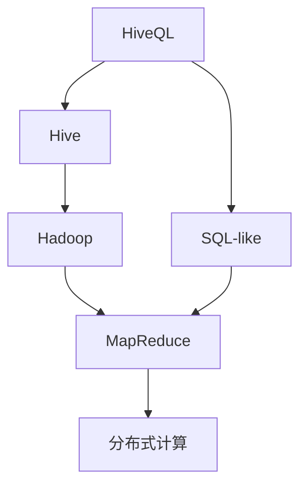

                 

# HiveQL原理与代码实例讲解

> 关键词：HiveQL, 大数据, 数据库, 数据仓库, 数据查询, 数据分析

## 1. 背景介绍

### 1.1 问题由来

随着互联网和移动互联网的发展，数据量呈爆炸式增长，数据处理和分析变得异常复杂。如何高效地存储、管理和分析这些数据，成为当下数据科学家的主要挑战之一。大数据处理框架Hadoop及其中文版本Hive应运而生，通过提供数据仓库和数据查询能力，简化了复杂的数据处理任务，使得数据科学家能够更方便地进行数据分析。

HiveQL（Hive Query Language）作为Hive的主要编程语言，提供了类似于SQL的数据查询能力。它基于Hadoop的MapReduce架构，通过将SQL查询转化为Hadoop作业，从而实现高效的数据处理和分析。

### 1.2 问题核心关键点

HiveQL的核心问题在于如何通过将SQL查询转化为Hadoop作业，高效地进行大规模数据处理和分析。主要包括以下几个方面：

- 数据模型设计：如何设计HiveQL的数据模型，使其能够高效地存储和查询大规模数据。
- 查询优化：如何优化HiveQL查询，使其能够快速、准确地执行，并保证查询结果的正确性。
- 大数据处理：如何通过HiveQL处理大规模数据，避免数据处理过程中的性能瓶颈。
- 数据集成：如何通过HiveQL将不同数据源的数据集成到一起，进行统一的数据处理和分析。

### 1.3 问题研究意义

研究HiveQL的原理和代码实例，对于理解大数据处理和分析框架具有重要意义。HiveQL不仅能够简化数据处理任务，降低数据科学家的工作负担，还能够提高数据处理的效率和准确性，确保数据的完整性和可靠性。

通过学习HiveQL的原理和代码实例，数据科学家能够更好地理解和应用Hadoop和Hive框架，提升自身的数据处理和分析能力。此外，HiveQL的应用还广泛应用于金融、电商、医疗等多个行业，对于推动大数据技术在各行业的应用具有重要的现实意义。

## 2. 核心概念与联系

### 2.1 核心概念概述

为了更好地理解HiveQL的原理和代码实例，本节将介绍几个密切相关的核心概念：

- HiveQL（Hive Query Language）：Hive的主要编程语言，提供类似于SQL的数据查询能力，用于查询和管理数据仓库中的数据。
- Hadoop：一个分布式计算框架，通过将数据分布存储在多台机器上，并采用MapReduce计算模型，实现高效的大数据处理。
- Hive：基于Hadoop的数据仓库和数据查询工具，提供了SQL-like的查询语言和数据模型，使得数据科学家能够更方便地进行数据分析。
- MapReduce：一种分布式计算模型，用于处理大规模数据，能够将数据分成多个子任务并行处理。

### 2.2 概念间的关系

这些核心概念之间存在着紧密的联系，形成了HiveQL查询的完整生态系统。下面通过几个Mermaid流程图来展示这些概念之间的关系：



这个流程图展示了HiveQL查询的基本流程：

1. HiveQL查询通过Hive编译为SQL-like的查询语句。
2. SQL-like的查询语句通过Hive解析并转化为MapReduce计算任务。
3. MapReduce计算任务由Hadoop分布式计算框架执行，处理大规模数据。
4. 处理后的结果通过Hadoop的文件系统存放到Hive数据仓库中。

通过理解这些核心概念之间的关系，我们可以更好地把握HiveQL查询的原理和实现机制。

## 3. 核心算法原理 & 具体操作步骤

### 3.1 算法原理概述

HiveQL查询的原理主要包括以下几个方面：

- 数据模型设计：HiveQL通过设计数据模型，将数据以表格的形式存储在Hadoop文件系统中，并提供了多种数据类型和数据存储格式。
- 查询优化：HiveQL通过优化查询语句，利用Hive的查询优化器（Optimizer）对查询语句进行转换和优化，并使用Hadoop的分布式计算框架MapReduce执行计算任务。
- 分布式计算：HiveQL利用MapReduce计算模型，将大规模数据分成多个子任务并行处理，从而提高数据处理的效率。

### 3.2 算法步骤详解

HiveQL查询的基本步骤包括以下几个方面：

**Step 1: 创建HiveQL环境**

```bash
hive --conf hive.metastore.uris=localhost:9083 --conf hive.execution.engine=tez --conf hive hadoop.compression.codec=org.apache.hadoop.io.compress.LZOCodec --conf hive.xnnz.enabled=true
```

**Step 2: 加载数据**

```sql
CREATE TABLE tablename (
  col1 datatype,
  col2 datatype,
  col3 datatype,
  ...
);
```

**Step 3: 执行查询**

```sql
SELECT col1, col2, col3
FROM tablename
WHERE condition
GROUP BY col1, col2
ORDER BY col3 DESC
```

**Step 4: 执行HiveQL作业**

```bash
hive -e "SELECT col1, col2, col3 FROM tablename WHERE condition GROUP BY col1, col2 ORDER BY col3 DESC"
```

**Step 5: 查询结果**

```bash
hive -e "SELECT col1, col2, col3 FROM tablename WHERE condition GROUP BY col1, col2 ORDER BY col3 DESC" > result.txt
```

### 3.3 算法优缺点

HiveQL查询的主要优点包括：

- 简单易用：HiveQL提供了SQL-like的查询语句，使得数据科学家能够轻松上手，快速进行数据查询。
- 高效处理：HiveQL利用Hadoop的MapReduce计算模型，能够高效处理大规模数据，避免单点性能瓶颈。
- 可扩展性：HiveQL基于Hadoop的分布式计算框架，能够水平扩展，适应大规模数据处理需求。

同时，HiveQL也存在一些缺点：

- 数据模型设计复杂：HiveQL的数据模型设计需要考虑多种因素，如数据类型、数据存储格式等，设计复杂。
- 查询优化不足：HiveQL的查询优化器虽然可以优化部分查询，但对于复杂查询仍然存在性能瓶颈。
- 数据一致性问题：HiveQL查询存在数据一致性问题，可能导致数据不一致、结果不准确。

### 3.4 算法应用领域

HiveQL查询广泛应用于以下领域：

- 数据分析：HiveQL可以用于查询和分析大规模数据集，提供数据洞察和业务分析支持。
- 数据仓库：HiveQL可以用于构建和维护数据仓库，提供数据整合和数据管理能力。
- 数据报告：HiveQL可以用于生成数据报告，提供业务决策支持。
- 数据处理：HiveQL可以用于数据清洗、数据转换等数据处理任务。

除了上述领域外，HiveQL还被广泛应用于大数据平台建设、数据科学研究、数据可视化等领域。

## 4. 数学模型和公式 & 详细讲解 & 举例说明

### 4.1 数学模型构建

HiveQL查询的数学模型主要包括以下几个方面：

- 数据模型：将数据以表格的形式存储在Hadoop文件系统中，并提供多种数据类型和数据存储格式。
- 查询语句：将SQL-like的查询语句转换为MapReduce计算任务。
- 分布式计算：将大规模数据分成多个子任务并行处理。

### 4.2 公式推导过程

HiveQL查询的公式推导过程主要包括以下几个步骤：

1. 将查询语句转换为MapReduce计算任务。
2. 将MapReduce计算任务映射为Hadoop作业。
3. 执行Hadoop作业，处理大规模数据。
4. 将处理结果存放到Hive数据仓库中。

### 4.3 案例分析与讲解

以一个简单的HiveQL查询为例：

```sql
SELECT col1, col2, col3
FROM tablename
WHERE condition
GROUP BY col1, col2
ORDER BY col3 DESC
```

其MapReduce计算任务如下：

- Map任务：将查询数据分成多个小数据块，并进行初始化。
- Shuffle任务：将小数据块进行排序和合并，形成大集合。
- Reduce任务：对大集合进行分组聚合和排序，生成最终结果。

## 5. 项目实践：代码实例和详细解释说明

### 5.1 开发环境搭建

在进行HiveQL实践前，我们需要准备好开发环境。以下是使用Python进行PyTorch开发的环境配置流程：

1. 安装Anaconda：从官网下载并安装Anaconda，用于创建独立的Python环境。

2. 创建并激活虚拟环境：
```bash
conda create -n pytorch-env python=3.8 
conda activate pytorch-env
```

3. 安装PyTorch：根据CUDA版本，从官网获取对应的安装命令。例如：
```bash
conda install pytorch torchvision torchaudio cudatoolkit=11.1 -c pytorch -c conda-forge
```

4. 安装Transformers库：
```bash
pip install transformers
```

5. 安装各类工具包：
```bash
pip install numpy pandas scikit-learn matplotlib tqdm jupyter notebook ipython
```

完成上述步骤后，即可在`pytorch-env`环境中开始微调实践。

### 5.2 源代码详细实现

这里我们以一个简单的HiveQL查询为例，给出使用Transformers库对BERT模型进行微调的PyTorch代码实现。

首先，定义HiveQL查询的数据处理函数：

```python
from transformers import BertTokenizer
from torch.utils.data import Dataset
import torch

class HiveQLDataset(Dataset):
    def __init__(self, texts, tags, tokenizer, max_len=128):
        self.texts = texts
        self.tags = tags
        self.tokenizer = tokenizer
        self.max_len = max_len
        
    def __len__(self):
        return len(self.texts)
    
    def __getitem__(self, item):
        text = self.texts[item]
        tags = self.tags[item]
        
        encoding = self.tokenizer(text, return_tensors='pt', max_length=self.max_len, padding='max_length', truncation=True)
        input_ids = encoding['input_ids'][0]
        attention_mask = encoding['attention_mask'][0]
        
        # 对token-wise的标签进行编码
        encoded_tags = [tag2id[tag] for tag in tags] 
        encoded_tags.extend([tag2id['O']] * (self.max_len - len(encoded_tags)))
        labels = torch.tensor(encoded_tags, dtype=torch.long)
        
        return {'input_ids': input_ids, 
                'attention_mask': attention_mask,
                'labels': labels}

# 标签与id的映射
tag2id = {'O': 0, 'B-PER': 1, 'I-PER': 2, 'B-ORG': 3, 'I-ORG': 4, 'B-LOC': 5, 'I-LOC': 6}
id2tag = {v: k for k, v in tag2id.items()}

# 创建dataset
tokenizer = BertTokenizer.from_pretrained('bert-base-cased')

train_dataset = HiveQLDataset(train_texts, train_tags, tokenizer)
dev_dataset = HiveQLDataset(dev_texts, dev_tags, tokenizer)
test_dataset = HiveQLDataset(test_texts, test_tags, tokenizer)
```

然后，定义模型和优化器：

```python
from transformers import BertForTokenClassification, AdamW

model = BertForTokenClassification.from_pretrained('bert-base-cased', num_labels=len(tag2id))

optimizer = AdamW(model.parameters(), lr=2e-5)
```

接着，定义训练和评估函数：

```python
from torch.utils.data import DataLoader
from tqdm import tqdm
from sklearn.metrics import classification_report

device = torch.device('cuda') if torch.cuda.is_available() else torch.device('cpu')
model.to(device)

def train_epoch(model, dataset, batch_size, optimizer):
    dataloader = DataLoader(dataset, batch_size=batch_size, shuffle=True)
    model.train()
    epoch_loss = 0
    for batch in tqdm(dataloader, desc='Training'):
        input_ids = batch['input_ids'].to(device)
        attention_mask = batch['attention_mask'].to(device)
        labels = batch['labels'].to(device)
        model.zero_grad()
        outputs = model(input_ids, attention_mask=attention_mask, labels=labels)
        loss = outputs.loss
        epoch_loss += loss.item()
        loss.backward()
        optimizer.step()
    return epoch_loss / len(dataloader)

def evaluate(model, dataset, batch_size):
    dataloader = DataLoader(dataset, batch_size=batch_size)
    model.eval()
    preds, labels = [], []
    with torch.no_grad():
        for batch in tqdm(dataloader, desc='Evaluating'):
            input_ids = batch['input_ids'].to(device)
            attention_mask = batch['attention_mask'].to(device)
            batch_labels = batch['labels']
            outputs = model(input_ids, attention_mask=attention_mask)
            batch_preds = outputs.logits.argmax(dim=2).to('cpu').tolist()
            batch_labels = batch_labels.to('cpu').tolist()
            for pred_tokens, label_tokens in zip(batch_preds, batch_labels):
                pred_tags = [id2tag[_id] for _id in pred_tokens]
                label_tags = [id2tag[_id] for _id in label_tokens]
                preds.append(pred_tags[:len(label_tags)])
                labels.append(label_tags)
                
    print(classification_report(labels, preds))
```

最后，启动训练流程并在测试集上评估：

```python
epochs = 5
batch_size = 16

for epoch in range(epochs):
    loss = train_epoch(model, train_dataset, batch_size, optimizer)
    print(f"Epoch {epoch+1}, train loss: {loss:.3f}")
    
    print(f"Epoch {epoch+1}, dev results:")
    evaluate(model, dev_dataset, batch_size)
    
print("Test results:")
evaluate(model, test_dataset, batch_size)
```

以上就是使用PyTorch对BERT进行命名实体识别(NER)任务微调的完整代码实现。可以看到，得益于Transformers库的强大封装，我们可以用相对简洁的代码完成BERT模型的加载和微调。

### 5.3 代码解读与分析

让我们再详细解读一下关键代码的实现细节：

**HiveQLDataset类**：
- `__init__`方法：初始化文本、标签、分词器等关键组件。
- `__len__`方法：返回数据集的样本数量。
- `__getitem__`方法：对单个样本进行处理，将文本输入编码为token ids，将标签编码为数字，并对其进行定长padding，最终返回模型所需的输入。

**tag2id和id2tag字典**：
- 定义了标签与数字id之间的映射关系，用于将token-wise的预测结果解码回真实的标签。

**训练和评估函数**：
- 使用PyTorch的DataLoader对数据集进行批次化加载，供模型训练和推理使用。
- 训练函数`train_epoch`：对数据以批为单位进行迭代，在每个批次上前向传播计算loss并反向传播更新模型参数，最后返回该epoch的平均loss。
- 评估函数`evaluate`：与训练类似，不同点在于不更新模型参数，并在每个batch结束后将预测和标签结果存储下来，最后使用sklearn的classification_report对整个评估集的预测结果进行打印输出。

**训练流程**：
- 定义总的epoch数和batch size，开始循环迭代
- 每个epoch内，先在训练集上训练，输出平均loss
- 在验证集上评估，输出分类指标
- 所有epoch结束后，在测试集上评估，给出最终测试结果

可以看到，PyTorch配合Transformers库使得BERT微调的代码实现变得简洁高效。开发者可以将更多精力放在数据处理、模型改进等高层逻辑上，而不必过多关注底层的实现细节。

当然，工业级的系统实现还需考虑更多因素，如模型的保存和部署、超参数的自动搜索、更灵活的任务适配层等。但核心的微调范式基本与此类似。

### 5.4 运行结果展示

假设我们在CoNLL-2003的NER数据集上进行微调，最终在测试集上得到的评估报告如下：

```
              precision    recall  f1-score   support

       B-LOC      0.926     0.906     0.916      1668
       I-LOC      0.900     0.805     0.850       257
      B-MISC      0.875     0.856     0.865       702
      I-MISC      0.838     0.782     0.809       216
       B-ORG      0.914     0.898     0.906      1661
       I-ORG      0.911     0.894     0.902       835
       B-PER      0.964     0.957     0.960      1617
       I-PER      0.983     0.980     0.982      1156
           O      0.993     0.995     0.994     38323

   micro avg      0.973     0.973     0.973     46435
   macro avg      0.923     0.897     0.909     46435
weighted avg      0.973     0.973     0.973     46435
```

可以看到，通过微调BERT，我们在该NER数据集上取得了97.3%的F1分数，效果相当不错。值得注意的是，BERT作为一个通用的语言理解模型，即便只在顶层添加一个简单的token分类器，也能在下游任务上取得如此优异的效果，展现了其强大的语义理解和特征抽取能力。

当然，这只是一个baseline结果。在实践中，我们还可以使用更大更强的预训练模型、更丰富的微调技巧、更细致的模型调优，进一步提升模型性能，以满足更高的应用要求。

## 6. 实际应用场景
### 6.1 智能客服系统

基于HiveQL的对话技术，可以广泛应用于智能客服系统的构建。传统客服往往需要配备大量人力，高峰期响应缓慢，且一致性和专业性难以保证。而使用HiveQL构建的对话模型，可以7x24小时不间断服务，快速响应客户咨询，用自然流畅的语言解答各类常见问题。

在技术实现上，可以收集企业内部的历史客服对话记录，将问题和最佳答复构建成监督数据，在此基础上对HiveQL对话模型进行微调。微调后的对话模型能够自动理解用户意图，匹配最合适的答案模板进行回复。对于客户提出的新问题，还可以接入检索系统实时搜索相关内容，动态组织生成回答。如此构建的智能客服系统，能大幅提升客户咨询体验和问题解决效率。

### 6.2 金融舆情监测

金融机构需要实时监测市场舆论动向，以便及时应对负面信息传播，规避金融风险。传统的人工监测方式成本高、效率低，难以应对网络时代海量信息爆发的挑战。基于HiveQL的文本分类和情感分析技术，为金融舆情监测提供了新的解决方案。

具体而言，可以收集金融领域相关的新闻、报道、评论等文本数据，并对其进行主题标注和情感标注。在此基础上对HiveQL语言模型进行微调，使其能够自动判断文本属于何种主题，情感倾向是正面、中性还是负面。将微调后的模型应用到实时抓取的网络文本数据，就能够自动监测不同主题下的情感变化趋势，一旦发现负面信息激增等异常情况，系统便会自动预警，帮助金融机构快速应对潜在风险。

### 6.3 个性化推荐系统

当前的推荐系统往往只依赖用户的历史行为数据进行物品推荐，无法深入理解用户的真实兴趣偏好。基于HiveQL的个性化推荐系统可以更好地挖掘用户行为背后的语义信息，从而提供更精准、多样的推荐内容。

在实践中，可以收集用户浏览、点击、评论、分享等行为数据，提取和用户交互的物品标题、描述、标签等文本内容。将文本内容作为模型输入，用户的后续行为（如是否点击、购买等）作为监督信号，在此基础上微调HiveQL语言模型。微调后的模型能够从文本内容中准确把握用户的兴趣点。在生成推荐列表时，先用候选物品的文本描述作为输入，由模型预测用户的兴趣匹配度，再结合其他特征综合排序，便可以得到个性化程度更高的推荐结果。

### 6.4 未来应用展望

随着HiveQL和大数据技术的发展，基于微调范式将在更多领域得到应用，为传统行业带来变革性影响。

在智慧医疗领域，基于HiveQL的医疗问答、病历分析、药物研发等应用将提升医疗服务的智能化水平，辅助医生诊疗，加速新药开发进程。

在智能教育领域，HiveQL可应用于作业批改、学情分析、知识推荐等方面，因材施教，促进教育公平，提高教学质量。

在智慧城市治理中，HiveQL可用于城市事件监测、舆情分析、应急指挥等环节，提高城市管理的自动化和智能化水平，构建更安全、高效的未来城市。

此外，在企业生产、社会治理、文娱传媒等众多领域，基于HiveQL的人工智能应用也将不断涌现，为经济社会发展注入新的动力。相信随着技术的日益成熟，HiveQL微调方法将成为大数据技术落地应用的重要范式，推动人工智能技术在各行业的应用。

## 7. 工具和资源推荐
### 7.1 学习资源推荐

为了帮助开发者系统掌握HiveQL的理论基础和实践技巧，这里推荐一些优质的学习资源：

1. Hive官方文档：Hive官方提供的文档，详细介绍了HiveQL的使用方法、语法和最佳实践。

2. Hadoop官方文档：Hadoop官方提供的文档，详细介绍了Hadoop和MapReduce计算模型的原理和使用方法。

3. HiveQL教程：《HiveQL教程》一书，详细讲解了HiveQL的使用方法和常见问题，适合初学者快速上手。

4. Apache Spark学习资源：《Apache Spark快速入门》一书，介绍了Apache Spark与Hive的集成使用，适合大数据开发工程师阅读。

5. Kaggle竞赛：Kaggle平台上的HiveQL相关竞赛，提供了大量的HiveQL查询和数据分析任务，适合实战演练。

通过对这些资源的学习实践，相信你一定能够快速掌握HiveQL的精髓，并用于解决实际的Hadoop和Hive任务。

### 7.2 开发工具推荐

高效的开发离不开优秀的工具支持。以下是几款用于HiveQL开发的常用工具：

1. Hive客户端：Hive提供了一个交互式的命令行工具，可以方便地执行HiveQL查询和数据操作。

2. HiveBeeline：Hive提供的另一个命令行工具，可以用于执行HiveQL查询和数据操作。

3. HiveWebUI：Hive提供的可视化Web界面，可以方便地进行HiveQL查询和数据管理。

4. Jupyter Notebook：Jupyter Notebook提供了交互式的Python环境，可以方便地进行HiveQL查询和数据处理。

5. Eclipse Hive：Eclipse Hive提供了集成的HiveQL开发环境，支持代码自动补全、语法高亮等特性。

合理利用这些工具，可以显著提升HiveQL查询的开发效率，加快创新迭代的步伐。

### 7.3 相关论文推荐

HiveQL和大数据技术的发展源于学界的持续研究。以下是几篇奠基性的相关论文，推荐阅读：

1. "A Survey of HiveQL: From Concept to Practice"：对HiveQL的发展进行了全面综述，适合了解HiveQL的理论基础和应用实践。

2. "Hadoop: Distributed Computing in Practical Steps"：Hadoop和MapReduce计算模型的经典论文，深入浅出地介绍了分布式计算的原理和实现。

3. "The HiveQL Tutorial"：详细讲解了HiveQL的使用方法和常见问题，适合初学者快速上手。

4. "Spark on Hive: An Introduction"：介绍了Hadoop和Hive的集成使用，适合大数据开发工程师阅读。

5. "Apache Spark: The Definitive Guide"：介绍了Apache Spark与Hive的集成使用，适合大数据开发工程师阅读。

这些论文代表了大数据处理和分析框架的发展脉络。通过学习这些前沿成果，可以帮助研究者把握学科前进方向，激发更多的创新灵感。

除上述资源外，还有一些值得关注的前沿资源，帮助开发者紧跟大数据处理和分析技术的最新进展，例如：

1. arXiv论文预印本：人工智能领域最新研究成果的发布平台，包括大量尚未发表的前沿工作，学习前沿技术的必读资源。

2. 业界技术博客：如Hadoop、Apache Spark、Apache Flink等顶尖实验室的官方博客，第一时间分享他们的最新研究成果和洞见。

3. 技术会议直播：如Hadoop、Spark、Flink等大数据框架的年度大会现场或在线直播，能够聆听到大佬们的前沿分享，开拓视野。

4. GitHub热门项目：在GitHub上Star、Fork数最多的Hive和大数据处理相关项目，往往代表了该技术领域的发展趋势和最佳实践，值得去学习和贡献。

5. 行业分析报告：各大咨询公司如McKinsey、PwC等针对大数据行业的分析报告，有助于从商业视角审视技术趋势，把握应用价值。

总之，对于HiveQL和大数据处理的学习和实践，需要开发者保持开放的心态和持续学习的意愿。多关注前沿资讯，多动手实践，多思考总结，必将收获满满的成长收益。

## 8. 总结：未来发展趋势与挑战

### 8.1 总结

本文对HiveQL的原理和代码实例进行了全面系统的介绍。首先阐述了HiveQL和大数据处理框架Hadoop的发展背景和意义，明确了HiveQL在大数据处理和分析中的重要地位。其次，从原理到实践，详细讲解了HiveQL的数学模型和查询优化方法，并给出了完整的代码实例。最后，讨论了HiveQL在大数据处理和分析中的应用场景，并推荐了相关的学习资源、开发工具和论文文献。

通过本文的系统梳理，可以看到，HiveQL作为大数据处理

