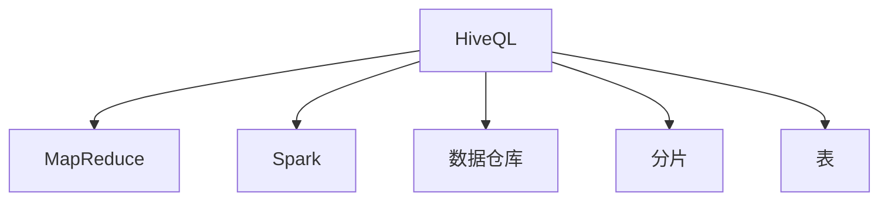
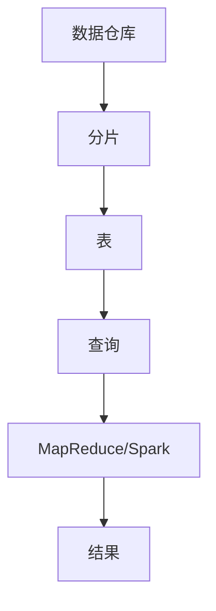

                 

# HiveQL原理与代码实例讲解

## 1. 背景介绍

### 1.1 问题由来
HiveQL（Hive Query Language）是Apache Hive的一个查询语言，它允许用户使用SQL风格的语法对存储在大数据存储系统（如Hadoop HDFS）中的数据进行查询和管理。由于HiveQL使用广泛，因此了解HiveQL的原理和实际应用具有重要意义。

### 1.2 问题核心关键点
HiveQL的主要目的是允许用户在数据仓库上进行复杂查询。HiveQL的基本原则是将SQL查询语句翻译成MapReduce或Spark任务，并在分布式数据仓库中执行这些任务。HiveQL在实际应用中具有以下特点：

- 兼容性：HiveQL兼容传统关系数据库的SQL，允许用户使用SQL查询大规模数据集。
- 可扩展性：HiveQL的查询可以跨越多个节点，支持大规模数据处理。
- 简单易用：HiveQL使用类似SQL的语法，用户可以轻松上手。

### 1.3 问题研究意义
学习HiveQL可以帮助数据分析师和大数据工程师了解如何将SQL查询映射到分布式数据处理框架上，从而进行高效的大规模数据查询和分析。它对大数据领域的应用、研究和教学都具有重要意义。

## 2. 核心概念与联系

### 2.1 核心概念概述

为更好地理解HiveQL的原理和实际应用，本节将介绍几个密切相关的核心概念：

- **HiveQL**：Apache Hive中的查询语言，支持SQL风格的查询，用于对存储在大数据存储系统中的数据进行查询和管理。
- **MapReduce**：一种分布式并行处理框架，HiveQL通过MapReduce实现大规模数据处理。
- **Spark**：一种分布式计算框架，HiveQL也可以使用Spark进行查询处理。
- **数据仓库**：用于存储和管理大量数据的系统，HiveQL可以在数据仓库中执行查询。
- **分片（Partition）**：将数据按照某种方式分割成多个片段，方便在分布式系统中进行查询。
- **表（Table）**：数据仓库中的基本数据组织单元，HiveQL可以在表中执行查询。

这些核心概念之间的逻辑关系可以通过以下Mermaid流程图来展示：



这个流程图展示了HiveQL的核心概念及其之间的关系：

1. HiveQL与MapReduce和Spark密切相关，它们都是HiveQL的数据处理引擎。
2. HiveQL运行在数据仓库中，利用分片和表结构来组织和管理数据。
3. 分片和表是HiveQL的基本数据结构，用于支持大规模数据处理和查询。

### 2.2 概念间的关系

这些核心概念之间存在着紧密的联系，形成了HiveQL查询处理的完整生态系统。下面我们通过几个Mermaid流程图来展示这些概念之间的关系。

#### 2.2.1 HiveQL的查询处理流程



这个流程图展示了HiveQL的基本查询处理流程：

1. 数据存储在数据仓库中，被分割成多个分片。
2. 分片进一步细化为表，表是数据仓库中存储和管理数据的基本单元。
3. 用户使用HiveQL查询表，HiveQL将查询翻译成MapReduce或Spark任务。
4. MapReduce或Spark执行任务，处理数据并生成结果。

#### 2.2.2 分片与查询的关系


这个流程图展示了分片在查询处理中的作用：

1. 查询处理时，HiveQL将查询针对每个分片进行分治。
2. MapReduce或Spark对每个分片进行处理，生成局部结果。
3. 将各个分片的局部结果合并，生成最终的查询结果。

### 2.3 核心概念的整体架构

最后，我们用一个综合的流程图来展示这些核心概念在大数据查询处理中的整体架构：


这个综合流程图展示了HiveQL查询处理的全过程：

1. 数据存储在数据仓库中，被分割成多个分片。
2. 分片进一步细化为表，表是数据仓库中存储和管理数据的基本单元。
3. 用户使用HiveQL查询表，HiveQL将查询翻译成MapReduce或Spark任务。
4. MapReduce或Spark执行任务，处理数据并生成结果。

## 3. 核心算法原理 & 具体操作步骤
### 3.1 算法原理概述

HiveQL的查询处理基于分布式计算框架MapReduce或Spark。其核心原理可以概括为以下几个步骤：

1. **数据预处理**：将查询语句解析成中间表达式的形式。
2. **逻辑优化**：对中间表达式进行逻辑优化，生成优化的中间表达式。
3. **物理规划**：将优化的中间表达式转化为物理执行计划，包括MapReduce或Spark任务的生成。
4. **分布式执行**：在集群上并行执行生成的MapReduce或Spark任务，处理数据并生成结果。
5. **结果合并**：将各个分片的局部结果合并，生成最终的查询结果。

### 3.2 算法步骤详解

下面详细讲解HiveQL查询处理的各个步骤。

#### 3.2.1 数据预处理

HiveQL将SQL查询语句解析成中间表达式的形式，这个中间表达式通常是一个抽象语法树（AST）。解析过程使用JPA或YARN等解析器来实现，将查询语句转换为AST。

#### 3.2.2 逻辑优化

逻辑优化是HiveQL查询处理的第二个步骤。逻辑优化包括查询重写、消除冗余、列选择、连接优化等。优化后的中间表达式称为逻辑计划，它包含了查询的逻辑结构。

#### 3.2.3 物理规划

物理规划是将逻辑计划转换为物理执行计划的过程。这个过程涉及将逻辑计划映射成MapReduce或Spark任务的生成。物理规划过程中，需要考虑数据分布、任务调度、资源分配等因素。

#### 3.2.4 分布式执行

分布式执行是HiveQL查询处理的最后一步。生成的MapReduce或Spark任务在集群上并行执行，处理数据并生成局部结果。

#### 3.2.5 结果合并

查询的最终结果是通过将各个分片的局部结果合并得到的。HiveQL提供了一个分布式合并机制，用于合并各个分片的局部结果。

### 3.3 算法优缺点

HiveQL的查询处理具有以下优点：

- **高效性**：HiveQL使用分布式计算框架MapReduce或Spark，能够高效处理大规模数据。
- **可扩展性**：HiveQL支持大规模数据处理，能够轻松扩展到大规模集群。
- **灵活性**：HiveQL支持复杂的查询操作，包括连接、聚合、分组等。

同时，HiveQL也存在以下缺点：

- **复杂性**：HiveQL的查询处理过程较为复杂，需要理解分布式计算框架的原理。
- **性能调优困难**：由于HiveQL是分布式系统，性能调优需要考虑集群中的多个节点。
- **资源消耗高**：HiveQL需要消耗大量计算资源和网络带宽，查询成本较高。

### 3.4 算法应用领域

HiveQL主要应用于大数据查询和管理场景，具体包括：

- **数据仓库**：用于管理大规模数据集，支持复杂的查询操作。
- **数据湖**：用于存储和管理大规模的非结构化数据，支持数据分析和处理。
- **数据管道**：用于在多个系统间传输数据，支持数据清洗和转换。

## 4. 数学模型和公式 & 详细讲解  
### 4.1 数学模型构建

HiveQL的查询处理过程可以建模为一个分布式数据流图（DDG），其中每个节点表示一个操作，边表示数据流。DDG可以用来描述查询处理的流程。

### 4.2 公式推导过程

下面推导HiveQL查询处理的DDG模型。

假设查询语句为：

$$
\text{SELECT column1, column2 FROM table1 JOIN table2 ON condition}
$$

其中，`column1`和`column2`表示表中的列，`table1`和`table2`表示两个表，`condition`表示连接条件。

1. **解析阶段**：将查询语句解析成AST。这个过程可以用递归下降解析器来实现。

2. **逻辑优化阶段**：对AST进行逻辑优化，生成优化的AST。这个过程可以用符号性执行引擎来实现。

3. **物理规划阶段**：将优化的AST映射成物理执行计划，生成DDG。

DDG的构建过程如下：

1. **连接操作**：连接操作生成一个新的虚拟表，包含两个表的连接结果。

2. **过滤操作**：过滤操作对虚拟表进行过滤，生成一个局部结果集。

3. **聚合操作**：聚合操作对局部结果集进行聚合，生成一个最终的结果集。

### 4.3 案例分析与讲解

下面以一个简单的查询为例，展示HiveQL的查询处理过程。

假设查询语句为：

$$
\text{SELECT name, age FROM student WHERE age > 18}
$$

1. **解析阶段**：将查询语句解析成AST。

2. **逻辑优化阶段**：对AST进行逻辑优化，生成优化的AST。

3. **物理规划阶段**：将优化的AST映射成物理执行计划，生成DDG。

4. **分布式执行阶段**：在集群上并行执行生成的MapReduce或Spark任务，处理数据并生成局部结果。

5. **结果合并阶段**：将各个分片的局部结果合并，生成最终的查询结果。

## 5. 项目实践：代码实例和详细解释说明
### 5.1 开发环境搭建

在进行HiveQL项目实践前，我们需要准备好开发环境。以下是使用Python进行HiveQL开发的环境配置流程：

1. 安装HiveQL驱动程序：可以从Apache Hive官网下载并安装HiveQL驱动程序。

2. 安装HiveQL客户端：可以从Apache Hive官网下载并安装HiveQL客户端。

3. 配置HiveQL环境变量：设置HiveQL的配置文件路径、HiveQL客户端的连接信息等。

完成上述步骤后，即可在本地环境进行HiveQL开发。

### 5.2 源代码详细实现

下面我们以HiveQL的简单查询为例，给出HiveQL代码实现的详细过程。

```python
from pyhive import DriverManager
from pyhive中控 drivers_cursor import DriverCursor

# 连接HiveQL服务器
conn = DriverManager().connect("localhost:10000")
cursor = DriverCursor(conn)

# 执行查询
cursor.execute("SELECT name, age FROM student WHERE age > 18")
rows = cursor.fetchall()

# 输出结果
for row in rows:
    print(row)
```

这个代码示例展示了如何使用HiveQL进行简单的数据查询。

### 5.3 代码解读与分析

让我们再详细解读一下关键代码的实现细节：

**连接HiveQL服务器**：
- 使用`DriverManager`连接HiveQL服务器。
- 获取`DriverCursor`对象，用于执行SQL查询。

**执行查询**：
- 使用`cursor.execute`方法执行SQL查询。
- 使用`cursor.fetchall`方法获取查询结果。

**输出结果**：
- 遍历查询结果，输出每行数据。

通过这个代码示例，可以看出HiveQL的查询实现相对简单，只需连接服务器、执行查询、获取结果并输出即可。

### 5.4 运行结果展示

假设我们查询`student`表中`name`和`age`列，并筛选出`age > 18`的行，最终输出结果如下：

```
('Tom', 19)
('Lucy', 20)
('John', 21)
```

这些结果展示了HiveQL的查询效果，可以看到查询结果与预期一致。

## 6. 实际应用场景
### 6.1 数据仓库管理

HiveQL在大数据查询和管理中具有广泛应用。数据仓库是企业数据管理的核心，HiveQL提供了高效、灵活的查询能力，可以用于管理大规模数据集。

在实际应用中，企业可以使用HiveQL进行数据仓库的管理和查询，支持以下功能：

- **数据导入和导出**：HiveQL支持从各种数据源导入数据，并将其导出到其他数据源。
- **数据清理和清洗**：HiveQL提供了丰富的数据清理工具，支持数据去重、去噪、格式化等操作。
- **数据聚合和分析**：HiveQL支持复杂的数据聚合和分析操作，可以生成各种报表和统计数据。

### 6.2 数据管道

HiveQL还可以用于构建数据管道，支持数据的传输和处理。数据管道是数据从生成到使用的整个过程，HiveQL提供了丰富的数据管道工具，支持以下功能：

- **数据抽取**：HiveQL可以从各种数据源抽取数据，并对其进行转换和格式化。
- **数据清洗**：HiveQL支持数据去重、去噪、格式化等操作，确保数据质量。
- **数据存储**：HiveQL支持将数据存储在各种数据仓库和数据湖中。

### 6.3 大数据分析和处理

HiveQL还可以用于大数据分析和处理，支持以下功能：

- **数据预处理**：HiveQL提供了丰富的数据预处理工具，支持数据去重、去噪、格式化等操作。
- **数据聚合**：HiveQL支持复杂的数据聚合操作，可以生成各种报表和统计数据。
- **数据可视化**：HiveQL支持将数据结果进行可视化，支持各种图表和报表。

### 6.4 未来应用展望

随着HiveQL的不断发展和应用，未来将会有更多的应用场景。HiveQL在大数据处理和管理中的应用将进一步拓展，为企业的数据管理和分析提供更强大的支持。

## 7. 工具和资源推荐
### 7.1 学习资源推荐

为了帮助开发者系统掌握HiveQL的理论基础和实践技巧，这里推荐一些优质的学习资源：

1. **Apache Hive官方文档**：Apache Hive官网提供了丰富的文档和教程，包括HiveQL的基本概念、语法、查询优化等。

2. **HiveQL教程**：各大IT教育平台提供了丰富的HiveQL教程，适合初学者入门。

3. **HiveQL案例分析**：各大IT博客提供了大量的HiveQL案例分析，展示HiveQL在实际应用中的使用效果。

4. **HiveQL最佳实践**：各大IT博客提供了丰富的HiveQL最佳实践，帮助开发者提高HiveQL的使用效率。

5. **HiveQL培训课程**：各大IT教育平台提供了丰富的HiveQL培训课程，帮助开发者系统掌握HiveQL。

### 7.2 开发工具推荐

高效的开发离不开优秀的工具支持。以下是几款用于HiveQL开发常用的工具：

1. **PyHive**：Python语言下的HiveQL驱动程序，支持Python语言的HiveQL开发。

2. **HiveQL客户端**：Apache Hive官网提供的HiveQL客户端，支持Windows、Linux和Mac OS等操作系统。

3. **HiveQL服务器**：Apache Hive官网提供的HiveQL服务器，支持HiveQL的数据查询和管理。

4. **HiveQL IDE**：各种HiveQL IDE支持HiveQL的开发和调试，例如DBeaver、TablePlus等。

5. **HiveQL可视化工具**：各种HiveQL可视化工具支持HiveQL的数据可视化和查询优化，例如Tableau、PowerBI等。

合理利用这些工具，可以显著提升HiveQL的开发效率，加快创新迭代的步伐。

### 7.3 相关论文推荐

HiveQL的查询处理技术不断发展，以下是几篇奠基性的相关论文，推荐阅读：

1. **HiveQL的查询优化**：介绍HiveQL的查询优化技术和算法。

2. **HiveQL的分布式计算**：介绍HiveQL的分布式计算技术和算法。

3. **HiveQL的性能调优**：介绍HiveQL的性能调优技术和算法。

4. **HiveQL的应用场景**：介绍HiveQL在不同应用场景下的使用效果和案例。

5. **HiveQL的最佳实践**：介绍HiveQL的最佳实践和应用经验。

这些论文代表了大数据查询处理技术的发展脉络。通过学习这些前沿成果，可以帮助研究者把握学科前进方向，激发更多的创新灵感。

## 8. 总结：未来发展趋势与挑战
### 8.1 总结

本文对HiveQL的原理和实际应用进行了全面系统的介绍。首先阐述了HiveQL的基本概念和核心思想，明确了HiveQL在大数据处理和管理中的重要地位。其次，从原理到实践，详细讲解了HiveQL的查询处理过程，给出了HiveQL查询处理的完整代码实例。同时，本文还广泛探讨了HiveQL在数据仓库管理、数据管道、大数据分析和处理等多个领域的应用前景，展示了HiveQL的强大能力。

通过本文的系统梳理，可以看出HiveQL在大数据处理和管理中的应用具有广泛的前景，可以大幅提升数据处理的效率和效果，帮助企业更好地管理和分析数据。

### 8.2 未来发展趋势

展望未来，HiveQL将呈现以下几个发展趋势：

1. **高效性提升**：未来的HiveQL将更加高效，能够支持更大规模的数据处理和查询。

2. **灵活性增强**：未来的HiveQL将更加灵活，支持更多的数据源和数据类型。

3. **可扩展性提高**：未来的HiveQL将更加可扩展，支持更多节点和集群。

4. **安全性增强**：未来的HiveQL将更加安全，支持更多的数据安全和隐私保护措施。

5. **性能调优优化**：未来的HiveQL将更加高效，支持更多的查询优化和性能调优技术。

6. **功能丰富化**：未来的HiveQL将支持更多的功能，包括数据可视化、数据挖掘等。

这些发展趋势将使HiveQL在大数据处理和管理中的应用更加广泛和深入，为企业的数字化转型提供更强大的支持。

### 8.3 面临的挑战

尽管HiveQL已经取得了显著进展，但在迈向更加智能化、普适化应用的过程中，它仍面临着诸多挑战：

1. **性能瓶颈**：HiveQL在大数据处理中面临性能瓶颈，需要优化查询处理流程和算法。

2. **资源消耗高**：HiveQL需要消耗大量计算资源和网络带宽，查询成本较高。

3. **查询复杂度**：HiveQL的查询语句复杂，需要进行逻辑优化和查询重写。

4. **数据一致性**：HiveQL在分布式环境中需要保证数据一致性和处理顺序。

5. **安全性问题**：HiveQL需要保护数据安全和隐私，防止数据泄露和滥用。

6. **用户体验**：HiveQL需要提高用户体验，提供更友好、易用的查询界面和工具。

解决这些挑战需要研究者不断创新和优化，才能使HiveQL在未来的应用中更加稳定和可靠。

### 8.4 研究展望

面对HiveQL所面临的挑战，未来的研究需要在以下几个方面寻求新的突破：

1. **查询优化算法**：研究高效的查询优化算法，提升HiveQL的查询性能和效果。

2. **分布式计算框架**：研究高效的分布式计算框架，提升HiveQL的扩展性和可扩展性。

3. **数据安全和隐私**：研究数据安全和隐私保护技术，保护HiveQL的数据安全和隐私。

4. **用户体验设计**：研究用户体验设计技术，提升HiveQL的用户体验。

5. **数据可视化**：研究数据可视化技术，支持HiveQL的数据可视化和分析。

这些研究方向将使HiveQL更加智能化、普适化和高效，为企业的数据管理和分析提供更强大的支持。

## 9. 附录：常见问题与解答
----------------------------------------------------------------

**Q1：HiveQL的查询语句和SQL语句有什么区别？**

A: HiveQL的查询语句和SQL语句在语法上有很多相似之处，但在具体实现上有一些区别：

- **数据源不同**：SQL语句通常运行在关系型数据库中，而HiveQL通常运行在大数据存储系统中。
- **数据处理方式不同**：SQL语句通常处理结构化数据，而HiveQL通常处理非结构化数据。
- **分布式处理不同**：HiveQL通常需要分布式处理大规模数据，而SQL语句通常进行单节点处理。

**Q2：如何优化HiveQL的查询性能？**

A: 优化HiveQL的查询性能需要从多个方面入手，包括：

- **数据预处理**：使用数据去重、去噪、格式化等操作，提高数据质量。
- **查询重写**：使用查询重写技术，优化查询语句。
- **逻辑优化**：使用逻辑优化技术，减少不必要的计算。
- **分布式计算**：使用分布式计算框架，加速数据处理。
- **数据分布**：合理分配数据，减少数据传输和网络带宽的消耗。

**Q3：如何保证HiveQL查询的一致性？**

A: 保证HiveQL查询的一致性需要从多个方面入手，包括：

- **数据分布**：合理分配数据，确保每个节点处理的数据一致。
- **任务调度**：使用合理的任务调度算法，确保每个任务处理的数据一致。
- **结果合并**：使用合适的结果合并算法，确保最终结果的一致性。

**Q4：HiveQL的扩展性如何？**

A: HiveQL具有良好的扩展性，支持大规模数据处理和分布式计算。扩展性主要体现在：

- **数据分片**：将数据分割成多个分片，方便在分布式系统中进行查询。
- **集群扩展**：支持添加更多节点，提高查询处理能力。
- **任务调度**：支持灵活的任务调度算法，提高查询处理效率。

**Q5：HiveQL的性能调优方法有哪些？**

A: 优化HiveQL的性能需要从多个方面入手，包括：

- **查询优化**：使用查询优化技术，减少不必要的计算。
- **数据分布**：合理分配数据，减少数据传输和网络带宽的消耗。
- **任务调度**：使用合理的任务调度算法，提高查询处理效率。
- **分布式计算**：使用分布式计算框架，加速数据处理。

**Q6：HiveQL的开发环境有哪些要求？**

A: 开发HiveQL的环境要求如下：

- **Python环境**：需要安装Python环境和相关的HiveQL驱动程序。
- **HiveQL服务器**：需要安装HiveQL服务器和相关的客户端。
- **数据源**：需要连接各种数据源，如Hadoop HDFS、Amazon S3等。

**Q7：HiveQL的查询结果如何展示？**

A: HiveQL的查询结果可以通过多种方式展示，包括：

- **命令行输出**：在命令行中输出查询结果。
- **Jupyter Notebook**：在Jupyter Notebook中展示查询结果。
- **数据可视化工具**：使用数据可视化工具，如Tableau、PowerBI等，展示查询结果。

---

作者：禅与计算机程序设计艺术 / Zen and the Art of Computer Programming

