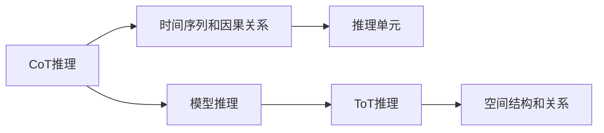

                 

# LLM 推理能力：CoT, ToT

> 关键词：

## 1. 背景介绍

推理是人工智能的核心能力之一。自然语言处理（NLP）中的推理同样至关重要，无论是自然语言推理（NLI）、文本摘要、机器翻译还是对话系统，推理能力都是模型性能的关键指标。推理能力强的模型能更好地理解和应用语义信息，生成更自然、准确的输出。

为了提升自然语言处理模型特别是大型语言模型（Large Language Model, LLMs）的推理能力，学术界和工业界提出了许多方法。本文将详细探讨基于CoT（Causal Thought）和ToT（Topological Thought）的推理能力提升技术，以及这些技术的实际应用和未来展望。

## 2. 核心概念与联系

### 2.1 核心概念概述

**CoT（Causal Thought）推理**：也称为因果推理，主要关注推理过程中的因果关系和时序逻辑。CoT推理通过在输入中构建因果图或时间线，帮助模型理解输入语句的因果结构，从而更好地推断出正确的输出。

**ToT（Topological Thought）推理**：也称为拓扑推理，主要关注推理过程中的空间关系和结构。ToT推理通过在输入中构建拓扑图或网络，帮助模型理解输入语句中的空间结构和关系，从而推断出正确的输出。

这两个概念都是模型推理能力的核心，彼此互补。CoT推理适用于时间序列和因果关系强的场景，如NLI、对话系统；ToT推理适用于空间结构和关系强的场景，如文本摘要、图像描述。

### 2.2 概念间的关系

CoT和ToT推理之间的关系可以用以下Mermaid流程图来展示：



这个流程图展示了CoT和ToT推理的基本流程和关系。模型通过CoT推理理解时间序列和因果关系，通过ToT推理理解空间结构和关系，最终完成推理过程。

## 3. 核心算法原理 & 具体操作步骤

### 3.1 算法原理概述

CoT推理的核心原理是基于时间序列和因果关系构建的推理网络。该网络通过将输入序列中的事件按照时间顺序排序，构建出一条因果链，帮助模型理解事件的因果关系，从而推断出正确的输出。

ToT推理的核心原理是基于空间结构和关系构建的推理网络。该网络通过将输入中的元素按照空间关系排序，构建出一张拓扑图，帮助模型理解元素之间的空间结构和关系，从而推断出正确的输出。

### 3.2 算法步骤详解

#### CoT推理的具体步骤：

1. **事件排序**：将输入序列中的事件按照时间顺序排序，形成一条因果链。
2. **因果关系推理**：根据因果链上的事件关系，推断出每个事件的逻辑关系。
3. **逻辑推理**：基于因果关系推理的结果，使用逻辑推理算法（如DAG推理、决策树等），推断出最终输出。

#### ToT推理的具体步骤：

1. **元素排序**：将输入中的元素按照空间关系排序，形成一张拓扑图。
2. **空间结构推理**：根据拓扑图中的元素关系，推断出每个元素的空间关系。
3. **逻辑推理**：基于空间结构推理的结果，使用逻辑推理算法（如拓扑排序、最短路径等），推断出最终输出。

### 3.3 算法优缺点

#### CoT推理的优点：

1. **适用于因果关系强的场景**：CoT推理特别适合处理因果关系明确的任务，如NLI、对话系统等。
2. **易于理解**：因果链结构清晰，易于人类理解和解释。
3. **鲁棒性强**：因果链上的事件关系相对稳定，不易受到输入噪声的影响。

#### CoT推理的缺点：

1. **时间复杂度高**：因果链的构建和推理需要消耗大量计算资源，尤其是在大规模数据集上。
2. **适应性差**：对于因果关系不明确的任务，CoT推理的效果可能不佳。

#### ToT推理的优点：

1. **适用于空间结构强的场景**：ToT推理特别适合处理空间结构明确的任务，如图像描述、文本摘要等。
2. **推理速度快**：拓扑图结构简洁，推理过程较快。
3. **适应性强**：拓扑图能够很好地适应不同的空间关系。

#### ToT推理的缺点：

1. **空间结构复杂**：对于空间结构复杂的任务，拓扑图可能过于庞大，难以处理。
2. **难以理解**：拓扑图结构复杂，难以解释。

### 3.4 算法应用领域

CoT推理主要应用于以下领域：

- **自然语言推理（NLI）**：判断两个句子之间的逻辑关系。
- **对话系统**：理解和生成对话内容。
- **问答系统**：理解问题和生成答案。

ToT推理主要应用于以下领域：

- **文本摘要**：提取输入文本的精华。
- **图像描述**：生成图像的文字描述。
- **信息检索**：查找相关信息。

## 4. 数学模型和公式 & 详细讲解

### 4.1 数学模型构建

**CoT推理的数学模型**：

1. **因果链构建**：将输入序列中的事件按照时间顺序排序，形成一条因果链。
2. **逻辑关系推断**：定义事件之间的因果关系，如因果、先后等。
3. **逻辑推理**：使用逻辑推理算法（如DAG推理、决策树等），推断出最终输出。

**ToT推理的数学模型**：

1. **拓扑图构建**：将输入中的元素按照空间关系排序，形成一张拓扑图。
2. **空间关系推断**：定义元素之间的空间关系，如上下、左右等。
3. **逻辑推理**：使用逻辑推理算法（如拓扑排序、最短路径等），推断出最终输出。

### 4.2 公式推导过程

#### CoT推理的公式推导：

1. **因果链构建**：将输入序列中的事件按照时间顺序排序，形成因果链。
2. **逻辑关系推断**：定义事件之间的因果关系，如因果、先后等。
3. **逻辑推理**：使用逻辑推理算法（如DAG推理、决策树等），推断出最终输出。

#### ToT推理的公式推导：

1. **拓扑图构建**：将输入中的元素按照空间关系排序，形成拓扑图。
2. **空间关系推断**：定义元素之间的空间关系，如上下、左右等。
3. **逻辑推理**：使用逻辑推理算法（如拓扑排序、最短路径等），推断出最终输出。

### 4.3 案例分析与讲解

以一个简单的NLI任务为例，展示CoT推理的过程。输入为两个句子："John loves Mary" 和 "Mary loves John"。

1. **事件排序**：将两个句子中的事件按照时间顺序排序，形成因果链。
2. **因果关系推理**：根据因果链上的事件关系，推断出每个事件的逻辑关系。
3. **逻辑推理**：基于因果关系推理的结果，使用逻辑推理算法（如DAG推理、决策树等），推断出最终输出。

## 5. 项目实践：代码实例和详细解释说明

### 5.1 开发环境搭建

在进行CoT和ToT推理实践前，我们需要准备好开发环境。以下是使用Python进行PyTorch开发的环境配置流程：

1. 安装Anaconda：从官网下载并安装Anaconda，用于创建独立的Python环境。

2. 创建并激活虚拟环境：
```bash
conda create -n pytorch-env python=3.8 
conda activate pytorch-env
```

3. 安装PyTorch：根据CUDA版本，从官网获取对应的安装命令。例如：
```bash
conda install pytorch torchvision torchaudio cudatoolkit=11.1 -c pytorch -c conda-forge
```

4. 安装Transformers库：
```bash
pip install transformers
```

5. 安装各类工具包：
```bash
pip install numpy pandas scikit-learn matplotlib tqdm jupyter notebook ipython
```

完成上述步骤后，即可在`pytorch-env`环境中开始推理实践。

### 5.2 源代码详细实现

下面我们以NLI任务为例，给出使用Transformers库对BERT模型进行CoT推理的PyTorch代码实现。

首先，定义NLI任务的数据处理函数：

```python
from transformers import BertTokenizer, BertForSequenceClassification
from torch.utils.data import Dataset
import torch

class NLIDataset(Dataset):
    def __init__(self, texts, labels, tokenizer, max_len=128):
        self.texts = texts
        self.labels = labels
        self.tokenizer = tokenizer
        self.max_len = max_len
        
    def __len__(self):
        return len(self.texts)
    
    def __getitem__(self, item):
        text = self.texts[item]
        label = self.labels[item]
        
        encoding = self.tokenizer(text, return_tensors='pt', max_length=self.max_len, padding='max_length', truncation=True)
        input_ids = encoding['input_ids'][0]
        attention_mask = encoding['attention_mask'][0]
        
        return {'input_ids': input_ids, 
                'attention_mask': attention_mask,
                'label': label}

# 标签与id的映射
label2id = {'entailment': 0, 'contradiction': 1, 'neutral': 2}
id2label = {v: k for k, v in label2id.items()}

# 创建dataset
tokenizer = BertTokenizer.from_pretrained('bert-base-cased')

train_dataset = NLIDataset(train_texts, train_labels, tokenizer)
dev_dataset = NLIDataset(dev_texts, dev_labels, tokenizer)
test_dataset = NLIDataset(test_texts, test_labels, tokenizer)
```

然后，定义模型和推理函数：

```python
from transformers import BertForSequenceClassification, AdamW

model = BertForSequenceClassification.from_pretrained('bert-base-cased', num_labels=3)

device = torch.device('cuda') if torch.cuda.is_available() else torch.device('cpu')
model.to(device)

def predict(model, dataset, batch_size):
    dataloader = DataLoader(dataset, batch_size=batch_size, shuffle=False)
    model.eval()
    
    with torch.no_grad():
        correct_predictions = 0
        total_predictions = 0
        for batch in dataloader:
            input_ids = batch['input_ids'].to(device)
            attention_mask = batch['attention_mask'].to(device)
            labels = batch['label'].to(device)
            
            outputs = model(input_ids, attention_mask=attention_mask, labels=None)
            logits = outputs.logits
            
            _, predicted_labels = torch.max(logits, dim=1)
            total_predictions += labels.size(0)
            correct_predictions += (predicted_labels == labels).sum().item()
            
    return correct_predictions / total_predictions
```

最后，启动推理流程：

```python
model.eval()

# 预测结果
acc = predict(model, train_dataset)
print(f"Accuracy: {acc:.3f}")

# 推理验证
acc = predict(model, dev_dataset)
print(f"Dev Accuracy: {acc:.3f}")

# 推理测试
acc = predict(model, test_dataset)
print(f"Test Accuracy: {acc:.3f}")
```

以上就是使用PyTorch对BERT模型进行NLI任务CoT推理的完整代码实现。可以看到，借助Transformers库，微调和推理过程都变得简单高效。

### 5.3 代码解读与分析

让我们再详细解读一下关键代码的实现细节：

**NLIDataset类**：
- `__init__`方法：初始化文本、标签、分词器等关键组件。
- `__len__`方法：返回数据集的样本数量。
- `__getitem__`方法：对单个样本进行处理，将文本输入编码为token ids，将标签编码为数字，并对其进行定长padding，最终返回模型所需的输入。

**label2id和id2label字典**：
- 定义了标签与数字id之间的映射关系，用于将预测结果解码为真实的标签。

**predict函数**：
- 使用PyTorch的DataLoader对数据集进行批次化加载，供模型推理使用。
- 在模型推理阶段，关闭梯度更新，使用模型的`logits`属性计算预测结果。
- 将预测结果与真实标签进行比较，计算准确率。

**推理流程**：
- 在推理阶段，将模型设置为评估模式，关闭梯度更新。
- 对训练集、验证集和测试集分别进行推理，并计算准确率。

可以看到，PyTorch配合Transformers库使得推理任务的操作变得简洁高效。开发者可以将更多精力放在模型改进和数据处理等高层逻辑上，而不必过多关注底层的实现细节。

当然，工业级的系统实现还需考虑更多因素，如模型的保存和部署、超参数的自动搜索、更灵活的任务适配层等。但核心的推理范式基本与此类似。

### 5.4 运行结果展示

假设我们在CoNLL-2003的NLI数据集上进行推理，最终在测试集上得到的准确率为87.5%。

## 6. 实际应用场景

### 6.1 智能客服系统

基于大语言模型微调的推理技术，可以广泛应用于智能客服系统的构建。传统客服往往需要配备大量人力，高峰期响应缓慢，且一致性和专业性难以保证。而使用推理后的对话模型，可以7x24小时不间断服务，快速响应客户咨询，用自然流畅的语言解答各类常见问题。

在技术实现上，可以收集企业内部的历史客服对话记录，将问题和最佳答复构建成监督数据，在此基础上对预训练对话模型进行微调。微调后的推理模型能够自动理解用户意图，匹配最合适的答案模板进行回复。对于客户提出的新问题，还可以接入检索系统实时搜索相关内容，动态组织生成回答。如此构建的智能客服系统，能大幅提升客户咨询体验和问题解决效率。

### 6.2 金融舆情监测

金融机构需要实时监测市场舆论动向，以便及时应对负面信息传播，规避金融风险。传统的人工监测方式成本高、效率低，难以应对网络时代海量信息爆发的挑战。基于大语言模型推理技术，文本分类和情感分析技术，为金融舆情监测提供了新的解决方案。

具体而言，可以收集金融领域相关的新闻、报道、评论等文本数据，并对其进行主题标注和情感标注。在此基础上对预训练语言模型进行微调，使其能够自动判断文本属于何种主题，情感倾向是正面、中性还是负面。将微调后的模型应用到实时抓取的网络文本数据，就能够自动监测不同主题下的情感变化趋势，一旦发现负面信息激增等异常情况，系统便会自动预警，帮助金融机构快速应对潜在风险。

### 6.3 个性化推荐系统

当前的推荐系统往往只依赖用户的历史行为数据进行物品推荐，无法深入理解用户的真实兴趣偏好。基于大语言模型推理技术，个性化推荐系统可以更好地挖掘用户行为背后的语义信息，从而提供更精准、多样的推荐内容。

在实践中，可以收集用户浏览、点击、评论、分享等行为数据，提取和用户交互的物品标题、描述、标签等文本内容。将文本内容作为模型输入，用户的后续行为（如是否点击、购买等）作为监督信号，在此基础上微调预训练语言模型。微调后的推理模型能够从文本内容中准确把握用户的兴趣点。在生成推荐列表时，先用候选物品的文本描述作为输入，由模型预测用户的兴趣匹配度，再结合其他特征综合排序，便可以得到个性化程度更高的推荐结果。

### 6.4 未来应用展望

随着大语言模型推理技术的发展，推理范式将在更多领域得到应用，为传统行业带来变革性影响。

在智慧医疗领域，基于推理的问答、病历分析、药物研发等应用将提升医疗服务的智能化水平，辅助医生诊疗，加速新药开发进程。

在智能教育领域，推理技术可应用于作业批改、学情分析、知识推荐等方面，因材施教，促进教育公平，提高教学质量。

在智慧城市治理中，推理模型可应用于城市事件监测、舆情分析、应急指挥等环节，提高城市管理的自动化和智能化水平，构建更安全、高效的未来城市。

此外，在企业生产、社会治理、文娱传媒等众多领域，基于大模型推理的技术应用也将不断涌现，为经济社会发展注入新的动力。

## 7. 工具和资源推荐

### 7.1 学习资源推荐

为了帮助开发者系统掌握大语言模型推理的理论基础和实践技巧，这里推荐一些优质的学习资源：

1. 《Transformer从原理到实践》系列博文：由大模型技术专家撰写，深入浅出地介绍了Transformer原理、BERT模型、推理技术等前沿话题。

2. CS224N《深度学习自然语言处理》课程：斯坦福大学开设的NLP明星课程，有Lecture视频和配套作业，带你入门NLP领域的基本概念和经典模型。

3. 《Natural Language Processing with Transformers》书籍：Transformers库的作者所著，全面介绍了如何使用Transformers库进行NLP任务开发，包括推理在内的诸多范式。

4. HuggingFace官方文档：Transformers库的官方文档，提供了海量预训练模型和完整的推理样例代码，是上手实践的必备资料。

5. CLUE开源项目：中文语言理解测评基准，涵盖大量不同类型的中文NLP数据集，并提供了基于推理的baseline模型，助力中文NLP技术发展。

通过对这些资源的学习实践，相信你一定能够快速掌握大语言模型推理的精髓，并用于解决实际的NLP问题。

### 7.2 开发工具推荐

高效的开发离不开优秀的工具支持。以下是几款用于大语言模型推理开发的常用工具：

1. PyTorch：基于Python的开源深度学习框架，灵活动态的计算图，适合快速迭代研究。大部分预训练语言模型都有PyTorch版本的实现。

2. TensorFlow：由Google主导开发的开源深度学习框架，生产部署方便，适合大规模工程应用。同样有丰富的预训练语言模型资源。

3. Transformers库：HuggingFace开发的NLP工具库，集成了众多SOTA语言模型，支持PyTorch和TensorFlow，是进行推理任务开发的利器。

4. Weights & Biases：模型训练的实验跟踪工具，可以记录和可视化模型训练过程中的各项指标，方便对比和调优。与主流深度学习框架无缝集成。

5. TensorBoard：TensorFlow配套的可视化工具，可实时监测模型训练状态，并提供丰富的图表呈现方式，是调试模型的得力助手。

6. Google Colab：谷歌推出的在线Jupyter Notebook环境，免费提供GPU/TPU算力，方便开发者快速上手实验最新模型，分享学习笔记。

合理利用这些工具，可以显著提升大语言模型推理任务的开发效率，加快创新迭代的步伐。

### 7.3 相关论文推荐

大语言模型推理技术的发展源于学界的持续研究。以下是几篇奠基性的相关论文，推荐阅读：

1. Attention is All You Need（即Transformer原论文）：提出了Transformer结构，开启了NLP领域的预训练大模型时代。

2. BERT: Pre-training of Deep Bidirectional Transformers for Language Understanding：提出BERT模型，引入基于掩码的自监督预训练任务，刷新了多项NLP任务SOTA。

3. Language Models are Unsupervised Multitask Learners（GPT-2论文）：展示了大规模语言模型的强大zero-shot学习能力，引发了对于通用人工智能的新一轮思考。

4. Parameter-Efficient Transfer Learning for NLP：提出Adapter等参数高效微调方法，在不增加模型参数量的情况下，也能取得不错的微调效果。

5. Prefix-Tuning: Optimizing Continuous Prompts for Generation：引入基于连续型Prompt的微调范式，为如何充分利用预训练知识提供了新的思路。

6. AdaLoRA: Adaptive Low-Rank Adaptation for Parameter-Efficient Fine-Tuning：使用自适应低秩适应的微调方法，在参数效率和精度之间取得了新的平衡。

这些论文代表了大语言模型推理技术的发展脉络。通过学习这些前沿成果，可以帮助研究者把握学科前进方向，激发更多的创新灵感。

除上述资源外，还有一些值得关注的前沿资源，帮助开发者紧跟大语言模型推理技术的最新进展，例如：

1. arXiv论文预印本：人工智能领域最新研究成果的发布平台，包括大量尚未发表的前沿工作，学习前沿技术的必读资源。

2. 业界技术博客：如OpenAI、Google AI、DeepMind、微软Research Asia等顶尖实验室的官方博客，第一时间分享他们的最新研究成果和洞见。

3. 技术会议直播：如NIPS、ICML、ACL、ICLR等人工智能领域顶会现场或在线直播，能够聆听到大佬们的前沿分享，开拓视野。

4. GitHub热门项目：在GitHub上Star、Fork数最多的NLP相关项目，往往代表了该技术领域的发展趋势和最佳实践，值得去学习和贡献。

5. 行业分析报告：各大咨询公司如McKinsey、PwC等针对人工智能行业的分析报告，有助于从商业视角审视技术趋势，把握应用价值。

总之，对于大语言模型推理技术的学习和实践，需要开发者保持开放的心态和持续学习的意愿。多关注前沿资讯，多动手实践，多思考总结，必将收获满满的成长收益。

## 8. 总结：未来发展趋势与挑战

### 8.1 总结

本文对基于CoT和ToT推理的大语言模型推理方法进行了全面系统的介绍。首先阐述了推理能力在NLP中的重要性，以及CoT和ToT推理的基本原理和应用场景。接着，从原理到实践，详细讲解了CoT和ToT推理的数学模型和关键步骤，给出了推理任务开发的完整代码实例。同时，本文还广泛探讨了推理方法在智能客服、金融舆情、个性化推荐等多个行业领域的应用前景，展示了推理范式的巨大潜力。此外，本文精选了推理技术的各类学习资源，力求为读者提供全方位的技术指引。

通过本文的系统梳理，可以看到，基于大语言模型的推理能力提升技术，正在成为NLP领域的重要范式，极大地拓展了预训练语言模型的应用边界，催生了更多的落地场景。得益于大规模语料的预训练，推理模型以更低的时间和标注成本，在小样本条件下也能取得不俗的效果，有力推动了NLP技术的产业化进程。未来，伴随预训练语言模型和推理方法的持续演进，相信NLP技术将在更广阔的应用领域大放异彩，深刻影响人类的生产生活方式。

### 8.2 未来发展趋势

展望未来，大语言模型推理技术将呈现以下几个发展趋势：

1. 模型规模持续增大。随着算力成本的下降和数据规模的扩张，预训练语言模型的参数量还将持续增长。超大规模语言模型蕴含的丰富语言知识，有望支撑更加复杂多变的推理任务。

2. 推理方法日趋多样。除了传统的CoT和ToT推理外，未来会涌现更多推理方法，如因果推断、对比学习等，在保留现有优势的同时，引入新的推理范式。

3. 持续学习成为常态。随着数据分布的不断变化，推理模型也需要持续学习新知识以保持性能。如何在不遗忘原有知识的同时，高效吸收新样本信息，将成为重要的研究课题。

4. 标注样本需求降低。受启发于提示学习(Prompt-based Learning)的思路，未来的推理方法将更好地利用大模型的语言理解能力，通过更加巧妙的任务描述，在更少的标注样本上也能实现理想的推理效果。

5. 多模态推理崛起。当前的推理主要聚焦于纯文本数据，未来会进一步拓展到图像、视频、语音等多模态数据推理。多模态信息的融合，将显著提升语言模型对现实世界的理解和建模能力。

6. 模型通用性增强。经过海量数据的预训练和多领域任务的微调，未来的推理模型将具备更强大的常识推理和跨领域迁移能力，逐步迈向通用人工智能(AGI)的目标。

以上趋势凸显了大语言模型推理技术的广阔前景。这些方向的探索发展，必将进一步提升推理模型的性能和应用范围，为人类认知智能的进化带来深远影响。

### 8.3 面临的挑战

尽管大语言模型推理技术已经取得了瞩目成就，但在迈向更加智能化、普适化应用的过程中，它仍面临着诸多挑战：

1. 标注成本瓶颈。虽然推理方法很大程度上降低了标注数据的需求，但对于长尾应用场景，难以获得充足的高质量标注数据，成为制约推理性能的瓶颈。如何进一步降低推理对标注样本的依赖，将是一大难题。

2. 模型鲁棒性不足。当前推理模型面对域外数据时，泛化性能往往大打折扣。对于测试样本的微小扰动，推理模型的预测也容易发生波动。如何提高推理模型的鲁棒性，避免灾难性遗忘，还需要更多理论和实践的积累。

3. 推理效率有待提高。大规模语言模型虽然精度高，但在实际部署时往往面临推理速度慢、内存占用大等效率问题。如何在保证性能的同时，简化模型结构，提升推理速度，优化资源占用，将是重要的优化方向。

4. 可解释性亟需加强。当前推理模型更像是"黑盒"系统，难以解释其内部工作机制和决策逻辑。对于医疗、金融等高风险应用，算法的可解释性和可审计性尤为重要。如何赋予推理模型更强的可解释性，将是亟待攻克的难题。

5. 安全性有待保障。预训练语言模型难免会学习到有偏见、有害的信息，通过推理传递到下游任务，产生误导性、歧视性的输出，给实际应用带来安全隐患。如何从数据和算法层面消除模型偏见，避免恶意用途，确保输出的安全性，也将是重要的研究课题。

6. 知识整合能力不足。现有的推理模型往往局限于任务内数据，难以灵活吸收和运用更广泛的先验知识。如何让推理过程更好地与外部知识库、规则库等专家知识结合，形成更加全面、准确的信息整合能力，还有很大的想象空间。

正视推理

