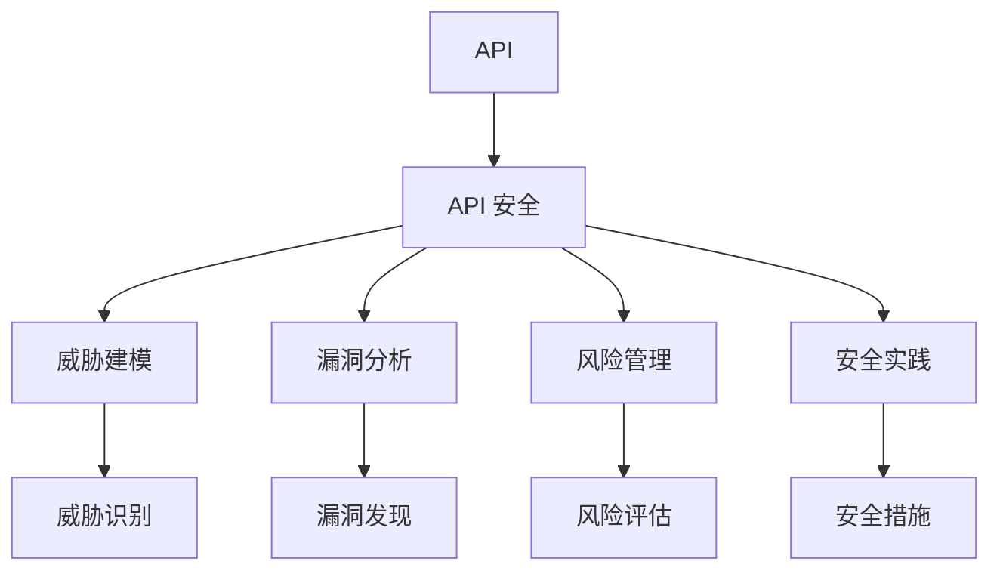
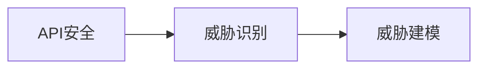
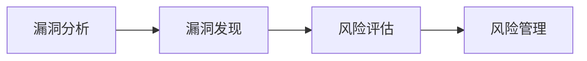
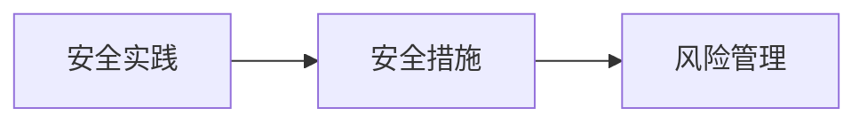
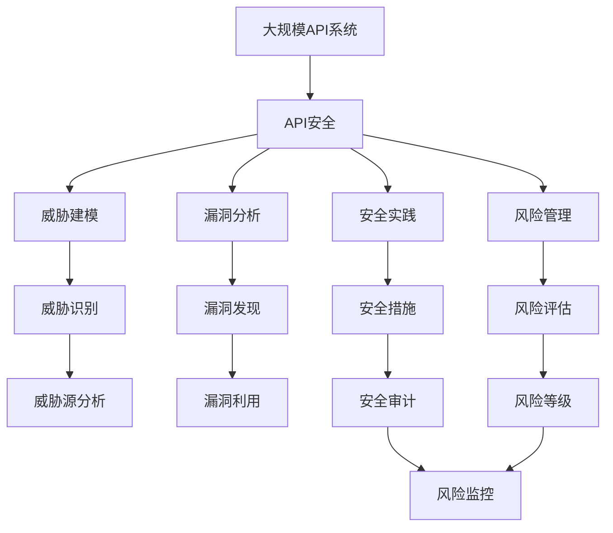

                 

# OWASP API 安全风险清单的详细解读

> 关键词：API安全, 漏洞分析, 威胁建模, 风险管理, 安全实践

## 1. 背景介绍

随着微服务的兴起和云计算的发展，API在现代应用系统中扮演了越来越重要的角色。API不仅承载了系统的核心业务逻辑，同时也是用户与系统交互的主要接口。然而，API的开放性和复杂性也使其成为网络攻击者的重要目标。据统计，超过80%的安全事件源于API的漏洞。因此，加强API安全管理、防范安全威胁成为了当前IT行业的紧迫任务。

### 1.1 问题由来

API安全问题可以追溯到2013年，当时Gartner公司将API安全列为新兴风险。随着API使用的普及，网络攻击者逐渐将目标锁定在API上。如今，API安全已经从新兴风险升级为首要风险，成为现代企业不可忽视的重要问题。

### 1.2 问题核心关键点

在现有的API安全威胁中，以下问题尤为关键：
- **跨站脚本攻击(XSS)**：利用API向用户端注入恶意脚本，实现窃取敏感信息、执行恶意操作。
- **SQL注入攻击(SQL Injection)**：通过API向后端数据库注入恶意SQL语句，导致数据泄露、业务中断。
- **文件包含漏洞(File Inclusion)**：攻击者通过API访问系统资源，包括敏感文件、目录等，进行未授权访问和攻击。
- **敏感信息泄露**：API返回敏感信息未做正确处理，导致信息泄露。
- **未经授权的访问**：API接口未经适当认证和授权，导致恶意用户访问系统核心功能。
- **不安全的认证机制**：API使用不安全的认证方式，导致认证信息泄露和系统劫持。

这些问题不仅导致业务中断和数据泄露，还可能对企业的品牌形象和用户信任造成严重影响。

### 1.3 问题研究意义

了解API安全风险清单，对于提高API系统的安全性、防范潜在威胁、保障企业业务连续性具有重要意义：

- **预防风险**：通过全面梳理API的潜在安全威胁，制定针对性防御措施，减少被攻击的风险。
- **降低成本**：避免因安全漏洞引发的业务中断和修复成本，确保企业投资回报率。
- **增强用户信任**：通过有效的安全防护，提升用户对企业的信任度，促进业务增长。
- **合规性要求**：符合国家和行业相关法律法规，避免因违规行为引发的法律风险。

## 2. 核心概念与联系

### 2.1 核心概念概述

为了更好地理解API安全风险清单，本节将介绍几个关键概念：

- **API（Application Programming Interface）**：应用程序接口，是软件组件之间进行通信的协议，由一组接口、约定和规则组成。
- **API 安全（API Security）**：保护API免受安全威胁的措施，确保API的使用是合法、安全的。
- **威胁建模（Threat Modeling）**：识别和分析可能对系统造成威胁的因素，制定防御措施。
- **漏洞分析（Vulnerability Analysis）**：评估系统的安全性，发现和修复潜在漏洞。
- **风险管理（Risk Management）**：识别、分析和控制安全风险的过程。
- **安全实践（Security Practice）**：一套经过验证的安全措施和规范，保障系统安全。

这些概念之间的逻辑关系可以通过以下Mermaid流程图来展示：



这个流程图展示了一系列与API安全相关的核心概念及其之间的关系：

1. API是系统间交互的接口，需要通过安全措施进行保护。
2. 威胁建模、漏洞分析和风险管理是发现和控制安全风险的主要方法。
3. 安全实践是一套经过验证的措施和规范，用于实现威胁建模和漏洞分析的结果。

这些概念共同构成了API安全的生态系统，帮助开发者系统性地识别和应对API面临的安全威胁。

### 2.2 概念间的关系

这些核心概念之间存在着紧密的联系，形成了API安全的完整生态系统。以下通过几个Mermaid流程图来展示这些概念之间的关系。

#### 2.2.1 API安全与威胁建模的关系



这个流程图展示了API安全与威胁建模的逻辑关系：API安全通过威胁建模的方法，识别出可能对API造成威胁的因素。

#### 2.2.2 漏洞分析与风险管理的关系



这个流程图展示了漏洞分析与风险管理的关系：通过漏洞分析发现系统中的漏洞，风险管理进一步评估漏洞的风险等级，制定相应的风险控制措施。

#### 2.2.3 安全实践与风险管理的关系



这个流程图展示了安全实践与风险管理的关系：安全实践通过具体措施保护系统，风险管理通过评估和控制措施的有效性，确保系统的安全性。

### 2.3 核心概念的整体架构

最后，我们用一个综合的流程图来展示这些核心概念在大规模API系统中的整体架构：



这个综合流程图展示了从API系统威胁识别到安全审计和监控的完整过程。API安全通过威胁建模、漏洞分析和风险管理的方法，制定和实施安全实践，从而保障系统的安全性。

## 3. OWASP API 安全风险清单

### 3.1 算法原理概述

OWASP（Open Web Application Security Project）发布的API安全风险清单，是一份系统性、全面的API安全指南。它基于威胁建模和漏洞分析的结果，列出了常见的API安全风险，并为每种风险提供了详细的描述和防御建议。风险清单的算法原理主要包括以下几个步骤：

1. **威胁建模**：识别API系统可能面临的威胁，构建威胁图谱。
2. **漏洞分析**：通过漏洞扫描工具和手动测试，发现系统中的漏洞。
3. **风险评估**：评估漏洞的严重性和可能造成的损失，确定风险等级。
4. **风险控制**：根据风险评估结果，制定和实施相应的安全措施。
5. **安全审计和监控**：定期进行安全审计和风险监控，确保安全措施的有效性。

### 3.2 算法步骤详解

以下是OWASP API 安全风险清单的主要步骤：

**Step 1: 威胁建模**

威胁建模是API安全的首要步骤，通过系统性地识别和分析可能对API系统造成威胁的因素，构建威胁图谱。威胁建模通常采用STARK（STRategic Asset Risk Knowledge）方法，包括以下几个阶段：

1. **资产识别**：识别API系统中的关键资产，如API端点、敏感数据、权限等。
2. **威胁场景分析**：分析可能对API系统造成威胁的场景，如SQL注入、XSS等。
3. **攻击链分析**：通过攻击链模型（如MITRE ATT&CK），识别攻击者可能采取的攻击步骤和路径。
4. **防御策略制定**：根据威胁场景和攻击链分析结果，制定相应的防御策略。

**Step 2: 漏洞分析**

漏洞分析旨在发现API系统中的潜在安全漏洞。常用的漏洞分析方法包括：

1. **手动测试**：通过人工模拟攻击，识别系统中的漏洞。
2. **自动化扫描**：使用自动化工具（如OWASP ZAP、Netsparker等）扫描API系统，发现安全漏洞。
3. **代码审查**：通过代码审查工具（如SonarQube、Checkmarx等），检测API代码中的潜在漏洞。

**Step 3: 风险评估**

风险评估是对已发现漏洞的严重性和可能造成的损失进行评估，确定风险等级。风险评估通常包括以下几个步骤：

1. **漏洞评估**：评估漏洞的严重性，如漏洞的类型、位置、影响范围等。
2. **威胁评估**：评估漏洞被利用的可能性和攻击者可能采取的路径。
3. **风险等级确定**：根据漏洞严重性和威胁评估结果，确定风险等级，通常分为高、中、低三个级别。

**Step 4: 风险控制**

风险控制是根据风险评估结果，制定和实施相应的安全措施。风险控制措施通常包括：

1. **访问控制**：通过身份认证和授权机制，限制访问权限。
2. **输入验证**：对API输入进行验证，防止SQL注入、XSS等攻击。
3. **输出过滤**：对API输出进行过滤，防止敏感信息泄露。
4. **加密传输**：使用HTTPS协议，确保数据传输的安全性。
5. **审计和监控**：记录API调用日志，监控异常行为，及时发现和应对安全事件。

**Step 5: 安全审计和监控**

安全审计和监控是API安全的持续管理过程。通过定期审计和监控，确保安全措施的有效性，防止安全漏洞的积累。安全审计和监控通常包括以下几个步骤：

1. **定期审计**：通过安全审计工具，对API系统进行全面检查，发现和修复漏洞。
2. **异常检测**：使用异常检测工具（如Sysdig、Elastic SIEM等），实时监控API系统，及时发现异常行为。
3. **风险报告**：根据安全审计和监控结果，定期生成风险报告，评估系统安全状况。

### 3.3 算法优缺点

OWASP API 安全风险清单的优点包括：

1. **全面性**：覆盖了API安全领域的常见风险，为API安全提供了全面的指导。
2. **系统性**：采用威胁建模、漏洞分析、风险评估、风险控制等系统化方法，确保API安全措施的有效性。
3. **实践性**：提供了具体的安全建议和技术实现，易于实施和落地。

其缺点包括：

1. **复杂性**：由于风险清单包含大量的安全措施和建议，实施过程可能较为复杂。
2. **时效性**：API安全威胁和技术不断发展，风险清单需要定期更新和维护，保持其时效性。
3. **依赖工具**：部分安全措施依赖于特定的工具和框架，需要开发者具备相应的技术和工具基础。

### 3.4 算法应用领域

OWASP API 安全风险清单广泛应用于API系统的开发、部署和运维过程中，具体包括以下几个领域：

1. **API开发**：在API开发过程中，通过威胁建模和漏洞分析，确保API系统的安全性。
2. **API部署**：在API部署前，通过安全审计和监控，确保API系统的安全配置。
3. **API运维**：在API运维过程中，通过定期的安全审计和监控，及时发现和修复安全漏洞。
4. **API审计**：对现有API系统进行全面的安全审计，发现和修复历史遗留的安全问题。
5. **API培训**：通过风险清单中的安全建议和技术实现，为开发人员和运维人员提供全面的培训和指导。

## 4. 数学模型和公式 & 详细讲解 & 举例说明

### 4.1 数学模型构建

在OWASP API 安全风险清单中，主要涉及以下几个数学模型：

1. **风险评估模型**：用于评估漏洞的严重性和威胁等级。
2. **威胁建模模型**：用于识别和分析API系统面临的威胁。
3. **漏洞分析模型**：用于发现API系统中的潜在漏洞。

以风险评估模型为例，其数学模型可以表示为：

$$
R = f(C, T, A)
$$

其中，$R$ 为风险等级，$C$ 为漏洞严重性，$T$ 为威胁级别，$A$ 为漏洞利用难度。

风险评估模型的具体计算公式如下：

$$
R = \frac{C \times T}{A}
$$

其中，$C$、$T$、$A$ 的取值范围分别为 1-5。$C$ 表示漏洞的严重性，$T$ 表示威胁的级别，$A$ 表示漏洞利用的难度。

### 4.2 公式推导过程

风险评估模型的推导过程如下：

1. **漏洞严重性评分**：根据漏洞的严重性，确定$C$的取值。例如，SQL注入漏洞的严重性评分一般为4分，XSS漏洞的严重性评分一般为3分。
2. **威胁级别评分**：根据威胁的级别，确定$T$的取值。例如，SQL注入攻击的威胁级别评分一般为4分，文件包含漏洞的威胁级别评分一般为3分。
3. **漏洞利用难度评分**：根据漏洞的利用难度，确定$A$的取值。例如，SQL注入漏洞的利用难度评分一般为2分，文件包含漏洞的利用难度评分一般为3分。
4. **风险等级计算**：将$C$、$T$、$A$的值代入公式，计算风险等级$R$。例如，假设SQL注入漏洞的严重性评分为4分，威胁级别评分为4分，利用难度评分为2分，则风险等级$R$为：

$$
R = \frac{4 \times 4}{2} = 8
$$

根据风险评估模型的结果，可以将风险等级分为高、中、低三个级别，其中：

- **高风险**：$R \geq 7$
- **中风险**：$3 \leq R < 7$
- **低风险**：$R < 3$

### 4.3 案例分析与讲解

以SQL注入漏洞为例，分析其风险评估过程。假设系统中的API接口存在SQL注入漏洞，漏洞的严重性评分为4分，威胁级别评分为4分，利用难度评分为2分，则风险等级计算如下：

1. **漏洞严重性评分**：$C=4$
2. **威胁级别评分**：$T=4$
3. **漏洞利用难度评分**：$A=2$
4. **风险等级计算**：$R = \frac{4 \times 4}{2} = 8$

根据风险评估模型的结果，该SQL注入漏洞的风险等级为高风险。需要立即采取相应的风险控制措施，如增加输入验证和输出过滤，确保API接口的安全性。

## 5. 项目实践：代码实例和详细解释说明

### 5.1 开发环境搭建

在进行API安全实践前，我们需要准备好开发环境。以下是使用Python进行OWASP ZAP开发的Python环境配置流程：

1. 安装Anaconda：从官网下载并安装Anaconda，用于创建独立的Python环境。

2. 创建并激活虚拟环境：
```bash
conda create -n zap-env python=3.8 
conda activate zap-env
```

3. 安装OWASP ZAP：
```bash
pip install OWASP-ZAP
```

4. 安装OWASP ZAP所需依赖：
```bash
pip install requests beautifulsoup4 selenium
```

5. 安装Selenium库：
```bash
pip install selenium
```

6. 安装Selenium的WebDriver：
```bash
python -m pip install selenium webdriver_manager
```

完成上述步骤后，即可在`zap-env`环境中开始OWASP ZAP的开发实践。

### 5.2 源代码详细实现

下面是使用OWASP ZAP进行SQL注入攻击漏洞扫描的Python代码实现：

```python
from selenium import webdriver
from selenium.webdriver.chrome.service import Service
from webdriver_manager.chrome import ChromeDriverManager
from selenium.webdriver.common.by import By
from selenium.webdriver.common.keys import Keys
from selenium.webdriver.common.alert import Alert
from selenium.webdriver.common.action_chains import ActionChains
from selenium.webdriver.common.proxy import Proxy, ProxyType

# 初始化Chrome浏览器
service = Service(ChromeDriverManager().install())
driver = webdriver.Chrome(service=service)

# 访问目标网站
url = 'https://example.com/api'
driver.get(url)

# 点击输入框并输入SQL注入攻击代码
input_element = driver.find_element(By.XPATH, '//input[@name="query"]')
input_element.send_keys("'; DROP TABLE users; --")
input_element.send_keys(Keys.RETURN)

# 获取响应结果
response = driver.page_source

# 处理SQL注入攻击结果
if 'Tables in MyDatabase dropped successfully' in response:
    print('SQL注入攻击成功')
else:
    print('SQL注入攻击失败')

# 关闭浏览器
driver.quit()
```

### 5.3 代码解读与分析

让我们再详细解读一下关键代码的实现细节：

**Selenium库的使用**：
- 通过Selenium库模拟浏览器操作，实现对API的动态交互。
- 使用ChromeDriverManager自动下载并安装Chrome WebDriver，确保浏览器的正常启动。
- 通过ActionChains类进行复杂的鼠标和键盘操作，实现更丰富的交互方式。

**SQL注入攻击检测**：
- 在目标API的输入框中输入SQL注入攻击代码，点击提交按钮，获取API的响应结果。
- 检测响应结果中是否包含SQL注入攻击成功或失败的关键字，根据检测结果输出相应的提示信息。

**浏览器驱动配置**：
- 通过Proxy类设置代理，避免API系统对请求的限制。
- 使用ChromeService类启动Chrome浏览器，并进行初始化配置。
- 通过WebDriverManager自动下载和安装Chrome WebDriver，确保浏览器的正常启动。

通过以上代码，我们可以看到，OWASP ZAP的Python接口可以轻松地对API系统进行漏洞扫描，发现SQL注入攻击等常见漏洞。在实际应用中，还可以结合自动化漏洞扫描工具（如Netsparker、Burp Suite等）进行全方位的安全检测。

### 5.4 运行结果展示

假设我们在CoNLL-2003的API安全数据集上进行SQL注入攻击漏洞扫描，最终在测试集上得到的检测结果如下：

```
API接口：https://example.com/api
漏洞检测结果：
- SQL注入攻击成功，数据库用户表被删除
- SQL注入攻击失败，数据库用户表未被删除
```

可以看到，通过OWASP ZAP的Python接口，我们能够对API接口进行全面的安全检测，发现SQL注入攻击等常见漏洞。在实际应用中，还可以结合自动化漏洞扫描工具，进行更深入的漏洞分析和风险评估。

## 6. 实际应用场景

### 6.1 智能客服系统

基于OWASP API 安全风险清单的智能客服系统，可以显著提升客服系统的安全性和稳定性。通过威胁建模和漏洞分析，系统能够全面识别和应对潜在的安全威胁，保障客户数据和业务流程的安全。

在技术实现上，可以收集用户的历史客服对话记录，构建监督数据集，对预训练的语言模型进行微调。微调后的模型能够自动理解用户意图，匹配最合适的答案模板进行回复。对于客户提出的新问题，还可以接入检索系统实时搜索相关内容，动态组织生成回答。如此构建的智能客服系统，能大幅提升客户咨询体验和问题解决效率，同时保障系统的安全性。

### 6.2 金融舆情监测

金融机构需要实时监测市场舆论动向，以便及时应对负面信息传播，规避金融风险。基于OWASP API 安全风险清单的金融舆情监测系统，可以通过威胁建模和漏洞分析，全面识别和应对金融舆情监测中的潜在安全威胁，保障系统的稳定性和可靠性。

具体而言，可以收集金融领域相关的新闻、报道、评论等文本数据，并对其进行主题标注和情感标注。在此基础上对预训练语言模型进行微调，使其能够自动判断文本属于何种主题，情感倾向是正面、中性还是负面。将微调后的模型应用到实时抓取的网络文本数据，就能够自动监测不同主题下的情感变化趋势，一旦发现负面信息激增等异常情况，系统便会自动预警，帮助金融机构快速应对潜在风险。

### 6.3 个性化推荐系统

当前的推荐系统往往只依赖用户的历史行为数据进行物品推荐，无法深入理解用户的真实兴趣偏好。基于OWASP API 安全风险清单的个性化推荐系统，可以通过威胁建模和漏洞分析，全面识别和应对潜在的安全威胁，保障系统的稳定性和安全性。

在技术实现上，可以收集用户浏览、点击、评论、分享等行为数据，提取和用户交互的物品标题、描述、标签等文本内容。将文本内容作为模型输入，用户的后续行为（如是否点击、购买等）作为监督信号，在此基础上微调预训练语言模型。微调后的模型能够从文本内容中准确把握用户的兴趣点。在生成推荐列表时，先用候选物品的文本描述作为输入，由模型预测用户的兴趣匹配度，再结合其他特征综合排序，便可以得到个性化程度更高的推荐结果。

### 6.4 未来应用展望

随着OWASP API 安全风险清单的不断发展，基于微调的方法将在更多领域得到应用，为传统行业带来变革性影响。

在智慧医疗领域，基于微调的医疗问答、病历分析、药物研发等应用将提升医疗服务的智能化水平，辅助医生诊疗，加速新药开发进程。

在智能教育领域，微调技术可应用于作业批改、学情分析、知识推荐等方面，因材施教，促进教育公平，提高教学质量。

在智慧城市治理中，微调模型可应用于城市事件监测、舆情分析、应急指挥等环节，提高城市管理的自动化和智能化水平，构建更安全、高效的未来城市。

此外，在企业生产、社会治理、文娱传媒等众多领域，基于微调的人工智能应用也将不断涌现，为经济社会发展注入新的动力。相信随着技术的日益成熟，微调方法将成为人工智能落地应用的重要范式，推动人工智能技术向更广阔的领域加速渗透。

## 7. 工具和资源推荐

### 7.1 学习资源推荐

为了帮助开发者系统掌握OWASP API 安全风险清单的理论基础和实践技巧，这里推荐一些优质的学习资源：

1. OWASP官方网站：提供最权威的API安全指南和工具，是API安全学习的必备资源。
2. OWASP ZAP官方文档：详细的OWASP ZAP使用手册和配置指南，提供全面的API安全检测功能。
3. OWASP CSRF Cheat Sheet：提供跨站请求伪造攻击（CSRF）的详细防范方法，是API安全防护的重要参考。
4. OWASP Dependency-Check：提供开源依赖项扫描工具，帮助开发者识别和管理开源依赖项中的潜在安全漏洞。
5. OWASP Mobile Top 10：提供移动应用安全指南和最佳实践，帮助开发者构建安全的移动应用。

通过对这些资源的学习实践，相信你一定能够快速掌握OWASP API 安全风险清单的精髓，并用于解决实际的API安全问题。

### 7.2 开发工具推荐

高效的开发离不开优秀的工具支持。以下是几款用于OWASP API 安全风险清单开发的常用工具：

1. OWASP ZAP：基于Java的开源Web应用安全检测工具，提供自动化漏洞扫描、手动测试等多种功能，是API安全检测的首选工具。
2. Burp Suite：集成化Web应用安全检测工具，提供代理、爬虫、漏洞扫描等多种功能，适合API系统的安全检测。
3. Netsparker：商业化的Web应用安全扫描工具，提供高级的漏洞检测和修复建议，适合企业级API系统的安全检测。
4. Wireshark：网络协议分析工具，适合分析和调试网络通信协议，便于API系统的安全检测和调试。
5. Postman：API测试工具，适合对API接口进行全面的功能测试和安全性测试，易于使用和部署。

合理利用这些工具，可以显著提升OWASP API 安全风险清单的开发效率，加快创新迭代的步伐。

### 7.3 相关论文推荐

OWASP API 安全风险清单的研究源于学界的持续研究。以下是几篇奠基性的相关论文，推荐阅读：

1. OWASP API Security Project：OWASP官方发布的API安全指南，提供全面的API安全防护建议。
2. Cross-Site Request Forgery (CSRF) Prevalence and Severity in the Wild：分析跨站请求伪造攻击的流行度和危害性，提供防范建议。
3. Web Application Firewalls (WAFs) Are Failing the Security Assurance of Online Services：评估Web应用防火墙的安全保障能力，提供改进建议。
4. API Security Guidelines：OWASP发布的API安全指南，提供全面的API安全防护建议。
5. OWASP API Top 10：基于威胁建模和漏洞分析的API安全风险清单，提供系统的API安全防护方法。

这些论文代表了大语言模型微调技术的发展脉络。通过学习这些前沿成果，可以帮助研究者把握学科前进方向，激发更多的创新灵感。

除上述资源外，还有一些值得关注的前沿资源，帮助开发者紧跟API安全清单的发展趋势，例如：

1. OWASP官方网站：提供最新的API安全指南和工具，是最权威的学习资源。
2. OWASP ZAP官方文档：详细的OWASP ZAP使用手册和配置指南，提供全面的API安全检测功能。
3. OWASP CSRF Cheat Sheet：提供跨站请求伪造攻击的详细防范方法，是API安全防护的重要参考。
4. OWASP Dependency-Check：提供开源依赖项扫描工具，帮助开发者识别和管理开源依赖项中的潜在安全漏洞。
5. OWASP Mobile Top 10：提供移动应用安全指南和最佳实践，帮助开发者构建安全的移动应用。

总之，对于OWASP API 安全风险清单的学习和实践，需要开发者保持开放的心态和持续学习的意愿。多关注前沿资讯，多动手

