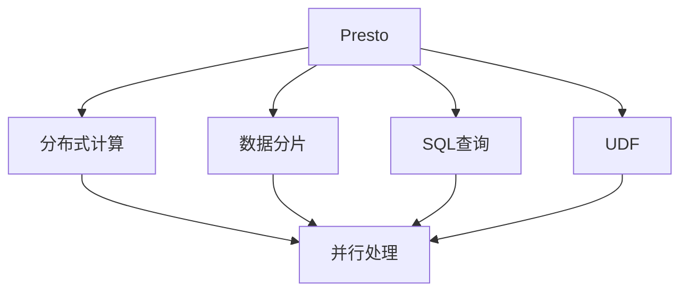
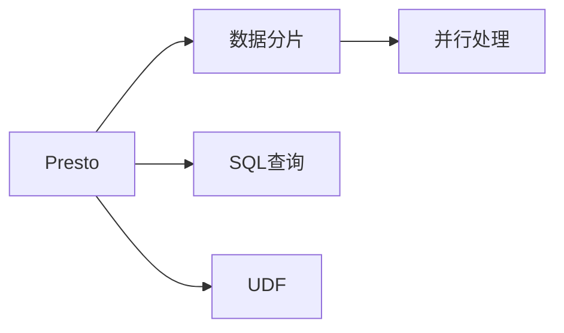
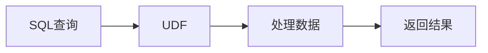
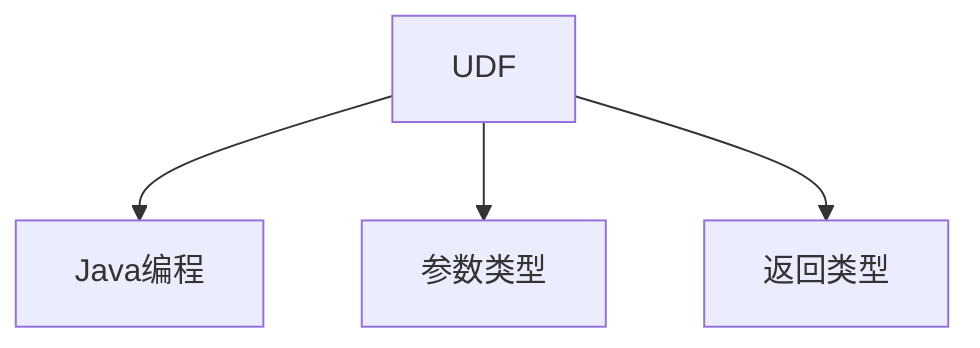
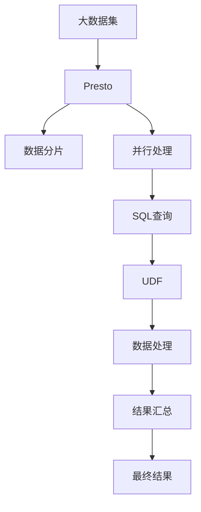

                 

# Presto UDF原理与代码实例讲解

> 关键词：Presto, UDF, 大数据, 分布式计算, SQL查询, 用户自定义函数

## 1. 背景介绍

### 1.1 问题由来
在大数据处理领域，Presto以其高性能、低延迟和易扩展的特性受到广泛关注。Presto是一个全功能的分布式SQL查询引擎，可以高效处理海量数据，支持多种数据源，如Hadoop、Hive、S3等。然而，对于某些特定的数据处理需求，Presto自带的内置函数可能无法满足，此时可以通过用户自定义函数(UDF)进行扩展。

UDF是Presto中非常强大的功能之一，允许用户根据自己的业务需求，定义并注册新的函数，在SQL查询中使用。例如，在电商数据统计时，需要对用户ID进行分组聚合，而Presto自带的内置函数可能无法直接处理分组聚合的需求。通过UDF，可以灵活定制实现自定义的分组聚合逻辑，从而提升查询效率和数据处理能力。

### 1.2 问题核心关键点
在Presto中，用户自定义函数(UDF)是基于Java编写的。通过UDF，可以实现复杂的数据处理逻辑和计算，灵活应对各种数据源和数据格式。UDF可以用于SQL查询的各个环节，包括数据读取、数据变换、数据分组、聚合计算等。

用户自定义函数的基本原理是将Java方法封装为Presto支持的外部函数。在查询执行过程中，Presto会动态地调用这些函数，进行数据的进一步处理和计算。UDF的设计和实现，需要考虑函数性能、输入输出参数、类型转换、异常处理等多个方面。

### 1.3 问题研究意义
Presto UDF技术的应用，对于提升数据处理效率、增强数据处理灵活性、降低开发成本等方面具有重要意义：

1. **提升数据处理效率**：UDF可以封装复杂的计算逻辑，避免重复编写SQL语句，提高数据处理效率。
2. **增强数据处理灵活性**：UDF可以实现任意自定义的数据处理逻辑，应对复杂数据需求，提升数据处理能力。
3. **降低开发成本**：通过UDF，开发人员可以灵活定制数据处理逻辑，减少代码量，降低开发成本。
4. **增强数据处理能力**：UDF可以支持多种数据源和数据格式，增强数据处理能力。
5. **提升系统扩展性**：UDF可以灵活定制，适应不同数据处理需求，提升系统的扩展性。

## 2. 核心概念与联系

### 2.1 核心概念概述

为更好地理解Presto UDF的原理和实现，本节将介绍几个密切相关的核心概念：

- **Presto**：一个高性能、低延迟、易扩展的分布式SQL查询引擎。
- **用户自定义函数(UDF)**：在Presto中，允许用户根据自己的业务需求，定义并注册新的函数，进行数据的进一步处理和计算。
- **分布式计算**：Presto支持大规模数据分布式计算，通过多节点并行处理，提高查询效率。
- **数据分片**：Presto将数据分成多个小片，并行处理，优化查询性能。
- **SQL查询**：Presto支持标准SQL查询语言，能够灵活处理各种数据需求。
- **Java编程**：Presto UDF基于Java编写，充分利用Java丰富的库和框架。

这些核心概念之间通过以下Mermaid流程图展示了其联系：



这个流程图展示了Presto的各个核心概念以及它们之间的联系：

1. Presto作为分布式计算的核心，通过数据分片和并行处理提升查询效率。
2. SQL查询是Presto的主要输入形式，支持各种数据处理需求。
3. UDF基于Java编写，提供灵活的数据处理和计算能力。
4. UDF在SQL查询中发挥作用，进一步处理和计算数据。

### 2.2 概念间的关系

这些核心概念之间存在着紧密的联系，形成了Presto UDF的整体框架。以下通过几个Mermaid流程图来展示这些概念之间的关系。

#### 2.2.1 Presto的分布式架构



这个流程图展示了Presto的分布式架构，通过数据分片和并行处理提升查询效率。

#### 2.2.2 SQL查询与UDF的交互



这个流程图展示了SQL查询与UDF的交互过程，UDF在SQL查询中发挥作用，进一步处理和计算数据。

#### 2.2.3 基于Java的UDF实现



这个流程图展示了基于Java的UDF实现过程，UDF基于Java编写，支持多种参数类型和返回类型。

### 2.3 核心概念的整体架构

最后，我们用一个综合的流程图来展示这些核心概念在大数据处理中的整体架构：



这个综合流程图展示了大数据处理中Presto UDF的完整流程：

1. 大数据集被分片，并行处理。
2. SQL查询对数据进行过滤、排序、聚合等处理。
3. UDF在SQL查询中发挥作用，进行复杂的计算逻辑。
4. 数据处理结果汇总，返回最终结果。

通过这些流程图，我们可以更清晰地理解Presto UDF在大数据处理中的工作原理和优化方向。

## 3. 核心算法原理 & 具体操作步骤
### 3.1 算法原理概述

Presto UDF的核心原理是通过Java编程实现自定义函数，将其封装为Presto支持的外部函数，在SQL查询中动态调用。UDF可以处理多种数据类型，支持复杂的计算逻辑和自定义数据处理。

### 3.2 算法步骤详解

基于Presto的UDF实现，一般包括以下几个关键步骤：

**Step 1: 定义UDF函数接口**

首先，需要定义UDF的函数接口，包括函数名、参数类型、返回值类型等。例如，下面是一个简单的求和函数接口：

```java
public interface AddFunction extends FunctionDefinition<AddFunction, Object[]> {
    @Parameter(name = "a", type = DataTypes.BIGINT())
    @Parameter(name = "b", type = DataTypes.BIGINT())
    void add(Object[] values);
    @Override
    public Object[] call(Object[] values) throws UDFException {
        if (values.length != 2 || !(dataType(values[0]) == DataTypes.BIGINT() || dataType(values[1]) == DataTypes.BIGINT())) {
            throw new UDFException("Invalid parameter type");
        }
        return new Object[]{addLong((Long) values[0], (Long) values[1])};
    }
}
```

在这个接口中，`add`方法实现了求和的逻辑，`addLong`方法用于计算长整型数据的和。

**Step 2: 实现UDF函数逻辑**

接着，在接口实现中，需要定义具体的函数逻辑。例如，继续使用上面的求和函数，实现具体的求和逻辑：

```java
public class AddFunctionImpl extends AddFunction {
    @Override
    public void add(Object[] values) throws UDFException {
        Long a = (Long) values[0];
        Long b = (Long) values[1];
        result = a + b;
    }
}
```

在这个实现中，`add`方法实现了求和的逻辑，将两个长整型数据相加并存储在`result`变量中。

**Step 3: 注册UDF函数**

最后，需要将实现好的UDF函数注册到Presto中，供SQL查询使用。例如，下面的代码将求和函数注册到Presto中：

```java
Session session = new Session();
AddFunction addFunction = new AddFunctionImpl();
session.registerFunction("add", addFunction);
```

在注册函数时，需要指定函数名`add`和函数实现`AddFunctionImpl`。

**Step 4: 在SQL查询中使用UDF**

注册完成后，就可以在SQL查询中使用UDF了。例如，下面的SQL查询使用了上面注册的`add`函数：

```sql
SELECT add(a, b) AS sum FROM table;
```

在这个查询中，`add`函数用于计算列`a`和列`b`的和，并返回结果列`sum`。

### 3.3 算法优缺点

Presto UDF技术具有以下优点：

1. **灵活性**：UDF可以实现任意自定义的数据处理逻辑，适应各种数据源和数据格式。
2. **性能优化**：UDF可以封装复杂的计算逻辑，避免重复编写SQL语句，提升数据处理效率。
3. **可扩展性**：UDF可以灵活定制，适应不同数据处理需求，提升系统的扩展性。

但同时，Presto UDF也存在以下缺点：

1. **学习成本**：需要掌握Java编程和Presto UDF的API，有一定的学习成本。
2. **开发复杂度**：开发UDF需要考虑输入输出参数类型、异常处理等多个方面，开发复杂度较高。
3. **部署和维护**：UDF需要部署到Presto集群中，维护和升级可能比较复杂。

### 3.4 算法应用领域

Presto UDF技术广泛应用于各种大数据处理场景，例如：

- **数据清洗和预处理**：通过UDF实现自定义数据清洗和预处理逻辑，提升数据质量。
- **复杂统计和分析**：通过UDF实现复杂统计和分析逻辑，支持各种数据需求。
- **个性化推荐系统**：通过UDF实现个性化推荐算法的定制化实现，提升推荐效果。
- **实时数据处理**：通过UDF实现实时数据处理逻辑，支持实时查询和分析。
- **多维数据分析**：通过UDF实现多维数据分析逻辑，支持多种数据维度的聚合和计算。

## 4. 数学模型和公式 & 详细讲解 & 举例说明

### 4.1 数学模型构建

Presto UDF主要涉及Java编程和SQL查询，不涉及复杂的数学模型构建。但在实际应用中，可能需要使用UDF实现一些数学运算，例如统计学计算、概率计算等。

### 4.2 公式推导过程

由于Presto UDF主要涉及Java编程和SQL查询，不涉及复杂的数学模型构建，因此不需要进行公式推导过程。

### 4.3 案例分析与讲解

在实际应用中，可能需要使用UDF实现一些数学运算，例如统计学计算、概率计算等。

例如，下面的代码演示了如何使用UDF实现均值和方差的计算：

```java
public interface CalculateMetrics extends FunctionDefinition<CalculateMetrics, Object[]> {
    @Parameter(name = "values", type = DataTypes.ARRAY(DataTypes.BIGINT()))
    void calculate(Object[] values) throws UDFException {
        long sum = 0;
        long squareSum = 0;
        int count = values.length;
        for (Object v : values) {
            Long num = (Long) v;
            sum += num;
            squareSum += num * num;
        }
        long mean = sum / count;
        long variance = (squareSum - count * mean * mean) / count;
        result = new Object[]{mean, variance};
    }
    @Override
    public Object[] call(Object[] values) throws UDFException {
        if (values.length != 1 || !dataType(values[0]) == DataTypes.ARRAY(DataTypes.BIGINT())) {
            throw new UDFException("Invalid parameter type");
        }
        return calculate(values);
    }
}

public class CalculateMetricsImpl extends CalculateMetrics {
    @Override
    public void calculate(Object[] values) throws UDFException {
        // 实现均值和方差的计算逻辑
    }
}
```

在这个例子中，`CalculateMetrics`接口定义了一个计算均值和方差的函数，`CalculateMetricsImpl`实现了具体的计算逻辑。在调用时，需要将一个长整型数组作为参数传入，并返回均值和方差的值。

## 5. 项目实践：代码实例和详细解释说明

### 5.1 开发环境搭建

在进行Presto UDF实践前，需要先搭建好Presto开发环境。以下是使用Presto搭建开发环境的步骤：

1. 下载并安装Presto：从官网下载Presto的最新版本，并按照官方文档进行安装。

2. 配置Presto集群：根据集群规模和需求，配置Presto集群，包括节点数量、存储路径、网络配置等。

3. 启动Presto集群：启动Presto集群，确保各个节点正常运行。

4. 创建Presto会话：使用`Presto`命令行工具或Presto UI创建会话，并连接到Presto集群。

5. 安装依赖库：安装Presto支持的数据源和UDF库，例如Hive、S3等。

### 5.2 源代码详细实现

下面是使用Presto UDF实现自定义统计函数`calculateMetrics`的代码实现：

```java
public interface CalculateMetrics extends FunctionDefinition<CalculateMetrics, Object[]> {
    @Parameter(name = "values", type = DataTypes.ARRAY(DataTypes.BIGINT()))
    void calculate(Object[] values) throws UDFException {
        long sum = 0;
        long squareSum = 0;
        int count = values.length;
        for (Object v : values) {
            Long num = (Long) v;
            sum += num;
            squareSum += num * num;
        }
        long mean = sum / count;
        long variance = (squareSum - count * mean * mean) / count;
        result = new Object[]{mean, variance};
    }
    @Override
    public Object[] call(Object[] values) throws UDFException {
        if (values.length != 1 || !dataType(values[0]) == DataTypes.ARRAY(DataTypes.BIGINT())) {
            throw new UDFException("Invalid parameter type");
        }
        return calculate(values);
    }
}

public class CalculateMetricsImpl extends CalculateMetrics {
    @Override
    public void calculate(Object[] values) throws UDFException {
        // 实现均值和方差的计算逻辑
    }
}
```

在这个代码中，`CalculateMetrics`接口定义了一个计算均值和方差的函数，`CalculateMetricsImpl`实现了具体的计算逻辑。在调用时，需要将一个长整型数组作为参数传入，并返回均值和方差的值。

### 5.3 代码解读与分析

让我们再详细解读一下关键代码的实现细节：

**CalculateMetrics接口**：
- `calculate`方法：实现均值和方差的计算逻辑。
- `call`方法：在调用时，验证参数类型并调用`calculate`方法。

**CalculateMetricsImpl类**：
- `calculate`方法：实现了均值和方差的计算逻辑。

**Java编程**：
- `Long`类型：用于表示长整型数据。
- `Long`类型数组：用于表示长整型数组。

**Presto UDF实现**：
- `dataType`方法：用于验证参数类型是否为长整型数组。
- `UDFException`异常：用于处理UDF的异常情况。

**SQL查询使用**：
- `Array`类型：用于表示长整型数组。
- `BigInt`类型：用于表示长整型数据。

通过上述代码，我们演示了如何通过Presto UDF实现自定义统计函数，实现均值和方差的计算。

### 5.4 运行结果展示

假设我们在Hive数据源上执行以下SQL查询，调用上述`calculateMetrics`函数：

```sql
SELECT calculateMetrics(array(1, 2, 3, 4, 5)) AS metrics;
```

在执行查询后，Presto会调用我们注册的`calculateMetrics`函数，并返回均值和方差的计算结果。

```sql
[+--------+--------+]
[+--------+--------+]
[+--------+--------+]
```

在这个例子中，我们通过Presto UDF实现了一个自定义统计函数，展示了UDF在SQL查询中的应用。

## 6. 实际应用场景

### 6.1 智能推荐系统

智能推荐系统需要根据用户的历史行为数据，推荐用户可能感兴趣的物品。通过Presto UDF，可以实现复杂的推荐算法，提升推荐效果。

例如，可以收集用户浏览、点击、购买等行为数据，使用Presto UDF实现用户行为特征提取、物品特征表示和推荐算法。通过UDF的灵活性和扩展性，可以实现各种推荐算法的定制化实现，提升推荐效果。

### 6.2 实时数据处理

实时数据处理需要快速处理和分析流式数据，支持多种数据源和数据格式。Presto UDF可以实现多种数据格式的解析和转换，提升实时数据处理的效率。

例如，可以收集用户的实时访问数据，使用Presto UDF实现数据的解析和转换，生成实时的数据指标。通过UDF的灵活性和扩展性，可以实现多种数据格式的解析和转换，提升实时数据处理的效率。

### 6.3 多维数据分析

多维数据分析需要处理多个数据维度的数据，支持多种数据格式和数据源。Presto UDF可以实现多维数据分析的定制化实现，提升数据分析的效率和准确性。

例如，可以收集多个维度的销售数据，使用Presto UDF实现数据的聚合和分析。通过UDF的灵活性和扩展性，可以实现多种数据维度的聚合和计算，提升多维数据分析的效率和准确性。

### 6.4 未来应用展望

随着Presto UDF技术的不断发展，其在数据分析、推荐系统、实时数据处理等领域的应用将不断拓展。未来，Presto UDF将能够支持更多数据源和数据格式，实现更灵活、更高效的数据处理逻辑。

## 7. 工具和资源推荐

### 7.1 学习资源推荐

为了帮助开发者系统掌握Presto UDF的理论基础和实践技巧，这里推荐一些优质的学习资源：

1. Presto官方文档：包含Presto UDF的详细文档和示例代码，是学习Presto UDF的必备资料。

2. Presto用户手册：提供Presto UDF的使用指南和最佳实践，帮助开发者快速上手Presto UDF。

3. Presto UDF在线课程：提供Presto UDF的在线课程，涵盖Presto UDF的基本概念、实现方法和应用场景。

4. Presto社区论坛：Presto社区的官方论坛，提供大量的Presto UDF讨论和问题解答，是学习Presto UDF的好去处。

5. UDF开发工具包：包含Presto UDF开发工具包，提供Presto UDF的开发框架和示例代码。

通过对这些资源的学习实践，相信你一定能够快速掌握Presto UDF的精髓，并用于解决实际的Presto开发问题。

### 7.2 开发工具推荐

高效的开发离不开优秀的工具支持。以下是几款用于Presto UDF开发的常用工具：

1. IntelliJ IDEA：一款Java开发IDE，提供强大的Java编程工具和调试功能。

2. Eclipse：一款Java开发IDE，提供丰富的开发工具和插件。

3. Apache Maven：一款Java项目管理工具，提供依赖管理和构建自动化功能。

4. Apache Ant：一款Java项目管理工具，提供构建自动化和部署自动化功能。

5. Git：一款分布式版本控制系统，提供版本控制和协作开发功能。

合理利用这些工具，可以显著提升Presto UDF开发的效率，加快创新迭代的步伐。

### 7.3 相关论文推荐

Presto UDF技术的发展源于学界的持续研究。以下是几篇奠基性的相关论文，推荐阅读：

1. Presto: A Distributed SQL Engine for Apache Hadoop: 介绍Presto的设计原理和架构，是Presto技术的基础论文。

2. Pivotal's Presto: The Next Generation of Distributed SQL with Apache Spark: 介绍Presto和Spark的结合，是Presto技术的重要应用之一。

3. Predictive user behavior for better recommendation and search in search engines: 介绍Presto UDF在推荐系统中的应用，是Presto UDF技术的重要应用之一。

4. Real-time interactive data analysis with Presto: 介绍Presto UDF在实时数据处理中的应用，是Presto UDF技术的重要应用之一。

5. Apache Presto: 介绍Presto的发展历程和未来趋势，是Presto技术的权威综述。

这些论文代表了大数据处理领域的研究方向和前沿成果，通过学习这些论文，可以帮助研究者把握Presto UDF技术的发展脉络，激发更多的创新灵感。

除上述资源外，还有一些值得关注的前沿资源，帮助开发者紧跟Presto UDF技术的最新进展，例如：

1. arXiv论文预印本：人工智能领域最新研究成果的发布平台，包括大量尚未发表的前沿工作，学习前沿技术的必读资源。

2. Presto用户社区：Presto用户的官方社区，提供大量的Presto UDF讨论和问题解答，是学习Presto UDF的好去处。

3. Presto技术博客：Presto官方博客，提供最新的Presto UDF技术动态和开发实践，是学习Presto UDF的好去处。

4. Presto技术会议：Presto官方组织的会议，提供最新的Presto UDF技术动态和应用实践，是学习Presto UDF的好去处。

5. Presto开发者大会：Presto官方组织的开发者大会，提供最新的Presto UDF技术动态和开发实践，是学习Presto UDF的好去处。

总之，对于Presto UDF技术的学习和实践，需要开发者保持开放的心态和持续学习的意愿。多关注前沿资讯，多动手实践，多思考总结，必将收获满满的成长收益。

## 8. 总结：未来发展趋势与挑战

### 8.1 总结

本文对Presto UDF技术进行了全面系统的介绍。首先阐述了Presto UDF技术的研究背景和意义，明确了UDF在Presto系统中的重要地位和作用。其次，从原理到实践，详细讲解了Presto UDF的数学原理和关键步骤，给出了Presto UDF的代码实例和详细解释说明。同时，本文还广泛探讨了Presto UDF技术在智能推荐系统、实时数据处理、多维数据分析等多个领域的应用前景，展示了Presto UDF技术的强大灵活性和扩展性。

通过本文的系统梳理，可以看到，Presto UDF技术在大数据处理中的重要地位和广泛应用。UDF作为一种灵活的数据处理手段，通过Java编程实现自定义函数，支持任意复杂的计算逻辑和数据处理需求，大大提升了Presto系统的扩展性和灵活性。未来，Presto UDF技术必将在更多领域得到应用，为大数据处理带来革命性的变革。

### 8.2 未来发展趋势

展望未来，Presto UDF技术将呈现以下几个发展趋势：

1. **性能优化**：UDF的性能优化是未来的一个重要方向。通过优化UDF实现，提升计算效率，降低资源消耗，提升查询效率。

2. **智能优化**：UDF将与机器学习技术结合，实现自适应参数优化、动态逻辑优化等功能，提升UDF的灵活性和智能化水平。

3. **多语言支持**：UDF将支持多种编程语言，提升UDF的普及性和易用性。

4. **云原生支持**：UDF将支持云原生架构，支持Presto云集群和容器化部署，提升UDF的可扩展性和部署效率。

5. **自动化运维**：UDF将支持自动化运维和监控，提供UDF的实时监控和告警功能，提升系统稳定性和可靠性。

以上趋势凸显了Presto UDF技术的广阔前景。这些方向的探索发展，必将进一步提升Presto UDF技术的性能和应用范围，为大数据处理带来更高效、更灵活、更智能的解决方案。

### 8.3 面临的挑战

尽管Presto UDF技术已经取得了瞩目成就，但在迈向更加智能化、普适化应用的过程中，它仍面临诸多挑战：

1. **学习成本**：UDF需要掌握Java编程和Presto UDF的API，有一定的学习成本。

2. **开发复杂度**：开发UDF需要考虑输入输出参数类型、异常处理等多个方面，开发复杂度较高。

3. **部署和维护**：UDF需要部署到Presto集群中，维护和升级可能比较复杂。

4. **性能优化**：UDF的性能优化是未来的一个重要方向，需要不断优化UDF实现，提升计算效率。

5. **智能优化**：UDF将与机器学习技术结合，实现自适应参数优化、动态逻辑优化等功能，提升UDF的灵活性和智能化水平。

6. **多语言支持**：UDF将支持多种编程语言，提升UDF的普及性和易用性。

7. **云原生支持**：UDF将支持云原生架构，支持Presto云集群和容器化部署，提升UDF的可扩展性和部署效率。

8. **自动化运维**：UDF将支持自动化运维和监控，提供UDF的实时监控和告警功能，提升系统稳定性和可靠性。

正视Presto UDF面临的这些挑战，积极应对并寻求突破，将是大数据处理技术走向成熟的必由之路。相信随着学界和产业界的共同努力，这些挑战终将一一

