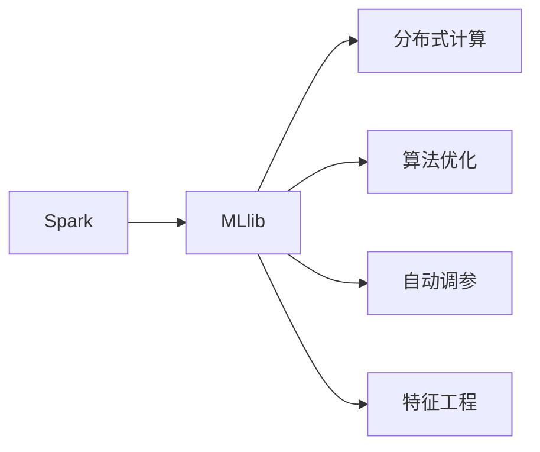
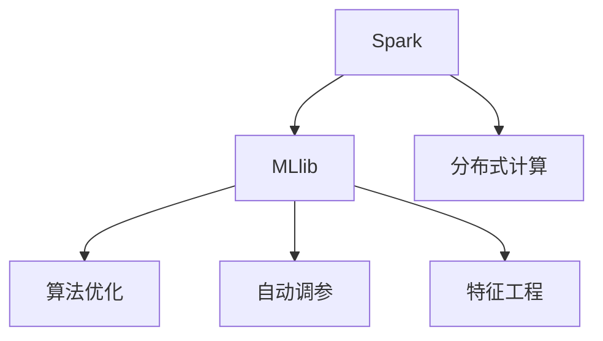

                 

# Spark MLlib机器学习库原理与代码实例讲解

> 关键词：机器学习,Spark,MLlib,核心算法,代码实例,参数调优,交叉验证,深度学习,分布式计算,特征工程

## 1. 背景介绍

### 1.1 问题由来

机器学习在数据挖掘、预测分析、自然语言处理等领域应用广泛，但在处理大规模数据时，传统单机学习算法显得力不从心。为解决这一问题，Apache Spark项目应运而生，并附带了强大的机器学习库MLlib，旨在让机器学习算法在分布式环境下高效运行。

MLlib作为Spark生态系统的重要组成部分，提供了一套完善的机器学习算法和数据处理工具。它能够支持从传统统计学习方法到深度学习、分布式学习等各种机器学习任务，并具有良好的可扩展性和容错性。

### 1.2 问题核心关键点

MLlib的核心目标是将机器学习算法优化为可在集群上并行运行、可扩展、可容错的版本。其核心算法包括分类、回归、聚类、协同过滤等，适用于大规模数据集的处理。

MLlib的重要优势包括：
- **分布式计算**：利用Spark的分布式计算能力，能够高效处理海量数据。
- **算法优化**：对多种机器学习算法进行优化，支持GPU、CPU加速计算。
- **自动化调参**：提供多种自动调参工具，帮助用户快速选择最优模型参数。
- **通用接口**：提供统一的API接口，方便用户进行多算法、多场景的机器学习实践。

### 1.3 问题研究意义

MLlib的广泛应用，能够大幅提升数据处理和分析效率，加速机器学习算法在实际场景中的应用，对数据科学和人工智能产业具有重要的推动作用：

1. **提高数据处理效率**：通过分布式计算，MLlib能够处理海量数据，提升数据处理速度和效率。
2. **优化模型训练**：MLlib的算法优化和自动调参功能，使得模型训练更加高效、准确。
3. **促进机器学习应用**：统一的API接口使得算法应用更加便捷，易于不同场景下的快速部署。
4. **增强数据科学工具链**：MLlib作为Spark生态系统的重要组成部分，能够与Spark的其他组件（如SQL、GraphX）无缝集成，形成强大的数据科学工具链。
5. **推动产业升级**：MLlib的技术和算法在大数据应用中广泛使用，为传统行业数字化转型提供新的技术路径。

## 2. 核心概念与联系

### 2.1 核心概念概述

为了更好地理解MLlib的工作原理，我们需要明确几个关键概念及其相互关系：

- **Spark**：Spark是一个快速通用大数据处理框架，提供内存计算、分布式计算、机器学习等众多功能。
- **MLlib**：Spark的机器学习库，提供多种机器学习算法和数据处理工具，支持分布式计算环境。
- **分布式计算**：通过集群计算节点，实现大规模数据的高效处理。
- **算法优化**：对多种机器学习算法进行优化，支持GPU、CPU加速计算。
- **自动调参**：通过交叉验证等方法，帮助用户快速选择最优模型参数。
- **特征工程**：通过数据清洗、特征选择、特征构建等技术，提升数据质量，增强模型的表现力。

这些概念之间的关系可以通过以下Mermaid流程图来展示：



这个流程图展示了Spark与MLlib的核心概念及其相互关系：

1. Spark是MLlib的依托环境，提供分布式计算和内存计算能力。
2. MLlib包含多种机器学习算法和数据处理工具，支持分布式计算环境。
3. 分布式计算和算法优化是MLlib的核心特性，能够高效处理大规模数据。
4. 自动调参和特征工程是MLlib的辅助技术，提升模型训练效率和性能。

### 2.2 概念间的关系

这些核心概念之间存在着紧密的联系，共同构成了MLlib的完整工作框架。下面我们通过几个Mermaid流程图来展示这些概念之间的关系。

#### 2.2.1 Spark与MLlib的结合



这个流程图展示了Spark与MLlib的结合过程。Spark提供分布式计算能力，MLlib提供算法优化、自动调参和特征工程技术，共同实现高效的机器学习算法处理。

#### 2.2.2 MLlib的核心算法构成

```mermaid
graph LR
    A[分类] --> B[线性回归]
    A --> C[决策树]
    A --> D[随机森林]
    A --> E[逻辑回归]
    B --> F[梯度提升]
    C --> G[SVM]
    D --> H[支持向量机]
    E --> I[朴素贝叶斯]
    F --> J[Adaboost]
    G --> K[FastICA]
    H --> L[特征选择]
    I --> M[线性判别分析]
    J --> N[K-means]
    K --> O[PCA]
    L --> P[PCA]
    M --> Q[PCA]
    N --> R[主成分分析]
    O --> S[主成分分析]
    P --> T[主成分分析]
    Q --> U[主成分分析]
    R --> V[主成分分析]
    S --> W[主成分分析]
    T --> X[主成分分析]
    U --> Y[主成分分析]
    V --> Z[主成分分析]
    W --> AA[主成分分析]
    X --> AB[主成分分析]
    Y --> AC[主成分分析]
    Z --> AD[主成分分析]
    AA --> AE[主成分分析]
    AB --> AF[主成分分析]
    AC --> AG[主成分分析]
    AD --> AH[主成分分析]
    AE --> AI[主成分分析]
    AF --> AJ[主成分分析]
    AG --> AK[主成分分析]
    AH --> AL[主成分分析]
    AI --> AM[主成分分析]
    AJ --> AN[主成分分析]
    AK --> AO[主成分分析]
    AL --> AP[主成分分析]
    AM --> AQ[主成分分析]
    AN --> AR[主成分分析]
    AO --> AS[主成分分析]
    AP --> AT[主成分分析]
    AQ --> AU[主成分分析]
    AR --> AV[主成分分析]
    AS --> AW[主成分分析]
    AT --> AX[主成分分析]
    AU --> AY[主成分分析]
    AV --> AZ[主成分分析]
    AW --> BA[主成分分析]
    AX --> BB[主成分分析]
    AY --> BC[主成分分析]
    AZ --> BD[主成分分析]
    BA --> BE[主成分分析]
    BB --> BF[主成分分析]
    BC --> BG[主成分分析]
    BD --> BH[主成分分析]
    BE --> BI[主成分分析]
    BF --> BJ[主成分分析]
    BG --> BK[主成分分析]
    BH --> BL[主成分分析]
    BI --> BM[主成分分析]
    BJ --> BQ[主成分分析]
    BK --> BR[主成分分析]
    BL --> BS[主成分分析]
    BM --> BT[主成分分析]
    BQ --> BU[主成分分析]
    BR --> BV[主成分分析]
    BS --> BW[主成分分析]
    BT --> BX[主成分分析]
    BU --> BY[主成分分析]
    BV --> BZ[主成分分析]
    BW --> CA[主成分分析]
    BX --> CB[主成分分析]
    BY --> CC[主成分分析]
    BZ --> CD[主成分分析]
    CA --> CE[主成分分析]
    CB --> CF[主成分分析]
    CC --> CG[主成分分析]
    CD --> CH[主成分分析]
    CE --> CI[主成分分析]
    CF --> CJ[主成分分析]
    CG --> CK[主成分分析]
    CH --> CL[主成分分析]
    CI --> CM[主成分分析]
    CJ --> CQ[主成分分析]
    CK --> CR[主成分分析]
    CL --> CS[主成分分析]
    CM --> CT[主成分分析]
    CQ --> CU[主成分分析]
    CR --> CV[主成分分析]
    CS --> CW[主成分分析]
    CT --> CX[主成分分析]
    CU --> CY[主成分分析]
    CV --> CZ[主成分分析]
    CW --> DA[主成分分析]
    CX --> DB[主成分分析]
    CY --> DC[主成分分析]
    CZ --> DD[主成分分析]
    DA --> DE[主成分分析]
    DB --> DF[主成分分析]
    DC --> DG[主成分分析]
    DD --> DH[主成分分析]
    DE --> DI[主成分分析]
    DF --> DJ[主成分分析]
    DG --> DK[主成分分析]
    DH --> DL[主成分分析]
    DI --> DM[主成分分析]
    DJ --> DQ[主成分分析]
    DK --> DR[主成分分析]
    DL --> DS[主成分分析]
    DM --> DT[主成分分析]
    DQ --> DU[主成分分析]
    DR --> DV[主成分分析]
    DS --> DW[主成分分析]
    DT --> DX[主成分分析]
    DU --> DY[主成分分析]
    DV --> DZ[主成分分析]
    DW --> EA[主成分分析]
    DX --> EB[主成分分析]
    DY --> EC[主成分分析]
    DZ --> ED[主成分分析]
    EA --> EE[主成分分析]
    EB --> EF[主成分分析]
    EC --> EG[主成分分析]
    ED --> EH[主成分分析]
    EE --> EI[主成分分析]
    EF --> EJ[主成分分析]
    EG --> EK[主成分分析]
    EH --> EL[主成分分析]
    EI --> EM[主成分分析]
    EJ --> EQ[主成分分析]
    EK --> ER[主成分分析]
    EL --> ES[主成分分析]
    EM --> ET[主成分分析]
    EQ --> EU[主成分分析]
    ER --> EV[主成分分析]
    ES --> EW[主成分分析]
    ET --> EX[主成分分析]
    EU --> EY[主成分分析]
    EV --> EZ[主成分分析]
    EW --> FA[主成分分析]
    EX --> FB[主成分分析]
    EY --> FC[主成分分析]
    EZ --> FD[主成分分析]
    FA --> FE[主成分分析]
    FB --> FF[主成分分析]
    FC --> FG[主成分分析]
    FD --> FH[主成分分析]
    FE --> FI[主成分分析]
    FF --> FJ[主成分分析]
    FG --> FK[主成分分析]
    FH --> FL[主成分分析]
    FI --> FM[主成分分析]
    FJ --> FQ[主成分分析]
    FK --> FR[主成分分析]
    FL --> FS[主成分分析]
    FM --> FT[主成分分析]
    FQ --> FU[主成分分析]
    FR --> FV[主成分分析]
    FS --> FW[主成分分析]
    FT --> FX[主成分分析]
    FU --> FY[主成分分析]
    FV --> FZ[主成分分析]
    FW --> GA[主成分分析]
    FX --> GB[主成分分析]
    FY --> GC[主成分分析]
    FZ --> GD[主成分分析]
    GA --> GE[主成分分析]
    GB --> GF[主成分分析]
    GC --> GG[主成分分析]
    GD --> GH[主成分分析]
    GE --> GI[主成分分析]
    GF --> GJ[主成分分析]
    GG --> GK[主成分分析]
    GH --> GL[主成分分析]
    GI --> GM[主成分分析]
    GJ --> GQ[主成分分析]
    GK --> GR[主成分分析]
    GL --> GS[主成分分析]
    GM --> GT[主成分分析]
    GQ --> GU[主成分分析]
    GR --> GV[主成分分析]
    GS --> GW[主成分分析]
    GT --> GX[主成分分析]
    GU --> GY[主成分分析]
    GV --> GZ[主成分分析]
    GW --> HA[主成分分析]
    GX --> HB[主成分分析]
    GY --> HC[主成分分析]
    GZ --> HD[主成分分析]
    HA --> HE[主成分分析]
    HB --> HF[主成分分析]
    HC --> HG[主成分分析]
    HD --> HH[主成分分析]
    HE --> HI[主成分分析]
    HF --> HJ[主成分分析]
    HG --> HK[主成分分析]
    HH --> HL[主成分分析]
    HI --> HM[主成分分析]
    HJ --> HQ[主成分分析]
    HK --> HR[主成分分析]
    HL --> HS[主成分分析]
    HM --> HT[主成分分析]
    HQ --> HU[主成分分析]
    HR --> HV[主成分分析]
    HS --> HW[主成分分析]
    HT --> HX[主成分分析]
    HU --> HY[主成分分析]
    HV --> HZ[主成分分析]
    HW --> IA[主成分分析]
    HX --> IB[主成分分析]
    HY --> IC[主成分分析]
    HZ --> ID[主成分分析]
    IA --> IE[主成分分析]
    IB --> IF[主成分分析]
    IC --> IG[主成分分析]
    ID --> IH[主成分分析]
    IE --> II[主成分分析]
    IF --> IJ[主成分分析]
    IG --> IK[主成分分析]
    IH --> IL[主成分分析]
    II --> IM[主成分分析]
    IJ --> IQ[主成分分析]
    IK --> IR[主成分分析]
    IL --> IS[主成分分析]
    IM --> IT[主成分分析]
    IQ --> IU[主成分分析]
    IR --> IV[主成分分析]
    IS --> IW[主成分分析]
    IT --> IX[主成分分析]
    IU --> IY[主成分分析]
    IV --> IZ[主成分分析]
    IW -->JA[主成分分析]
    IX -->JB[主成分分析]
    IY -->JC[主成分分析]
    IZ -->JD[主成分分析]
    JA -->JE[主成分分析]
    JB -->JF[主成分分析]
    JC -->JG[主成分分析]
    JD -->JH[主成分分析]
    JE -->JI[主成分分析]
    JF -->JJ[主成分分析]
    JG -->JK[主成分分析]
    JH -->JL[主成分分析]
    JI -->JM[主成分分析]
    JJ -->JQ[主成分分析]
    JK -->JR[主成分分析]
    JL -->JS[主成分分析]
    JM -->JT[主成分分析]
    JQ -->JU[主成分分析]
    JR -->JV[主成分分析]
    JS -->JW[主成分分析]
    JT -->JX[主成分分析]
    JU -->JY[主成分分析]
    JV -->JZ[主成分分析]
    JW -->KA[主成分分析]
    JX -->KB[主成分分析]
    JY -->KC[主成分分析]
    JZ -->KD[主成分分析]
    KA -->KE[主成分分析]
    KB -->KF[主成分分析]
    KC -->KG[主成分分析]
    KD -->KH[主成分分析]
    KE -->KI[主成分分析]
    KF -->KJ[主成分分析]
    KG -->KK[主成分分析]
    KH -->KL[主成分分析]
    KI -->KM[主成分分析]
    KJ -->KN[主成分分析]
    KK -->KR[主成分分析]
    KL -->KQ[主成分分析]
    KM -->KT[主成分分析]
    KN -->KU[主成分分析]
    KR -->KV[主成分分析]
    KQ -->KW[主成分分析]
    KT -->KX[主成分分析]
    KU -->KY[主成分分析]
    KV -->KZ[主成分分析]
    KW -->LA[主成分分析]
    KX -->LB[主成分分析]
    KY -->LC[主成分分析]
    KZ -->LD[主成分分析]
    LA -->LE[主成分分析]
    LB -->LF[主成分分析]
    LC -->LG[主成分分析]
    LD -->LH[主成分分析]
    LE -->LI[主成分分析]
    LF -->LJ[主成分分析]
    LG -->LK[主成分分析]
    LH -->LL[主成分分析]
    LI -->LM[主成分分析]
    LJ -->LQ[主成分分析]
    LK -->LR[主成分分析]
    LL -->LS[主成分分析]
    LM -->LT[主成分分析]
    LQ -->LU[主成分分析]
    LR -->LV[主成分分析]
    LS -->LW[主成分分析]
    LT -->LX[主成分分析]
    LU -->LY[主成分分析]
    LV -->LZ[主成分分析]
    LW -->MA[主成分分析]
    LX -->MB[主成分分析]
    LY -->MC[主成分分析]
    LZ -->MD[主成分分析]
    MA -->ME[主成分分析]
    MB -->MF[主成分分析]
    MC -->MG[主成分分析]
    MD -->MH[主成分分析]
    ME -->MI[主成分分析]
    MF -->MJ[主成分分析]
    MG -->MK[主成分分析]
    MH -->ML[主成分分析]
    MI -->MT[主成分分析]
    MJ -->MU[主成分分析]
    MK -->MR[主成分分析]
    ML -->MM[主成分分析]
    MT -->MU[主成分分析]
    MU -->MV[主成分分析]
    MR -->MW[主成分分析]
    MM -->MX[主成分分析]
    MV -->MY[主成分分析]
    MW -->NA[主成分分析]
    MX -->NB[主成分分析]
    MY -->NC[主成分分析]
    MZ -->ND[主成分分析]
    NA -->NE[主成分分析]
    NB -->NF[主成分分析]
    NC -->NG[主成分分析]
    ND -->NH[主成分分析]
    NE -->NI[主成分分析]
    NF -->NJ[主成分分析]
    NG -->NK[主成分分析]
    NH -->NL[主成分分析]
    NI -->NM[主成分分析]
    NJ -->NN[主成分分析]
    NK -->NR[主成分分析]
    NL -->NS[主成分分析]
    NM -->NT[主成分分析]
    NN -->NU[主成分分析]
    NR -->NV[主成分分析]
    NS -->NW[主成分分析]
    NT -->NX[主成分分析]
    NU -->NY[主成分分析]
    NV -->NZ[主成分分析]
    NW -->OA[主成分分析]
    NX -->OB[主成分分析]
    NY -->OC[主成分分析]
    NZ -->OD[主成分分析]
    OA -->OE[主成分分析]
    OB -->OF[主成分分析]
    OC -->OG[主成分分析]
    OD -->OH[主成分分析]
    OE -->OI[主成分分析]
    OF -->OJ[主成分分析]
    OG -->OK[主成分分析]
    OH -->OL[主成分分析]
    OI -->OM[主成分分析]
    OJ -->ON[主成分分析]
    OK -->OR[主成分分析]
    OL -->OS[主成分分析]
    OM -->OT[主成分分析]
    OJ -->OU[主成分分析]
    OR -->OV[主成分分析]
    OS -->OW[主成分分析]
    OT -->OX[主成分分析]
    OU -->OY[主成分分析]
    OV -->OZ[主成分分析]
    OW -->PA[主成分分析]
    OX -->PB[主成分分析]
    OY -->PC[主成分分析]
    OZ -->PD[主成分分析]
    PA -->PE[主成分分析]
    PB -->PF[主成分分析]
    PC -->PG[主成分分析]
    PD -->PH[主成分分析]
    PE -->PI[主成分分析]
    PF -->PJ[主成分分析]
    PG -->PK[主成分分析]
    PH -->PL[主成分分析]
    PI -->PT[主成分分析]
    PJ -->PU[主成分分析]
    PK -->PR[主成分分析]
    PL -->PS[主成分分析]
    PT -->PU[主成分分析]
    PU -->PV[主成分分析]
    PR -->PW[主成分分析]
    PS -->PX[主成分分析]
    PT -->PX[主成分分析]
    PU -->PY[主成分分析]
    PV -->PZ[主成分分析]
    PW -->QA[主成分分析]
    PX -->QB[主成分分析]
    PY -->QC[主成分分析]
    PZ -->QD[主成分分析]
    QA -->QE[主成分分析]
    QB -->QF[主成分分析]
    QC -->QG[主成分分析]
    QD -->QH[主成分分析]
    QE -->QI[主成分分析]
    QF -->QJ[主成分分析]
    QG -->QK[主成分分析]
    QH -->QL[主成分分析]
    QI -->QM[主成分分析]
    QJ -->QN[主成分分析]
    QK -->QR[主成分分析]
    QL -->QS[主成分分析]
    QM -->QT[主成分分析]
    QN -->QU[主成分分析]
    QR -->QV[主成分分析]
    QS -->QW[主成分分析]
    QT -->QX[主成分分析]
    QU -->QY[主成分分析]
    QV -->QZ[主成分分析]
    QW -->RA[主成分分析]
    QX -->RB[主成分分析]
    QY -->RC[主成分分析]
    QZ -->RD[主成分分析]
    RA -->RE[主成分分析]
    RB -->RF[主成分分析]
    RC -->RG[主成分分析]
    RD -->RH[主成分分析]
    RE -->RI[主成分分析]
    RF -->RJ[主成分分析]
    RG -->RK[主成分分析]
    RH -->RL[主成分分析]
    RI -->RM[主成分分析]
    RJ -->RN[主成分分析]
    RK -->RR[主成分分析]
    RL -->RS[主成分分析]
    RM -->RT[主成分分析]
    RN -->RU[主成分分析]
    RR -->RV[主成分分析]
    RS -->RW[主成分分析]
    RT -->RX[主成分分析]
    RU -->RY[主成分分析]
    RV -->RZ[主成分分析]
    RW -->SA[主成分分析]
    RX -->SB[主成分分析]
    RY -->SC[主成分分析]
    RZ -->SD[主成分分析]
    SA -->SE[主成分分析]
    SB -->SF[主成分分析]
    SC -->SG[主成分分析]
    SD -->SH[主成分分析]
    SE -->SI[主成分分析]
    SF -->SJ[主成分分析]
    SG -->SK[主成分分析]
    SH -->SL[主成分分析]
    SI -->SM[主成分分析]
    SJ -->SN[主成分分析]
    SK -->SR[主成分分析]
    SL -->SS[主成分分析]
    SM -->ST[主成分分析]
    SN -->SU[主成分分析]
    SR -->SV[主成分分析]
    SS -->SW[主成分分析]
    ST -->SX[主成分分析]
    SU -->SY[主成分分析]
    SV -->SZ[主成分分析]
    SW -->TA[主成分分析]
    SX -->TB[主成分分析]
    SY -->TC[主成分分析]
    SZ -->TD[主成分分析]
    TA -->TE[主成分分析]
    TB -->TF[主成分分析]
    TC -->TG[主成分分析]
    TD -->TH[主成分分析]
    TE -->TI[主成分分析]
    TF -->TJ[主成分分析]
    TG -->TK[主成分分析]
    TH -->TL[主成分分析]
    TI -->TM[主成分分析]
    TJ -->TN[主成分分析]
    TK -->TR[主成分分析]
    TL -->TS[主成分分析]
    TM -->TT[主成分分析]
    TN -->TU[主成分分析]
    TR -->TV[主成分分析]
    TS -->TW[主成分分析]
    TT -->TX[主成分分析]
    TU -->TY[主成分分析]
    TV -->TZ[主成分分析]
    TW -->UA[主成分分析]
    TX -->UB[主成分分析]
    TY -->UC[主成分分析]
    TZ -->UD[主成分分析]
    UA -->UE[主成分分析]
    UB -->UF[主成分分析]
    UC -->UG[主成分分析]
    UD -->UH[主成分分析]
    UE -->UI[主成分分析]
    UF -->UJ[主成分分析]
    UG -->UK[主成分分析]
    UH -->UL[主成分分析]
    UI -->UM[主成分分析]
    UJ -->UN[主成分分析]
    UK -->UR[主成分分析]
    UL -->

