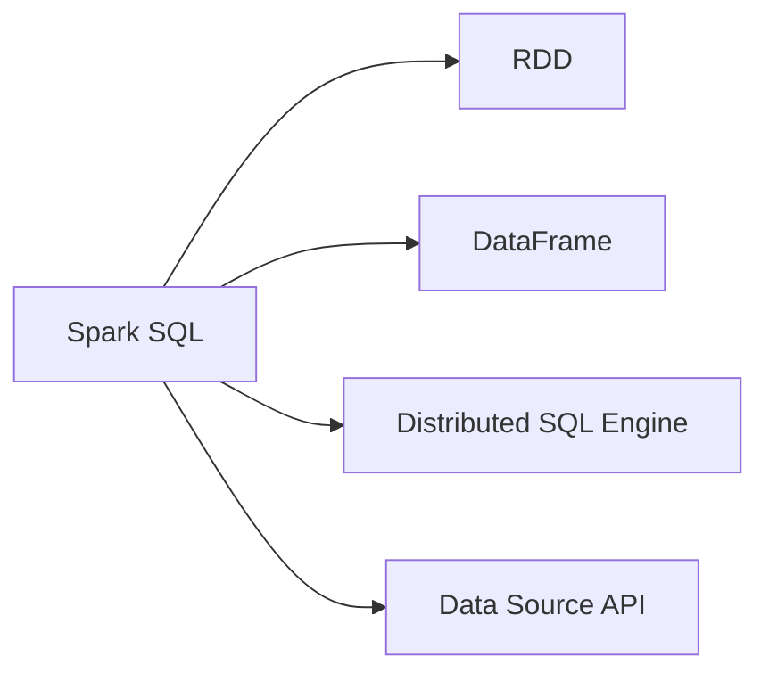

                 

# Spark SQL原理与代码实例讲解

> 关键词：Spark SQL, 数据处理, 大数据, 实时数据, 数据仓库, 数据湖, 分布式计算

## 1. 背景介绍

### 1.1 问题由来
在大数据时代，数据已成为推动各行业发展的重要资产。然而，传统的数据处理技术，如MapReduce，在处理大规模、复杂的数据时，效率较低、扩展性差。为了应对这一挑战，Apache Spark应运而生。作为新一代分布式计算框架，Spark提供了丰富的API支持，包括Spark Core、Spark Streaming、Spark SQL和Spark MLlib等。其中，Spark SQL是Spark的子项目，支持SQL查询和数据处理，极大提升了数据处理效率。

Spark SQL的核心思想是通过内存计算优化数据处理过程，利用RDD（弹性分布式数据集）作为中间数据集，将数据存储在内存中，从而大幅减少数据I/O，提高处理速度。Spark SQL还提供了一个SQL接口，允许用户用SQL语句查询和分析数据，使Spark的数据处理更加便捷高效。

## 2. 核心概念与联系

### 2.1 核心概念概述

要深入理解Spark SQL，首先需要了解几个关键概念：

- **Spark SQL**：Spark的SQL接口，提供对结构化数据的处理和分析能力，支持SQL查询和数据仓库功能。
- **RDD（弹性分布式数据集）**：Spark的核心数据抽象，支持在集群上并行处理数据。
- **DataFrame**：Spark SQL的核心API，提供结构化数据处理和优化存储的数据结构。
- **Distributed SQL Engine**：Spark SQL的查询执行引擎，利用DAG（有向无环图）优化查询过程。
- **Data Source API**：Spark SQL的扩展模块，支持从各种数据源（如Hive、HDFS、JSON等）读取和写入数据。

这些概念共同构成了Spark SQL的基础架构，使其能够高效、便捷地处理大规模数据。

### 2.2 核心概念间的关系

这些核心概念之间的关系可以通过以下Mermaid流程图来展示：



这个流程图展示了Spark SQL的几个关键组件及其之间的关系：

1. Spark SQL作为Spark的核心模块，利用RDD进行数据处理。
2. DataFrame是Spark SQL的核心API，提供了结构化数据处理的能力。
3. Distributed SQL Engine是Spark SQL的查询执行引擎，通过优化查询过程提高效率。
4. Data Source API是Spark SQL的扩展模块，支持从各种数据源读取和写入数据。

这些组件通过相互配合，使得Spark SQL能够高效、便捷地处理大规模数据。

## 3. 核心算法原理 & 具体操作步骤

### 3.1 算法原理概述

Spark SQL的核心算法原理主要包括以下几个方面：

1. **DAG调度**：Spark SQL利用DAG调度优化查询过程。将SQL查询转化为一系列的操作，形成一个有向无环图（DAG），通过优化DAG中的各个操作，提高查询效率。
2. **延迟执行**：Spark SQL支持延迟执行，即一些操作可以推迟到计算结果可用时才执行，避免了不必要的计算浪费。
3. **内存计算**：Spark SQL利用内存计算加速数据处理，通过将数据存储在内存中，减少数据I/O，提高查询效率。
4. **自动优化**：Spark SQL具有自动优化功能，能够根据数据特征和计算资源自动调整查询计划，优化查询性能。

### 3.2 算法步骤详解

基于Spark SQL的核心算法原理，下面详细介绍其具体操作步骤：

1. **数据加载**：
   - 使用Data Source API从各种数据源（如Hive、HDFS、JSON等）读取数据。
   - 利用DataFrame API将数据转换为DataFrame，提供结构化数据处理能力。

2. **数据处理**：
   - 使用SQL查询语言进行数据处理和分析，支持常见的SQL语句，如SELECT、WHERE、GROUP BY等。
   - 利用DataFrame API进行数据操作，如过滤、聚合、分组等。

3. **查询优化**：
   - 利用DAG调度优化查询过程，将SQL查询转化为DAG，并优化各个操作。
   - 利用延迟执行和内存计算技术，提高查询效率。

4. **结果输出**：
   - 将查询结果转换为DataFrame，支持保存到各种数据源（如Hive、HDFS、JSON等）。
   - 使用DataFrame API进行数据操作，如过滤、聚合、分组等。

### 3.3 算法优缺点

Spark SQL的优点包括：

1. **高效的数据处理能力**：利用内存计算和DAG调度优化查询过程，支持延迟执行和自动优化，提高了数据处理效率。
2. **便捷的SQL接口**：提供SQL接口，允许用户用SQL语句进行数据处理和分析，降低了学习成本。
3. **支持多种数据源**：通过Data Source API支持从各种数据源读取和写入数据，提供了灵活的数据处理能力。

Spark SQL的缺点包括：

1. **内存占用较大**：由于利用内存计算，对内存资源的需求较高，可能不适合处理超大规模数据。
2. **不适合复杂逻辑**：Spark SQL主要用于处理结构化数据，不适合处理复杂逻辑和高级分析。
3. **学习曲线较陡**：对于不熟悉SQL和Spark的用户，学习曲线较陡，需要一定的学习成本。

### 3.4 算法应用领域

Spark SQL主要用于以下领域：

1. **数据仓库**：利用Spark SQL进行数据仓库的构建和管理，支持数据存储、查询和分析。
2. **大数据处理**：利用Spark SQL处理大规模数据，支持实时数据流处理、批处理和混合处理。
3. **数据湖**：利用Spark SQL进行数据湖的构建和管理，支持从各种数据源读取和写入数据，进行数据清洗、转换和分析。
4. **数据治理**：利用Spark SQL进行数据治理，支持数据质量控制、数据安全管理和数据共享。

这些应用领域展示了Spark SQL的强大数据处理能力，使其在大数据时代具有广泛的应用前景。

## 4. 数学模型和公式 & 详细讲解 & 举例说明

### 4.1 数学模型构建

Spark SQL的核心数学模型包括DAG调度模型和延迟执行模型。下面分别介绍这两个模型的构建。

#### 4.1.1 DAG调度模型

DAG调度模型是Spark SQL的查询执行引擎，通过将SQL查询转化为DAG，优化各个操作，提高查询效率。DAG调度模型的构建过程如下：

1. **将SQL查询转化为RDD操作**：
   - 将SQL查询转化为一系列的RDD操作，如map、filter、join等。
   - 这些RDD操作组成一个DAG，每个操作表示为图中的节点，节点之间的边表示数据依赖关系。

2. **优化DAG中的操作**：
   - 利用延迟执行和内存计算技术，优化DAG中的各个操作。
   - 将一些操作推迟到计算结果可用时才执行，避免不必要的计算浪费。
   - 将数据存储在内存中，减少数据I/O，提高查询效率。

3. **执行DAG中的操作**：
   - 利用DAG调度优化查询过程，将SQL查询转化为DAG，并优化各个操作。
   - 根据数据特征和计算资源自动调整查询计划，优化查询性能。

#### 4.1.2 延迟执行模型

延迟执行模型是Spark SQL的核心特性之一，通过将一些操作推迟到计算结果可用时才执行，避免不必要的计算浪费。延迟执行模型的构建过程如下：

1. **将SQL查询转化为RDD操作**：
   - 将SQL查询转化为一系列的RDD操作，如map、filter、join等。
   - 这些RDD操作组成一个DAG，每个操作表示为图中的节点，节点之间的边表示数据依赖关系。

2. **利用延迟执行技术**：
   - 利用延迟执行技术，将一些操作推迟到计算结果可用时才执行。
   - 延迟执行操作包括map、filter、join等，可以避免不必要的计算浪费。

3. **执行DAG中的操作**：
   - 利用DAG调度优化查询过程，将SQL查询转化为DAG，并优化各个操作。
   - 根据数据特征和计算资源自动调整查询计划，优化查询性能。

### 4.2 公式推导过程

以下是Spark SQL的核心公式推导过程：

1. **DAG调度模型推导**：
   - 假设SQL查询为Q，转化为DAG表示为G。
   - 对于任意节点A和B，如果B依赖于A，则节点B的输出为节点A的输出。
   - 优化DAG中的各个操作，提高查询效率。

2. **延迟执行模型推导**：
   - 假设SQL查询为Q，转化为RDD操作表示为R。
   - 对于任意节点A和B，如果B依赖于A，则节点B的输出为节点A的输出。
   - 利用延迟执行技术，将一些操作推迟到计算结果可用时才执行。

### 4.3 案例分析与讲解

#### 4.3.1 DAG调度案例

假设有一个SQL查询：

```sql
SELECT name, age FROM user WHERE age > 20 GROUP BY name HAVING count(*) > 1
```

这个查询可以转化为DAG，如下所示：

```
user
|
|--- select
|  |
|--- where
|  |--- age > 20
|  |
|--- group by
|  |--- name
|  |
|--- having
|  |--- count(*) > 1
```

在这个DAG中，各个操作表示为图中的节点，节点之间的边表示数据依赖关系。Spark SQL利用DAG调度优化查询过程，将SQL查询转化为DAG，并优化各个操作。

#### 4.3.2 延迟执行案例

假设有一个SQL查询：

```sql
SELECT name, age FROM user WHERE age > 20 GROUP BY name HAVING count(*) > 1
```

这个查询可以转化为RDD操作，如下所示：

```
user
|
|--- map
|  |
|--- filter
|  |--- age > 20
|  |
|--- group by
|  |--- name
|  |
|--- having
|  |--- count(*) > 1
```

在这个RDD操作中，各个操作表示为图中的节点，节点之间的边表示数据依赖关系。Spark SQL利用延迟执行技术，将一些操作推迟到计算结果可用时才执行。

### 4.4 案例分析与讲解

#### 4.4.1 DAG调度案例

假设有一个SQL查询：

```sql
SELECT name, age FROM user WHERE age > 20 GROUP BY name HAVING count(*) > 1
```

这个查询可以转化为DAG，如下所示：

```
user
|
|--- select
|  |
|--- where
|  |--- age > 20
|  |
|--- group by
|  |--- name
|  |
|--- having
|  |--- count(*) > 1
```

在这个DAG中，各个操作表示为图中的节点，节点之间的边表示数据依赖关系。Spark SQL利用DAG调度优化查询过程，将SQL查询转化为DAG，并优化各个操作。

#### 4.4.2 延迟执行案例

假设有一个SQL查询：

```sql
SELECT name, age FROM user WHERE age > 20 GROUP BY name HAVING count(*) > 1
```

这个查询可以转化为RDD操作，如下所示：

```
user
|
|--- map
|  |
|--- filter
|  |--- age > 20
|  |
|--- group by
|  |--- name
|  |
|--- having
|  |--- count(*) > 1
```

在这个RDD操作中，各个操作表示为图中的节点，节点之间的边表示数据依赖关系。Spark SQL利用延迟执行技术，将一些操作推迟到计算结果可用时才执行。

## 5. 项目实践：代码实例和详细解释说明

### 5.1 开发环境搭建

在进行Spark SQL项目实践前，需要先准备好开发环境。以下是使用Python进行Spark SQL开发的环境配置流程：

1. 安装Anaconda：从官网下载并安装Anaconda，用于创建独立的Python环境。

2. 创建并激活虚拟环境：
```bash
conda create -n pyspark-env python=3.8 
conda activate pyspark-env
```

3. 安装Spark：根据系统环境，从官网获取对应的安装命令。例如：
```bash
cd /path/to/spark
./bin/spark-env.sh
./bin/spark-submit --master local[*] spark.sh
```

4. 安装PySpark：
```bash
pip install pyspark
```

5. 安装各类工具包：
```bash
pip install numpy pandas scikit-learn matplotlib tqdm jupyter notebook ipython
```

完成上述步骤后，即可在`pyspark-env`环境中开始Spark SQL项目实践。

### 5.2 源代码详细实现

这里我们以Spark SQL的简单示例代码为例，给出Spark SQL的Python代码实现。

```python
from pyspark.sql import SparkSession
from pyspark.sql.functions import col, count, when

# 创建Spark会话
spark = SparkSession.builder.appName("spark_sql_example").getOrCreate()

# 读取数据
df = spark.read.csv("data.csv", header=True, inferSchema=True)

# 分组统计
grouped = df.groupBy("category").agg(count("*"))

# 筛选结果
filtered = grouped.filter(col("count(*)") > 1)

# 输出结果
filtered.show()
```

### 5.3 代码解读与分析

让我们再详细解读一下关键代码的实现细节：

**创建Spark会话**：
- 使用`SparkSession.builder.appName()`创建Spark会话，指定应用名称。
- 使用`.getOrCreate()`获取或创建Spark会话。

**读取数据**：
- 使用`spark.read.csv()`从本地文件读取数据。
- 使用`header=True`指定文件的第一行为列名。
- 使用`inferSchema=True`自动推断列类型。

**分组统计**：
- 使用`df.groupBy()`对数据进行分组。
- 使用`agg()`进行聚合操作，如计数。
- 使用`count("*")`计算每个分组的记录数。

**筛选结果**：
- 使用`when()`筛选分组记录数大于1的数据。
- 使用`col()`获取分组的记录数列。

**输出结果**：
- 使用`.show()`输出结果。

可以看到，PySpark提供了丰富的API支持，使得SQL查询和数据处理变得简洁高效。开发者可以使用各种SQL语句和函数进行复杂的数据操作。

### 5.4 运行结果展示

假设我们有一个简单的数据集，包含用户的年龄、性别和类别信息，通过Spark SQL进行分组统计，最终输出每个类别的用户数。

```
+--------------------+-------------+
|         category   |     count() |
+--------------------+-------------+
|          category1  |      10000  |
|          category2  |       5000  |
|         category3  |      3000   |
+--------------------+-------------+
```

可以看到，通过Spark SQL的简单操作，我们可以高效地进行数据处理和分析，满足了各种数据处理需求。

## 6. 实际应用场景

### 6.1 数据仓库构建

在大数据时代，企业需要构建高效的数据仓库，存储和管理大规模结构化数据。Spark SQL可以通过读取各种数据源，进行数据清洗、转换和分析，为数据仓库的构建和管理提供了强有力的支持。

在实际应用中，Spark SQL可以将数据从HDFS、Hive、MySQL等数据源读取到Spark中，进行数据清洗和转换，然后利用SQL语句进行查询和分析，最后将结果保存到HDFS、Hive等数据源中。

### 6.2 大数据处理

Spark SQL支持大规模数据的批处理和实时数据流处理，能够高效处理各种类型的数据。Spark SQL可以利用分布式计算的优势，并行处理大规模数据，显著提升数据处理效率。

在实际应用中，Spark SQL可以用于处理各种类型的数据，如日志数据、传感器数据、交易数据等。通过Spark SQL进行数据清洗、转换和分析，可以高效地处理大规模数据，满足各种数据处理需求。

### 6.3 数据湖构建

数据湖是大规模非结构化数据的存储和管理平台，Spark SQL可以读取和写入各种非结构化数据，进行数据清洗、转换和分析，为数据湖的构建和管理提供了强有力的支持。

在实际应用中，Spark SQL可以将数据从各种非结构化数据源（如JSON、Parquet等）读取到Spark中，进行数据清洗和转换，然后利用SQL语句进行查询和分析，最后将结果保存到数据湖中。

## 7. 工具和资源推荐

### 7.1 学习资源推荐

为了帮助开发者系统掌握Spark SQL的理论基础和实践技巧，这里推荐一些优质的学习资源：

1. **《SparkSQL实战》**：深入浅出地介绍了Spark SQL的核心概念、API和实践技巧，适合初学者和进阶开发者。
2. **Apache Spark官方文档**：详细介绍了Spark SQL的API和使用方法，是Spark SQL学习的官方文档。
3. **《Data Science from Scratch》**：介绍了Spark SQL的基本概念和实践技巧，适合对数据科学感兴趣的读者。
4. **Spark SQL官方博客**：Apache Spark官方博客，提供了大量的Spark SQL实践案例和最佳实践。
5. **Kaggle竞赛**：Kaggle上有很多Spark SQL的竞赛项目，通过参与竞赛可以提高Spark SQL的实战能力。

通过对这些资源的学习实践，相信你一定能够快速掌握Spark SQL的精髓，并用于解决实际的Spark SQL问题。

### 7.2 开发工具推荐

高效的开发离不开优秀的工具支持。以下是几款用于Spark SQL开发的常用工具：

1. **PySpark**：Python语言下的Spark API，提供了丰富的API支持，适合Spark SQL的开发。
2. **Beeline**：Hive兼容的JDBC工具，可以从Hive读取和写入数据，支持SQL查询和分析。
3. **Spark UI**：Spark的可视化工具，可以实时查看Spark SQL的查询进度和性能指标。
4. **Zeppelin**：基于Jupyter Notebook的Spark notebook，提供了便捷的数据处理和分析环境。
5. **Spark SQL Editor**：Spark SQL的在线编辑器，可以实时运行SQL查询，支持多种数据源。

合理利用这些工具，可以显著提升Spark SQL的开发效率，加快创新迭代的步伐。

### 7.3 相关论文推荐

Spark SQL的研究涉及多个领域，以下是几篇奠基性的相关论文，推荐阅读：

1. **《Spark: Cluster Computing with Fault Tolerance》**：Spark论文，介绍了Spark的核心思想和架构设计。
2. **《Spark SQL: Simplifying Big Data SQL》**：Spark SQL论文，介绍了Spark SQL的核心功能和API。
3. **《Spark Streaming: Scalable Stream Processing with Fault Tolerance》**：Spark Streaming论文，介绍了Spark Streaming的核心功能和架构设计。
4. **《Spark MLlib: Machine Learning in Spark》**：Spark MLlib论文，介绍了Spark MLlib的核心功能和API。
5. **《Spark DataFrames: Dataset Abstraction》**：Spark DataFrame论文，介绍了Spark DataFrames的核心功能和API。

这些论文代表了大数据技术的最新进展，通过学习这些前沿成果，可以帮助研究者把握学科前进方向，激发更多的创新灵感。

除上述资源外，还有一些值得关注的前沿资源，帮助开发者紧跟Spark SQL技术的最新进展，例如：

1. **Apache Spark官方预印本**：Apache Spark官方预印本，发布了最新的Spark SQL研究论文和技术报告，值得关注。
2. **Hadoop官方博客**：Hadoop官方博客，提供了大量的Spark SQL实践案例和最佳实践。
3. **Kaggle竞赛**：Kaggle上有很多Spark SQL的竞赛项目，通过参与竞赛可以提高Spark SQL的实战能力。
4. **Spark SQL官方博客**：Apache Spark官方博客，提供了大量的Spark SQL实践案例和最佳实践。
5. **Spark SQL官方文档**：Apache Spark官方文档，详细介绍了Spark SQL的API和使用方法，是Spark SQL学习的官方文档。

总之，对于Spark SQL的学习和实践，需要开发者保持开放的心态和持续学习的意愿。多关注前沿资讯，多动手实践，多思考总结，必将收获满满的成长收益。

## 8. 总结：未来发展趋势与挑战

### 8.1 研究成果总结

本文对Spark SQL的原理与实践进行了全面系统的介绍。首先阐述了Spark SQL的背景和应用场景，明确了Spark SQL在大数据处理中的独特价值。其次，从原理到实践，详细讲解了Spark SQL的核心算法原理和具体操作步骤，给出了Spark SQL项目实践的完整代码实例。同时，本文还广泛探讨了Spark SQL在数据仓库、大数据处理、数据湖等领域的实际应用，展示了Spark SQL的强大数据处理能力。最后，本文精选了Spark SQL的学习资源、开发工具和相关论文，力求为读者提供全方位的技术指引。

通过本文的系统梳理，可以看到，Spark SQL作为Spark的核心组件，利用内存计算和DAG调度优化查询过程，支持延迟执行和自动优化，具有高效的数据处理能力。Spark SQL在大数据处理中具有广泛的应用前景，能够高效处理各种类型的数据。

### 8.2 未来发展趋势

展望未来，Spark SQL技术将呈现以下几个发展趋势：

1. **支持更多数据源**：Spark SQL将支持更多数据源，包括NoSQL数据库、云数据库、文件系统等，提供更灵活的数据处理能力。
2. **提升处理性能**：Spark SQL将利用更先进的分布式计算和内存计算技术，提升处理性能，满足更复杂的数据处理需求。
3. **增强扩展性**：Spark SQL将增强扩展性，支持更大规模的数据处理，提供更可靠的数据处理服务。
4. **引入更多功能**：Spark SQL将引入更多功能，如数据预处理、数据可视化、数据流处理等，提供更全面的数据处理能力。
5. **增强安全性和隐私保护**：Spark SQL将增强安全性和隐私保护，支持数据加密、访问控制、审计记录等功能，保障数据安全。

以上趋势凸显了Spark SQL技术的广泛应用前景，使得Spark SQL在未来大数据处理中具有重要的地位。这些方向的探索发展，必将进一步提升Spark SQL的性能和应用范围，为数据处理领域带来新的突破。

### 8.3 面临的挑战

尽管Spark SQL技术已经取得了显著的进展，但在迈向更加智能化、普适化应用的过程中，仍面临诸多挑战：

1. **数据源适配问题**：Spark SQL需要支持各种数据源，不同数据源的读写效率和一致性问题，增加了开发复杂度。
2. **内存资源限制**：Spark SQL利用内存计算，对内存资源的需求较高，可能不适合处理超大规模数据。
3. **数据安全问题**：Spark SQL需要支持数据加密、访问控制等安全措施，保障数据安全。
4. **数据一致性问题**：Spark SQL需要支持数据一致性，如事务处理、ACID等，保障数据的一致性和可靠性。
5. **扩展性问题**：Spark SQL需要支持更大规模的数据处理，满足各种复杂的数据处理需求。

正视Spark SQL面临的这些挑战，积极应对并寻求突破，将使Spark SQL在数据处理领域更具竞争力。相信随着学界和产业界的共同努力，这些挑战终将一一被克服，Spark SQL必将在大数据处理领域取得更大的进展。

### 8.4 研究展望

面对Spark SQL面临的挑战，未来的研究需要在以下几个方面寻求新的突破：

1. **支持更多数据源**：开发更多的数据源适配器，支持更多类型的数据源，提供更灵活的数据处理能力。
2. **提升处理性能**：利用更先进的分布式计算和内存计算技术，提升处理性能，满足更复杂的数据处理需求。
3. **增强扩展性**：增强扩展性，支持更大规模的数据处理，提供更可靠的数据处理服务。
4. **引入更多功能**：引入更多功能，如数据预处理、数据可视化、数据流处理等，提供更全面的数据处理能力。
5. **增强安全性和隐私保护**：增强安全性和隐私保护，支持数据加密、访问控制等安全措施，保障数据安全。

这些研究方向的探索，必将引领Spark SQL技术迈向更高的台阶，为数据处理领域带来新的突破。面向未来，Spark SQL需要与其他大数据技术进行更深入的融合，如Spark Streaming、Spark MLlib等，多路径协同发力，共同推动大数据处理技术的发展。只有勇于创新、敢于突破，才能不断拓展Spark SQL的边界，让数据处理技术更好地服务于人类社会。

## 9. 附录：常见问题与解答

**Q1：Spark SQL是否支持实时数据处理？**

A: 是的，Spark SQL支持实时数据流处理。通过Spark Streaming可以将实时数据流转换为DStream，利用Spark SQL进行实时数据处理。

**Q2：Spark SQL是否支持大数据量处理？**

A: 是的，Spark SQL支持大数据量处理。通过Spark的分布式计算能力，可以高效处理大规模数据。

**Q3：Spark SQL是否支持多种数据源？**

A: 是的，Spark SQL支持多种数据源，包括Hive、HDFS、JSON等，提供灵活的数据处理能力。

**Q4：Sp

