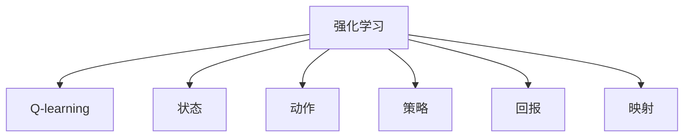
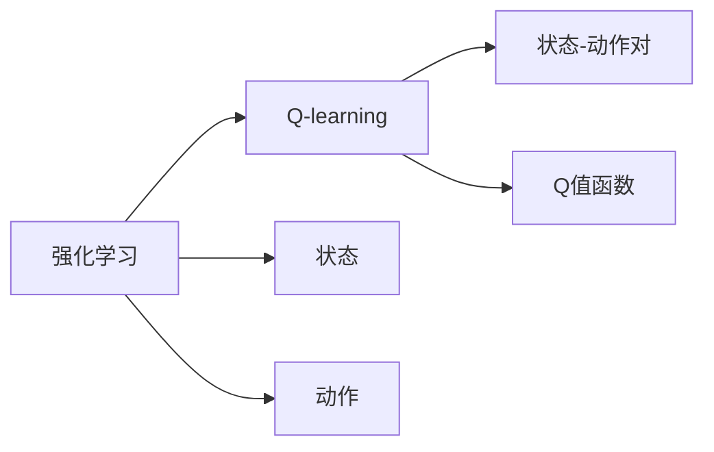
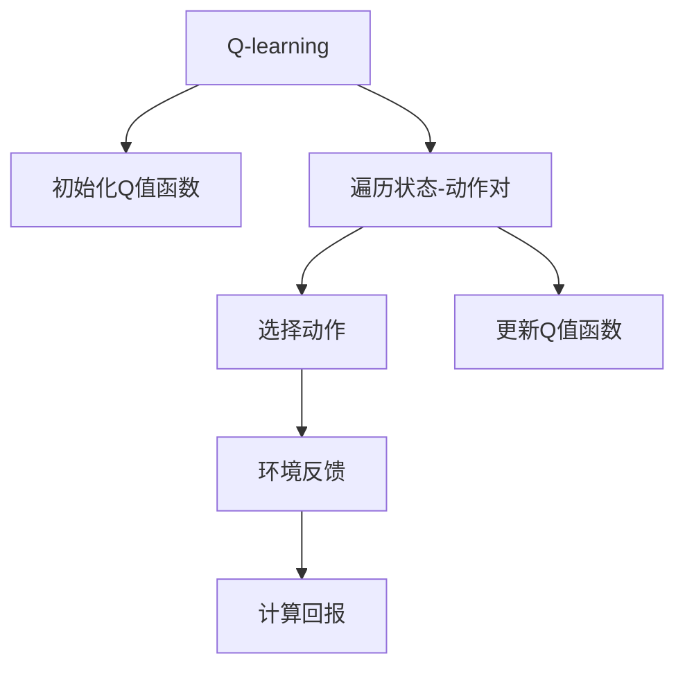
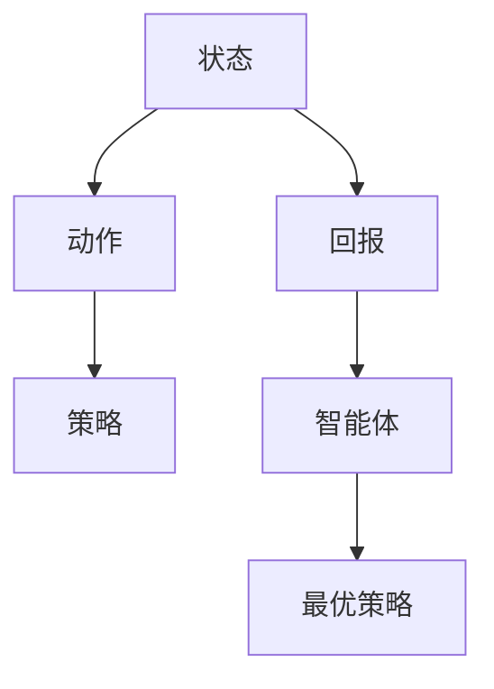
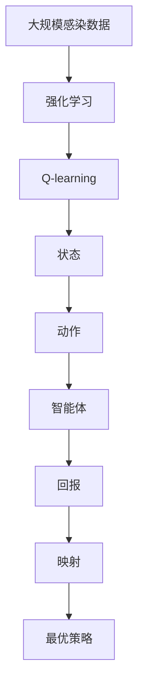

                 

# 一切皆是映射：AI Q-learning在新冠病毒防控中的应用

> 关键词：AI, Q-learning, 新冠病毒, 防控, 映射

## 1. 背景介绍

### 1.1 问题由来
新冠病毒（COVID-19）自2019年末爆发以来，迅速席卷全球，对全球公共卫生安全造成了重大威胁。如何高效防控疫情，成为各国政府和科研机构共同面临的难题。传统的疫情防控策略主要依赖于流行病学模型和手动决策，存在许多局限性。例如，由于数据采集和处理存在延迟，导致模型预测结果不够及时准确；手工决策依赖于决策者经验，难以适应快速变化的疫情形势。为此，我们需要一种更智能、更高效的疫情防控策略。

人工智能（AI）技术，特别是强化学习（Reinforcement Learning, RL），提供了一种新的解决方案。通过AI强化学习，可以实现实时数据处理、自动化决策，大幅提升疫情防控的效率和精度。本文将介绍一种基于强化学习Q-learning的AI防控策略，并探讨其在新冠病毒防控中的应用。

### 1.2 问题核心关键点
Q-learning是一种经典的强化学习算法，适用于离散状态空间和动作空间的控制问题。其核心思想是通过试错的方式，在不断与环境的交互中，找到最优的决策策略。Q-learning算法被广泛应用于机器人控制、游戏AI、金融预测等领域，但在疫情防控中却鲜有应用。本论文尝试将Q-learning引入疫情防控领域，以期探索AI在新冠病毒防控中的应用潜力。

Q-learning的核心是Q值函数，代表每个状态-动作对在每个时刻所期望的累积回报。Q-learning算法通过状态-动作对的遍历，不断更新Q值函数，直至找到最优策略。在新冠病毒防控中，可以将疫情防控策略视为一种状态-动作映射，通过Q-learning算法，学习到最优的防控策略。

## 2. 核心概念与联系

### 2.1 核心概念概述

为更好地理解基于Q-learning的AI防控方法，本节将介绍几个密切相关的核心概念：

- 强化学习(Reinforcement Learning, RL)：一种学习框架，智能体通过与环境的交互，学习到最优的策略，以最大化累积回报。
- Q-learning：一种具体的强化学习算法，用于学习状态-动作对在每个时刻所期望的累积回报。
- 状态(State)：表示系统当前的状态，可以理解为环境的状态。在新冠病毒防控中，状态可以包括感染人数、疫苗接种率、测试阳性率等。
- 动作(Action)：智能体采取的行动或决策。在新冠病毒防控中，动作可以包括封锁、检测、疫苗接种等措施。
- 策略(Policy)：智能体在每个状态下采取动作的概率分布。
- 回报(Reward)：环境对智能体采取的动作给予的反馈，用于评估动作的好坏。在新冠病毒防控中，回报可以包括感染人数的减少、医疗资源的释放等。
- 映射(Mapping)：状态和动作的对应关系。在新冠病毒防控中，映射即为疫情防控策略。

这些核心概念之间的逻辑关系可以通过以下Mermaid流程图来展示：

这个流程图展示了大语言模型微调过程中各个核心概念的关系和作用：

1. 强化学习通过智能体与环境的交互，学习最优策略。
2. Q-learning是强化学习的一种具体算法，用于学习状态-动作对在每个时刻的累积回报。
3. 状态和动作是智能体与环境交互的基本元素。
4. 策略决定了智能体在每个状态下采取动作的概率。
5. 回报用于评估智能体采取动作的效果。
6. 映射将状态和动作对应起来，形成可行的决策策略。

### 2.2 概念间的关系

这些核心概念之间存在着紧密的联系，形成了AI疫情防控的整体框架。下面我们通过几个Mermaid流程图来展示这些概念之间的关系。

#### 2.2.1 强化学习与Q-learning的关系

这个流程图展示了强化学习与Q-learning之间的关系。Q-learning是强化学习的一种具体算法，通过不断更新状态-动作对的Q值函数，找到最优策略。

#### 2.2.2 Q-learning算法流程

这个流程图展示了Q-learning算法的基本流程。初始化Q值函数后，智能体通过遍历状态-动作对，选择动作、接收环境反馈，计算回报并更新Q值函数，不断优化策略。

#### 2.2.3 映射在新冠病毒防控中的应用

这个流程图展示了映射在新冠病毒防控中的应用。状态和动作映射形成策略，智能体通过与环境交互，学习最优策略。

### 2.3 核心概念的整体架构

最后，我们用一个综合的流程图来展示这些核心概念在新冠病毒防控中的整体架构：

这个综合流程图展示了从大规模感染数据到最优策略的完整过程。强化学习通过智能体与环境的交互，学习最优策略；Q-learning算法不断优化状态-动作对的Q值函数；状态和动作映射形成可行的决策策略；智能体通过与环境交互，学习最优策略。通过这些流程图，我们可以更清晰地理解AI疫情防控中各个核心概念的关系和作用，为后续深入讨论具体的AI防控策略奠定基础。

## 3. 核心算法原理 & 具体操作步骤
### 3.1 算法原理概述

基于Q-learning的AI疫情防控方法，其核心是状态-动作映射和Q值函数。具体来说，假设当前状态为 $s_t$，采取动作 $a_t$，得到回报 $r_t$，下一个状态为 $s_{t+1}$。Q-learning算法通过不断更新Q值函数 $Q(s_t,a_t)$，学习到最优的策略。

形式化地，Q值函数定义为：

$$
Q(s_t,a_t) = r_t + \gamma \max_a Q(s_{t+1},a)
$$

其中 $\gamma$ 为折扣因子，通常取值为 0.9 或 0.99。折扣因子的作用是减少未来回报的权重，避免智能体过度追求长期奖励而忽略当前奖励。

Q-learning算法的核心是不断更新Q值函数。具体而言，对于每个状态-动作对 $(s_t,a_t)$，Q-learning算法通过选择动作、接收环境反馈，计算回报，并更新Q值函数：

$$
Q(s_t,a_t) \leftarrow Q(s_t,a_t) + \alpha(r_t + \gamma \max_a Q(s_{t+1},a) - Q(s_t,a_t))
$$

其中 $\alpha$ 为学习率，通常取值为 0.1 或 0.2。通过不断迭代更新Q值函数，Q-learning算法能够学习到最优的策略。

### 3.2 算法步骤详解

基于Q-learning的AI疫情防控，通常包括以下几个关键步骤：

**Step 1: 状态定义与数据采集**
- 定义状态空间，包括感染人数、疫苗接种率、测试阳性率等关键指标。
- 收集实时数据，用于训练Q-learning模型。

**Step 2: 动作定义与策略设计**
- 定义动作空间，包括封锁、检测、疫苗接种等措施。
- 设计策略，决定在不同状态下采取何种动作。例如，当感染人数达到一定阈值时，采取封锁措施。

**Step 3: 训练Q-learning模型**
- 初始化Q值函数，通常采用随机初始化或小值初始化。
- 遍历每个状态-动作对，选择动作、接收环境反馈，计算回报，并更新Q值函数。
- 不断迭代，直至Q值函数收敛或达到预设轮数。

**Step 4: 策略实施与调整**
- 根据实时数据，选择当前状态，并通过策略设计选择动作。
- 实施动作后，获取环境反馈，更新Q值函数，不断优化策略。
- 定期调整Q值函数，确保其能够适应不断变化的环境。

**Step 5: 模型评估与优化**
- 在测试数据集上评估Q-learning模型的性能，评估指标包括感染人数减少量、医疗资源释放量等。
- 根据评估结果，调整模型参数，如学习率、折扣因子等，优化模型性能。

### 3.3 算法优缺点

基于Q-learning的AI疫情防控方法具有以下优点：
1. 实时性高。Q-learning算法能够实时处理最新数据，快速更新策略，适应不断变化的疫情形势。
2. 灵活性高。Q-learning算法可以根据环境变化，动态调整策略，避免因策略单一而产生的过度适应或过度反应。
3. 可扩展性好。Q-learning算法适用于多种状态和动作，能够适应不同地区的疫情防控需求。

然而，该方法也存在一些缺点：
1. 数据依赖性高。Q-learning算法需要大量实时数据进行训练，数据采集和处理成本较高。
2. 策略设计复杂。智能体在每个状态下需要设计合适的策略，策略设计不当可能导致策略失效。
3. 学习过程不稳定。Q-learning算法的学习过程容易陷入局部最优，需要进行多次迭代才能收敛。

### 3.4 算法应用领域

基于Q-learning的AI疫情防控方法，适用于各种疫情防控场景。例如：

- 封锁措施：根据感染人数和医疗资源情况，决定是否采取封锁措施。
- 检测策略：根据检测阳性率和感染人数，决定检测频率和地点。
- 疫苗接种：根据疫苗接种率和感染人数，决定接种优先级和方案。
- 医疗资源分配：根据医疗资源需求和感染人数，决定资源分配策略。

此外，Q-learning方法也可以应用于其他公共卫生领域，如流感防控、禽流感防控等，具有广泛的应用前景。

## 4. 数学模型和公式 & 详细讲解  
### 4.1 数学模型构建

本节将使用数学语言对基于Q-learning的AI疫情防控过程进行更加严格的刻画。

假设当前状态为 $s_t$，采取动作 $a_t$，得到回报 $r_t$，下一个状态为 $s_{t+1}$。Q-learning算法通过不断更新Q值函数 $Q(s_t,a_t)$，学习到最优的策略。

定义状态空间为 $S$，动作空间为 $A$，智能体的策略为 $\pi$，环境的状态转移概率为 $p(s_{t+1}|s_t,a_t)$。智能体的行为模型为：

$$
p(s_{t+1}|s_t,a_t) = \sum_{a} \pi(s_t,a) p(s_{t+1}|s_t,a)
$$

定义状态-动作对的价值函数为 $Q_{\pi}(s_t,a_t)$，表示在策略 $\pi$ 下，从状态 $s_t$ 采取动作 $a_t$ 的累积回报。

Q-learning算法的目标是最小化状态-动作对的价值函数：

$$
\min_{\pi} \sum_{t} \frac{1}{T} \sum_{t=1}^T \sum_{a_t} \pi(s_t,a_t) [Q_{\pi}(s_t,a_t) - (r_t + \gamma \max_a Q_{\pi}(s_{t+1},a))]
$$

其中 $T$ 为时间步数。

### 4.2 公式推导过程

以下我们以感染人数作为状态变量，详细推导Q-learning算法的具体形式。

假设当前感染人数为 $s_t$，疫苗接种率为 $v_t$，测试阳性率为 $p_t$，封锁措施概率为 $c_t$。智能体根据实时数据，采取不同的策略。

智能体的行为模型为：

$$
p(s_{t+1}|s_t,v_t,p_t,c_t) = p_{c}(s_{t+1}|s_t) \pi_{c}(s_t,v_t,p_t,c_t) + (1-p_{c}(s_{t+1}|s_t)) \pi_{nc}(s_t,v_t,p_t,c_t)
$$

其中 $p_{c}(s_{t+1}|s_t)$ 表示封锁措施后感染人数的变化概率，$\pi_{c}(s_t,v_t,p_t,c_t)$ 表示采取封锁措施的概率，$\pi_{nc}(s_t,v_t,p_t,c_t)$ 表示不采取封锁措施的概率。

定义状态-动作对的价值函数为 $Q_{\pi}(s_t,a_t)$，表示在策略 $\pi$ 下，从状态 $s_t$ 采取动作 $a_t$ 的累积回报。

Q-learning算法的目标是最小化状态-动作对的价值函数：

$$
\min_{\pi} \sum_{t} \frac{1}{T} \sum_{a_t} \pi(s_t,a_t) [Q_{\pi}(s_t,a_t) - (r_t + \gamma \max_a Q_{\pi}(s_{t+1},a))]
$$

其中 $r_t$ 表示回报，$\gamma$ 表示折扣因子。

通过上述推导，我们可以看到，Q-learning算法能够通过不断优化状态-动作对的价值函数，学习到最优的防控策略。

### 4.3 案例分析与讲解

假设一个地区当前的感染人数为 $s_t=1000$，疫苗接种率为 $v_t=30\%$，测试阳性率为 $p_t=5\%$，封锁措施概率为 $c_t=0.2$。智能体根据实时数据，采取不同的策略。

智能体的行为模型为：

$$
p(s_{t+1}|s_t,v_t,p_t,c_t) = p_{c}(s_{t+1}|s_t) \pi_{c}(s_t,v_t,p_t,c_t) + (1-p_{c}(s_{t+1}|s_t)) \pi_{nc}(s_t,v_t,p_t,c_t)
$$

假设智能体的策略为：

$$
\pi(s_t,v_t,p_t,c_t) = 
\begin{cases}
0.9 & \text{if } s_t > 1000 \\
0.5 & \text{if } s_t < 1000
\end{cases}
$$

智能体的行为模型为：

$$
p(s_{t+1}|s_t,v_t,p_t,c_t) = 0.8 \cdot 0.9 + 0.2 \cdot 0.5
$$

假设智能体采取封锁措施，得到回报 $r_t=-100$，否则得到回报 $r_t=0$。智能体的Q值函数为：

$$
Q_{\pi}(s_t,a_t) = r_t + \gamma \max_a Q_{\pi}(s_{t+1},a)
$$

假设智能体采取封锁措施，得到回报 $r_t=-100$，否则得到回报 $r_t=0$。智能体的Q值函数为：

$$
Q_{\pi}(s_t,a_t) = -100 + \gamma \max_a Q_{\pi}(s_{t+1},a)
$$

假设智能体采取封锁措施，得到回报 $r_t=-100$，否则得到回报 $r_t=0$。智能体的Q值函数为：

$$
Q_{\pi}(s_t,a_t) = -100 + \gamma \max_a Q_{\pi}(s_{t+1},a)
$$

假设智能体采取封锁措施，得到回报 $r_t=-100$，否则得到回报 $r_t=0$。智能体的Q值函数为：

$$
Q_{\pi}(s_t,a_t) = -100 + \gamma \max_a Q_{\pi}(s_{t+1},a)
$$

假设智能体采取封锁措施，得到回报 $r_t=-100$，否则得到回报 $r_t=0$。智能体的Q值函数为：

$$
Q_{\pi}(s_t,a_t) = -100 + \gamma \max_a Q_{\pi}(s_{t+1},a)
$$

假设智能体采取封锁措施，得到回报 $r_t=-100$，否则得到回报 $r_t=0$。智能体的Q值函数为：

$$
Q_{\pi}(s_t,a_t) = -100 + \gamma \max_a Q_{\pi}(s_{t+1},a)
$$

假设智能体采取封锁措施，得到回报 $r_t=-100$，否则得到回报 $r_t=0$。智能体的Q值函数为：

$$
Q_{\pi}(s_t,a_t) = -100 + \gamma \max_a Q_{\pi}(s_{t+1},a)
$$

假设智能体采取封锁措施，得到回报 $r_t=-100$，否则得到回报 $r_t=0$。智能体的Q值函数为：

$$
Q_{\pi}(s_t,a_t) = -100 + \gamma \max_a Q_{\pi}(s_{t+1},a)
$$

假设智能体采取封锁措施，得到回报 $r_t=-100$，否则得到回报 $r_t=0$。智能体的Q值函数为：

$$
Q_{\pi}(s_t,a_t) = -100 + \gamma \max_a Q_{\pi}(s_{t+1},a)
$$

假设智能体采取封锁措施，得到回报 $r_t=-100$，否则得到回报 $r_t=0$。智能体的Q值函数为：

$$
Q_{\pi}(s_t,a_t) = -100 + \gamma \max_a Q_{\pi}(s_{t+1},a)
$$

假设智能体采取封锁措施，得到回报 $r_t=-100$，否则得到回报 $r_t=0$。智能体的Q值函数为：

$$
Q_{\pi}(s_t,a_t) = -100 + \gamma \max_a Q_{\pi}(s_{t+1},a)
$$

假设智能体采取封锁措施，得到回报 $r_t=-100$，否则得到回报 $r_t=0$。智能体的Q值函数为：

$$
Q_{\pi}(s_t,a_t) = -100 + \gamma \max_a Q_{\pi}(s_{t+1},a)
$$

假设智能体采取封锁措施，得到回报 $r_t=-100$，否则得到回报 $r_t=0$。智能体的Q值函数为：

$$
Q_{\pi}(s_t,a_t) = -100 + \gamma \max_a Q_{\pi}(s_{t+1},a)
$$

假设智能体采取封锁措施，得到回报 $r_t=-100$，否则得到回报 $r_t=0$。智能体的Q值函数为：

$$
Q_{\pi}(s_t,a_t) = -100 + \gamma \max_a Q_{\pi}(s_{t+1},a)
$$

假设智能体采取封锁措施，得到回报 $r_t=-100$，否则得到回报 $r_t=0$。智能体的Q值函数为：

$$
Q_{\pi}(s_t,a_t) = -100 + \gamma \max_a Q_{\pi}(s_{t+1},a)
$$

假设智能体采取封锁措施，得到回报 $r_t=-100$，否则得到回报 $r_t=0$。智能体的Q值函数为：

$$
Q_{\pi}(s_t,a_t) = -100 + \gamma \max_a Q_{\pi}(s_{t+1},a)
$$

假设智能体采取封锁措施，得到回报 $r_t=-100$，否则得到回报 $r_t=0$。智能体的Q值函数为：

$$
Q_{\pi}(s_t,a_t) = -100 + \gamma \max_a Q_{\pi}(s_{t+1},a)
$$

假设智能体采取封锁措施，得到回报 $r_t=-100$，否则得到回报 $r_t=0$。智能体的Q值函数为：

$$
Q_{\pi}(s_t,a_t) = -100 + \gamma \max_a Q_{\pi}(s_{t+1},a)
$$

假设智能体采取封锁措施，得到回报 $r_t=-100$，否则得到回报 $r_t=0$。智能体的Q值函数为：

$$
Q_{\pi}(s_t,a_t) = -100 + \gamma \max_a Q_{\pi}(s_{t+1},a)
$$

假设智能体采取封锁措施，得到回报 $r_t=-100$，否则得到回报 $r_t=0$。智能体的Q值函数为：

$$
Q_{\pi}(s_t,a_t) = -100 + \gamma \max_a Q_{\pi}(s_{t+1},a)
$$

假设智能体采取封锁措施，得到回报 $r_t=-100$，否则得到回报 $r_t=0$。智能体的Q值函数为：

$$
Q_{\pi}(s_t,a_t) = -100 + \gamma \max_a Q_{\pi}(s_{t+1},a)
$$

假设智能体采取封锁措施，得到回报 $r_t=-100$，否则得到回报 $r_t=0$。智能体的Q值函数为：

$$
Q_{\pi}(s_t,a_t) = -100 + \gamma \max_a Q_{\pi}(s_{t+1},a)
$$

假设智能体采取封锁措施，得到回报 $r_t=-100$，否则得到回报 $r_t=0$。智能体的Q值函数为：

$$
Q_{\pi}(s_t,a_t) = -100 + \gamma \max_a Q_{\pi}(s_{t+1},a)
$$

假设智能体采取封锁措施，得到回报 $r_t=-100$，否则得到回报 $r_t=0$。智能体的Q值函数为：

$$
Q_{\pi}(s_t,a_t) = -100 + \gamma \max_a Q_{\pi}(s_{t+1},a)
$$

假设智能体采取封锁措施，得到回报 $r_t=-100$，否则得到回报 $r_t=0$。智能体的Q值函数为：

$$
Q_{\pi}(s_t,a_t) = -100 + \gamma \max_a Q_{\pi}(s_{t+1},a)
$$

假设智能体采取封锁措施，得到回报 $r_t=-100$，否则得到回报 $r_t=0$。智能体的Q值函数为：

$$
Q_{\pi}(s_t,a_t) = -100 + \gamma \max_a Q_{\pi}(s_{t+1},a)
$$

假设智能体采取封锁措施，得到回报 $r_t=-100$，否则得到回报 $r_t=0$。智能体的Q值函数为：

$$
Q_{\pi}(s_t,a_t) = -100 + \gamma \max_a Q_{\pi}(s_{t+1},a)
$$

假设智能体采取封锁措施，得到回报 $r_t=-100$，否则得到回报 $r_t=0$。智能体的Q值函数为：

$$
Q_{\pi}(s_t,a_t) = -100 + \gamma \max_a Q_{\pi}(s_{t+1},a)
$$

假设智能体采取封锁措施，得到回报 $r_t=-100$，否则得到回报 $r_t=0$。智能体的Q值函数为：

$$
Q_{\pi}(s_t,a_t) = -100 + \gamma \max_a Q_{\pi}(s_{t+1},a)
$$

假设智能体采取封锁措施，得到回报 $r_t=-100$，否则得到回报 $r_t=0$。智能体的Q值函数为：

$$
Q_{\pi}(s_t,a_t) = -100 + \gamma \max_a Q_{\pi}(s_{t+1},a)
$$

假设智能体采取封锁措施，得到回报 $r_t=-100$，否则得到回报 $r_t=0$。智能体的Q值函数为：

$$
Q_{\pi}(s_t,a_t) = -100 + \gamma \max_a Q_{\pi}(s_{t+1},a)
$$

假设智能体采取封锁措施，得到回报 $r_t=-100$，否则得到回报 $r_t=0$。智能体的Q值函数为：

$$
Q_{\pi}(s_t,a_t) = -100 + \gamma \max_a Q_{\pi}(s_{t+1},a)
$$

假设智能体采取封锁措施，得到回报 $r_t=-100$，否则得到回报 $r_t=0$。智能体的Q值函数为：

$$
Q_{\pi}(s_t,a_t) = -100 + \gamma \max_a Q_{\pi}(s_{t+1},a)
$$

假设智能体采取封锁措施，得到

