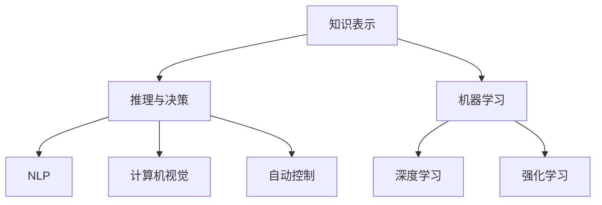

                 

# 人工智能导论原理与代码实战案例讲解

## 1. 背景介绍

人工智能（Artificial Intelligence，AI）是计算机科学和工程领域的前沿学科，其目标是通过算法和计算工具使计算机系统模拟、延伸和扩展人类智能。自20世纪中叶诞生以来，AI已经经历了多次研究高潮和实践应用，并在诸多领域产生了深远影响。

### 1.1 人工智能的发展历程

人工智能的历程可以分为几个重要阶段：

**1.1.1 早期符号推理**

1950年代到1970年代，人工智能研究主要基于符号逻辑和推理。早期研究人员试图通过编写规则和程序，使计算机模拟人类的逻辑推理和问题求解能力。这些系统往往基于明确的知识表示和规则库，如Logic Theorist、EXIST和HANDS。但它们只能处理特定领域的简单问题，难以进行泛化。

**1.1.2 专家系统**

1970年代末到1980年代，专家系统（Expert System）开始兴起。专家系统是一种基于知识库和推理规则的AI系统，能够模仿特定领域的专家知识。早期的例子包括MYCIN、DENDRAL和SHRDLU。专家系统在医疗诊断、化学分析等领域取得了显著成功，但过于依赖人工编写的规则，难以处理复杂和动态场景。

**1.1.3 机器学习**

1980年代末到1990年代，机器学习（Machine Learning，ML）逐渐成为AI研究的焦点。机器学习通过数据驱动的方法，让计算机自动从经验中学习，并不断改进性能。常见的机器学习方法包括决策树、神经网络和支持向量机。1990年，神经网络在图像识别和语音识别方面取得了突破。

**1.1.4 深度学习和强化学习**

21世纪初至今，深度学习（Deep Learning，DL）和强化学习（Reinforcement Learning，RL）成为AI研究的主流。深度学习通过多层神经网络学习复杂的非线性特征，在图像、语音、自然语言处理等领域取得了巨大成功。RL则通过与环境的互动，让智能体自主学习和优化决策。2012年，AlexNet在ImageNet图像识别比赛中大获全胜，标志着深度学习的崛起。

### 1.2 人工智能的现状和展望

当前，AI技术在诸多领域取得了显著进展，包括自动驾驶、智能客服、医疗诊断、金融预测等。AI的广泛应用不仅提升了效率和生产力，还改善了人们的生活质量。

展望未来，AI将继续向更高级的智能形态发展。认知增强（Cognitive Augmentation）、自主系统（Autonomous Systems）、协同智能（Collaborative Intelligence）将成为新的研究方向。同时，AI的伦理、安全和社会影响也将成为重要的关注点。

## 2. 核心概念与联系

### 2.1 核心概念概述

AI涉及众多复杂概念，包括但不限于以下几个：

- **知识表示**：如何将知识表示为计算机能够理解和处理的形式。早期的专家系统多采用符号逻辑，现代深度学习则多采用分布式表示。
- **推理与决策**：如何让计算机通过已知信息进行逻辑推理，做出合理的决策。推理包括正向推理、反向推理、模糊推理等。
- **机器学习**：通过数据驱动的方法，让计算机自动学习模式和规律，从而提升性能。常见的机器学习算法包括监督学习、无监督学习、半监督学习和强化学习。
- **深度学习**：一种特殊的机器学习方法，通过多层神经网络学习复杂特征，广泛应用于图像、语音、自然语言处理等领域。
- **强化学习**：通过与环境互动，让智能体学习最优决策策略。强化学习在自动驾驶、游戏AI、机器人控制等领域有广泛应用。
- **自然语言处理（NLP）**：让计算机理解和生成自然语言的能力。NLP包括语义理解、文本分类、机器翻译等任务。
- **计算机视觉**：让计算机识别、理解和分析图像和视频的能力。计算机视觉包括目标检测、图像分割、人脸识别等任务。
- **自动控制**：通过智能算法实现自动化控制，广泛应用于工业生产、机器人、自动化驾驶等领域。

这些概念之间相互关联，共同构成了AI技术的完整生态。本节将通过Mermaid流程图展示这些概念之间的联系：



### 2.2 概念间的关系

AI的各个概念之间存在着紧密的联系，它们相互支撑，共同推动AI技术的进步。下面我们将通过几个具体的例子，展示这些概念的相互作用。

**案例一：深度学习在图像分类中的应用**

深度学习通过多层神经网络，可以从原始像素数据中学习到高级特征，从而实现图像分类任务。在这个过程中，知识表示用于将图像像素转化为神经网络可以处理的向量形式，推理与决策用于识别图像中的特征和模式，机器学习用于训练和优化神经网络模型，强化学习可以用于自适应调整模型参数。

**案例二：强化学习在机器人控制中的应用**

强化学习通过与环境互动，让机器人学习最优控制策略。在这个过程中，知识表示用于表示机器人状态和动作，推理与决策用于规划机器人行为，机器学习用于训练和优化策略模型，自然语言处理用于与人类沟通，计算机视觉用于识别环境信息，自动控制用于执行机器人动作。

这些案例展示了AI技术在不同场景下的应用，也揭示了知识表示、推理与决策、机器学习、深度学习、强化学习等概念之间的相互作用。通过深入理解这些概念，我们可以更好地把握AI技术的核心思想和实现方法。

## 3. 核心算法原理 & 具体操作步骤

### 3.1 算法原理概述

AI的算法原理可以追溯到数学和计算机科学的诸多领域，包括线性代数、概率论、统计学、图论、最优化等。以下是几个核心算法的概述：

**3.1.1 线性回归**

线性回归是一种简单的机器学习算法，用于建立输入与输出之间的线性关系。线性回归通过最小化预测误差（如均方误差），求解最优的线性模型参数。

**3.1.2 决策树**

决策树是一种基于树形结构的分类器，用于将数据划分为不同的类别。决策树通过递归划分数据集，构建一棵树形结构，每个叶子节点表示一个类别。

**3.1.3 支持向量机**

支持向量机（Support Vector Machine，SVM）是一种常用的分类算法，通过找到最优的超平面，将数据分为不同的类别。SVM通过最大化边际，避免过拟合。

**3.1.4 卷积神经网络**

卷积神经网络（Convolutional Neural Network，CNN）是一种广泛应用于图像处理的深度学习算法。CNN通过卷积层和池化层，提取图像的局部特征，并通过全连接层进行分类。

**3.1.5 循环神经网络**

循环神经网络（Recurrent Neural Network，RNN）是一种用于序列数据处理的深度学习算法。RNN通过循环结构，保留历史信息，用于时间序列预测、语音识别等任务。

**3.1.6 长短期记忆网络**

长短期记忆网络（Long Short-Term Memory，LSTM）是一种特殊的RNN，用于解决梯度消失问题，用于文本生成、机器翻译等任务。

**3.1.7 生成对抗网络**

生成对抗网络（Generative Adversarial Network，GAN）是一种用于生成数据的深度学习算法。GAN由生成器和判别器组成，通过对抗训练，生成逼真的数据样本。

**3.1.8 强化学习**

强化学习通过与环境互动，让智能体学习最优决策策略。强化学习算法包括Q-learning、SARSA、Deep Q-Network等。

### 3.2 算法步骤详解

**3.2.1 线性回归**

1. 收集数据：获取输入特征和输出标签。
2. 数据预处理：将数据标准化，去除异常值。
3. 构建模型：使用线性回归模型，初始化参数。
4. 迭代优化：通过梯度下降等优化算法，不断调整模型参数，最小化预测误差。
5. 模型评估：在测试集上评估模型性能，选择最优模型。

**3.2.2 决策树**

1. 收集数据：获取输入特征和输出标签。
2. 数据预处理：将数据标准化，去除异常值。
3. 构建模型：使用决策树算法，构建树形结构。
4. 剪枝优化：通过剪枝算法，优化树形结构，避免过拟合。
5. 模型评估：在测试集上评估模型性能，选择最优模型。

**3.2.3 支持向量机**

1. 收集数据：获取输入特征和输出标签。
2. 数据预处理：将数据标准化，去除异常值。
3. 构建模型：使用SVM算法，构建最优超平面。
4. 模型评估：在测试集上评估模型性能，选择最优模型。

**3.2.4 卷积神经网络**

1. 收集数据：获取图像数据和标签。
2. 数据预处理：将图像数据标准化，进行数据增强。
3. 构建模型：使用卷积层、池化层和全连接层，构建CNN模型。
4. 训练模型：使用随机梯度下降等优化算法，不断调整模型参数。
5. 模型评估：在测试集上评估模型性能，选择最优模型。

**3.2.5 循环神经网络**

1. 收集数据：获取序列数据和标签。
2. 数据预处理：将序列数据标准化，进行数据增强。
3. 构建模型：使用循环结构，构建RNN模型。
4. 训练模型：使用随机梯度下降等优化算法，不断调整模型参数。
5. 模型评估：在测试集上评估模型性能，选择最优模型。

**3.2.6 长短期记忆网络**

1. 收集数据：获取文本数据和标签。
2. 数据预处理：将文本数据标准化，进行数据增强。
3. 构建模型：使用LSTM层，构建LSTM模型。
4. 训练模型：使用随机梯度下降等优化算法，不断调整模型参数。
5. 模型评估：在测试集上评估模型性能，选择最优模型。

**3.2.7 生成对抗网络**

1. 收集数据：获取数据样本和标签。
2. 数据预处理：将数据标准化，去除异常值。
3. 构建模型：使用生成器和判别器，构建GAN模型。
4. 对抗训练：通过交替训练生成器和判别器，优化模型参数。
5. 模型评估：在测试集上评估模型性能，选择最优模型。

**3.2.8 强化学习**

1. 定义环境：构建模拟环境，定义状态和动作空间。
2. 定义奖励函数：定义奖励函数，衡量智能体的决策效果。
3. 定义策略：定义智能体的决策策略，可以是随机策略或固定策略。
4. 迭代优化：通过Q-learning或SARSA等算法，不断调整策略参数，优化决策效果。
5. 模型评估：在测试环境中评估模型性能，选择最优模型。

### 3.3 算法优缺点

**3.3.1 线性回归**

**优点**：
- 模型简单，易于理解。
- 适合处理线性关系的数据。
- 训练速度快，模型大小可控。

**缺点**：
- 对异常值敏感，容易过拟合。
- 无法处理非线性关系的数据。
- 需要手动选择特征，难以自动发现重要特征。

**3.3.2 决策树**

**优点**：
- 模型易于解释，适合处理非线性数据。
- 可以处理缺失值和分类变量。
- 不需要手动选择特征，自动发现重要特征。

**缺点**：
- 对异常值和噪声敏感，容易过拟合。
- 模型复杂度随数据规模增加而增加。
- 训练时间长，需要调整参数。

**3.3.3 支持向量机**

**优点**：
- 适用于高维数据。
- 对异常值不敏感。
- 模型解释性强，适合处理非线性数据。

**缺点**：
- 训练时间较长，需要调参。
- 需要手动选择核函数和正则化参数。
- 模型复杂，难以解释。

**3.3.4 卷积神经网络**

**优点**：
- 处理图像和视频数据效果显著。
- 可以通过卷积操作提取局部特征。
- 适合处理大规模数据，训练速度快。

**缺点**：
- 需要大量标注数据。
- 模型复杂，需要手动选择超参数。
- 对图像质量要求高，容易过拟合。

**3.3.5 循环神经网络**

**优点**：
- 适合处理序列数据，如文本和时间序列数据。
- 可以保留历史信息，处理动态数据。
- 可以通过门控机制解决梯度消失问题。

**缺点**：
- 训练时间长，需要调整参数。
- 容易过拟合，需要正则化技术。
- 对序列长度要求高，难以处理长序列。

**3.3.6 长短期记忆网络**

**优点**：
- 适合处理长序列数据，如文本和时间序列数据。
- 可以解决梯度消失问题，训练稳定。
- 可以保留长期依赖，适用于文本生成和机器翻译。

**缺点**：
- 模型复杂，需要手动选择超参数。
- 计算量大，训练时间较长。
- 对序列长度要求高，难以处理长序列。

**3.3.7 生成对抗网络**

**优点**：
- 可以生成高质量的数据样本。
- 模型具有生成能力和判别能力。
- 适合处理生成任务，如图像生成和文本生成。

**缺点**：
- 训练复杂，需要调整参数。
- 容易生成伪造数据，需要监督和过滤。
- 模型不稳定，容易产生模式崩溃。

**3.3.8 强化学习**

**优点**：
- 可以自主学习最优决策策略。
- 适用于动态环境，适合自动化控制和游戏AI。
- 可以处理复杂和非线性的决策问题。

**缺点**：
- 需要大量试错，训练时间长。
- 需要定义奖励函数，难以处理多目标问题。
- 需要大量的计算资源，训练成本高。

### 3.4 算法应用领域

AI的算法在各个领域都有广泛应用，以下是几个典型应用领域：

**3.4.1 计算机视觉**

计算机视觉涉及图像和视频的处理和理解。AI算法可以用于图像分类、目标检测、人脸识别、图像分割等任务。例如，卷积神经网络（CNN）在图像分类和目标检测中表现优异。

**3.4.2 自然语言处理（NLP）**

自然语言处理涉及文本的处理和理解。AI算法可以用于文本分类、情感分析、机器翻译、文本生成等任务。例如，循环神经网络（RNN）和长短期记忆网络（LSTM）在文本生成和机器翻译中表现优异。

**3.4.3 语音识别**

语音识别涉及语音信号的处理和理解。AI算法可以用于语音识别、语音合成、语音情感分析等任务。例如，卷积神经网络（CNN）和循环神经网络（RNN）在语音识别和情感分析中表现优异。

**3.4.4 机器人控制**

机器人控制涉及机器人与环境的互动。AI算法可以用于路径规划、动作优化、视觉感知等任务。例如，强化学习（RL）在机器人控制和自动化驾驶中表现优异。

**3.4.5 金融预测**

金融预测涉及市场趋势的分析和预测。AI算法可以用于股票预测、风险评估、投资组合优化等任务。例如，深度学习在股票预测和风险评估中表现优异。

**3.4.6 医疗诊断**

医疗诊断涉及医学影像和病历的处理和分析。AI算法可以用于图像分割、病历分析、疾病诊断等任务。例如，卷积神经网络（CNN）在医学影像处理和疾病诊断中表现优异。

**3.4.7 智能客服**

智能客服涉及自动回答客户咨询。AI算法可以用于文本分类、意图识别、对话生成等任务。例如，深度学习在对话生成和意图识别中表现优异。

## 4. 数学模型和公式 & 详细讲解 & 举例说明

### 4.1 数学模型构建

AI的数学模型构建涉及概率论、线性代数、统计学等多个领域。以下是几个典型模型的构建过程。

**4.1.1 线性回归模型**

线性回归模型的数学模型为：

$$y = w_0 + w_1x_1 + w_2x_2 + ... + w_nx_n + \epsilon$$

其中，$y$表示输出标签，$x_1, x_2, ..., x_n$表示输入特征，$w_0, w_1, w_2, ..., w_n$表示模型参数，$\epsilon$表示随机误差。

**4.1.2 决策树模型**

决策树模型的数学模型为：

$$T = \bigcup_{k=1}^K T_k$$

其中，$T$表示决策树模型，$T_k$表示决策树的子树。

**4.1.3 支持向量机模型**

支持向量机模型的数学模型为：

$$f(x) = \sum_{i=1}^N \alpha_iy_ix_i^T + b$$

其中，$f(x)$表示分类函数，$x$表示输入特征，$y$表示输出标签，$\alpha_i, b$表示模型参数。

**4.1.4 卷积神经网络模型**

卷积神经网络模型的数学模型为：

$$f(x) = h(W_1h(x_1)) + b_1$$

其中，$h(x)$表示卷积操作，$W_1$表示卷积核，$b_1$表示偏置项。

**4.1.5 循环神经网络模型**

循环神经网络模型的数学模型为：

$$h_t = \phi(f(x_t; W_1), h_{t-1}; W_2)$$

其中，$h_t$表示隐藏状态，$\phi$表示激活函数，$f(x_t; W_1)$表示前向传播，$h_{t-1}$表示前一时刻的隐藏状态，$W_2$表示连接权重。

**4.1.6 长短期记忆网络模型**

长短期记忆网络模型的数学模型为：

$$h_t = \phi(f(x_t; W_1), h_{t-1}; W_2)$$

其中，$h_t$表示隐藏状态，$\phi$表示激活函数，$f(x_t; W_1)$表示前向传播，$h_{t-1}$表示前一时刻的隐藏状态，$W_2$表示连接权重。

**4.1.7 生成对抗网络模型**

生成对抗网络模型的数学模型为：

$$z \sim p(z)$$
$$G(z) \sim p_{data}(x|z)$$
$$x \sim p_{data}(x)$$

其中，$z$表示噪声向量，$G(z)$表示生成器，$p_{data}(x|z)$表示生成器分布，$x$表示生成数据。

**4.1.8 强化学习模型**

强化学习模型的数学模型为：

$$Q(s, a) = r + \gamma \max_{a'} Q(s', a')$$

其中，$Q(s, a)$表示状态-动作值函数，$r$表示即时奖励，$s'$表示下一个状态，$\gamma$表示折扣因子。

### 4.2 公式推导过程

**4.2.1 线性回归公式推导**

线性回归的损失函数为均方误差：

$$L(w) = \frac{1}{2m} \sum_{i=1}^m (y_i - \hat{y}_i)^2$$

其中，$y_i$表示真实标签，$\hat{y}_i$表示预测标签。

通过求解最小二乘法，可以得到最优参数：

$$w_j = \frac{\sum_{i=1}^m (x_{ij} - \bar{x}_j)(y_i - \bar{y})}{\sum_{i=1}^m (x_{ij} - \bar{x}_j)^2}$$

**4.2.2 决策树公式推导**

决策树的损失函数为信息增益：

$$Gain(D, A) = I(D; A) - \frac{|D|}{n} \sum_{v \in A} \frac{|D_v|}{|D|} I(D_v; A)$$

其中，$D$表示数据集，$A$表示属性集，$I(D; A)$表示信息熵。

通过递归地选择最优属性，可以构建决策树模型。

**4.2.3 支持向量机公式推导**

支持向量机的损失函数为：

$$\min_{w, b, \alpha} \frac{1}{2}||w||^2 + C\sum_{i=1}^n \alpha_i(1 - y_i(w^T\phi(x_i) + b))$$

其中，$w$表示权重向量，$b$表示偏置项，$\alpha$表示拉格朗日乘子。

通过求解拉格朗日对偶问题，可以得到最优参数：

$$w = \sum_{i=1}^n \alpha_iy_ix_i^T$$

**4.2.4 卷积神经网络公式推导**

卷积神经网络的损失函数为交叉熵：

$$J(\theta) = -\frac{1}{m} \sum_{i=1}^m \sum_{j=1}^c y_{ij} \log \hat{y}_{ij}$$

其中，$y_{ij}$表示真实标签，$\hat{y}_{ij}$表示预测标签。

通过反向传播算法，可以求解最优参数：

$$\frac{\partial J(\theta)}{\partial \theta_k} = \frac{1}{m} \sum_{i=1}^m (\hat{y}_i - y_i)\frac{\partial \hat{y}_i}{\partial \theta_k}$$

**4.2.5 循环神经网络公式推导**

循环神经网络的损失函数为交叉熵：

$$J(\theta) = -\frac{1}{m} \sum_{i=1}^m \sum_{t=1}^T y_{it} \log \hat{y}_{it}$$

其中，$y_{it}$表示真实标签，$\hat{y}_{it}$表示预测标签。

通过反向传播算法，可以求解最优参数：

$$\frac{\partial J(\theta)}{\partial \theta_k} = \frac{1}{m} \sum_{i=1}^m \sum_{t=1}^T (\hat{y}_{it} - y_{it})\frac{\partial \hat{y}_{it}}{\partial \theta_k}$$

**4.2.6 长短期记忆网络公式推导**

长短期记忆网络的损失函数为交叉熵：

$$J(\theta) = -\frac{1}{m} \sum_{i=1}^m \sum_{t=1}^T y_{it} \log \hat{y}_{it}$$

其中，$y_{it}$表示真实标签，$\hat{y}_{it}$表示预测标签。

通过反向传播算法，可以求解最优参数：

$$\frac{\partial J(\theta)}{\partial \theta_k} = \frac{1}{m} \sum_{i=1}^m \sum_{t=1}^T (\hat{y}_{it} - y_{it})\frac{\partial \hat{y}_{it}}{\partial \theta_k}$$

**4.2.7 生成对抗网络公式推导**

生成对抗网络的损失函数为：

$$\min_{G} \max_{D} V(D, G)$$

其中，$V(D, G)$表示生成器和判别器的对抗损失。

通过交替训练生成器和判别器，可以求解最优参数。

**4.2.8 强化学习公式推导**

强化学习的损失函数为Q值函数：

$$Q(s, a) = r + \gamma \max_{a'} Q(s', a')$$

其中，$Q(s, a)$表示状态-动作值函数，$r$表示即时奖励，$s'$表示下一个状态，$\gamma$表示折扣因子。

通过迭代优化Q值函数，可以求解最优策略。

### 4.3 案例分析与讲解

**4.3.1 手写数字识别**

手写数字识别是计算机视觉领域的一个经典问题。可以使用卷积神经网络（CNN）进行识别。以下是CNN模型的代码实现：

```python
import torch
import torch.nn as nn
import torch.optim as optim
from torchvision import datasets, transforms

# 定义CNN模型
class CNN(nn.Module):
    def __init__(self):
        super(CNN, self).__init__()
        self.conv1 = nn.Conv2d(1, 32, 3, 1)
        self.conv2 = nn.Conv2d(32, 64, 3, 1)
        self.fc1 = nn.Linear(64 * 8 * 8, 128)
        self.fc2 = nn.Linear(128, 10)
        self.relu = nn.ReLU()
        self.maxpool = nn.MaxPool2d(2, 2)

    def forward(self, x):
        x = self.maxpool(self.relu(self.conv1(x)))
        x = self.maxpool(self.relu(self.conv2(x)))
        x = x.view(-1, 64 * 8 * 8)
        x = self.relu(self.fc1(x))
        x = self.fc2(x)
        return x

# 定义数据集
train_dataset = datasets.MNIST(root='./data', train=True, transform=transforms.ToTensor(), download=True)
test_dataset = datasets.MNIST(root='./data', train=False, transform=transforms

