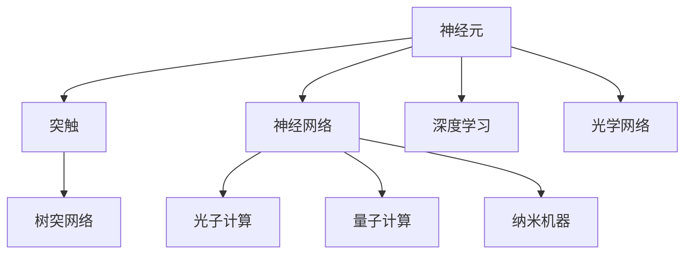
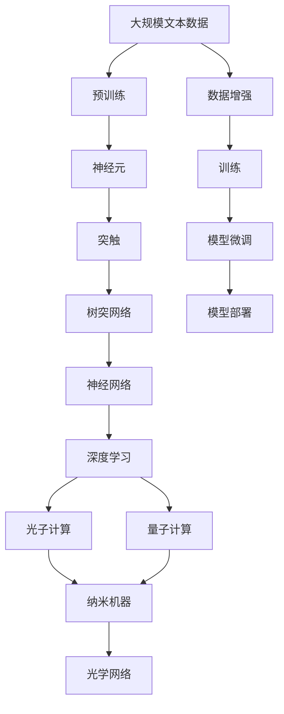

                 

# 仿生计算架构:AI硬件的未来方向

> 关键词：仿生计算, 神经网络, 量子计算, 光子计算, 纳米机器, 光学网络

## 1. 背景介绍

### 1.1 问题由来

近年来，人工智能（AI）技术在图像识别、自然语言处理、推荐系统等领域取得了显著进展，显著提升了人类的生产力和生活质量。然而，目前大多数AI应用依赖于强大的通用计算平台，如CPU和GPU，这些平台的能效比和数据吞吐量始终面临瓶颈，难以满足AI应用对高性能计算的需求。此外，这些计算平台依赖于复杂的电路和微码，难以实现对实时、动态信息的快速响应和处理。

与此同时，人类大脑作为自然界最高级别的信息处理系统，拥有极高的能效比和复杂的神经网络结构。如果我们能够充分理解人脑的计算机制，并将这些机制应用于AI硬件设计中，将有望突破现有的计算平台局限，实现更为高效、智能、灵活的计算方式。

因此，仿生计算架构（Bionic Computation Architecture）应运而生，其核心思想是模仿人类大脑的计算方式，将神经元、突触、树突等生物物理元件与计算机芯片设计相结合，构建新型的AI计算硬件。仿生计算架构不仅能提升AI应用的计算性能和能效比，还能实现对复杂、实时、动态信息的高效处理。

### 1.2 问题核心关键点

仿生计算架构的关键点包括：

- **神经元与突触设计**：仿生计算架构中，神经元与突触被作为计算单元，其结构和功能设计必须能够精确模仿人脑中神经元与突触的运作方式，以实现高效的信息处理。

- **树突网络设计**：树突网络负责处理神经元之间的连接和信息传递，是仿生计算架构中复杂度最高的部分，需要精心设计和优化，以支持大规模的神经元与突触的互连。

- **神经网络模型与算法**：仿生计算架构需要基于人脑的计算模型和算法，如卷积神经网络（CNN）、循环神经网络（RNN）、深度神经网络（DNN）等，进行适当的适应和优化，以提升计算性能和能效。

- **跨学科融合**：仿生计算架构涉及神经生物学、计算机科学、电子工程等多个学科，需要各领域的专家共同合作，将理论研究与工程应用相结合。

- **可扩展性与兼容性**：仿生计算架构必须具备良好的可扩展性和兼容性，能够与现有的AI应用平台无缝集成，同时具备良好的升级和扩展能力。

- **安全性与伦理考量**：仿生计算架构的应用过程中，需要充分考虑数据安全、隐私保护等问题，同时避免潜在的社会伦理风险。

这些关键点构成了仿生计算架构的研究与应用框架，帮助我们从生物计算的角度出发，探索AI硬件的未来发展方向。

### 1.3 问题研究意义

仿生计算架构的研究对于AI硬件的演进和智能化应用具有重要意义：

- **提升计算性能与能效**：仿生计算架构有望大幅提升计算性能和能效比，使得AI应用能够更快、更灵活地响应动态信息。
- **实现实时信息处理**：仿生计算架构能够处理复杂、实时、动态信息，使得AI应用在无人驾驶、医疗诊断等领域具有更强的应用前景。
- **促进跨学科研究**：仿生计算架构的研究需要各学科的共同合作，有助于推动跨学科研究的发展，促进AI技术的进步。
- **推动AI应用的普及**：仿生计算架构的低成本、高可靠性和高效性，将使得AI技术更加普及，深入人类生产生活的各个方面。
- **应对技术挑战**：仿生计算架构的研究能够帮助应对当前AI计算平台面临的瓶颈和挑战，推动AI技术迈向新的高度。
- **保障数据安全与隐私**：仿生计算架构的设计需要充分考虑数据安全与隐私保护，确保AI应用在各个领域的安全性。

## 2. 核心概念与联系

### 2.1 核心概念概述

仿生计算架构是一个多学科交叉的复杂系统，涉及神经生物学、计算科学、电子工程等多个领域。为了更好地理解仿生计算架构，我们需要先梳理一些关键概念及其相互关系。

- **神经元（Neuron）**：神经元是仿生计算架构中的基本计算单元，负责接收输入、处理信息和生成输出。神经元通过突触与其它神经元相连，从而实现信息传递和计算。

- **突触（Synapse）**：突触是神经元之间的连接点，负责信息的传递和处理。突触的强度和特性决定着神经元之间的连接强度和信息传递方式。

- **树突（Dendrite）**：树突负责处理神经元之间的连接和信息传递，是仿生计算架构中最复杂的结构之一。树突网络的设计需要充分考虑信息传递的效率和可靠性。

- **神经网络（Neural Network）**：神经网络由大量神经元和突触组成，通过多层处理单元的叠加，实现复杂的模式识别和信息处理。

- **深度学习（Deep Learning）**：深度学习是一种基于神经网络的机器学习方法，通过多层非线性变换，实现对复杂数据的表示和处理。

- **光子计算（Photonics Computing）**：光子计算利用光子作为信息载体，通过光子芯片实现高并行、低能耗的计算。

- **量子计算（Quantum Computing）**：量子计算利用量子比特作为信息载体，通过量子门和量子逻辑实现高效的计算和信息处理。

- **纳米机器（Nanomachines）**：纳米机器是指尺寸在纳米级别的人工分子，具有高度的灵活性和可控性，可以用于构建仿生计算架构中的神经元和突触。

- **光学网络（Optical Network）**：光学网络利用光子作为信息载体，通过光纤和光子芯片实现高效的通信和信息传递。

这些概念相互关联，共同构成了仿生计算架构的研究与应用框架。通过理解这些概念，我们可以更好地把握仿生计算架构的工作原理和优化方向。

### 2.2 概念间的关系

这些关键概念之间的关系可以通过以下Mermaid流程图来展示：

这个流程图展示了神经元、突触、树突网络、神经网络、深度学习、光子计算、量子计算、纳米机器和光学网络之间的关系：

1. 神经元是仿生计算架构中的基本计算单元，负责信息处理。
2. 突触是神经元之间的连接点，实现信息的传递和处理。
3. 树突网络负责处理神经元之间的连接，实现高效的信息传递。
4. 神经网络通过多层处理单元的叠加，实现复杂的模式识别和信息处理。
5. 深度学习是一种基于神经网络的机器学习方法，实现对复杂数据的表示和处理。
6. 光子计算和量子计算分别利用光子和量子比特作为信息载体，实现高效计算和信息处理。
7. 纳米机器具有高度的灵活性和可控性，用于构建仿生计算架构中的神经元和突触。
8. 光学网络利用光子作为信息载体，实现高效的通信和信息传递。

通过理解这些概念之间的相互关系，我们可以更好地理解仿生计算架构的复杂性和多样性，从而探索更高效、更灵活的计算方式。

### 2.3 核心概念的整体架构

最后，我们用一个综合的流程图来展示这些核心概念在大规模仿生计算架构中的整体架构：

这个综合流程图展示了从数据增强到模型部署的完整过程。

1. 大规模文本数据被用于神经元的预训练，使得神经元具备处理自然语言的能力。
2. 神经元通过突触连接，形成树突网络，实现高效的信息传递和计算。
3. 树突网络通过神经网络进行多层处理，实现复杂的模式识别和信息处理。
4. 深度学习算法进一步优化神经网络的性能和能效。
5. 光子计算和量子计算通过不同信息载体，实现高效计算和信息处理。
6. 纳米机器用于构建仿生计算架构中的神经元和突触，提供更灵活的计算方式。
7. 光学网络利用光子作为信息载体，实现高效的通信和信息传递。
8. 预训练、训练、模型微调和部署等环节，完成从数据到应用的全流程。

通过这些流程图，我们可以更清晰地理解仿生计算架构的工作原理和优化方向。

## 3. 核心算法原理 & 具体操作步骤
### 3.1 算法原理概述

仿生计算架构的算法原理涉及神经元、突触、树突网络等多个生物计算单元的设计和优化。其核心思想是模仿人脑的计算机制，构建高效、智能、灵活的计算系统。

仿生计算架构的算法原理可以概括为以下几个步骤：

1. **神经元设计与仿真**：设计具有精确生理机制的神经元，并构建其仿真模型，实现对自然界中神经元行为的准确模拟。

2. **突触设计与仿真**：设计具有精确生理机制的突触，并构建其仿真模型，实现对自然界中突触行为的准确模拟。

3. **树突网络设计与仿真**：设计复杂的树突网络，实现对神经元之间连接和信息传递的精确模拟。

4. **神经网络设计与优化**：构建基于神经元与突触的神经网络，通过优化算法实现对复杂数据的处理。

5. **深度学习算法设计与优化**：将深度学习算法与神经网络相结合，实现对复杂数据的表示和处理。

6. **光子计算和量子计算设计与优化**：利用光子作为信息载体，或量子比特作为信息载体，实现高效计算和信息处理。

7. **纳米机器设计与制造**：利用纳米技术，设计和制造具有高度灵活性和可控性的纳米机器，用于构建仿生计算架构中的神经元和突触。

8. **光学网络设计与优化**：利用光子作为信息载体，实现高效通信和信息传递。

### 3.2 算法步骤详解

以下是仿生计算架构的详细步骤：

#### 3.2.1 神经元设计与仿真

神经元是仿生计算架构中的基本计算单元，负责接收输入、处理信息和生成输出。神经元的设计需要充分考虑其生理机制，包括细胞体、树突、轴突等结构，以及离子通道、突触囊泡等生物分子。神经元的仿真模型需要实现对自然界中神经元行为的精确模拟。

1. **神经元结构设计**：设计神经元的结构，包括细胞体、树突和轴突等部分，并确定其尺寸和形态。

2. **神经元生理机制仿真**：利用神经生理学的知识，构建神经元的仿真模型，实现对其离子通道、突触囊泡等生物分子的精确模拟。

3. **神经元行为仿真**：利用仿真模型，实现对神经元输入、处理和输出的精确模拟，包括动作电位、神经递质释放等过程。

#### 3.2.2 突触设计与仿真

突触是神经元之间的连接点，负责信息的传递和处理。突触的设计需要充分考虑其生理机制，包括突触前膜、突触后膜、突触间隙等结构，以及神经递质、离子通道等生物分子。突触的仿真模型需要实现对自然界中突触行为的精确模拟。

1. **突触结构设计**：设计突触的结构，包括突触前膜、突触后膜和突触间隙等部分，并确定其尺寸和形态。

2. **突触生理机制仿真**：利用神经生理学的知识，构建突触的仿真模型，实现对其神经递质、离子通道等生物分子的精确模拟。

3. **突触行为仿真**：利用仿真模型，实现对突触输入、处理和输出的精确模拟，包括神经递质释放、突触电位等过程。

#### 3.2.3 树突网络设计与仿真

树突网络负责处理神经元之间的连接和信息传递，是仿生计算架构中最复杂的结构之一。树突网络的设计需要充分考虑信息传递的效率和可靠性。树突网络的仿真模型需要实现对自然界中树突网络的精确模拟。

1. **树突网络结构设计**：设计树突网络的结构，包括神经元之间的连接方式、突触的位置和数量等，并确定其尺寸和形态。

2. **树突网络生理机制仿真**：利用神经生理学的知识，构建树突网络的仿真模型，实现对其突触连接、信息传递等过程的精确模拟。

3. **树突网络行为仿真**：利用仿真模型，实现对树突网络输入、处理和输出的精确模拟，包括神经元之间的连接强度、信息传递速度等过程。

#### 3.2.4 神经网络设计与优化

神经网络通过多层处理单元的叠加，实现复杂的模式识别和信息处理。神经网络的设计需要充分考虑其结构、参数和优化算法，以实现高效的信息处理。

1. **神经网络结构设计**：设计神经网络的拓扑结构，包括层数、神经元数量、连接方式等，并确定其参数和优化算法。

2. **神经网络参数优化**：利用深度学习算法，优化神经网络的参数，实现对复杂数据的处理。

3. **神经网络行为仿真**：利用仿真模型，实现对神经网络输入、处理和输出的精确模拟，包括特征提取、模式识别等过程。

#### 3.2.5 深度学习算法设计与优化

深度学习是一种基于神经网络的机器学习方法，通过多层非线性变换，实现对复杂数据的表示和处理。深度学习算法的设计需要充分考虑其结构、参数和优化算法，以实现高效的信息处理。

1. **深度学习算法结构设计**：设计深度学习算法的结构，包括层数、神经元数量、连接方式等，并确定其参数和优化算法。

2. **深度学习算法参数优化**：利用深度学习算法，优化神经网络的参数，实现对复杂数据的处理。

3. **深度学习算法行为仿真**：利用仿真模型，实现对深度学习算法输入、处理和输出的精确模拟，包括特征提取、模式识别等过程。

#### 3.2.6 光子计算和量子计算设计与优化

光子计算和量子计算分别利用光子和量子比特作为信息载体，实现高效计算和信息处理。光子计算和量子计算的设计需要充分考虑其结构、参数和优化算法，以实现高效的信息处理。

1. **光子计算和量子计算结构设计**：设计光子计算和量子计算的结构，包括光子芯片和量子比特的布局，并确定其参数和优化算法。

2. **光子计算和量子计算参数优化**：利用光子计算和量子计算算法，优化神经网络的参数，实现对复杂数据的处理。

3. **光子计算和量子计算行为仿真**：利用仿真模型，实现对光子计算和量子计算输入、处理和输出的精确模拟，包括信息传递、计算速度等过程。

#### 3.2.7 纳米机器设计与制造

纳米机器用于构建仿生计算架构中的神经元和突触，具有高度的灵活性和可控性。纳米机器的设计和制造需要充分考虑其结构、性能和可控性，以实现高效的生物计算。

1. **纳米机器结构设计**：设计纳米机器的结构，包括纳米机器的尺寸、形状和材料，并确定其性能和可控性。

2. **纳米机器制造工艺设计**：设计纳米机器的制造工艺，包括纳米机器的制备方法和加工工艺，并确定其性能和可控性。

3. **纳米机器行为仿真**：利用仿真模型，实现对纳米机器输入、处理和输出的精确模拟，包括生物分子的行为、信息传递等过程。

#### 3.2.8 光学网络设计与优化

光学网络利用光子作为信息载体，实现高效的通信和信息传递。光学网络的设计需要充分考虑其结构、参数和优化算法，以实现高效的信息处理。

1. **光学网络结构设计**：设计光学网络的结构，包括光纤和光子芯片的布局，并确定其参数和优化算法。

2. **光学网络参数优化**：利用光学网络算法，优化神经网络的参数，实现对复杂数据的处理。

3. **光学网络行为仿真**：利用仿真模型，实现对光学网络输入、处理和输出的精确模拟，包括信息传递、计算速度等过程。

### 3.3 算法优缺点

仿生计算架构具有以下优点：

1. **高效的信息处理**：仿生计算架构中的神经元、突触和树突网络能够实现高效的信息处理，提升AI应用的计算性能和能效比。

2. **灵活的计算方式**：仿生计算架构中的光子计算和量子计算能够提供灵活的计算方式，满足不同应用场景的需求。

3. **强大的自适应能力**：仿生计算架构中的神经网络和深度学习算法能够实现对复杂数据的自适应处理，提升AI应用的泛化能力和鲁棒性。

4. **高可靠性和安全性**：仿生计算架构中的神经元和突触设计具有高可靠性和安全性，能够保障AI应用的数据安全与隐私保护。

5. **低能耗和低成本**：仿生计算架构中的神经元和突触设计具有低能耗和低成本的特点，能够降低AI应用的计算成本和能源消耗。

仿生计算架构也存在以下缺点：

1. **设计和实现复杂**：仿生计算架构涉及复杂的生物物理结构和算法，设计和实现过程非常复杂，需要多学科专家共同合作。

2. **制造和集成难度大**：仿生计算架构中的纳米机器和光学网络制造和集成难度大，需要先进的技术和设备支持。

3. **数据存储和处理挑战**：仿生计算架构中的神经元和突触结构复杂，数据存储和处理面临挑战，需要先进的数据管理技术支持。

4. **技术成熟度低**：仿生计算架构中的神经元和突触设计尚未完全成熟，需要进一步的研究和优化。

5. **跨学科合作困难**：仿生计算架构的研究需要多学科专家的合作，跨学科合作面临挑战。

6. **伦理和安全问题**：仿生计算架构中的神经元和突触设计可能涉及伦理和安全问题，需要进一步的探讨和规范。

这些优缺点构成了仿生计算架构的研究与应用框架，我们需要在设计和实现过程中充分考虑这些因素，以实现高效、智能、灵活的AI硬件。

### 3.4 算法应用领域

仿生计算架构可以应用于多个领域，以下是其主要应用场景：

1. **智能系统设计**：仿生计算架构可以用于设计智能系统，如智能机器人、智能车辆等，提升系统的感知、决策和执行能力。

2. **医疗诊断和治疗**：仿生计算架构可以用于医疗诊断和治疗，如神经网络模拟人脑的认知过程，实现对疾病的早期检测和诊断。

3. **无人驾驶和自动化**：仿生计算架构可以用于无人驾驶和自动化系统，提升系统的环境感知和决策能力，实现更安全、高效的无人驾驶。

4. **金融分析和预测**：仿生计算架构可以用于金融分析和预测，提升系统的数据分析和预测能力，实现更精准、实时的金融决策。

5. **环境监测和保护**：仿生计算架构可以用于环境监测和保护，提升系统的环境感知和监测能力，实现更智能、高效的环境保护。

6. **城市治理和管理**：仿生计算架构可以用于城市治理和管理，提升系统的智能监测和管理能力，实现更智能、高效的城市治理。

7. **工业自动化和制造**：仿生计算架构可以用于工业自动化和制造，提升系统的自动化和智能化能力，实现更高效、安全的工业生产。

8. **军事防御和作战**：仿生计算架构可以用于军事防御和作战，提升系统的感知、决策和执行能力，实现更智能、高效的军事防御和作战。

这些应用场景展示了仿生计算架构的广泛应用前景，推动了AI技术在多个领域的进步和创新。

## 4. 数学模型和公式 & 详细讲解 & 举例说明

### 4.1 数学模型构建

仿生计算架构的数学模型涉及神经元、突触、树突网络等多个生物计算单元的设计和优化。其核心思想是模仿人脑的计算机制，构建高效、智能、灵活的计算系统。

仿生计算架构的数学模型可以概括为以下几个步骤：

1. **神经元数学模型构建**：设计神经元的数学模型，实现对神经元行为的精确模拟。

2. **突触数学模型构建**：设计突触的数学模型，实现对突触行为的精确模拟。

3. **树突网络数学模型构建**：设计树突网络的数学模型，实现对树突网络行为的精确模拟。

4. **神经网络数学模型构建**：设计神经网络的数学模型，实现对复杂数据的处理。

5. **深度学习数学模型构建**：设计深度学习的数学模型，实现对复杂数据的表示和处理。

6. **光子计算和量子计算数学模型构建**：设计光子计算和量子计算的数学模型，实现高效计算和信息处理。

7. **纳米机器数学模型构建**：设计纳米机器的数学模型，实现对生物分子的精确模拟。

8. **光学网络数学模型构建**：设计光学网络的数学模型，实现高效通信和信息传递。

### 4.2 公式推导过程

以下是仿生计算架构中的一些关键公式的推导过程：

#### 4.2.1 神经元数学模型推导

神经元数学模型涉及神经元输入、处理和输出的数学表达式。神经元数学模型可以表示为：

$$
I_{in} = g(V_{membrane}) + I_{syn}
$$

$$
V_{membrane} = C_{membrane}\frac{dV_{membrane}}{dt} = g(V_{membrane}) + I_{in}
$$

其中，$I_{in}$为神经元的输入电流，$g(V_{membrane})$为神经元的膜电导函数，$I_{syn}$为突触电流，$V_{membrane}$为神经元的膜电位，$C_{membrane}$为神经元的电容值。

#### 4.2.2 突触数学模型推导

突触数学模型涉及突触输入、处理和输出的数学表达式。突触数学模型可以表示为：

$$
I_{syn} = g(V_{pre}) + \sum_{j} J_{ij} V_{post,j}
$$

其中，$I_{syn}$为突触电流，$g(V_{pre})$为突触前膜的电导函数，$V_{pre}$为突触前膜的电位，$V_{post,j}$为突触后膜的电位，$J_{ij}$为突触连接权重。

#### 4.2.3 树突网络数学模型推导

树突网络数学模型涉及神经元之间连接的数学表达式。树突网络数学模型可以表示为：

$$
V_{post,i} = \sum_{j} J_{ij} V_{post,j}
$$

其中，$V_{post,i}$为神经元$i$的膜电位，$J_{ij}$为神经元$i$和神经元$j$之间的突触连接权重。

#### 4.2.4 神经网络数学模型推导

神经网络数学模型涉及多层神经元之间的连接的数学表达式。神经网络数学模型可以表示为：

$$
h_i = \sigma(W_i^T \cdot h_{i-1} + b_i)
$$

其中，$h_i$为神经元$i$的输出，$W_i$为神经元$i$的权重矩阵，$h_{i-1}$为前一层神经元的输出，$b_i$为神经元$i$的偏置向量，$\sigma$为激活函数。

#### 4.2.5 深度学习数学模型推导

深度学习数学模型涉及多层神经元之间的连接的数学表达式。深度学习数学模型可以表示为：

$$
h_i = \sigma(W_i^T \cdot h_{i-1} + b_i)
$$

其中，$h_i$为神经元$i$的输出，$W_i$为神经元$i$的权重矩阵，$h_{i-1}$为前一层神经元的输出，$b_i$为神经元$i$的偏置向量，$\sigma$为激活函数。

#### 4.2.6 光子计算和量子计算数学模型推导

光子计算和量子计算数学模型涉及光子和量子比特的数学表达式。光子计算和量子计算数学模型可以表示为：

$$
I_{phot} = \sum_i G_i \cdot P_{in,i}
$$

其中，$I_{phot}$为光子电流，$G_i$为光子探测器响应函数，$P_{in,i}$为输入光子强度。

#### 4.2.7 纳米机器数学模型推导

纳米机器数学模型涉及纳米机器的生物分子行为数学表达式。纳米机器数学模型可以表示为：

$$
J_{syn} = k_B T \ln \frac{K_D}{K_I} \cdot \frac{[V]^2}{K_D + [V]}
$$

其中，$J_{syn}$为突触连接权重，$K_D$为离解常数，$K_I$为亲和力常数，$[V]$为纳米机器的浓度。

#### 4.2.8 光学网络数学模型推导

光学网络数学模型涉及光子芯片和光纤的数学表达式。光学网络数学模型可以表示为：

$$
I_{opt} = \sum_i G_i \cdot P_{in,i}

