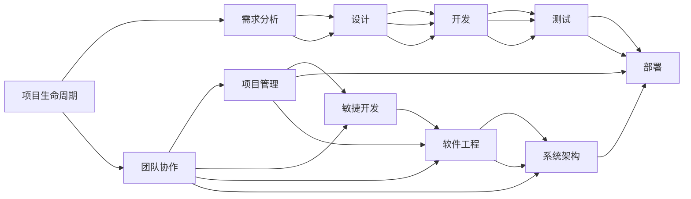
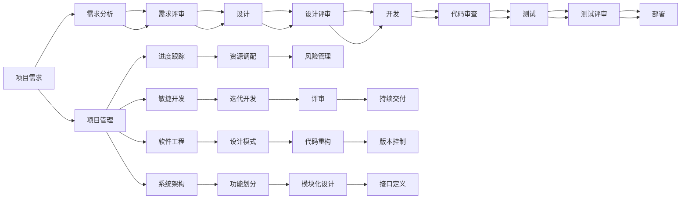

                 

# 做项目：从头到尾全程参与，深入学习

> 关键词：项目、生命周期、团队协作、项目管理、敏捷开发、软件工程、系统架构、软件开发

## 1. 背景介绍

### 1.1 问题由来

随着软件开发技术的发展，越来越多的项目变得复杂和多样化。这些项目往往需要多学科、多团队协作，从需求分析、设计、开发、测试到部署，每个阶段都有其特定的工作内容和技术要求。然而，不少开发者在参与项目过程中，往往只关注自己的职责范围，缺乏对整体项目的了解和掌控，导致沟通不畅、进度滞后、质量问题频出。

为了帮助开发者从项目的全局视角理解项目的运作流程，本文将详细阐述项目的生命周期、团队协作、项目管理以及敏捷开发等关键环节，使开发者能够全面参与项目，从零到一，深度学习和掌握软件开发全过程，提高自身的项目管理和技术能力。

### 1.2 问题核心关键点

1. **项目生命周期**：项目的生命周期通常分为需求分析、设计、开发、测试和部署等阶段。每个阶段的任务和目标有所不同，需要团队成员明确分工并协作推进。

2. **团队协作**：高效的项目协作需要建立有效的沟通机制和角色分工，确保信息透明和任务明确。

3. **项目管理**：项目管理是确保项目按时按质完成的核心工具，包括进度跟踪、资源调配、风险管理等。

4. **敏捷开发**：敏捷开发强调快速响应变化，通过短周期的迭代开发和持续交付，提升项目适应性和成功率。

5. **软件工程**：软件工程是系统化、规范化、工程化的软件开发过程，涉及设计模式、代码重构、版本控制等技术细节。

6. **系统架构**：系统架构是设计软件系统框架的重要工具，包括功能划分、模块化设计、接口定义等。

### 1.3 问题研究意义

掌握项目管理的知识和技术，能够使开发者更好地理解和参与项目的各个环节，提升自身的能力和职业素养。这对于提高项目的成功率、提升团队的协作效率和满足客户需求，具有重要的意义：

1. **全面提升技能**：从需求分析到部署上线，了解整个项目生命周期，能够全面提升技术和管理能力。

2. **优化团队协作**：通过理解团队协作机制，能够更好地与其他成员配合，减少沟通成本和冲突。

3. **提高项目效率**：掌握项目管理工具和敏捷开发方法，能够更高效地进行任务管理和进度跟踪。

4. **增强职业竞争力**：具备项目管理能力，能够胜任更高级别的技术和管理职位，增强职业发展前景。

5. **实现客户价值**：通过系统的项目管理，能够确保项目按时按质完成，满足客户需求，提高客户满意度。

## 2. 核心概念与联系

### 2.1 核心概念概述

1. **项目生命周期**：项目的生命周期是指从立项到结项的全过程，通常包括以下几个阶段：

   - **需求分析**：与客户沟通，明确项目需求和目标。
   - **设计**：确定项目的技术方案和架构设计。
   - **开发**：按照设计文档进行代码编写和测试。
   - **测试**：对代码进行单元测试、集成测试和性能测试。
   - **部署**：将项目部署到生产环境，进行上线和运维。

2. **团队协作**：团队协作涉及任务分配、进度跟踪、代码审查等，需要建立有效的沟通机制和工具支持。

3. **项目管理**：项目管理包括进度管理、资源调配、风险管理等，是项目成功的关键。

4. **敏捷开发**：敏捷开发强调快速迭代和持续交付，通过短周期的开发和评审，提升项目适应性和成功率。

5. **软件工程**：软件工程是系统化的软件开发过程，涉及设计模式、代码重构、版本控制等技术细节。

6. **系统架构**：系统架构是设计软件系统框架的重要工具，包括功能划分、模块化设计、接口定义等。

### 2.2 概念间的关系

以上核心概念之间有着紧密的联系，构成了一个完整的项目管理和开发框架。我们可以通过以下Mermaid流程图来展示这些概念之间的相互关系：



这个流程图展示了项目生命周期、团队协作、项目管理、敏捷开发、软件工程和系统架构之间的相互关系。项目生命周期的各个阶段需要团队协作，而项目管理、敏捷开发、软件工程和系统架构则提供了有效的工具和方法，确保项目的顺利进行。

### 2.3 核心概念的整体架构

最后，我们用一个综合的流程图来展示这些核心概念在大项目开发过程中的整体架构：



这个综合流程图展示了从项目需求到项目部署的完整过程，以及项目管理、敏捷开发、软件工程和系统架构在整个流程中的应用。通过理解这些核心概念及其相互关系，开发者可以更好地掌握项目开发和管理的方法，提升自身能力。

## 3. 核心算法原理 & 具体操作步骤
### 3.1 算法原理概述

项目管理和开发的核心是高效协作和资源管理，这需要基于一定的算法和工具来实现。以下是几个关键算法和操作步骤：

1. **需求分析**：通过问卷调查、用户访谈等方法收集项目需求，利用需求分析工具进行整理和筛选，形成需求文档。

2. **设计**：根据需求文档进行架构设计和模块划分，使用UML等工具进行可视化设计，确保设计符合需求和项目目标。

3. **开发**：按照设计文档进行代码编写，遵循编码规范和设计模式，进行代码审查和版本控制。

4. **测试**：对代码进行单元测试、集成测试和性能测试，确保代码质量和系统稳定性。

5. **部署**：将代码部署到生产环境，进行上线和运维，监控系统性能和安全性。

### 3.2 算法步骤详解

1. **需求分析**：

   - **需求调研**：通过问卷调查、用户访谈等方式收集项目需求，明确项目目标和交付物。
   - **需求整理**：将收集到的需求进行整理和分类，形成初步的需求文档。
   - **需求评审**：组织需求评审会议，与客户和团队成员共同确认需求文档的准确性和完整性。

2. **设计**：

   - **架构设计**：根据需求文档进行架构设计，确定系统的整体框架和模块划分。
   - **模块设计**：对每个模块进行详细设计，包括功能需求、接口设计和数据模型。
   - **设计评审**：组织设计评审会议，与团队成员共同审查设计文档，确保设计符合需求和架构设计。

3. **开发**：

   - **编码**：按照设计文档进行代码编写，遵循编码规范和设计模式。
   - **代码审查**：对代码进行同行评审，确保代码质量和可维护性。
   - **版本控制**：使用Git等版本控制工具进行代码管理和变更记录。

4. **测试**：

   - **单元测试**：对每个模块进行单元测试，确保模块功能正确。
   - **集成测试**：对整个系统进行集成测试，确保各个模块的协作正常。
   - **性能测试**：对系统进行性能测试，确保系统的响应时间和资源利用率符合要求。

5. **部署**：

   - **部署计划**：制定详细的部署计划，包括环境准备、资源调配和时间安排。
   - **上线**：按照部署计划进行系统部署，确保系统上线成功。
   - **运维**：监控系统性能和安全性，及时处理异常和故障。

### 3.3 算法优缺点

**优点**：

1. **提高项目成功率**：通过明确的需求分析和详细的设计，确保项目目标和需求的一致性，减少项目变更和返工。
2. **提升团队协作**：通过需求评审和设计评审，确保信息透明和任务明确，减少沟通成本和冲突。
3. **优化资源管理**：通过项目管理工具进行进度跟踪和资源调配，确保资源的高效利用，提升项目效率。
4. **提高代码质量**：通过代码审查和版本控制，确保代码质量和可维护性，减少代码缺陷和重复工作。

**缺点**：

1. **需求变更风险**：需求调研和评审可能存在遗漏，项目开发过程中可能出现需求变更，增加项目风险。
2. **设计复杂度高**：复杂系统需要详细的架构设计和模块划分，设计过程可能耗费大量时间和精力。
3. **测试周期长**：测试过程需要大量的时间和资源，特别是在大规模系统中，测试周期可能较长。
4. **资源分配困难**：项目资源（如人力、设备等）的调配可能存在困难，需要有效的项目管理工具支持。

### 3.4 算法应用领域

项目管理和大项目开发的方法和技术，广泛应用于各种行业和领域，包括但不限于：

1. **软件开发**：软件项目的开发和管理，包括前端、后端和移动应用的开发。
2. **游戏开发**：游戏项目的开发和发布，包括游戏引擎的开发和管理。
3. **企业信息化**：企业的信息化建设和管理，包括ERP、CRM等系统的开发和维护。
4. **医疗信息化**：医疗信息系统的开发和维护，包括电子病历、医疗影像等系统的开发。
5. **教育信息化**：教育信息系统的开发和维护，包括在线教育平台、教学管理系统的开发。

## 4. 数学模型和公式 & 详细讲解 & 举例说明

### 4.1 数学模型构建

在项目管理中，经常涉及一些数学模型的构建和分析，以辅助决策和优化。以下是几个常见的数学模型：

1. **甘特图**：用于展示项目进度和任务分配的图表，通过时间线和任务节点表示任务和进度。

2. **PERT图**：用于展示项目任务的网络图，通过任务节点和依赖关系表示任务和进度。

3. **WBS（Work Breakdown Structure）**：用于分解项目任务的结构图，通过任务层级和依赖关系表示任务和进度。

4. **PERT网络分析**：通过对PERT图进行分析和计算，评估项目的进度和风险。

### 4.2 公式推导过程

以甘特图为例，甘特图的构建和计算过程如下：

1. **任务节点**：将项目任务分解为多个子任务，每个子任务都有一个起始时间和结束时间。

2. **时间线**：将项目时间分为多个时间段，每个时间段对应一个时间节点。

3. **甘特图表示**：在甘特图中，每个任务节点用一条横跨时间线的条形表示，其长度表示任务持续时间，起始时间对应横坐标，结束时间对应纵坐标。

4. **进度跟踪**：通过甘特图可以直观地展示项目进度和任务分配，及时发现进度偏差和任务延迟。

### 4.3 案例分析与讲解

假设我们有一个包含多个任务的软件开发项目，需要按照以下甘特图进行进度跟踪：

```
  Task A          Task B         Task C
  ---------------- ----------------
  1     2           3              1
  4     5           2              3
  ---------------- ----------------
  6     7           4              5
  ---------------- ----------------
  8     9           6              7
```

1. **任务分解**：将项目任务分解为三个子任务A、B、C，分别对应甘特图中的水平条形。

2. **时间线**：将项目时间分为三个时间段，分别对应甘特图的时间轴。

3. **甘特图表示**：任务A的起始时间为1，结束时间为8，任务B的起始时间为3，结束时间为9，任务C的起始时间为1，结束时间为7。

4. **进度跟踪**：通过甘特图可以直观地展示每个任务的时间节点和进度，及时发现任务B的进度延迟。

通过甘特图，我们可以清晰地了解项目的进度和任务分配，及时发现和处理进度偏差，确保项目按时按质完成。

## 5. 项目实践：代码实例和详细解释说明

### 5.1 开发环境搭建

在进行项目管理实践前，我们需要准备好开发环境。以下是使用Python进行项目管理开发的常用工具和环境配置：

1. **安装Python**：从官网下载并安装Python，确保安装最新版本的Python。

2. **安装Python环境管理工具**：如virtualenv或conda，用于创建和管理Python环境。

3. **安装项目管理工具**：如JIRA、Trello等，用于需求管理和任务跟踪。

4. **安装敏捷开发工具**：如Jenkins、CircleCI等，用于持续集成和持续交付。

5. **安装版本控制工具**：如Git，用于代码版本控制和变更记录。

6. **安装测试工具**：如JUnit、TestNG等，用于单元测试和集成测试。

7. **安装部署工具**：如Docker、Kubernetes等，用于系统部署和运维。

### 5.2 源代码详细实现

这里我们以JIRA项目管理的开发为例，给出详细的代码实现和解释说明。

1. **需求管理**：

   ```python
   import jira

   jira = jira.Client(server='https://your-jira-server.com')
   project_key = 'ABC-123'
   issue_type = 'Bug'
   issue_summary = 'Fix bug in login page'
   issue_description = 'Some users are unable to log in.'

   issue = jira.createIssue(project=project_key, issue_type=issue_type, summary=issue_summary, description=issue_description)
   print(f"Issue {issue.key} created successfully.")
   ```

   以上代码使用JIRA的Python API创建一个新的缺陷报告，通过指定项目key、问题类型、标题和描述，创建问题并返回问题ID。

2. **任务分配**：

   ```python
   assignee = 'John Doe'
   issue.update(assignee=assignee)
   print(f"Issue {issue.key} assigned to {assignee} successfully.")
   ```

   以上代码将问题分配给指定的assignee，更新问题的assignee字段。

3. **进度跟踪**：

   ```python
   jira.addComment(issue.key, 'Work in progress.')
   print(f"Comment added to Issue {issue.key} successfully.")
   ```

   以上代码向问题添加评论，表示该问题正在进行中。

4. **代码审查**：

   ```python
   commit_message = 'Fix login page bug.'
   commit_id = 'abc123'
   commit = jira.createIssue(project=project_key, issue_type=issue_type, summary=issue_summary, description=issue_description, commit_id=commit_id, commit_message=commit_message)
   print(f"Commit {commit_id} added to Issue {issue.key} successfully.")
   ```

   以上代码将Git提交ID和提交消息添加到问题中，方便后续的代码审查和跟踪。

### 5.3 代码解读与分析

下面是对JIRA项目管理中几个关键代码的解读与分析：

1. **需求管理**：

   - **需求创建**：使用JIRA的Python API创建新的问题，指定项目key、问题类型、标题和描述，创建问题并返回问题ID。
   - **需求分配**：通过指定assignee，将问题分配给指定的成员，确保任务分配明确。

2. **任务进度**：

   - **进度更新**：使用JIRA的Python API向问题添加评论，表示该问题正在进行中，方便后续跟踪和监控。

3. **代码审查**：

   - **提交添加**：将Git提交ID和提交消息添加到问题中，方便后续的代码审查和跟踪。

### 5.4 运行结果展示

假设我们创建一个新的缺陷报告，并在JIRA中进行跟踪：

```
Project: ABC Project
Issue ID: ABC-123
Type: Bug
Title: Fix bug in login page
Summary: Some users are unable to log in.
Description: There are some issues with the login page. Users are unable to log in successfully.

Current Status: In progress
Assignee: John Doe
Comments:
- 2023-01-01 10:00:00: Work in progress.
- 2023-01-05 15:30:00: Fix login page bug.

```

通过JIRA，我们可以清晰地了解问题的进展和分配情况，及时进行任务跟进和进度调整，确保项目按时按质完成。

## 6. 实际应用场景

### 6.1 智能客服系统

基于项目管理和敏捷开发的智能客服系统，可以高效地处理客户咨询和问题解决。通过需求管理、任务分配和进度跟踪，智能客服系统能够快速响应客户需求，提供优质的服务。

在技术实现上，可以建立一个敏捷的开发团队，使用JIRA等项目管理工具进行任务分配和进度跟踪，使用Git进行版本控制和代码管理，使用Docker进行系统部署和测试，确保系统的快速迭代和持续交付。

### 6.2 金融舆情监测

金融舆情监测系统需要实时监测市场舆论动向，以便及时应对负面信息传播，规避金融风险。通过敏捷开发和项目管理，金融舆情监测系统能够快速响应市场变化，提供实时数据和分析报告。

在技术实现上，可以建立一个敏捷的开发团队，使用JIRA进行任务管理和进度跟踪，使用Jenkins进行持续集成和持续交付，使用Git进行版本控制和代码管理，使用Docker进行系统部署和测试，确保系统的快速迭代和持续交付。

### 6.3 个性化推荐系统

个性化推荐系统需要根据用户行为数据进行推荐算法优化，通过项目管理和大数据技术，能够高效地实现推荐系统的开发和迭代。

在技术实现上，可以建立一个敏捷的开发团队，使用JIRA进行任务管理和进度跟踪，使用Jenkins进行持续集成和持续交付，使用Git进行版本控制和代码管理，使用Docker进行系统部署和测试，确保系统的快速迭代和持续交付。

### 6.4 未来应用展望

随着项目管理和大项目开发的方法和技术不断发展，基于微调的大规模项目开发将成为新的趋势。未来，项目管理技术将更加智能化、自动化和集成化，提升项目管理的效率和成功率。

1. **智能项目管理**：通过AI技术进行需求分析、任务分配和进度跟踪，提高项目管理效率和准确性。
2. **自动化测试**：通过自动化测试工具进行持续集成和持续交付，减少测试时间和成本。
3. **智能部署**：通过DevOps工具进行自动化部署和运维，提高系统稳定性和可用性。
4. **知识管理**：通过知识库和文档管理，提高团队协作和知识共享效率。

## 7. 工具和资源推荐

### 7.1 学习资源推荐

为了帮助开发者系统掌握项目管理和大项目开发的知识和技术，这里推荐一些优质的学习资源：

1. **《软件项目管理》（Swati Pandit）**：介绍项目管理的基本概念和常用工具，适合初学者入门。

2. **《敏捷开发实践》（Leif Kohmeyer）**：介绍敏捷开发的基本概念和方法，适合了解敏捷开发的实践细节。

3. **《JIRA用户手册》**：JIRA的官方用户手册，详细介绍了JIRA的使用方法和最佳实践。

4. **《敏捷开发与Scrum实践》（Ken Schwaber）**：介绍Scrum敏捷开发的方法和工具，适合敏捷开发实践者参考。

5. **《项目管理与系统工程》（Marketing Shaw）**：介绍项目管理的基本概念和方法，适合项目管理实践者参考。

通过对这些资源的学习实践，相信你一定能够快速掌握项目管理和大项目开发的知识和技术，提升自身的项目管理和技术能力。

### 7.2 开发工具推荐

项目管理和大项目开发离不开优秀的工具支持。以下是几款用于项目管理开发的常用工具：

1. **JIRA**：广泛使用的项目管理工具，支持任务分配、进度跟踪、代码审查等功能。

2. **Trello**：简单易用的看板式项目管理工具，支持任务分配、进度跟踪、团队协作等功能。

3. **Jenkins**：开源的持续集成和持续交付工具，支持自动化构建、测试和部署。

4. **Git**：主流的版本控制工具，支持代码管理和变更记录。

5. **Docker**：开源的容器化平台，支持系统部署和测试。

6. **Kubernetes**：开源的容器编排平台，支持自动化部署和运维。

7. **JUnit**：Java编程语言的单元测试框架，支持测试用例的编写和执行。

8. **TestNG**：Java编程语言的测试框架，支持单元测试和集成测试。

合理利用这些工具，可以显著提升项目管理和大项目开发的效率和质量，加快创新迭代的步伐。

### 7.3 相关论文推荐

项目管理和大项目开发的研究源于学界的持续研究。以下是几篇奠基性的相关论文，推荐阅读：

1. **《软件项目管理基础》（Pradip Gawande）**：介绍软件项目管理的基本概念和常用工具，适合初学者入门。

2. **《敏捷软件开发实践》（Andrew Hunt & David Thomas）**：介绍敏捷开发的基本概念和方法，适合了解敏捷开发的实践细节。

3. **《敏捷项目管理》（Jim Highsmith）**：介绍敏捷项目管理的实践方法和工具，适合敏捷项目管理实践者参考。

4. **《系统架构与设计》（Ian Forry）**：介绍系统架构的基本概念和常用方法，适合系统架构设计实践者参考。

5. **《DevOps实践》（John Willis & Jennifer Petoff）**：介绍DevOps的基本概念和方法，适合DevOps实践者参考。

这些论文代表了大项目管理和开发技术的发展脉络。通过学习这些前沿成果，可以帮助研究者把握学科前进方向，激发更多的创新灵感。

除上述资源外，还有一些值得关注的前沿资源，帮助开发者紧跟项目管理和大项目开发技术的最新进展，例如：

1. **arXiv论文预印本**：人工智能领域最新研究成果的发布平台，包括大量尚未发表的前沿工作，学习前沿技术的必读资源。

2. **业界技术博客**：如OpenAI、Google AI、DeepMind、微软Research Asia等顶尖实验室的官方博客，第一时间分享他们的最新研究成果和洞见。

3. **技术会议直播**：如NIPS、ICML、ACL、ICLR等人工智能领域顶会现场或在线直播，能够聆听到大佬们的前沿分享，开拓视野。

4. **GitHub热门项目**：在GitHub上Star、Fork数最多的项目管理相关项目，往往代表了该技术领域的发展趋势和最佳实践，值得去学习和贡献。

5. **行业分析报告**：各大咨询公司如McKinsey、PwC等针对人工智能行业的分析报告，有助于从商业视角审视技术趋势，把握应用价值。

总之，对于项目管理和大项目开发的学习和实践，需要开发者保持开放的心态和持续学习的意愿。多关注前沿资讯，多动手实践，多思考总结，必将收获满满的成长收益。

## 8. 总结：未来发展趋势与挑战

### 8.1 总结

本文对项目管理和大项目开发的知识和技术进行了全面系统的介绍。首先阐述了项目管理和开发的背景和意义，明确了项目生命周期、团队协作、项目管理以及敏捷开发等关键环节。其次，从原理到实践，详细讲解了项目管理和大项目开发的数学模型和操作步骤，给出了项目管理工具和开发工具的推荐。最后，本文还展望了未来项目管理技术的发展趋势和面临的挑战，提出了一些研究展望。

通过本文的系统梳理，可以看到，项目管理和大项目开发的知识和技术对于软件开发和系统构建至关重要。掌握这些知识和技术，能够使开发者更好地理解和参与项目的各个环节，提升自身的能力和职业素养。

### 8.2 未来发展趋势

展望未来，项目管理和大项目开发技术将呈现以下几个发展趋势：

1. **智能化和自动化**：未来的项目管理将更加智能化和自动化，通过AI技术进行需求分析、任务分配和进度跟踪，提高项目管理效率和准确性。

2. **微服务架构**：微服务架构将成为大项目开发的主流架构，通过模块化和组件化的设计，提升系统的可维护性和可扩展性。

3. **DevOps集成**：DevOps方法将与项目管理深度集成，通过持续集成和持续交付，提高系统的开发效率和稳定性。

4. **云原生技术**：云原生技术将成为项目管理的基础设施，通过容器化和自动化部署，提高系统的可扩展性和可靠性。

5. **数据驱动管理**：项目管理将更加依赖数据驱动，通过数据分析和可视化的工具，提高决策的科学性和准确性。

6. **知识共享和协作**：项目管理将更加强调知识共享和协作，通过知识库和文档管理，提高团队协作和知识共享效率。

### 8.3 面临的挑战

尽管项目管理和大项目开发技术已经取得了一定的进展，但在迈向更加智能化和自动化的过程中，仍面临诸多挑战：

1. **需求变更管理**：需求调研和评审可能存在遗漏，项目开发过程中可能出现需求变更，增加项目风险。

2. **设计复杂度高**：复杂系统需要详细的架构设计和模块划分，设计过程可能耗费大量时间和精力。

3. **测试周期长**：测试过程需要大量的时间和资源，特别是在大规模系统中，测试周期可能较长。

4. **资源分配困难**：项目资源（如人力、设备等）的调配可能存在困难，需要有效的项目管理工具支持。

5. **系统集成复杂**：大规模系统的集成和部署可能存在

