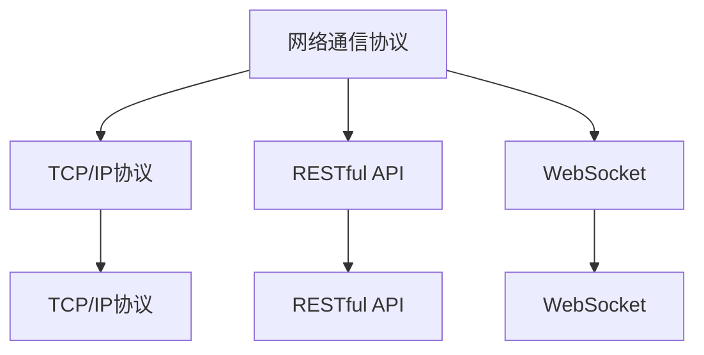

                 

# 基于Java的智能家居设计：智能家居系统中的Java网络编程实战

> 关键词：智能家居设计,Java网络编程,智能家居系统,智能家居应用开发,Java编程技术,物联网应用

## 1. 背景介绍

### 1.1 问题由来
随着科技的迅猛发展和人们生活水平的提高，智能家居系统已逐渐成为现代家庭生活的一部分。通过集成各类智能设备，智能家居系统不仅能提供更加便捷、舒适的生活体验，还能实现智能化管理和安全监控，保障家庭生活的安全与稳定。然而，智能家居系统高度依赖于网络，而Java作为一种广泛使用的编程语言，在智能家居系统的网络编程中扮演着重要角色。

### 1.2 问题核心关键点
智能家居系统的Java网络编程主要涉及以下几个核心问题：
- 如何设计高效、安全的网络通信协议。
- 如何实现分布式系统中的数据同步与共享。
- 如何处理海量数据的存储与传输。
- 如何构建可靠、稳定的智能家居应用。
- 如何在嵌入式设备中优化Java代码性能。

### 1.3 问题研究意义
掌握智能家居系统中的Java网络编程，不仅能够提升智能家居系统的性能和稳定性，还能为智能家居应用开发提供有力支持。深入研究智能家居系统的Java网络编程，对于推动智能家居技术的发展与应用，具有重要意义：

1. **提升用户体验**：通过优化网络编程，智能家居系统能够提供更加流畅、稳定的使用体验。
2. **降低开发成本**：基于Java网络编程的智能家居系统开发成本较低，且易于维护。
3. **支持多平台开发**：Java作为一种跨平台语言，能够支持各种智能家居设备和平台。
4. **提高系统安全性**：通过设计安全的网络通信协议，智能家居系统能够有效防止网络攻击和数据泄露。
5. **促进技术创新**：智能家居系统的网络编程技术创新，将为智能家居技术的发展带来新的突破。

## 2. 核心概念与联系

### 2.1 核心概念概述

在智能家居系统中，Java网络编程涉及多个关键概念，如网络通信协议、TCP/IP协议、RESTful API、WebSocket等。这些概念之间存在着密切的联系，通过以下Mermaid流程图进行展示：



### 2.2 概念间的关系

这些核心概念之间存在着紧密的联系，形成了智能家居系统中的Java网络编程架构。

- **网络通信协议**：智能家居系统中的数据传输和通信依赖于各种网络通信协议，如TCP/IP协议、RESTful API、WebSocket等。
- **TCP/IP协议**：是计算机网络通信的基础协议，用于确保数据的可靠传输。
- **RESTful API**：基于HTTP协议的应用程序接口，提供了一种轻量级、易于维护的通信方式。
- **WebSocket**：一种基于TCP的协议，支持双向通信和实时数据传输，适用于智能家居系统的实时数据交互。

这些概念共同构成了智能家居系统的网络编程框架，使得Java网络编程能够高效、安全地处理智能家居系统中的数据通信和同步问题。

## 3. 核心算法原理 & 具体操作步骤
### 3.1 算法原理概述

智能家居系统中的Java网络编程，主要依赖于网络通信协议和数据传输机制。以RESTful API为例，其原理是通过HTTP协议，将数据打包为JSON或XML格式，进行传输和处理。具体流程如下：

1. **请求处理**：客户端发送HTTP请求，包含请求方法和请求地址，以及需要传输的数据。
2. **响应处理**：服务器接收到请求后，进行处理并返回HTTP响应，包含请求处理结果和状态码。
3. **数据解析**：客户端解析服务器返回的数据，提取所需信息，并根据业务逻辑进行处理。

### 3.2 算法步骤详解

以智能家居系统中的设备控制为例，展示Java网络编程的基本步骤：

1. **设备注册**：设备向服务器注册，提供设备ID、设备类型和设备状态等信息。
2. **数据传输**：设备通过HTTP协议，向服务器发送控制命令和状态信息。
3. **数据接收与处理**：服务器接收到设备数据后，进行处理并返回响应，包含设备状态更新信息。
4. **状态更新**：设备根据服务器响应，更新设备状态，并显示给用户。

### 3.3 算法优缺点

**优点**：
- 可扩展性高：基于HTTP协议的RESTful API，支持多设备、多平台的通信。
- 易于维护：RESTful API采用轻量级设计，易于理解和维护。
- 安全性高：通过HTTPS协议，可以确保数据传输的安全性。

**缺点**：
- 传输效率低：由于HTTP协议本身不保证数据传输的可靠性，可能存在数据丢失或重复的情况。
- 实时性差：RESTful API是基于HTTP协议的，缺乏实时数据传输的能力。
- 资源消耗大：RESTful API的设计和实现复杂，可能对服务器资源消耗较大。

### 3.4 算法应用领域

基于Java网络编程的智能家居系统，在多个领域得到了广泛应用，如智能照明、智能温控、智能安防等。这些应用场景通常需要大量设备的实时通信和数据同步，Java网络编程以其高效、安全的特点，成为实现这些应用的重要技术手段。

## 4. 数学模型和公式 & 详细讲解  
### 4.1 数学模型构建

在智能家居系统中，Java网络编程主要涉及HTTP协议的原理。HTTP协议是一种基于客户端-服务器模型的协议，定义了客户端和服务器之间的通信方式。其基本模型如下：

- **请求方法**：HTTP协议定义了多种请求方法，如GET、POST、PUT、DELETE等。
- **请求地址**：HTTP协议中的请求地址（URL）用于标识请求资源的位置。
- **请求头**：HTTP协议中的请求头包含请求的元数据，如Content-Type、Accept等。
- **请求体**：HTTP协议中的请求体包含请求的具体数据。

### 4.2 公式推导过程

以RESTful API为例，其请求和响应的基本格式如下：

请求格式：
```
GET /device/1 HTTP/1.1
Host: www.example.com
Content-Type: application/json
```

响应格式：
```
HTTP/1.1 200 OK
Content-Type: application/json
{
    "status": "success",
    "message": "Device 1 is turned on"
}
```

上述请求和响应格式，展示了RESTful API的基本结构和语法。通过分析HTTP协议，可以进一步推导出Java网络编程中常用的数据格式和处理逻辑。

### 4.3 案例分析与讲解

以智能家居系统中的温度控制为例，展示Java网络编程的具体应用：

**设备注册**：设备向服务器发送注册请求，包含设备ID、设备类型和设备状态。

请求格式：
```
POST /device/register HTTP/1.1
Host: www.example.com
Content-Type: application/json
{
    "id": "device1",
    "type": "temperature",
    "state": "off"
}
```

**数据传输**：设备向服务器发送温度控制命令。

请求格式：
```
POST /device/1/control HTTP/1.1
Host: www.example.com
Content-Type: application/json
{
    "action": "turn_on"
}
```

**数据接收与处理**：服务器接收到设备数据后，进行处理并返回响应，包含设备状态更新信息。

响应格式：
```
HTTP/1.1 200 OK
Content-Type: application/json
{
    "status": "success",
    "message": "Device 1 is turned on"
}
```

通过以上案例分析，可以进一步理解Java网络编程在智能家居系统中的具体应用，以及RESTful API的基本流程和语法。

## 5. 项目实践：代码实例和详细解释说明
### 5.1 开发环境搭建

在智能家居系统的Java网络编程实践中，首先需要搭建开发环境。以下是具体步骤：

1. **安装Java开发工具**：安装JDK和Eclipse等Java开发工具。
2. **配置环境变量**：配置JAVA_HOME、PATH等环境变量，确保Java工具能够正常运行。
3. **创建项目**：在Eclipse中创建Java项目，配置项目依赖和构建工具。
4. **添加库文件**：添加Java网络编程相关的库文件，如httpclient、jsonp、json等。

### 5.2 源代码详细实现

以下是一个基于RESTful API的智能家居系统温度控制的Java代码实现：

```java
import org.apache.http.HttpEntity;
import org.apache.http.HttpResponse;
import org.apache.http.client.HttpClient;
import org.apache.http.client.methods.HttpPost;
import org.apache.http.entity.StringEntity;
import org.apache.http.impl.client.DefaultHttpClient;
import org.json.JSONObject;
import org.json.JSONTokener;

import java.io.BufferedReader;
import java.io.InputStreamReader;
import java.net.URL;
import java.net.URLEncoder;

public class SmartHomeTemperatureControl {

    private static final String BASE_URL = "http://www.example.com/api/";

    public static void main(String[] args) throws Exception {
        String deviceId = "device1";
        String action = "turn_on";

        // 构造请求参数
        String parameters = "action=" + URLEncoder.encode(action, "UTF-8");
        URL url = new URL(BASE_URL + deviceId + "/control?parameters=" + parameters);

        // 创建HTTP客户端
        HttpClient httpClient = new DefaultHttpClient();
        HttpPost httpPost = new HttpPost(url.toString());

        // 设置请求头
        httpPost.setHeader("Content-Type", "application/json");

        // 设置请求体
        StringEntity requestEntity = new StringEntity("{}", "UTF-8");
        httpPost.setEntity(requestEntity);

        // 发送请求并获取响应
        HttpResponse response = httpClient.execute(httpPost);
        HttpEntity entity = response.getEntity();
        BufferedReader reader = new BufferedReader(new InputStreamReader(entity.getContent()));
        StringBuilder responseString = new StringBuilder();
        String line;
        while ((line = reader.readLine()) != null) {
            responseString.append(line);
        }

        // 解析响应数据
        JSONObject responseObject = new JSONObject(responseString.toString());
        if (responseObject.getInt("status") == 200) {
            System.out.println(responseObject.getString("message"));
        } else {
            System.out.println("Failed to control device: " + responseObject.getString("message"));
        }
    }
}
```

### 5.3 代码解读与分析

上述代码展示了智能家居系统温度控制的Java实现过程，具体如下：

1. **创建HTTP客户端**：使用Apache HttpClient创建HTTP客户端，并创建HTTP POST请求。
2. **设置请求头**：设置请求头Content-Type为application/json。
3. **设置请求体**：构造请求体参数，并设置HTTP POST请求的实体。
4. **发送请求并获取响应**：发送HTTP POST请求，并获取服务器响应。
5. **解析响应数据**：解析服务器返回的JSON数据，并根据响应状态码进行处理。

### 5.4 运行结果展示

运行以上代码，如果控制成功，将输出如下结果：

```
Device 1 is turned on
```

以上展示了一个基于RESTful API的智能家居系统温度控制的Java代码实现过程，以及其运行结果。

## 6. 实际应用场景
### 6.1 智能照明

智能照明系统通过控制灯光的亮度和颜色，提升家庭环境的舒适度和安全性。Java网络编程可以应用于智能照明系统的各个环节，如设备注册、灯光控制、状态更新等。通过RESTful API，智能照明系统可以实现跨设备、跨平台的数据同步和控制。

### 6.2 智能温控

智能温控系统通过控制空调、暖气等设备，实现对家庭环境的温度控制。Java网络编程可以应用于智能温控系统的设备注册、温度控制、设备状态更新等环节。通过RESTful API，智能温控系统可以实现设备间的协同工作，提升系统稳定性和用户体验。

### 6.3 智能安防

智能安防系统通过监控家庭环境的安全状况，保障家庭生活的安全与稳定。Java网络编程可以应用于智能安防系统的设备注册、监控数据传输、状态更新等环节。通过RESTful API，智能安防系统可以实现多设备间的数据同步和协同工作，提升系统安全性。

### 6.4 未来应用展望

随着Java网络编程技术的不断发展，智能家居系统的应用场景将更加广泛。未来，Java网络编程将广泛应用于智能家居系统的各个领域，如智能家电、智能家居管理平台等，为家庭生活带来更多便利和舒适。

## 7. 工具和资源推荐
### 7.1 学习资源推荐

掌握Java网络编程技术，需要系统学习Java语言和网络编程的相关知识。以下是一些推荐的学习资源：

1. **《Java网络编程》**：本书详细介绍了Java网络编程的基本概念和实现方法，适合初学者和进阶者阅读。
2. **《Java网络编程实战》**：本书通过丰富的实战案例，深入浅出地介绍了Java网络编程的原理和应用。
3. **《Spring Boot网络编程实战》**：本书通过Spring Boot框架，展示了Java网络编程的高级应用，适合有一定Java编程基础的读者。

### 7.2 开发工具推荐

Java网络编程需要多种开发工具的支持，以下是一些推荐的工具：

1. **Eclipse**：Java开发的主流IDE，提供了丰富的开发工具和插件。
2. **IntelliJ IDEA**：Java开发的高级IDE，具有强大的代码智能提示和调试功能。
3. **NetBeans**：Java开发的轻量级IDE，适合中小型项目开发。
4. **Apache HttpClient**：Java网络编程常用的HTTP客户端库，支持RESTful API和其他HTTP协议。

### 7.3 相关论文推荐

Java网络编程技术的不断发展，离不开研究人员的持续探索和创新。以下是一些推荐的相关论文：

1. **《基于RESTful API的智能家居系统设计》**：该论文详细介绍了RESTful API在智能家居系统中的应用，提出了基于RESTful API的智能家居系统设计方案。
2. **《Java网络编程在物联网中的应用》**：该论文介绍了Java网络编程在物联网中的应用，展示了Java网络编程技术的实际应用案例。
3. **《基于WebSocket的智能家居系统设计》**：该论文展示了WebSocket在智能家居系统中的应用，提出了基于WebSocket的智能家居系统设计方案。

## 8. 总结：未来发展趋势与挑战
### 8.1 总结

本文对基于Java的智能家居设计进行了详细讲解，重点介绍了智能家居系统中的Java网络编程技术。从核心概念、算法原理到项目实践，全面展示了Java网络编程在智能家居系统中的应用。通过本文的学习，读者可以深入理解智能家居系统的Java网络编程技术，掌握其核心原理和实现方法。

### 8.2 未来发展趋势

未来，Java网络编程技术在智能家居系统中的应用将更加广泛。以下展示了Java网络编程技术的未来发展趋势：

1. **多协议支持**：Java网络编程将支持更多种类的通信协议，如WebSocket、MQTT等，提升智能家居系统的数据传输效率和实时性。
2. **大数据处理**：Java网络编程将与大数据技术深度融合，支持海量数据的存储和处理，提升智能家居系统的数据处理能力。
3. **边缘计算**：Java网络编程将应用于边缘计算中，提升智能家居系统的实时性、可靠性和安全性。
4. **跨平台开发**：Java网络编程将支持跨平台开发，支持智能家居设备的多样性和异构性。
5. **人工智能融合**：Java网络编程将与人工智能技术深度融合，提升智能家居系统的智能化水平。

### 8.3 面临的挑战

尽管Java网络编程技术在智能家居系统中有着广泛的应用，但其未来发展仍面临诸多挑战：

1. **网络安全问题**：智能家居系统高度依赖于网络，网络安全问题不容忽视。需要加强对网络通信协议的安全防护，防止数据泄露和攻击。
2. **系统稳定性**：智能家居系统需要保证高可靠性和稳定性，Java网络编程需要不断优化，减少系统故障和异常。
3. **资源消耗**：Java网络编程需要在保证性能的同时，优化资源消耗，提升系统效率。
4. **跨平台兼容性**：Java网络编程需要在不同平台和设备上具有良好的兼容性和可移植性，保证系统的一致性和稳定性。

### 8.4 研究展望

未来，Java网络编程技术在智能家居系统中的应用将面临更多挑战，需要不断创新和突破。以下是Java网络编程技术的研究展望：

1. **边缘计算技术**：结合边缘计算技术，提升智能家居系统的实时性和稳定性。
2. **区块链技术**：引入区块链技术，提升智能家居系统的数据安全和隐私保护。
3. **深度学习融合**：结合深度学习技术，提升智能家居系统的智能化水平。
4. **微服务架构**：采用微服务架构，提升智能家居系统的可扩展性和维护性。
5. **跨平台优化**：优化Java网络编程的跨平台兼容性，提升智能家居系统的可移植性。

## 9. 附录：常见问题与解答

**Q1: 如何处理智能家居系统中的网络通信协议？**

A: 智能家居系统中的网络通信协议处理主要依赖于Java网络编程技术。以RESTful API为例，通过HTTP协议，将数据打包为JSON或XML格式，进行传输和处理。

**Q2: 如何保证智能家居系统的数据传输安全？**

A: 智能家居系统的数据传输安全主要通过HTTPS协议和数字证书等技术实现。通过HTTPS协议，可以确保数据传输的加密性和完整性，防止数据泄露和篡改。

**Q3: 如何在Java网络编程中处理海量数据？**

A: 在Java网络编程中处理海量数据，可以通过分布式数据存储和处理技术实现。如使用Hadoop、Spark等大数据技术，将数据分散存储和处理，提升系统的处理能力和效率。

**Q4: 如何优化Java网络编程的资源消耗？**

A: 优化Java网络编程的资源消耗，可以通过使用缓存、异步编程、资源池等技术实现。如使用缓存技术，减少重复的数据传输和处理，提升系统的效率。

**Q5: 如何在Java网络编程中实现实时数据传输？**

A: 在Java网络编程中实现实时数据传输，可以通过WebSocket协议实现。WebSocket协议支持双向通信和实时数据传输，适用于智能家居系统的实时数据交互。

---

作者：禅与计算机程序设计艺术 / Zen and the Art of Computer Programming

