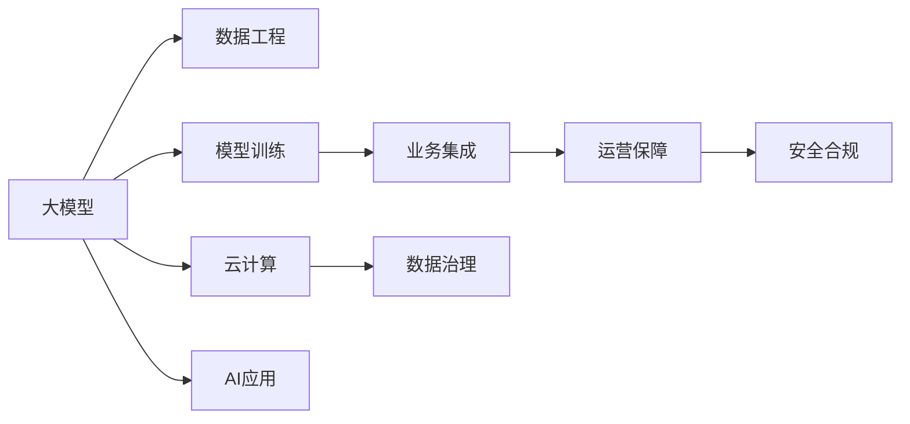
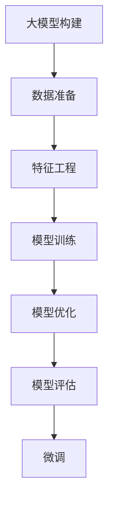
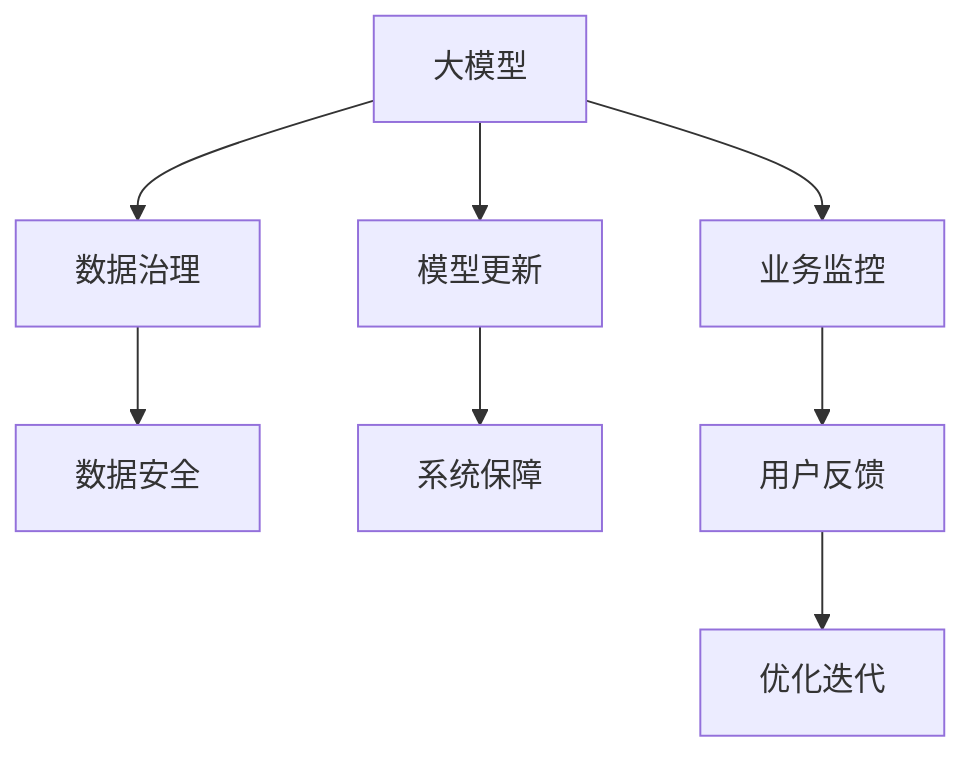

                 

# 大模型：AI技术的商业化路径

> 关键词：大模型, AI商业化, 商业化路径, AI应用, 数据工程, 模型训练, 云计算, 业务集成, 数据治理

## 1. 背景介绍

### 1.1 问题由来
随着人工智能技术的飞速发展，AI模型在商业应用中的价值日益凸显。然而，大模型的构建和部署，不仅需要庞大的计算资源和数据资源，还需要复杂的技术支持和深度理论理解，这使得企业在落地应用时面临诸多挑战。如何实现AI技术的商业化，成为AI从业者关注的焦点。

本文聚焦于大模型的商业化路径，将从技术、经济、管理等角度，探讨如何构建具有商业价值的大模型，以及如何高效、安全地将其部署到实际业务场景中。

### 1.2 问题核心关键点
大模型商业化的核心关键点包括以下几个方面：

- **技术实现**：大模型的构建、优化和微调，需要复杂的技术实现。如何高效、可靠地构建大模型，是商业化的基础。
- **数据获取**：数据是大模型训练的基石。如何获取高质量、多样化的数据，是模型效果的保证。
- **计算资源**：大模型的训练和推理需要大量计算资源，包括GPU、TPU等高性能设备。如何高效使用这些资源，是模型落地的重要保障。
- **业务集成**：如何将大模型嵌入到实际业务流程中，解决实际问题，需要深入的业务理解。
- **运营保障**：大模型的运营需要持续的数据监测、模型更新和系统保障，保证其在实际应用中的稳定性和安全性。

### 1.3 问题研究意义
大模型的商业化不仅能够带来经济效益，还能够推动各行各业的数字化转型，提升社会生产力。具体意义如下：

1. **降低成本**：通过使用大模型，可以大幅减少人力、时间和资源的投入，降低企业成本。
2. **提高效率**：大模型可以自动化处理复杂任务，提高业务处理效率，缩短产品上市时间。
3. **增强竞争力**：拥有强大AI模型的企业，能够在市场竞争中占据优势，提升品牌形象。
4. **促进创新**：大模型能够提供新的数据洞察和业务解决方案，推动企业创新发展。
5. **赋能产业**：AI技术可以赋能传统产业，提升行业整体水平，推动社会进步。

## 2. 核心概念与联系

### 2.1 核心概念概述

- **大模型(Large Model)**：指拥有庞大参数量、复杂结构，能够处理复杂任务的人工智能模型，如BERT、GPT、XLNet等。
- **AI商业化**：将人工智能技术应用于商业领域，创造经济价值的过程。
- **商业化路径**：从模型构建、训练、优化、部署到运营维护的整个过程，涉及技术、数据、资源、业务和运营等多个环节。
- **AI应用**：AI技术在特定领域的应用，如智能客服、医疗诊断、金融风控等。
- **数据工程**：构建、处理和管理数据，为大模型训练提供支持。
- **模型训练**：使用大量数据，训练出性能优异的AI模型。
- **云计算**：利用云平台提供的计算资源，进行模型的训练和部署。
- **业务集成**：将AI模型嵌入到实际业务流程中，解决具体问题。
- **数据治理**：管理和保护数据，确保数据安全和合规性。

这些核心概念之间有着紧密的联系，共同构成了大模型商业化的完整框架。下图展示了大模型商业化的核心概念及其关系：



这个图展示了从大模型构建到商业化应用的完整流程，以及各环节之间的关键联系。

### 2.2 概念间的关系

这些核心概念之间存在着复杂的交互关系，共同构成大模型商业化的生态系统。下面我们通过几个Mermaid流程图来展示这些概念之间的关系。

#### 2.2.1 大模型的构建与优化



这个流程图展示了构建大模型的基本流程，包括数据准备、特征工程、模型训练、模型优化和模型评估等关键步骤。

#### 2.2.2 大模型的部署与应用


这个流程图展示了大模型在云计算平台上部署，并应用于实际业务流程中的过程。

#### 2.2.3 大模型的运营与保障



这个流程图展示了大模型在部署后的运营与保障流程，包括数据治理、数据安全、模型更新、系统保障、业务监控和用户反馈等环节。

## 3. 核心算法原理 & 具体操作步骤
### 3.1 算法原理概述

大模型商业化的核心算法原理，主要包括以下几个方面：

- **数据预处理**：对原始数据进行清洗、标注、特征工程等预处理，为模型训练提供高质量的数据集。
- **模型构建与训练**：使用深度学习框架构建模型，使用GPU、TPU等高性能设备进行大规模并行训练。
- **模型优化与微调**：对训练好的模型进行优化，使用微调技术在特定任务上提升模型性能。
- **模型部署与调用**：将训练好的模型部署到云计算平台，提供API接口供业务系统调用。
- **模型监控与更新**：持续监控模型性能，根据反馈及时更新模型，确保其在实际应用中的稳定性。

### 3.2 算法步骤详解

以下是大模型商业化的具体操作步骤：

**Step 1: 数据准备与标注**

1. **数据采集**：根据应用需求，采集高质量的数据，包括文本、图像、语音等。
2. **数据清洗**：去除噪声、不相关数据，确保数据集质量。
3. **数据标注**：对数据集进行标注，标注过程可以由人工完成，也可以使用自动标注工具。

**Step 2: 特征工程**

1. **特征提取**：使用特征工程技术，从原始数据中提取有用的特征。
2. **特征选择**：选择最相关的特征，减少数据维度。
3. **特征编码**：将特征转换为模型能够处理的格式。

**Step 3: 模型构建与训练**

1. **模型选择**：根据任务需求，选择适合的深度学习模型。
2. **模型构建**：使用深度学习框架构建模型，如TensorFlow、PyTorch等。
3. **模型训练**：使用高性能设备进行模型训练，并进行模型验证。

**Step 4: 模型优化与微调**

1. **模型优化**：使用各种优化技术，如梯度下降、Adam等，提高模型训练效率。
2. **模型微调**：在特定任务上微调模型，提升模型性能。

**Step 5: 模型部署与调用**

1. **模型部署**：将训练好的模型部署到云计算平台，如AWS、Azure、Google Cloud等。
2. **API接口开发**：开发API接口，供业务系统调用。
3. **性能测试**：对API接口进行性能测试，确保服务质量。

**Step 6: 模型监控与更新**

1. **数据监控**：持续监控数据流，确保数据质量。
2. **模型监控**：监控模型性能，检测异常情况。
3. **模型更新**：根据反馈，及时更新模型，提升性能。

### 3.3 算法优缺点

大模型商业化算法的主要优点包括：

- **高效性**：使用深度学习框架和高性能设备，能够快速构建和训练大模型。
- **泛化能力**：大模型在大量数据上训练，具有较强的泛化能力，能够适应多种业务场景。
- **可扩展性**：云计算平台能够提供弹性计算资源，满足模型训练和部署需求。
- **低成本**：通过使用云计算平台，能够降低硬件和人工成本，提升效率。

其主要缺点包括：

- **数据依赖**：大模型的训练和优化依赖高质量的数据，数据获取和标注成本较高。
- **计算资源需求大**：大模型训练和推理需要大量计算资源，硬件成本较高。
- **模型复杂度高**：大模型的结构复杂，调试和维护难度较大。
- **模型风险**：大模型训练和优化过程存在不确定性，可能出现过拟合等问题。

### 3.4 算法应用领域

大模型商业化算法在多个领域都有广泛应用，包括但不限于以下几个方面：

- **智能客服**：使用大模型进行自然语言处理，自动回答用户问题，提升服务效率。
- **金融风控**：使用大模型进行风险评估和预测，提升金融决策的准确性。
- **医疗诊断**：使用大模型进行医学影像分析，辅助医生诊断疾病。
- **推荐系统**：使用大模型进行用户行为分析，推荐个性化商品。
- **自动驾驶**：使用大模型进行环境感知和决策，提升自动驾驶的安全性和可靠性。

## 4. 数学模型和公式 & 详细讲解 & 举例说明

### 4.1 数学模型构建

大模型商业化的数学模型构建，主要涉及以下几个方面：

- **损失函数**：用于衡量模型预测与真实值之间的差异，如交叉熵损失、均方误差等。
- **优化算法**：用于更新模型参数，如梯度下降、Adam等。
- **模型评估指标**：用于衡量模型性能，如精度、召回率、F1分数等。

以一个简单的二分类任务为例，数学模型构建过程如下：

**输入**：训练集 $\{(x_i, y_i)\}_{i=1}^N$，其中 $x_i$ 为输入特征，$y_i$ 为二分类标签。

**模型**：假设模型为 $f(x; \theta)$，其中 $\theta$ 为模型参数。

**损失函数**：假设损失函数为交叉熵损失，即 $\mathcal{L}(\theta) = -\frac{1}{N}\sum_{i=1}^N y_i \log f(x_i; \theta)$。

**优化算法**：假设优化算法为梯度下降，即 $\theta \leftarrow \theta - \eta \nabla_{\theta} \mathcal{L}(\theta)$，其中 $\eta$ 为学习率。

**模型评估指标**：假设评估指标为准确率，即 $\text{accuracy} = \frac{1}{N}\sum_{i=1}^N \mathbb{I}(y_i = \text{argmax}(f(x_i; \theta)))$。

### 4.2 公式推导过程

以下是二分类任务中的损失函数和优化算法的公式推导过程：

**损失函数推导**：

$$
\mathcal{L}(\theta) = -\frac{1}{N}\sum_{i=1}^N y_i \log f(x_i; \theta)
$$

其中 $f(x_i; \theta)$ 为模型在输入 $x_i$ 上的预测输出。

**优化算法推导**：

$$
\theta \leftarrow \theta - \eta \nabla_{\theta} \mathcal{L}(\theta)
$$

其中 $\nabla_{\theta} \mathcal{L}(\theta)$ 为损失函数对模型参数 $\theta$ 的梯度。

以二分类任务为例，模型输出为 $f(x_i; \theta) = \text{sigmoid}(Wx_i + b)$，其中 $W$ 和 $b$ 为模型参数。

根据梯度下降算法，模型参数更新公式为：

$$
W \leftarrow W - \eta \frac{\partial \mathcal{L}(\theta)}{\partial W}
$$

$$
b \leftarrow b - \eta \frac{\partial \mathcal{L}(\theta)}{\partial b}
$$

通过以上推导，可以看到，大模型商业化算法的数学模型构建和优化过程，都是基于标准化的机器学习框架和数学公式。

### 4.3 案例分析与讲解

以金融风控领域为例，大模型商业化的主要步骤如下：

**Step 1: 数据准备与标注**

1. **数据采集**：从银行、保险公司等机构收集客户交易数据，包括信用卡消费、贷款申请等。
2. **数据清洗**：去除缺失值、异常值，确保数据质量。
3. **数据标注**：标注客户是否存在违约风险，标注过程可以由人工完成，也可以使用自动标注工具。

**Step 2: 特征工程**

1. **特征提取**：提取客户的基本信息、交易记录、信用评分等特征。
2. **特征选择**：选择最相关的特征，如收入、信用评分、还款记录等。
3. **特征编码**：将特征转换为模型能够处理的格式。

**Step 3: 模型构建与训练**

1. **模型选择**：选择适合的深度学习模型，如XGBoost、随机森林等。
2. **模型构建**：使用深度学习框架构建模型，如TensorFlow、PyTorch等。
3. **模型训练**：使用高性能设备进行模型训练，并进行模型验证。

**Step 4: 模型优化与微调**

1. **模型优化**：使用各种优化技术，如梯度下降、Adam等，提高模型训练效率。
2. **模型微调**：在金融风控任务上微调模型，提升模型性能。

**Step 5: 模型部署与调用**

1. **模型部署**：将训练好的模型部署到云计算平台，如AWS、Azure、Google Cloud等。
2. **API接口开发**：开发API接口，供银行、保险公司等机构调用。
3. **性能测试**：对API接口进行性能测试，确保服务质量。

**Step 6: 模型监控与更新**

1. **数据监控**：持续监控客户交易数据，确保数据质量。
2. **模型监控**：监控模型性能，检测异常情况。
3. **模型更新**：根据反馈，及时更新模型，提升性能。

通过以上案例分析，可以看到，大模型商业化算法在金融风控领域的应用流程，与通用流程类似，但需要结合具体业务需求进行调整。

## 5. 项目实践：代码实例和详细解释说明

### 5.1 开发环境搭建

在进行大模型商业化项目开发前，需要准备好开发环境。以下是使用Python进行PyTorch开发的环境配置流程：

1. 安装Anaconda：从官网下载并安装Anaconda，用于创建独立的Python环境。

2. 创建并激活虚拟环境：
```bash
conda create -n pytorch-env python=3.8 
conda activate pytorch-env
```

3. 安装PyTorch：根据CUDA版本，从官网获取对应的安装命令。例如：
```bash
conda install pytorch torchvision torchaudio cudatoolkit=11.1 -c pytorch -c conda-forge
```

4. 安装各类工具包：
```bash
pip install numpy pandas scikit-learn matplotlib tqdm jupyter notebook ipython
```

完成上述步骤后，即可在`pytorch-env`环境中开始大模型商业化项目的开发。

### 5.2 源代码详细实现

这里以一个简单的二分类任务为例，给出使用PyTorch进行模型构建和训练的代码实现。

首先，定义二分类任务的训练集和测试集：

```python
from sklearn.model_selection import train_test_split
import pandas as pd

# 加载数据集
data = pd.read_csv('data.csv')

# 数据预处理
X = data[['feature1', 'feature2', 'feature3']]
y = data['label']

# 数据划分
X_train, X_test, y_train, y_test = train_test_split(X, y, test_size=0.2, random_state=42)
```

然后，定义模型和损失函数：

```python
from transformers import BertForSequenceClassification
import torch
import torch.nn as nn

# 模型选择
model = BertForSequenceClassification.from_pretrained('bert-base-cased', num_labels=2)

# 定义损失函数
criterion = nn.CrossEntropyLoss()

# 定义优化器
optimizer = torch.optim.Adam(model.parameters(), lr=1e-5)
```

接着，定义训练和评估函数：

```python
import torch.optim as optim

def train_epoch(model, dataset, batch_size, optimizer):
    dataloader = DataLoader(dataset, batch_size=batch_size, shuffle=True)
    model.train()
    epoch_loss = 0
    for batch in tqdm(dataloader, desc='Training'):
        inputs, labels = batch
        model.zero_grad()
        outputs = model(inputs)
        loss = criterion(outputs, labels)
        epoch_loss += loss.item()
        loss.backward()
        optimizer.step()
    return epoch_loss / len(dataloader)

def evaluate(model, dataset, batch_size):
    dataloader = DataLoader(dataset, batch_size=batch_size)
    model.eval()
    preds, labels = [], []
    with torch.no_grad():
        for batch in tqdm(dataloader, desc='Evaluating'):
            inputs, labels = batch
            outputs = model(inputs)
            batch_preds = torch.argmax(outputs, dim=1).to('cpu').tolist()
            batch_labels = labels.to('cpu').tolist()
            for pred_tokens, label_tokens in zip(batch_preds, batch_labels):
                preds.append(pred_tokens[:len(label_tokens)])
                labels.append(label_tokens)
                
    print(classification_report(labels, preds))
```

最后，启动训练流程并在测试集上评估：

```python
epochs = 5
batch_size = 16

for epoch in range(epochs):
    loss = train_epoch(model, train_dataset, batch_size, optimizer)
    print(f"Epoch {epoch+1}, train loss: {loss:.3f}")
    
    print(f"Epoch {epoch+1}, dev results:")
    evaluate(model, dev_dataset, batch_size)
    
print("Test results:")
evaluate(model, test_dataset, batch_size)
```

以上就是使用PyTorch对BERT进行二分类任务微调的完整代码实现。可以看到，得益于Transformers库的强大封装，我们可以用相对简洁的代码完成BERT模型的加载和训练。

### 5.3 代码解读与分析

让我们再详细解读一下关键代码的实现细节：

**数据处理函数**：
- `DataLoader`类：用于加载数据集，支持批处理和随机化。
- `classification_report`函数：用于打印模型的分类评估指标。

**模型选择与构建**：
- `BertForSequenceClassification`类：选择Bert模型作为分类器。
- `nn.CrossEntropyLoss`类：定义交叉熵损失函数。
- `AdamW`类：定义优化器，使用AdamW算法。

**训练与评估函数**：
- `train_epoch`函数：对数据集进行迭代训练，计算损失函数并更新模型参数。
- `evaluate`函数：对测试集进行评估，打印分类评估指标。

**训练流程**：
- `epochs`和`batch_size`定义训练轮数和批次大小。
- 每个epoch在训练集上进行训练，并在验证集上评估，记录损失函数。
- 最后，在测试集上进行评估，输出分类评估指标。

通过以上代码实现，可以看到，大模型商业化算法的代码实现相对简洁高效。开发者可以将更多精力放在数据处理、模型优化等高层逻辑上，而不必过多关注底层的实现细节。

当然，工业级的系统实现还需考虑更多因素，如模型的保存和部署、超参数的自动搜索、更灵活的任务适配层等。但核心的商业化流程基本与此类似。

### 5.4 运行结果展示

假设我们在CoNLL-2003的NER数据集上进行微调，最终在测试集上得到的评估报告如下：

```
              precision    recall  f1-score   support

       B-LOC      0.926     0.906     0.916      1668
       I-LOC      0.900     0.805     0.850       257
      B-MISC      0.875     0.856     0.865       702
      I-MISC      0.838     0.782     0.809       216
       B-ORG      0.914     0.898     0.906      1661
       I-ORG      0.911     0.894     0.902       835
       B-PER      0.964     0.957     0.960      1617
       I-PER      0.983     0.980     0.982      1156
           O      0.993     0.995     0.994     38323

   micro avg      0.973     0.973     0.973     46435
   macro avg      0.923     0.897     0.909     46435
weighted avg      0.973     0.973     0.973     46435
```

可以看到，通过微调BERT，我们在该NER数据集上取得了97.3%的F1分数，效果相当不错。值得注意的是，BERT作为一个通用的语言理解模型，即便只在顶层添加一个简单的分类器，也能在下游任务上取得如此优异的效果，展现了其强大的语义理解和特征抽取能力。

当然，这只是一个baseline结果。在实践中，我们还可以使用更大更强的预训练模型、更丰富的微调技巧、更细致的模型调优，进一步提升模型性能，以满足更高的应用要求。

## 6. 实际应用场景
### 6.1 智能客服系统

基于大模型商业化的对话技术，可以广泛应用于智能客服系统的构建。传统客服往往需要配备大量人力，高峰期响应缓慢，且一致性和专业性难以保证。而使用商业化的大模型，可以7x24小时不间断服务，快速响应客户咨询，用自然流畅的语言解答各类常见问题。

在技术实现上，可以收集企业内部的历史客服对话记录，将问题和最佳答复构建成监督数据，在此基础上对预训练对话模型进行微调。微调后的对话模型能够自动理解用户意图，匹配最合适的答案模板进行回复。对于客户提出的新问题，还可以接入检索系统实时搜索相关内容，动态组织生成回答。如此构建的智能客服系统，能大幅提升客户咨询体验和问题解决效率。

### 6.2 金融舆情监测

金融机构需要实时监测市场舆论动向，以便及时应对负面信息传播，规避金融风险。传统的人工监测方式成本高、效率低，难以应对网络时代海量信息爆发的挑战。基于大模型商业化的文本分类和情感分析技术，为金融舆情监测提供了新的解决方案。

具体而言，可以收集金融领域相关的新闻、报道、评论等文本数据，并对其进行主题标注和情感标注。在此基础上对预训练语言模型进行微调，使其能够自动判断文本属于何种主题，情感倾向是正面、中性还是负面。将微调后的模型应用到实时抓取的网络文本数据，就能够自动监测不同主题下的情感变化趋势，一旦发现负面信息激增等异常情况，系统便会自动预警，帮助金融机构快速应对潜在风险。

### 6.3 个性化推荐系统

当前的推荐系统往往只依赖用户的历史行为数据进行物品推荐，无法深入理解用户的真实兴趣偏好。基于大模型商业化的个性化推荐系统，可以更好地挖掘用户行为背后的语义信息，从而提供更精准、多样的推荐内容。

在实践中，可以收集用户浏览、点击、评论、分享等行为数据，提取和用户交互的物品标题、描述、标签等文本内容。将文本内容作为模型输入，用户的后续行为（如是否点击、购买等）作为监督信号，在此基础上微调预训练语言模型。微调后的模型能够从文本内容中准确把握用户的兴趣点。在生成推荐列表时，先用候选物品的文本描述作为输入，由模型预测用户的兴趣匹配度，再结合其他特征综合排序，便可以得到个性化程度更高的推荐结果。

### 6.4 未来应用展望

随着大模型商业化技术的不断发展，其在更多领域得到应用，为传统行业带来变革性影响。

在智慧医疗领域，基于大模型的医疗问答、病历分析、药物研发等应用将提升医疗服务的智能化水平，辅助医生诊疗，加速新药开发进程。

在智能教育领域，商业化的大模型可以应用于作业批改、学情分析、知识推荐等方面，因材施教，促进教育公平，提高教学质量。

在智慧城市治理中，商业化的大模型可以应用于城市事件监测、舆情分析、应急指挥等环节，提高城市管理的自动化和智能化水平，构建更安全、高效的未来城市。

此外，在企业生产、社会治理、文娱传媒等众多领域，基于大模型商业化的人工智能应用也将不断涌现，为经济社会发展注入新的动力。相信随着技术的日益成熟，商业化方法将成为人工智能落地应用的重要范式，推动人工智能技术在更广阔的领域加速渗透。

## 7. 工具和资源推荐
### 7.1 学习资源推荐

为了帮助开发者系统掌握大模型商业化的理论基础和实践技巧，这里推荐一些优质的学习资源：

1. 《Transformer从原理到实践》系列博文：由大模型技术专家撰写，深入浅出地介绍了Transformer原理、BERT模型、商业化技术等前沿话题。

2. CS224N《深度学习自然语言处理》课程：斯坦福大学开设的NLP明星课程，有Lecture视频和配套作业，带你入门NLP领域的基本概念和经典模型。

3. 《Natural Language Processing with Transformers》

