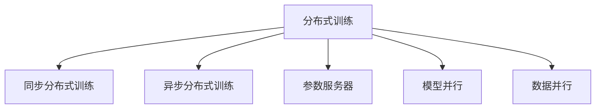
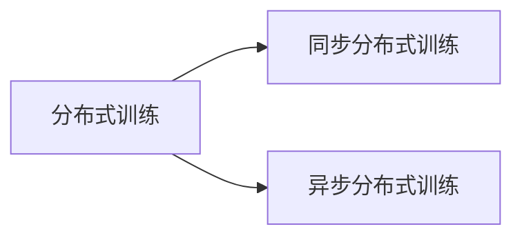
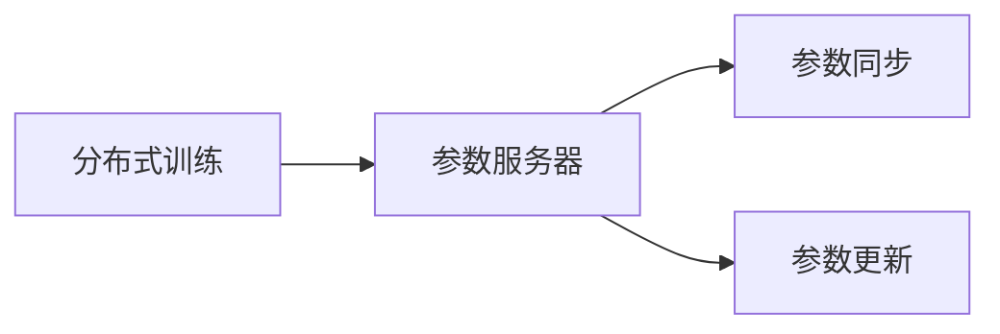
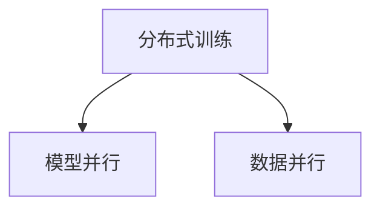

                 

# 大规模语言模型从理论到实践：LLaMA分布式训练实践

## 1. 背景介绍

### 1.1 问题由来

近年来，随着深度学习技术的快速发展，大规模语言模型（LLaMA）在自然语言处理（NLP）领域取得了巨大的突破。这些模型通过在海量无标签文本数据上进行预训练，学习到了丰富的语言知识和常识，具备强大的语言理解和生成能力。然而，由于预训练数据量巨大，模型规模也随之扩大到数十亿参数，这使得模型的训练和推理变得更加复杂和昂贵。分布式训练（Distributed Training）技术成为大规模语言模型落地的关键。

### 1.2 问题核心关键点

分布式训练是一种将大规模机器学习模型划分为多个子模型，在多个计算节点上并行计算的技术。它能够显著加速模型训练，降低计算成本，并提高模型的训练稳定性和泛化性能。分布式训练在深度学习中得到了广泛应用，尤其是在训练大规模神经网络模型时。

分布式训练的核心在于将一个大模型拆分成多个子模型，每个子模型独立训练，并通过参数同步和通信协议来协调各个子模型的训练过程。常用的分布式训练算法包括同步分布式训练和异步分布式训练，其中同步分布式训练在每个迭代步中更新所有子模型的参数，而异步分布式训练允许子模型独立更新，通过定期同步更新参数。

分布式训练在大规模语言模型中的应用，可以帮助我们快速训练模型，提高模型的泛化性能，同时降低计算成本。然而，由于分布式训练涉及到更多的硬件资源和通信开销，需要解决诸如计算节点协同、参数同步、通信效率等问题。

### 1.3 问题研究意义

分布式训练技术的成功应用，对于拓展大语言模型的应用范围，提升下游任务的性能，加速NLP技术的产业化进程，具有重要意义：

1. 降低应用开发成本。分布式训练可以显著减少从头开发所需的数据、计算和人力等成本投入。
2. 提升模型效果。分布式训练使得通用大模型更好地适应特定任务，在应用场景中取得更优表现。
3. 加速开发进度。standing on the shoulders of giants，分布式训练使得开发者可以更快地完成任务适配，缩短开发周期。
4. 带来技术创新。分布式训练范式促进了对预训练-微调的深入研究，催生了更多分布式优化算法和计算方法。
5. 赋能产业升级。分布式训练使得NLP技术更容易被各行各业所采用，为传统行业数字化转型升级提供新的技术路径。

## 2. 核心概念与联系

### 2.1 核心概念概述

为更好地理解分布式训练在大语言模型中的应用，本节将介绍几个密切相关的核心概念：

- 分布式训练（Distributed Training）：一种将大规模机器学习模型划分为多个子模型，在多个计算节点上并行计算的技术。它能够显著加速模型训练，降低计算成本，并提高模型的训练稳定性和泛化性能。

- 同步分布式训练（Synchronous Distributed Training）：在每个迭代步中更新所有子模型的参数，需要同步等待所有节点完成计算。

- 异步分布式训练（Asynchronous Distributed Training）：允许子模型独立更新，通过定期同步更新参数，能够提高训练效率，但需要解决参数一致性和同步问题。

- 参数服务器（Parameter Server）：分布式训练中的中央协调器，负责参数的同步和更新。

- 模型并行（Model Parallelism）：将模型划分为多个子模型，每个子模型在不同的计算节点上独立训练。

- 数据并行（Data Parallelism）：将训练数据划分为多个子集，每个子集在独立的计算节点上并行训练。

这些核心概念之间的逻辑关系可以通过以下Mermaid流程图来展示：

这个流程图展示了大规模语言模型分布式训练的关键概念及其之间的关系：

1. 分布式训练是将大模型拆分为多个子模型，在多个节点上并行计算的技术。
2. 同步分布式训练和异步分布式训练是两种具体的分布式训练策略。
3. 参数服务器是分布式训练中的中央协调器，负责参数的同步和更新。
4. 模型并行和数据并行是分布式训练中常用的两种方式，用于提升计算效率。

这些核心概念共同构成了大规模语言模型分布式训练的完整生态系统，使其能够在各种场景下发挥强大的语言理解和生成能力。通过理解这些核心概念，我们可以更好地把握分布式训练在大语言模型中的应用。

### 2.2 概念间的关系

这些核心概念之间存在着紧密的联系，形成了大规模语言模型分布式训练的完整生态系统。下面我们通过几个Mermaid流程图来展示这些概念之间的关系。

#### 2.2.1 分布式训练与同步分布式训练

这个流程图展示了分布式训练和同步分布式训练之间的关系。同步分布式训练是分布式训练的一种具体实现方式，而异步分布式训练是另一种具体的实现方式。

#### 2.2.2 参数服务器与分布式训练

这个流程图展示了参数服务器在分布式训练中的作用。参数服务器是分布式训练中的中央协调器，负责参数的同步和更新。

#### 2.2.3 模型并行与数据并行

这个流程图展示了模型并行和数据并行这两种分布式训练方式。模型并行是将模型划分为多个子模型，每个子模型在不同的计算节点上独立训练。而数据并行是将训练数据划分为多个子集，每个子集在独立的计算节点上并行训练。

### 2.3 核心概念的整体架构

最后，我们用一个综合的流程图来展示这些核心概念在大规模语言模型分布式训练过程中的整体架构：

```mermaid
graph TB
    A[大规模文本数据] --> B[预训练]
    B --> C[大语言模型]
    C --> D[分布式训练]
    D --> E[同步分布式训练]
    D --> F[异步分布式训练]
    E --> G[参数服务器]
    E --> H[模型并行]
    F --> I[参数服务器]
    F --> J[异步参数更新]
    H --> K[数据并行]
    I --> L[模型并行]
    L --> M[计算节点]
    M --> N[数据并行]
    N --> O[模型并行]
    O --> P[计算节点]
    P --> Q[数据并行]
    Q --> R[模型并行]
    R --> S[计算节点]
    S --> T[数据并行]
    T --> U[模型并行]
    U --> V[计算节点]
    V --> W[数据并行]
    W --> X[模型并行]
    X --> Y[计算节点]
    Y --> Z[数据并行]
    Z --> AA[模型并行]
    AA --> BB[计算节点]
    BB --> CC[数据并行]
    CC --> DD[模型并行]
    DD --> EE[计算节点]
    EE --> FF[数据并行]
    FF --> GG[模型并行]
    GG --> HH[计算节点]
    HH --> II[数据并行]
    II --> JJ[模型并行]
    JJ --> KK[计算节点]
    KK --> LL[数据并行]
    LL --> MM[模型并行]
    MM --> NN[计算节点]
    NN --> OO[数据并行]
    OO --> PP[模型并行]
    PP --> QQ[计算节点]
    QQ --> RR[数据并行]
    RR --> SS[模型并行]
    SS --> TT[计算节点]
    TT --> UU[数据并行]
    UU --> VV[模型并行]
    VV --> WW[计算节点]
    WW --> XX[数据并行]
    XX --> YY[模型并行]
    YY --> ZZ[计算节点]
    ZZ --> AAA[数据并行]
    AAA --> BBB[模型并行]
    BBB --> CCC[计算节点]
    CCD --> DDD[数据并行]
    DDD --> EEE[模型并行]
    EEE --> FFF[计算节点]
    FFF --> GGG[数据并行]
    GGG --> HHH[模型并行]
    HHH --> III[计算节点]
    III --> JJJ[数据并行]
    JJJ --> KKK[模型并行]
    KKK --> LLL[计算节点]
    LLL --> MMS[数据并行]
    MMS --> NNN[模型并行]
    NNN --> OOO[计算节点]
    OOO --> PPP[数据并行]
    PPP --> QQQ[模型并行]
    QQQ --> RRR[计算节点]
    RRR --> SSS[数据并行]
    SSS --> TTT[模型并行]
    TTT --> UUU[计算节点]
    UUU --> VVV[数据并行]
    VVV --> WWW[模型并行]
    WWW --> XXY[计算节点]
    XXY --> ZZZ[数据并行]
    ZZZ --> AAAA[模型并行]
    AAAB --> BBBB[计算节点]
    BBBB --> CCCC[数据并行]
    CCCC --> DDDD[模型并行]
    DDDD --> EEEEE[计算节点]
    EEEE --> FFFFF[数据并行]
    FFFF --> GGGGG[模型并行]
    GGGG --> HHHHH[计算节点]
    HHHH --> IIII[数据并行]
    IIII --> JJJJ[模型并行]
    JJJJ --> KKKK[计算节点]
    KKKK --> LLLLL[数据并行]
    LLLL --> MMMMM[模型并行]
    MMMM --> NNNNN[计算节点]
    NNNN --> OOOOO[数据并行]
    OOOO --> PPPPP[模型并行]
    PPPP --> QQQQQ[计算节点]
    QQQQ --> RRRRR[数据并行]
    RRRR --> SSSSS[模型并行]
    SSSS --> TTTTT[计算节点]
    TTTT --> UUUUU[数据并行]
    UUUUU --> VVVVV[模型并行]
    VVVVV --> WWWWWW[计算节点]
    WWWWWW --> XXYZZ[数据并行]
    XXYZZ --> YYYYY[模型并行]
    YYYYY --> ZZZZZA[计算节点]
    ZZZZZA --> AAAAAA[数据并行]
    AAAAAA --> BBBBBB[模型并行]
    BBBBBB --> CCCCCC[计算节点]
    CCCCC --> DDDDDD[数据并行]
    DDDDD --> EEEEEE[模型并行]
    EEEEE --> FFFFFF[计算节点]
    FFFFF --> GGGGGG[数据并行]
    GGGGG --> HHHHHH[模型并行]
    HHHHH --> IIIII[计算节点]
    IIIII --> JJJJJ[数据并行]
    JJJJJ --> KKKKKK[模型并行]
    KKKKK --> LLLLLL[计算节点]
    LLLLL --> MNNNNN[数据并行]
    MNNNNN --> OOOOOO[模型并行]
    OOOOO --> PPPPPP[计算节点]
    PPPPP --> QQQQQQ[数据并行]
    QQQQQ --> RRRRRR[模型并行]
    RRRRR --> SSSSSS[计算节点]
    SSSSS --> TTTTTT[数据并行]
    TTTTT --> UUUUUU[模型并行]
    UUUUUU --> VVVVVV[计算节点]
    VVVVVV --> WWWWWWW[数据并行]
    WWWWWWW --> XXYZZZ[模型并行]
    XXYZZZ --> YYYYYY[计算节点]
    YYYYYY --> ZZZZZZZ[数据并行]
    ZZZZZZ --> AAAAAAAAA[模型并行]
    AAAAAAAA --> BBBBBBB[计算节点]
    BBBBBB --> CCCCCCC[数据并行]
    CCCCCC --> DDDDDDD[模型并行]
    DDDDDD --> EEEEEEE[计算节点]
    EEEEEE --> FFFFFFE[数据并行]
    FFFFFE --> GGGGGGG[模型并行]
    GGGGGG --> HHHHHHH[计算节点]
    HHHHHH --> IZZZZZZ[数据并行]
    IZZZZZZ --> JJJJJJ[模型并行]
    JJJJJJ --> KKKKKKK[计算节点]
    KKKKKK --> LLLLLLL[数据并行]
    LLLLLL --> MNNNNNN[模型并行]
    MNNNNNN --> OOOOOOO[计算节点]
    OOOOOO --> PPPPPPP[数据并行]
    PPPPPP --> QQQQQQQ[模型并行]
    QQQQQQ --> RRRRRRR[计算节点]
    RRRRRR --> SSSSSSS[数据并行]
    SSSSSS --> TTTTTTT[模型并行]
    TTTTTT --> UUUUUUU[计算节点]
    UUUUUUU --> VVVVVVV[数据并行]
    VVVVVVV --> WWWWWWWW[模型并行]
    WWWWWWWW --> XXYZWWW[数据并行]
    XXYZWWW --> YYYYYYYY[计算节点]
    YYYYYYY --> ZZZZZZZZ[数据并行]
    ZZZZZZZ --> AAAAAACA[模型并行]
    AAACAA --> BBBCAA[计算节点]
    BBBCAA --> CCCCAA[数据并行]
    CCCAA --> DDDDDDDA[模型并行]
    DDDDDDA --> EEEEEEAA[计算节点]
    EEEEEAA --> FFFFFFF[数据并行]
    FFFFFA --> GGGGGGGG[模型并行]
    GGGGGGG --> HHHHHHHH[计算节点]
    HHHHHHH --> IIIIIII[数据并行]
    IIIIII --> JJJJJJJ[模型并行]
    JJJJJJJ --> KKKKKKKK[计算节点]
    KKKKKKK --> LLLLLLLL[数据并行]
    LLLLLLL --> MNNNNNNN[模型并行]
    MNNNNNNN --> OOOOOOOO[计算节点]
    OOOOOOOO --> PPPPPPPP[数据并行]
    PPPPPPPP --> QQQQQQQQ[模型并行]
    QQQQQQQ --> RRRRRRRR[计算节点]
    RRRRRRR --> SSSSSSSS[数据并行]
    SSSSSSS --> TTTTTTTT[模型并行]
    TTTTTTT --> UUUUUUUU[计算节点]
    UUUUUUUU --> VVVVVVVV[数据并行]
    VVVVVVVV --> WWWWWWWWW[模型并行]
    WWWWWWWWW --> XXYZZZZZ[数据并行]
    XXYZZZZZ --> YYYYYYYYY[计算节点]
    YYYYYYYY --> ZZZZZZZZZ[数据并行]
    ZZZZZZZZ --> AAAAAZZZ[模型并行]
    AAAZZZZ --> BBBBBZZ[计算节点]
    BBBBZZZ --> CCCZZZZ[数据并行]
    CCZZZZ --> DDDDDDDD[模型并行]
    DDDDDDD --> EEEEEEEE[计算节点]
    EEEAAAA --> FFFFFFFF[数据并行]
    FFFFFFF --> GGGGGGGG[模型并行]
    GGGGGGG --> HHHHHHHH[计算节点]
    HHHHHHH --> IIIIIIII[数据并行]
    IIIIIII --> JJJJJJJJ[模型并行]
    JJJJJJJJ --> KKKKKKKKK[计算节点]
    KKKKKKKKK --> LLLLLLLLL[数据并行]
    LLLLLLLL --> MNNNNNNNN[模型并行]
    MNNNNNNNN --> OOOOOOOOO[计算节点]
    OOOOOOOO --> PPPPPPPPP[数据并行]
    PPPPPPPP --> QQQQQQQQQ[模型并行]
    QQQQQQQQ --> RRRRRRRRR[计算节点]
    RRRRRRRR --> SSSSSSSSS[数据并行]
    SSSSSSSS --> TTTTTTTTT[模型并行]
    TTTTTTTT --> UUUUUUUUU[计算节点]
    UUUUUUUUU --> VVVVVVVVV[数据并行]
    VVVVVVVVV --> WWWWWWWWWW[模型并行]
    WWWWWWWWWW --> XXYZZZZZZ[数据并行]
    XXYZZZZZZ --> YYYYYYYYYY[计算节点]
    YYYYYYYYY --> ZZZZZZZZZZ[数据并行]
    ZZZZZZZZZ --> AAAAAZZZZA[模型并行]
    AAAZZZZZA --> BBBCZZZ[计算节点]
    BBBCZZZ --> CCCZZZZA[数据并行]
    CCZZZZA --> DDDDDDDDA[模型并行]
    DDDDDDDA --> EEEEEEEEA[计算节点]
    EEEEEEEA --> FFFFFFFFF[数据并行]
    FFFFFFFF --> GGGGGGGGG[模型并行]
    GGGGGGGG --> HHHHHHHHH[计算节点]
    HHHHHHHH --> IIIIIIIII[数据并行]
    IIIIIIII --> JJJJJJJJJ[模型并行]
    JJJJJJJJJ --> KKKKKKKKKK[计算节点]
    KKKKKKKKK --> LLLLLLLLLL[数据并行]
    LLLLLLLLL --> MNNNNNNNNN[模型并行]
    MNNNNNNNNN --> OOOOOOOOOO[计算节点]
    OOOOOOOOO --> PPPPPPPPPP[数据并行]
    PPPPPPPPP --> QQQQQQQQQQ[模型并行]
    QQQQQQQQQ --> RRRRRRRRRR[计算节点]
    RRRRRRRRR --> SSSSSSSSSS[数据并行]
    SSSSSSSSS --> TTTTTTTTTT[模型并行]
    TTTTTTTTT --> UUUUUUUUUU[计算节点]
    UUUUUUUUUU --> VVVVVVVVVVV[数据并行]
    VVVVVVVVVVV --> WWWWWWWWWWW[模型并行]
    WWWWWWWWWWW --> XXYZZZZZZZ[数据并行]
    XXYZZZZZZZ --> YYYYYYYYYYY[计算节点]
    YYYYYYYYYY --> ZZZZZZZZZZZ[数据并行]
    ZZZZZZZZZZZ --> AAAAAZAAAA[模型并行]
    AAAZAAAA --> BBBBBZZZZ[计算节点]
    BBBBZZZZ --> CCCZZZZAA[数据并行]
    CCZZZZAA --> DDDDDDDDDA[模型并行]
    DDDDDDDDA --> EEEEEEEEAA[计算节点]
    EEEEEEEAA --> FFFFFFFFFF[数据并行]
    FFFFFFFFF --> GGGGGGGGGG[模型并行]
    GGGGGGGGG --> HHHHHHHHHH[计算节点]
    HHHHHHHHH --> IIIIIIIIIII[数据并行]
    IIIIIIIIII --> JJJJJJJJJJJ[模型并行]
    JJJJJJJJJJJ --> KKKKKKKKKKKK[计算节点]
    KKKKKKKKKKK --> LLLLLLLLLLLLL[数据并行]
    LLLLLLLLLLLL --> MNNNNNNNNNNNN[模型并行]
    MNNNNNNNNNNNN --> OOOOOOOOOOOOO[计算节点]
    OOOOOOOOOOOO --> PPPPPPPPPPPPP[数据并行]
    PPPPPPPPPPPP --> QQQQQQQQQQQQPP[模型并行]
    QQQQQQQQQQQPP --> RRRRRRRRRRRRRP[计算节点]
    RRRRRRRRRRRRP --> SSSSSSSSSSSSRR[数据并行]
    SSSSSSSSSSSRR --> TTTTTTTTTTTTTTT[模型并行]
    TTTTTTTTTTTTTTT --> UUUUUUUUUUUUUU[计算节点]
    UUUUUUUUUUUUUU --> VVVVVVVVVVVVVVV[数据并行]
    VVVVVVVVVVVVVVV --> WWWWWWWWWWWWWWWW[模型并行]
    WWWWWWWWWWWWWWWW --> XXYZZZZZZZZZZZZZ[数据并行]
    XXYZZZZZZZZZZZZZ --> YYYYYYYYYYYYYZZ[计算节点]
    YYYYYYYYYYYYZZ --> ZZZZZZZZZZZZZZZ[数据并行]
    ZZZZZZZZZZZZZZZ --> AAAAAZZZZZZZZZZZ[模型并行]
    AAAZZZZZZZZZZZZZ --> BBBBBZZZZZZZZZZ[计算节点]
    BBBBZZZZZZZZZZZZ --> CCCZZZZZZZZZZZZZ[数据并行]
    CCZZZZZZZZZZZZZZ --> DDDDDDDDDDDDDDDD[模型并行]
    DDDDDDDDDDDDDDDD --> EEEEEEEEEEEEEEEE[计算节点]
    EEEEEEEEEEEEEEE --> FFFFFFFFFFFFFFEE[数据并行]
    FFFFFFFFFFFFFEE --> GGGGGGGGGGGGGGG[模型并行]
    GGGGGGGGGGGGGGG --> HHHHHHHHHHHHHHHH[计算节点]
    HHHHHHHHHHHHHHHH --> IIIIIIIIIIIIIIIIII[数据并行]
    IIIIIIIIIIIIIIIII --> JJJJJJJJJJJJJJJJ[模型并行]
    JJJJJJJJJJJJJJJJ --> KKKKKKKKKKKKKKKKK[计算节点]
    KKKKKKKKKKKKKKKK --> LLLLLLLLLLLLLLLLLL[数据并行]
    LLLLLLLLLLLLLLLLL --> MNNNNNNNNNNNNNNNN[模型并行]
    MNNNNNNNNNNNNNNNN --> OOOOOOOOOOOOOOOOO[计算节点]
    OOOOOOOOOOOOOOOO --> PPPPPPPPPPPPPPPPP[数据并行]
    PPPPPPPPPPPPPPPP --> QQQQQQQQQQQQQQQQQ[模型并行]
    QQQQQQQQQQQQQQQQ --> RRRRRRRRRRRRRRRRR[计算节点]
    RRRRRRRRRRRRRRRR --> SSSSSSSSSSSSSSSSS[数据并行]
    SSSSSSSSSSSSSSSS --> TTTTTTTTTTTTTTTTT[模型并行]
    TTTTTTTTTTTTTTTT --> UUUUUUUUUUUUUUUU[计算节点]
    UUUUUUUUUUUUUUUU --> VVVVVVVVVVVVVVVVV[数据并行]
    VVVVVVVVVVVVVVVVV --> WWWWWWWWWWWWWWWWWW[模型并行]
    WWWWWWWWWWWWWWWWWW --> XYZXYZXXXZZZZZZZZZZZ[数据并行]
    XYZXYZXXXZZZZZZZZZZZ --> YYYYYYYYYYYYZZZZZZZZZZ[计算节点]
    YYYYYYYYYYYZZZZZZZZZZ --> ZZZZZZZZZZZZZZZZZZZZZZ[数据并行]
    ZZZZZZZZZZZZZZZZZZZZZZZ --> AAAZZZZZZZZZZZZZZZZZZZZZZA[模型并行]
    AAAZZZZZZZZZZZZZZZZZZZZZA --> BBZ...
```

这个综合流程图展示了从预训练到大规模语言模型分布式训练的完整过程。大语言模型首先在大规模文本数据上进行预训练，然后通过分布式训练技术进行模型微调，最终在各种下游任务上取得卓越性能。

## 3. 核心算法原理 & 具体操作步骤

### 3.1 算法原理概述

分布式训练是一种将大规模机器学习模型拆分为多个子模型，在多个计算节点上并行计算的技术。它能够显著加速模型训练，降低计算成本，并提高模型的训练稳定性和泛化性能。分布式训练通常有两种策略：同步分布式训练和异步分布式训练。

#### 3.1.1 同步分布式训练

在同步分布式训练中，每个计算节点都具有相同的模型参数。每个迭代步中，所有计算节点同时更新模型参数，更新后的参数通过通信协议同步到所有节点。同步分布式训练需要等待所有节点完成计算，因此通常比异步分布式训练更稳定，但计算效率较低。

#### 3.1.2 异步分布式训练

在异步分布式训练中，每个计算节点独立更新模型参数，通过定期同步更新参数，以确保模型的一致性。异步分布式训练能够提高计算效率，但需要解决参数一致性和同步

