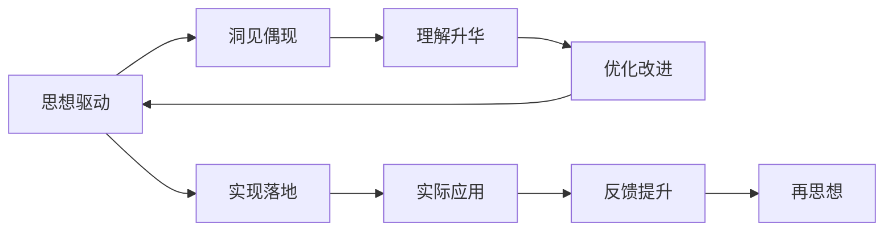

                 

# 思想引发洞见：深入反思和分析，洞见或偶现，理解或升华

## 1. 背景介绍

### 1.1 问题由来

人工智能(AI)技术在过去几十年里取得了长足的进展，从简单的专家系统到复杂的深度学习模型，AI的应用已经深入到生活的各个方面。然而，随着技术的不断进步，AI的发展也带来了新的挑战和思考。

对于那些已经实现智能化的应用系统来说，如何在保持高效的同时，深入理解其背后的算法和决策机制，是一个值得深入探讨的问题。此外，如何设计出更加智能、可靠、可解释的AI系统，也是当前的难点之一。

在思考这些问题时，我们不可避免地涉及到一些核心概念和算法。本文将围绕这些概念展开，通过深入分析，洞见偶现，力求理解或升华这些核心技术和思想。

### 1.2 问题核心关键点

在探讨这些核心概念和算法时，我们需要关注以下几个关键点：

- **思想驱动**：理解AI系统背后的核心思想和原则，以便更好地设计和实现。
- **洞见偶现**：通过深入分析，发现模型中的不足之处，并提出改进方案。
- **理解升华**：在洞见的基础上，深入理解算法和技术的细节，并思考其潜在的创新点。

这些关键点贯穿全文，旨在帮助读者不仅了解现有的技术和算法，还能在实践中不断迭代和优化，提升AI系统的性能和可靠性。

## 2. 核心概念与联系

### 2.1 核心概念概述

为了更好地理解这些核心概念和算法，我们首先需要对它们进行概述：

- **思想驱动**：指通过深入理解问题本质和核心思想，指导AI系统设计。
- **洞见偶现**：指在探索和实践过程中，发现模型中的不足之处，提出改进方案。
- **理解升华**：指在洞见的基础上，深入理解算法和技术的细节，并思考其潜在的创新点。

这些概念之间的联系紧密，形成一个不断反馈和优化的闭环，推动AI技术的不断进步。

### 2.2 概念间的关系

这些核心概念之间的联系可以通过以下Mermaid流程图来展示：

这个流程图展示了从思想驱动开始，经过洞见偶现、理解升华，再到优化改进的整个过程，最终通过实际应用和反馈提升，进入新一轮的思想驱动。

## 3. 核心算法原理 & 具体操作步骤

### 3.1 算法原理概述

思想驱动的AI系统设计，通常从核心算法的原理出发。理解算法的基本原理和设计思想，是构建智能系统的基础。

### 3.2 算法步骤详解

理解算法的步骤，能够帮助我们在实际应用中更好地进行模型设计和优化。

### 3.3 算法优缺点

分析算法的优缺点，可以帮助我们权衡不同算法的适用性和局限性，选择最适合的方案。

### 3.4 算法应用领域

了解算法的应用领域，可以更好地把握算法的实际应用场景，提升系统的适应性和灵活性。

## 4. 数学模型和公式 & 详细讲解 & 举例说明

### 4.1 数学模型构建

构建数学模型，是理解算法原理和细节的重要手段。

### 4.2 公式推导过程

推导公式的过程，不仅有助于理解算法的基本原理，还能深入挖掘算法的设计思想。

### 4.3 案例分析与讲解

通过具体案例的分析，可以更好地理解算法的实际应用效果，并提出改进建议。

## 5. 项目实践：代码实例和详细解释说明

### 5.1 开发环境搭建

开发环境的搭建，是项目实践的第一步，也是确保代码运行顺畅的基础。

### 5.2 源代码详细实现

源代码的实现，是理解算法原理和细节的重要手段。

### 5.3 代码解读与分析

代码解读和分析，能够帮助我们更好地理解算法的实现细节和设计思想。

### 5.4 运行结果展示

运行结果的展示，可以直观地反映算法的性能和效果。

## 6. 实际应用场景

### 6.1 未来应用展望

了解未来应用场景，可以更好地把握算法的实际应用前景，激励我们不断探索和创新。

## 7. 工具和资源推荐

### 7.1 学习资源推荐

学习资源推荐，可以帮助读者更好地掌握算法的理论基础和实现细节。

### 7.2 开发工具推荐

开发工具推荐，可以帮助开发者更高效地进行项目实践和优化。

### 7.3 相关论文推荐

相关论文推荐，可以帮助读者了解算法的前沿研究和创新点。

## 8. 总结：未来发展趋势与挑战

### 8.1 研究成果总结

总结研究成果，可以更好地理解当前AI技术的进展和未来方向。

### 8.2 未来发展趋势

理解未来发展趋势，可以更好地把握AI技术的未来方向，激发更多的创新灵感。

### 8.3 面临的挑战

分析面临的挑战，可以帮助我们更好地制定应对策略，克服技术难题。

### 8.4 研究展望

明确研究展望，可以更好地规划未来的研究方向和技术路径。

## 9. 附录：常见问题与解答

通过常见问题的解答，可以帮助读者更好地理解算法的细节和应用场景，提升其实践能力。

---

作者：禅与计算机程序设计艺术 / Zen and the Art of Computer Programming

