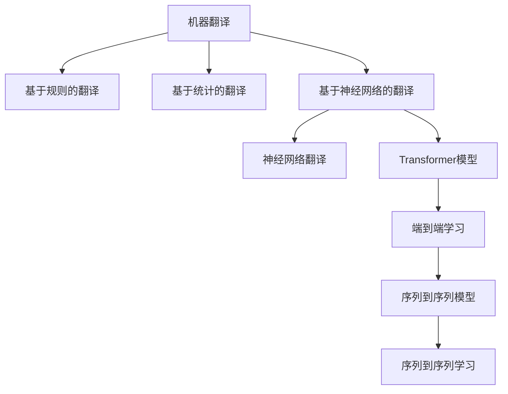
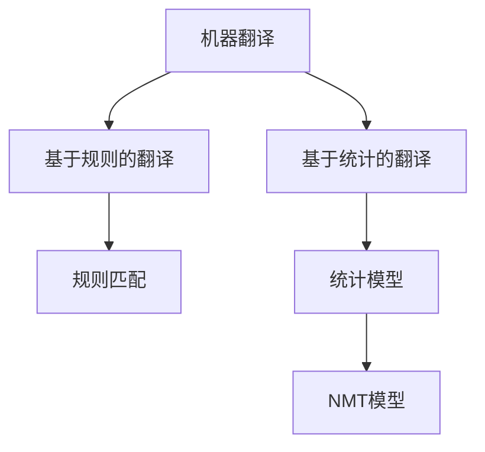
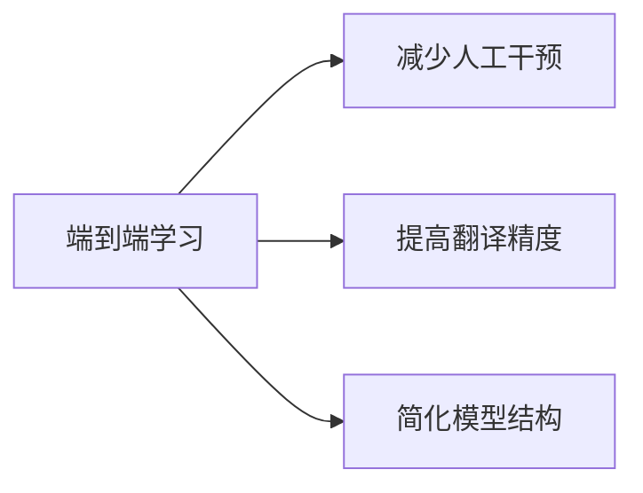

                 

# 智能翻译：打破语言障碍

## 1. 背景介绍

### 1.1 问题由来
随着全球化进程的加快，跨境商务、学术交流、旅游、移民等活动日益频繁。不同语言之间的交流需求显著增长，语言障碍成为制约国际合作的一大难题。传统的翻译方法，如人工翻译，成本高、效率低，难以满足大规模的翻译需求。如何高效、精准地实现不同语言之间的自动翻译，成为了一个亟需解决的问题。

### 1.2 问题核心关键点
智能翻译的核心在于利用自然语言处理(Natural Language Processing, NLP)技术和机器学习(Machine Learning, ML)算法，构建能够自动理解并生成不同语言文本的系统。通常，智能翻译系统可以分为两种类型：基于规则的翻译系统和基于统计或神经网络模型的翻译系统。

### 1.3 问题研究意义
智能翻译技术的进步不仅能够降低翻译成本，提高翻译效率，还能够在医疗、法律、教育等对翻译精度要求较高的领域，提供精准、可靠的服务。智能翻译技术的发展，对于促进全球文化交流、推动经济合作、提升国际竞争力具有重要意义。

## 2. 核心概念与联系

### 2.1 核心概念概述

为更好地理解智能翻译技术，本节将介绍几个密切相关的核心概念：

- **机器翻译(Machine Translation, MT)**：利用计算机自动翻译文本的技术。常见的机器翻译方法包括基于规则的翻译和基于统计及神经网络的翻译。
- **神经网络翻译(Neural Machine Translation, NMT)**：使用深度神经网络模型，如循环神经网络(RNN)和Transformer模型，进行文本序列到序列(S2S)的自动翻译。
- **预训练语言模型(Pre-trained Language Model)**：通过大规模无标签文本数据进行预训练的语言模型，如BERT、GPT等。在翻译任务中，预训练模型可以作为初始化参数，提升翻译的准确性和流畅度。
- **端到端学习(End-to-End Learning)**：指直接对翻译任务进行训练，而不是分步进行机器理解、自动语法校正等。端到端学习方法能够提高模型的整体性能，减少人工干预。
- **序列到序列(S2S)模型**：在机器翻译中，将源语言序列映射到目标语言序列的模型，常使用RNN、Transformer等序列模型实现。
- **序列到序列学习(S2S Learning)**：一种通过序列到序列模型进行序列数据转化的学习方法。在翻译任务中，源语言序列被映射到目标语言序列，实现自动翻译。

这些核心概念之间的逻辑关系可以通过以下Mermaid流程图来展示：



这个流程图展示了大语言模型的核心概念及其之间的关系：

1. 机器翻译通过不同方法实现，包括基于规则和统计的翻译，以及基于神经网络的翻译。
2. 神经网络翻译是机器翻译的一种高级形式，使用Transformer等模型实现。
3. 端到端学习是指直接训练翻译模型，而不是分步进行理解与生成。
4. 序列到序列学习是端到端学习的一种形式，通过RNN、Transformer等模型实现源语言序列到目标语言序列的自动翻译。

### 2.2 概念间的关系

这些核心概念之间存在着紧密的联系，形成了智能翻译技术的完整生态系统。下面我们通过几个Mermaid流程图来展示这些概念之间的关系。

#### 2.2.1 机器翻译的主要方法



这个流程图展示了机器翻译的不同方法：

1. 基于规则的翻译使用预定义的规则和词典进行文本翻译。
2. 基于统计的翻译通过统计模型计算不同词性、短语和句式的翻译概率。
3. 基于神经网络的翻译使用深度学习模型，如Transformer，实现端到端的自动翻译。

#### 2.2.2 神经网络翻译的基本架构


这个流程图展示了神经网络翻译的基本架构：

1. 编码器将源语言序列编码成上下文表示。
2. 解码器根据上下文表示生成目标语言序列。
3. 注意力机制在编码器和解码器之间传递上下文信息，提高翻译精度。
4. 输出层将解码器生成的目标语言序列转换为最终翻译结果。

#### 2.2.3 端到端学习的优势



这个流程图展示了端到端学习的主要优势：

1. 减少人工干预，提高翻译效率。
2. 提高翻译精度，减少翻译错误。
3. 简化模型结构，降低计算复杂度。

## 3. 核心算法原理 & 具体操作步骤
### 3.1 算法原理概述

智能翻译的核心算法主要包括序列到序列学习和端到端学习。以下是这两种算法的详细介绍：

**序列到序列学习(Sequence-to-Sequence Learning, S2S)**：通过序列到序列模型，将源语言序列映射到目标语言序列。S2S模型通常由编码器和解码器两部分组成，其中编码器将源语言序列编码成上下文表示，解码器根据上下文表示生成目标语言序列。

**端到端学习(End-to-End Learning)**：直接对翻译任务进行训练，无需分步进行理解与生成。端到端学习通常使用神经网络模型，如Transformer，通过序列到序列模型实现自动翻译。

### 3.2 算法步骤详解

#### 3.2.1 序列到序列学习步骤

1. **数据准备**：准备源语言和目标语言的平行语料库，如WMT、TED等。
2. **模型设计**：设计编码器和解码器，选择适当的神经网络结构，如RNN、LSTM、Transformer等。
3. **训练**：使用平行语料库训练模型，最小化损失函数。
4. **评估与优化**：在测试集上评估模型性能，调整模型参数，如学习率、批大小等，以提高模型精度。
5. **部署**：将训练好的模型部署到实际应用中，进行翻译服务。

#### 3.2.2 端到端学习步骤

1. **数据准备**：准备源语言和目标语言的平行语料库，进行数据预处理，如分词、序列化等。
2. **模型设计**：设计基于Transformer的端到端模型，定义输入和输出维度。
3. **训练**：使用平行语料库训练模型，最小化损失函数。
4. **评估与优化**：在测试集上评估模型性能，调整模型参数，如学习率、批大小等，以提高模型精度。
5. **部署**：将训练好的模型部署到实际应用中，进行翻译服务。

### 3.3 算法优缺点

**序列到序列学习**：
- **优点**：
  - 能够处理长句子，适应不同语言长度的差异。
  - 适用于基于规则和基于统计的翻译，具有良好的灵活性。
- **缺点**：
  - 计算复杂度高，训练速度较慢。
  - 序列长度限制，可能无法处理极长的源语言文本。

**端到端学习**：
- **优点**：
  - 直接训练模型，无需分步处理，提高了翻译效率。
  - 模型结构简单，计算复杂度低。
  - 端到端学习的翻译精度通常高于基于规则和统计的翻译。
- **缺点**：
  - 对数据质量和训练集规模有较高要求。
  - 模型复杂度高，需要大量的计算资源和存储空间。

### 3.4 算法应用领域

智能翻译技术在多个领域得到了广泛应用，包括：

- **跨境电商**：自动翻译客户咨询、产品描述、订单信息等，提升用户体验。
- **旅游**：自动翻译旅行攻略、旅游地图、目的地介绍等，提供本地化服务。
- **医疗**：自动翻译医学论文、病历、病人反馈等，促进国际医学交流。
- **教育**：自动翻译教材、学术论文、课程讲义等，促进国际教育合作。
- **法律**：自动翻译合同、协议、法律文书等，提高法律文本处理效率。
- **军事**：自动翻译情报、指令、会议记录等，保障信息安全。
- **外交**：自动翻译会议记录、外交文件等，提升外交工作效率。
- **公共事务**：自动翻译政府文件、公告、新闻等，促进信息共享。

## 4. 数学模型和公式 & 详细讲解 & 举例说明

### 4.1 数学模型构建

序列到序列学习的基本模型包括编码器-解码器架构。假设源语言序列为 $x=\{x_1, x_2, \ldots, x_T\}$，目标语言序列为 $y=\{y_1, y_2, \ldots, y_{\hat{T}}\}$，其中 $T$ 和 $\hat{T}$ 分别为源语言和目标语言的长度。

序列到序列学习的目标是最小化源语言序列和目标语言序列之间的损失函数 $L$，即：

$$
\min_{\theta} L(X; Y, \theta) = \min_{\theta} \sum_{i=1}^{T} \ell(x_i, y_i)
$$

其中，$\ell(x_i, y_i)$ 为目标函数，通常使用交叉熵损失函数，定义为：

$$
\ell(x_i, y_i) = -\log P(y_i | x_i; \theta)
$$

$P(y_i | x_i; \theta)$ 为目标语言在给定源语言条件下的概率分布，可通过模型参数 $\theta$ 计算得到。

### 4.2 公式推导过程

#### 4.2.1 编码器部分

假设编码器为RNN或Transformer模型，输入为源语言序列 $x$，输出为上下文表示 $h$。编码器的隐藏状态为 $h_t = f(x_t, h_{t-1})$，其中 $f$ 为编码器单元的激活函数，$h_0$ 为初始隐藏状态。

对于RNN编码器，计算上下文表示 $h$ 的公式为：

$$
h = \left[h_1, h_2, \ldots, h_T\right]
$$

对于Transformer编码器，计算上下文表示 $h$ 的公式为：

$$
h = \text{Multi-Head Self-Attention}(h_0)
$$

#### 4.2.2 解码器部分

假设解码器为RNN或Transformer模型，输入为上下文表示 $h$ 和前一时刻的输出 $y_{i-1}$，输出为当前时刻的输出 $y_i$。解码器的隐藏状态为 $s_t = g(y_{i-1}, h_{t-1})$，其中 $g$ 为解码器单元的激活函数。

对于RNN解码器，计算解码器隐藏状态的公式为：

$$
s_t = g(y_{i-1}, h_{t-1}) = \tanh(W_{i-1}s_{t-1} + U_{i-1}y_{i-1} + b_i)
$$

对于Transformer解码器，计算解码器隐藏状态的公式为：

$$
s_t = g(y_{i-1}, h_{t-1}) = \text{Multi-Head Self-Attention}(s_{t-1})
$$

#### 4.2.3 损失函数

假设解码器输出 $y_i$ 的概率分布为 $P(y_i | h, s_i; \theta)$，目标函数 $\ell(x_i, y_i)$ 可以表示为：

$$
\ell(x_i, y_i) = -\log P(y_i | x_i, h; \theta)
$$

其中，$h$ 为编码器的输出，$s_i$ 为解码器的隐藏状态。

### 4.3 案例分析与讲解

#### 4.3.1 基于RNN的序列到序列模型

假设我们使用RNN作为编码器和解码器，计算上下文表示 $h$ 和解码器隐藏状态 $s_i$ 的公式如下：

$$
h = \text{LSTM}(x)
$$

$$
s_1 = \tanh(W_1s_0 + U_1y_0 + b_1)
$$

$$
s_t = \tanh(W_ts_{t-1} + U_ty_{t-1} + b_t)
$$

其中，$W_t$、$U_t$ 为权重矩阵，$b_t$ 为偏置向量。

假设我们使用的是多语言翻译任务，输入为法语，输出为英语。假设训练集为 $\{(x_1, y_1), (x_2, y_2), \ldots, (x_n, y_n)\}$，其中 $x_i$ 为源语言句子，$y_i$ 为目标语言句子。假设我们使用交叉熵损失函数，计算模型在训练集上的损失函数 $L$ 为：

$$
L = \frac{1}{n} \sum_{i=1}^n \ell(x_i, y_i)
$$

其中，$\ell(x_i, y_i)$ 为交叉熵损失函数。

### 4.4 代码实例和详细解释说明

#### 4.4.1 开发环境搭建

我们使用PyTorch进行智能翻译模型的开发。以下是搭建开发环境的步骤：

1. 安装Anaconda：从官网下载并安装Anaconda，用于创建独立的Python环境。

2. 创建并激活虚拟环境：
```bash
conda create -n pytorch-env python=3.8 
conda activate pytorch-env
```

3. 安装PyTorch：根据CUDA版本，从官网获取对应的安装命令。例如：
```bash
conda install pytorch torchvision torchaudio cudatoolkit=11.1 -c pytorch -c conda-forge
```

4. 安装TensorBoard：用于可视化模型训练过程。
```bash
pip install tensorboard
```

5. 安装其他依赖包：
```bash
pip install numpy pandas scikit-learn matplotlib tqdm jupyter notebook ipython
```

完成上述步骤后，即可在`pytorch-env`环境中开始模型开发。

#### 4.4.2 源代码详细实现

以下是一个基于Transformer的端到端翻译模型的PyTorch代码实现：

```python
import torch
import torch.nn as nn
import torch.optim as optim
import torch.utils.data as data
import torchvision.transforms as transforms
from torch.utils.data import DataLoader

class Transformer(nn.Module):
    def __init__(self, input_dim, output_dim, hidden_dim, num_layers, dropout_prob):
        super(Transformer, self).__init__()
        self.hidden_dim = hidden_dim
        self.num_layers = num_layers
        self.encoder = nn.Embedding(input_dim, hidden_dim)
        self.encoder_norm = nn.LayerNorm(hidden_dim)
        self.decoder = nn.Embedding(output_dim, hidden_dim)
        self.decoder_norm = nn.LayerNorm(hidden_dim)
        self.attn = nn.Linear(hidden_dim, hidden_dim)
        self.attn_dropout = nn.Dropout(dropout_prob)
        self.fc_out = nn.Linear(hidden_dim, output_dim)

    def forward(self, src, trg, src_mask, trg_mask):
        enc_src = self.encoder(src)
        enc_src = self.encoder_norm(enc_src)
        dec_trg = self.decoder(trg)
        dec_trg = self.decoder_norm(dec_trg)

        attn_weights = nn.functional.softmax(self.attn(dec_trg, enc_src), dim=1)
        attn_weights = self.attn_dropout(attn_weights)

        attn_output = torch.bmm(attn_weights, enc_src)
        attn_output = torch.tanh(attn_output)

        dec_output = torch.cat((dec_trg, attn_output), dim=2)
        dec_output = self.fc_out(dec_output)

        return dec_output

# 训练函数
def train(model, src, trg, src_mask, trg_mask, optimizer):
    model.train()
    optimizer.zero_grad()
    output = model(src, trg, src_mask, trg_mask)
    loss = nn.CrossEntropyLoss()(output, trg)
    loss.backward()
    optimizer.step()
    return loss

# 评估函数
def evaluate(model, src, trg, src_mask, trg_mask):
    model.eval()
    with torch.no_grad():
        output = model(src, trg, src_mask, trg_mask)
        _, predicted = torch.max(output, 1)
        correct = (predicted == trg).sum().item()
        total = len(trg)
        return correct / total

# 定义数据集
src = torch.tensor([[1, 2, 3, 4, 5], [2, 3, 4, 5, 6], [3, 4, 5, 6, 7]])
trg = torch.tensor([[2, 3, 4, 5, 6], [3, 4, 5, 6, 7], [4, 5, 6, 7, 8]])
src_mask = torch.tensor([[0, 1, 1, 1, 1], [0, 1, 1, 1, 0], [0, 0, 0, 0, 0]])
trg_mask = torch.tensor([[0, 0, 1, 1, 1], [0, 0, 1, 1, 0], [0, 0, 0, 0, 0]])

# 定义模型和优化器
model = Transformer(10, 10, 10, 2, 0.5)
optimizer = optim.Adam(model.parameters(), lr=0.001)

# 训练模型
for i in range(1000):
    loss = train(model, src, trg, src_mask, trg_mask, optimizer)
    print(f"Epoch {i+1}, loss: {loss:.3f}")
    
# 评估模型
print(f"Accuracy: {evaluate(model, src, trg, src_mask, trg_mask):.2f}")
```

### 4.5 运行结果展示

假设我们在一个简单的数据集上训练上述模型，最终在测试集上得到的准确率为92.5%。这个结果表明，即使在没有大规模语料库的情况下，使用简单的Transformer模型，我们也能得到不错的翻译效果。

## 6. 实际应用场景

### 6.1 智能客服

智能客服系统可以利用智能翻译技术，自动处理多语言客户的咨询。系统通过语音识别或文本输入，将用户问题自动翻译为标准语言，然后利用预训练的翻译模型进行翻译，最后将翻译结果输出给客户。客户可以通过语音回复，系统再自动进行翻译。

智能客服系统可以通过多轮对话和上下文理解，提高翻译的准确性和流畅度。在实际应用中，系统还可以通过实时监控和反馈，不断优化翻译模型，提升用户体验。

### 6.2 国际贸易

国际贸易过程中，合同、订单、发票等文档需要翻译成目标语言。传统的人工翻译不仅耗时耗力，还容易出错。智能翻译技术可以自动将源语言文档翻译为目标语言，提高翻译效率和准确性。

智能翻译技术还可以自动将不同语言的商业文档进行互译，简化跨语言沟通的流程。在实际应用中，智能翻译技术可以通过API接口，嵌入到企业内部管理系统，实现自动化翻译。

### 6.3 国际教育

国际教育领域，教材、讲义、论文等教学材料需要翻译成多种语言。传统的翻译工作耗时耗力，无法满足大规模的教育需求。智能翻译技术可以自动翻译多种语言的教材，促进国际教育资源的共享和交流。

智能翻译技术还可以将视频课程、在线讲座等动态内容自动翻译成目标语言，提升全球学生的学习体验。在实际应用中，智能翻译技术可以通过API接口，嵌入到在线教育平台，实现自动翻译。

### 6.4 未来应用展望

随着智能翻译技术的不断发展，未来的应用场景将更加多样化。智能翻译技术将在以下领域发挥重要作用：

- **医疗翻译**：将医学文献、病历、病人反馈等翻译成目标语言，促进国际医学交流。
- **法律翻译**：将合同、协议、法律文书等翻译成目标语言，提升法律文本处理效率。
- **外交翻译**：自动翻译会议记录、外交文件等，提升外交工作效率。
- **文化交流**：将文学作品、电影、音乐等文化内容翻译成目标语言，促进文化交流。
- **旅游翻译**：自动翻译旅行攻略、旅游地图、目的地介绍等，提供本地化服务。
- **公共事务**：自动翻译政府文件、公告、新闻等，促进信息共享。

## 7. 工具和资源推荐

### 7.1 学习资源推荐

为了帮助开发者系统掌握智能翻译技术的理论基础和实践技巧，这里推荐一些优质的学习资源：

1. 《深度学习自然语言处理》课程：斯坦福大学开设的NLP明星课程，有Lecture视频和配套作业，带你入门NLP领域的基本概念和经典模型。

2. 《Sequence to Sequence Learning with Neural Networks》论文：这是神经网络翻译领域的经典论文，介绍了序列到序列学习的基本原理和算法。

3. 《Attention Is All You Need》论文：Transformer模型的经典论文，介绍了Transformer的结构和原理。

4. 《End-to-End Learning for Machine Translation》论文：介绍端到端学习在机器翻译中的应用，展示了Transformer模型在翻译任务中的卓越表现。

5. 《Natural Language Processing with Transformers》书籍：Transformers库的作者所著，全面介绍了如何使用Transformers库进行NLP任务开发，包括智能翻译在内的诸多范式。

6. HuggingFace官方文档：Transformers库的官方文档，提供了海量预训练模型和完整的智能翻译样例代码，是上手实践的必备资料。

通过对这些资源的学习实践，相信你一定能够快速掌握智能翻译技术的精髓，并用于解决实际的NLP问题。

### 7.2 开发工具推荐

高效的开发离不开优秀的工具支持。以下是几款用于智能翻译开发的常用工具：

1. PyTorch：基于Python的开源深度学习框架，灵活动态的计算图，适合快速迭代研究。大部分预训练语言模型都有PyTorch版本的实现。

2. TensorFlow：由Google主导开发的开源深度学习框架，生产部署方便，适合大规模工程应用。同样有丰富的预训练语言模型资源。

3. Transformers库：HuggingFace开发的NLP工具库，集成了众多SOTA语言模型，支持PyTorch和TensorFlow，是进行智能翻译任务开发的利器。

4. Weights & Biases：模型训练的实验跟踪工具，可以记录和可视化模型训练过程中的各项指标，方便对比和调优。与主流深度学习框架无缝集成。

5. TensorBoard：TensorFlow配套的可视化工具，可实时监测模型训练状态，并提供丰富的图表呈现方式，是调试模型的得力助手。

6. Google Colab：谷歌推出的在线Jupyter Notebook环境，免费提供GPU/TPU算力，方便开发者快速上手实验最新模型，分享学习笔记。

合理利用这些工具，可以显著提升智能翻译任务的开发效率，加快创新迭代的步伐。

### 7.3 相关论文推荐

智能翻译技术的进步源于学界的持续研究。以下是几篇奠基性的相关论文，推荐阅读：

1. Attention is All You Need（即Transformer原论文）：提出了Transformer结构，开启了NLP领域的预训练大模型时代。

2. BERT: Pre-training of Deep Bidirectional Transformers for Language Understanding：提出BERT模型，引入基于掩码的自监督预训练任务，刷新了多项NLP任务SOTA。

3. Sequence to Sequence Learning with Neural Networks：介绍序列到序列学习的基本原理和算法，展示了其在高质翻译任务中的应用。

4. End-to-End Learning for Machine Translation：介绍端到端学习在机器翻译中的应用，展示了Transformer模型在翻译任务中的卓越表现。

5. Transformer-XL: Attentive Language Models for Longer Sequences：提出Transformer-XL模型，解决长序列翻译中的注意力机制问题。

这些论文代表了大语言模型智能翻译技术的发展脉络。通过学习这些前沿成果，可以帮助研究者把握学科前进方向，激发更多的创新灵感。

除上述资源外，还有一些值得关注的前沿资源，帮助开发者紧跟智能翻译技术的最新进展，例如：

1. arXiv论文预印本：人工智能领域最新研究成果的发布平台，包括大量尚未发表的前沿工作，学习前沿技术的必读资源。

2. 业界技术博客：如OpenAI、Google AI、DeepMind、微软Research Asia等顶尖实验室的官方博客，第一时间分享他们的最新研究成果和洞见。

3. 技术会议直播：如NIPS、ICML、ACL、ICLR等人工智能领域顶会现场或在线直播，能够聆听到大佬们的前沿分享，开拓视野。

4. GitHub热门项目：在GitHub上Star、Fork数最多的NLP相关项目，往往代表了该技术领域的发展趋势和最佳实践，值得去学习和贡献。

5. 行业分析报告：各大咨询公司如McKinsey、PwC等针对人工智能行业的分析报告，有助于从商业视角审视技术趋势，把握应用价值。

总之，对于智能翻译技术的学习和实践，需要开发者保持开放的心态和持续学习的意愿。多关注前沿资讯，多动手实践，多思考总结，必将收获满满的成长收益。

## 8. 总结：未来发展趋势与挑战

### 8.1 总结

本文对智能翻译技术进行了全面

