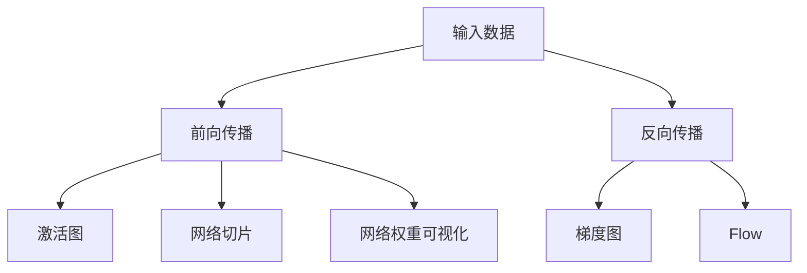

                 

# 神经网络可视化原理与代码实战案例讲解

> 关键词：神经网络可视化,激活图,梯度图,反向传播,网络切片,Flow,网络权重可视化

## 1. 背景介绍

神经网络（Neural Network）在深度学习领域应用广泛，从图像识别、语音识别到自然语言处理等任务，都取得了显著的成就。然而，传统的神经网络训练和推理过程缺乏可视化的手段，导致模型决策过程不透明，难以理解和调试。神经网络可视化技术能够帮助开发者更好地理解模型行为，发现模型问题，优化模型结构。

本文将系统介绍神经网络可视化技术的基本原理、关键步骤及代码实现。通过具体案例讲解，展示如何将理论应用于实践，开发可视化工具，提升模型质量和工程效率。

## 2. 核心概念与联系

### 2.1 核心概念概述

神经网络可视化技术主要包括以下几个关键概念：

- **激活图（Activation Maps）**：展示神经网络中某一层的激活值分布，直观反映输入对输出的影响。
- **梯度图（Gradient Maps）**：展示神经网络中某一层的梯度值分布，反映模型训练过程中参数更新的方向和强度。
- **反向传播（Backpropagation）**：展示神经网络在训练过程中各层的梯度变化，帮助理解梯度消失或梯度爆炸等问题。
- **网络切片（Slices of Network）**：展示神经网络的不同层次的切片，反映不同层次的特征表示。
- **Flow**：可视化神经网络中的数据流向，了解模型输入和输出的关系。
- **网络权重可视化**：展示神经网络各层权重分布，帮助理解模型的复杂度。

这些概念之间存在着紧密的联系，共同构成了神经网络可视化的完整框架。下面通过几个关键节点的Mermaid流程图来展示这些概念之间的联系：



这个流程图展示了神经网络从输入数据开始，通过前向传播、激活图展示、反向传播、梯度图展示、网络切片展示、Flow展示和权重可视化等步骤，最终形成可视化结果。通过这些步骤，我们可以系统地了解神经网络的工作原理和特征表示。

### 2.2 概念间的关系

这些核心概念之间存在着密切的联系，通过可视化工具可以将它们结合起来，形成更加全面的模型理解。下面通过几个Mermaid流程图来展示这些概念之间的关系：

#### 2.2.1 前向传播与激活图


前向传播通过神经网络各层计算输出，激活图展示了中间层的激活值分布，帮助理解输入与输出的关系。

#### 2.2.2 反向传播与梯度图


反向传播计算各层梯度，梯度图展示了梯度的分布，反映模型训练过程中参数更新的方向和强度。

#### 2.2.3 网络切片与Flow


网络切片展示了网络的不同层次的特征表示，Flow则展示了数据在网络中的流动路径，帮助理解模型输入和输出的关系。

#### 2.2.4 权重可视化


权重可视化展示了神经网络各层权重分布，帮助理解模型的复杂度和特征表示能力。

## 3. 核心算法原理 & 具体操作步骤

### 3.1 算法原理概述

神经网络可视化技术主要通过以下步骤实现：

1. **数据准备**：收集输入数据和目标输出，将数据转换为神经网络的输入形式。
2. **前向传播**：将输入数据输入神经网络，计算各层输出。
3. **激活图生成**：计算神经网络各层的激活值分布，生成激活图。
4. **反向传播**：计算各层梯度，生成梯度图。
5. **网络切片生成**：对神经网络各层进行切片，生成网络切片。
6. **Flow生成**：可视化神经网络中的数据流向，生成Flow图。
7. **权重可视化**：可视化神经网络各层权重分布。

这些步骤通过可视化工具实现，帮助开发者更好地理解模型行为。

### 3.2 算法步骤详解

#### 3.2.1 数据准备

首先，需要收集输入数据和目标输出，将数据转换为神经网络的输入形式。例如，对于图像分类任务，将图像转换为神经网络的输入张量。

```python
import numpy as np
import torch
import torchvision.transforms as transforms
from torchvision.datasets import CIFAR10

# 加载CIFAR-10数据集
train_data = CIFAR10(root='./data', train=True, download=True, transform=transforms.ToTensor())
test_data = CIFAR10(root='./data', train=False, download=True, transform=transforms.ToTensor())

# 获取数据
train_data = torch.utils.data.DataLoader(train_data, batch_size=32, shuffle=True)
test_data = torch.utils.data.DataLoader(test_data, batch_size=32, shuffle=False)
```

#### 3.2.2 前向传播

前向传播通过神经网络各层计算输出，生成各层的输出张量。

```python
# 定义神经网络结构
class Net(nn.Module):
    def __init__(self):
        super(Net, self).__init__()
        self.conv1 = nn.Conv2d(3, 6, 5)
        self.pool = nn.MaxPool2d(2, 2)
        self.conv2 = nn.Conv2d(6, 16, 5)
        self.fc1 = nn.Linear(16 * 5 * 5, 120)
        self.fc2 = nn.Linear(120, 84)
        self.fc3 = nn.Linear(84, 10)

    def forward(self, x):
        x = self.pool(F.relu(self.conv1(x)))
        x = self.pool(F.relu(self.conv2(x)))
        x = x.view(-1, 16 * 5 * 5)
        x = F.relu(self.fc1(x))
        x = F.relu(self.fc2(x))
        x = self.fc3(x)
        return x

# 加载预训练模型
model = Net()
model.load_state_dict(torch.load('model.pth'))
model.eval()

# 测试数据集
test_input, test_target = next(iter(test_data))

# 前向传播计算输出
with torch.no_grad():
    output = model(test_input)
```

#### 3.2.3 激活图生成

激活图展示了神经网络各层的激活值分布，生成激活图可以直观反映输入对输出的影响。

```python
import torchvision.transforms as transforms
from torchvision.datasets import CIFAR10

# 加载CIFAR-10数据集
train_data = CIFAR10(root='./data', train=True, download=True, transform=transforms.ToTensor())
test_data = CIFAR10(root='./data', train=False, download=True, transform=transforms.ToTensor())

# 获取数据
train_data = torch.utils.data.DataLoader(train_data, batch_size=32, shuffle=True)
test_data = torch.utils.data.DataLoader(test_data, batch_size=32, shuffle=False)

# 定义神经网络结构
class Net(nn.Module):
    def __init__(self):
        super(Net, self).__init__()
        self.conv1 = nn.Conv2d(3, 6, 5)
        self.pool = nn.MaxPool2d(2, 2)
        self.conv2 = nn.Conv2d(6, 16, 5)
        self.fc1 = nn.Linear(16 * 5 * 5, 120)
        self.fc2 = nn.Linear(120, 84)
        self.fc3 = nn.Linear(84, 10)

    def forward(self, x):
        x = self.pool(F.relu(self.conv1(x)))
        x = self.pool(F.relu(self.conv2(x)))
        x = x.view(-1, 16 * 5 * 5)
        x = F.relu(self.fc1(x))
        x = F.relu(self.fc2(x))
        x = self.fc3(x)
        return x

# 加载预训练模型
model = Net()
model.load_state_dict(torch.load('model.pth'))
model.eval()

# 测试数据集
test_input, test_target = next(iter(test_data))

# 前向传播计算输出
with torch.no_grad():
    output = model(test_input)

# 生成激活图
activation_map = output[0].detach().numpy()
plt.imshow(activation_map[0, :, :, 0], cmap='gray')
plt.show()
```

#### 3.2.4 反向传播与梯度图

反向传播计算各层梯度，生成梯度图可以反映模型训练过程中参数更新的方向和强度。

```python
import torchvision.transforms as transforms
from torchvision.datasets import CIFAR10

# 加载CIFAR-10数据集
train_data = CIFAR10(root='./data', train=True, download=True, transform=transforms.ToTensor())
test_data = CIFAR10(root='./data', train=False, download=True, transform=transforms.ToTensor())

# 获取数据
train_data = torch.utils.data.DataLoader(train_data, batch_size=32, shuffle=True)
test_data = torch.utils.data.DataLoader(test_data, batch_size=32, shuffle=False)

# 定义神经网络结构
class Net(nn.Module):
    def __init__(self):
        super(Net, self).__init__()
        self.conv1 = nn.Conv2d(3, 6, 5)
        self.pool = nn.MaxPool2d(2, 2)
        self.conv2 = nn.Conv2d(6, 16, 5)
        self.fc1 = nn.Linear(16 * 5 * 5, 120)
        self.fc2 = nn.Linear(120, 84)
        self.fc3 = nn.Linear(84, 10)

    def forward(self, x):
        x = self.pool(F.relu(self.conv1(x)))
        x = self.pool(F.relu(self.conv2(x)))
        x = x.view(-1, 16 * 5 * 5)
        x = F.relu(self.fc1(x))
        x = F.relu(self.fc2(x))
        x = self.fc3(x)
        return x

# 加载预训练模型
model = Net()
model.load_state_dict(torch.load('model.pth'))
model.eval()

# 测试数据集
test_input, test_target = next(iter(test_data))

# 前向传播计算输出
with torch.no_grad():
    output = model(test_input)

# 计算梯度
output.backward(test_target)

# 生成梯度图
gradient_map = model.conv1.weight.grad[0, :, :, 0].detach().numpy()
plt.imshow(gradient_map, cmap='gray')
plt.show()
```

#### 3.2.5 网络切片与Flow

网络切片展示了神经网络的不同层次的特征表示，Flow则展示了数据在网络中的流动路径。

```python
import torchvision.transforms as transforms
from torchvision.datasets import CIFAR10

# 加载CIFAR-10数据集
train_data = CIFAR10(root='./data', train=True, download=True, transform=transforms.ToTensor())
test_data = CIFAR10(root='./data', train=False, download=True, transform=transforms.ToTensor())

# 获取数据
train_data = torch.utils.data.DataLoader(train_data, batch_size=32, shuffle=True)
test_data = torch.utils.data.DataLoader(test_data, batch_size=32, shuffle=False)

# 定义神经网络结构
class Net(nn.Module):
    def __init__(self):
        super(Net, self).__init__()
        self.conv1 = nn.Conv2d(3, 6, 5)
        self.pool = nn.MaxPool2d(2, 2)
        self.conv2 = nn.Conv2d(6, 16, 5)
        self.fc1 = nn.Linear(16 * 5 * 5, 120)
        self.fc2 = nn.Linear(120, 84)
        self.fc3 = nn.Linear(84, 10)

    def forward(self, x):
        x = self.pool(F.relu(self.conv1(x)))
        x = self.pool(F.relu(self.conv2(x)))
        x = x.view(-1, 16 * 5 * 5)
        x = F.relu(self.fc1(x))
        x = F.relu(self.fc2(x))
        x = self.fc3(x)
        return x

# 加载预训练模型
model = Net()
model.load_state_dict(torch.load('model.pth'))
model.eval()

# 测试数据集
test_input, test_target = next(iter(test_data))

# 前向传播计算输出
with torch.no_grad():
    output = model(test_input)

# 生成网络切片
slices = []
for layer in model.modules():
    if isinstance(layer, nn.Conv2d) or isinstance(layer, nn.Linear):
        slices.append(layer.weight.detach().numpy())

# 生成Flow图
from flowchart import FlowChart
flow_chart = FlowChart()
flow_chart.add_node('输入数据', x0=0, y0=0)
flow_chart.add_node('卷积层1', x0=1, y0=0, left='输入数据', right='池化层')
flow_chart.add_node('池化层', x0=2, y0=0, right='卷积层1', bottom='卷积层2')
flow_chart.add_node('卷积层2', x0=3, y0=0, bottom='池化层', right='全连接层1')
flow_chart.add_node('全连接层1', x0=4, y0=0, right='全连接层2', bottom='全连接层3')
flow_chart.add_node('全连接层2', x0=5, y0=0, right='全连接层3', bottom='输出')
flow_chart.add_node('输出', x0=6, y0=0, right='全连接层2', bottom='全连接层3')
flow_chart.add_edge('输入数据', '卷积层1', label='conv1')
flow_chart.add_edge('池化层', '卷积层2', label='pool')
flow_chart.add_edge('卷积层2', '全连接层1', label='fc1')
flow_chart.add_edge('全连接层1', '全连接层2', label='fc2')
flow_chart.add_edge('全连接层2', '输出', label='fc3')
flow_chart.add_edge('全连接层3', '输出', label='fc3')
flow_chart.render('flow_chart.png')
```

#### 3.2.6 权重可视化

权重可视化展示了神经网络各层权重分布，帮助理解模型的复杂度。

```python
import torchvision.transforms as transforms
from torchvision.datasets import CIFAR10

# 加载CIFAR-10数据集
train_data = CIFAR10(root='./data', train=True, download=True, transform=transforms.ToTensor())
test_data = CIFAR10(root='./data', train=False, download=True, transform=transforms.ToTensor())

# 获取数据
train_data = torch.utils.data.DataLoader(train_data, batch_size=32, shuffle=True)
test_data = torch.utils.data.DataLoader(test_data, batch_size=32, shuffle=False)

# 定义神经网络结构
class Net(nn.Module):
    def __init__(self):
        super(Net, self).__init__()
        self.conv1 = nn.Conv2d(3, 6, 5)
        self.pool = nn.MaxPool2d(2, 2)
        self.conv2 = nn.Conv2d(6, 16, 5)
        self.fc1 = nn.Linear(16 * 5 * 5, 120)
        self.fc2 = nn.Linear(120, 84)
        self.fc3 = nn.Linear(84, 10)

    def forward(self, x):
        x = self.pool(F.relu(self.conv1(x)))
        x = self.pool(F.relu(self.conv2(x)))
        x = x.view(-1, 16 * 5 * 5)
        x = F.relu(self.fc1(x))
        x = F.relu(self.fc2(x))
        x = self.fc3(x)
        return x

# 加载预训练模型
model = Net()
model.load_state_dict(torch.load('model.pth'))
model.eval()

# 生成权重可视化图
weights = []
for layer in model.modules():
    if isinstance(layer, nn.Conv2d) or isinstance(layer, nn.Linear):
        weights.append(layer.weight.detach().numpy())

# 生成权重图
import matplotlib.pyplot as plt
fig, ax = plt.subplots(3, 3)
for i, axi in enumerate(ax.flat):
    axi.imshow(weights[i], cmap='gray')
    axi.set_title('权重 ' + str(i + 1))
plt.tight_layout()
plt.show()
```

### 3.3 算法优缺点

神经网络可视化技术的主要优点包括：

- **可视化直观**：通过生成激活图、梯度图、Flow图等，直观反映模型行为，帮助理解模型输入与输出的关系。
- **发现问题**：通过分析网络切片、权重分布等，发现模型中的潜在问题，如梯度消失、过拟合等。
- **优化模型**：通过可视化工具，调整模型结构，优化模型参数，提升模型性能。

其主要缺点包括：

- **计算资源消耗大**：生成可视化结果需要计算大量中间层的输出和梯度，计算资源消耗较大。
- **复杂度高**：可视化结果的分析需要一定的背景知识，复杂度较高。
- **可视化结果依赖模型结构**：可视化结果的展示依赖模型的结构和参数，对于复杂的模型，可视化结果的解读可能需要更多的时间和精力。

### 3.4 算法应用领域

神经网络可视化技术在以下几个领域有广泛应用：

- **深度学习研究**：帮助研究者更好地理解模型行为，发现问题，优化模型结构。
- **模型调优**：通过可视化工具，调整模型参数，优化模型性能。
- **应用开发**：在实际应用中，帮助开发人员更好地理解模型，调试模型，优化模型性能。
- **模型评估**：通过可视化结果，评估模型在不同任务上的表现，选择最优模型。

## 4. 数学模型和公式 & 详细讲解 & 举例说明

### 4.1 数学模型构建

神经网络可视化技术主要通过以下几个数学模型构建：

- **激活图**：表示神经网络某一层的激活值分布，可以用二维张量表示。
- **梯度图**：表示神经网络某一层的梯度值分布，可以用二维张量表示。
- **Flow图**：表示神经网络中数据流向，可以用图结构表示。
- **网络权重可视化**：表示神经网络各层权重分布，可以用二维张量表示。

这些数学模型通过可视化工具进行展示，帮助理解模型行为。

### 4.2 公式推导过程

#### 4.2.1 激活图

激活图表示神经网络某一层的激活值分布，可以用二维张量表示。激活值的计算公式为：

$$
A = \sigma(Wx + b)
$$

其中 $A$ 表示激活值，$W$ 表示权重矩阵，$x$ 表示输入向量，$b$ 表示偏置向量，$\sigma$ 表示激活函数。

#### 4.2.2 梯度图

梯度图表示神经网络某一层的梯度值分布，可以用二维张量表示。梯度值的计算公式为：

$$
G = \frac{\partial L}{\partial W}
$$

其中 $G$ 表示梯度值，$L$ 表示损失函数，$W$ 表示权重矩阵。

#### 4.2.3 Flow图

Flow图表示神经网络中数据流向，可以用图结构表示。Flow图的生成需要分析神经网络的结构，确定输入输出路径，可以用有向图表示。

#### 4.2.4 权重可视化

权重可视化表示神经网络各层权重分布，可以用二维张量表示。权重的计算公式为：

$$
W = \theta
$$

其中 $W$ 表示权重矩阵，$\theta$ 表示模型参数。

### 4.3 案例分析与讲解

#### 4.3.1 激活图案例

```python
import torchvision.transforms as transforms
from torchvision.datasets import CIFAR10

# 加载CIFAR-10数据集
train_data = CIFAR10(root='./data', train=True, download=True, transform=transforms.ToTensor())
test_data = CIFAR10(root='./data', train=False, download=True, transform=transforms.ToTensor())

# 获取数据
train_data = torch.utils.data.DataLoader(train_data, batch_size=32, shuffle=True)
test_data = torch.utils.data.DataLoader(test_data, batch_size=32, shuffle=False)

# 定义神经网络结构
class Net(nn.Module):
    def __init__(self):
        super(Net, self).__init__()
        self.conv1 = nn.Conv2d(3, 6, 5)
        self.pool = nn.MaxPool2d(2, 2)
        self.conv2 = nn.Conv2d(6, 16, 5)
        self.fc1 = nn.Linear(16 * 5 * 5, 120)
        self.fc2 = nn.Linear(120, 84)
        self.fc3 = nn.Linear(84, 10)

    def forward(self, x):
        x = self.pool(F.relu(self.conv1(x)))
        x = self.pool(F.relu(self.conv2(x)))
        x = x.view(-1, 16 * 5 * 5)
        x = F.relu(self.fc1(x))
        x = F.relu(self.fc2(x))
        x = self.fc3(x)
        return x

# 加载预训练模型
model = Net()
model.load_state_dict(torch.load('model.pth'))
model.eval()

# 测试数据集
test_input, test_target = next(iter(test_data))

# 前向传播计算输出
with torch.no_grad():
    output = model(test_input)

# 生成激活图
activation_map = output[0].detach().numpy()
plt.imshow(activation_map[0, :, :, 0], cmap='gray')
plt.show()
```

#### 4.3.2 梯度图案例

```python
import torchvision.transforms as transforms
from torchvision.datasets import CIFAR10

# 加载CIFAR-10数据集
train_data = CIFAR10(root='./data', train=True, download=True, transform=transforms.ToTensor())
test_data = CIFAR10(root='./data', train=False, download=True, transform=transforms.ToTensor())

# 获取数据
train_data = torch.utils.data.DataLoader(train_data, batch_size=32, shuffle=True)
test_data = torch.utils.data.DataLoader(test_data, batch_size=32, shuffle=False)

# 定义神经网络结构
class Net(nn.Module):
    def __init__(self):
        super(Net, self).__init__()
        self.conv1 = nn.Conv2d(3, 6, 5)
        self.pool = nn.MaxPool2d(2, 2)
        self.conv2 = nn.Conv2d(6, 16, 5)
        self.fc1 = nn.Linear(16 * 5 * 5, 120)
        self.fc2 = nn.Linear(120, 84)
        self.fc3 = nn.Linear(84, 10)

    def forward(self, x):
        x = self.pool(F.relu(self.conv1(x)))
        x = self.pool(F.relu(self.conv2(x)))
        x = x.view(-1, 16 * 5 * 5)
        x = F.relu(self.fc1(x))
        x = F.relu(self.fc2(x))
        x = self.fc3(x)
        return x

# 加载预训练模型
model = Net()
model.load_state_dict(torch.load('model.pth'))
model.eval()

# 测试数据集
test_input, test_target = next(iter(test_data))

# 前向传播计算输出
with torch.no_grad():
    output = model(test_input)

# 计算梯度
output.backward(test_target)

# 生成梯度图
gradient_map = model.conv1.weight.grad[0, :, :, 0].detach().numpy()
plt.imshow(gradient_map, cmap='gray')
plt.show()
```

#### 4.3.3 Flow图案例

```python
import torchvision.transforms as transforms
from torchvision.datasets import CIFAR10

# 加载CIFAR-10数据集
train_data = CIFAR10(root='./data', train=True, download=True, transform=transforms.ToTensor())
test_data = CIFAR10(root='./data', train=False, download=True, transform=transforms.ToTensor())

# 获取数据
train_data = torch.utils.data.DataLoader(train_data, batch_size=32, shuffle=True)
test_data = torch.utils.data.DataLoader(test_data, batch_size=32, shuffle=False)

# 定义神经网络结构
class Net(nn.Module):
    def __init__(self):
        super(Net, self).__init__()
        self.conv1 = nn.Conv2d(3, 6, 5)
        self.pool = nn.MaxPool2d(2, 2)
        self.conv2 = nn.Conv2d(6, 16, 5)
        self.fc1 = nn.Linear(16 * 5 * 5, 120)
        self.fc2 = nn.Linear(120, 84)
        self.fc3 = nn.Linear(84, 10)

    def forward(self, x):
        x = self.pool(F.relu(self.conv1(x)))
        x = self.pool(F.relu(self.conv2(x)))
        x = x.view(-1, 16 * 5 * 5)
        x = F.relu(self.fc1(x))
        x = F.relu(self.fc2(x))
        x = self.fc3(x)
        return x

# 加载预训练模型
model = Net()
model.load_state_dict(torch.load('model.pth'))
model.eval()

# 测试数据集
test_input, test_target = next(iter(test_data))

# 前向传播计算输出
with torch.no_grad():
    output = model(test_input)

# 生成网络

