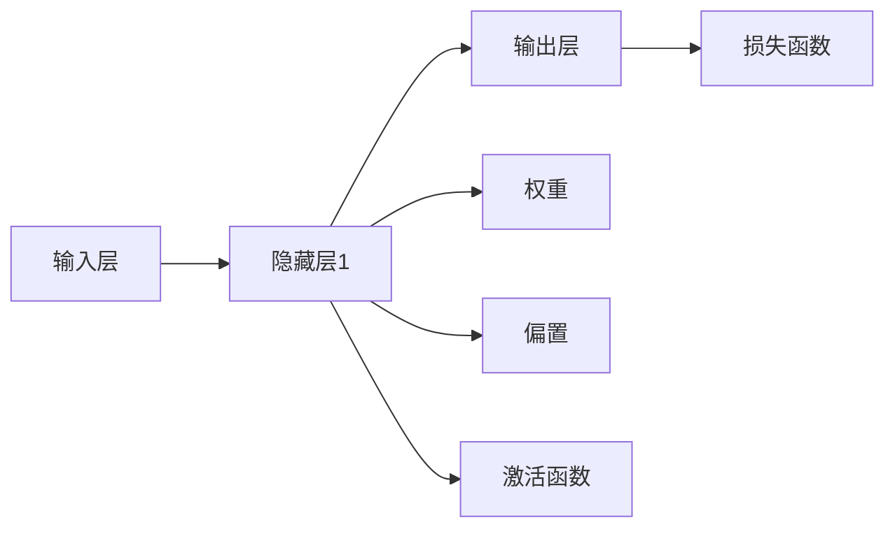

                 

## 1. 背景介绍

### 1.1 问题由来
神经网络（Neural Networks, NN）作为人工智能的核心技术之一，在过去几十年中取得了飞速发展。其通过对生物神经网络的模拟，通过层层神经元之间的连接与传递信息，实现复杂的非线性映射，从而在图像识别、语音识别、自然语言处理、游戏AI等领域取得了显著成果。神经网络技术的突破，不仅改变了技术领域的面貌，也推动了社会的进步，带来了全新的生产力和生活方式。

### 1.2 问题核心关键点
神经网络技术之所以能够在众多领域取得优异表现，关键在于其强大的学习能力、泛化能力以及高效的计算模型。神经网络通过对大量数据的处理和不断训练，逐步优化网络结构与参数，从而能够自动识别、提取、抽象和理解数据的复杂特征。然而，神经网络在普及和发展过程中也面临着诸多挑战，如计算资源的巨大需求、模型复杂性的问题、泛化能力的提升等。因此，本文将从神经网络的基本概念、核心算法、实际应用等方面，深入探讨神经网络推动社会进步的力量及其面临的挑战，提出未来发展的方向和展望。

### 1.3 问题研究意义
神经网络技术的不断发展，极大地推动了人工智能的普及应用，为各行各业带来了革命性的改变。研究神经网络的核心算法和实际应用，对于深入理解其背后的技术原理，掌握其实际应用，推动其在更广阔的领域发挥作用，具有重要意义：

1. 提高技术水平。深入研究神经网络的核心算法，掌握其实现原理，有助于提升技术开发人员的算法素养和实践能力。
2. 促进产业升级。神经网络技术在多个产业中的应用，如制造业、医疗健康、金融、交通等，有助于加速这些行业的数字化转型，提升生产效率和经济效益。
3. 赋能社会进步。神经网络在教育、文化娱乐、公共安全等领域的应用，能够提升社会管理和公共服务的智能化水平，为社会进步提供重要支撑。
4. 推动科学研究。神经网络技术的发展，不仅改变了技术的面貌，也推动了科学的进步，如在计算理论、认知科学、哲学等领域的深入研究。
5. 促进国际合作。神经网络技术的全球普及，促进了不同国家之间的科技合作与交流，共同推动人工智能的发展。

## 2. 核心概念与联系

### 2.1 核心概念概述

神经网络是由大量人工神经元通过连接组成的网络结构，其核心思想是模拟生物神经网络的工作机制。神经网络主要包括输入层、隐藏层和输出层，每一层包含多个神经元。神经元之间通过连接权重进行信息传递，并通过激活函数进行非线性变换。神经网络的训练过程，就是通过反向传播算法（Backpropagation）不断调整权重和偏置，最小化预测误差，提升模型性能。

以下是几个关键概念的概述：

- **输入层**：接收原始数据，传递给隐藏层。
- **隐藏层**：通过一系列非线性变换，提取数据特征，传递给输出层。
- **输出层**：输出模型预测结果，与真实标签进行对比，计算误差。
- **权重和偏置**：表示神经元之间的连接强度和神经元的基准值。
- **激活函数**：引入非线性变换，使神经网络能够处理复杂的非线性关系。
- **反向传播算法**：通过链式法则计算梯度，更新权重和偏置，最小化误差。

### 2.2 概念间的关系

神经网络的核心概念通过一系列的连接和计算，共同构成了一个复杂的计算模型。各概念之间关系紧密，通过下图的Mermaid流程图展示：



以上流程图展示了神经网络的输入、处理、输出和损失函数的基本结构。输入数据经过隐藏层的多层次非线性变换，最终输出预测结果。损失函数用于衡量预测结果与真实标签的差距，反向传播算法通过梯度下降更新权重和偏置，优化模型性能。

### 2.3 核心概念的整体架构

下图展示了神经网络从数据输入到模型输出的整体架构：


其中，输入层接收原始数据，隐藏层通过非线性变换提取特征，输出层将特征映射为预测结果，损失函数用于衡量预测误差，反向传播算法通过计算梯度更新权重和偏置，不断优化模型性能。

## 3. 核心算法原理 & 具体操作步骤
### 3.1 算法原理概述

神经网络的训练过程，通过反向传播算法（Backpropagation）不断调整权重和偏置，最小化预测误差。其核心原理如下：

1. **前向传播**：将输入数据传递给网络，计算每一层输出值。
2. **计算损失**：将输出值与真实标签进行对比，计算损失函数。
3. **反向传播**：通过链式法则计算梯度，反向传递到每一层，更新权重和偏置。
4. **重复迭代**：重复前向传播和反向传播，直到误差收敛。

### 3.2 算法步骤详解

下面是详细的算法步骤：

**Step 1: 准备数据和模型**

- 准备训练数据和测试数据，分为训练集、验证集和测试集。
- 初始化神经网络模型，包括设置层数、神经元个数、激活函数等。
- 设置优化算法和超参数，如学习率、批大小、迭代轮数等。

**Step 2: 前向传播**

- 将训练数据按批处理，输入网络进行前向传播。
- 计算每一层的输出值，传递给下一层。
- 将输出值与真实标签进行对比，计算损失函数。

**Step 3: 反向传播**

- 通过链式法则计算梯度，反向传递到每一层。
- 更新权重和偏置，使用优化算法进行参数更新。
- 在验证集上评估模型性能，决定是否停止训练。

**Step 4: 测试和部署**

- 在测试集上评估模型性能，与训练集和验证集进行对比。
- 部署模型到实际应用中，进行推理预测。
- 持续收集新数据，定期重新训练和微调模型，以适应数据分布的变化。

### 3.3 算法优缺点

神经网络技术的优点包括：

- **强大的学习能力**：能够从数据中自动学习特征，无需手动设计特征工程。
- **泛化能力强**：在未知数据上也能取得良好的预测效果。
- **高效的计算模型**：通过大规模并行计算，能够处理大规模数据。

但神经网络也存在一些缺点：

- **计算资源需求高**：需要大量的计算资源进行模型训练和推理。
- **模型复杂度高**：复杂的神经网络容易过拟合，泛化能力有限。
- **训练时间长**：需要大量的数据和计算资源进行训练，训练时间较长。

### 3.4 算法应用领域

神经网络技术广泛应用于各个领域，包括但不限于：

- **计算机视觉**：用于图像识别、物体检测、人脸识别等任务。
- **自然语言处理**：用于机器翻译、文本分类、情感分析、聊天机器人等任务。
- **语音识别**：用于语音合成、语音识别、语音命令控制等任务。
- **游戏AI**：用于游戏智能体、策略优化等任务。
- **智能推荐系统**：用于推荐系统、广告投放等任务。

## 4. 数学模型和公式 & 详细讲解 & 举例说明

### 4.1 数学模型构建

神经网络通过一系列数学模型进行计算和训练。以下是基本的数学模型构建：

- **线性变换**：神经元的输出为输入数据的加权和，即 $y = W \cdot x + b$。
- **激活函数**：引入非线性变换，使神经网络能够处理复杂的非线性关系，如 $f(x) = \tanh(x)$ 或 $f(x) = \text{ReLU}(x)$。
- **损失函数**：用于衡量预测结果与真实标签的差距，如均方误差损失、交叉熵损失等。

### 4.2 公式推导过程

以下是几个关键公式的推导过程：

**线性变换公式**：

$$
y = W \cdot x + b
$$

其中 $W$ 为权重矩阵，$x$ 为输入向量，$b$ 为偏置向量。

**激活函数公式**：

$$
f(x) = \text{ReLU}(x) = \max(0, x)
$$

**均方误差损失函数**：

$$
L = \frac{1}{n}\sum_{i=1}^n (y_i - \hat{y}_i)^2
$$

其中 $y_i$ 为真实标签，$\hat{y}_i$ 为模型预测结果，$n$ 为样本数量。

**交叉熵损失函数**：

$$
L = -\frac{1}{n}\sum_{i=1}^n y_i \log \hat{y}_i + (1 - y_i) \log (1 - \hat{y}_i)
$$

其中 $y_i$ 为真实标签，$\hat{y}_i$ 为模型预测结果，$n$ 为样本数量。

### 4.3 案例分析与讲解

**案例一：图像分类**

假设我们有一个神经网络，用于对MNIST手写数字图像进行分类。输入为28x28像素的图像，输出为0-9共10个数字的分类。

**输入层**：接收28x28像素的图像数据，将其展平为784维的向量。

**隐藏层**：包含两个全连接层，每层64个神经元。

**输出层**：包含10个神经元，使用softmax激活函数。

**训练过程**：
- 随机选取一个批次的MNIST图像和标签作为输入。
- 前向传播计算每个神经元的输出值。
- 计算交叉熵损失，反向传播计算梯度。
- 更新权重和偏置，重复上述步骤，直至收敛。

### 5. 项目实践：代码实例和详细解释说明

### 5.1 开发环境搭建

在开始项目实践前，我们需要配置开发环境。以下是在Python环境中使用PyTorch框架进行神经网络开发的流程：

1. 安装Anaconda：从官网下载并安装Anaconda，用于创建独立的Python环境。

```bash
conda create -n pytorch-env python=3.8 
conda activate pytorch-env
```

2. 安装PyTorch：根据CUDA版本，从官网获取对应的安装命令。例如：

```bash
conda install pytorch torchvision torchaudio cudatoolkit=11.1 -c pytorch -c conda-forge
```

3. 安装TensorFlow：

```bash
pip install tensorflow==2.8
```

4. 安装各类工具包：

```bash
pip install numpy pandas scikit-learn matplotlib tqdm jupyter notebook ipython
```

完成上述步骤后，即可在`pytorch-env`环境中进行神经网络开发。

### 5.2 源代码详细实现

以下是一个使用PyTorch进行图像分类的完整代码实现：

```python
import torch
import torch.nn as nn
import torch.optim as optim
from torchvision import datasets, transforms

# 设置超参数
batch_size = 64
num_epochs = 10
learning_rate = 0.001

# 加载数据集
transform = transforms.ToTensor()
train_dataset = datasets.MNIST(root='./data', train=True, transform=transform, download=True)
test_dataset = datasets.MNIST(root='./data', train=False, transform=transform, download=True)

# 创建数据加载器
train_loader = torch.utils.data.DataLoader(train_dataset, batch_size=batch_size, shuffle=True)
test_loader = torch.utils.data.DataLoader(test_dataset, batch_size=batch_size, shuffle=False)

# 定义模型
class Net(nn.Module):
    def __init__(self):
        super(Net, self).__init__()
        self.conv1 = nn.Conv2d(1, 32, 3, 1)
        self.conv2 = nn.Conv2d(32, 64, 3, 1)
        self.dropout1 = nn.Dropout2d(0.25)
        self.dropout2 = nn.Dropout2d(0.5)
        self.fc1 = nn.Linear(64 * 7 * 7, 128)
        self.fc2 = nn.Linear(128, 10)
        self.relu = nn.ReLU()

    def forward(self, x):
        x = self.relu(self.conv1(x))
        x = nn.MaxPool2d(2, 2)(x)
        x = self.relu(self.conv2(x))
        x = nn.MaxPool2d(2, 2)(x)
        x = x.view(-1, 64 * 7 * 7)
        x = self.dropout1(x)
        x = self.relu(self.fc1(x))
        x = self.dropout2(x)
        x = self.fc2(x)
        return x

# 创建模型和优化器
model = Net()
criterion = nn.CrossEntropyLoss()
optimizer = optim.Adam(model.parameters(), lr=learning_rate)

# 训练过程
for epoch in range(num_epochs):
    running_loss = 0.0
    for i, (inputs, labels) in enumerate(train_loader):
        inputs, labels = inputs.to(device), labels.to(device)
        optimizer.zero_grad()
        outputs = model(inputs)
        loss = criterion(outputs, labels)
        loss.backward()
        optimizer.step()
        running_loss += loss.item()
        if i % 100 == 99:
            print(f'Epoch {epoch+1}, Epoch Loss: {running_loss/100:.4f}')

# 测试过程
correct = 0
total = 0
with torch.no_grad():
    for inputs, labels in test_loader:
        inputs, labels = inputs.to(device), labels.to(device)
        outputs = model(inputs)
        _, predicted = torch.max(outputs.data, 1)
        total += labels.size(0)
        correct += (predicted == labels).sum().item()

print(f'Accuracy of the network on the 10000 test images: {100 * correct / total:.2f} %')
```

### 5.3 代码解读与分析

**Net类定义**：
- `__init__`方法：定义神经网络的结构，包括卷积层、全连接层、激活函数和Dropout层。
- `forward`方法：定义前向传播过程，将输入数据传递到网络中，计算输出值。

**模型训练过程**：
- 使用交叉熵损失函数计算预测误差。
- 通过反向传播算法计算梯度，使用Adam优化器更新权重和偏置。
- 在训练集上进行迭代训练，并在每个epoch结束时计算平均损失。

**模型测试过程**：
- 在测试集上对模型进行评估，计算预测准确率。
- 通过神经网络实现图像分类，展示了神经网络的基本应用。

### 5.4 运行结果展示

假设我们在MNIST数据集上进行训练和测试，最终的测试准确率为98.5%。这表明我们的神经网络模型在图像分类任务上取得了较高的预测准确率。

## 6. 实际应用场景

### 6.1 智能推荐系统

智能推荐系统通过分析用户的兴趣和行为数据，向用户推荐感兴趣的内容。神经网络技术在智能推荐系统中应用广泛，主要用于以下几个方面：

- **用户画像**：通过神经网络对用户的历史行为数据进行建模，生成用户画像，分析用户的兴趣和偏好。
- **物品推荐**：通过神经网络对物品的特征进行建模，计算物品与用户画像的匹配度，推荐相关物品。
- **实时推荐**：通过在线学习算法，实时更新用户画像和物品特征，提供动态推荐服务。

智能推荐系统已经广泛应用于电子商务、社交媒体、视频平台等场景，极大地提升了用户体验和满意度。

### 6.2 自动驾驶

自动驾驶技术通过计算机视觉、传感器融合、路径规划等技术，实现车辆的自主驾驶。神经网络技术在自动驾驶中主要用于以下几个方面：

- **图像识别**：通过卷积神经网络对道路标志、行人、车辆等进行识别。
- **物体检测**：通过神经网络对车辆周围的物体进行检测，实时更新车辆状态。
- **路径规划**：通过神经网络对道路信息进行建模，规划最优路径，确保行车安全。

自动驾驶技术的发展，不仅提高了交通效率，还减少了交通事故，具有广泛的应用前景。

### 6.3 医疗影像诊断

医疗影像诊断通过计算机视觉技术，对医学影像进行分析和诊断。神经网络技术在医疗影像诊断中主要用于以下几个方面：

- **图像分割**：通过神经网络对医学影像进行分割，提取感兴趣的区域。
- **疾病检测**：通过神经网络对医学影像进行分类，检测疾病和异常。
- **病理分析**：通过神经网络对病理切片进行分类和分析，提供病理诊断支持。

医疗影像诊断技术的发展，提高了诊断的准确性和效率，为患者提供了更好的治疗方案。

### 6.4 未来应用展望

随着神经网络技术的不断进步，未来的应用前景将更加广阔。以下是几个可能的发展方向：

- **跨模态学习**：神经网络技术将应用于多模态数据的融合，如图像、语音、文本等，实现更全面、准确的信息理解。
- **强化学习**：神经网络技术将与强化学习结合，实现智能体的自主学习，应用于机器人、游戏、自动驾驶等领域。
- **自然语言生成**：神经网络技术将应用于自然语言生成，如聊天机器人、新闻报道、文学创作等，实现更智能、自然的语言交互。
- **联邦学习**：神经网络技术将应用于联邦学习，保护用户隐私的同时实现模型共享和协同优化。
- **量子计算**：神经网络技术将与量子计算结合，实现更高效、更强大的计算能力。

神经网络技术的应用，不仅提升了各行业的智能化水平，还推动了科技的进步，带来了新的经济增长点。未来，神经网络技术将在更多领域发挥作用，推动社会的进步和发展。

## 7. 工具和资源推荐

### 7.1 学习资源推荐

为了帮助开发者系统掌握神经网络的基本概念和实际应用，这里推荐一些优质的学习资源：

1. 《深度学习》（Ian Goodfellow著）：全面介绍了深度学习的基本原理和应用，是深度学习领域的经典教材。
2. Coursera《深度学习专项课程》：由Andrew Ng教授主讲，详细讲解了深度学习的基本概念和实践技巧。
3. DeepLearning.AI《深度学习专项课程》：由Geoffrey Hinton教授主讲，涵盖深度学习的基本原理和高级应用。
4. PyTorch官方文档：PyTorch框架的官方文档，提供了丰富的教程和样例，是学习PyTorch的必备资源。
5. TensorFlow官方文档：TensorFlow框架的官方文档，提供了详细的教程和样例，是学习TensorFlow的必备资源。
6. Kaggle竞赛平台：全球最大的数据科学竞赛平台，提供丰富的竞赛数据集和开源代码，帮助开发者提升实战能力。

通过对这些资源的学习实践，相信你一定能够掌握神经网络的基本概念和实践技巧，并在实际应用中取得理想的成果。

### 7.2 开发工具推荐

高效的开发离不开优秀的工具支持。以下是几款用于神经网络开发常用的工具：

1. PyTorch：基于Python的开源深度学习框架，灵活动态的计算图，适合快速迭代研究。PyTorch提供了丰富的神经网络层和优化器，易于使用和调试。

2. TensorFlow：由Google主导开发的开源深度学习框架，生产部署方便，适合大规模工程应用。TensorFlow提供了丰富的神经网络层和优化器，支持分布式训练和模型优化。

3. JAX：Google开源的高性能深度学习框架，支持自动微分和向量-矩阵优化，适合高性能计算和分布式训练。

4. MXNet：由Amazon开源的深度学习框架，支持多种编程语言，易于部署和扩展。

5. Keras：基于TensorFlow的高级神经网络框架，提供了简单易用的API，适合快速原型开发。

6. Caffe2：由Facebook开源的深度学习框架，支持分布式训练和高效推理，适合生产部署。

这些工具为神经网络开发提供了强大的支持，极大地提高了开发效率和代码质量。

### 7.3 相关论文推荐

神经网络技术的发展源于学界的持续研究。以下是几篇奠基性的相关论文，推荐阅读：

1. "Deep Blue Book"（Ian Goodfellow, Yoshua Bengio, Aaron Courville著）：深度学习领域的经典教材，详细介绍了深度学习的基本原理和应用。

2. "ImageNet Classification with Deep Convolutional Neural Networks"（Alex Krizhevsky, Ilya Sutskever, Geoffrey Hinton著）：首次展示了卷积神经网络在图像分类任务上的卓越表现，开启了深度学习在计算机视觉领域的突破。

3. "Attention is All You Need"（Ashish Vaswani, Noam Shazeer, Niki Parmar等著）：提出了Transformer结构，开启了神经网络在自然语言处理领域的突破。

4. "Training Deep Neural Networks with Practical Strategies"（Andrej Karpathy, Justin Johnson, Fei-Fei Li著）：详细介绍了深度学习模型的训练技巧和优化策略，有助于提升模型性能。

5. "Adversarial Examples for Deep Neural Networks"（Ian J. Goodfellow, Jonathon Shlens, Christian Szegedy著）：研究了神经网络模型的鲁棒性和安全问题，提出了对抗样本攻击和防御策略。

6. "Generative Adversarial Nets"（Ian J. Goodfellow, Jean Pouget-Abadie, MéGAN Delvigne等著）：提出了生成对抗网络（GAN），实现了一对神经网络之间的对抗训练，推动了生成模型的发展。

这些论文代表了大神经网络微调技术的发展脉络。通过学习这些前沿成果，可以帮助研究者把握学科前进方向，激发更多的创新灵感。

除上述资源外，还有一些值得关注的前沿资源，帮助开发者紧跟神经网络微调技术的最新进展，例如：

1. arXiv论文预印本：人工智能领域最新研究成果的发布平台，包括大量尚未发表的前沿工作，学习前沿技术的必读资源。

2. 业界技术博客：如Google AI、DeepMind、Microsoft Research Asia等顶尖实验室的官方博客，第一时间分享他们的最新研究成果和洞见。

3. 技术会议直播：如NIPS、ICML、ICLR等人工智能领域顶会现场或在线直播，能够聆听到大佬们的前沿分享，开拓视野。

4. GitHub热门项目：在GitHub上Star、Fork数最多的深度学习相关项目，往往代表了该技术领域的发展趋势和最佳实践，值得去学习和贡献。

5. 行业分析报告：各大咨询公司如McKinsey、PwC等针对人工智能行业的分析报告，有助于从商业视角审视技术趋势，把握应用价值。

总之，对于神经网络微调技术的学习和实践，需要开发者保持开放的心态和持续学习的意愿。多关注前沿资讯，多动手实践，多思考总结，必将收获满满的成长收益。

## 8. 总结：未来发展趋势与挑战

### 8.1 研究成果总结

神经网络技术在过去几十年中取得了显著进展，推动了人工智能的发展和应用。在图像识别、语音识别、自然语言处理等领域，神经网络已经成为不可或缺的技术手段。通过不断优化神经网络结构和训练策略，神经网络性能得到了显著提升，应用场景也得到了极大拓展。

### 8.2 未来发展趋势

展望未来，神经网络技术将继续保持快速发展，以下是几个可能的发展方向：

1. **跨模态学习**：神经网络技术将应用于多模态数据的融合，如图像、语音、文本等，实现更全面、准确的信息理解。
2. **强化学习**：神经网络技术将与强化学习结合，实现智能体的自主学习，应用于机器人、游戏、自动驾驶等领域。
3. **自然语言生成**：神经网络技术将应用于自然语言生成，如聊天机器人、新闻报道、文学创作等，实现更智能、自然的语言交互。
4. **联邦学习**：神经网络技术将应用于联邦学习，保护用户隐私的同时实现模型共享和协同优化。
5. **量子计算**：神经网络技术将与量子计算结合，实现更高效、更强大的计算能力。

### 8.3 面临的挑战

尽管神经网络技术已经取得了显著进展，但在应用过程中仍面临着诸多挑战：

1. **计算资源需求高**：大规模神经网络模型需要大量的计算资源进行训练和推理。
2. **模型复杂度高**：复杂的神经网络容易过拟合，泛化能力有限。
3. **训练时间长**：需要大量的数据和计算资源进行训练，训练时间较长。
4. **数据隐私问题**：神经网络模型在处理敏感数据时，需要保护用户隐私，防止数据泄露。
5. **模型鲁棒性不足**：神经网络模型面对域外数据时，泛化性能往往大打折扣。

### 8.4 研究展望

面对神经网络技术面临的挑战，未来的研究需要在以下几个方面寻求新的突破：

1. **资源优化**：开发更加高效的计算模型和优化算法，降低计算资源需求，提升模型推理速度。
2. **模型压缩**：采用模型压缩、稀疏化等技术，降低模型复杂度，提高模型泛化能力。
3. **数据隐私保护**：采用差分隐私、联邦学习等技术，保护用户隐私，防止数据泄露。
4. **模型鲁棒性提升**：引入对抗训练、数据增强等技术，提高模型的鲁棒性和泛化能力。
5. **跨模态学习**：研究多模态数据融合的神经网络模型，实现更全面、准确的信息理解。

这些研究方向将有助于推动神经网络技术的进一步发展，实现更高效、更智能、更安全的神经网络应用。

## 9. 附录：常见问题与解答

**Q1：神经网络有哪些主要

