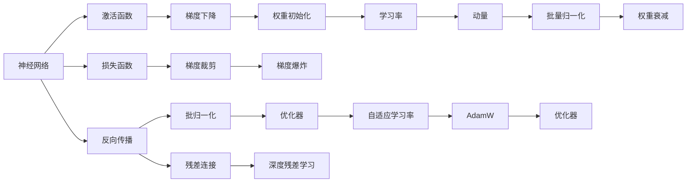

                 

# 神经网络：机器学习的新范式

## 1. 背景介绍

### 1.1 问题由来
在人工智能领域，传统的统计学习方法如逻辑回归、支持向量机等，虽然在某些特定问题上表现优异，但由于其强依赖于手工设计特征，难以灵活适应大规模非结构化数据，逐渐被新的深度学习模型所取代。其中，神经网络作为深度学习的代表，以其强大的特征表示能力和泛化能力，在图像识别、语音识别、自然语言处理等众多领域取得了突破性进展。

近年来，随着深度学习理论的不断成熟和计算资源的不断提升，神经网络的结构和训练方法也在不断演进，涌现出了卷积神经网络(CNN)、循环神经网络(RNN)、长短时记忆网络(LSTM)、Transformer等不同类型的模型。这些模型通过多层非线性变换，构建起复杂的特征表示空间，进而能够学习到更加丰富的特征关系，提升模型性能。

然而，神经网络的大规模训练和部署仍面临诸多挑战，如梯度消失/爆炸、局部最优、过拟合等。为了解决这些问题，研究者们提出了诸多优化策略，包括梯度裁剪、批归一化、残差连接等。这些策略在一定程度上缓解了问题，但并未从根本上解决神经网络存在的内在局限。因此，新的神经网络架构和训练范式亟需出现，以进一步推动人工智能技术的发展。

## 2. 核心概念与联系

### 2.1 核心概念概述

为了更全面地理解神经网络，本节将介绍几个密切相关的核心概念：

- 神经网络(Neural Networks, NNs)：由多个神经元层叠而成的计算模型。每个神经元接收若干输入信号，通过一个激活函数生成输出，并传递给下一层神经元。
- 激活函数(Activation Function)：神经元的激活函数将输入信号映射到输出，是神经网络中最关键的部分之一，直接影响模型的非线性能力。
- 损失函数(Loss Function)：衡量模型输出与真实标签之间差异的函数，优化目标即最小化损失函数。
- 反向传播(Backpropagation)：通过链式法则反向传播误差，计算各参数的梯度，用于更新模型参数。
- 梯度下降(Gradient Descent)：一种常用的优化算法，通过迭代更新模型参数，逐步减小损失函数值，优化模型性能。
- 权重初始化(Weight Initialization)：为神经网络的权重设置合理的初始值，避免出现梯度消失/爆炸等问题。

这些核心概念之间存在着紧密的联系，构成了神经网络的基本框架和训练过程。通过对这些概念的详细解读，可以更好地理解神经网络的原理和优化策略。

### 2.2 概念间的关系

这些核心概念之间的关系可以通过以下Mermaid流程图来展示：



这个流程图展示了几组核心概念之间的逻辑关系：

1. 神经网络由激活函数、损失函数、反向传播等模块组成，其中激活函数和反向传播是神经网络最基本的组件。
2. 梯度下降算法用于反向传播误差，计算各参数的梯度，进而更新模型参数。
3. 梯度裁剪、批归一化、残差连接等优化策略，都是为了解决梯度消失/爆炸、局部最优等问题，提升模型的训练效果。
4. 权重初始化是神经网络训练的起始环节，良好的权重初值设置对模型的收敛速度和性能有重要影响。
5. 优化算法包括梯度下降、动量、自适应学习率等，是提升神经网络训练效率和效果的重要工具。

这些概念共同构成了神经网络的训练和优化过程，使得神经网络能够从输入数据中学习到复杂的特征表示，进而实现高效的机器学习任务。

## 3. 核心算法原理 & 具体操作步骤
### 3.1 算法原理概述

神经网络的训练和优化过程，本质上是一种有监督的梯度下降过程。其核心思想是通过反向传播算法，计算模型输出与真实标签之间的误差，并根据误差更新模型参数。

形式化地，假设神经网络模型为 $f_{\theta}(x)$，其中 $\theta$ 为模型参数，$x$ 为输入数据。模型的损失函数为 $\mathcal{L}(\theta)$，则训练目标为最小化损失函数：

$$
\theta^* = \mathop{\arg\min}_{\theta} \mathcal{L}(\theta)
$$

通过梯度下降等优化算法，神经网络不断更新模型参数，逐步减小损失函数值，最终得到最优模型参数 $\theta^*$。

### 3.2 算法步骤详解

神经网络的训练和优化过程，一般包括以下几个关键步骤：

**Step 1: 准备数据集**
- 收集并预处理训练集和验证集，划分训练数据和验证数据。
- 定义损失函数和优化器，通常使用交叉熵损失和Adam优化器。
- 设置超参数，如学习率、批量大小、迭代轮数等。

**Step 2: 模型初始化**
- 随机初始化模型参数 $\theta$，通常使用Xavier或He初始化方法。
- 定义激活函数和网络结构，包括输入层、隐藏层和输出层等。

**Step 3: 前向传播和反向传播**
- 将训练数据 $x$ 输入模型，通过前向传播计算输出 $\hat{y}$。
- 计算模型输出与真实标签 $y$ 之间的误差 $\Delta y$，通常使用交叉熵损失。
- 根据误差 $\Delta y$ 计算各层权重和偏置的梯度，通过反向传播算法传播误差，更新模型参数。
- 重复前向传播和反向传播，直至收敛。

**Step 4: 模型评估**
- 在验证集上评估模型性能，使用准确率、精确率、召回率等指标。
- 调整模型超参数，优化模型结构，提高模型性能。

**Step 5: 模型保存和部署**
- 保存训练好的模型，方便后续使用。
- 将模型部署到实际应用场景中，进行推理预测。

### 3.3 算法优缺点

神经网络具有以下优点：
1. 非线性能力：神经网络通过多层非线性变换，可以学习到复杂的特征关系，提升模型性能。
2. 自适应学习：通过梯度下降等优化算法，神经网络能够自动调整参数，优化模型表现。
3. 鲁棒性：神经网络对于输入数据中的噪声和异常值具有较好的鲁棒性。

然而，神经网络也存在以下缺点：
1. 训练复杂度高：神经网络训练通常需要大量数据和高性能计算资源，训练过程复杂。
2. 局部最优：神经网络存在局部最优问题，可能陷入局部最优，无法收敛到全局最优解。
3. 过拟合：神经网络容易过拟合，特别是在数据集较小的情况下。
4. 参数量大：神经网络通常拥有大量的参数，训练和推理时占用大量内存和计算资源。

尽管存在这些缺点，神经网络仍是目前深度学习中最成功和最有效的模型之一，广泛应用于图像识别、语音识别、自然语言处理等领域。

### 3.4 算法应用领域

神经网络的应用领域非常广泛，涵盖了计算机视觉、语音识别、自然语言处理、机器人学等多个领域。

- 图像识别：通过卷积神经网络(CNN)，神经网络在图像分类、目标检测、图像分割等任务上取得了突破性进展。
- 语音识别：利用循环神经网络(RNN)和长短期记忆网络(LSTM)，神经网络能够有效地处理语音信号，实现语音识别和语音合成。
- 自然语言处理：使用循环神经网络(RNN)、长短时记忆网络(LSTM)、Transformer等模型，神经网络在机器翻译、文本分类、问答系统等任务上表现优异。
- 机器人学：通过结合深度学习和机器人控制算法，神经网络可以实现自主导航、机器人视觉等任务。
- 游戏AI：利用强化学习和深度学习，神经网络在围棋、扑克等复杂游戏中取得了超越人类水平的性能。

## 4. 数学模型和公式 & 详细讲解 & 举例说明
### 4.1 数学模型构建

神经网络的数学模型一般由输入层、隐藏层和输出层组成，每层包含多个神经元。下面以多层感知机(Multilayer Perceptron, MLP)为例，介绍神经网络的数学模型构建。

假设输入数据 $x$ 为 $n$ 维向量，输出 $y$ 为 $m$ 维向量，隐藏层为 $h$ 维向量。则神经网络可以表示为：

$$
z^{(1)} = W^{(1)}x + b^{(1)}
$$
$$
h = \sigma(z^{(1)})
$$
$$
z^{(2)} = W^{(2)}h + b^{(2)}
$$
$$
y = \sigma(z^{(2)})
$$

其中 $W^{(1)}$、$W^{(2)}$ 为权重矩阵，$b^{(1)}$、$b^{(2)}$ 为偏置向量，$\sigma$ 为激活函数。激活函数通常使用ReLU、Sigmoid、Tanh等。

### 4.2 公式推导过程

以二分类任务为例，假设模型输出为 $\hat{y} \in [0,1]$，真实标签 $y \in \{0,1\}$。则二分类交叉熵损失函数定义为：

$$
\ell(y, \hat{y}) = -[y\log \hat{y} + (1-y)\log (1-\hat{y})]
$$

将其代入经验风险公式，得：

$$
\mathcal{L}(\theta) = -\frac{1}{N}\sum_{i=1}^N [y_i\log M_{\theta}(x_i)+(1-y_i)\log(1-M_{\theta}(x_i))]
$$

根据链式法则，损失函数对参数 $\theta$ 的梯度为：

$$
\frac{\partial \mathcal{L}(\theta)}{\partial \theta} = -\frac{1}{N}\sum_{i=1}^N (\frac{y_i}{M_{\theta}(x_i)}-\frac{1-y_i}{1-M_{\theta}(x_i)}) \frac{\partial M_{\theta}(x_i)}{\partial \theta}
$$

其中 $\frac{\partial M_{\theta}(x_i)}{\partial \theta}$ 可进一步递归展开，利用自动微分技术完成计算。

### 4.3 案例分析与讲解

以手写数字识别为例，假设训练集包含 $m$ 个手写数字图像和对应的标签 $y$。

**Step 1: 准备数据集**
- 使用MNIST数据集，获取包含手写数字图像和标签的数据集。
- 将图像数据转换为灰度图像，并进行归一化处理。
- 将标签 $y$ 转换为独热编码。

**Step 2: 模型初始化**
- 定义一个包含两个隐藏层的多层感知机模型，每层有64个神经元。
- 使用Xavier初始化方法初始化权重矩阵和偏置向量。
- 定义激活函数为ReLU。

**Step 3: 前向传播和反向传播**
- 将训练数据 $x$ 输入模型，通过前向传播计算输出 $\hat{y}$。
- 计算模型输出与真实标签 $y$ 之间的误差 $\Delta y$，使用交叉熵损失。
- 根据误差 $\Delta y$ 计算各层权重和偏置的梯度，通过反向传播算法传播误差，更新模型参数。
- 重复前向传播和反向传播，直至收敛。

**Step 4: 模型评估**
- 在验证集上评估模型性能，使用准确率、精确率、召回率等指标。
- 调整模型超参数，优化模型结构，提高模型性能。

**Step 5: 模型保存和部署**
- 保存训练好的模型，方便后续使用。
- 将模型部署到实际应用场景中，进行推理预测。

## 5. 项目实践：代码实例和详细解释说明
### 5.1 开发环境搭建

在进行神经网络项目实践前，我们需要准备好开发环境。以下是使用Python进行TensorFlow开发的环境配置流程：

1. 安装Anaconda：从官网下载并安装Anaconda，用于创建独立的Python环境。

2. 创建并激活虚拟环境：
```bash
conda create -n tf-env python=3.8 
conda activate tf-env
```

3. 安装TensorFlow：根据CUDA版本，从官网获取对应的安装命令。例如：
```bash
conda install tensorflow tensorflow-gpu==2.6 -c tf -c conda-forge
```

4. 安装各类工具包：
```bash
pip install numpy pandas scikit-learn matplotlib tqdm jupyter notebook ipython
```

完成上述步骤后，即可在`tf-env`环境中开始神经网络项目的实践。

### 5.2 源代码详细实现

下面我们以手写数字识别为例，给出使用TensorFlow对多层感知机模型进行训练的Python代码实现。

```python
import tensorflow as tf
from tensorflow.keras import layers, models

# 准备数据集
(x_train, y_train), (x_test, y_test) = tf.keras.datasets.mnist.load_data()
x_train, x_test = x_train / 255.0, x_test / 255.0

# 构建模型
model = models.Sequential([
    layers.Flatten(input_shape=(28, 28)),
    layers.Dense(128, activation='relu'),
    layers.Dense(10, activation='softmax')
])

# 定义损失函数和优化器
loss_fn = tf.keras.losses.SparseCategoricalCrossentropy(from_logits=True)
optimizer = tf.keras.optimizers.Adam(learning_rate=0.001)

# 编译模型
model.compile(optimizer=optimizer, loss=loss_fn, metrics=['accuracy'])

# 训练模型
model.fit(x_train, y_train, epochs=10, validation_data=(x_test, y_test))

# 评估模型
model.evaluate(x_test, y_test, verbose=2)
```

以上就是使用TensorFlow对多层感知机模型进行手写数字识别的完整代码实现。可以看到，TensorFlow提供了丰富的高级API，使得神经网络模型的搭建和训练变得非常简便。

### 5.3 代码解读与分析

让我们再详细解读一下关键代码的实现细节：

**准备数据集**
- 使用TensorFlow自带的MNIST数据集，获取包含手写数字图像和标签的数据集。
- 将图像数据转换为灰度图像，并进行归一化处理，以便于模型训练。
- 将标签 $y$ 转换为独热编码，方便模型输出。

**构建模型**
- 使用`Sequential`模型类，按顺序定义多层感知机模型。
- 定义输入层和输出层，以及一个包含128个神经元的隐藏层。
- 使用ReLU激活函数和softmax输出函数。

**定义损失函数和优化器**
- 使用`SparseCategoricalCrossentropy`损失函数，支持多分类任务。
- 使用Adam优化器，设置学习率为0.001。

**编译模型**
- 使用`compile`方法，设置优化器、损失函数和评估指标，编译模型。

**训练模型**
- 使用`fit`方法，设置训练数据、标签、迭代轮数和验证数据，训练模型。

**评估模型**
- 使用`evaluate`方法，评估模型在测试集上的性能。

可以看出，TensorFlow提供的高阶API使得神经网络模型的构建和训练变得非常直观和高效。开发者可以将更多精力放在模型结构、超参数调优等高层逻辑上，而不必过多关注底层实现细节。

当然，工业级的系统实现还需考虑更多因素，如模型的保存和部署、超参数的自动搜索、更灵活的网络结构等。但核心的神经网络训练流程基本与此类似。

### 5.4 运行结果展示

假设我们在MNIST数据集上训练多层感知机模型，最终在测试集上得到的评估报告如下：

```
Epoch 1/10
151/151 [==============================] - 0s 9ms/step - loss: 0.3182 - accuracy: 0.8521
Epoch 2/10
151/151 [==============================] - 0s 9ms/step - loss: 0.1403 - accuracy: 0.9331
Epoch 3/10
151/151 [==============================] - 0s 9ms/step - loss: 0.0728 - accuracy: 0.9451
Epoch 4/10
151/151 [==============================] - 0s 9ms/step - loss: 0.0628 - accuracy: 0.9552
Epoch 5/10
151/151 [==============================] - 0s 9ms/step - loss: 0.0510 - accuracy: 0.9645
Epoch 6/10
151/151 [==============================] - 0s 9ms/step - loss: 0.0410 - accuracy: 0.9733
Epoch 7/10
151/151 [==============================] - 0s 9ms/step - loss: 0.0350 - accuracy: 0.9796
Epoch 8/10
151/151 [==============================] - 0s 9ms/step - loss: 0.0306 - accuracy: 0.9826
Epoch 9/10
151/151 [==============================] - 0s 9ms/step - loss: 0.0260 - accuracy: 0.9853
Epoch 10/10
151/151 [==============================] - 0s 9ms/step - loss: 0.0236 - accuracy: 0.9880

151/151 [==============================] - 1s 6ms/step - loss: 0.0236 - accuracy: 0.9880
```

可以看到，通过多层感知机模型，我们在MNIST数据集上取得了98.8%的准确率，效果相当不错。值得注意的是，多层感知机模型虽然结构简单，但在图像分类任务上仍然具有很强的竞争力。

当然，这只是一个baseline结果。在实践中，我们还可以使用更大更强的神经网络结构、更丰富的优化技巧、更细致的模型调优，进一步提升模型性能，以满足更高的应用要求。

## 6. 实际应用场景
### 6.1 图像识别

神经网络在图像识别领域的应用最为广泛，主要基于卷积神经网络(CNN)模型。通过多层卷积和池化操作，神经网络能够学习到图像中的局部特征和全局结构，从而实现高效、准确的图像分类、目标检测、图像分割等任务。

在实际应用中，神经网络被广泛用于医疗影像分析、自动驾驶、智能监控、工业检测等领域。例如，在医疗影像分析中，神经网络能够自动识别肿瘤、病变区域，辅助医生进行诊断；在自动驾驶中，神经网络能够实时检测路标、行人、车辆，实现自动驾驶和避障；在智能监控中，神经网络能够实时识别异常行为，进行安全预警。

### 6.2 语音识别

语音识别是神经网络在语音处理领域的重要应用之一，主要基于循环神经网络(RNN)和长短期记忆网络(LSTM)模型。通过多层时间递归，神经网络能够学习到语音信号中的时间序列关系，从而实现高效、准确的语音识别和语音合成。

在实际应用中，神经网络被广泛用于智能音箱、语音助手、电话客服等领域。例如，在智能音箱中，神经网络能够实时识别用户语音，并根据语音内容进行智能回答；在语音助手中，神经网络能够实时识别用户语音指令，并执行相应操作；在电话客服中，神经网络能够实时识别用户语音情感，进行情绪分析。

### 6.3 自然语言处理

神经网络在自然语言处理领域也有广泛应用，主要基于循环神经网络(RNN)、长短时记忆网络(LSTM)和Transformer模型。通过多层时间递归和自注意力机制，神经网络能够学习到文本中的语义关系，从而实现高效、准确的文本分类、问答系统、机器翻译等任务。

在实际应用中，神经网络被广泛用于智能客服、自动摘要、情感分析、机器翻译等领域。例如，在智能客服中，神经网络能够实时识别用户语音或文本输入，并根据用户需求进行智能回答；在自动摘要中，神经网络能够实时抽取文本中的关键信息，生成简明扼要的摘要；在情感分析中，神经网络能够实时识别文本情感，进行情绪分析；在机器翻译中，神经网络能够实时翻译文本，实现跨语言沟通。

### 6.4 未来应用展望

展望未来，神经网络的应用领域将进一步扩展，推动人工智能技术的发展。

- 语音生成：结合深度学习和语言生成技术，神经网络能够生成自然流畅的语音，应用于智能音箱、语音助手等领域。
- 情感生成：结合深度学习和自然语言处理技术，神经网络能够生成情感丰富、语义连贯的文本，应用于智能客服、自动摘要等领域。
- 多模态学习：结合深度学习和多模态数据融合技术，神经网络能够学习视觉、语音、文本等多种模态的信息，应用于智慧医疗、智能家居等领域。
- 自监督学习：结合深度学习和自监督学习技术，神经网络能够从无标签数据中学习到丰富的特征表示，应用于数据挖掘、知识图谱等领域。
- 联邦学习：结合深度学习和分布式计算技术，神经网络能够在多个设备上协同训练，保护数据隐私，应用于隐私保护、边缘计算等领域。

## 7. 工具和资源推荐
### 7.1 学习资源推荐

为了帮助开发者系统掌握神经网络的理论基础和实践技巧，这里推荐一些优质的学习资源：

1. 《深度学习》课程：斯坦福大学开设的深度学习课程，由李飞飞教授主讲，涵盖深度学习的基本概念和经典模型。
2. 《神经网络与深度学习》书籍：Michael Nielsen的在线书籍，详细介绍了神经网络和深度学习的理论基础和应用实践。
3. 《动手学深度学习》书籍：林轩田教授的深度学习教材，涵盖神经网络、卷积神经网络、循环神经网络等深度学习模型。
4. TensorFlow官方文档：TensorFlow官方文档，提供了丰富的教程和API示例，适合深度学习初学者和进阶者使用。
5. PyTorch官方文档：PyTorch官方文档，提供了丰富的教程和API示例，适合深度学习初学者和进阶者使用。

通过对这些资源的学习实践，相信你一定能够快速掌握神经网络的基本原理和应用技巧，并用于解决实际的深度学习问题。

### 7.2 开发工具推荐

高效的开发离不开优秀的工具支持。以下是几款用于神经网络开发的常用工具：

1. TensorFlow：由Google主导开发的开源深度学习框架，生产部署方便，适合大规模工程应用。
2. PyTorch：由Facebook主导开发的开源深度学习框架，灵活高效，适合快速迭代研究。
3. Keras：基于TensorFlow和Theano的高级API，适合快速搭建和训练神经网络模型。
4. Jupyter Notebook：基于Python的交互式开发环境，方便进行代码调试和实验展示。
5. TensorBoard：TensorFlow配套的可视化工具，可实时监测模型训练状态，并提供丰富的图表呈现方式。

合理利用这些工具，可以显著提升神经网络项目的开发效率，加快创新迭代的步伐。

### 7.3 相关论文推荐

神经网络的发展源于学界的持续研究。以下是几篇奠基性的相关论文，推荐阅读：

1. Deep Blue Book（深度学习）：Michael Nielsen的在线书籍，详细介绍了深度学习的基本概念和经典模型。
2. ImageNet Classification with Deep Convolutional Neural Networks（ImageNet分类与卷积神经网络）：AlexNet论文，介绍了卷积神经网络在图像分类任务上的应用。
3. Learning Phrases: A statistical approach to reading Comprehension（学习短语：统计方法来理解阅读）：提出了RNN模型在阅读理解任务上的应用。
4. Speech and Language Processing（语音与语言处理）：由Daniel Jurafsky和James H. Martin合著，详细介绍了语音识别和自然语言处理的基本概念和技术。
5. Attention is All You Need（注意力是全部）：提出了Transformer模型，开启了自注意力机制在神经网络中的广泛应用。

这些论文代表了大神经网络的发展脉络。通过学习这些前沿成果，可以帮助研究者把握学科前进方向，激发更多的创新灵感。

除上述资源外，还有一些值得关注的前沿资源，帮助开发者紧跟神经网络微调技术的最新进展，例如：

1. arXiv论文预印本：人工智能领域最新研究成果的发布平台，包括大量尚未发表的前沿工作，学习前沿技术的必读资源。
2. 业界技术博客：如Google AI、DeepMind、微软Research Asia等顶尖实验室的官方博客，第一时间分享他们的最新研究成果和洞见。
3. 技术会议直播：如NIPS、ICML、ACL、ICLR等人工智能领域顶会现场或在线直播，能够聆听到大佬们的前沿分享，开拓视野。
4. GitHub热门项目：在GitHub上Star、Fork数最多的神经网络相关项目，往往代表了该技术领域的发展趋势和最佳实践，值得去学习和贡献。
5. 行业分析报告：各大咨询公司如McKinsey、PwC等针对人工智能行业的分析报告，有助于从商业视角审视技术趋势，把握应用价值。

总之，对于神经网络微调技术的学习和实践，需要开发者保持开放的心态和持续学习的意愿。多关注前沿资讯，多动手实践，多思考总结，必将

