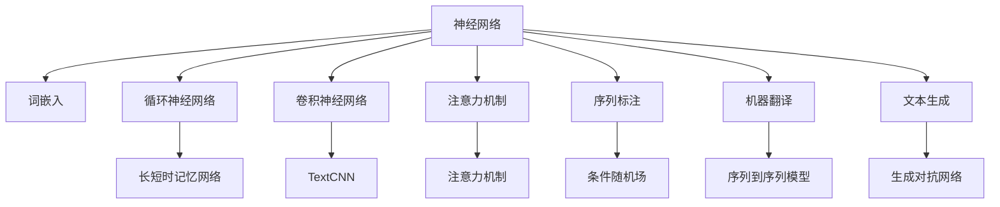

                 

## 1. 背景介绍

### 1.1 问题由来

近年来，随着深度学习技术的快速发展，特别是神经网络在计算机视觉、语音识别等领域的巨大成功，自然语言处理（Natural Language Processing, NLP）领域也开始探索和应用这一技术。然而，由于自然语言本身的复杂性和歧义性，传统的基于规则和统计的NLP方法在处理诸如语义理解、情感分析、机器翻译等任务时，面临诸多挑战。因此，如何借助神经网络实现自然语言处理的新突破，成为研究者和工程师共同关注的焦点。

### 1.2 问题核心关键点

神经网络在自然语言处理中的应用主要包括以下几个方面：

- **词嵌入学习**：将词汇映射到低维向量空间，捕捉词汇之间的语义关系。
- **序列建模**：使用循环神经网络（RNN）、卷积神经网络（CNN）、变压器（Transformer）等模型，对文本序列进行建模，捕捉上下文信息。
- **注意力机制**：引入注意力机制，使得模型能够动态聚焦于文本序列中的重要部分，提高模型性能。
- **序列标注与生成**：使用条件随机场（CRF）、变分自编码器（VAE）等方法，对文本进行序列标注或生成任务。

神经网络在NLP领域的应用，使得模型能够自动学习复杂的语言特征，逐步取代传统的特征工程方法，成为NLP任务的主流技术。

### 1.3 问题研究意义

神经网络在自然语言处理中的应用，极大地提升了NLP任务的性能，加速了NLP技术的产业化进程。其研究意义主要体现在以下几个方面：

1. **提升任务性能**：神经网络能够自动学习复杂的语言特征，尤其是在序列建模和注意力机制的帮助下，模型在情感分析、机器翻译、文本生成等任务上取得了显著的进步。
2. **加速技术开发**：神经网络使模型训练和优化过程自动化，大幅缩短了NLP技术的开发周期。
3. **推动跨学科融合**：神经网络的应用促进了NLP与其他学科的交叉融合，如与心理学、社会学等结合，推动了认知科学的发展。
4. **拓展应用场景**：神经网络使得NLP技术能够应用于更多场景，如智能客服、金融舆情监测、个性化推荐等，提升用户体验和服务效率。
5. **激发创新活力**：神经网络提供了更多的自由度和灵活性，激发研究者探索新的方法和技术，推动NLP领域的创新发展。

## 2. 核心概念与联系

### 2.1 核心概念概述

为更好地理解神经网络在自然语言处理中的应用，本节将介绍几个密切相关的核心概念：

- **神经网络（Neural Network）**：一种基于人工神经元（neuron）的计算模型，能够对数据进行自动特征提取和复杂关系建模。
- **词嵌入（Word Embedding）**：将词汇映射到高维或低维向量空间，捕捉词汇之间的语义关系，常用的词嵌入方法有Word2Vec、GloVe等。
- **循环神经网络（RNN）**：能够处理序列数据的神经网络，通过反向传播算法进行训练，常用的RNN有LSTM、GRU等。
- **卷积神经网络（CNN）**：对文本进行卷积操作，提取局部特征，常用的CNN有TextCNN等。
- **注意力机制（Attention Mechanism）**：通过动态权重计算模型对文本序列中不同部分的关注度，提高模型性能。
- **序列标注（Sequence Labeling）**：将文本序列中的词汇映射到标签序列，常用的模型有CRF、BiLSTM-CRF等。
- **机器翻译（Machine Translation）**：将一种语言翻译成另一种语言，常用的模型有Seq2Seq、Transformer等。
- **文本生成（Text Generation）**：生成符合语法和语义的文本，常用的模型有GAN、VAE等。

这些核心概念之间的逻辑关系可以通过以下Mermaid流程图来展示：



这个流程图展示了神经网络在自然语言处理中的核心应用场景，包括词嵌入、循环神经网络、卷积神经网络、注意力机制、序列标注、机器翻译和文本生成。通过理解这些核心概念，我们可以更好地把握神经网络在NLP中的应用方向。

### 2.2 概念间的关系

这些核心概念之间存在着紧密的联系，形成了神经网络在自然语言处理中的完整生态系统。下面我们通过几个Mermaid流程图来展示这些概念之间的关系。

#### 2.2.1 神经网络的应用场景

```mermaid
graph LR
    A[神经网络] --> B[词嵌入]
    A --> C[循环神经网络]
    A --> D[卷积神经网络]
    A --> E[注意力机制]
    B --> F[序列标注]
    B --> G[机器翻译]
    C --> H[长短时记忆网络]
    D --> I[TextCNN]
    E --> J[注意力机制]
    F --> K[条件随机场]
    G --> L[序列到序列模型]
    H --> M[长短时记忆网络]
    I --> N[TextCNN]
    J --> O[注意力机制]
    K --> P[条件随机场]
    L --> Q[序列到序列模型]
    M --> R[长短时记忆网络]
    N --> S[TextCNN]
    O --> T[注意力机制]
    P --> U[条件随机场]
    Q --> V[序列到序列模型]
    R --> W[长短时记忆网络]
    S --> X[TextCNN]
    T --> Y[注意力机制]
    U --> Z[条件随机场]
    V --> AA[序列到序列模型]
    W --> AB[长短时记忆网络]
    X --> AC[TextCNN]
    Y --> AD[注意力机制]
    Z --> AE[条件随机场]
    AA --> AF[序列到序列模型]
    AB --> AG[长短时记忆网络]
    AC --> AH[TextCNN]
    AD --> AI[注意力机制]
    AE --> AJ[条件随机场]
    AF --> AK[序列到序列模型]
    AG --> AL[长短时记忆网络]
    AH --> AM[TextCNN]
    AI --> AN[注意力机制]
    AJ --> AO[条件随机场]
    AK --> AP[序列到序列模型]
    AL --> AQ[长短时记忆网络]
    AM --> AR[TextCNN]
    AN --> AS[注意力机制]
    AO --> AT[条件随机场]
    AP --> AU[序列到序列模型]
    AQ --> AV[长短时记忆网络]
    AR --> AW[TextCNN]
    AS --> AX[注意力机制]
    AT --> AY[条件随机场]
    AU --> AZ[序列到序列模型]
    AV --> BA[长短时记忆网络]
    AW --> BB[TextCNN]
    AX --> BC[注意力机制]
    AY --> BD[条件随机场]
    AZ --> BE[序列到序列模型]
    BA --> BF[长短时记忆网络]
    BB --> BG[TextCNN]
    BC --> BH[注意力机制]
    BD --> BI[条件随机场]
    BE --> BJ[序列到序列模型]
    BF --> BK[长短时记忆网络]
    BG --> BL[TextCNN]
    BH --> BM[注意力机制]
    BI --> BN[条件随机场]
    BJ --> BQ[序列到序列模型]
    BK --> BR[长短时记忆网络]
    BL --> BS[TextCNN]
    BM --> BT[注意力机制]
    BN --> BU[条件随机场]
    BQ --> BV[序列到序列模型]
    BR --> BW[长短时记忆网络]
    BS --> BX[TextCNN]
    BT --> BY[注意力机制]
    BU --> BZ[条件随机场]
    BV --> CA[序列到序列模型]
    BW --> CB[长短时记忆网络]
    BX --> CC[TextCNN]
    BY --> CD[注意力机制]
    BZ --> CE[条件随机场]
    CA --> CF[序列到序列模型]
    CB --> CG[长短时记忆网络]
    CC --> CH[TextCNN]
    CD --> CI[注意力机制]
    CE --> CJ[条件随机场]
    CF --> CK[长短时记忆网络]
    CG --> CL[TextCNN]
    CH --> CM[注意力机制]
    CI --> CN[条件随机场]
    CJ --> CO[序列到序列模型]
    CK --> CP[长短时记忆网络]
    CL --> CQ[TextCNN]
    CM --> CR[注意力机制]
    CN --> CS[条件随机场]
    CO --> CU[序列到序列模型]
    CP --> CV[长短时记忆网络]
    CQ --> CW[TextCNN]
    CR --> CX[注意力机制]
    CS --> CY[条件随机场]
    CU --> CZ[序列到序列模型]
    CV --> DA[长短时记忆网络]
    CW --> DB[TextCNN]
    CX --> DC[注意力机制]
    CY --> DD[条件随机场]
    CZ --> DE[序列到序列模型]
    DA --> DF[长短时记忆网络]
    DB --> DG[TextCNN]
    DC --> DH[注意力机制]
    DD --> DI[条件随机场]
    DE --> DJ[序列到序列模型]
    DF --> DK[长短时记忆网络]
    DG --> DL[TextCNN]
    DH --> DM[注意力机制]
    DI --> DN[条件随机场]
    DJ --> DO[序列到序列模型]
    DK --> DP[长短时记忆网络]
    DL --> DM[TextCNN]
    DM --> DN[注意力机制]
    DN --> DO[条件随机场]
    DO --> DP[序列到序列模型]
    DP --> DQ[长短时记忆网络]
    DQ --> DR[TextCNN]
    DR --> DS[注意力机制]
    DS --> DT[条件随机场]
    DT --> DU[序列到序列模型]
    DU --> DV[长短时记忆网络]
    DV --> DW[TextCNN]
    DW --> DX[注意力机制]
    DX --> DY[条件随机场]
    DY --> DZ[序列到序列模型]
    DZ --> EA[长短时记忆网络]
    EA --> EB[TextCNN]
    ED --> EC[注意力机制]
    EE --> ED[条件随机场]
    EF --> EG[序列到序列模型]
    EG --> EH[长短时记忆网络]
    EH --> EI[TextCNN]
    EI --> EJ[注意力机制]
    EJ --> EK[条件随机场]
    EK --> EL[序列到序列模型]
    EL --> EM[长短时记忆网络]
    EM --> EN[TextCNN]
    EN --> EO[注意力机制]
    EO --> EP[条件随机场]
    EP --> EQ[序列到序列模型]
    EQ --> ER[长短时记忆网络]
    ER --> ES[TextCNN]
    ES --> ET[注意力机制]
    ET --> EU[条件随机场]
    EU --> EV[序列到序列模型]
    EV --> EW[长短时记忆网络]
    EW --> EX[TextCNN]
    EX --> EY[注意力机制]
    EY --> EZ[条件随机场]
    EZ --> FA[序列到序列模型]
    FA --> FB[长短时记忆网络]
    FB --> FC[TextCNN]
    FC --> FD[注意力机制]
    FD --> FE[条件随机场]
    FE --> FF[序列到序列模型]
    FF --> FG[长短时记忆网络]
    FG --> FH[TextCNN]
    FH --> FI[注意力机制]
    FI --> FJ[条件随机场]
    FJ --> FK[序列到序列模型]
    FK --> FL[长短时记忆网络]
    FL --> FM[TextCNN]
    FM --> FN[注意力机制]
    FN --> FO[条件随机场]
    FO --> FP[序列到序列模型]
    FP --> FQ[长短时记忆网络]
    FQ --> FR[TextCNN]
    FR --> FS[注意力机制]
    FS --> FT[条件随机场]
    FT --> FU[序列到序列模型]
    FU --> FV[长短时记忆网络]
    FV --> FW[TextCNN]
    FW --> FX[注意力机制]
    FX --> FY[条件随机场]
    FY --> FZ[序列到序列模型]
    FZ --> GA[长短时记忆网络]
    GA --> GB[TextCNN]
    GC --> GD[注意力机制]
    GD --> GE[条件随机场]
    GE --> GF[序列到序列模型]
    GF --> GG[长短时记忆网络]
    GG --> GH[TextCNN]
    GH --> GI[注意力机制]
    GI --> GJ[条件随机场]
    GJ --> GK[序列到序列模型]
    GK --> GL[长短时记忆网络]
    GL --> GM[TextCNN]
    GM --> GN[注意力机制]
    GN --> GO[条件随机场]
    GO --> GP[序列到序列模型]
    GP --> GQ[长短时记忆网络]
    GQ --> GR[TextCNN]
    GR --> GS[注意力机制]
    GS --> GT[条件随机场]
    GT --> GU[序列到序列模型]
    GU --> GV[长短时记忆网络]
    GV --> GW[TextCNN]
    GW --> GX[注意力机制]
    GX --> GY[条件随机场]
    GY --> GZ[序列到序列模型]
    GZ --> HA[长短时记忆网络]
    HA --> HB[TextCNN]
    HC --> HD[注意力机制]
    HD --> HE[条件随机场]
    HE --> HF[序列到序列模型]
    HF --> HG[长短时记忆网络]
    HG --> HH[TextCNN]
    HH --> HI[注意力机制]
    HI --> HJ[条件随机场]
    HJ --> HK[序列到序列模型]
    HK --> HL[长短时记忆网络]
    HL --> HM[TextCNN]
    HM --> HN[注意力机制]
    HN --> HO[条件随机场]
    HO --> HP[序列到序列模型]
    HP --> HQ[长短时记忆网络]
    HQ --> HR[TextCNN]
    HR --> HS[注意力机制]
    HS --> HT[条件随机场]
    HT --> HU[序列到序列模型]
    HU --> HV[长短时记忆网络]
    HV --> HW[TextCNN]
    HW --> HX[注意力机制]
    HX --> HY[条件随机场]
    HY --> HZ[序列到序列模型]
    HZ --> IA[长短时记忆网络]
    IA --> IB[TextCNN]
    IC --> ID[注意力机制]
    ID --> IE[条件随机场]
    IE --> IF[序列到序列模型]
    IF --> IG[长短时记忆网络]
    IG --> IH[TextCNN]
    IH --> II[注意力机制]
    II --> IJ[条件随机场]
    IJ --> IK[序列到序列模型]
    IK --> IL[长短时记忆网络]
    IL --> IM[TextCNN]
    IM --> IN[注意力机制]
    IN --> IO[条件随机场]
    IO --> IP[序列到序列模型]
    IP --> IQ[长短时记忆网络]
    IQ --> IR[TextCNN]
    IR --> IS[注意力机制]
    IS --> IT[条件随机场]
    IT --> IU[序列到序列模型]
    IU --> IV[长短时记忆网络]
    IV --> IW[TextCNN]
    IW --> IX[注意力机制]
    IX --> IY[条件随机场]
    IY --> IZ[序列到序列模型]
    IZ --> JA[长短时记忆网络]
    JA --> JB[TextCNN]
    JC --> JD[注意力机制]
    JD --> JE[条件随机场]
    JE --> JF[序列到序列模型]
    JF --> JG[长短时记忆网络]
    JG --> JH[TextCNN]
    JH --> JI[注意力机制]
    JI --> JJ[条件随机场]
    JJ --> JK[序列到序列模型]
    JK --> JL[长短时记忆网络]
    JL --> JM[TextCNN]
    JM --> JN[注意力机制]
    JN --> JO[条件随机场]
    JO --> JP[序列到序列模型]
    JP --> JQ[长短时记忆网络]
    JQ --> JR[TextCNN]
    JR --> JS[注意力机制]
    JS --> JT[条件随机场]
    JT --> JU[序列到序列模型]
    JU --> JV[长短时记忆网络]
    JV --> JW[TextCNN]
    JW --> JX[注意力机制]
    JX --> JY[条件随机场]
    JY --> JZ[序列到序列模型]
    JZ -->KA[长短时记忆网络]
    KA --> KB[TextCNN]
    KC --> KD[注意力机制]
    KD --> KE[条件随机场]
    KE --> KF[序列到序列模型]
    KF --> KG[长短时记忆网络]
    KG --> KH[TextCNN]
    KH --> KI[注意力机制]
    KI --> KJ[条件随机场]
    KJ --> KK[序列到序列模型]
    KK --> KL[长短时记忆网络]
    KL --> KM[TextCNN]
    KM --> KN[注意力机制]
    KN --> KO[条件随机场]
    KO --> KP[序列到序列模型]
    KP --> KQ[长短时记忆网络]
    KQ --> KR[TextCNN]
    KR --> KS[注意力机制]
    KS --> KT[条件随机场]
    KT --> KU[序列到序列模型]
    KU --> KV[长短时记忆网络]
    KV --> KW[TextCNN]
    KW --> KX[注意力机制]
    KX --> KY[条件随机场]
    KY --> KZ[序列到序列模型]
    KZ --> LA[长短时记忆网络]
    LA --> LB[TextCNN]
    LC --> LD[注意力机制]
    LD --> LE[条件随机场]
    LE --> LF[序列到序列模型]
    LF --> LG[长短时记忆网络]
    LG --> LH[TextCNN]
    LH --> LI[注意力机制]
    LI --> LJ[条件随机场]
    LJ --> LK[序列到序列模型]
    LK --> LL[长短时记忆网络]
    LL --> LM[TextCNN]
    LM --> LN[注意力机制]
    LN --> LO[条件随机场]
    LO --> LP[序列到序列模型]
    LP --> LQ[长短时记忆网络]
    LQ --> LR[TextCNN]
    LR --> LS[注意力机制]
    LS --> LT[条件随机场]
    LT --> LU[序列到序列模型]
    LU --> LV[长短时记忆网络]
    LV --> LW[TextCNN]
    LW --> LX[注意力机制]
    LX --> LY[条件随机场]
    LY --> LZ[序列到序列模型]
    LZ --> MA[长短时记忆网络]
    MA --> MB[TextCNN]
    MC --> MD[注意力机制]
    MD --> ME[条件随机场]
    ME --> MF[序列到序列模型]
    MF --> MG[长短时记忆网络]
    MG --> MH[TextCNN]
    MH --> MI[注意力机制]
    MI --> MJ[条件随机场]
    MJ --> MK[序列到序列模型]
    MK --> ML[长短时记忆网络]
    ML --> MM[TextCNN]
    MM --> MN[注意力机制]
    MN --> MO[条件随机场]
    MO --> MP[序列到序列模型]
    MP --> MQ[长短时记忆网络]
    MQ --> MR[TextCNN]
    MR --> MS[注意力机制]
    MS --> MT[条件随机场]
    MT --> MU[序列到序列模型]
    MU --> MV[长短时记忆网络]
    MV --> MW[TextCNN]
    MW --> MX[注意力机制]
    MX --> MY[条件随机场]
    MY --> MZ[序列到序列模型]
    MZ --> NA[长短时记忆网络]
    NA --> NB[TextCNN]
    NC --> ND[注意力机制]
    ND --> NE[条件随机场]
    NE --> NF[序列到序列模型]
    NF --> NG[长短时记忆网络]
    NG --> NH[TextCNN]
    NH --> NI[注意力机制]
    NI --> NJ[条件随机场]
    NJ --> NK[序列到序列模型]
    NK --> NL[长短时记忆网络]
    NL --> NM[TextCNN]
    NM --> NN[注意力机制]
    NN --> NO[条件随机场]
    NO --> NP[序列到序列模型]
    NP --> NQ[长短时记忆网络]
    NQ --> NR[TextCNN]
    NR --> NS[注意力机制]
    NS --> NT[条件随机场]
    NT --> NU[序列到序列模型]
    NU --> NV[长短时记忆网络]
    NV --> NW[TextCNN]
    NW --> NX[注意力机制]
    NX --> NY[条件随机场]
    NY --> NZ[序列到序列模型]
    NZ --> OA[长短时记忆网络]
    OA --> OB[TextCNN]
    OC --> OD[注意力机制]
    OD --> OE[条件随机场]
    OE --> OF[序列到序列模型]
    OF --> OG[长短时记忆网络]
    OG --> OH[TextCNN]
    OH --> OI[注意力机制]
    OI --> OJ[条件随机场]
    OJ --> OK[序列到序列模型]
    OK --> OL[长短时记忆网络]
    OL --> OM[TextCNN]
    OM --> ON[注意力机制]
    ON --> OO[条件随机场]
    OO --> OP[序列到序列模型]
    OP --> OQ[长短时记忆网络]
    OQ --> OR[TextCNN]
    OR --> OS[注意力机制]
    OS --> OT[条件随机场]
    OT --> OU[序列到序列模型]
    OU -->OV[长短时记忆网络]
    OV --> OW[TextCNN]
    OW --> OX[注意力机制]
    OX --> OY[条件随机场]
    OY --> OZ[序列到序列模型]
    OZ --> PA[长短时记忆网络]
    PA --> PB[TextCNN]
    PC --> PD[注意力机制]
    PD --> PE[条件随机场]
    PE --> PF[序列到序列模型]
    PF --> PG[长短时记忆网络]
    PG --> PH[TextCNN]
    PH --> PI[注意力机制]
    PI --> PJ[条件随机场]
    PJ --> PK[序列到序列模型]
    PK --> PL[长短时记忆网络]
    PL --> PM[TextCNN]
    PM --> PN[注意力机制]
    PN --> PO[条件随机场]
    PO --> PP[序列到序列模型]
    PP --> PQ[长短时记忆网络]
    PQ --> PR[TextCNN]
    PR --> PS[注意力机制]
    PS --> PT[条件随机场]
    PT -->PU[序列到序列模型]
    PU --> PV[长短时记忆网络]
    PV --> PW[TextCNN]
    PW --> PX[注意力机制]
    PX --> PY[条件随机场]
    PY --> PZ[序列到序列模型]
    PZ --> QA[长短时记忆网络]
    QA --> QB[TextCNN]
    QC --> QD[注意力机制]
    QD --> QE[条件随机场]
    QE --> QF[序列到序列模型]
    QF --> QG[长短时记忆网络]
    QG --> QH[TextCNN]
    QH --> QI[注意力机制]
    QI --> QJ[条件随机场]
    QJ --> QK[序列到序列模型]
    QK --> QL[长短时记忆网络]
    QL --> QM[TextCNN]
    QM --> QN[注意力机制]
    QN --> QO[条件随机场]
    QO --> QP[序列到序列模型]
    QP --> QQ[长短时记忆网络]
    QQ --> QR[TextCNN]
    QR --> QS[注意力机制]
    QS --> QT[条件随机场]
    QT --> QU[序列到序列模型]
    QU --> QV[长短时记忆网络]
    QV --> QW[TextCNN]
    QW --> QX[注意力机制]
    QX --> QY[条件随机场]
    QY --> QZ[序列到序列模型]
    QZ --> RA[长短时记忆网络]
    RA --> RB[TextCNN]
    RC --> RD[注意力机制]
    RD --> RE[条件随机场]
    RE --> RF[序列到序列模型]
    RF --> RG[长短时记忆网络]
    RG --> RH[TextCNN]
    RH --> RI[注意力机制]
    RI --> RJ[条件随机场]
    RJ --> RK[序列到序列模型]
    RK --> RL[长短时记忆网络]
    RL --> RM[TextCNN]
    RM --> RN[注意力机制]
    RN --> RO[条件随机场]
    RO --> RP[序列到序列模型]
    RP --> RQ[长短时记忆网络]
    RQ --> RR[TextCNN]
    RR --> RS[注意力机制]
    RS --> RT[条件随机场]
    RT --> RU[序列到序列模型]
    RU --> RV[长短时记忆网络]
    RV --> RW[TextCNN]
    RW --> RX[注意力机制]
    RX --> RY[条件随机场]
    RY --> RZ[序列到序列模型]
    RZ --> SA[长短时记忆网络]
    SA --> SB[TextCNN]
    SC --> SD[注意力机制]
    SD --> SE[条件随机场]
    SE --> SF[序列到序列模型]
    SF --> SG[长短时记忆网络]
    SG --> SH[TextCNN]
    SH --> SI[注意力机制]
    SI --> SJ[条件随机场]
    SJ --> SK[序列到序列模型]
    SK --> SL[长短时记忆网络]
    SL --> SM[TextCNN]
    SM --> SN[注意力机制]
    SN --> SO[条件随机场]
    SO --> SP[序列到序列模型]
    SP --> SQ[长短时记忆网络]
    SQ --> SR[TextCNN]
    SR --> SS[注意力机制]
    SS --> ST

