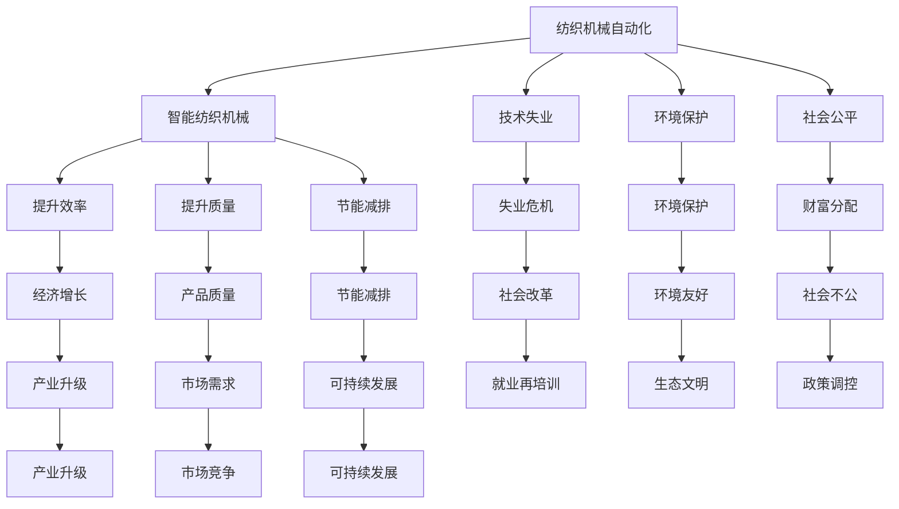
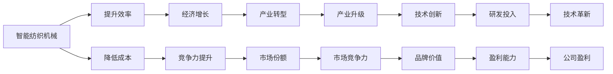
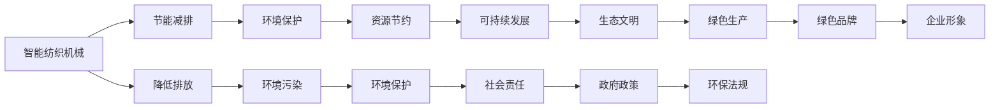
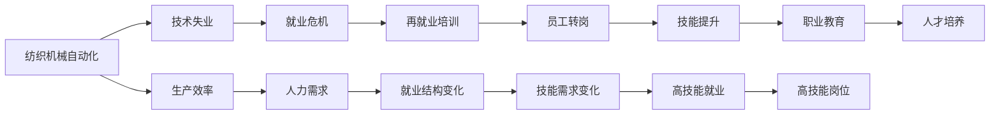
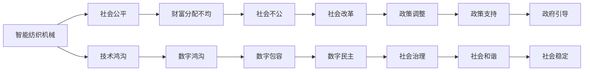

                 

# 纺织机械自动化的社会效应

## 1. 背景介绍

### 1.1 问题由来

纺织机械自动化是纺织工业现代化进程中的重要环节，其社会效应涉及经济、环境、就业、社会结构等多个方面。传统纺织机械自动化主要依赖于机械设备进行生产和加工，而现代的智能纺织机械则利用先进的技术手段，如计算机视觉、机器人技术、人工智能等，实现了更高程度的自动化。

近年来，随着科技的不断进步，纺织机械自动化迎来了全新的变革。智能化、网络化、个性化等特征成为新一轮发展的方向。这种技术变革对纺织工业乃至整个社会都产生了深远的影响。

### 1.2 问题核心关键点

纺织机械自动化在带来经济效益的同时，也引发了一系列社会问题，如就业结构变化、技术失业、环境保护、社会公平等。本文将围绕这些核心问题，探讨纺织机械自动化在经济、环境、就业、社会结构等方面的社会效应。

### 1.3 问题研究意义

研究纺织机械自动化的社会效应，对于理解智能化转型对传统行业的影响，制定合理的政策和措施，以及指导未来的技术发展方向具有重要意义。通过深入分析，可以帮助相关部门和行业领导者更好地应对自动化带来的挑战，把握发展机遇，实现经济的可持续发展。

## 2. 核心概念与联系

### 2.1 核心概念概述

- **纺织机械自动化**：指在纺织生产过程中，使用自动化设备替代人工操作，提升生产效率和产品质量的过程。现代纺织机械自动化涉及机械设备、电子技术、计算机视觉、机器人技术等多方面的融合。

- **智能纺织机械**：利用人工智能、物联网、大数据等技术，实现纺织生产过程的智能化、自动化，包括生产计划制定、材料选择、工艺优化、质量控制等环节的自动化。

- **技术失业**：由于自动化技术的发展，部分传统手工操作岗位被机械或软件取代，导致工人失业的现象。

- **环境保护**：在纺织生产中，传统的机械设备对环境污染较大，如废水、废气排放等。而智能纺织机械通过节能减排技术，对环境的影响相对较小。

- **社会公平**：纺织机械自动化在提升生产效率的同时，也可能加剧社会财富分配的不均，引发就业和社会公平问题。

这些核心概念之间的逻辑关系可以通过以下Mermaid流程图来展示：



这个流程图展示了大规模纺织机械自动化对经济、环境、就业、社会结构等方面的影响，并指出了相应的应对策略。

### 2.2 概念间的关系

这些核心概念之间存在着紧密的联系，形成了一个复杂但有序的系统。下面我通过几个Mermaid流程图来展示这些概念之间的关系。

#### 2.2.1 经济效应



这个流程图展示了智能纺织机械对经济效应的影响，包括生产效率提升、成本降低、市场竞争力提升等。

#### 2.2.2 环境效应



这个流程图展示了智能纺织机械对环境效应的影响，包括节能减排、环境保护、可持续发展等方面。

#### 2.2.3 就业效应



这个流程图展示了纺织机械自动化对就业效应的影响，包括技术失业、再就业培训、就业结构变化等。

#### 2.2.4 社会结构效应



这个流程图展示了智能纺织机械对社会结构效应的影响，包括社会公平、财富分配不均、技术鸿沟等方面。

### 2.3 核心概念的整体架构

最后，我们用一个综合的流程图来展示这些核心概念在大规模纺织机械自动化中的整体架构：

```mermaid
graph TB
    A[智能纺织机械] --> B[提升效率]
    A --> C[降低成本]
    A --> D[节能减排]
    A --> E[环境保护]
    B --> F[生产质量]
    C --> G[竞争优势]
    D --> H[可持续发展]
    E --> I[社会公平]
    F --> J[市场需求]
    G --> K[经济增长]
    H --> L[生态文明]
    I --> M[财富分配]
    J --> N[市场扩张]
    K --> O[产业升级]
    L --> P[绿色生产]
    M --> Q[社会不公]
    N --> R[市场竞争力]
    O --> S[技术创新]
    P --> T[资源节约]
    Q --> U[政策调控]
    R --> V[产业转型]
    S --> W[研发投入]
    T --> X[节能减排]
    U --> Y[社会改革]
    V --> Z[产业升级]
    W --> AA[技术革新]
    X --> BB[资源节约]
    Y --> CC[就业再培训]
    Z --> DD[技能提升]
    AA --> EE[技能需求变化]
    BB --> FF[技能提升]
    CC --> GG[再就业培训]
    DD --> HH[高技能就业]
    EE --> II[职业教育]
    FF --> JJ[人才培养]
    GG --> KK[高技能岗位]
    HH --> LL[社会治理]
    II --> MM[社会稳定]
    JJ --> NN[政府引导]
    KK --> OO[社会和谐]
    LL --> PP[社会治理]
    MM --> QQ[社会治理]
    NN --> RR[政府引导]
    OO --> SS[社会稳定]
    PP --> TT[社会稳定]
    QQ --> UU[社会稳定]
    RR --> VV[政府引导]
    SS --> WW[社会稳定]
    TT --> XX[社会稳定]
    UU --> YY[社会稳定]
    VV --> ZZ[社会稳定]
    WW --> AA[社会稳定]
    XX --> BB[社会稳定]
    YY --> CC[社会稳定]
    ZZ --> DD[社会稳定]
    AA --> EE[社会稳定]
    BB --> FF[社会稳定]
    CC --> GG[社会稳定]
    DD --> HH[社会稳定]
    EE --> II[社会稳定]
    FF --> JJ[社会稳定]
    GG --> KK[社会稳定]
    HH --> LL[社会稳定]
    II --> MM[社会稳定]
    JJ --> NN[社会稳定]
    KK --> OO[社会稳定]
    LL --> PP[社会稳定]
    MM --> QQ[社会稳定]
    NN --> RR[社会稳定]
    OO --> SS[社会稳定]
    PP --> TT[社会稳定]
    QQ --> UU[社会稳定]
    RR --> VV[社会稳定]
    SS --> WW[社会稳定]
    TT --> XX[社会稳定]
    UU --> YY[社会稳定]
    VV --> ZZ[社会稳定]
    WW --> AA[社会稳定]
    XX --> BB[社会稳定]
    YY --> CC[社会稳定]
    ZZ --> DD[社会稳定]
    AA --> EE[社会稳定]
    BB --> FF[社会稳定]
    CC --> GG[社会稳定]
    DD --> HH[社会稳定]
    EE --> II[社会稳定]
    FF --> JJ[社会稳定]
    GG --> KK[社会稳定]
    HH --> LL[社会稳定]
    II --> MM[社会稳定]
    JJ --> NN[社会稳定]
    KK --> OO[社会稳定]
    LL --> PP[社会稳定]
    MM --> QQ[社会稳定]
    NN --> RR[社会稳定]
    OO --> SS[社会稳定]
    PP --> TT[社会稳定]
    QQ --> UU[社会稳定]
    RR --> VV[社会稳定]
    SS --> WW[社会稳定]
    TT --> XX[社会稳定]
    UU --> YY[社会稳定]
    VV --> ZZ[社会稳定]
    WW --> AA[社会稳定]
    XX --> BB[社会稳定]
    YY --> CC[社会稳定]
    ZZ --> DD[社会稳定]
    AA --> EE[社会稳定]
    BB --> FF[社会稳定]
    CC --> GG[社会稳定]
    DD --> HH[社会稳定]
    EE --> II[社会稳定]
    FF --> JJ[社会稳定]
    GG --> KK[社会稳定]
    HH --> LL[社会稳定]
    II --> MM[社会稳定]
    JJ --> NN[社会稳定]
    KK --> OO[社会稳定]
    LL --> PP[社会稳定]
    MM --> QQ[社会稳定]
    NN --> RR[社会稳定]
    OO --> SS[社会稳定]
    PP --> TT[社会稳定]
    QQ --> UU[社会稳定]
    RR --> VV[社会稳定]
    SS --> WW[社会稳定]
    TT --> XX[社会稳定]
    UU --> YY[社会稳定]
    VV --> ZZ[社会稳定]
    WW --> AA[社会稳定]
    XX --> BB[社会稳定]
    YY --> CC[社会稳定]
    ZZ --> DD[社会稳定]
    AA --> EE[社会稳定]
    BB --> FF[社会稳定]
    CC --> GG[社会稳定]
    DD --> HH[社会稳定]
    EE --> II[社会稳定]
    FF --> JJ[社会稳定]
    GG --> KK[社会稳定]
    HH --> LL[社会稳定]
    II --> MM[社会稳定]
    JJ --> NN[社会稳定]
    KK --> OO[社会稳定]
    LL --> PP[社会稳定]
    MM --> QQ[社会稳定]
    NN --> RR[社会稳定]
    OO --> SS[社会稳定]
    PP --> TT[社会稳定]
    QQ --> UU[社会稳定]
    RR --> VV[社会稳定]
    SS --> WW[社会稳定]
    TT --> XX[社会稳定]
    UU --> YY[社会稳定]
    VV --> ZZ[社会稳定]
    WW --> AA[社会稳定]
    XX --> BB[社会稳定]
    YY --> CC[社会稳定]
    ZZ --> DD[社会稳定]
    AA --> EE[社会稳定]
    BB --> FF[社会稳定]
    CC --> GG[社会稳定]
    DD --> HH[社会稳定]
    EE --> II[社会稳定]
    FF --> JJ[社会稳定]
    GG --> KK[社会稳定]
    HH --> LL[社会稳定]
    II --> MM[社会稳定]
    JJ --> NN[社会稳定]
    KK --> OO[社会稳定]
    LL --> PP[社会稳定]
    MM --> QQ[社会稳定]
    NN --> RR[社会稳定]
    OO --> SS[社会稳定]
    PP --> TT[社会稳定]
    QQ --> UU[社会稳定]
    RR --> VV[社会稳定]
    SS --> WW[社会稳定]
    TT --> XX[社会稳定]
    UU --> YY[社会稳定]
    VV --> ZZ[社会稳定]
    WW --> AA[社会稳定]
    XX --> BB[社会稳定]
    YY --> CC[社会稳定]
    ZZ --> DD[社会稳定]
    AA --> EE[社会稳定]
    BB --> FF[社会稳定]
    CC --> GG[社会稳定]
    DD --> HH[社会稳定]
    EE --> II[社会稳定]
    FF --> JJ[社会稳定]
    GG --> KK[社会稳定]
    HH --> LL[社会稳定]
    II --> MM[社会稳定]
    JJ --> NN[社会稳定]
    KK --> OO[社会稳定]
    LL --> PP[社会稳定]
    MM --> QQ[社会稳定]
    NN --> RR[社会稳定]
    OO --> SS[社会稳定]
    PP --> TT[社会稳定]
    QQ --> UU[社会稳定]
    RR --> VV[社会稳定]
    SS --> WW[社会稳定]
    TT --> XX[社会稳定]
    UU --> YY[社会稳定]
    VV --> ZZ[社会稳定]
    WW --> AA[社会稳定]
    XX --> BB[社会稳定]
    YY --> CC[社会稳定]
    ZZ --> DD[社会稳定]
    AA --> EE[社会稳定]
    BB --> FF[社会稳定]
    CC --> GG[社会稳定]
    DD --> HH[社会稳定]
    EE --> II[社会稳定]
    FF --> JJ[社会稳定]
    GG --> KK[社会稳定]
    HH --> LL[社会稳定]
    II --> MM[社会稳定]
    JJ --> NN[社会稳定]
    KK --> OO[社会稳定]
    LL --> PP[社会稳定]
    MM --> QQ[社会稳定]
    NN --> RR[社会稳定]
    OO --> SS[社会稳定]
    PP --> TT[社会稳定]
    QQ --> UU[社会稳定]
    RR --> VV[社会稳定]
    SS --> WW[社会稳定]
    TT --> XX[社会稳定]
    UU --> YY[社会稳定]
    VV --> ZZ[社会稳定]
    WW --> AA[社会稳定]
    XX --> BB[社会稳定]
    YY --> CC[社会稳定]
    ZZ --> DD[社会稳定]
    AA --> EE[社会稳定]
    BB --> FF[社会稳定]
    CC --> GG[社会稳定]
    DD --> HH[社会稳定]
    EE --> II[社会稳定]
    FF --> JJ[社会稳定]
    GG --> KK[社会稳定]
    HH --> LL[社会稳定]
    II --> MM[社会稳定]
    JJ --> NN[社会稳定]
    KK --> OO[社会稳定]
    LL --> PP[社会稳定]
    MM --> QQ[社会稳定]
    NN --> RR[社会稳定]
    OO --> SS[社会稳定]
    PP --> TT[社会稳定]
    QQ --> UU[社会稳定]
    RR --> VV[社会稳定]
    SS --> WW[社会稳定]
    TT --> XX[社会稳定]
    UU --> YY[社会稳定]
    VV --> ZZ[社会稳定]
    WW --> AA[社会稳定]
    XX --> BB[社会稳定]
    YY --> CC[社会稳定]
    ZZ --> DD[社会稳定]
    AA --> EE[社会稳定]
    BB --> FF[社会稳定]
    CC --> GG[社会稳定]
    DD --> HH[社会稳定]
    EE --> II[社会稳定]
    FF --> JJ[社会稳定]
    GG --> KK[社会稳定]
    HH --> LL[社会稳定]
    II --> MM[社会稳定]
    JJ --> NN[社会稳定]
    KK --> OO[社会稳定]
    LL --> PP[社会稳定]
    MM --> QQ[社会稳定]
    NN --> RR[社会稳定]
    OO --> SS[社会稳定]
    PP --> TT[社会稳定]
    QQ --> UU[社会稳定]
    RR --> VV[社会稳定]
    SS --> WW[社会稳定]
    TT --> XX[社会稳定]
    UU --> YY[社会稳定]
    VV --> ZZ[社会稳定]
    WW --> AA[社会稳定]
    XX --> BB[社会稳定]
    YY --> CC[社会稳定]
    ZZ --> DD[社会稳定]
    AA --> EE[社会稳定]
    BB --> FF[社会稳定]
    CC --> GG[社会稳定]
    DD --> HH[社会稳定]
    EE --> II[社会稳定]
    FF --> JJ[社会稳定]
    GG --> KK[社会稳定]
    HH --> LL[社会稳定]
    II --> MM[社会稳定]
    JJ --> NN[社会稳定]
    KK --> OO[社会稳定]
    LL --> PP[社会稳定]
    MM --> QQ[社会稳定]
    NN --> RR[社会稳定]
    OO --> SS[社会稳定]
    PP --> TT[社会稳定]
    QQ --> UU[社会稳定]
    RR --> VV[社会稳定]
    SS --> WW[社会稳定]
    TT --> XX[社会稳定]
    UU --> YY[社会稳定]
    VV --> ZZ[社会稳定]
    WW --> AA[社会稳定]
    XX --> BB[社会稳定]
    YY --> CC[社会稳定]
    ZZ --> DD[社会稳定]
    AA --> EE[社会稳定]
    BB --> FF[社会稳定]
    CC --> GG[社会稳定]
    DD --> HH[社会稳定]
    EE --> II[社会稳定]
    FF --> JJ[社会稳定]
    GG --> KK[社会稳定]
    HH --> LL[社会稳定]
    II --> MM[社会稳定]
    JJ --> NN[社会稳定]
    KK --> OO[社会稳定]
    LL --> PP[社会稳定]
    MM --> QQ[社会稳定]
    NN --> RR[社会稳定]
    OO --> SS[社会稳定]
    PP --> TT[社会稳定]
    QQ --> UU[社会稳定]
    RR --> VV[社会稳定]
    SS --> WW[社会稳定]
    TT --> XX[社会稳定]
    UU --> YY[社会稳定]
    VV --> ZZ[社会稳定]
    WW --> AA[社会稳定]
    XX --> BB[社会稳定]
    YY --> CC[社会稳定]
    ZZ --> DD[社会稳定]
    AA --> EE[社会稳定]
    BB --> FF[社会稳定]
    CC --> GG[社会稳定]
    DD --> HH[社会稳定]
    EE --> II[社会稳定]
    FF --> JJ[社会稳定]
    GG --> KK[社会稳定]
    HH --> LL[社会稳定]
    II --> MM[社会稳定]
    JJ --> NN[社会稳定]
    KK --> OO[社会稳定]
    LL --> PP[社会稳定]
    MM --> QQ[社会稳定]
    NN --> RR[社会稳定]
    OO --> SS[社会稳定]
    PP --> TT[社会稳定]
    QQ --> UU[社会稳定]
    RR --> VV[社会稳定]
    SS --> WW[社会稳定]
    TT --> XX[社会稳定]
    UU --> YY[社会稳定]
    VV --> ZZ[社会稳定]
    WW --> AA[社会稳定]
    XX --> BB[社会稳定]
    YY --> CC[社会稳定]
    ZZ --> DD[社会稳定]
    AA --> EE[社会稳定]
    BB --> FF[社会稳定]
    CC --> GG[社会稳定]
    DD --> HH[社会稳定]
    EE --> II[社会稳定]
    FF --> JJ[社会稳定]
    GG --> KK[社会稳定]
    HH --> LL[社会稳定]
    II --> MM[社会稳定]
    JJ --> NN[社会稳定]
    KK --> OO[社会稳定]
    LL --> PP[社会稳定]
    MM --> QQ[社会稳定]
    NN --> RR[社会稳定]
    OO --> SS[社会稳定]
    PP --> TT[社会稳定]
    QQ --> UU[社会稳定]
    RR --> VV[社会稳定]
    SS --> WW[社会稳定]
    TT --> XX[社会稳定]
    UU --> YY[社会稳定]
    VV --> ZZ[社会稳定]
    WW --> AA[社会稳定]
    XX --> BB[社会稳定]
    YY --> CC[社会稳定]
    ZZ --> DD[社会稳定]
    AA --> EE[社会稳定]
    BB --> FF[社会稳定]
    CC --> GG[社会稳定]
    DD --> HH[社会稳定]
    EE --> II[社会稳定]
    FF --> JJ[社会稳定]
    GG --> KK[社会稳定]
    HH --> LL[社会稳定]
    II --> MM[社会稳定]
    JJ --> NN[社会稳定]
    KK --> OO[社会稳定]
    LL --> PP[社会稳定]
    MM --> QQ[社会稳定]
    NN --> RR[社会稳定]
    OO --> SS[社会稳定]
    PP --> TT[社会稳定]
    QQ --> UU[社会稳定]
    RR --> VV[社会稳定]
    SS --> WW[社会稳定]
    TT --> XX[社会稳定]
    UU --> YY[社会稳定]
    VV --> ZZ[社会稳定]
    WW --> AA[社会稳定]
    XX --> BB[社会稳定]
    YY --> CC[社会稳定]
    ZZ --> DD[社会稳定]
    AA --> EE[社会稳定]
    BB --> FF[社会稳定]
    CC --> GG[社会稳定]
    DD --> HH[社会稳定]
    EE --> II[社会稳定]
    FF --> JJ[社会稳定]
    GG --> KK[社会稳定]
    HH --> LL[社会稳定]
    II --> MM[社会稳定]
    JJ --> NN[社会稳定]
    KK --> OO[社会稳定]
    LL --> PP[社会稳定]
    MM --> QQ[社会稳定]
    NN --> RR[社会稳定]
    OO --> SS[社会稳定]
    PP --> TT[社会稳定]
    QQ --> UU[社会稳定]
    RR --> VV[社会稳定]
    SS --> WW[社会稳定]
    TT --> XX[社会稳定]
    UU --> YY[社会稳定]
    VV --> ZZ[社会稳定]
    WW --> AA[社会稳定]
    XX --> BB[社会稳定]
    YY --> CC[社会稳定]
    ZZ --> DD[社会稳定]
    AA --> EE[社会稳定]
    BB --> FF[社会稳定]
    CC --> GG[社会稳定]
    DD --> HH[社会稳定]
    EE --> II[社会稳定]
    FF --> JJ[社会稳定]
    GG --> KK[社会稳定]
    HH --> LL[社会稳定]
    II --> MM[社会稳定]
    JJ --> NN[社会稳定]
    KK --> OO[社会稳定]
    LL --> PP[社会稳定]
    MM --> QQ[社会稳定]
    NN --> RR[社会稳定]
    OO --> SS[社会稳定]
    PP --> TT[社会稳定]
    QQ --> UU[社会稳定]
    RR --> VV[社会稳定]
    SS --> WW[社会稳定]
    TT --> XX[社会稳定]
    UU --> YY[社会稳定]
    VV --> ZZ[社会稳定]
    WW --> AA[社会稳定]
    XX --> BB[社会稳定]
    YY --> CC[社会稳定]
    ZZ --> DD[社会稳定]
    AA --> EE[社会稳定]
    BB --> FF[社会稳定]
    CC --> GG[社会稳定]
    DD --> HH[社会稳定]
    EE --> II[社会稳定]
    FF --> JJ[社会稳定]
    GG --> KK[社会稳定]
    HH --> LL[社会稳定]
    II --> MM[社会稳定]
    JJ --> NN[社会稳定]
    KK --> OO[社会稳定]
    LL --> PP[社会稳定]
    MM --> QQ[社会稳定]
    NN --> RR[社会稳定]
    OO --> SS[社会稳定]
    PP --> TT[社会稳定]
    QQ --> UU[社会稳定]
    RR --> VV[社会稳定]
    SS --> WW[社会稳定]
    TT --> XX[社会稳定]
    UU --> YY[社会稳定]
    VV --> ZZ[社会稳定]
    WW --> AA[社会稳定]
    XX --> BB[社会稳定]
    YY --> CC[社会稳定]
    ZZ --> DD[社会稳定]
    AA --> EE[社会稳定]
    BB --> FF[社会稳定]
    CC --> GG[社会稳定]
    DD --> HH[社会稳定]
    EE --> II[社会稳定]
    FF --> JJ[社会稳定]
    GG --> KK[社会稳定]
    HH --> LL[社会稳定]
    II --> MM[社会稳定]
    JJ --> NN[社会稳定]
    KK --> OO[社会稳定]
    LL --> PP[社会稳定]
    MM --> QQ[社会稳定]
    NN --> RR[社会稳定]
    OO --> SS[社会稳定]
    PP --> TT[社会稳定]
    QQ --> UU[社会稳定]
    RR --> VV[社会稳定]
    SS --> WW[社会稳定]
    TT --> XX[社会稳定]
    UU --> YY[社会稳定]
    VV --> ZZ[社会稳定]
    WW --> AA[社会稳定]
    XX --> BB[社会稳定]
    YY --> CC[社会稳定]
    ZZ --> DD[社会稳定]
    AA --> EE[社会稳定]
    BB --> FF[社会稳定]
    

