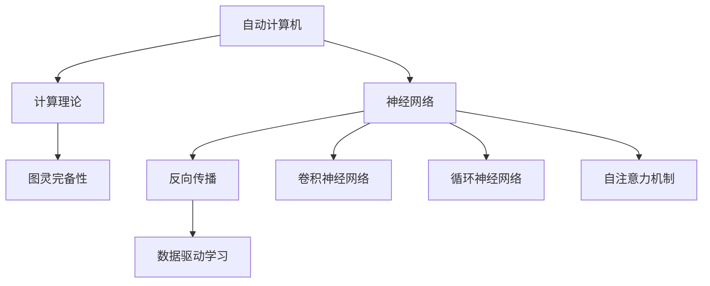
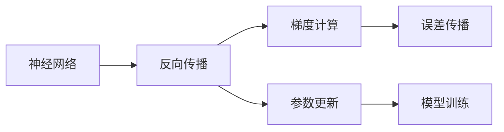
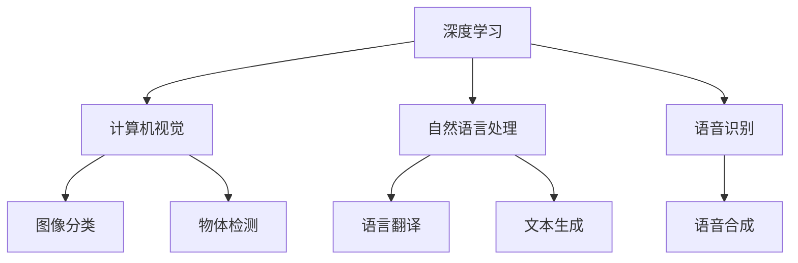
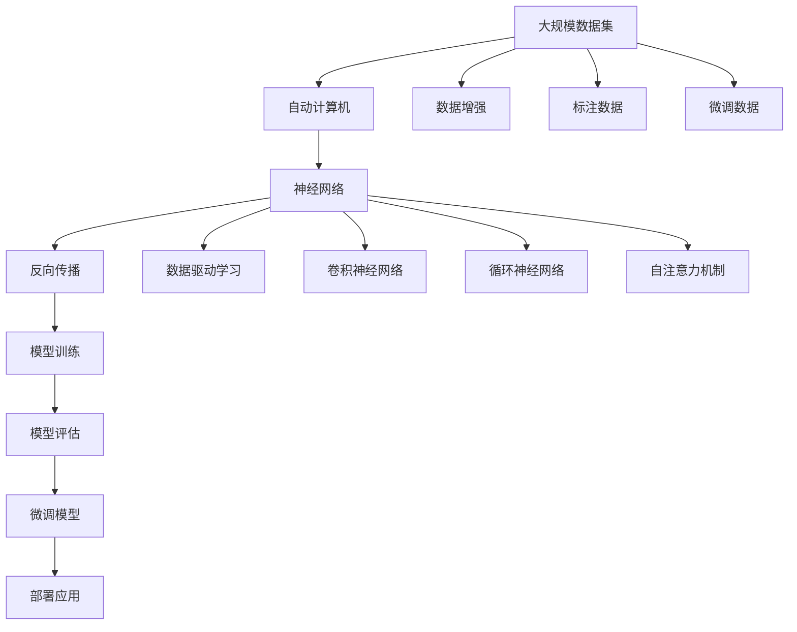

                 

# 自动计算机与神经网络的研究

> 关键词：自动计算机, 神经网络, 人工智能, 计算理论, 深度学习

## 1. 背景介绍

### 1.1 问题由来

自20世纪中叶以来，计算机科学经历了多次技术革新，从早期基于逻辑电路的冯诺依曼架构，到后来更为灵活的Turing机和图灵完备的计算机模型，计算机技术得到了长足的发展。尤其是在1956年，达特茅斯会议提出“人工智能”概念后，人工智能（AI）领域的研究逐渐兴起，推动了计算机科学向着更为智能化的方向发展。

然而，早期的AI研究更多依赖符号逻辑、专家系统和决策树等技术，对实际问题的处理存在诸多限制。直到20世纪末，基于神经网络的大规模机器学习技术的提出，才真正将AI推向了应用层面。这一时期的代表性成果包括BP算法、多层感知器、卷积神经网络（CNN）等，对数据驱动的AI技术奠定了基础。

如今，深度学习技术的快速发展，使得神经网络技术在图像识别、自然语言处理、语音识别等诸多领域取得了突破性进展。尤其是卷积神经网络（CNN）、循环神经网络（RNN）和自注意力机制（Self-Attention）的提出，将神经网络带入了一个新的发展阶段。

在这一背景下，对自动计算机和神经网络的研究，成为了AI领域的重要研究方向。自动计算机的提出，试图从计算理论的角度理解神经网络的学习机制，而神经网络的研究，则试图通过模型优化和算法改进，进一步提升深度学习模型的表现。

## 2. 核心概念与联系

### 2.1 核心概念概述

为更好地理解自动计算机与神经网络的研究，本节将介绍几个关键概念：

- **自动计算机（Automatic Computer）**：一种理论上能够自动进行计算任务的机器，由Turing机和图灵完备性构成。自动计算机能够根据输入和输出进行计算，其运算过程不受人类干预。

- **神经网络（Neural Network）**：一种由大量人工神经元（节点）组成的计算模型，通过连接权值和激活函数进行计算。神经网络具有分布式处理能力和自适应学习能力，是深度学习模型的基础。

- **深度学习（Deep Learning）**：一种基于多层神经网络的机器学习技术，通过多层次的数据表示学习，实现对复杂数据模式的自动提取。深度学习在图像识别、自然语言处理等领域取得了显著效果。

- **反向传播算法（Backpropagation）**：一种基于梯度下降的优化算法，用于计算神经网络中各个参数的梯度，通过反向传播更新模型参数，实现模型训练。

- **卷积神经网络（Convolutional Neural Network, CNN）**：一种专门用于处理图像和视频数据的神经网络模型，通过卷积层和池化层提取图像特征。

- **循环神经网络（Recurrent Neural Network, RNN）**：一种能够处理序列数据的神经网络模型，通过循环连接和LSTM、GRU等机制，实现对时间序列数据的建模。

- **自注意力机制（Self-Attention）**：一种用于神经网络中的机制，通过注意力机制在序列或图像中筛选出重要部分，提升模型的表示能力。

这些概念之间存在着紧密的联系，形成了自动计算机与神经网络研究的完整生态系统。通过理解这些核心概念，我们可以更好地把握自动计算机和神经网络的工作原理和优化方向。

### 2.2 概念间的关系

这些核心概念之间存在着紧密的联系，形成了自动计算机与神经网络研究的完整生态系统。下面我们通过几个Mermaid流程图来展示这些概念之间的关系。

#### 2.2.1 自动计算机与神经网络的学习范式



这个流程图展示了大规模机器学习模型的学习范式：

1. 自动计算机通过计算理论提供理论支持。
2. 神经网络是自动计算机的理论实现。
3. 反向传播算法是神经网络中常用的优化算法。
4. 数据驱动学习是神经网络训练的核心。
5. CNN、RNN、Self-Attention是神经网络中的典型模型。

#### 2.2.2 神经网络与反向传播的关系



这个流程图展示了反向传播算法在神经网络中的作用：

1. 反向传播通过误差传播计算梯度。
2. 梯度用于参数更新，更新模型参数。
3. 参数更新使得神经网络模型逐渐逼近目标函数。

#### 2.2.3 深度学习的应用领域



这个流程图展示了深度学习在计算机视觉、自然语言处理和语音识别等领域的广泛应用：

1. 深度学习在计算机视觉领域的应用包括图像分类、物体检测等。
2. 在自然语言处理领域，深度学习被应用于语言翻译、文本生成等任务。
3. 在语音识别领域，深度学习被应用于语音合成、语音识别等。

### 2.3 核心概念的整体架构

最后，我们用一个综合的流程图来展示这些核心概念在大规模机器学习模型的微调过程中的整体架构：



这个综合流程图展示了从数据集到模型微调的整体过程：

1. 大规模数据集为自动计算机和神经网络提供了数据支持。
2. 自动计算机通过计算理论提供理论支持。
3. 神经网络是自动计算机的理论实现。
4. 反向传播算法是神经网络中常用的优化算法。
5. 数据驱动学习是神经网络训练的核心。
6. 深度学习中的典型模型如CNN、RNN、Self-Attention。
7. 数据增强和标注数据用于训练和微调模型。
8. 模型训练和评估后，进行微调。
9. 微调后的模型部署到实际应用中。

通过这些流程图，我们可以更清晰地理解大规模机器学习模型的学习过程和架构，为后续深入讨论具体的微调方法和技术奠定基础。

## 3. 核心算法原理 & 具体操作步骤
### 3.1 算法原理概述

基于深度学习的自动计算机与神经网络微调，本质上是一个有监督的细粒度迁移学习过程。其核心思想是：将预训练的神经网络模型作为初始化参数，通过在特定任务上附加监督信号，优化模型在该任务上的性能。

形式化地，假设预训练模型为 $M_{\theta}$，其中 $\theta$ 为预训练得到的模型参数。给定下游任务 $T$ 的标注数据集 $D=\{(x_i, y_i)\}_{i=1}^N$，微调的目标是找到新的模型参数 $\hat{\theta}$，使得：

$$
\hat{\theta}=\mathop{\arg\min}_{\theta} \mathcal{L}(M_{\theta},D)
$$

其中 $\mathcal{L}$ 为针对任务 $T$ 设计的损失函数，用于衡量模型预测输出与真实标签之间的差异。常见的损失函数包括交叉熵损失、均方误差损失等。

通过梯度下降等优化算法，微调过程不断更新模型参数 $\theta$，最小化损失函数 $\mathcal{L}$，使得模型输出逼近真实标签。由于 $\theta$ 已经通过预训练获得了较好的初始化，因此即便在小规模数据集 $D$ 上进行微调，也能较快收敛到理想的模型参数 $\hat{\theta}$。

### 3.2 算法步骤详解

基于深度学习的自动计算机与神经网络微调一般包括以下几个关键步骤：

**Step 1: 准备预训练模型和数据集**
- 选择合适的预训练神经网络模型 $M_{\theta}$ 作为初始化参数，如 CNN、RNN、Transformer 等。
- 准备下游任务 $T$ 的标注数据集 $D$，划分为训练集、验证集和测试集。一般要求标注数据与预训练数据的分布不要差异过大。

**Step 2: 添加任务适配层**
- 根据任务类型，在预训练模型顶层设计合适的输出层和损失函数。
- 对于分类任务，通常在顶层添加线性分类器和交叉熵损失函数。
- 对于生成任务，通常使用语言模型的解码器输出概率分布，并以负对数似然为损失函数。

**Step 3: 设置微调超参数**
- 选择合适的优化算法及其参数，如 AdamW、SGD 等，设置学习率、批大小、迭代轮数等。
- 设置正则化技术及强度，包括权重衰减、Dropout、Early Stopping 等。
- 确定冻结预训练参数的策略，如仅微调顶层，或全部参数都参与微调。

**Step 4: 执行梯度训练**
- 将训练集数据分批次输入模型，前向传播计算损失函数。
- 反向传播计算参数梯度，根据设定的优化算法和学习率更新模型参数。
- 周期性在验证集上评估模型性能，根据性能指标决定是否触发 Early Stopping。
- 重复上述步骤直到满足预设的迭代轮数或 Early Stopping 条件。

**Step 5: 测试和部署**
- 在测试集上评估微调后模型 $M_{\hat{\theta}}$ 的性能，对比微调前后的精度提升。
- 使用微调后的模型对新样本进行推理预测，集成到实际的应用系统中。
- 持续收集新的数据，定期重新微调模型，以适应数据分布的变化。

以上是基于深度学习的自动计算机与神经网络微调的一般流程。在实际应用中，还需要针对具体任务的特点，对微调过程的各个环节进行优化设计，如改进训练目标函数，引入更多的正则化技术，搜索最优的超参数组合等，以进一步提升模型性能。

### 3.3 算法优缺点

基于深度学习的自动计算机与神经网络微调方法具有以下优点：
1. 简单高效。只需准备少量标注数据，即可对预训练模型进行快速适配，获得较大的性能提升。
2. 通用适用。适用于各种深度学习下游任务，包括分类、匹配、生成等，设计简单的任务适配层即可实现微调。
3. 参数高效。利用参数高效微调技术，在固定大部分预训练参数的情况下，仍可取得不错的提升。
4. 效果显著。在学术界和工业界的诸多任务上，基于微调的方法已经刷新了最先进的性能指标。

同时，该方法也存在一定的局限性：
1. 依赖标注数据。微调的效果很大程度上取决于标注数据的质量和数量，获取高质量标注数据的成本较高。
2. 迁移能力有限。当目标任务与预训练数据的分布差异较大时，微调的性能提升有限。
3. 负面效果传递。预训练模型的固有偏见、有害信息等，可能通过微调传递到下游任务，造成负面影响。
4. 可解释性不足。微调模型的决策过程通常缺乏可解释性，难以对其推理逻辑进行分析和调试。

尽管存在这些局限性，但就目前而言，基于深度学习的微调方法仍是大模型应用的最主流范式。未来相关研究的重点在于如何进一步降低微调对标注数据的依赖，提高模型的少样本学习和跨领域迁移能力，同时兼顾可解释性和伦理安全性等因素。

### 3.4 算法应用领域

基于深度学习的自动计算机与神经网络微调方法，在计算机视觉、自然语言处理、语音识别等诸多领域已经得到了广泛的应用，覆盖了几乎所有常见任务，例如：

- 图像分类：如MNIST、CIFAR等图像识别任务。通过微调使模型学习图像-类别映射。
- 物体检测：如PASCAL VOC、COCO等目标检测任务。通过微调使模型学习物体边界框位置和类别。
- 语言翻译：如WMT、IWSLT等机器翻译任务。通过微调使模型学习语言-语言映射。
- 文本生成：如GPT、T5等文本生成任务。通过微调使模型学习文本生成逻辑和风格。
- 语音识别：如LibriSpeech、CommonVoice等语音识别任务。通过微调使模型学习音频-文本映射。

除了上述这些经典任务外，深度学习微调方法也被创新性地应用到更多场景中，如可控文本生成、常识推理、代码生成、数据增强等，为深度学习技术带来了全新的突破。随着预训练模型和微调方法的不断进步，相信深度学习技术将在更广阔的应用领域大放异彩。

## 4. 数学模型和公式 & 详细讲解 & 举例说明

### 4.1 数学模型构建

本节将使用数学语言对基于深度学习的自动计算机与神经网络微调过程进行更加严格的刻画。

记预训练神经网络模型为 $M_{\theta}$，其中 $\theta$ 为预训练得到的模型参数。假设微调任务的训练集为 $D=\{(x_i,y_i)\}_{i=1}^N$，其中 $x_i \in \mathcal{X}$，$y_i \in \mathcal{Y}$。

定义模型 $M_{\theta}$ 在数据样本 $(x,y)$ 上的损失函数为 $\ell(M_{\theta}(x),y)$，则在数据集 $D$ 上的经验风险为：

$$
\mathcal{L}(\theta) = \frac{1}{N} \sum_{i=1}^N \ell(M_{\theta}(x_i),y_i)
$$

微调的优化目标是最小化经验风险，即找到最优参数：

$$
\theta^* = \mathop{\arg\min}_{\theta} \mathcal{L}(\theta)
$$

在实践中，我们通常使用基于梯度的优化算法（如SGD、Adam等）来近似求解上述最优化问题。设 $\eta$ 为学习率，$\lambda$ 为正则化系数，则参数的更新公式为：

$$
\theta \leftarrow \theta - \eta \nabla_{\theta}\mathcal{L}(\theta) - \eta\lambda\theta
$$

其中 $\nabla_{\theta}\mathcal{L}(\theta)$ 为损失函数对参数 $\theta$ 的梯度，可通过反向传播算法高效计算。

### 4.2 公式推导过程

以下我们以图像分类任务为例，推导交叉熵损失函数及其梯度的计算公式。

假设模型 $M_{\theta}$ 在输入 $x$ 上的输出为 $\hat{y}=M_{\theta}(x) \in [0,1]$，表示样本属于正类的概率。真实标签 $y \in \{0,1\}$。则二分类交叉熵损失函数定义为：

$$
\ell(M_{\theta}(x),y) = -[y\log \hat{y} + (1-y)\log (1-\hat{y})]
$$

将其代入经验风险公式，得：

$$
\mathcal{L}(\theta) = -\frac{1}{N}\sum_{i=1}^N [y_i\log M_{\theta}(x_i)+(1-y_i)\log(1-M_{\theta}(x_i))]
$$

根据链式法则，损失函数对参数 $\theta_k$ 的梯度为：

$$
\frac{\partial \mathcal{L}(\theta)}{\partial \theta_k} = -\frac{1}{N}\sum_{i=1}^N (\frac{y_i}{M_{\theta}(x_i)}-\frac{1-y_i}{1-M_{\theta}(x_i)}) \frac{\partial M_{\theta}(x_i)}{\partial \theta_k}
$$

其中 $\frac{\partial M_{\theta}(x_i)}{\partial \theta_k}$ 可进一步递归展开，利用自动微分技术完成计算。

在得到损失函数的梯度后，即可带入参数更新公式，完成模型的迭代优化。重复上述过程直至收敛，最终得到适应下游任务的最优模型参数 $\theta^*$。

### 4.3 案例分析与讲解

**案例分析：图像分类任务**

假设我们正在进行图像分类任务，数据集为MNIST手写数字识别数据集，模型为LeNet-5卷积神经网络，我们将使用交叉熵损失函数进行微调。

首先，定义数据处理函数：

```python
from torchvision import datasets, transforms
from torch.utils.data import DataLoader
from torch.nn import functional as F
import torch

train_dataset = datasets.MNIST('data', train=True, download=True, transform=transforms.ToTensor())
test_dataset = datasets.MNIST('data', train=False, download=True, transform=transforms.ToTensor())

class ImageNetDataset(Dataset):
    def __init__(self, data, transform=None):
        self.data = data
        self.transform = transform
        
    def __len__(self):
        return len(self.data)
    
    def __getitem__(self, idx):
        img = self.data[idx][0]
        label = self.data[idx][1]
        if self.transform:
            img = self.transform(img)
        return img, label

train_loader = DataLoader(train_dataset, batch_size=32, shuffle=True)
test_loader = DataLoader(test_dataset, batch_size=32)
```

然后，定义模型和优化器：

```python
import torch.nn as nn
import torch.nn.functional as F

class LeNet(nn.Module):
    def __init__(self):
        super(LeNet, self).__init__()
        self.conv1 = nn.Conv2d(1, 6, 5)
        self.pool = nn.MaxPool2d(2, 2)
        self.conv2 = nn.Conv2d(6, 16, 5)
        self.fc1 = nn.Linear(16*4*4, 120)
        self.fc2 = nn.Linear(120, 84)
        self.fc3 = nn.Linear(84, 10)
        
    def forward(self, x):
        x = self.pool(F.relu(self.conv1(x)))
        x = self.pool(F.relu(self.conv2(x)))
        x = x.view(-1, 16*4*4)
        x = F.relu(self.fc1(x))
        x = F.relu(self.fc2(x))
        x = self.fc3(x)
        return x

model = LeNet()
criterion = nn.CrossEntropyLoss()
optimizer = torch.optim.Adam(model.parameters(), lr=0.001)

device = torch.device('cuda' if torch.cuda.is_available() else 'cpu')
model.to(device)
```

接着，定义训练和评估函数：

```python
def train(model, data_loader, criterion, optimizer, n_epochs=5, device='cpu'):
    model.train()
    for epoch in range(n_epochs):
        for inputs, labels in data_loader:
            inputs = inputs.to(device)
            labels = labels.to(device)
            optimizer.zero_grad()
            outputs = model(inputs)
            loss = criterion(outputs, labels)
            loss.backward()
            optimizer.step()
        print(f'Epoch {epoch+1}, train loss: {loss.item()}')

def evaluate(model, data_loader, criterion, device='cpu'):
    model.eval()
    test_loss = 0
    correct = 0
    with torch.no_grad():
        for inputs, labels in data_loader:
            inputs = inputs.to(device)
            labels = labels.to(device)
            outputs = model(inputs)
            test_loss += criterion(outputs, labels).item()
            _, preds = torch.max(outputs.data, 1)
            correct += (preds == labels).sum().item()
    print(f'Test loss: {test_loss / len(data_loader)}')
    print(f'Test accuracy: {100 * correct / len(data_loader)}')
```

最后，启动训练流程并在测试集上评估：

```python
train(model, train_loader, criterion, optimizer)
evaluate(model, test_loader, criterion)
```

以上就是使用PyTorch对LeNet-5模型进行微调的完整代码实现。可以看到，得益于自动微分技术和深度学习框架的强大封装，我们可以用相对简洁的代码完成模型的微调。

## 5. 项目实践：代码实例和详细解释说明
### 5.1 开发环境搭建

在进行深度学习模型的微调实践前，我们需要准备好开发环境。以下是使用Python进行PyTorch开发的环境配置流程：

1. 安装Anaconda：从官网下载并安装Anaconda，用于创建独立的Python环境。

2. 创建并激活虚拟环境：
```bash
conda create -n pytorch-env python=3.8 
conda activate pytorch-env
```

3. 安装PyTorch：根据CUDA版本，从官网获取对应的安装命令。例如：
```bash
conda install pytorch torchvision torchaudio cudatoolkit=11.1 -c pytorch -c conda-forge
```

4. 安装各类工具包：
```bash
pip install numpy pandas scikit-learn matplotlib tqdm jupyter notebook ipython
```

完成上述步骤后，即可在`pytorch-env`环境中开始微调实践。

### 5.2 源代码详细实现

这里我们以图像分类任务为例，给出使用PyTorch对LeNet-5模型进行微调的代码实现。

首先，定义数据处理函数：

```python
from torchvision import datasets, transforms
from torch.utils.data import DataLoader
from torch.nn import functional as F
import torch

train_dataset = datasets.MNIST('data', train=True, download=True, transform=transforms.ToTensor())
test_dataset = datasets.MNIST('data', train=False, download=True, transform=transforms.ToTensor())

class ImageNetDataset(Dataset):
    def __init__(self, data, transform=None):
        self.data = data
        self.transform = transform
        
    def __len__(self):
        return len(self.data)
    
    def __getitem__(self, idx):
        img = self.data[idx][0]
        label = self.data[idx][1]
        if self.transform:
            img = self.transform(img)
        return img, label

train_loader = DataLoader(train_dataset, batch_size=32, shuffle=True)
test_loader = DataLoader(test_dataset, batch_size=32)
```

然后，定义模型和优化器：

```python
import torch.nn as nn
import torch.nn.functional as F

class LeNet(nn.Module):
    def __init__(self):
        super(LeNet, self).__init__()
        self.conv1 = nn.Conv2d(1, 6, 5)
        self.pool = nn.MaxPool2d(2, 2)
        self.conv2 = nn.Conv2d(6, 16, 5)
        self.fc1 = nn.Linear(16*4*4, 120)
        self.fc2 = nn.Linear(120, 84)
        self.fc3 = nn.Linear(84, 10)
        
    def forward(self, x):
        x = self.pool(F.relu(self.conv1(x)))
        x = self.pool(F.relu(self.conv2(x)))
        x = x.view(-1, 16*4*4)
        x = F.relu(self.fc1(x))
        x = F.relu(self.fc2(x))
        x = self.fc3(x)
        return x

model = LeNet()
criterion = nn.CrossEntropyLoss()
optimizer = torch.optim.Adam(model.parameters(), lr=0.001)

device = torch.device('cuda' if torch.cuda.is_available() else 'cpu')
model.to(device)
```

接着，定义训练和评估函数：

```python
def train(model, data_loader, criterion, optimizer, n_epochs=5, device='cpu'):
    model.train()
    for epoch in range(n_epochs):
        for inputs, labels in data_loader:
            inputs = inputs.to(device)
            labels = labels.to(device)
            optimizer.zero_grad()
            outputs = model(inputs)
            loss = criterion(outputs, labels)
            loss.backward()
            optimizer.step()
        print(f'Epoch {epoch+1}, train loss: {loss.item()}')

def evaluate(model, data_loader, criterion, device='cpu'):
    model.eval()
    test_loss = 0
    correct = 0
    with torch.no_grad():
        for inputs, labels in data_loader:
            inputs = inputs.to(device)
            labels = labels.to(device)
            outputs = model(inputs)
            test_loss += criterion(outputs, labels).item()
            _, preds = torch.max(outputs.data, 1)
            correct += (preds == labels).sum().item()
    print(f'Test loss: {test_loss / len(data_loader)}')
    print(f'Test accuracy: {100 * correct / len(data_loader)}')
```

最后，启动训练流程并在测试集上评估：

```python
train(model, train_loader, criterion, optimizer)
evaluate(model, test_loader, criterion)
```

以上就是使用PyTorch对LeNet-5模型进行图像分类任务微调的完整代码实现。可以看到，得益于深度学习框架的强大封装，我们可以用相对简洁的代码完成模型的微调。

### 5.3 代码解读与分析

让我们再详细解读一下关键代码的实现细节：

**ImageNetDataset类**：
- `__init__`方法：初始化训练数据和测试数据。
- `__len__`方法：返回数据集的样本数量。
- `__getitem__`方法：对单个样本进行处理，将图像

