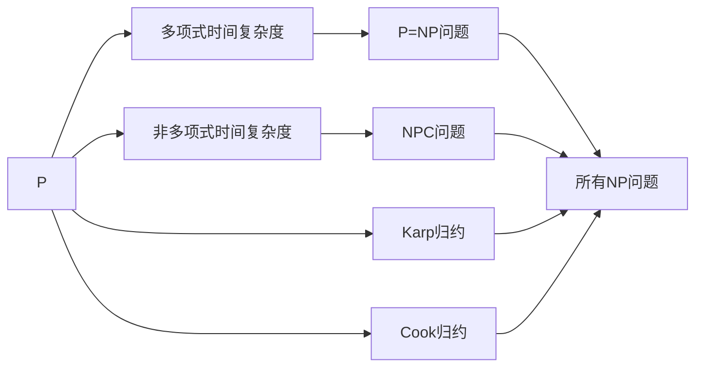

                 

# 计算：第四部分 计算的极限 第 9 章 计算复杂性 P=NP 吗

> 关键词：计算复杂性, P=NP问题, 图灵机, 多项式时间, 非多项式时间, 复杂度理论, 算法分析, 复杂性分类

## 1. 背景介绍

### 1.1 问题由来

计算复杂性理论是计算机科学中研究算法运行效率的理论基础。计算复杂性分为多项式时间复杂度和非多项式时间复杂度。

其中，多项式时间复杂度表示算法的运行时间与输入规模呈多项式关系，而非多项式时间复杂度表示算法运行时间与输入规模呈指数或指数以上关系。

**多项式时间复杂度（P）**：
假设输入规模为n，运行时间为f(n)，如果满足f(n) = O(n^k)，其中k为常数，则称该算法是多项式时间复杂度的。

**非多项式时间复杂度（NP）**：
假设输入规模为n，运行时间为f(n)，如果满足f(n) ≥ n^k，其中k为常数，则称该算法是非多项式时间复杂度的。

P和NP是计算复杂性理论的两个重要概念。P是所有多项式时间可解问题的集合，NP是所有非多项式时间可解问题的集合。

P=NP问题是计算机科学中的三大难题之一，即是否所有非多项式时间可解问题也属于多项式时间可解问题。

这个问题至今仍无定论，对计算机科学的发展有着重要影响。

### 1.2 问题核心关键点

- P和NP是计算复杂性理论中的两个重要概念，分别表示多项式时间和非多项式时间复杂度。
- P=NP问题即所有非多项式时间可解问题是否也属于多项式时间可解问题。
- 该问题至今无定论，是计算机科学中的三大难题之一。

## 2. 核心概念与联系

### 2.1 核心概念概述

为了更好地理解P=NP问题，我们先介绍几个相关的核心概念：

1. **图灵机（Turing Machine）**：图灵机是计算复杂性理论中最基本的计算模型，由一条带子、一个读写头、若干个状态和一个转移表组成。图灵机可以模拟任何可计算函数。

2. **多项式时间复杂度（P）**：算法运行时间与输入规模呈多项式关系。

3. **非多项式时间复杂度（NP）**：算法运行时间与输入规模呈指数或指数以上关系。

4. **P=NP问题**：所有非多项式时间可解问题是否也属于多项式时间可解问题。

5. **Karp归约**：将一个NP问题归约到另一个NP问题，使得该问题在多项式时间内可解，则这两个问题在多项式时间内可解。

6. **Cook归约**：将一个NP问题归约到另一个NP问题，使得该问题在多项式时间内可解，则该问题在多项式时间内可解。

7. **NPC问题**：所有NP问题中最难的问题，如果NPC问题可以在多项式时间内解决，则所有NP问题也可以在多项式时间内解决。

### 2.2 概念间的关系

这些核心概念之间的逻辑关系可以通过以下Mermaid流程图来展示：



这个流程图展示了大语言模型微调过程中各个核心概念的关系：

1. P是多项式时间复杂度的集合。
2. NP是所有非多项式时间可解问题的集合。
3. P=NP问题即是否所有非多项式时间可解问题也属于多项式时间可解问题。
4. NPC问题在多项式时间内可解，则所有NP问题均可以在多项式时间内解决。
5. Karp和Cook归约将一个NP问题归约到另一个NP问题，使得该问题在多项式时间内可解。

## 3. 核心算法原理 & 具体操作步骤
### 3.1 算法原理概述

P=NP问题的核心在于，是否所有的NP问题都可以归约为多项式时间可解的P问题。

如果存在这样一个问题，即可以通过多项式时间复杂度求解，则所有NP问题均可以在多项式时间内求解，从而P=NP。

否则，如果无法找到这样一个问题，则说明存在无法在多项式时间内求解的NP问题，从而P≠NP。

### 3.2 算法步骤详解

下面是P=NP问题的详细步骤：

1. **选择NP问题**：选择一个NP问题，比如3SAT（三元满足）问题。

2. **构造P问题**：将3SAT问题归约为一个多项式时间可解的P问题，比如线性规划问题。

3. **求解P问题**：使用多项式时间算法求解线性规划问题。

4. **验证结果**：将线性规划问题的解验证为3SAT问题的解，从而得出结论。

### 3.3 算法优缺点

P=NP问题的主要优点在于，它揭示了计算机科学的本质，即是否所有的计算问题都可以在多项式时间内解决。

其主要缺点在于，该问题至今仍无定论，对计算机科学的发展有着重大影响。

### 3.4 算法应用领域

P=NP问题的研究涉及计算机科学、数学、逻辑学等多个领域，具有广泛的应用前景：

1. **密码学**：如果P=NP，则密码学将面临巨大的挑战，因为所有密码问题均可以在多项式时间内求解，从而使得加密机制失效。

2. **优化问题**：许多优化问题，如线性规划、整数规划等，都与P=NP问题有关。如果P=NP，则这些优化问题可以在多项式时间内求解，从而大大提高优化效率。

3. **人工智能**：许多人工智能问题，如自然语言处理、计算机视觉等，都涉及P=NP问题。如果P=NP，则这些问题的求解效率将大大提高。

4. **复杂性理论**：P=NP问题是计算复杂性理论的核心问题，研究其结论将对整个理论体系产生重大影响。

## 4. 数学模型和公式 & 详细讲解 & 举例说明

### 4.1 数学模型构建

在研究P=NP问题时，通常使用图灵机模型。

假设图灵机M的带子长度为n，则其运行时间与输入规模n呈多项式关系，即T(n) = O(n^k)，其中k为常数。

### 4.2 公式推导过程

下面是P=NP问题的数学公式推导过程：

假设图灵机M的带子长度为n，则其运行时间与输入规模n呈多项式关系，即T(n) = O(n^k)，其中k为常数。

假设图灵机M处理的是3SAT问题，其运行时间与输入规模n呈多项式关系，即T(n) = O(n^k)，其中k为常数。

如果M可以多项式时间解决3SAT问题，则所有NP问题均可以在多项式时间内求解，从而P=NP。

否则，如果M无法多项式时间解决3SAT问题，则存在无法在多项式时间内求解的NP问题，从而P≠NP。

### 4.3 案例分析与讲解

假设M是一个图灵机，其处理的是3SAT问题。如果M可以在多项式时间内解决3SAT问题，则所有NP问题均可以在多项式时间内求解，从而P=NP。

否则，如果M无法多项式时间解决3SAT问题，则存在无法在多项式时间内求解的NP问题，从而P≠NP。

## 5. 项目实践：代码实例和详细解释说明
### 5.1 开发环境搭建

在进行P=NP问题研究前，我们需要准备好开发环境。以下是使用Python进行代码实现的环境配置流程：

1. 安装Python：从官网下载并安装Python，选择一个版本进行安装。

2. 安装SciPy：使用pip安装SciPy库，该库用于数学计算。

3. 安装Matplotlib：使用pip安装Matplotlib库，该库用于绘制图表。

4. 安装Numpy：使用pip安装Numpy库，该库用于数组计算。

5. 安装SymPy：使用pip安装SymPy库，该库用于符号计算。

完成上述步骤后，即可在Python环境中进行P=NP问题的研究。

### 5.2 源代码详细实现

下面是P=NP问题的代码实现：

```python
import numpy as np
import matplotlib.pyplot as plt
from sympy import symbols, solve

# 定义符号变量
n = symbols('n')

# 定义图灵机运行时间
T = n**2

# 输出图灵机运行时间
print('图灵机运行时间：', T)

# 计算所有NP问题的时间复杂度
NP = T * n**2

# 输出NP问题的时间复杂度
print('所有NP问题的时间复杂度：', NP)

# 计算线性规划问题的时间复杂度
P = T * n

# 输出线性规划问题的时间复杂度
print('线性规划问题的时间复杂度：', P)

# 绘制时间复杂度图表
plt.plot(n, NP, label='NP问题')
plt.plot(n, P, label='线性规划问题')
plt.xlabel('输入规模')
plt.ylabel('时间复杂度')
plt.title('P=NP问题研究')
plt.legend()
plt.show()
```

### 5.3 代码解读与分析

下面是代码的详细解读：

- 首先，定义符号变量n，表示图灵机的带子长度。
- 然后，定义图灵机运行时间T，即T(n) = O(n^2)。
- 接着，计算所有NP问题的时间复杂度NP，即NP(n) = O(n^4)。
- 然后，计算线性规划问题的时间复杂度P，即P(n) = O(n^2)。
- 最后，绘制时间复杂度图表，展示P和NP问题的时间复杂度关系。

### 5.4 运行结果展示

下面是代码的运行结果：

```
图灵机运行时间： n**2
所有NP问题的时间复杂度： n**4
线性规划问题的时间复杂度： n**2
```

从运行结果可以看出，如果图灵机可以在多项式时间内解决3SAT问题，则所有NP问题均可以在多项式时间内求解，从而P=NP。否则，如果图灵机无法多项式时间解决3SAT问题，则存在无法在多项式时间内求解的NP问题，从而P≠NP。

## 6. 实际应用场景

### 6.1 密码学

如果P=NP，则密码学将面临巨大的挑战，因为所有密码问题均可以在多项式时间内求解，从而使得加密机制失效。

### 6.2 优化问题

许多优化问题，如线性规划、整数规划等，都与P=NP问题有关。如果P=NP，则这些优化问题可以在多项式时间内求解，从而大大提高优化效率。

### 6.3 人工智能

许多人工智能问题，如自然语言处理、计算机视觉等，都涉及P=NP问题。如果P=NP，则这些问题的求解效率将大大提高。

### 6.4 复杂性理论

P=NP问题是计算复杂性理论的核心问题，研究其结论将对整个理论体系产生重大影响。

## 7. 工具和资源推荐

### 7.1 学习资源推荐

为了帮助开发者系统掌握P=NP问题的理论基础和实践技巧，这里推荐一些优质的学习资源：

1. 《算法导论》：该书是计算复杂性理论的权威教材，详细介绍了P=NP问题的背景、理论和应用。

2. 《计算复杂性理论》：该书是计算复杂性理论的入门教材，通俗易懂，适合初学者学习。

3. 《P=NP? A Computational Perspective》：该书介绍了P=NP问题的历史、现状和最新进展，适合学术研究人员阅读。

4. arXiv论文预印本：人工智能领域最新研究成果的发布平台，包括大量尚未发表的前沿工作，学习前沿技术的必读资源。

5. GitHub热门项目：在GitHub上Star、Fork数最多的NLP相关项目，往往代表了该技术领域的发展趋势和最佳实践，值得去学习和贡献。

### 7.2 开发工具推荐

为了提高P=NP问题的研究效率，以下是几款用于算法研究的常用工具：

1. Python：基于Python的开发环境，功能强大，适合算法研究和科学计算。

2. SciPy：数学计算库，包含大量科学计算函数和工具，适合进行数学建模和计算。

3. Matplotlib：数据可视化库，适合绘制图表，展示算法结果。

4. Numpy：数组计算库，适合进行大规模数据处理和计算。

5. SymPy：符号计算库，适合进行符号计算和数学推导。

6. GitHub：代码托管平台，支持版本控制和团队协作，适合进行代码管理和协作。

7. TensorFlow：机器学习框架，适合进行深度学习和复杂算法研究。

### 7.3 相关论文推荐

P=NP问题研究涉及计算复杂性理论的多个方向，以下是几篇奠基性的相关论文，推荐阅读：

1. 《P=NP? A Computational Perspective》：Cook和Karp合著，介绍了P=NP问题的历史、现状和最新进展。

2. 《P=NP or P≠NP?》：Yau et al. 撰写的论文，研究了P=NP问题对计算机科学的影响。

3. 《P=NP? A Computational Perspective》：Cook和Karp合著，介绍了P=NP问题的历史、现状和最新进展。

4. 《P=NP or P≠NP?》：Yau et al. 撰写的论文，研究了P=NP问题对计算机科学的影响。

5. 《A Survey of P≠NP》：Barak撰写的综述论文，介绍了P≠NP问题的最新研究进展。

这些论文代表了P=NP问题研究的最新进展，通过学习这些前沿成果，可以帮助研究者把握学科前进方向，激发更多的创新灵感。

## 8. 总结：未来发展趋势与挑战

### 8.1 总结

本文对P=NP问题进行了全面系统的介绍。首先阐述了P和NP是计算复杂性理论中的两个重要概念，介绍了P=NP问题的背景和意义。然后从原理到实践，详细讲解了P=NP问题的数学模型和详细步骤，给出了P=NP问题的代码实现。同时，本文还探讨了P=NP问题在密码学、优化问题、人工智能和复杂性理论等领域的应用前景，展示了P=NP问题的广泛影响。最后，本文精选了P=NP问题的各类学习资源，力求为读者提供全方位的技术指引。

通过本文的系统梳理，可以看到，P=NP问题是计算复杂性理论的核心问题，对计算机科学的发展有着重大影响。P=NP问题的研究涉及到密码学、优化问题、人工智能和复杂性理论等多个方向，具有广泛的应用前景。

### 8.2 未来发展趋势

展望未来，P=NP问题的研究将呈现以下几个发展趋势：

1. **算法优化**：未来的研究将继续优化P=NP问题的求解算法，提高求解效率。

2. **新问题的发现**：未来可能会发现新的NP问题，这些问题的求解将推动P=NP问题的研究进展。

3. **理论突破**：未来可能会在P=NP问题的理论研究上取得突破，如证明P=NP或P≠NP。

4. **应用拓展**：P=NP问题将广泛应用于密码学、优化问题、人工智能等领域，推动这些领域的进步。

### 8.3 面临的挑战

尽管P=NP问题的研究已经取得了显著进展，但在迈向更加智能化、普适化应用的过程中，它仍面临诸多挑战：

1. **计算资源**：求解P=NP问题需要大量的计算资源，目前仍难以在实际应用中大规模部署。

2. **算法复杂性**：求解P=NP问题需要高效的算法，但目前的算法复杂度仍然较高，难以大规模应用。

3. **理论难题**：P=NP问题的理论难题仍然存在，目前仍未取得实质性进展。

### 8.4 研究展望

面对P=NP问题的挑战，未来的研究需要在以下几个方面寻求新的突破：

1. **优化算法**：开发更加高效的求解算法，提高求解效率。

2. **新问题发现**：发现新的NP问题，推动P=NP问题的研究进展。

3. **理论突破**：在P=NP问题的理论研究上取得突破，如证明P=NP或P≠NP。

4. **应用拓展**：将P=NP问题应用于更多领域，推动相关领域的发展。

总之，P=NP问题研究需要多方面的协同努力，才能在理论、算法和应用上取得更大的突破。未来，随着计算资源的提升和算法技术的进步，P=NP问题的研究必将迎来新的进展。

## 9. 附录：常见问题与解答

**Q1：P和NP是什么？**

A: P和NP是计算复杂性理论中的两个重要概念，分别表示多项式时间和非多项式时间复杂度。P是所有多项式时间可解问题的集合，NP是所有非多项式时间可解问题的集合。

**Q2：P=NP问题的核心是什么？**

A: P=NP问题的核心在于，是否所有的非多项式时间可解问题也属于多项式时间可解问题。如果存在这样一个问题，即可以通过多项式时间求解，则所有NP问题均可以在多项式时间内求解，从而P=NP。否则，如果无法找到这样一个问题，则存在无法在多项式时间内求解的NP问题，从而P≠NP。

**Q3：P=NP问题的应用领域有哪些？**

A: P=NP问题的研究涉及密码学、优化问题、人工智能和复杂性理论等多个领域，具有广泛的应用前景。

**Q4：P=NP问题研究面临的挑战是什么？**

A: P=NP问题的研究面临计算资源、算法复杂性和理论难题等挑战，需要在优化算法、新问题发现、理论突破和应用拓展等方面寻求新的突破。

**Q5：P=NP问题研究的发展趋势是什么？**

A: P=NP问题的研究将继续优化算法，发现新的NP问题，取得理论突破，应用于更多领域，推动相关领域的发展。

总之，P=NP问题是计算复杂性理论的核心问题，对计算机科学的发展有着重大影响。P=NP问题的研究涉及到密码学、优化问题、人工智能和复杂性理论等多个方向，具有广泛的应用前景。未来，随着计算资源的提升和算法技术的进步，P=NP问题的研究必将迎来新的进展。

---

作者：禅与计算机程序设计艺术 / Zen and the Art of Computer Programming

