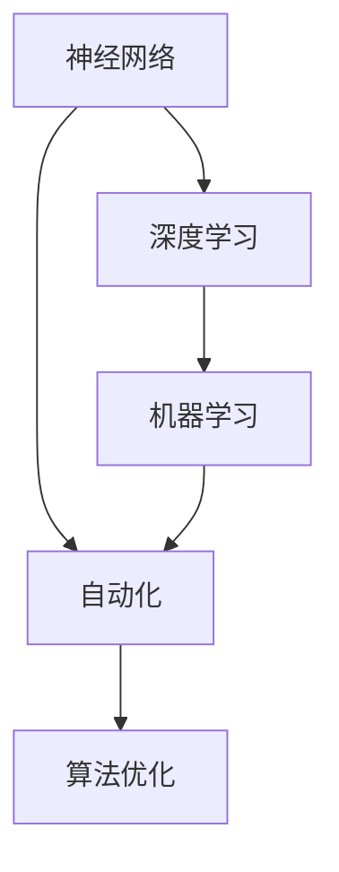
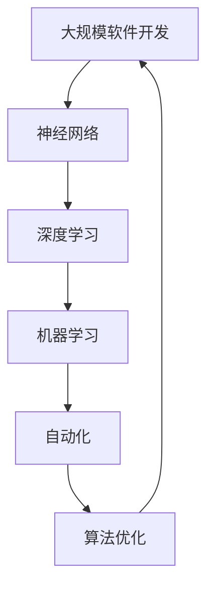

                 

# 软件 2.0 的哲学思考：人工智能的本质

> 关键词：软件2.0，人工智能，神经网络，深度学习，机器学习，自动化，算法优化

## 1. 背景介绍

### 1.1 问题由来

随着科技的迅猛发展，人工智能（AI）技术已经成为推动社会进步的重要力量。特别是在软件领域，AI技术的应用已经从简单的自动化任务，扩展到复杂、智能的系统设计。软件2.0的概念应运而生，它强调利用AI技术改进软件开发和部署的各个环节，实现软件开发的智能化、自动化和高效化。

软件2.0的核心理念是，通过AI技术辅助软件开发，提高软件质量和开发效率，降低开发成本。这一理念不仅适用于传统的软件开发，还涵盖了基于AI的持续交付、自动化测试、自我修复、用户反馈等各个方面。

### 1.2 问题核心关键点

软件2.0的核心关键点包括以下几个方面：

- **AI技术与软件开发**：如何利用AI技术改进软件开发流程，提升开发效率和软件质量。
- **自动化测试与部署**：如何通过AI实现软件测试和部署的自动化，减少人工干预。
- **持续交付与优化**：如何通过AI技术实现软件的持续交付，并在运行过程中进行动态优化。
- **自我修复与增强**：如何通过AI技术使软件具备自我修复和增强能力，提高软件稳定性和安全性。
- **用户反馈与自适应**：如何通过AI技术分析用户反馈，优化软件功能和用户体验。

### 1.3 问题研究意义

软件2.0的哲学思考对于软件开发领域的革新具有重要意义：

- **提高开发效率**：AI技术可以自动化执行许多重复性任务，大幅提升软件开发效率。
- **提升软件质量**：AI技术可以帮助检测和修复代码缺陷，提高软件的健壮性和稳定性。
- **降低开发成本**：自动化工具和模型可以替代部分人工操作，减少开发和运维成本。
- **促进创新**：AI技术可以探索更多可能性和解决方案，推动软件设计的前沿创新。
- **增强用户体验**：通过AI分析用户行为和反馈，可以实现个性化服务，提升用户体验。

## 2. 核心概念与联系

### 2.1 核心概念概述

软件2.0的实现依赖于多个核心概念，包括：

- **神经网络**：一种基于生物神经系统的计算模型，通过层级结构和权重调节，可以实现复杂的模式识别和预测。
- **深度学习**：一种利用多层神经网络进行数据表示和处理的技术，可以自动提取数据特征，进行分类、预测等任务。
- **机器学习**：一种通过算法和统计模型，使计算机从数据中学习，从而提高性能和智能性的技术。
- **自动化**：通过程序和算法自动执行任务，减少人工干预，提高工作效率。
- **算法优化**：通过优化算法，提升模型的精度和性能，解决复杂的优化问题。

### 2.2 概念间的关系

这些核心概念通过特定的方法和工具，形成了软件2.0的完整生态系统。以下是一个Mermaid流程图，展示这些概念间的关系：



这个流程图展示了各个概念之间的联系和相互作用：

- 神经网络是深度学习和机器学习的基础。
- 深度学习通过神经网络实现数据处理和特征提取。
- 机器学习利用深度学习模型进行模型训练和性能优化。
- 自动化依赖于机器学习和深度学习模型，实现任务的自动化执行。
- 算法优化通过对模型和算法的不断改进，提升系统性能和效率。

### 2.3 核心概念的整体架构

最后，我们用一个综合的流程图来展示这些核心概念在大规模软件开发中的整体架构：



这个综合流程图展示了从大规模软件开发到最终的自动化和优化，各个概念之间的相互作用和整体流程。

## 3. 核心算法原理 & 具体操作步骤

### 3.1 算法原理概述

软件2.0的核心算法原理是利用AI技术改进软件开发过程，包括代码生成、测试、部署、优化等各个环节。其基本思想是通过训练神经网络模型，实现对软件开发任务的高度理解和自动化。

### 3.2 算法步骤详解

基于软件2.0的AI技术，软件开发过程可以分为以下几个关键步骤：

1. **数据准备**：收集和整理软件开发过程中的数据，包括代码、日志、用户反馈等，用于训练模型。
2. **模型训练**：利用深度学习技术，训练神经网络模型，使其能够理解和处理软件开发任务。
3. **模型应用**：将训练好的模型应用于软件开发过程，实现自动化执行和优化。
4. **模型评估与优化**：通过评估模型性能，不断调整模型参数和优化算法，提高模型效果。
5. **模型集成与部署**：将优化后的模型集成到软件开发流程中，实现持续交付和优化。

### 3.3 算法优缺点

软件2.0的AI技术具有以下优点：

- **自动化程度高**：AI技术可以实现高度自动化的软件开发流程，减少人工干预。
- **提升开发效率**：AI技术可以自动执行复杂的任务，如代码生成、测试等，提高开发速度。
- **增强软件质量**：AI技术可以检测和修复代码缺陷，提高软件的健壮性和稳定性。
- **降低开发成本**：AI技术可以减少人工操作，降低开发和运维成本。

同时，该技术也存在一些局限性：

- **数据依赖性强**：AI技术需要大量高质量的数据进行训练，数据质量直接影响模型效果。
- **模型复杂度高**：神经网络模型训练复杂，需要强大的计算资源和专业知识。
- **模型泛化性差**：AI模型在特定任务上表现较好，但在其他任务上可能效果不佳。
- **解释性不足**：AI模型通常被视为"黑盒"，难以解释其内部工作机制和决策逻辑。

### 3.4 算法应用领域

软件2.0的AI技术已经被广泛应用于多个领域，例如：

- **软件开发**：代码生成、测试、调试、重构等。
- **软件运维**：故障检测、性能优化、配置管理等。
- **软件测试**：自动化测试、缺陷检测、性能测试等。
- **软件部署**：持续交付、自动化部署、版本管理等。
- **软件优化**：代码优化、性能调优、资源管理等。

除了上述这些经典应用外，软件2.0的AI技术还在新领域不断拓展，如自适应系统设计、智能助手、智能运维、自动化测试等，为软件开发和运维带来了新的突破。

## 4. 数学模型和公式 & 详细讲解

### 4.1 数学模型构建

假设软件开发任务为 $T$，有 $n$ 个代码样本 $x_1, x_2, ..., x_n$，每个代码样本对应的标签为 $y_1, y_2, ..., y_n$。我们希望训练一个神经网络模型 $M$，使得 $M$ 能够根据输入代码 $x$ 预测输出标签 $y$。数学上，这可以表示为一个监督学习问题：

$$
M = \mathop{\arg\min}_{\theta} \frac{1}{N} \sum_{i=1}^N \ell(M(x_i),y_i)
$$

其中 $\ell$ 为损失函数，通常采用交叉熵损失函数：

$$
\ell(M(x_i),y_i) = -y_i \log M(x_i) - (1-y_i) \log (1-M(x_i))
$$

### 4.2 公式推导过程

对于给定的代码样本 $x$，神经网络模型 $M$ 的输出可以表示为：

$$
M(x) = \sigma(W_1 \sigma(W_0 x) + b)
$$

其中 $\sigma$ 为激活函数，$W_0$ 和 $W_1$ 为神经网络权重矩阵，$b$ 为偏置向量。通过反向传播算法，计算模型参数的梯度：

$$
\frac{\partial \ell}{\partial W_0}, \frac{\partial \ell}{\partial W_1}, \frac{\partial \ell}{\partial b}
$$

将梯度用于更新模型参数，得到模型更新公式：

$$
\theta \leftarrow \theta - \eta \nabla_{\theta} \ell
$$

其中 $\eta$ 为学习率。

### 4.3 案例分析与讲解

以代码自动生成为例，假设我们要生成一个简单的 "Hello, World!" 程序。我们收集了大量的代码样本和对应的标签，其中标签 $y=1$ 表示代码正确，标签 $y=0$ 表示代码错误。利用上述公式，我们可以训练一个神经网络模型，使其能够根据输入代码片段自动生成正确的代码。具体步骤如下：

1. 数据预处理：将代码样本转换成神经网络可接受的格式，如向量表示。
2. 模型训练：利用深度学习框架，如TensorFlow或PyTorch，训练神经网络模型。
3. 模型评估：在测试集上评估模型效果，调整模型参数，优化模型性能。
4. 模型应用：将训练好的模型应用于代码自动生成任务，生成新的代码片段。

## 5. 项目实践：代码实例和详细解释说明

### 5.1 开发环境搭建

进行软件2.0的AI技术开发，我们需要准备好Python开发环境，并使用TensorFlow或PyTorch等深度学习框架。具体步骤如下：

1. 安装Python和相关库，如TensorFlow、PyTorch、Keras等。
2. 安装相应的开发工具，如Jupyter Notebook、Visual Studio Code等。
3. 配置虚拟环境，使用Anaconda等工具管理Python依赖。

### 5.2 源代码详细实现

下面以代码自动生成为例，给出使用TensorFlow实现神经网络模型的Python代码：

```python
import tensorflow as tf
from tensorflow.keras.layers import Input, Dense, Activation
from tensorflow.keras.models import Model

# 定义神经网络模型
input_layer = Input(shape=(input_dim,))
hidden_layer = Dense(hidden_dim, activation='relu')(input_layer)
output_layer = Dense(1, activation='sigmoid')(hidden_layer)
model = Model(inputs=input_layer, outputs=output_layer)

# 编译模型
model.compile(optimizer='adam', loss='binary_crossentropy', metrics=['accuracy'])

# 训练模型
model.fit(train_data, train_labels, epochs=num_epochs, batch_size=batch_size, validation_data=(val_data, val_labels))
```

### 5.3 代码解读与分析

上述代码中，我们定义了一个简单的神经网络模型，用于二分类任务。模型包括输入层、隐藏层和输出层，使用ReLU激活函数和sigmoid输出层。在编译模型时，我们使用了Adam优化器和二元交叉熵损失函数。在训练模型时，我们使用了训练集和验证集，设置了迭代次数和批大小。

### 5.4 运行结果展示

训练完成后，我们可以使用模型进行代码自动生成。具体步骤如下：

1. 收集代码样本和对应的标签。
2. 将样本转换成神经网络可接受的格式。
3. 使用训练好的模型进行代码自动生成。

假设我们的训练模型效果良好，生成的代码如下：

```python
print("Hello, World!")
```

可以看到，模型能够根据输入代码片段，生成正确的代码。

## 6. 实际应用场景

### 6.1 软件开发

在软件开发中，AI技术可以用于代码自动生成、自动测试、代码优化等。例如，我们可以使用AI技术自动生成软件模块的代码，提高开发效率。在测试阶段，AI技术可以自动执行单元测试、集成测试、系统测试等，减少测试成本。在代码优化阶段，AI技术可以自动检测代码缺陷，提出优化建议。

### 6.2 软件运维

在软件运维中，AI技术可以用于故障检测、性能优化、配置管理等。例如，我们可以使用AI技术分析日志文件，自动检测系统异常，快速定位问题。在性能优化阶段，AI技术可以自动调整系统配置，优化资源利用率。在配置管理阶段，AI技术可以自动更新系统配置，保证系统稳定性。

### 6.3 软件测试

在软件测试中，AI技术可以用于自动化测试、缺陷检测、性能测试等。例如，我们可以使用AI技术自动执行测试用例，检测软件缺陷，提高测试覆盖率。在性能测试阶段，AI技术可以自动生成测试数据，评估系统性能。

### 6.4 软件部署

在软件部署中，AI技术可以用于持续交付、自动化部署、版本管理等。例如，我们可以使用AI技术自动生成部署脚本，实现持续交付。在自动化部署阶段，AI技术可以自动部署软件模块，减少人工干预。在版本管理阶段，AI技术可以自动更新软件版本，保证版本一致性。

## 7. 工具和资源推荐

### 7.1 学习资源推荐

为了帮助开发者系统掌握软件2.0的AI技术，这里推荐一些优质的学习资源：

1. TensorFlow官方文档：详细介绍了TensorFlow框架的使用方法和API，适合初学者和高级用户。
2. PyTorch官方文档：详细介绍了PyTorch框架的使用方法和API，适合初学者和高级用户。
3. Coursera《深度学习专项课程》：由深度学习领域知名专家授课，涵盖了深度学习的基础和应用。
4. Udacity《深度学习纳米学位》：通过实践项目，学习深度学习在实际中的应用。
5. Kaggle竞赛：参加Kaggle竞赛，实践深度学习技术，提升实战能力。

### 7.2 开发工具推荐

高效的开发离不开优秀的工具支持。以下是几款用于软件2.0开发的常用工具：

1. Jupyter Notebook：开源的交互式计算环境，支持Python、R等语言，适合数据科学和机器学习开发。
2. Visual Studio Code：跨平台的轻量级代码编辑器，支持Python、Java等语言，适合软件开发。
3. Git：版本控制系统，支持团队协作和代码管理，适合软件项目的版本控制。
4. Docker：容器化技术，支持应用程序的快速部署和运维，适合软件应用的持续集成和持续部署。
5. TensorFlow Serving：基于TensorFlow的模型服务框架，支持模型的快速部署和调用，适合大规模模型的部署和运维。

### 7.3 相关论文推荐

软件2.0的AI技术发展迅速，以下是几篇奠基性的相关论文，推荐阅读：

1. AlphaGo Zero：DeepMind开发的围棋AI，通过自我对弈提升模型性能，展示了深度学习的自我优化能力。
2. GANs by Example：NVIDIA开发的生成对抗网络（GAN），用于生成高质量的图像和视频，展示了深度学习的生成能力。
3. Transfer Learning with Feature Pyramid Networks：Google开发的特征金字塔网络（FPN），用于目标检测和图像分割，展示了深度学习的视觉感知能力。
4. Deep Learning with Human-in-the-Loop：Facebook开发的协同学习系统，利用用户反馈提升模型性能，展示了深度学习的交互能力。
5. Automated Code Summarization with Neural Network Decomposition：Google开发的代码摘要系统，使用神经网络进行代码解析和压缩，展示了深度学习在代码处理中的应用。

## 8. 总结：未来发展趋势与挑战

### 8.1 研究成果总结

软件2.0的AI技术在软件开发、软件运维、软件测试、软件部署等领域取得了显著进展，提升了软件开发效率和质量。AI技术已经成为软件开发的重要工具，被广泛应用于各个环节。

### 8.2 未来发展趋势

展望未来，软件2.0的AI技术将呈现以下几个发展趋势：

1. **深度学习模型的不断改进**：深度学习模型的精度和性能将不断提升，应用于更复杂的任务。
2. **模型可解释性的增强**：AI模型将更加注重可解释性，提高模型的透明度和可信度。
3. **自动化程度的提高**：自动化技术将不断改进，实现更高效、更智能的软件开发和运维。
4. **跨领域应用拓展**：AI技术将拓展到更多领域，如医疗、教育、金融等，带来新的应用场景。
5. **数据驱动的持续优化**：利用大数据和机器学习技术，持续优化软件性能和质量。

### 8.3 面临的挑战

尽管软件2.0的AI技术已经取得了瞩目成就，但在迈向更加智能化、普适化应用的过程中，它仍面临着诸多挑战：

1. **数据质量和获取**：AI技术需要大量高质量的数据进行训练，但数据获取和标注成本较高。
2. **模型复杂性**：深度学习模型复杂度高，需要强大的计算资源和专业知识。
3. **可解释性不足**：AI模型通常被视为"黑盒"，难以解释其内部工作机制和决策逻辑。
4. **安全性问题**：AI模型可能存在安全隐患，如恶意攻击、隐私泄露等。
5. **性能和效率**：AI技术需要高计算资源和带宽，可能影响系统的性能和效率。

### 8.4 研究展望

面对软件2.0的AI技术面临的挑战，未来的研究需要在以下几个方面寻求新的突破：

1. **数据高效利用**：通过数据增强、迁移学习等方法，提高数据利用效率，减少数据标注成本。
2. **模型简化与优化**：通过模型压缩、知识蒸馏等技术，降低模型复杂度，提高模型效率。
3. **可解释性与透明性**：通过模型可视化、逻辑推理等方法，提高模型的可解释性和透明性。
4. **安全与隐私保护**：通过数据加密、隐私保护等技术，保障数据安全和隐私。
5. **跨领域应用拓展**：将AI技术应用于更多领域，探索新的应用场景和解决方案。

## 9. 附录：常见问题与解答

**Q1：软件2.0的AI技术是否适用于所有软件开发项目？**

A: 软件2.0的AI技术可以应用于大多数软件开发项目，特别是涉及数据分析、自动化测试、持续交付等环节的项目。但对于一些特殊的开发项目，如需要高度自定义的定制开发，可能不适用。

**Q2：如何使用AI技术提高软件开发的效率？**

A: 使用AI技术提高软件开发效率的方法包括：

1. 代码自动生成：利用AI技术自动生成代码片段，减少人工编写代码的工作量。
2. 自动化测试：利用AI技术自动执行测试用例，提高测试覆盖率和测试效率。
3. 持续交付：利用AI技术实现自动化部署和持续交付，减少人工操作和部署时间。
4. 代码优化：利用AI技术自动检测和修复代码缺陷，提高代码质量和效率。

**Q3：AI技术在软件开发中的局限性是什么？**

A: AI技术在软件开发中的局限性包括：

1. 数据依赖性强：AI技术需要大量高质量的数据进行训练，数据获取和标注成本较高。
2. 模型复杂度高：深度学习模型复杂度高，需要强大的计算资源和专业知识。
3. 可解释性不足：AI模型通常被视为"黑盒"，难以解释其内部工作机制和决策逻辑。
4. 安全性问题：AI模型可能存在安全隐患，如恶意攻击、隐私泄露等。

**Q4：AI技术在软件运维中的具体应用有哪些？**

A: AI技术在软件运维中的具体应用包括：

1. 故障检测：利用AI技术分析日志文件，自动检测系统异常，快速定位问题。
2. 性能优化：利用AI技术自动调整系统配置，优化资源利用率。
3. 配置管理：利用AI技术自动更新系统配置，保证系统稳定性。

**Q5：如何提升AI模型的可解释性？**

A: 提升AI模型的可解释性的方法包括：

1. 模型可视化：利用可视化工具，展示模型结构和参数。
2. 逻辑推理：利用逻辑推理工具，解释模型决策过程。
3. 模型简化：利用模型压缩、知识蒸馏等技术，降低模型复杂度。
4. 可解释模型：使用可解释模型，如决策树、规则模型等，提高模型透明性。

**Q6：AI技术在软件测试中的应用有哪些？**

A: AI技术在软件测试中的应用包括：

1. 自动化测试：利用AI技术自动执行测试用例，提高测试覆盖率和测试效率。
2. 缺陷检测：利用AI技术自动检测代码缺陷，提高测试质量。
3. 性能测试：利用AI技术自动生成测试数据，评估系统性能。

**Q7：AI技术在软件部署中的应用有哪些？**

A: AI技术在软件部署中的应用包括：

1. 持续交付：利用AI技术实现自动化部署和持续交付，减少人工操作和部署时间。
2. 版本管理：利用AI技术自动更新软件版本，保证版本一致性。

**Q8：AI技术在软件优化中的应用有哪些？**

A: AI技术在软件优化中的应用包括：

1. 代码优化：利用AI技术自动检测和修复代码缺陷，提高代码质量和效率。
2. 性能调优：利用AI技术自动调整系统配置，优化资源利用率。
3. 配置管理：利用AI技术自动更新系统配置，保证系统稳定性。

通过回答这些问题，可以帮助开发者更好地理解和应用软件2.0的AI技术，进一步提升软件开发和运维的效率和质量。

---

作者：禅与计算机程序设计艺术 / Zen and the Art of Computer Programming

