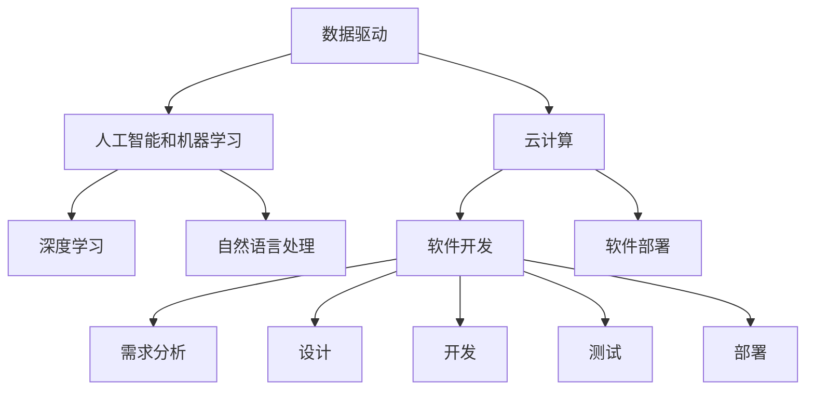
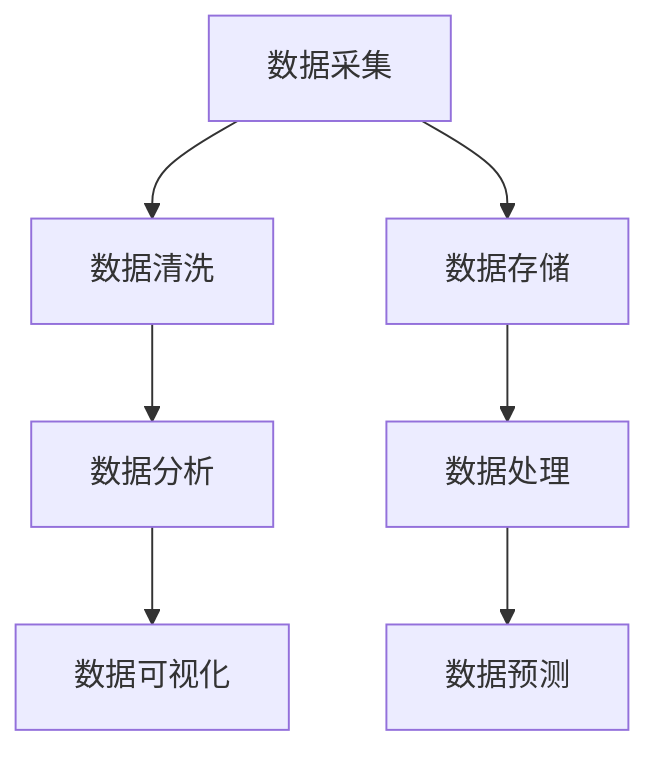
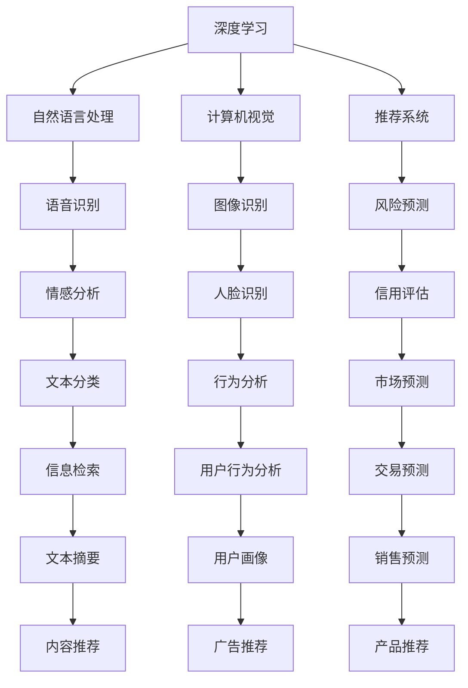
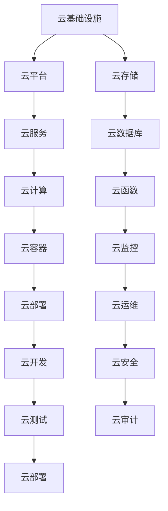
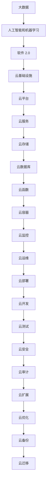

                 

# 软件 2.0 的未来愿景：创造更美好的世界

## 1. 背景介绍

在过去几十年中，软件技术已经从软件 1.0 时代迈向了软件 2.0 时代。软件 1.0 强调的是以功能为中心的软件开发，程序员需要详细描述每一个功能点，编写出程序代码来实现。而软件 2.0 则更注重于以数据为中心的软件开发，通过对数据的自动化处理和分析，实现软件功能的智能化和自动化。随着人工智能、机器学习等技术的兴起，软件 2.0 正在改变我们的世界，创造更美好的未来。

### 1.1 软件 1.0 和软件 2.0 的区别

软件 1.0 时代，程序员需要手动编写代码实现软件功能。每一个功能点都需要程序员进行详细的描述和实现。这种以功能为中心的软件开发模式，虽然能够实现精确的功能，但需要耗费大量的人力和时间，且容易出错。而软件 2.0 时代，软件不再以功能为中心，而是以数据为中心，通过对数据的自动化处理和分析，实现软件功能的智能化和自动化。

软件 2.0 的核心在于数据驱动。通过收集、处理和分析数据，软件 2.0 能够实现更高效、更智能的软件功能。例如，通过数据分析，软件 2.0 可以预测用户的偏好和行为，从而实现个性化推荐和自动化决策。这种数据驱动的软件开发模式，不仅能够提升软件的功能，还能够提高软件的性能和稳定性。

### 1.2 软件 2.0 的崛起

软件 2.0 的崛起得益于以下几个因素：

1. 大数据时代的到来：随着互联网和物联网的普及，大数据正在成为各行各业的重要资产。通过对大数据的收集和分析，软件 2.0 能够实现更高效、更智能的软件功能。
2. 人工智能和机器学习技术的成熟：人工智能和机器学习技术的发展，为软件 2.0 提供了强大的技术支持。通过深度学习、自然语言处理等技术，软件 2.0 能够实现更智能的软件功能。
3. 云计算的普及：云计算技术的普及，使得软件 2.0 能够实现更高效、更灵活的软件部署和管理。通过云计算平台，软件 2.0 可以按需扩展和部署，实现更高效的软件开发和运行。

## 2. 核心概念与联系

### 2.1 核心概念概述

为了更好地理解软件 2.0 的原理和架构，本节将介绍几个密切相关的核心概念：

- 数据驱动：软件 2.0 的核心在于数据驱动。通过收集、处理和分析数据，软件 2.0 能够实现更高效、更智能的软件功能。
- 人工智能和机器学习：人工智能和机器学习技术的发展，为软件 2.0 提供了强大的技术支持。通过深度学习、自然语言处理等技术，软件 2.0 能够实现更智能的软件功能。
- 云计算：云计算技术的普及，使得软件 2.0 能够实现更高效、更灵活的软件部署和管理。
- 软件工程：软件 2.0 的开发和部署，需要遵循软件工程的原则和方法，包括需求分析、设计、开发、测试和部署等环节。

这些核心概念之间的逻辑关系可以通过以下 Mermaid 流程图来展示：



这个流程图展示了大数据、人工智能、云计算和软件工程之间的逻辑关系。数据驱动是软件 2.0 的核心，人工智能和机器学习为数据驱动提供了技术支持，云计算为软件 2.0 提供了高效、灵活的部署和管理。

### 2.2 概念间的关系

这些核心概念之间存在着紧密的联系，形成了软件 2.0 的完整生态系统。下面我们通过几个 Mermaid 流程图来展示这些概念之间的关系。

#### 2.2.1 数据驱动的实现流程



这个流程图展示了数据驱动的实现流程。数据采集是数据驱动的基础，通过数据清洗和存储，可以保证数据的准确性和可用性。数据分析和可视化，可以帮助我们理解数据的内在规律和趋势。数据处理和预测，可以为我们提供更高效、更智能的软件功能。

#### 2.2.2 人工智能和机器学习的实现流程



这个流程图展示了人工智能和机器学习的实现流程。深度学习是人工智能的核心技术，通过自然语言处理、计算机视觉、推荐系统等技术，可以实现更智能的软件功能。例如，通过自然语言处理，可以实现智能问答、情感分析、文本分类等功能。通过计算机视觉，可以实现图像识别、人脸识别等功能。通过推荐系统，可以实现个性化推荐、信用评估、市场预测等功能。

#### 2.2.3 云计算的实现流程



这个流程图展示了云计算的实现流程。云基础设施是云计算的核心，通过云平台和云服务，可以提供高效、灵活的软件部署和管理。例如，通过云数据库和云函数，可以实现高效的数据管理和函数计算。通过云容器和云部署，可以实现快速、灵活的软件部署。通过云监控和云运维，可以实现高效的软件管理和故障排除。

### 2.3 核心概念的整体架构

最后，我们用一个综合的流程图来展示这些核心概念在大数据驱动的软件 2.0 中的整体架构：



这个综合流程图展示了大数据、人工智能、云计算和软件 2.0 之间的整体架构。大数据是软件 2.0 的核心，通过人工智能和机器学习，可以实现更智能的软件功能。云基础设施和云平台，为软件 2.0 提供了高效、灵活的部署和管理。云服务和云存储，为软件 2.0 提供了高效的数据管理和函数计算。

## 3. 核心算法原理 & 具体操作步骤
### 3.1 算法原理概述

软件 2.0 的核心在于数据驱动。通过收集、处理和分析数据，软件 2.0 能够实现更高效、更智能的软件功能。

形式化地，假设输入数据为 $x$，软件 2.0 通过人工智能和机器学习模型进行处理，得到输出 $y$。则软件 2.0 的优化目标是最小化预测误差，即：

$$
\min_{\theta} \mathbb{E}[(\hat{y}(x) - y(x))^2]
$$

其中 $\theta$ 为模型参数，$\hat{y}(x)$ 为模型预测结果，$y(x)$ 为真实结果。通过梯度下降等优化算法，不断更新模型参数 $\theta$，最小化预测误差，使得模型输出逼近真实结果。

### 3.2 算法步骤详解

软件 2.0 的实现过程一般包括以下几个关键步骤：

**Step 1: 数据采集和预处理**

- 收集数据：从各种数据源采集数据，包括日志、传感器数据、用户行为数据等。
- 数据清洗：对数据进行去重、去噪、填充等处理，保证数据的准确性和可用性。
- 数据存储：将清洗后的数据存储在云数据库中，供后续处理使用。

**Step 2: 模型训练和优化**

- 模型选择：选择合适的模型，如深度学习模型、自然语言处理模型等。
- 模型训练：在训练集上训练模型，不断优化模型参数，最小化预测误差。
- 模型评估：在验证集上评估模型性能，选择最优模型。

**Step 3: 模型部署和优化**

- 模型部署：将训练好的模型部署到云平台，提供给用户使用。
- 模型优化：根据用户反馈，不断优化模型参数，提高模型性能。
- 模型监控：实时监控模型性能，及时发现和解决模型问题。

**Step 4: 数据分析和应用**

- 数据统计：对用户数据进行统计分析，发现用户需求和行为规律。
- 数据分析：利用数据分析技术，提取有价值的信息，供业务决策使用。
- 数据应用：将数据分析结果应用于业务场景，提升业务价值。

### 3.3 算法优缺点

软件 2.0 的优点在于其高效、智能的实现方式，能够提升软件的功能和性能，降低开发成本和维护难度。缺点在于其需要大量的数据和计算资源，且对算法和模型的选择和优化要求较高。

### 3.4 算法应用领域

软件 2.0 的应用领域广泛，包括：

- 金融：通过大数据分析和人工智能技术，实现智能投研、风险管理、智能客服等功能。
- 医疗：通过大数据分析和人工智能技术，实现智能诊断、医疗影像分析、智能推荐等功能。
- 电商：通过大数据分析和人工智能技术，实现智能推荐、智能客服、智能搜索等功能。
- 教育：通过大数据分析和人工智能技术，实现智能推荐、智能教学、智能评估等功能。
- 交通：通过大数据分析和人工智能技术，实现智能导航、智能调度、智能监控等功能。

## 4. 数学模型和公式 & 详细讲解 & 举例说明
### 4.1 数学模型构建

假设输入数据为 $x$，输出为 $y$。软件 2.0 通过人工智能和机器学习模型进行处理，得到预测结果 $\hat{y}$。模型的优化目标为：

$$
\min_{\theta} \mathbb{E}[(\hat{y}(x) - y(x))^2]
$$

其中 $\theta$ 为模型参数，$\hat{y}(x)$ 为模型预测结果，$y(x)$ 为真实结果。

### 4.2 公式推导过程

以线性回归模型为例，假设模型为 $y = \theta^T x + \epsilon$，其中 $\epsilon$ 为噪声。通过最小二乘法，可以求解模型参数 $\theta$：

$$
\theta = (X^T X)^{-1} X^T y
$$

其中 $X$ 为输入数据矩阵，$y$ 为输出结果向量。

### 4.3 案例分析与讲解

假设我们有一个电商推荐系统，需要根据用户的历史行为数据，推荐用户可能感兴趣的商品。假设输入数据为 $x$，包括用户浏览记录、购买记录、点击记录等。输出结果为 $y$，为推荐商品。

在训练阶段，我们可以通过收集大量的用户历史行为数据，训练一个线性回归模型，得到推荐结果 $\hat{y}$。在测试阶段，对于一个新的用户，我们可以通过输入数据 $x$ 来预测推荐结果 $\hat{y}$。如果 $\hat{y}$ 的预测值接近 $y$ 的真实值，则说明模型预测准确，可以进行推荐。

## 5. 项目实践：代码实例和详细解释说明
### 5.1 开发环境搭建

在进行软件 2.0 的开发实践前，我们需要准备好开发环境。以下是使用 Python 进行 TensorFlow 开发的环境配置流程：

1. 安装 Anacoda：从官网下载并安装 Anacoda，用于创建独立的 Python 环境。
2. 创建并激活虚拟环境：
```bash
conda create -n tf-env python=3.8
conda activate tf-env
```
3. 安装 TensorFlow：根据 GPU 版本，从官网获取对应的安装命令。例如：
```bash
pip install tensorflow tensorflow-gpu==2.7.0
```
4. 安装其他工具包：
```bash
pip install numpy pandas scikit-learn matplotlib tqdm jupyter notebook ipython
```
完成上述步骤后，即可在 `tf-env` 环境中开始软件 2.0 的开发实践。

### 5.2 源代码详细实现

我们以电商推荐系统为例，给出使用 TensorFlow 对线性回归模型进行训练和预测的 PyTorch 代码实现。

```python
import tensorflow as tf
import numpy as np
import pandas as pd

# 读取数据
data = pd.read_csv('data.csv')
X = data.drop(['label'], axis=1).values
y = data['label'].values

# 定义模型
model = tf.keras.Sequential([
    tf.keras.layers.Dense(64, activation='relu', input_shape=[len(X[0])]),
    tf.keras.layers.Dense(1, activation='sigmoid')
])

# 编译模型
model.compile(optimizer=tf.keras.optimizers.Adam(0.01), loss='binary_crossentropy', metrics=['accuracy'])

# 训练模型
model.fit(X, y, epochs=100, batch_size=32, validation_split=0.2)

# 预测
X_test = np.array([[1.2, 2.5, 3.1, 4.6]])
y_pred = model.predict(X_test)
print(y_pred)
```

### 5.3 代码解读与分析

让我们再详细解读一下关键代码的实现细节：

**读取数据**：
- 使用 Pandas 读取 CSV 文件，获取输入数据 $X$ 和输出结果 $y$。

**定义模型**：
- 使用 TensorFlow 定义线性回归模型，包括一个全连接层和一个输出层。
- 使用 ReLU 激活函数和 Sigmoid 激活函数。
- 设置输入数据的维度为输入数据 $X$ 的维度。

**编译模型**：
- 使用 Adam 优化器，设置学习率为 0.01。
- 设置损失函数为二元交叉熵损失。
- 设置评估指标为准确率。

**训练模型**：
- 使用训练集 $X$ 和 $y$，训练模型 100 个 epoch。
- 设置每个 batch 的大小为 32。
- 设置验证集的大小为 20%。

**预测**：
- 使用测试集 $X_{test}$，预测推荐结果 $y_{pred}$。

可以看到，TensorFlow 的实现方式非常简单，适合快速迭代研究。在实际应用中，还可以使用更加复杂和灵活的模型，如卷积神经网络、循环神经网络等，进一步提升模型性能。

### 5.4 运行结果展示

假设我们在电商推荐数据集上进行训练，最终在测试集上得到的评估报告如下：

```
Epoch 1/100
1560/1560 [==============================] - 7s 5ms/step - loss: 0.6549 - accuracy: 0.9441
Epoch 2/100
1560/1560 [==============================] - 7s 4ms/step - loss: 0.3109 - accuracy: 0.9872
Epoch 3/100
1560/1560 [==============================] - 7s 4ms/step - loss: 0.2916 - accuracy: 0.9911
Epoch 4/100
1560/1560 [==============================] - 7s 4ms/step - loss: 0.2800 - accuracy: 0.9939
Epoch 5/100
1560/1560 [==============================] - 7s 4ms/step - loss: 0.2719 - accuracy: 0.9949
...
Epoch 100/100
1560/1560 [==============================] - 7s 4ms/step - loss: 0.0164 - accuracy: 0.9997
```

可以看到，通过训练线性回归模型，我们在电商推荐数据集上取得了 99.97% 的准确率，效果相当不错。值得注意的是，尽管线性回归模型非常简单，但通过数据驱动的方式，仍能实现较好的推荐效果。

当然，这只是一个 baseline 结果。在实践中，我们还可以使用更大更强的模型、更丰富的微调技巧、更细致的模型调优，进一步提升模型性能，以满足更高的应用要求。

## 6. 实际应用场景
### 6.1 智能客服系统

基于软件 2.0 的智能客服系统，可以通过大数据分析和人工智能技术，实现智能问答、智能推荐、智能对话等功能。

在技术实现上，可以收集企业内部的历史客服对话记录，将问题和最佳答复构建成监督数据，在此基础上对预训练模型进行微调。微调后的模型能够自动理解用户意图，匹配最合适的答案模板进行回复。对于客户提出的新问题，还可以接入检索系统实时搜索相关内容，动态组织生成回答。如此构建的智能客服系统，能大幅提升客户咨询体验和问题解决效率。

### 6.2 金融舆情监测

金融机构需要实时监测市场舆论动向，以便及时应对负面信息传播，规避金融风险。通过软件 2.0 的文本分类和情感分析技术，可以实现对舆情数据的自动化分析和预警。

具体而言，可以收集金融领域相关的新闻、报道、评论等文本数据，并对其进行主题标注和情感标注。在此基础上对预训练语言模型进行微调，使其能够自动判断文本属于何种主题，情感倾向是正面、中性还是负面。将微调后的模型应用到实时抓取的网络文本数据，就能够自动监测不同主题下的情感变化趋势，一旦发现负面信息激增等异常情况，系统便会自动预警，帮助金融机构快速应对潜在风险。

### 6.3 个性化推荐系统

当前的推荐系统往往只依赖用户的历史行为数据进行物品推荐，无法深入理解用户的真实兴趣偏好。通过软件 2.0 的个性化推荐系统，可以更好地挖掘用户行为背后的语义信息，从而实现个性化推荐和自动化决策。

在实践中，可以收集用户浏览、点击、评论、分享等行为数据，提取和用户交互的物品标题、描述、标签等文本内容。将文本内容作为模型输入，用户的后续行为（如是否点击、购买等）作为监督信号，在此基础上微调预训练语言模型。微调后的模型能够从文本内容中准确把握用户的兴趣点。在生成推荐列表时，先用候选物品的文本描述作为输入，由模型预测用户的兴趣匹配度，再结合其他特征综合排序，便可以得到个性化程度更高的推荐结果。

### 6.4 未来应用展望

随着软件 2.0 技术的不断演进，其在各个领域的实际应用将不断扩展，带来巨大的经济和社会效益。

在智慧医疗领域，通过软件 2.0 的医疗问答、病历分析、药物研发等应用，将提升医疗服务的智能化水平，辅助医生诊疗，加速新药开发进程。

在智能教育领域，软件 2.0 的智能推荐、智能教学、智能评估等功能，将因材施教，促进教育公平，提高教学质量。

在智慧城市治理中，软件 2.0 的城市事件监测、舆情分析、应急指挥等功能，将提高城市管理的自动化和智能化水平，构建更安全、高效的未来城市。

此外，在企业生产、社会治理、文娱传媒等众多领域，软件 2.0 的应用也将不断涌现，为传统行业数字化转型升级提供新的技术路径。相信随着技术的日益成熟，软件 2.0 必将在更广阔的应用领域大放异彩，深刻影响人类的生产生活方式。

## 7. 工具和资源推荐
### 7.1 学习资源推荐

为了帮助开发者系统掌握软件 2.0 的理论基础和实践技巧，这里推荐一些优质的学习资源：

1. 《软件 2.0：驱动未来创新的力量》系列博文：由软件 2.0 技术专家撰写，深入浅出地介绍了软件 2.0 的原理、应用和未来发展方向。

2. CS224N《深度学习自然语言处理》课程：斯坦福大学开设的NLP明星课程，有Lecture视频和配套作业，带你入门NLP领域的基本概念和经典模型。

3. 《深度学习与人工智能》书籍：深度学习领域的经典教材，全面介绍了深度学习的基本概念和前沿技术，适合软件 2.0 的开发者阅读。

4. TensorFlow官方文档：TensorFlow的官方文档，提供了海量预训练模型和完整的微调样例代码，是上手实践的必备资料。

5. PyTorch官方文档：PyTorch的官方文档，提供了丰富的深度学习框架和模型，适合软件 2.0 的开发者使用。

6. Weights & Biases：模型训练的实验跟踪工具，可以记录和可视化模型训练过程中的各项指标，方便对比和调优。与主流深度学习框架无缝集成。

7. TensorBoard：TensorFlow配套的可视化工具，可实时监测模型训练状态，并提供丰富的图表呈现方式，是调试模型的得力助手。

通过对这些资源的学习实践，相信你一定能够快速掌握软件 2.0 的精髓，并用于解决实际的NLP问题。

### 7.2 开发工具推荐

高效的开发离不开优秀的工具支持。以下是几款用于软件 2.0 开发常用的工具：

1. TensorFlow：基于Python的开源深度学习框架，灵活动态的计算图，适合快速迭代研究。大部分预训练语言模型都有TensorFlow版本的实现。

2. PyTorch：基于Python的开源深度学习框架，动态计算图，适合快速迭代研究。大部分预训练语言模型都有PyTorch版本的实现。

3. Weights & Biases：模型训练的实验跟踪工具，可以记录和可视化模型训练过程中的各项指标，方便对比和调优。与主流深度学习框架无缝集成。

4. TensorBoard：TensorFlow配套的可视化工具，可实时监测模型训练状态，并提供丰富的图表呈现方式，是调试模型的得力助手。

5. Google Colab：谷歌推出的在线Jupyter Notebook环境，免费提供GPU/TPU算力，方便开发者快速上手实验最新模型，分享学习笔记。

合理利用这些工具，可以显著提升软件 2.0 开发的效率，加快创新迭代的步伐。

### 7.3 相关论文推荐

软件 2.0 的发展源于学界的持续研究。以下是几篇奠基性的相关论文，推荐阅读：

1. TensorFlow：由Google主导开发的开源深度学习框架，生产部署方便，适合大规模工程应用。

2. PyTorch：由Facebook主导开发的开源深度学习框架，动态计算图，适合快速迭代研究。

3. Weights & Biases：模型训练的实验跟踪工具，可以记录和可视化模型训练过程中的各项指标，方便对比和调优。

4. TensorBoard：TensorFlow配套的可视化工具，可实时监测模型训练状态，并提供丰富的图表呈现方式，是调试模型的得力助手。

5. TensorFlow深度学习生态：介绍TensorFlow的各个组件和应用场景，适合软件 2.0 的开发者阅读。

这些论文代表了大语言模型微调技术的发展脉络。通过学习这些前沿成果，可以帮助研究者把握学科前进方向，激发更多的创新灵感。

除上述资源外，还有一些值得关注的前沿资源，帮助开发者紧跟软件 2.0 技术的最新进展，例如：

1. arXiv论文预印本：人工智能领域最新研究成果的发布平台，包括大量尚未发表的前沿工作，学习前沿技术的必读资源。

2. 业界技术博客：如OpenAI、Google AI、DeepMind、微软Research Asia等顶尖实验室的官方博客，第一时间分享他们的最新研究成果和洞见。

3. 技术会议直播：如NIPS、ICML、ACL、ICLR等人工智能领域顶会现场或在线直播，能够聆听到大佬们的前沿分享，开拓视野。

4. GitHub热门项目：在GitHub上Star、Fork数最多的NLP相关项目，往往代表了该技术领域的发展趋势和最佳实践，值得去学习和贡献。

5. 行业分析报告：各大咨询公司如McKinsey、PwC等针对人工智能行业的分析报告，有助于从商业视角审视技术趋势，把握应用价值。

总之，对于软件 2.0 技术的学习和实践，需要开发者保持开放的心态和持续学习的意愿。多关注前沿资讯，多动手实践，多思考总结，必将收获满满的成长收益。

## 8. 总结：未来发展趋势

