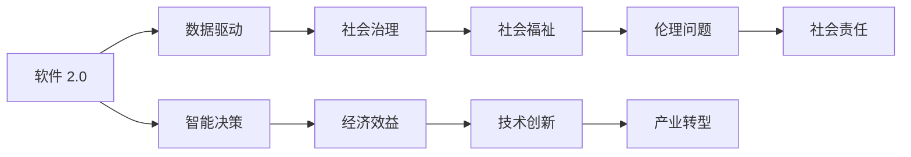

                 

## 1. 背景介绍

随着软件技术的飞速发展，我们正在迈入一个全新的时代——软件 2.0。软件 2.0 不仅是指软件工程的变革，更是指软件在社会治理、经济发展、文化繁荣等方面的深度融合和广泛应用。在这个过程中，软件不仅是一个工具，更是一种推动社会进步的力量。然而，软件 2.0 的普及和应用也伴随着一系列的社会责任和伦理问题。本文将从软件 2.0 的定义、社会责任以及如何实现科技向善三个方面进行探讨，以期为软件开发者、管理者和社会各界提供一些思考和指导。

## 2. 核心概念与联系

### 2.1 核心概念概述

要理解软件 2.0 的社会责任，首先需要理解什么是软件 2.0。软件 2.0 是指通过机器学习、人工智能等先进技术，实现软件智能化的过程。不同于传统的软件 1.0，软件 2.0 更加注重数据驱动、用户交互和智能决策，强调软件对复杂问题的处理能力以及与人类协作的效率。软件 2.0 的核心技术包括但不限于自然语言处理、计算机视觉、推荐系统等。

软件 2.0 的社会责任是指软件在构建、应用和维护过程中，应承担起的对社会、环境、个人等多方面的责任和义务。这包括但不限于数据隐私保护、算法公平性、社会福祉提升等。

### 2.2 核心概念之间的关系

软件 2.0 与社会责任之间存在着密切的联系。一方面，软件 2.0 技术的发展和应用，极大地影响了社会生活的方方面面，从教育、医疗到金融、交通，无不受到软件 2.0 的深刻影响。另一方面，软件 2.0 的应用必须考虑到其可能带来的社会影响，确保其对社会的贡献大于其负面影响。

为了更好地理解软件 2.0 与社会责任之间的关系，我们可以用一个简单的 Mermaid 流程图来表示：



这个流程图展示了软件 2.0 技术如何通过数据驱动和智能决策，影响社会治理、经济效益、技术创新等各个方面，同时也带来了伦理问题和需要承担的社会责任。

## 3. 核心算法原理 & 具体操作步骤

### 3.1 算法原理概述

软件 2.0 的社会责任实现，离不开算法原理和具体操作步骤的支撑。在这个过程中，机器学习和人工智能技术扮演着关键角色。以推荐系统为例，它的核心算法包括协同过滤、基于内容的推荐、基于矩阵分解的推荐等。这些算法不仅能够提升用户的体验，还能在一定程度上保护用户的隐私，促进公平性。

### 3.2 算法步骤详解

#### 3.2.1 数据收集与预处理

软件 2.0 的社会责任实现，首先需要对数据进行收集和预处理。在推荐系统中，需要收集用户的浏览、购买、评分等行为数据，并对这些数据进行清洗和处理，以去除噪声和冗余。

#### 3.2.2 模型训练与评估

在数据处理完成后，需要进行模型训练。在推荐系统中，可以使用协同过滤、基于内容的推荐等算法进行训练。在训练过程中，需要设置合适的损失函数、学习率和正则化参数，并通过交叉验证等方法进行模型评估。

#### 3.2.3 部署与优化

模型训练完成后，需要进行部署。在推荐系统中，通常会将模型部署到服务器上，通过API接口供用户调用。在部署过程中，需要对模型进行优化，以提高其响应速度和计算效率。

#### 3.2.4 社会责任评估

在模型部署后，需要对其实现的社会责任进行评估。这包括数据隐私保护、算法公平性、用户满意度等方面的评估。通过评估，可以发现模型存在的问题，并进行改进和优化。

### 3.3 算法优缺点

#### 3.3.1 优点

软件 2.0 的社会责任算法具有以下优点：

- 高效性：通过机器学习和大数据分析，可以迅速处理海量数据，提升用户体验。
- 可解释性：一些算法，如线性回归、逻辑回归等，可以提供明确的决策路径，便于解释。
- 灵活性：算法可以根据不同的应用场景进行调整，以适应不同的需求。

#### 3.3.2 缺点

软件 2.0 的社会责任算法也存在一些缺点：

- 数据依赖：算法的性能高度依赖于数据质量，数据偏差可能导致算法偏见。
- 模型复杂性：一些复杂的算法，如深度学习、强化学习等，模型结构和参数较多，难以理解和调试。
- 隐私问题：算法需要处理大量的用户数据，数据隐私保护是重要的挑战。

### 3.4 算法应用领域

软件 2.0 的社会责任算法广泛应用于各个领域，包括但不限于：

- 推荐系统：通过分析用户行为数据，为用户推荐个性化产品和服务。
- 金融风控：通过机器学习模型，评估借款人的信用风险，提高贷款审批效率。
- 医疗诊断：通过深度学习算法，分析医学影像，辅助医生进行诊断。
- 智能客服：通过自然语言处理技术，实现智能客服，提升客户体验。

## 4. 数学模型和公式 & 详细讲解 & 举例说明

### 4.1 数学模型构建

以推荐系统为例，推荐系统的数学模型可以表示为：

$$
\hat{y} = f(x; \theta)
$$

其中，$x$ 表示用户的特征向量，$\theta$ 表示模型的参数，$f$ 表示模型的映射函数。推荐系统通常使用矩阵分解的方法，将用户和物品之间的评分矩阵分解为用户和物品的隐向量表示，从而实现推荐。

### 4.2 公式推导过程

以矩阵分解为例，设用户和物品的评分矩阵为 $R \in \mathbb{R}^{m \times n}$，其中 $m$ 表示用户数，$n$ 表示物品数。用户和物品的隐向量表示分别为 $U \in \mathbb{R}^{m \times d}$ 和 $V \in \mathbb{R}^{n \times d}$，其中 $d$ 表示特征维度。

矩阵分解的目标是找到最优的 $U$ 和 $V$，使得 $R \approx UV^T$。通过最小化损失函数 $\|R - UV^T\|_F^2$，可以得到 $U$ 和 $V$ 的最优值，其中 $\|\cdot\|_F$ 表示 Frobenius 范数。

### 4.3 案例分析与讲解

假设我们有一个电商平台的推荐系统，需要为用户推荐他们可能感兴趣的商品。我们可以使用矩阵分解的方法，将用户和商品之间的评分矩阵进行分解，得到用户的隐向量 $U$ 和商品的隐向量 $V$。然后，通过计算 $U$ 和 $V$ 的点积，得到用户对商品的评分预测 $\hat{y}$，最后选择评分预测最高的商品作为推荐结果。

## 5. 项目实践：代码实例和详细解释说明

### 5.1 开发环境搭建

要搭建一个推荐系统，首先需要安装 Python、NumPy、SciPy 等科学计算库，以及 TensorFlow 或 PyTorch 等深度学习框架。然后，需要准备数据集，并进行数据预处理。

### 5.2 源代码详细实现

以下是一个简单的推荐系统代码实现，使用 TensorFlow 框架：

```python
import tensorflow as tf
import numpy as np

# 数据预处理
def preprocess_data(data):
    # 将数据转化为稀疏矩阵形式
    data = np.where(data != 0, 1, 0)
    return data

# 构建模型
def build_model():
    # 定义输入输出
    user_input = tf.keras.Input(shape=(n_users, ), dtype=tf.int32, name='user_input')
    item_input = tf.keras.Input(shape=(n_items, ), dtype=tf.int32, name='item_input')
    
    # 构建矩阵分解模型
    user_factors = tf.keras.layers.Embedding(n_users, d)(user_input)
    item_factors = tf.keras.layers.Embedding(n_items, d)(item_input)
    dot_product = tf.keras.layers.Dot(axes=(1, 1), normalize=True)([user_factors, item_factors])
    
    # 定义输出
    output = tf.keras.layers.Dense(1, activation='sigmoid')(dot_product)
    
    # 构建模型
    model = tf.keras.Model(inputs=[user_input, item_input], outputs=output)
    return model

# 训练模型
def train_model(model, data):
    # 定义损失函数
    loss_fn = tf.keras.losses.BinaryCrossentropy()
    
    # 定义优化器
    optimizer = tf.keras.optimizers.Adam(learning_rate=0.01)
    
    # 训练模型
    model.compile(optimizer=optimizer, loss=loss_fn)
    model.fit(x=preprocess_data(data), y=labels, epochs=10, batch_size=32)
```

### 5.3 代码解读与分析

- `preprocess_data` 函数用于将数据转化为稀疏矩阵形式，方便 TensorFlow 处理。
- `build_model` 函数用于构建推荐模型，包括用户和商品的隐向量表示，以及用户对商品的评分预测。
- `train_model` 函数用于训练推荐模型，通过二分类交叉熵损失函数进行训练。

### 5.4 运行结果展示

假设我们有一个电商平台的推荐系统，训练后的模型可以通过以下方式进行预测：

```python
# 预测用户对商品评分
predictions = model.predict([user_ids, item_ids])
```

其中，`user_ids` 和 `item_ids` 分别表示用户和商品的 ID。预测结果将是一个概率值，表示用户对商品的评分预测。

## 6. 实际应用场景

### 6.1 智能医疗

在智能医疗领域，软件 2.0 的社会责任体现在辅助医生诊断和治疗。例如，使用深度学习算法对医学影像进行分类，可以辅助医生诊断疾病，提高诊断效率和准确率。此外，软件 2.0 还可以用于药物研发，通过分析大量的医学数据，发现潜在的药物效果和副作用，优化药物设计。

### 6.2 教育培训

在教育培训领域，软件 2.0 的社会责任体现在个性化教育。例如，使用推荐系统为用户推荐适合的学习资源和课程，提高学习效率。此外，软件 2.0 还可以用于智能评估，根据学生的学习情况和反馈，动态调整教学内容和难度。

### 6.3 金融风控

在金融风控领域，软件 2.0 的社会责任体现在风险评估和欺诈检测。例如，使用机器学习算法分析用户的信用记录和行为数据，预测贷款违约风险，提高贷款审批效率。此外，软件 2.0 还可以用于异常交易检测，识别潜在的欺诈行为，保障金融安全。

## 7. 工具和资源推荐

### 7.1 学习资源推荐

- Coursera 上的《机器学习基础》课程，由斯坦福大学教授 Andrew Ng 主讲，深入浅出地讲解了机器学习的基本概念和算法。
- DeepLearning.AI 上的《深度学习专项课程》，由深度学习专家 Ian Goodfellow 主讲，涵盖深度学习的各个方面。
- GitHub 上的推荐系统开源项目，如 Tensorflow Recommenders、Tensorflow Agents 等，提供了丰富的代码示例和实践指南。

### 7.2 开发工具推荐

- TensorFlow：由 Google 开发的开源深度学习框架，功能强大，支持分布式计算和GPU加速。
- PyTorch：由 Facebook 开发的开源深度学习框架，易于使用，支持动态图计算。
- Jupyter Notebook：基于 IPython 开发的开源笔记本工具，支持多种编程语言和数据格式，方便协作和分享。

### 7.3 相关论文推荐

- Deep Learning in Recommendation Systems，NIPS 2016 论文，提出基于深度学习的方法进行推荐系统，取得了显著效果。
- Generative Adversarial Nets，NIPS 2014 论文，提出 GAN 算法，用于生成对抗网络，在图像生成等领域取得了突破。
- Introduction to Neural Networks and Deep Learning，UFLDL 课程，由深度学习专家 Andrew Ng 编写，介绍了神经网络的基本概念和实现方法。

## 8. 总结：未来发展趋势与挑战

### 8.1 研究成果总结

软件 2.0 的社会责任研究取得了显著进展，特别是在推荐系统、智能医疗、教育培训等领域。机器学习和深度学习技术的发展，使得软件 2.0 的应用更加广泛和深入。然而，软件 2.0 在数据隐私保护、算法公平性、用户满意度等方面仍面临诸多挑战。

### 8.2 未来发展趋势

未来，软件 2.0 的社会责任研究将朝着以下几个方向发展：

- 数据隐私保护：采用数据加密、匿名化等技术，保护用户隐私。
- 算法公平性：研究并推广公平性算法，避免算法偏见，提高算法公平性。
- 用户满意度：通过用户反馈和行为数据，优化算法和服务，提高用户满意度。
- 跨领域融合：将软件 2.0 技术与其他领域的技术进行融合，提升综合应用能力。

### 8.3 面临的挑战

软件 2.0 的社会责任研究面临诸多挑战：

- 数据隐私保护：如何保护用户隐私，避免数据泄露和滥用。
- 算法公平性：如何避免算法偏见，提高算法公平性。
- 用户满意度：如何提高用户满意度，满足用户需求。
- 跨领域融合：如何将软件 2.0 技术与其他领域的技术进行融合，提升综合应用能力。

### 8.4 研究展望

未来，软件 2.0 的社会责任研究需要在以下几个方面进行突破：

- 隐私保护技术：研究隐私保护技术，保护用户隐私，确保数据安全。
- 公平性算法：开发公平性算法，避免算法偏见，提高算法公平性。
- 用户满意度优化：通过用户反馈和行为数据，优化算法和服务，提高用户满意度。
- 跨领域融合：将软件 2.0 技术与其他领域的技术进行融合，提升综合应用能力。

## 9. 附录：常见问题与解答

**Q1：什么是软件 2.0？**

A: 软件 2.0 是指通过机器学习、人工智能等先进技术，实现软件智能化的过程。不同于传统的软件 1.0，软件 2.0 更加注重数据驱动、用户交互和智能决策，强调软件对复杂问题的处理能力以及与人类协作的效率。

**Q2：软件 2.0 的社会责任有哪些？**

A: 软件 2.0 的社会责任包括但不限于数据隐私保护、算法公平性、社会福祉提升等。

**Q3：如何保护用户隐私？**

A: 保护用户隐私可以采用数据加密、匿名化等技术，确保数据安全。

**Q4：如何避免算法偏见？**

A: 避免算法偏见可以采用公平性算法，确保算法在不同群体上的公平性。

**Q5：如何提高用户满意度？**

A: 提高用户满意度可以通过用户反馈和行为数据，优化算法和服务，提高用户体验。

---

作者：禅与计算机程序设计艺术 / Zen and the Art of Computer Programming

