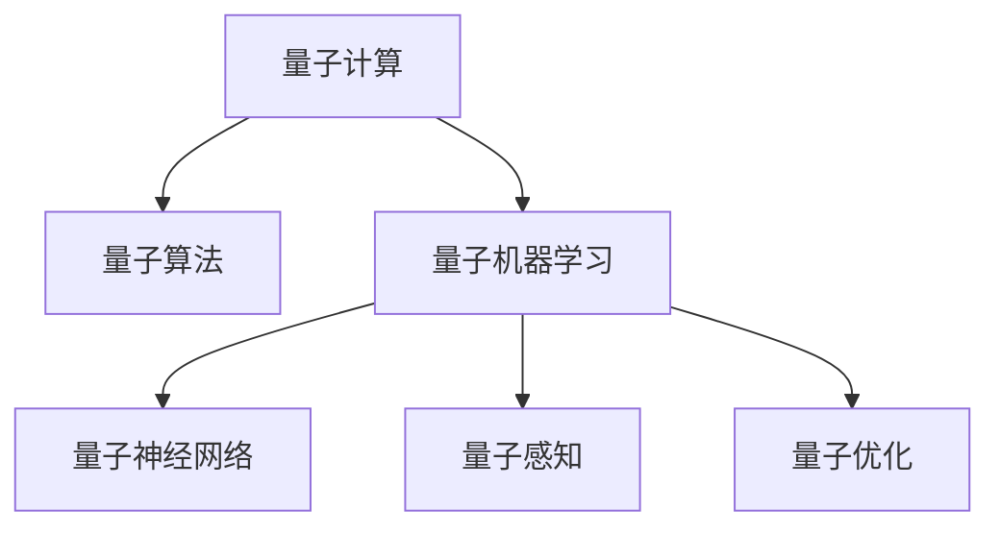
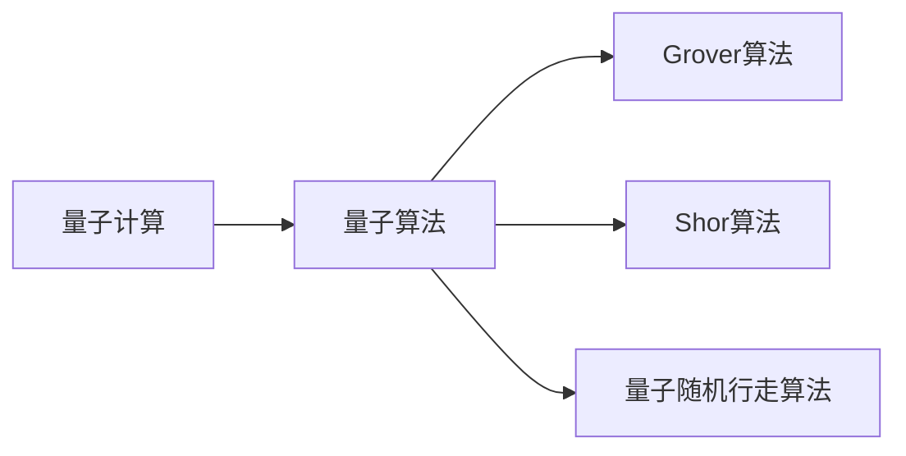
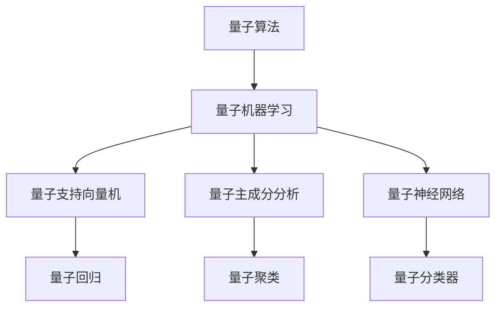
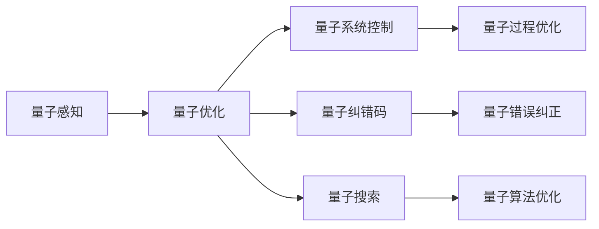

                 

# 量子力学与人工智能的结合

> 关键词：量子计算、人工智能、量子算法、量子机器学习、量子神经网络、量子感知、量子优化

## 1. 背景介绍

### 1.1 问题由来
量子力学（Quantum Mechanics）自1925年诞生以来，已经成为描述微观粒子行为的基本框架。其基本原理包括波粒二象性、不确定性原理和量子纠缠等概念。近年来，随着量子计算（Quantum Computing）技术的发展，量子计算对人工智能（Artificial Intelligence, AI）的潜在影响引起了广泛关注。

人工智能领域探索利用量子计算的潜能，以期在计算复杂度、数据处理速度和算法效率上获得革命性的提升。然而，量子计算与人工智能的结合并不简单，需要克服诸多挑战。

### 1.2 问题核心关键点
本文章聚焦于量子计算在人工智能中的应用，特别是量子算法、量子机器学习、量子神经网络和量子感知等前沿技术。量子计算在数学形式和物理机制上均与传统计算不同，其量子比特（Qubit）具有叠加态和纠缠态的特性，能够在某些特定问题上实现传统计算难以实现的效率。

### 1.3 问题研究意义
量子计算与人工智能的结合，有望极大提升AI系统的处理能力和效率，尤其在复杂的搜索、优化和机器学习问题上。这种结合将开启全新的计算范式，带来计算能力的飞跃，促进AI技术在更多领域的应用。

## 2. 核心概念与联系

### 2.1 核心概念概述

为更好地理解量子计算与人工智能的结合，本节将介绍几个密切相关的核心概念：

- 量子计算（Quantum Computing）：利用量子比特进行计算的范式，具有叠加态和纠缠态的特性，能够在某些特定问题上实现传统计算难以实现的效率。
- 量子算法（Quantum Algorithms）：利用量子计算的特性，设计出的特定问题解法。
- 量子机器学习（Quantum Machine Learning）：将量子计算应用于机器学习领域，利用量子并行和量子态演化特性，进行数据处理和模型训练。
- 量子神经网络（Quantum Neural Networks, QNNs）：将量子计算特性应用于神经网络，实现量子感知、量子优化等功能。
- 量子感知（Quantum Sensing）：利用量子系统的测量特性，实现对环境参数的精密测量。
- 量子优化（Quantum Optimization）：利用量子计算进行高效求解优化问题。

这些核心概念之间的逻辑关系可以通过以下Mermaid流程图来展示：



这个流程图展示了几大核心概念之间的关联关系：

- 量子计算是基础，提供了实现量子算法的能力。
- 量子算法是具体应用，利用量子计算的特点解决特定问题。
- 量子机器学习、量子神经网络、量子感知、量子优化都是量子算法的具体应用方向。

### 2.2 概念间的关系

这些核心概念之间存在着紧密的联系，构成了量子计算在人工智能领域的应用框架。以下通过几个Mermaid流程图来展示这些概念之间的关系。

#### 2.2.1 量子计算与量子算法的关系



这个流程图展示了量子计算与量子算法之间的基本关系。量子算法如Grover算法、Shor算法、量子随机行走算法等，都是基于量子计算特性设计的。

#### 2.2.2 量子算法在机器学习中的应用



这个流程图展示了量子算法在机器学习中的具体应用。量子支持向量机、量子主成分分析、量子神经网络等都是量子机器学习中常用的算法。

#### 2.2.3 量子感知与量子优化的关系



这个流程图展示了量子感知与量子优化之间的关联。量子感知用于环境参数的精密测量，而量子优化则利用量子计算的高效求解能力。

### 2.3 核心概念的整体架构

最后，我们用一个综合的流程图来展示这些核心概念在大语言模型微调过程中的整体架构：

```mermaid
graph TB
    A[大规模文本数据] --> B[预训练]
    B --> C[量子感知]
    C --> D[量子算法]
    D --> E[量子机器学习]
    E --> F[量子神经网络]
    F --> G[量子优化]
    G --> H[量子感知]
    H --> I[量子算法]
    I --> J[量子机器学习]
    J --> K[量子神经网络]
    K --> L[量子优化]
    L --> M[量子感知]
    M --> N[量子算法]
    N --> O[量子机器学习]
    O --> P[量子神经网络]
    P --> Q[量子优化]
    Q --> R[量子感知]
    R --> S[量子算法]
    S --> T[量子机器学习]
    T --> U[量子神经网络]
    U --> V[量子优化]
    V --> W[量子感知]
    W --> X[量子算法]
    X --> Y[量子机器学习]
    Y --> Z[量子神经网络]
    Z --> AA[量子优化]
    AA --> AB[量子感知]
    AB --> AC[量子算法]
    AC --> AD[量子机器学习]
    AD --> AE[量子神经网络]
    AE --> AF[量子优化]
    AF --> AG[量子感知]
    AG --> AH[量子算法]
    AH --> AI[量子机器学习]
    AI --> AJ[量子神经网络]
    AJ --> AK[量子优化]
    AK --> AL[量子感知]
    AL --> AM[量子算法]
    AM --> AN[量子机器学习]
    AN --> AO[量子神经网络]
    AO --> AP[量子优化]
    AP --> AQ[量子感知]
    AQ --> AR[量子算法]
    AR --> AS[量子机器学习]
    AS --> AT[量子神经网络]
    AT --> AU[量子优化]
    AU --> AV[量子感知]
    AV --> AW[量子算法]
    AW --> AX[量子机器学习]
    AX --> AY[量子神经网络]
    AY --> AZ[量子优化]
    AZ --> BA[量子感知]
    BA --> BB[量子算法]
    BB --> BC[量子机器学习]
    BC --> BD[量子神经网络]
    BD --> BE[量子优化]
    BE --> BF[量子感知]
    BF --> BG[量子算法]
    BG --> BH[量子机器学习]
    BH --> BI[量子神经网络]
    BI --> BJ[量子优化]
    BJ --> BK[量子感知]
    BK --> BL[量子算法]
    BL --> BM[量子机器学习]
    BM --> BN[量子神经网络]
    BN --> BO[量子优化]
    BO --> BP[量子感知]
    BP --> BQ[量子算法]
    BQ --> BR[量子机器学习]
    BR --> BS[量子神经网络]
    BS --> BT[量子优化]
    BT --> BU[量子感知]
    BU --> BV[量子算法]
    BV --> BW[量子机器学习]
    BW --> BX[量子神经网络]
    BX --> BY[量子优化]
    BY --> BZ[量子感知]
    BZ --> CA[量子算法]
    CA --> CB[量子机器学习]
    CB --> CC[量子神经网络]
    CC --> CD[量子优化]
    CD --> CE[量子感知]
    CE --> CF[量子算法]
    CF --> CG[量子机器学习]
    CG --> CH[量子神经网络]
    CH --> CI[量子优化]
    CI --> CJ[量子感知]
    CJ --> CK[量子算法]
    CK --> CL[量子机器学习]
    CL --> CM[量子神经网络]
    CM --> CN[量子优化]
    CN --> CO[量子感知]
    CO --> CP[量子算法]
    CP --> CQ[量子机器学习]
    CQ --> CR[量子神经网络]
    CR --> CS[量子优化]
    CS --> CT[量子感知]
    CT --> CU[量子算法]
    CU --> CV[量子机器学习]
    CV --> CW[量子神经网络]
    CW --> CX[量子优化]
    CX --> CY[量子感知]
    CY --> CZ[量子算法]
    CZ --> DA[量子机器学习]
    DA --> DB[量子神经网络]
    DB --> DC[量子优化]
    DC --> DE[量子感知]
    DE --> DF[量子算法]
    DF --> DG[量子机器学习]
    DG --> DH[量子神经网络]
    DH --> DI[量子优化]
    DI --> DJ[量子感知]
    DJ --> DK[量子算法]
    DK --> DL[量子机器学习]
    DL --> DM[量子神经网络]
    DM --> DN[量子优化]
    DN --> DO[量子感知]
    DO --> DP[量子算法]
    DP --> DQ[量子机器学习]
    DQ --> DR[量子神经网络]
    DR --> DS[量子优化]
    DS --> DT[量子感知]
    DT --> DU[量子算法]
    DU --> DV[量子机器学习]
    DV --> DW[量子神经网络]
    DW --> DX[量子优化]
    DX --> DY[量子感知]
    DY --> DZ[量子算法]
    DZ --> EA[量子机器学习]
    EA --> EB[量子神经网络]
    EB --> EC[量子优化]
    EC --> ED[量子感知]
    ED --> EE[量子算法]
    EE --> EF[量子机器学习]
    EF --> EG[量子神经网络]
    EG --> EH[量子优化]
    EH --> EI[量子感知]
    EI --> EJ[量子算法]
    EJ --> EK[量子机器学习]
    EK --> EL[量子神经网络]
    EL --> EM[量子优化]
    EM --> EN[量子感知]
    EN --> EO[量子算法]
    EO --> EP[量子机器学习]
    EP --> EQ[量子神经网络]
    EQ --> ER[量子优化]
    ER --> ES[量子感知]
    ES --> ET[量子算法]
    ET --> EU[量子机器学习]
    EU --> EV[量子神经网络]
    EV --> EW[量子优化]
    EW --> EX[量子感知]
    EX --> EY[量子算法]
    EY --> EZ[量子机器学习]
    EZ --> FA[量子神经网络]
    FA --> FB[量子优化]
    FB --> FC[量子感知]
    FC --> FD[量子算法]
    FD --> FE[量子机器学习]
    FE --> FF[量子神经网络]
    FF --> FG[量子优化]
    FG --> FH[量子感知]
    FH --> FI[量子算法]
    FI --> FJ[量子机器学习]
    FJ --> FK[量子神经网络]
    FK --> FL[量子优化]
    FL --> FM[量子感知]
    FM --> FN[量子算法]
    FN --> FO[量子机器学习]
    FO --> FP[量子神经网络]
    FP --> FQ[量子优化]
    FQ --> FR[量子感知]
    FR --> FS[量子算法]
    FS --> FT[量子机器学习]
    FT --> FU[量子神经网络]
    FU --> FV[量子优化]
    FV --> FW[量子感知]
    FW --> FX[量子算法]
    FX --> FY[量子机器学习]
    FY --> FZ[量子神经网络]
    FZ --> GA[量子优化]
    GA --> GB[量子感知]
    GB --> GC[量子算法]
    GC --> GD[量子机器学习]
    GD --> GE[量子神经网络]
    GE --> GF[量子优化]
    GF --> GG[量子感知]
    GG --> GH[量子算法]
    GH --> GI[量子机器学习]
    GI --> GJ[量子神经网络]
    GJ --> GK[量子优化]
    GK --> GL[量子感知]
    GL --> GM[量子算法]
    GM --> GN[量子机器学习]
    GN --> GO[量子神经网络]
    GO --> GP[量子优化]
    GP --> GQ[量子感知]
    GQ --> GR[量子算法]
    GR --> GS[量子机器学习]
    GS --> GT[量子神经网络]
    GT --> GU[量子优化]
    GU --> GV[量子感知]
    GV --> GW[量子算法]
    GW --> GX[量子机器学习]
    GX --> GY[量子神经网络]
    GY --> GZ[量子优化]
    GZ --> HA[量子感知]
    HA --> HB[量子算法]
    HB --> HC[量子机器学习]
    HC --> HD[量子神经网络]
    HD --> HE[量子优化]
    HE --> HF[量子感知]
    HF --> HG[量子算法]
    HG --> HH[量子机器学习]
    HH --> HI[量子神经网络]
    HI --> HJ[量子优化]
    HJ --> HK[量子感知]
    HK --> HL[量子算法]
    HL --> HM[量子机器学习]
    HM --> HN[量子神经网络]
    HN --> HO[量子优化]
    HO --> HP[量子感知]
    HP --> HQ[量子算法]
    HQ --> HR[量子机器学习]
    HR --> HS[量子神经网络]
    HS --> HT[量子优化]
    HT --> HU[量子感知]
    HU --> HV[量子算法]
    HV --> HW[量子机器学习]
    HW --> HX[量子神经网络]
    HX --> HY[量子优化]
    HY --> HZ[量子感知]
    HZ --> IA[量子算法]
    IA --> IB[量子机器学习]
    IB --> IC[量子神经网络]
    IC --> ID[量子优化]
    ID --> IE[量子感知]
    IE --> IF[量子算法]
    IF --> IG[量子机器学习]
    IG --> IH[量子神经网络]
    IH --> II[量子优化]
    II --> IQ[量子感知]
    IQ --> IR[量子算法]
    IR --> IS[量子机器学习]
    IS --> IT[量子神经网络]
    IT --> IU[量子优化]
    IU --> IV[量子感知]
    IV --> IW[量子算法]
    IW --> IX[量子机器学习]
    IX --> IY[量子神经网络]
    IY --> IZ[量子优化]
    IZ --> JA[量子感知]
    JA --> JB[量子算法]
    JB --> JC[量子机器学习]
    JC --> JD[量子神经网络]
    JD --> JE[量子优化]
    JE --> JF[量子感知]
    JF --> JG[量子算法]
    JG --> JH[量子机器学习]
    JH --> JI[量子神经网络]
    JI --> JJ[量子优化]
    JJ --> JK[量子感知]
    JK --> JL[量子算法]
    JL --> JM[量子机器学习]
    JM --> JN[量子神经网络]
    JN --> JO[量子优化]
    JO --> JP[量子感知]
    JP --> JQ[量子算法]
    JQ --> JR[量子机器学习]
    JR --> JS[量子神经网络]
    JS --> JT[量子优化]
    JT --> JU[量子感知]
    JU --> JV[量子算法]
    JV --> JW[量子机器学习]
    JW --> JX[量子神经网络]
    JX --> JY[量子优化]
    JY --> JZ[量子感知]
    JZ -->KA[量子算法]
    KA --> KB[量子机器学习]
    KB --> KC[量子神经网络]
    KC --> KD[量子优化]
    KD --> KE[量子感知]
    KE --> KF[量子算法]
    KF --> KG[量子机器学习]
    KG --> KH[量子神经网络]
    KH --> KI[量子优化]
    KI --> KJ[量子感知]
    KJ --> KK[量子算法]
    KK --> KL[量子机器学习]
    KL --> KM[量子神经网络]
    KM --> KN[量子优化]
    KN --> KO[量子感知]
    KO --> KP[量子算法]
    KP --> KQ[量子机器学习]
    KQ --> KR[量子神经网络]
    KR --> KS[量子优化]
    KS --> KT[量子感知]
    KT --> KU[量子算法]
    KU --> KV[量子机器学习]
    KV --> KW[量子神经网络]
    KW --> KX[量子优化]
    KX --> KY[量子感知]
    KY --> KZ[量子算法]
    KZ --> LA[量子机器学习]
    LA --> LB[量子神经网络]
    LB --> LC[量子优化]
    LC --> LD[量子感知]
    LD --> LE[量子算法]
    LE --> LF[量子机器学习]
    LF --> LG[量子神经网络]
    LG --> LH[量子优化]
    LH --> LI[量子感知]
    LI --> LJ[量子算法]
    LJ --> LK[量子机器学习]
    LK --> LL[量子神经网络]
    LL --> LM[量子优化]
    LM --> LN[量子感知]
    LN --> LO[量子算法]
    LO --> LP[量子机器学习]
    LP --> LQ[量子神经网络]
    LQ --> LR[量子优化]
    LR --> LS[量子感知]
    LS --> LT[量子算法]
    LT --> LU[量子机器学习]
    LU --> LV[量子神经网络]
    LV --> LW[量子优化]
    LW --> LX[量子感知]
    LX --> LY[量子算法]
    LY --> LZ[量子机器学习]
    LZ --> MA[量子神经网络]
    MA --> MB[量子优化]
    MB --> MC[量子感知]
    MC --> MD[量子算法]
    MD --> ME[量子机器学习]
    ME --> MF[量子神经网络]
    MF --> MG[量子优化]
    MG --> MH[量子感知]
    MH --> MI[量子算法]
    MI --> MJ[量子机器学习]
    MJ --> MK[量子神经网络]
    MK --> ML[量子优化]
    ML --> MM[量子感知]
    MM --> MN[量子算法]
    MN --> MO[量子机器学习]
    MO --> MP[量子神经网络]
    MP --> MQ[量子优化]
    MQ --> MR[量子感知]
    MR --> MS[量子算法]
    MS --> MT[量子机器学习]
    MT --> MU[量子神经网络]
    MU --> MV[量子优化]
    MV --> MW[量子感知]
    MW --> MX[量子算法]
    MX --> MY[量子机器学习]
    MY --> MZ[量子神经网络]
    MZ --> NA[量子优化]
    NA --> NB[量子感知]
    NB --> NC[量子算法]
    NC --> ND[量子机器学习]
    ND --> NE[量子神经网络]
    NE --> NF[量子优化]
    NF --> NG[量子感知]
    NG --> NH[量子算法]
    NH --> NI[量子机器学习]
    NI --> NJ[量子神经网络]
    NJ --> NK[量子优化]
    NK --> NL[量子感知]
    NL --> NM[量子算法]
    NM --> NN[量子机器学习]
    NN --> NO[量子神经网络]
    NO --> NP[量子优化]
    NP --> NQ[量子感知]
    NQ --> NR[量子算法]
    NR --> NS[量子机器学习]
    NS --> NT[量子神经网络]
    NT --> NU[量子优化]
    NU --> NV[量子感知]
    NV --> NW[量子算法]
    NW --> NX[量子机器学习]
    NX --> NY[量子神经网络]
    NY --> NZ[量子优化]
    NZ --> OA[量子感知]
    OA --> OB[量子算法]
    OB --> OC[量子机器学习]
    OC --> OD[量子神经网络]
    OD --> OE[量子优化]
    OE --> OF[量子感知]
    OF --> OG[量子算法]
    OG --> OH[量子机器学习]
    OH --> OI[量子神经网络]
    OI --> OJ[量子优化]
    OJ --> OK[量子感知]
    OK --> OL[量子算法]
    OL --> OM[量子机器学习]
    OM --> ON[量子神经网络]
    ON --> OO[量子优化]
    OO --> OP[量子感知]
    OP --> OQ[量子算法]
    OQ --> OR[量子机器学习]
    OR --> OS[量子神经网络]
    OS --> OT[量子优化]
    OT --> OU[量子感知]
    OU -->OV[量子算法]
    OV --> OW[量子机器学习]
    OW --> OX[量子神经网络]
    OX --> OY[量子优化]
    OY --> OZ[量子感知]
    OZ --> PA[量子算法]
    PA --> PB[量子机器学习]
    PB --> PC[量子神经网络]
    PC --> PD[量子优化]
    PD --> PE[量子感知]
    PE --> PF[量子算法]
    PF --> PG[量子机器学习]
    PG --> PH[量子神经网络]
    PH --> PI[量子优化]
    PI --> PJ[量子感知]
    PJ --> PK[量子算法]
    PK --> PL[量子机器学习]
    PL --> PM[量子神经网络]
    PM --> PN[量子优化]
    PN --> PO[量子感知]
    PO --> PP[量子算法]
    PP --> PQ[量子机器学习]
    PQ --> PR[量子神经网络]
    PR --> PS[量子优化]
    PS --> PT[量子感知]
    PT --> PU[量子算法]
    PU --> PV[量子机器学习]
    PV --> PW[量子神经网络]
    PW --> PX[量子优化]
    PX --> PY[量子感知]
    PY --> PZ[量子算法]
    PZ --> QA[量子机器学习]
    QA --> QB[量子神经网络]
    QB --> QC[量子优化]
    QC --> QD[量子感知]
    QD --> QE[量子算法]
    QE --> QF[量子机器学习]
    QF --> QG[量子神经网络]
    QG --> QH[量子优化]
    QH --> QI[量子感知]
    QI --> QJ[量子算法]
    QJ --> QK[量子机器学习]
    QK --> QL[量子神经网络]
    QL --> QM[量子优化]
    QM --> QN[量子感知]
    QN --> QO[量子算法]
    QO --> QP[量子机器学习]
    QP --> QQ[量子神经网络]
    QQ --> QR[量子优化]
    QR --> QS[量子感知]
    QS --> QT[量子算法]
    QT --> QU[量子机器学习]
    QU --> QV[量子神经网络]
    QV --> QW[量子优化]
    QW --> QX[量子感知]
    QX --> QY[量子算法]
    QY --> QZ[量子机器学习]
    QZ --> RA[量子神经网络]
    RA --> RB[量子优化]
    RB --> RC[量子感知]
    RC --> RD[量子算法]
    RD --> RE[量子机器学习]
    RE --> RF[量子神经网络]
    RF --> RG[量子优化]
    RG --> RH[量子感知]
    RH --> RI[量子算法]
    RI --> RJ[量子机器学习]
    RJ --> RK[量子神经网络]
    RK --> RL[量子优化]
    RL --> RM[量子感知]
    RM --> RN[量子算法]
    RN --> RO[量子机器学习]
    RO --> RP[量子神经网络]
    RP --> RQ[量子优化]
    RQ --> RR[量子感知]
    RR --> RS[量子算法]
    RS --> RT[量子机器学习]
    RT --> RU[量子神经网络]
    RU --> RV[量子优化]
    RV --> RW[量子感知]
    RW --> RX[量子算法]
    RX --> RY[量子机器学习]
    RY --> RZ[量子神经网络]
    RZ --> SA[量子优化]
    SA --> SB[量子感知]
    SB --> SC[量子算法]
    SC --> SD[量子机器学习]
    SD --> SE[量子神经网络]
    SE --> SF[量子优化]
    SF --> SG[量子感知]
    SG --> SH[量子算法]
    SH --> SI[量子机器学习]
    SI --> SJ[量子神经网络]
    SJ --> SK[量子优化]
    SK --> SL[量子感知]
    SL --> SM[量子算法]
    SM --> SN[量子机器学习]
    SN --> SO[量子神经网络]
    SO --> SP[量子优化]
    SP --> SQ[量子感知]
    SQ --> SR[量子算法]
    SR --> SS[量子机器学习]
    SS --> ST[量子神经网络]
    ST --> SU[量子优化]
    SU --> SV[量子感知]
    SV --> SW[量子算法]
    SW --> SX[量子机器学习]
    SX --> SY[量子神经网络]
    SY --> SZ[量子优化]
    SZ --> TA[量子感知]
    TA --> TB[量子算法]
    TB --> TC[量子机器学习]
    TC --> TD[量子神经网络]
    TD --> TE[量子优化]
    TE --> TF[量子感知]
    TF --> TG[量子算法]
    TG --> TH[量子机器学习]
    TH --> TI[量子神经网络]
    TI --> TJ[量子优化]
    TJ --> TK[量子感知]
    TK --> TL[量子算法]
    TL --> TM[量子机器学习]
    TM --> TN[量子神经网络]
    TN --> TO[量子优化]
    TO --> TP[量子感知]
    TP --> TQ[量子算法]
    TQ --> TR[量子机器学习]
    TR --> TS[量子神经网络]
    TS --> TT[量子优化]
    TT --> TU[量子感知]
    TU --> TV[量子算法]
    TV

