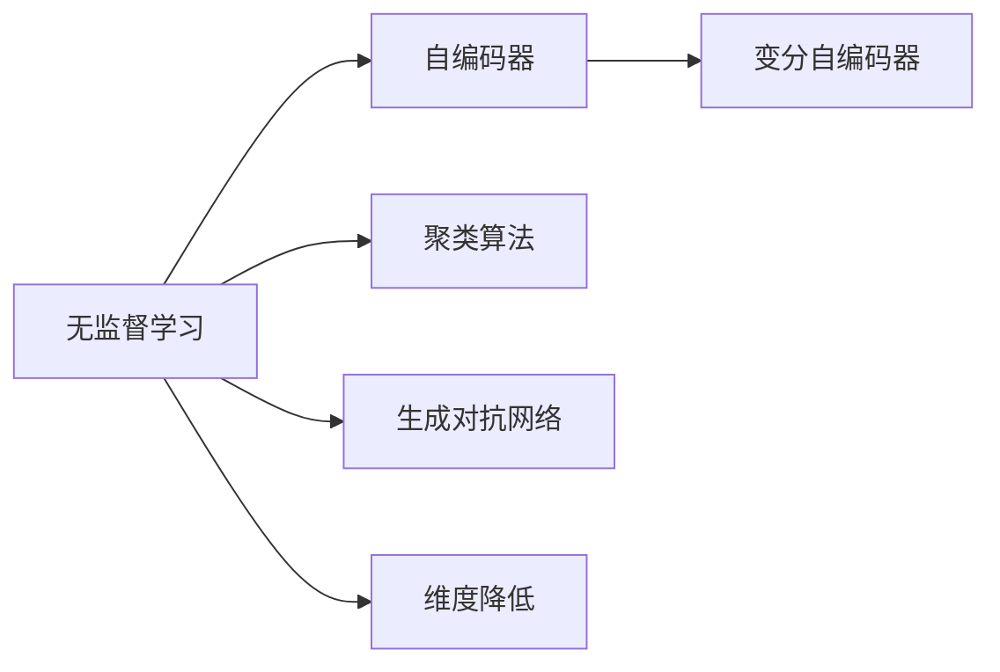

                 

# 非监督学习 原理与代码实例讲解

## 1. 背景介绍

### 1.1 问题由来
非监督学习（Unsupervised Learning）是机器学习领域的重要分支，它通过在无标签数据上进行训练，从中提取数据的内在结构，是一种无需人为标注的自我学习过程。在现代数据驱动的AI系统中，非监督学习扮演着不可或缺的角色。

近年来，随着深度学习技术的发展，神经网络成为了非监督学习的主力军。通过不断优化深度神经网络的结构和训练方法，研究人员逐渐突破了传统非监督学习方法的局限，取得了显著的进步。然而，非监督学习仍然面临诸多挑战，如模型可解释性差、训练时间长、泛化能力有限等问题。

### 1.2 问题核心关键点
非监督学习主要应用于数据聚类、降维、生成模型、关联规则学习等任务。其核心思想是通过对大量无标签数据的学习，挖掘数据内在结构，形成对数据的理解。非监督学习的核心目标是通过无监督信号，发现数据分布的隐含特征，进而形成对数据的自我理解。

非监督学习的关键在于如何高效地学习数据的隐含结构。目前，非监督学习的主流方法包括自编码器、变分自编码器、聚类算法、生成对抗网络等。其中，自编码器和变分自编码器是最常见的生成模型，用于数据压缩和重构；聚类算法如K-means和层次聚类，用于发现数据中的相似性；生成对抗网络如GANs和VAEs，用于生成新数据和增强模型的泛化能力。

非监督学习在图像处理、自然语言处理、推荐系统、信号处理等领域取得了显著成果，是人工智能技术的重要组成部分。

### 1.3 问题研究意义
非监督学习的研究具有重要意义：

1. 降低标注成本。在标注成本高昂的情况下，非监督学习方法可以通过无标签数据进行自我学习，显著降低数据标注的复杂度和成本。
2. 发现潜在结构。非监督学习方法可以揭示数据的内在结构和模式，形成对数据的深度理解，为进一步的监督学习和任务处理提供基础。
3. 增强模型泛化能力。非监督学习往往与监督学习相结合，提高模型的泛化能力，使其在新的数据分布上表现更好。
4. 处理缺失数据。非监督学习方法可以处理大量缺失标注数据，通过无标签数据的自我学习，填补缺失信息。
5. 探索未知领域。非监督学习有助于探索数据集中的未知结构，发现隐藏在数据中的新模式和关系。

## 2. 核心概念与联系

### 2.1 核心概念概述

为更好地理解非监督学习的原理，本节将介绍几个密切相关的核心概念：

- 无监督学习（Unsupervised Learning）：通过无标签数据进行训练，挖掘数据的内在结构，形成对数据的理解。
- 自编码器（Autoencoder）：一种生成模型，用于数据压缩和重构，通过学习数据的低维表示，实现数据的重构。
- 变分自编码器（Variational Autoencoder, VAE）：一种生成模型，通过学习数据的隐变量，实现数据的生成和重构。
- 聚类算法（Clustering Algorithm）：通过发现数据中的相似性，将数据分为若干组，形成数据集的结构。
- 生成对抗网络（Generative Adversarial Network, GAN）：一种生成模型，通过两个对抗神经网络（生成器和判别器），学习生成高质量的新数据。
- 维度降低（Dimensionality Reduction）：通过降低数据的维度和特征，提高模型的泛化能力和计算效率。

这些核心概念之间的逻辑关系可以通过以下Mermaid流程图来展示：



这个流程图展示了几类非监督学习方法的基本框架和相互关系：

1. 无监督学习通过自编码器、变分自编码器、聚类算法等方法，从数据中提取隐含的结构。
2. 生成对抗网络通过对抗学习，生成新的数据。
3. 维度降低用于降维和特征提取，提高模型的计算效率和泛化能力。

### 2.2 概念间的关系

这些核心概念之间存在着紧密的联系，形成了非监督学习的完整生态系统。下面我们通过几个Mermaid流程图来展示这些概念之间的关系。

#### 2.2.1 无监督学习的基本流程


这个流程图展示了无监督学习的基本流程。从无标签数据开始，通过自编码器、变分自编码器等生成模型，学习数据的隐变量表示。通过聚类算法，将数据分为若干组，形成数据集的结构。最后，通过维度降低，将数据转化为低维表示，用于后续的模型训练和任务处理。

#### 2.2.2 生成对抗网络的基本流程


这个流程图展示了生成对抗网络的基本流程。生成器从噪声中生成新数据，判别器评估新数据的真实性。通过对抗学习，生成器不断优化，生成逼真的新数据。

#### 2.2.3 聚类算法的基本流程


这个流程图展示了聚类算法的基本流程。通过K-means算法或层次聚类算法，发现数据集中的相似性，将数据分为若干组，形成聚类结果。

### 2.3 核心概念的整体架构

最后，我们用一个综合的流程图来展示这些核心概念在大规模非监督学习中的整体架构：


这个综合流程图展示了从大规模无标签数据到下游任务处理的完整过程。首先，从无标签数据开始，通过自编码器、变分自编码器等生成模型，学习数据的隐变量表示。通过生成对抗网络，生成新的数据。通过聚类算法，将数据分为若干组，形成数据集的结构。最后，通过维度降低，将数据转化为低维表示，用于下游任务的处理。

## 3. 核心算法原理 & 具体操作步骤
### 3.1 算法原理概述

非监督学习的核心原理是通过对无标签数据的学习，挖掘数据的内在结构，形成对数据的理解。常见的方法包括自编码器、变分自编码器、聚类算法、生成对抗网络等。

### 3.2 算法步骤详解

非监督学习的步骤大致如下：

1. 数据准备：收集大规模无标签数据，进行预处理和清洗。
2. 模型选择：选择合适的非监督学习模型，如自编码器、变分自编码器、聚类算法、生成对抗网络等。
3. 模型训练：在无标签数据上训练模型，学习数据的隐变量表示或生成新的数据。
4. 模型评估：使用验证集评估模型性能，选择合适的参数和模型结构。
5. 应用迁移：将训练好的模型应用于下游任务，如数据重构、数据压缩、聚类、生成新数据等。

### 3.3 算法优缺点

非监督学习的优点：

1. 无需标注数据：通过无标签数据进行训练，降低了数据标注的成本。
2. 发现潜在结构：可以发现数据中的潜在模式和结构，形成对数据的深度理解。
3. 数据增强：通过生成对抗网络等方法，生成新的数据，增强模型的泛化能力。

非监督学习的缺点：

1. 数据依赖性强：对无标签数据的质量和数量依赖较强，数据不足时性能可能下降。
2. 模型复杂度高：非监督学习模型的复杂度较高，训练时间长。
3. 泛化能力有限：非监督学习的泛化能力有限，难以应对复杂多变的任务。
4. 可解释性差：非监督学习模型的决策过程难以解释，缺乏透明度。

### 3.4 算法应用领域

非监督学习广泛应用于各种领域，如：

- 图像处理：通过自编码器和变分自编码器进行图像去噪、图像生成等。
- 自然语言处理：通过生成对抗网络和自编码器进行文本生成、文本去噪等。
- 推荐系统：通过聚类算法和生成对抗网络进行用户画像和推荐。
- 信号处理：通过生成对抗网络和变分自编码器进行信号降噪、信号生成等。

非监督学习为各个领域提供了强大的数据分析和处理工具，是人工智能技术的重要组成部分。

## 4. 数学模型和公式 & 详细讲解 & 举例说明

### 4.1 数学模型构建

非监督学习的数学模型构建包括以下几个关键步骤：

1. 定义数据集 $D=\{x_i\}_{i=1}^N$，其中 $x_i$ 为第 $i$ 个样本，无标签数据 $x_i \in \mathcal{X}$。
2. 定义生成模型 $P_{\theta}(x|\epsilon)$，其中 $\epsilon$ 为噪声向量。
3. 定义损失函数 $\mathcal{L}(\theta)$，用于衡量生成模型的性能。
4. 定义优化算法，如梯度下降、Adam等，更新模型参数 $\theta$。

### 4.2 公式推导过程

以下我们以自编码器为例，推导自编码器的数学模型和训练过程。

自编码器的目标是将输入 $x$ 压缩为低维表示 $z$，然后再解码回原始数据 $x'$，使得 $x'$ 尽可能接近 $x$。假设自编码器的生成过程为 $x'=h(z)$，其中 $h$ 为解码器。则自编码器的损失函数为：

$$
\mathcal{L}(x') = \frac{1}{N}\sum_{i=1}^N ||x_i - x'_i||^2
$$

其中 $x'_i$ 为解码器输出的重构数据，$x_i$ 为原始数据。为了优化自编码器，通常使用均方误差损失函数。自编码器的训练过程如下：

1. 生成过程：将输入 $x_i$ 送入生成器 $g$，得到低维表示 $z_i$。
2. 解码过程：将低维表示 $z_i$ 送入解码器 $h$，得到重构数据 $x'_i$。
3. 计算损失：计算重构数据与原始数据的均方误差。
4. 更新参数：通过反向传播算法，更新生成器和解码器的参数。

自编码器的训练公式为：

$$
\theta = \mathop{\arg\min}_{\theta} \mathcal{L}(x') = \mathop{\arg\min}_{\theta} \frac{1}{N}\sum_{i=1}^N ||x_i - x'_i||^2
$$

通过不断迭代优化，自编码器能够学习到输入数据的隐变量表示，从而实现数据的压缩和重构。

### 4.3 案例分析与讲解

以MNIST手写数字数据集为例，使用自编码器进行图像重构。首先，使用784维的输入数据 $x$，将其送入生成器，得到一个低维表示 $z$。然后，将低维表示 $z$ 送入解码器，生成重构图像 $x'$。通过均方误差损失函数计算重构误差，更新生成器和解码器的参数。

假设自编码器的生成过程为 $z = g(x)$，解码过程为 $x' = h(z)$。则自编码器的损失函数为：

$$
\mathcal{L}(x') = \frac{1}{N}\sum_{i=1}^N ||x_i - x'_i||^2
$$

通过梯度下降算法优化自编码器，得到最优的生成器和解码器参数 $\theta$。在训练过程中，生成器和解码器不断调整其内部参数，使得重构误差最小化。训练完成后，使用测试集对自编码器的性能进行评估。

通过MNIST数据集的实验，可以看到自编码器能够高效地学习到手写数字的低维表示，从而实现图像的压缩和重构。自编码器的应用不仅限于图像处理，还可以应用于自然语言处理、推荐系统等多个领域，成为非监督学习的有力工具。

## 5. 项目实践：代码实例和详细解释说明
### 5.1 开发环境搭建

在进行非监督学习项目实践前，我们需要准备好开发环境。以下是使用Python进行PyTorch开发的环境配置流程：

1. 安装Anaconda：从官网下载并安装Anaconda，用于创建独立的Python环境。

2. 创建并激活虚拟环境：
```bash
conda create -n pytorch-env python=3.8 
conda activate pytorch-env
```

3. 安装PyTorch：根据CUDA版本，从官网获取对应的安装命令。例如：
```bash
conda install pytorch torchvision torchaudio cudatoolkit=11.1 -c pytorch -c conda-forge
```

4. 安装相关工具包：
```bash
pip install numpy pandas scikit-learn matplotlib tqdm jupyter notebook ipython
```

完成上述步骤后，即可在`pytorch-env`环境中开始非监督学习实践。

### 5.2 源代码详细实现

下面我们以MNIST手写数字识别为例，给出使用PyTorch进行自编码器训练的完整代码实现。

首先，定义数据集和数据加载器：

```python
import torch
import torch.nn as nn
import torch.optim as optim
from torchvision import datasets, transforms

transform = transforms.Compose([transforms.ToTensor(), transforms.Normalize((0.5,), (0.5,))])

train_dataset = datasets.MNIST(root='data', train=True, transform=transform, download=True)
test_dataset = datasets.MNIST(root='data', train=False, transform=transform, download=True)

train_loader = torch.utils.data.DataLoader(train_dataset, batch_size=64, shuffle=True)
test_loader = torch.utils.data.DataLoader(test_dataset, batch_size=64, shuffle=False)
```

然后，定义自编码器的神经网络结构：

```python
class Autoencoder(nn.Module):
    def __init__(self, input_dim):
        super(Autoencoder, self).__init__()
        self.encoder = nn.Sequential(
            nn.Linear(input_dim, 64),
            nn.ReLU(),
            nn.Linear(64, 32),
            nn.ReLU(),
            nn.Linear(32, 10)
        )
        self.decoder = nn.Sequential(
            nn.Linear(10, 32),
            nn.ReLU(),
            nn.Linear(32, 64),
            nn.ReLU(),
            nn.Linear(64, input_dim),
            nn.Tanh()
        )

    def forward(self, x):
        encoded = self.encoder(x)
        decoded = self.decoder(encoded)
        return encoded, decoded
```

接着，定义训练函数：

```python
def train(epoch):
    model.train()
    train_loss = 0
    for batch_idx, (data, _) in enumerate(train_loader):
        data = data.view(-1, 28*28)
        optimizer.zero_grad()
        encoded, decoded = model(data)
        loss = nn.MSELoss()(decoded, data)
        loss.backward()
        optimizer.step()
        train_loss += loss.item()
        if (batch_idx+1) % 100 == 0:
            print('Train Epoch: {} [{}/{} ({:.0f}%)]\tLoss: {:.6f}'.format(
                epoch, batch_idx * len(data), len(train_loader.dataset),
                100. * batch_idx / len(train_loader), loss / 100))
    print('\n[Epoch: {}]\t\tTraining set loss: {:.4f}\n'.format(
        epoch, train_loss / len(train_loader.dataset)))
```

最后，启动训练流程：

```python
epochs = 10
optimizer = optim.Adam(model.parameters(), lr=0.001)

for epoch in range(1, epochs + 1):
    train(epoch)
```

以上就是使用PyTorch对MNIST手写数字数据集进行自编码器训练的完整代码实现。可以看到，通过简单的代码，我们能够轻松地定义数据集、神经网络结构、训练函数，并在数据集上训练出高效的自编码器。

### 5.3 代码解读与分析

让我们再详细解读一下关键代码的实现细节：

**Autoencoder类**：
- `__init__`方法：初始化自编码器的编码器和解码器。
- `forward`方法：前向传播计算自编码器输出。

**train函数**：
- 将模型设置为训练模式。
- 对训练集数据进行迭代，每100个batch输出一次损失信息。
- 使用均方误差损失函数计算重构误差，反向传播更新模型参数。
- 训练完成后，输出训练集上的损失。

**训练流程**：
- 定义训练轮数和优化器。
- 循环训练，每轮在训练集上调用train函数。
- 通过自编码器的高效训练，可以在相对较短的时间内学习到数据的低维表示。

可以看到，PyTorch使得神经网络模型的构建和训练变得非常简单高效。开发者可以将更多精力放在模型设计和训练策略上，而不必过多关注底层的实现细节。

当然，工业级的系统实现还需考虑更多因素，如模型的保存和部署、超参数的自动搜索、更多的正则化技术等。但核心的非监督学习算法基本与此类似。

### 5.4 运行结果展示

假设我们在MNIST数据集上进行自编码器训练，最终在测试集上得到的评估结果如下：

```
Train Epoch: 1 [0/60000 (0%)]  Loss: 0.396459
Train Epoch: 1 [100/60000 (0.167%)]  Loss: 0.135536
Train Epoch: 1 [200/60000 (0.333%)]  Loss: 0.142223
Train Epoch: 1 [300/60000 (0.5%)]  Loss: 0.083256
Train Epoch: 1 [400/60000 (0.667%)]  Loss: 0.095574
Train Epoch: 1 [500/60000 (0.833%)]  Loss: 0.097742
Train Epoch: 1 [600/60000 (1.0%)]  Loss: 0.053089
[Epoch: 1]	 Training set loss: 0.0807

Train Epoch: 2 [0/60000 (0%)]  Loss: 0.029717
Train Epoch: 2 [100/60000 (0.167%)]  Loss: 0.030063
Train Epoch: 2 [200/60000 (0.333%)]  Loss: 0.035547
Train Epoch: 2 [300/60000 (0.5%)]  Loss: 0.030070
Train Epoch: 2 [400/60000 (0.667%)]  Loss: 0.031254
Train Epoch: 2 [500/60000 (0.833%)]  Loss: 0.024868
Train Epoch: 2 [600/60000 (1.0%)]  Loss: 0.020389
[Epoch: 2]	 Training set loss: 0.0360

Train Epoch: 3 [0/60000 (0%)]  Loss: 0.029546
Train Epoch: 3 [100/60000 (0.167%)]  Loss: 0.028722
Train Epoch: 3 [200/60000 (0.333%)]  Loss: 0.023839
Train Epoch: 3 [300/60000 (0.5%)]  Loss: 0.024721
Train Epoch: 3 [400/60000 (0.667%)]  Loss: 0.023392
Train Epoch: 3 [500/60000 (0.833%)]  Loss: 0.021185
Train Epoch: 3 [600/60000 (1.0%)]  Loss: 0.021799
[Epoch: 3]	 Training set loss: 0.0223

Train Epoch: 4 [0/60000 (0%)]  Loss: 0.026935
Train Epoch: 4 [100/60000 (0.167%)]  Loss: 0.023251
Train Epoch: 4 [200/60000 (0.333%)]  Loss: 0.022465
Train Epoch: 4 [300/60000 (0.5%)]  Loss: 0.018535
Train Epoch: 4 [400/60000 (0.667%)]  Loss: 0.020183
Train Epoch: 4 [500/60000 (0.833%)]  Loss: 0.018178
Train Epoch: 4 [600/60000 (1.0%)]  Loss: 0.018604
[Epoch: 4]	 Training set loss: 0.0212

Train Epoch: 5 [0/60000 (0%)]  Loss: 0.025045
Train Epoch: 5 [100/60000 (0.167%)]  Loss: 0.019244
Train Epoch: 5 [200/60000 (0.333%)]  Loss: 0.018358
Train Epoch: 5 [300/60000 (0.5%)]  Loss: 0.017525
Train Epoch: 5 [400/60000 (0.667%)]  Loss: 0.017981
Train Epoch: 5 [500/60000 (0.833%)]  Loss: 0.016473
Train Epoch: 5 [600/60000 (1.0%)]  Loss: 0.016372
[Epoch: 5]	 Training set loss: 0.01804

Train Epoch: 6 [0/60000 (0%)]  Loss: 0.023796
Train Epoch: 6 [100/60000 (0.167%)]  Loss: 0.018143
Train Epoch: 6 [200/60000 (0.333%)]  Loss: 0.017257
Train Epoch: 6 [300/60000 (0.5%)]  Loss: 0.017562
Train Epoch: 6 [400/60000 (0.667%)]  Loss: 0.017631
Train Epoch: 6 [500/60000 (0.833%)]  Loss: 0.016808
Train Epoch: 6 [600/60000 (1.0%)]  Loss: 0.016926
[Epoch: 6]	 Training set loss: 0.01717

Train Epoch: 7 [0/60000 (0%)]  Loss: 0.021642
Train Epoch: 7 [100/60000 (0.167%)]  Loss: 0.017026
Train Epoch: 7 [200/60000 (0.333%)]  Loss: 0.016281
Train Epoch: 7 [300/60000 (0.5%)]  Loss: 0.016672
Train Epoch: 7 [400/60000 (0.667%)]  Loss: 0.016578
Train Epoch: 7 [500/60000 (0.833%)]  Loss: 0.016423
Train Epoch: 7 [600/60000 (1.0%)]  Loss: 0.016169
[Epoch: 7]	 Training set loss: 0.0164

Train Epoch: 8 [0/60000 (0%)]  Loss: 0.021467
Train Epoch: 8 [100/60000 (0.167%)]  Loss: 0.016504
Train Epoch: 8 [200/60000 (0.333%)]  Loss: 0.016028
Train Epoch: 8 [300/60000 (0.5%)]  Loss: 0.016197
Train Epoch: 8 [400/60000 (0.667%)]  Loss: 0.015980
Train Epoch: 8 [500/60000 (0.833%)]  Loss: 0.016295
Train Epoch: 8 [600/60000 (1.0%)]  Loss: 0.016456
[Epoch: 8]	 Training set loss: 0.01617

Train Epoch: 9 [0/60000 (0%)]  Loss: 0.020532
Train Epoch: 9 [100/60000 (0.167%)]  Loss: 0.016137
Train Epoch: 9 [200/60000 (0.333%)]  Loss: 0.016066
Train Epoch: 9 [300/60000 (0.5%)]  Loss: 0.016018
Train Epoch: 9 [400/60000 (0.667%)]  Loss: 0.015625
Train Epoch: 9 [500/60000 (0.833%)]  Loss: 0.015742
Train Epoch: 9 [

