                 

# AGI与量子引力的未来

> 关键词：
1. 通用人工智能(AGI)
2. 量子引力
3. 深度学习
4. 分布式计算
5. 图神经网络
6. 量子计算
7. 模型融合

## 1. 背景介绍

### 1.1 问题由来
随着深度学习技术的迅猛发展，通用人工智能(AGI)已成为当前科技领域的热点话题。AGI指的是能够处理任何类型任务的人工智能系统，具备高度的灵活性和适应性。从早期的专家系统到现代的机器学习模型，人类在探索AGI的道路上已取得了显著进展。然而，实现真正意义上的AGI仍面临诸多挑战，包括如何更好地理解世界和人类自身的认知过程、如何构建更加可靠和安全的智能系统等。

量子引力作为物理学的热门话题，致力于揭示物质和空间的本质联系。它将量子力学与广义相对论结合，尝试回答有关时空和引力的基本问题。量子引力研究不仅具有深远的理论意义，也可能对AGI的实现产生重大影响。

本文旨在探讨AGI与量子引力的未来，研究如何将量子引力理论与深度学习技术结合，进一步提升AGI的认知和推理能力，以期对未来AI的演化提供有价值的洞察。

### 1.2 问题核心关键点
AGI与量子引力研究的核心问题包括：
1. 如何将量子引力理论与深度学习模型融合，增强模型的理解能力和预测准确性。
2. 如何构建更加灵活、可靠和安全的AGI系统，以应对现实世界的复杂性和多样性。
3. 如何利用量子计算加速深度学习模型的训练和推理过程，提高计算效率和模型性能。
4. 如何实现AGI的自我学习和自我优化，不断适应新的数据和任务需求。
5. 如何通过跨学科合作，推动AGI与量子引力理论的交叉研究，打开新的研究方向。

### 1.3 问题研究意义
研究AGI与量子引力，不仅有助于揭示AI系统的底层机制和演化规律，还能为物理学的探索提供新的方法和工具。此外，AGI的实现有望在医疗、金融、教育、交通等诸多领域带来变革，推动经济和社会的发展。具体来说，AGI有望实现以下目标：

1. 高效处理和理解海量数据，辅助决策支持。
2. 提供更加个性化和定制化的服务，提升用户体验。
3. 在复杂的非结构化数据处理和自然语言理解方面取得突破。
4. 增强系统的鲁棒性和适应性，提高系统的稳定性和可靠性。
5. 推动AI与量子计算技术的结合，突破计算瓶颈，实现更高效的数据处理和计算。

## 2. 核心概念与联系

### 2.1 核心概念概述

为更好地理解AGI与量子引力的未来，本节将介绍几个密切相关的核心概念：

- **通用人工智能(AGI)**：指能够处理任何类型任务的人工智能系统，具备高度的灵活性和适应性。与特定任务的人工智能系统相比，AGI能够进行更广泛的认知活动，包括理解、推理、学习、创造等。

- **量子引力**：一种旨在将量子力学与广义相对论结合的理论，试图揭示物质和空间的本质联系，解释引力的基本机制。

- **深度学习**：一种基于神经网络的机器学习技术，能够通过多层次的特征提取和抽象，实现对复杂数据的有效处理和分析。

- **分布式计算**：一种通过将计算任务分散到多个计算节点上，实现高效并行计算的方法。在大规模数据处理和复杂模型训练方面具有显著优势。

- **图神经网络(GNNs)**：一种专门用于处理图结构数据的神经网络模型，能够捕捉节点之间的关系和网络结构特征，在社交网络分析、推荐系统等领域具有广泛应用。

- **量子计算**：一种基于量子力学原理的计算方式，利用量子比特的量子叠加和量子纠缠特性，实现超越经典计算的速度和能力。

- **模型融合**：将不同模型和方法融合在一起，形成更加强大的系统，实现优势互补和性能提升。

这些核心概念之间的逻辑关系可以通过以下Mermaid流程图来展示：

```mermaid
graph TB
    A[通用人工智能(AGI)] --> B[深度学习]
    A --> C[分布式计算]
    A --> D[图神经网络]
    A --> E[量子计算]
    B --> F[模型融合]
    F --> G[量子引力]
```

这个流程图展示了AGI与量子引力研究的主要方向及其相关概念。

### 2.2 概念间的关系

这些核心概念之间存在着紧密的联系，形成了AGI与量子引力研究的完整生态系统。下面我们通过几个Mermaid流程图来展示这些概念之间的关系。

#### 2.2.1 AGI与深度学习的关系


这个流程图展示了AGI与深度学习的主要应用场景及其关键技术。

#### 2.2.2 AGI与量子计算的关系

```mermaid
graph TB
    A[AGI] --> B[量子计算]
    B --> C[量子算法]
    B --> D[量子优化]
    B --> E[量子通信]
    C --> F[量子机器学习]
    D --> G[量子调度]
    E --> H[量子通信协议]
    F --> I[量子模型]
    G --> J[量子调度算法]
    H --> K[量子安全]
    I --> L[量子神经网络]
    J --> M[量子调度器]
    K --> N[量子加密]
    L --> O[量子图神经网络]
    M --> P[量子调度系统]
    N --> Q[量子安全协议]
    O --> R[量子图嵌入]
    P --> S[量子调度平台]
    Q --> T[量子安全服务]
    R --> U[量子图神经网络应用]
```



这个流程图展示了AGI与量子计算的主要研究方向及其关键技术。

#### 2.2.3 AGI与量子引力的关系

```mermaid
graph LR
    A[AGI] --> B[量子引力]
    B --> C[时空结构]
    B --> D[引力理论]
    B --> E[物质模型]
    C --> F[时空几何]
    D --> G[引力场方程]
    E --> H[粒子行为]
    F --> I[时空演化]
    G --> J[引力波]
    H --> K[粒子相互作用]
    I --> L[时空扩张]
    J --> M[引力波探测]
    K --> N[粒子碰撞]
    L --> O[宇宙膨胀]
    M --> P[引力波探测器]
    N --> Q[粒子碰撞实验]
    O --> R[宇宙学观测]
    P --> S[引力波天文台]
    Q --> T[粒子加速器]
    R --> U[宇宙学模型]
    S --> V[引力波研究]
    T --> W[粒子物理实验]
    U --> X[宇宙学理论]
    V --> Y[引力波信号处理]
    W --> Z[粒子物理探测]
    X --> AAA[物理模型]
    Y --> AAB[信号处理算法]
    Z --> AAC[粒子物理数据]
    AAA --> AAD[物理模型应用]
    AAB --> AAE[信号处理工具]
    AAC --> AAF[物理数据解析]
    AAD --> AAG[物理模型验证]
    AAF --> AAI[数据解析结果]
    AAG --> AAJ[模型验证结果]
    AAI --> AAJ[验证结果分析]
    AAJ --> AAA[模型修正]
    AAA --> AAC[物理模型修正]
    AAC --> AAD[物理数据修正]
    AAD --> AAE[数据修正结果]
    AAE --> AAF[信号处理修正]
    AAF --> AAI[修正结果分析]
    AAI --> AAJ[修正结果验证]
    AAJ --> AAA[模型和数据验证]
    AAA --> AAC[模型和数据修正]
    AAC --> AAD[模型和数据修正]
    AAD --> AAE[模型和数据修正结果]
    AAE --> AAF[信号处理修正结果]
    AAF --> AAI[修正结果分析]
    AAI --> AAJ[修正结果验证]
    AAJ --> AAA[模型和数据验证]
    AAA --> AAC[模型和数据修正]
    AAC --> AAD[模型和数据修正]
    AAD --> AAE[模型和数据修正结果]
    AAE --> AAF[信号处理修正结果]
    AAF --> AAI[修正结果分析]
    AAI --> AAJ[修正结果验证]
    AAJ --> AAA[模型和数据验证]
    AAA --> AAC[模型和数据修正]
    AAC --> AAD[模型和数据修正]
    AAD --> AAE[模型和数据修正结果]
    AAE --> AAF[信号处理修正结果]
    AAF --> AAI[修正结果分析]
    AAI --> AAJ[修正结果验证]
    AAJ --> AAA[模型和数据验证]
    AAA --> AAC[模型和数据修正]
    AAC --> AAD[模型和数据修正]
    AAD --> AAE[模型和数据修正结果]
    AAE --> AAF[信号处理修正结果]
    AAF --> AAI[修正结果分析]
    AAI --> AAJ[修正结果验证]
    AAJ --> AAA[模型和数据验证]
    AAA --> AAC[模型和数据修正]
    AAC --> AAD[模型和数据修正]
    AAD --> AAE[模型和数据修正结果]
    AAE --> AAF[信号处理修正结果]
    AAF --> AAI[修正结果分析]
    AAI --> AAJ[修正结果验证]
    AAJ --> AAA[模型和数据验证]
    AAA --> AAC[模型和数据修正]
    AAC --> AAD[模型和数据修正]
    AAD --> AAE[模型和数据修正结果]
    AAE --> AAF[信号处理修正结果]
    AAF --> AAI[修正结果分析]
    AAI --> AAJ[修正结果验证]
    AAJ --> AAA[模型和数据验证]
    AAA --> AAC[模型和数据修正]
    AAC --> AAD[模型和数据修正]
    AAD --> AAE[模型和数据修正结果]
    AAE --> AAF[信号处理修正结果]
    AAF --> AAI[修正结果分析]
    AAI --> AAJ[修正结果验证]
    AAJ --> AAA[模型和数据验证]
    AAA --> AAC[模型和数据修正]
    AAC --> AAD[模型和数据修正]
    AAD --> AAE[模型和数据修正结果]
    AAE --> AAF[信号处理修正结果]
    AAF --> AAI[修正结果分析]
    AAI --> AAJ[修正结果验证]
    AAJ --> AAA[模型和数据验证]
    AAA --> AAC[模型和数据修正]
    AAC --> AAD[模型和数据修正]
    AAD --> AAE[模型和数据修正结果]
    AAE --> AAF[信号处理修正结果]
    AAF --> AAI[修正结果分析]
    AAI --> AAJ[修正结果验证]
    AAJ --> AAA[模型和数据验证]
    AAA --> AAC[模型和数据修正]
    AAC --> AAD[模型和数据修正]
    AAD --> AAE[模型和数据修正结果]
    AAE --> AAF[信号处理修正结果]
    AAF --> AAI[修正结果分析]
    AAI --> AAJ[修正结果验证]
    AAJ --> AAA[模型和数据验证]
    AAA --> AAC[模型和数据修正]
    AAC --> AAD[模型和数据修正]
    AAD --> AAE[模型和数据修正结果]
    AAE --> AAF[信号处理修正结果]
    AAF --> AAI[修正结果分析]
    AAI --> AAJ[修正结果验证]
    AAJ --> AAA[模型和数据验证]
    AAA --> AAC[模型和数据修正]
    AAC --> AAD[模型和数据修正]
    AAD --> AAE[模型和数据修正结果]
    AAE --> AAF[信号处理修正结果]
    AAF --> AAI[修正结果分析]
    AAI --> AAJ[修正结果验证]
    AAJ --> AAA[模型和数据验证]
    AAA --> AAC[模型和数据修正]
    AAC --> AAD[模型和数据修正]
    AAD --> AAE[模型和数据修正结果]
    AAE --> AAF[信号处理修正结果]
    AAF --> AAI[修正结果分析]
    AAI --> AAJ[修正结果验证]
    AAJ --> AAA[模型和数据验证]
    AAA --> AAC[模型和数据修正]
    AAC --> AAD[模型和数据修正]
    AAD --> AAE[模型和数据修正结果]
    AAE --> AAF[信号处理修正结果]
    AAF --> AAI[修正结果分析]
    AAI --> AAJ[修正结果验证]
    AAJ --> AAA[模型和数据验证]
    AAA --> AAC[模型和数据修正]
    AAC --> AAD[模型和数据修正]
    AAD --> AAE[模型和数据修正结果]
    AAE --> AAF[信号处理修正结果]
    AAF --> AAI[修正结果分析]
    AAI --> AAJ[修正结果验证]
    AAJ --> AAA[模型和数据验证]
    AAA --> AAC[模型和数据修正]
    AAC --> AAD[模型和数据修正]
    AAD --> AAE[模型和数据修正结果]
    AAE --> AAF[信号处理修正结果]
    AAF --> AAI[修正结果分析]
    AAI --> AAJ[修正结果验证]
    AAJ --> AAA[模型和数据验证]
    AAA --> AAC[模型和数据修正]
    AAC --> AAD[模型和数据修正]
    AAD --> AAE[模型和数据修正结果]
    AAE --> AAF[信号处理修正结果]
    AAF --> AAI[修正结果分析]
    AAI --> AAJ[修正结果验证]
    AAJ --> AAA[模型和数据验证]
    AAA --> AAC[模型和数据修正]
    AAC --> AAD[模型和数据修正]
    AAD --> AAE[模型和数据修正结果]
    AAE --> AAF[信号处理修正结果]
    AAF --> AAI[修正结果分析]
    AAI --> AAJ[修正结果验证]
    AAJ --> AAA[模型和数据验证]
    AAA --> AAC[模型和数据修正]
    AAC --> AAD[模型和数据修正]
    AAD --> AAE[模型和数据修正结果]
    AAE --> AAF[信号处理修正结果]
    AAF --> AAI[修正结果分析]
    AAI --> AAJ[修正结果验证]
    AAJ --> AAA[模型和数据验证]
    AAA --> AAC[模型和数据修正]
    AAC --> AAD[模型和数据修正]
    AAD --> AAE[模型和数据修正结果]
    AAE --> AAF[信号处理修正结果]
    AAF --> AAI[修正结果分析]
    AAI --> AAJ[修正结果验证]
    AAJ --> AAA[模型和数据验证]
    AAA --> AAC[模型和数据修正]
    AAC --> AAD[模型和数据修正]
    AAD --> AAE[模型和数据修正结果]
    AAE --> AAF[信号处理修正结果]
    AAF --> AAI[修正结果分析]
    AAI --> AAJ[修正结果验证]
    AAJ --> AAA[模型和数据验证]
    AAA --> AAC[模型和数据修正]
    AAC --> AAD[模型和数据修正]
    AAD --> AAE[模型和数据修正结果]
    AAE --> AAF[信号处理修正结果]
    AAF --> AAI[修正结果分析]
    AAI --> AAJ[修正结果验证]
    AAJ --> AAA[模型和数据验证]
    AAA --> AAC[模型和数据修正]
    AAC --> AAD[模型和数据修正]
    AAD --> AAE[模型和数据修正结果]
    AAE --> AAF[信号处理修正结果]
    AAF --> AAI[修正结果分析]
    AAI --> AAJ[修正结果验证]
    AAJ --> AAA[模型和数据验证]
    AAA --> AAC[模型和数据修正]
    AAC --> AAD[模型和数据修正]
    AAD --> AAE[模型和数据修正结果]
    AAE --> AAF[信号处理修正结果]
    AAF --> AAI[修正结果分析]
    AAI --> AAJ[修正结果验证]
    AAJ --> AAA[模型和数据验证]
    AAA --> AAC[模型和数据修正]
    AAC --> AAD[模型和数据修正]
    AAD --> AAE[模型和数据修正结果]
    AAE --> AAF[信号处理修正结果]
    AAF --> AAI[修正结果分析]
    AAI --> AAJ[修正结果验证]
    AAJ --> AAA[模型和数据验证]
    AAA --> AAC[模型和数据修正]
    AAC --> AAD[模型和数据修正]
    AAD --> AAE[模型和数据修正结果]
    AAE --> AAF[信号处理修正结果]
    AAF --> AAI[修正结果分析]
    AAI --> AAJ[修正结果验证]
    AAJ --> AAA[模型和数据验证]
    AAA --> AAC[模型和数据修正]
    AAC --> AAD[模型和数据修正]
    AAD --> AAE[模型和数据修正结果]
    AAE --> AAF[信号处理修正结果]
    AAF --> AAI[修正结果分析]
    AAI --> AAJ[修正结果验证]
    AAJ --> AAA[模型和数据验证]
    AAA --> AAC[模型和数据修正]
    AAC --> AAD[模型和数据修正]
    AAD --> AAE[模型和数据修正结果]
    AAE --> AAF[信号处理修正结果]
    AAF --> AAI[修正结果分析]
    AAI --> AAJ[修正结果验证]
    AAJ --> AAA[模型和数据验证]
    AAA --> AAC[模型和数据修正]
    AAC --> AAD[模型和数据修正]
    AAD --> AAE[模型和数据修正结果]
    AAE --> AAF[信号处理修正结果]
    AAF --> AAI[修正结果分析]
    AAI --> AAJ[修正结果验证]
    AAJ --> AAA[模型和数据验证]
    AAA --> AAC[模型和数据修正]
    AAC --> AAD[模型和数据修正]
    AAD --> AAE[模型和数据修正结果]
    AAE --> AAF[信号处理修正结果]
    AAF --> AAI[修正结果分析]
    AAI --> AAJ[修正结果验证]
    AAJ --> AAA[模型和数据验证]
    AAA --> AAC[模型和数据修正]
    AAC --> AAD[模型和数据修正]
    AAD --> AAE[模型和数据修正结果]
    AAE --> AAF[信号处理修正结果]
    AAF --> AAI[修正结果分析]
    AAI --> AAJ[修正结果验证]
    AAJ --> AAA[模型和数据验证]
    AAA --> AAC[模型和数据修正]
    AAC --> AAD[模型和数据修正]
    AAD --> AAE[模型和数据修正结果]
    AAE --> AAF[信号处理修正结果]
    AAF --> AAI[修正结果分析]
    AAI --> AAJ[修正结果验证]
    AAJ --> AAA[模型和数据验证]
    AAA --> AAC[模型和数据修正]
    AAC --> AAD[模型和数据修正]
    AAD --> AAE[模型和数据修正结果]
    AAE --> AAF[信号处理修正结果]
    AAF --> AAI[修正结果分析]
    AAI --> AAJ[修正结果验证]
    AAJ --> AAA[模型和数据验证]
    AAA --> AAC[模型和数据修正]
    AAC --> AAD[模型和数据修正]
    AAD --> AAE[模型和数据修正结果]
    AAE --> AAF[信号处理修正结果]
    AAF --> AAI[修正结果分析]
    AAI --> AAJ[修正结果验证]
    AAJ --> AAA[模型和数据验证]
    AAA --> AAC[模型和数据修正]
    AAC --> AAD[模型和数据修正]
    AAD --> AAE[模型和数据修正结果]
    AAE --> AAF[信号处理修正结果]
    AAF --> AAI[修正结果分析]
    AAI --> AAJ[修正结果验证]
    AAJ --> AAA[模型和数据验证]
    AAA --> AAC[模型和数据修正]
    AAC --> AAD[模型和数据修正]
    AAD --> AAE[模型和数据修正结果]
    AAE --> AAF[信号处理修正结果]
    AAF --> AAI[修正结果分析]
    AAI --> AAJ[修正结果验证]
    AAJ --> AAA[模型和数据验证]
    AAA --> AAC[模型和数据修正]
    AAC --> AAD[模型和数据修正]
    AAD --> AAE[模型和数据修正结果]
    AAE --> AAF[信号处理修正结果]
    AAF --> AAI[修正结果分析]
    AAI --> AAJ[修正结果验证]
    AAJ --> AAA[模型和数据验证]
    AAA --> AAC[模型和数据修正]
    AAC --> AAD[模型和数据修正]
    AAD --> AAE[模型和数据修正结果]
    AAE --> AAF[信号处理修正结果]
    AAF --> AAI[修正结果分析]
    AAI --> AAJ[修正结果验证]
    AAJ --> AAA[模型和数据验证]
    AAA --> AAC[模型和数据修正]
    AAC --> AAD[模型和数据修正]
    AAD --> AAE[模型和数据修正结果]
    AAE --> AAF[信号处理修正结果]
    AAF --> AAI[修正结果分析]
    AAI --> AAJ[修正结果验证]
    AAJ --> AAA[模型和数据验证]
    AAA --> AAC[模型和数据修正]
    AAC --> AAD[模型和数据修正]
    AAD --> AAE[模型和数据修正结果]
    AAE --> AAF[信号处理修正结果]
    AAF --> AAI[修正结果分析]
    AAI --> AAJ[修正结果验证]
    AAJ --> AAA[模型和数据验证]
    AAA --> AAC[模型和数据修正]
    AAC --> AAD[模型和数据修正]
    AAD --> AAE[模型和数据修正结果]
    AAE --> AAF[信号处理修正结果]
    AAF --> AAI[修正结果分析]
    AAI --> AAJ[修正结果验证]
    AAJ --> AAA[模型和数据验证]
    AAA --> AAC[模型和数据修正]
    AAC --> AAD[模型和数据修正]
    AAD --> AAE[模型和数据修正结果]
    AAE --> AAF[信号处理修正结果]
    AAF --> AAI[修正结果分析]
    AAI --> AAJ[修正结果验证]
    AAJ --> AAA[模型和数据验证]
    AAA --> AAC[模型和数据修正]
    AAC --> AAD[模型和数据修正]
    AAD --> AAE[模型和数据修正结果]
    AAE --> AAF[信号处理修正结果]
    AAF --> AAI[修正结果分析]
    AAI --> AAJ[修正结果验证]
    AAJ --> AAA[模型和数据验证]
    AAA --> AAC[模型和数据修正]
    AAC --> AAD[模型和数据修正]
    AAD --> AAE[模型和数据修正结果]
    AAE --> AAF[信号处理修正结果]
    AAF --> AAI[修正结果分析]
    AAI --> AAJ[修正结果验证]
    AAJ --> AAA[模型和数据验证]
    AAA --> AAC[模型和数据修正]
    AAC --> AAD[模型和数据修正]
    AAD --> AAE[模型和数据修正结果]
    AAE --> AAF[信号处理修正结果]
    AAF --> AAI[修正结果分析]
    AAI --> AAJ[修正结果验证]
    AAJ --> AAA[模型和数据验证]
    AAA --> AAC[模型和数据修正]
    AAC --> AAD[模型和数据修正]
    AAD --> AAE[模型和数据修正结果]
    AAE --> AAF[信号处理修正结果]
    AAF --> AAI[修正结果分析]
    AAI --> AAJ[修正结果验证]
    AAJ --> AAA[模型和数据验证]
    AAA --> AAC[模型和数据修正]
    AAC --> AAD[模型和数据修正]
    AAD --> AAE[模型和数据修正结果]
    AAE --> AAF[信号处理修正结果]
    AAF --> AAI[修正结果分析]
    AAI --> AAJ[修正结果验证]
    AAJ --> AAA[模型和数据验证]
    AAA --> AAC[模型和数据修正]
    AAC --> AAD[模型和数据修正]
    AAD --> AAE[模型和数据修正结果]
    AAE --> AAF[信号处理修正结果]
    AAF --> AAI[修正结果分析]
    AAI --> AAJ[修正结果验证]
    AAJ --> AAA[模型和数据验证]
    AAA --> AAC[模型和数据修正]
    AAC --> AAD[模型和数据修正]
    AAD --> AAE[模型和数据修正结果]
    AAE --> AAF[信号处理修正结果]
    AAF --> AAI[修正

