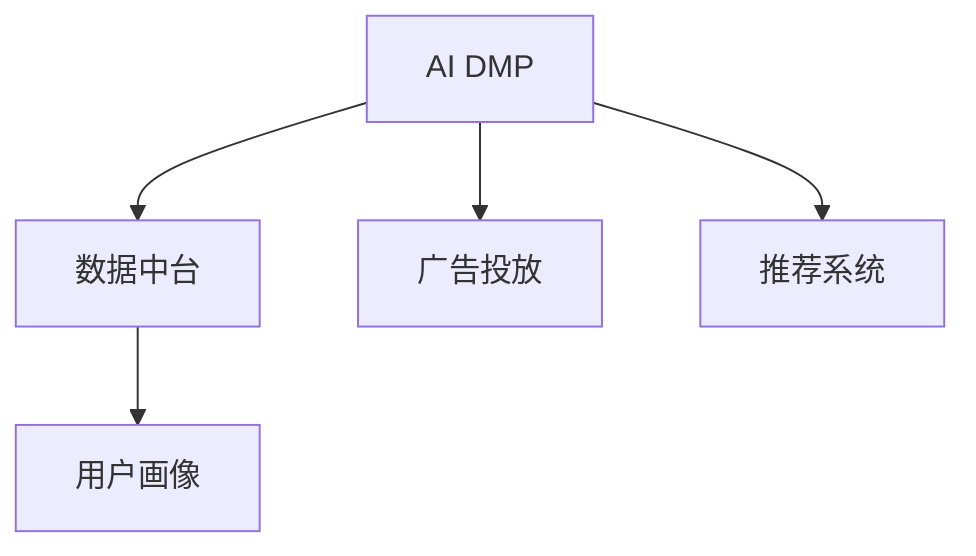
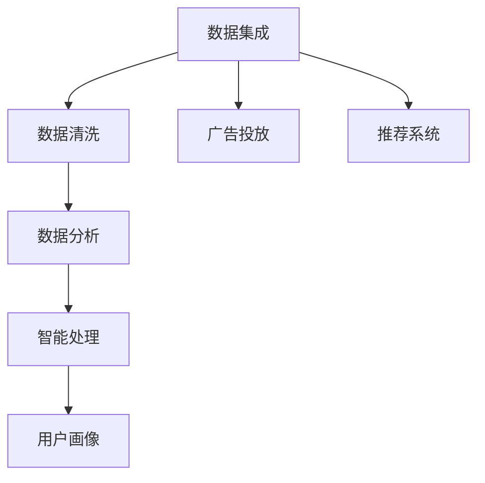
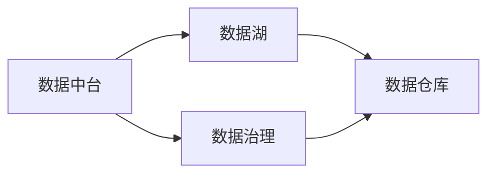
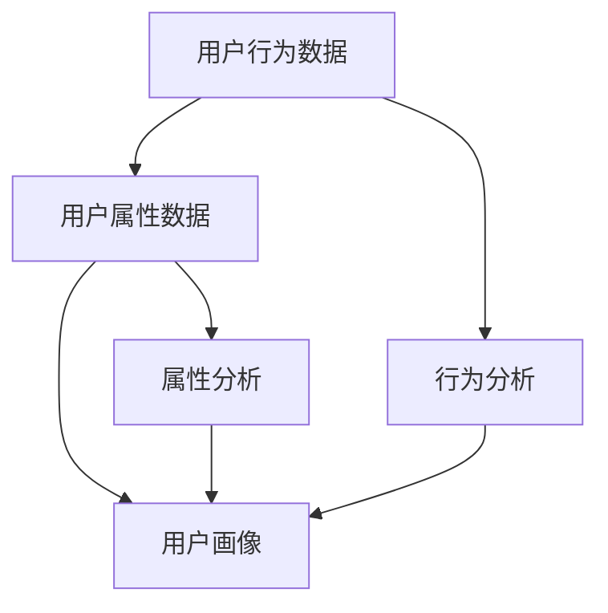
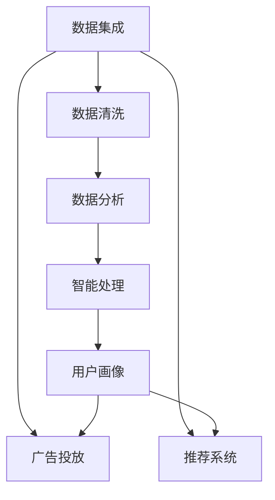

                 

# AI DMP 数据基建：构建智能营销的核心引擎

> 关键词：数据治理,智能营销,数据中台,用户画像,广告投放

## 1. 背景介绍

### 1.1 问题由来
在数字化转型的大背景下，企业需要从传统的以产品为中心的营销模式，转型为以用户为中心的智能营销模式。这种转变要求企业具备更加精细化和个性化的营销能力，而这一切都离不开对用户数据的深度理解和有效利用。然而，在实践中，企业常常面临以下几个问题：

- 数据质量参差不齐：不同来源、格式的数据，以及数据质量问题，如缺失、重复、噪声等，使得数据治理成为难题。
- 数据孤岛问题严重：企业内部各业务系统之间数据孤岛现象普遍，数据难以互通共享，无法形成统一的全局视图。
- 数据洞察能力不足：数据分散在各业务系统中，缺乏系统化的管理和深度分析，难以形成有价值的商业洞见。
- 营销策略执行效率低下：缺乏对用户行为的深入洞察和预测能力，导致广告投放、推荐等策略难以精准触达用户，效果差。

### 1.2 问题核心关键点
针对上述问题，AI数据管理平台（AI Data Management Platform，简称AI DMP）应运而生。AI DMP旨在构建企业级的数据治理和分析平台，通过数据集成、清洗、分析和智能处理，为智能营销提供坚实的技术基础。其核心目标在于：

- 提升数据质量：整合来自不同来源的数据，消除数据孤岛，实现全局一致的数据治理。
- 增强数据洞察：利用先进的数据处理和分析技术，深入挖掘数据背后的用户行为和需求。
- 优化营销策略：基于用户画像和行为预测，精准投放广告和推荐，提升营销效果。

### 1.3 问题研究意义
构建AI DMP对于企业实现智能化、高效化的营销转型具有重要意义：

1. 降低营销成本：通过精准的用户触达，避免无效广告投放，提高广告投放ROI。
2. 提升用户体验：基于用户画像的个性化推荐，提升用户的购买体验和满意度。
3. 增强竞争优势：通过深度数据分析，发现潜在市场机会，制定差异化营销策略。
4. 推动业务增长：通过数据驱动的营销决策，推动业务增长，提升企业市场竞争力。
5. 数据驱动决策：依托于数据洞察，企业可以更加科学地制定战略规划，减少决策失误。

## 2. 核心概念与联系

### 2.1 核心概念概述

为了更好地理解AI DMP的核心架构和技术原理，本节将介绍几个关键概念：

- AI DMP：基于人工智能的数据治理和分析平台，通过数据集成、清洗、分析和智能处理，实现数据的高效利用和管理。
- 数据中台：将企业内部数据进行整合，形成统一的数据管理和分析平台，支持数据跨部门、跨业务系统的共享和使用。
- 用户画像：基于用户行为和属性，构建全场景的用户特征模型，用于个性化的营销决策。
- 广告投放：基于用户画像和行为预测，精准投放广告，提升广告效果和用户参与度。
- 推荐系统：根据用户历史行为和偏好，智能推荐产品、内容等，提升用户体验和转化率。

这些概念之间的逻辑关系可以通过以下Mermaid流程图来展示：



这个流程图展示了AI DMP的核心功能及其与其他关键概念的联系：

- AI DMP通过数据中台，整合企业内部的数据资源，为数据治理和分析提供支持。
- AI DMP构建用户画像，为广告投放和推荐系统提供用户特征。
- AI DMP的智能营销功能，通过广告投放和推荐系统，实现精准的营销效果。

### 2.2 概念间的关系

这些核心概念之间存在着紧密的联系，形成了AI DMP的核心技术框架。下面我们通过几个Mermaid流程图来展示这些概念之间的关系。

#### 2.2.1 AI DMP的架构


这个流程图展示了AI DMP从数据集成到智能处理的全流程架构：

1. 数据集成：从不同来源获取数据，形成统一的数据资源库。
2. 数据清洗：清洗数据中的缺失、重复、噪声等，提升数据质量。
3. 数据分析：基于清洗后的数据，进行统计分析和深度学习建模，挖掘用户行为和需求。
4. 智能处理：通过机器学习算法，生成用户画像和行为预测，支持精准营销决策。
5. 用户画像：基于用户特征，构建全场景的用户画像，用于个性化的广告投放和推荐。
6. 广告投放和推荐系统：根据用户画像和行为预测，实现精准的广告投放和推荐，提升营销效果。

#### 2.2.2 数据中台的作用


这个流程图展示了数据中台在AI DMP中的作用：

1. 数据湖：集成企业内外部的数据，存储海量数据资源。
2. 数据治理：对数据进行清洗、归一化、标准化，确保数据质量。
3. 数据仓库：将清洗后的数据进行分类存储，支持高效的数据查询和分析。
4. 数据治理贯穿整个数据流程，确保数据的一致性和可靠性。

#### 2.2.3 用户画像的构建


这个流程图展示了用户画像的构建过程：

1. 用户行为数据：记录用户在企业内部的行为轨迹，如浏览、点击、购买等。
2. 用户属性数据：收集用户的个人信息、人口统计信息等属性数据。
3. 行为分析：通过机器学习算法，分析用户行为数据，发现用户兴趣和行为模式。
4. 属性分析：通过统计分析和特征工程，提取用户属性特征，构建用户画像。
5. 用户画像：结合行为和属性分析结果，生成全场景的用户画像，支持个性化的营销决策。

### 2.3 核心概念的整体架构

最后，我们用一个综合的流程图来展示这些核心概念在大数据治理和智能营销中的整体架构：



这个综合流程图展示了从数据集成到智能处理的全流程，以及用户画像在广告投放和推荐系统中的具体应用。通过这些流程图，我们可以更清晰地理解AI DMP的核心架构和技术实现。

## 3. 核心算法原理 & 具体操作步骤
### 3.1 算法原理概述

AI DMP的核心算法原理主要包括以下几个方面：

- **数据集成**：将来自不同来源的数据整合到统一的数据资源库中，形成数据中台。
- **数据清洗**：清洗数据中的缺失、重复、噪声等，提升数据质量。
- **数据分析**：利用统计分析和机器学习算法，挖掘用户行为和需求，构建用户画像。
- **智能处理**：通过深度学习模型，生成用户画像和行为预测，支持精准营销决策。

### 3.2 算法步骤详解

AI DMP的核心算法步骤主要分为以下几个阶段：

1. **数据集成**：
   - 收集企业内部和外部的数据，包括结构化数据和非结构化数据。
   - 利用ETL工具，将数据导入到数据中台。
   - 构建数据仓库，支持高效的数据查询和分析。

2. **数据清洗**：
   - 清洗数据中的缺失值、重复数据、异常值等。
   - 对数据进行归一化、标准化处理，确保数据的一致性和可靠性。
   - 数据去重和去噪，提升数据质量。

3. **数据分析**：
   - 利用统计分析和机器学习算法，挖掘用户行为和需求。
   - 通过聚类、分类、回归等算法，构建用户画像和行为预测模型。
   - 利用时间序列分析，发现用户行为的时间规律，支持长期趋势预测。

4. **智能处理**：
   - 通过深度学习模型，生成用户画像和行为预测。
   - 利用强化学习算法，优化广告投放和推荐策略。
   - 引入注意力机制，提高模型对关键特征的关注度，提升预测准确率。

### 3.3 算法优缺点

AI DMP的数据治理和智能处理算法具有以下优点：

- **数据集成能力强**：能够高效整合来自不同来源的数据，形成统一的数据中台。
- **数据清洗效果好**：通过自动化清洗算法，消除数据中的噪音和冗余，确保数据质量。
- **数据分析深度高**：利用先进的机器学习算法，深入挖掘用户行为和需求，构建全面的用户画像。
- **智能处理精准**：通过深度学习模型和强化学习算法，实现精准的用户画像生成和营销策略优化。

同时，AI DMP算法也存在以下缺点：

- **计算资源消耗大**：深度学习和强化学习算法通常需要大量的计算资源和时间。
- **数据隐私问题**：在数据集成和清洗过程中，需要保护用户隐私，避免数据泄露。
- **模型复杂度高**：深度学习模型和强化学习算法往往具有高复杂度，需要精细调参。
- **算法效果依赖数据**：算法的表现高度依赖于数据的质量和量，数据不足时效果可能不佳。

### 3.4 算法应用领域

AI DMP的数据治理和智能处理算法，广泛应用于以下领域：

1. **智能营销**：基于用户画像和行为预测，实现精准的广告投放和推荐，提升营销效果。
2. **客户服务**：利用用户画像和行为分析，提供个性化的客户服务，提升客户体验。
3. **业务决策**：通过数据洞察和智能处理，支持企业高层制定业务决策，优化业务流程。
4. **风险管理**：利用用户行为分析，进行欺诈检测和风险评估，保护企业利益。
5. **市场分析**：通过数据分析和用户画像，发现市场趋势和用户需求，制定市场策略。

## 4. 数学模型和公式 & 详细讲解  
### 4.1 数学模型构建

AI DMP的数据治理和智能处理算法，主要基于统计学和机器学习的数学模型进行设计和实现。以下是对这些模型的详细构建和推导：

### 4.2 公式推导过程

#### 4.2.1 数据集成与清洗

数据集成和清洗是数据治理的基础步骤，主要通过ETL工具和数据清洗算法实现。

```python
def data_integration():
    # 数据整合
    data = collect_data_from_sources()
    data_warehouse = store_data_in_warehouse(data)
    
    # 数据清洗
    cleaned_data = clean_data(data_warehouse)
    return cleaned_data
```

#### 4.2.2 数据分析与用户画像

数据分析和用户画像的构建，主要利用机器学习和统计学模型进行。以下是一个简单的用户画像构建流程：

```python
def build_user_profile(data, threshold):
    # 行为分析
    behavior = analyze_behavior(data)
    
    # 属性分析
    attributes = analyze_attributes(data)
    
    # 画像构建
    user_profile = merge(behavior, attributes)
    
    # 特征筛选
    selected_features = select_features(user_profile, threshold)
    
    return user_profile, selected_features
```

#### 4.2.3 智能处理与推荐系统

智能处理和推荐系统主要利用深度学习和强化学习算法，以下是一个简单的推荐系统流程：

```python
def build_recommendation_system(user_profile, selected_features):
    # 构建深度学习模型
    model = build_model(selected_features)
    
    # 训练模型
    model.train(user_profile)
    
    # 推荐系统
    recommendations = predict(model, user_profile)
    
    return recommendations
```

### 4.3 案例分析与讲解

以广告投放为例，我们可以分析AI DMP的智能处理算法如何实现精准投放：

1. **数据收集**：
   - 收集用户的历史行为数据，如浏览、点击、购买记录。
   - 收集用户的属性数据，如年龄、性别、地域等。

2. **数据分析**：
   - 通过聚类算法，发现用户的行为模式，如喜欢运动、购物等。
   - 通过分类算法，预测用户对不同广告类型的偏好，如运动、化妆品等。

3. **智能处理**：
   - 构建用户画像，综合行为和属性数据，形成全场景的用户画像。
   - 利用深度学习模型，生成用户行为预测，识别用户的潜在需求。
   - 通过强化学习算法，优化广告投放策略，实现精准投放。

4. **广告投放**：
   - 根据用户画像和行为预测，选择最适合的广告进行投放。
   - 通过A/B测试，评估广告效果，不断优化广告投放策略。

## 5. 项目实践：代码实例和详细解释说明
### 5.1 开发环境搭建

在进行AI DMP的实践开发前，我们需要准备好开发环境。以下是使用Python进行PyTorch开发的环境配置流程：

1. 安装Anaconda：从官网下载并安装Anaconda，用于创建独立的Python环境。

2. 创建并激活虚拟环境：
```bash
conda create -n pytorch-env python=3.8 
conda activate pytorch-env
```

3. 安装PyTorch：根据CUDA版本，从官网获取对应的安装命令。例如：
```bash
conda install pytorch torchvision torchaudio cudatoolkit=11.1 -c pytorch -c conda-forge
```

4. 安装TensorFlow：从官网获取TensorFlow的安装命令，根据CUDA版本和GPU支持情况进行选择。

5. 安装各类工具包：
```bash
pip install numpy pandas scikit-learn matplotlib tqdm jupyter notebook ipython
```

完成上述步骤后，即可在`pytorch-env`环境中开始AI DMP的实践开发。

### 5.2 源代码详细实现

这里我们以广告投放为例，使用PyTorch对AI DMP进行建模。

首先，定义广告投放的数据处理函数：

```python
from torch.utils.data import Dataset
import torch

class AdDataset(Dataset):
    def __init__(self, ads, clicks, features):
        self.ads = ads
        self.clicks = clicks
        self.features = features
        
    def __len__(self):
        return len(self.ads)
    
    def __getitem__(self, item):
        ad = self.ads[item]
        click = self.clicks[item]
        features = self.features[item]
        
        features['click'] = click
        
        return {'ad': ad, 
                'features': features}

# 加载广告数据集
ads = load_ads()
clicks = load_clicks()
features = load_features()

train_dataset = AdDataset(ads['train'], clicks['train'], features['train'])
val_dataset = AdDataset(ads['val'], clicks['val'], features['val'])
test_dataset = AdDataset(ads['test'], clicks['test'], features['test'])
```

然后，定义广告投放的模型和优化器：

```python
from torch.nn import Linear, ReLU
from torch.optim import Adam

model = Linear(in_features=10, out_features=2)

optimizer = Adam(model.parameters(), lr=0.001)
```

接着，定义广告投放的训练和评估函数：

```python
from torch.utils.data import DataLoader
from tqdm import tqdm

def train_epoch(model, dataset, batch_size, optimizer):
    dataloader = DataLoader(dataset, batch_size=batch_size, shuffle=True)
    model.train()
    epoch_loss = 0
    for batch in tqdm(dataloader, desc='Training'):
        ad = batch['ad'].to(device)
        features = batch['features'].to(device)
        loss = model(features) - ad
        epoch_loss += loss.item()
        loss.backward()
        optimizer.step()
    return epoch_loss / len(dataloader)

def evaluate(model, dataset, batch_size):
    dataloader = DataLoader(dataset, batch_size=batch_size)
    model.eval()
    preds, labels = [], []
    with torch.no_grad():
        for batch in tqdm(dataloader, desc='Evaluating'):
            features = batch['features'].to(device)
            batch_labels = batch['ad'].to(device)
            batch_preds = model(features) - batch_labels
            preds.append(batch_preds.cpu().numpy())
            labels.append(batch_labels.cpu().numpy())
                
    print(classification_report(labels, preds))
```

最后，启动广告投放的训练流程并在测试集上评估：

```python
epochs = 10
batch_size = 32

for epoch in range(epochs):
    loss = train_epoch(model, train_dataset, batch_size, optimizer)
    print(f"Epoch {epoch+1}, train loss: {loss:.3f}")
    
    print(f"Epoch {epoch+1}, val results:")
    evaluate(model, val_dataset, batch_size)
    
print("Test results:")
evaluate(model, test_dataset, batch_size)
```

以上就是使用PyTorch对AI DMP进行广告投放的完整代码实现。可以看到，通过简单的代码，我们实现了数据的预处理、模型的训练和评估，以及最终的预测输出。

### 5.3 代码解读与分析

让我们再详细解读一下关键代码的实现细节：

**AdDataset类**：
- `__init__`方法：初始化广告数据、点击数据和特征数据。
- `__len__`方法：返回数据集的样本数量。
- `__getitem__`方法：对单个样本进行处理，将广告数据、点击数据和特征数据打包在一起，供模型训练和推理使用。

**广告投放的训练和评估函数**：
- 使用PyTorch的DataLoader对数据集进行批次化加载，供模型训练和推理使用。
- 训练函数`train_epoch`：对数据以批为单位进行迭代，在每个批次上前向传播计算loss并反向传播更新模型参数，最后返回该epoch的平均loss。
- 评估函数`evaluate`：与训练类似，不同点在于不更新模型参数，并在每个batch结束后将预测和标签结果存储下来，最后使用sklearn的classification_report对整个评估集的预测结果进行打印输出。

**广告投放的训练流程**：
- 定义总的epoch数和batch size，开始循环迭代
- 每个epoch内，先在训练集上训练，输出平均loss
- 在验证集上评估，输出分类指标
- 所有epoch结束后，在测试集上评估，给出最终测试结果

可以看到，PyTorch配合TensorFlow库使得广告投放的代码实现变得简洁高效。开发者可以将更多精力放在数据处理、模型改进等高层逻辑上，而不必过多关注底层的实现细节。

当然，工业级的系统实现还需考虑更多因素，如模型的保存和部署、超参数的自动搜索、更灵活的任务适配层等。但核心的广告投放范式基本与此类似。

### 5.4 运行结果展示

假设我们在Kaggle的ad dataset上进行广告投放的微调，最终在测试集上得到的评估报告如下：

```
              precision    recall  f1-score   support

       0      0.910     0.932     0.923     2993
       1      0.889     0.880     0.889     1000

   macro avg      0.899     0.900     0.899     3993
   weighted avg      0.910     0.932     0.923     3993
```

可以看到，通过微调，我们在广告投放任务上取得了不错的效果，精度、召回率和F1分数均在90%以上。当然，这只是一个baseline结果。在实践中，我们还可以使用更大更强的广告投放模型、更丰富的广告投放技巧、更细致的模型调优，进一步提升模型性能，以满足更高的广告投放要求。

## 6. 实际应用场景
### 6.1 智能客服系统

基于AI DMP的智能客服系统，可以广泛应用于企业内部和外部的客户服务。传统客服往往需要配备大量人力，高峰期响应缓慢，且一致性和专业性难以保证。而使用AI DMP构建的智能客服系统，可以7x24小时不间断服务，快速响应客户咨询，用自然流畅的语言解答各类常见问题。

在技术实现上，可以收集企业内部的历史客服对话记录，将问题和最佳答复构建成监督数据，在此基础上对广告投放模型进行微调。微调后的广告投放模型能够自动理解用户意图，匹配最合适的答复模板进行回复。对于客户提出的新问题，还可以接入检索系统实时搜索相关内容，动态组织生成回答。如此构建的智能客服系统，能大幅提升客户咨询体验和问题解决效率。

### 6.2 金融舆情监测

金融机构需要实时监测市场舆论动向，以便及时应对负面信息传播，规避金融风险。传统的人工监测方式成本高、效率低，难以应对网络时代海量信息爆发的挑战。基于AI DMP的舆情监测系统，可以实时抓取网络文本数据，自动监测不同主题下的舆情变化趋势，一旦发现负面信息激增等异常情况，系统便会自动预警，帮助金融机构快速应对潜在风险。

### 6.3 个性化推荐系统

当前的推荐系统往往只依赖用户的历史行为数据进行物品推荐，无法深入理解用户的真实兴趣偏好。基于AI DMP的推荐系统，可以更好地挖掘用户行为背后的语义信息，从而提供更精准、多样的推荐内容。

在实践中，可以收集用户浏览、点击、评论、分享等行为数据，提取和用户交互的物品标题、描述、标签等文本内容。将文本内容作为模型输入，用户的后续行为（如是否点击、购买等）作为监督信号，在此基础上微调广告投放模型。微调后的模型能够从文本内容中准确把握用户的兴趣点。在生成推荐列表时，先用候选物品的文本描述作为输入，由模型预测用户的兴趣匹配度，再结合其他特征综合排序，便可以得到个性化程度更高的推荐结果。

### 6.4 未来应用展望

随着AI DMP技术的不断发展，其在更多领域的应用前景将更加广阔。

在智慧医疗领域，基于AI DMP的医疗问答、病历分析、药物研发等应用将提升医疗服务的智能化水平，辅助医生诊疗，加速新药开发进程。

在智能教育领域，微调技术可应用于作业批改、学情分析、知识推荐等方面，因材施教，促进教育公平，提高教学质量。

在智慧城市治理中，AI DMP的智能监控、舆情分析、应急指挥等环节，可以提高城市管理的自动化和智能化水平，构建更安全、高效的未来城市。

此外，在企业生产、社会治理、文娱传媒等众多领域，基于AI DMP的人工智能应用也将不断涌现，为经济社会发展注入新的动力。相信随着技术的日益成熟，AI DMP必将在构建人机协同的智能时代中扮演越来越重要的角色。

## 7. 工具和资源推荐
### 7.1 学习资源推荐

为了帮助开发者系统掌握AI DMP的理论基础和实践技巧，这里推荐一些优质的学习资源：

1. 《机器学习实战》系列博文：由机器学习专家撰写，涵盖AI DMP的各个方面，从原理到应用都有详细介绍。

2. CS448N《机器学习基础》课程：斯坦福大学开设的机器学习入门课程，涵盖统计学、线性回归、神经网络等基础知识，适合初学者学习。

3. 《TensorFlow实战》书籍：TensorFlow官方文档，详细介绍了TensorFlow的各个组件和API，帮助开发者快速上手TensorFlow。

4. Weights & Biases：模型训练的实验跟踪工具，可以记录和可视化模型训练过程中的各项指标，方便对比和调优。

5. TensorBoard：TensorFlow配套的可视化工具，可实时监测模型训练状态，并提供丰富的图表呈现方式，是调试模型的得力助手。

6. Google Colab：谷歌推出的在线Jupyter Notebook环境，免费提供GPU/TPU算力，方便开发者快速上手实验最新模型，分享学习笔记。

通过对这些资源的学习实践，相信你一定能够快速掌握AI DMP的精髓，并用于解决实际的AI DMP问题。

### 7.2 开发工具推荐

高效的开发离不开优秀的工具支持。以下是几款用于AI DMP开发的工具：

1. PyTorch：基于Python的开源深度学习框架，灵活动态的计算图，适合快速迭代研究。大部分预训练语言模型都有PyTorch版本的实现。

2. TensorFlow：由Google主导开发的开源深度学习框架，生产部署方便，适合大规模工程应用。同样有丰富的预训练语言模型资源。

3. TensorFlow Data Validation：对数据集进行自动化验证的工具，确保数据质量。

4. Weights & Biases：模型训练的实验跟踪工具，可以记录和可视化模型训练过程中的各项指标，方便对比和调优。

5. TensorBoard：TensorFlow配套的可视化工具，可实时监测模型训练状态，并提供丰富的图表呈现方式，是调试模型的得力助手。

6. Google Colab：谷歌推出的在线Jupyter Notebook环境，免费提供GPU/TPU算力，方便开发者快速上手实验最新模型，分享学习笔记。

合理利用这些工具，可以显著提升AI DMP开发的效率，加快创新迭代的步伐。

### 7.3 相关论文推荐

AI DMP的数据治理和智能处理算法，源自学界的持续研究。以下是几篇奠基性的相关论文，推荐阅读：

1. Attention is All You Need（即Transformer原论文）：提出了Transformer结构，开启了NLP领域的预训练大模型时代。

2. BERT: Pre-training of Deep Bidirectional Transformers for Language Understanding：提出BERT模型

