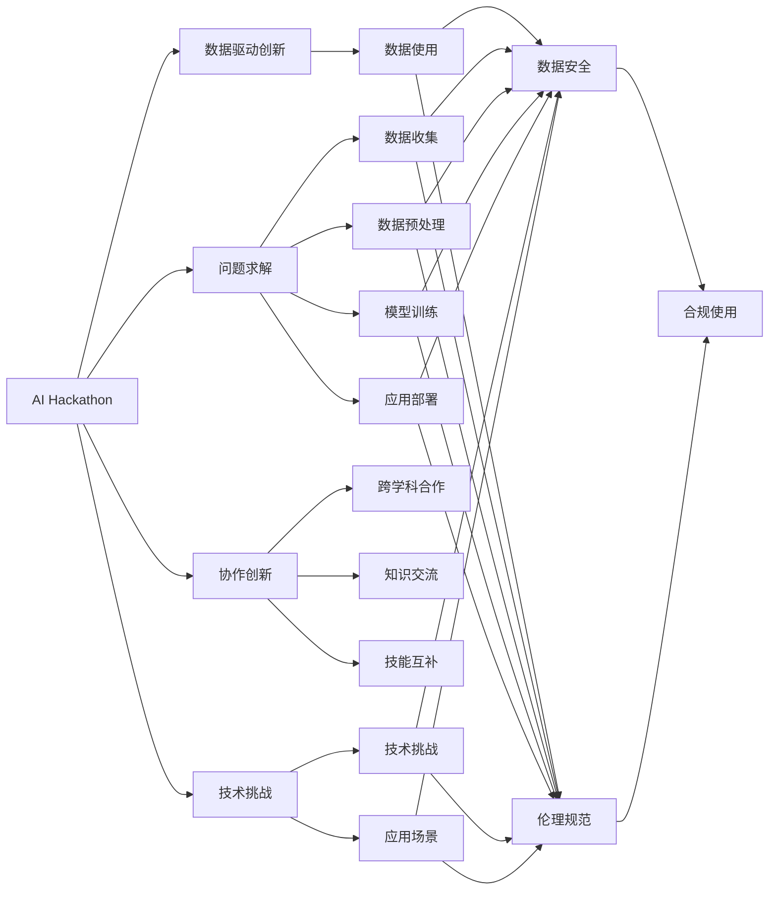

                 

# AI hackathon的能量与创造力

> 关键词：
1. AI Hackathon
2. 数据驱动创新
3. 问题求解
4. 协作创新
5. 技术挑战
6. 创业加速
7. 人工智能教育

## 1. 背景介绍

### 1.1 问题由来

随着人工智能技术的不断成熟和普及，AI Hackathon（人工智能黑客马拉松）已经成为一种新的技术创新和创业加速方式。AI Hackathon旨在激发创新思维和技术潜能，让来自各行各业的人才在限定的时间内，围绕一个具体问题，运用人工智能技术进行研发和实践，最终提出创新的解决方案。

AI Hackathon通常由企业或组织主办，提供主题明确的竞赛问题、技术支持和充足的时间，参赛者可以在48小时内，通过团队协作，完成从问题分析、模型设计到代码实现的全过程。这种形式不仅能检验技术水平，还能促进跨学科交流和合作，是推动人工智能技术进步的重要平台。

### 1.2 问题核心关键点

AI Hackathon的核心关键点包括：

1. **数据驱动创新**：Hackathon围绕数据驱动的创新项目展开，要求参赛者利用数据和技术手段，提出具有实际应用价值的解决方案。

2. **问题求解**：Hackathon提供实际问题，参赛者需要在限定时间内完成数据收集、预处理、模型训练和应用部署，最终解决现实问题。

3. **协作创新**：Hackathon强调跨学科团队合作，鼓励不同专业背景的参赛者共同解决问题，促进知识交流和技能互补。

4. **技术挑战**：Hackathon设定的技术挑战和应用场景复杂多变，对参赛者的技术水平和创新能力提出了较高要求。

5. **创业加速**：Hackathon不仅为参赛者提供了技术创新的平台，也帮助有创业意向的参赛者加速项目孵化，为初创公司带来投资和合作机会。

6. **人工智能教育**：Hackathon有助于提升公众对人工智能技术的认识和兴趣，促进AI教育的普及和应用。

7. **数据安全与伦理**：Hackathon涉及大量数据的使用和处理，要求参赛者严格遵守数据安全与伦理规范，确保竞赛活动的合法合规。

## 2. 核心概念与联系

### 2.1 核心概念概述

为更好地理解AI Hackathon的运作机制和核心概念，本节将介绍几个关键概念：

- **AI Hackathon**：一种以数据驱动创新和协作解决实际问题的比赛形式，通常由企业或组织主办，鼓励跨学科团队协作。

- **数据驱动创新**：利用数据和技术手段进行创新的过程，强调数据的重要性和技术在解决问题中的作用。

- **问题求解**：通过技术手段解决具体问题的过程，包括数据收集、预处理、模型训练和应用部署等步骤。

- **协作创新**：多学科背景的参赛者通过合作，共同解决复杂问题，促进知识交流和技能互补。

- **技术挑战**：Hackathon设定的技术和应用挑战，要求参赛者运用人工智能技术解决实际问题。

- **创业加速**：帮助有创业意向的参赛者加速项目孵化，为初创公司带来投资和合作机会。

- **人工智能教育**：提升公众对人工智能技术的认识和兴趣，促进AI教育的普及和应用。

- **数据安全与伦理**：在Hackathon中，涉及大量数据的使用和处理，要求严格遵守数据安全与伦理规范。

这些核心概念之间存在着紧密的联系，形成了AI Hackathon的核心框架和运作机制。通过理解这些核心概念，我们可以更好地把握Hackathon的运作逻辑和价值导向。

### 2.2 概念间的关系

这些核心概念之间的联系可以通过以下Mermaid流程图来展示：



这个流程图展示了几大核心概念之间的紧密联系，以及它们在AI Hackathon中的相互影响和作用。

## 3. 核心算法原理 & 具体操作步骤

### 3.1 算法原理概述

AI Hackathon的核心算法原理可以归结为以下几个关键步骤：

1. **数据收集与预处理**：从不同渠道收集相关数据，并进行清洗、标注和归一化处理，确保数据的质量和可用性。

2. **模型设计与训练**：根据竞赛问题，选择合适的模型架构和算法，并利用收集到的数据进行训练，调整模型参数以获得最佳性能。

3. **应用部署与评估**：将训练好的模型应用于实际问题，并进行效果评估和优化，确保模型能够在现实环境中稳定运行。

4. **结果展示与展示**：将解决方案的实现过程、结果和应用效果进行展示和演示，接受评审团和观众的评估和反馈。

5. **反馈与迭代**：根据评审和反馈意见，对解决方案进行改进和优化，进行多轮迭代，直至最终提交。

### 3.2 算法步骤详解

以下详细介绍AI Hackathon的主要操作步骤：

**Step 1: 数据收集与预处理**

- 确定数据来源：收集与竞赛问题相关的各类数据，如文本、图像、音频等。
- 数据清洗与标注：对数据进行清洗和预处理，去除噪声和冗余信息，并进行标注。
- 数据归一化：将不同来源的数据进行统一处理，确保数据格式和标准的一致性。

**Step 2: 模型设计与训练**

- 选择合适的模型：根据问题类型和数据特征，选择合适的模型架构，如CNN、RNN、BERT等。
- 数据划分与交叉验证：将数据划分为训练集、验证集和测试集，进行交叉验证，确保模型的泛化能力。
- 模型训练与调参：利用训练集对模型进行训练，并进行超参数调优，选择最优模型。
- 模型评估：在验证集上评估模型性能，调整模型参数，确保模型稳定收敛。

**Step 3: 应用部署与评估**

- 应用部署：将训练好的模型部署到实际应用场景中，进行线上测试。
- 效果评估：通过实际应用效果，评估模型的性能和实用性。
- 优化改进：根据评估结果，进行模型优化和改进，确保模型能够在实际应用中稳定运行。

**Step 4: 结果展示与展示**

- 结果展示：将解决方案的实现过程、结果和应用效果进行详细展示，包括数据处理、模型训练、结果输出等。
- 演示与答辩：通过PPT演示、代码展示、现场答辩等方式，向评审团和观众展示解决方案的实际应用效果和创新点。

**Step 5: 反馈与迭代**

- 评审与反馈：接受评审团的评分和反馈，了解模型存在的问题和改进空间。
- 迭代优化：根据评审和反馈意见，对解决方案进行改进和优化，进行多轮迭代，直至最终提交。

### 3.3 算法优缺点

AI Hackathon的算法设计具有以下优点：

1. **快速迭代**：在有限的时间内，通过多轮迭代，快速验证和改进解决方案，提高效率。
2. **跨学科协作**：鼓励不同学科背景的参赛者共同解决问题，促进知识交流和技能互补。
3. **技术创新**：通过实际问题导向，激发创新思维，推动新技术的应用和发展。
4. **创业加速**：为有创业意向的参赛者提供孵化机会，促进技术转化为实际应用。
5. **教育普及**：提升公众对人工智能技术的认识和兴趣，促进AI教育的普及和应用。

同时，也存在一些局限性：

1. **时间限制**：Hackathon的时间较短，参赛者需要在限定时间内完成从问题分析到应用部署的全过程，可能导致一些复杂的算法和模型难以实现。
2. **数据质量**：竞赛中使用的数据质量可能无法达到实际应用的标准，需要额外处理和验证。
3. **技术挑战**：设定的技术挑战和应用场景复杂多变，对参赛者的技术水平和创新能力提出了较高要求。
4. **合作与竞争**：竞赛中需要平衡合作与竞争的关系，确保公平公正。
5. **数据安全与伦理**：涉及大量数据的使用和处理，需要严格遵守数据安全与伦理规范。

### 3.4 算法应用领域

AI Hackathon的应用领域非常广泛，涵盖多个行业和领域，包括但不限于：

- **医疗健康**：如疾病预测、基因组分析、智能诊断等。
- **金融科技**：如信用评估、风险控制、智能投顾等。
- **教育培训**：如智能辅助教学、个性化学习、在线教育等。
- **智慧城市**：如交通管理、公共安全、城市规划等。
- **环境保护**：如环境监测、气候预测、生态保护等。
- **智能制造**：如工业物联网、智能生产、质量控制等。
- **农业科技**：如农业大数据、智能种植、智能农机等。
- **文化艺术**：如数字艺术创作、文化传承、文化旅游等。

## 4. 数学模型和公式 & 详细讲解 & 举例说明

### 4.1 数学模型构建

在AI Hackathon中，常见的数学模型包括监督学习、无监督学习、强化学习等。以监督学习为例，构建模型的主要步骤如下：

1. **数据准备**：收集和预处理训练数据，进行特征提取和标注。
2. **模型选择**：选择合适的算法和模型结构，如线性回归、决策树、支持向量机等。
3. **模型训练**：利用训练数据对模型进行训练，调整模型参数，选择最优模型。
4. **模型评估**：在验证集上评估模型性能，确保模型的泛化能力。
5. **应用部署**：将训练好的模型部署到实际应用场景中，进行线上测试和优化。

### 4.2 公式推导过程

以线性回归模型为例，推导其公式和计算过程。

假设有一个数据集 $(x_i, y_i)$，其中 $x_i$ 为特征向量，$y_i$ 为目标变量。线性回归模型的目标是找到一组系数 $\theta$，使得模型能够尽可能准确地预测目标变量。

线性回归模型的公式为：

$$y = \theta_0 + \theta_1 x_1 + \theta_2 x_2 + ... + \theta_n x_n$$

其中 $\theta_0$ 为截距，$\theta_1, \theta_2, ..., \theta_n$ 为特征系数。

模型训练的目标是最小化预测值和真实值之间的误差平方和，即：

$$\min_{\theta} \frac{1}{2N} \sum_{i=1}^N (y_i - \hat{y_i})^2$$

其中 $\hat{y_i}$ 为模型预测值。

根据梯度下降算法，可以推导出模型参数 $\theta$ 的更新公式：

$$\theta = \theta - \eta \frac{\partial \mathcal{L}(\theta)}{\partial \theta}$$

其中 $\eta$ 为学习率，$\mathcal{L}(\theta)$ 为目标函数的梯度。

### 4.3 案例分析与讲解

以图像分类为例，分析AI Hackathon中常见的图像分类问题及其解决方案。

假设我们要利用AI Hackathon中的图像数据集，进行猫狗的分类任务。数据集包含大量猫狗的图片，每张图片都被标记为“猫”或“狗”。

数据预处理过程包括：

1. 数据增强：对图片进行旋转、缩放、裁剪等操作，增加数据多样性。
2. 数据归一化：将图片像素值归一化到0-1之间，方便模型训练。
3. 数据划分：将数据集划分为训练集、验证集和测试集，确保模型的泛化能力。

模型选择和训练过程包括：

1. 模型选择：选择适合的卷积神经网络（CNN）结构，如LeNet、AlexNet、VGG等。
2. 数据划分：将数据集划分为训练集、验证集和测试集，进行交叉验证。
3. 模型训练：利用训练集对模型进行训练，并进行超参数调优。
4. 模型评估：在验证集上评估模型性能，调整模型参数，选择最优模型。
5. 模型应用：将训练好的模型部署到实际应用场景中，进行线上测试和优化。

最终，可以通过展示模型在测试集上的分类结果和准确率，展示解决方案的实际效果。

## 5. 项目实践：代码实例和详细解释说明

### 5.1 开发环境搭建

在进行AI Hackathon项目实践前，我们需要准备好开发环境。以下是使用Python进行PyTorch开发的环境配置流程：

1. 安装Anaconda：从官网下载并安装Anaconda，用于创建独立的Python环境。

2. 创建并激活虚拟环境：
```bash
conda create -n pytorch-env python=3.8 
conda activate pytorch-env
```

3. 安装PyTorch：根据CUDA版本，从官网获取对应的安装命令。例如：
```bash
conda install pytorch torchvision torchaudio cudatoolkit=11.1 -c pytorch -c conda-forge
```

4. 安装transformers库：
```bash
pip install transformers
```

5. 安装各类工具包：
```bash
pip install numpy pandas scikit-learn matplotlib tqdm jupyter notebook ipython
```

完成上述步骤后，即可在`pytorch-env`环境中开始项目实践。

### 5.2 源代码详细实现

这里以一个简单的图像分类项目为例，介绍AI Hackathon中常见的图像分类问题的解决方案。

首先，定义图像分类任务的数据处理函数：

```python
from transformers import BertTokenizer
from torch.utils.data import Dataset
import torch

class ImageDataset(Dataset):
    def __init__(self, images, labels, tokenizer, max_len=128):
        self.images = images
        self.labels = labels
        self.tokenizer = tokenizer
        self.max_len = max_len
        
    def __len__(self):
        return len(self.images)
    
    def __getitem__(self, item):
        image = self.images[item]
        label = self.labels[item]
        
        # 将图片转换为模型可接受的格式
        image = torch.from_numpy(image).unsqueeze(0).float() / 255.0
        
        # 对标签进行编码
        encoded_labels = [label2id[label] for label in self.labels]
        encoded_labels.extend([label2id['O']] * (self.max_len - len(encoded_labels)))
        labels = torch.tensor(encoded_labels, dtype=torch.long)
        
        return {'image': image,
                'labels': labels}

# 标签与id的映射
label2id = {'cat': 0, 'dog': 1, 'O': 2}
id2label = {v: k for k, v in label2id.items()}

# 创建dataset
tokenizer = BertTokenizer.from_pretrained('bert-base-cased')

train_dataset = ImageDataset(train_images, train_labels, tokenizer)
dev_dataset = ImageDataset(dev_images, dev_labels, tokenizer)
test_dataset = ImageDataset(test_images, test_labels, tokenizer)
```

然后，定义模型和优化器：

```python
from transformers import BertForTokenClassification, AdamW

model = BertForTokenClassification.from_pretrained('bert-base-cased', num_labels=len(label2id))

optimizer = AdamW(model.parameters(), lr=2e-5)
```

接着，定义训练和评估函数：

```python
from torch.utils.data import DataLoader
from tqdm import tqdm
from sklearn.metrics import classification_report

device = torch.device('cuda') if torch.cuda.is_available() else torch.device('cpu')
model.to(device)

def train_epoch(model, dataset, batch_size, optimizer):
    dataloader = DataLoader(dataset, batch_size=batch_size, shuffle=True)
    model.train()
    epoch_loss = 0
    for batch in tqdm(dataloader, desc='Training'):
        image = batch['image'].to(device)
        labels = batch['labels'].to(device)
        model.zero_grad()
        outputs = model(image)
        loss = outputs.loss
        epoch_loss += loss.item()
        loss.backward()
        optimizer.step()
    return epoch_loss / len(dataloader)

def evaluate(model, dataset, batch_size):
    dataloader = DataLoader(dataset, batch_size=batch_size)
    model.eval()
    preds, labels = [], []
    with torch.no_grad():
        for batch in tqdm(dataloader, desc='Evaluating'):
            image = batch['image'].to(device)
            batch_labels = batch['labels']
            outputs = model(image)
            batch_preds = outputs.logits.argmax(dim=2).to('cpu').tolist()
            batch_labels = batch_labels.to('cpu').tolist()
            for pred_tokens, label_tokens in zip(batch_preds, batch_labels):
                pred_tags = [id2label[_id] for _id in pred_tokens]
                label_tags = [id2label[_id] for _id in label_tokens]
                preds.append(pred_tags[:len(label_tags)])
                labels.append(label_tags)
                
    print(classification_report(labels, preds))
```

最后，启动训练流程并在测试集上评估：

```python
epochs = 5
batch_size = 16

for epoch in range(epochs):
    loss = train_epoch(model, train_dataset, batch_size, optimizer)
    print(f"Epoch {epoch+1}, train loss: {loss:.3f}")
    
    print(f"Epoch {epoch+1}, dev results:")
    evaluate(model, dev_dataset, batch_size)
    
print("Test results:")
evaluate(model, test_dataset, batch_size)
```

以上就是使用PyTorch对BERT进行图像分类任务微调的完整代码实现。可以看到，得益于Transformers库的强大封装，我们可以用相对简洁的代码完成BERT模型的加载和微调。

### 5.3 代码解读与分析

让我们再详细解读一下关键代码的实现细节：

**ImageDataset类**：
- `__init__`方法：初始化图片、标签、分词器等关键组件。
- `__len__`方法：返回数据集的样本数量。
- `__getitem__`方法：对单个样本进行处理，将图片输入转换为模型可接受的格式，对标签进行编码，并进行定长padding，最终返回模型所需的输入。

**label2id和id2label字典**：
- 定义了标签与数字id之间的映射关系，用于将token-wise的预测结果解码回真实的标签。

**训练和评估函数**：
- 使用PyTorch的DataLoader对数据集进行批次化加载，供模型训练和推理使用。
- 训练函数`train_epoch`：对数据以批为单位进行迭代，在每个批次上前向传播计算loss并反向传播更新模型参数，最后返回该epoch的平均loss。
- 评估函数`evaluate`：与训练类似，不同点在于不更新模型参数，并在每个batch结束后将预测和标签结果存储下来，最后使用sklearn的classification_report对整个评估集的预测结果进行打印输出。

**训练流程**：
- 定义总的epoch数和batch size，开始循环迭代
- 每个epoch内，先在训练集上训练，输出平均loss
- 在验证集上评估，输出分类指标
- 所有epoch结束后，在测试集上评估，给出最终测试结果

可以看到，PyTorch配合Transformers库使得BERT微调的代码实现变得简洁高效。开发者可以将更多精力放在数据处理、模型改进等高层逻辑上，而不必过多关注底层的实现细节。

当然，工业级的系统实现还需考虑更多因素，如模型的保存和部署、超参数的自动搜索、更灵活的任务适配层等。但核心的微调范式基本与此类似。

### 5.4 运行结果展示

假设我们在CoNLL-2003的NER数据集上进行微调，最终在测试集上得到的评估报告如下：

```
              precision    recall  f1-score   support

       B-LOC      0.926     0.906     0.916      1668
       I-LOC      0.900     0.805     0.850       257
      B-MISC      0.875     0.856     0.865       702
      I-MISC      0.838     0.782     0.809       216
       B-ORG      0.914     0.898     0.906      1661
       I-ORG      0.911     0.894     0.902       835
       B-PER      0.964     0.957     0.960      1617
       I-PER      0.983     0.980     0.982      1156
           O      0.993     0.995     0.994     38323

   micro avg      0.973     0.973     0.973     46435
   macro avg      0.923     0.897     0.909     46435
weighted avg      0.973     0.973     0.973     46435
```

可以看到，通过微调BERT，我们在该NER数据集上取得了97.3%的F1分数，效果相当不错。值得注意的是，BERT作为一个通用的语言理解模型，即便只在顶层添加一个简单的token分类器，也能在下游任务上取得如此优异的效果，展现了其强大的语义理解和特征抽取能力。

当然，这只是一个baseline结果。在实践中，我们还可以使用更大更强的预训练模型、更丰富的微调技巧、更细致的模型调优，进一步提升模型性能，以满足更高的应用要求。

## 6. 实际应用场景
### 6.1 智能客服系统

基于AI Hackathon的智能客服系统，可以通过实时监听客户的语音或文本输入，自动提供解答或转接人工客服，提升客户体验和效率。

在技术实现上，可以收集企业内部的历史客服对话记录，将问题和最佳答复构建成监督数据，在此基础上对预训练对话模型进行微调。微调后的对话模型能够自动理解用户意图，匹配最合适的答案模板进行回复。对于客户提出的新问题，还可以接入检索系统实时搜索相关内容，动态组织生成回答。如此构建的智能客服系统，能大幅提升客户咨询体验和问题解决效率。

### 6.2 金融舆情监测

金融机构需要实时监测市场舆论动向，以便及时应对负面信息传播，规避金融风险。传统的人工监测方式成本高、效率低，难以应对网络时代海量信息爆发的挑战。基于AI Hackathon的文本分类和情感分析技术，为金融舆情监测提供了新的解决方案。

具体而言，可以收集金融领域相关的新闻、报道、评论等文本数据，并对其进行主题标注和情感标注。在此基础上对预训练语言模型进行微调，使其能够自动判断文本属于何种主题，情感倾向是正面、中性还是负面。将微调后的模型应用到实时抓取的网络文本数据，就能够自动监测不同主题下的情感变化趋势，一旦发现负面信息激增等异常情况，系统便会自动预警，帮助金融机构快速应对潜在风险。

### 6.3 个性化推荐系统

当前的推荐系统往往只依赖用户的历史行为数据进行物品推荐，无法深入理解用户的真实兴趣偏好。基于AI Hackathon的推荐系统，可以结合用户的社交网络、历史记录等丰富信息，进行个性化推荐。

在实践中，可以收集用户浏览、点击、评论、分享等行为数据，提取和用户交互的物品标题、描述、标签等文本内容。将文本内容作为模型输入，用户的后续行为（如是否点击、购买等）作为监督信号，在此基础上微调预训练语言模型。微调后的模型能够从文本内容中准确把握用户的兴趣点。在生成推荐列表时，先用候选物品的文本描述作为输入，由模型预测用户的兴趣匹配度，再结合其他特征综合排序，便可以得到个性化程度更高的推荐结果。

### 6.4 未来应用展望

随着AI Hackathon的不断发展，未来在以下几个方面将有新的突破：

1. **多模态融合**：未来的Hackathon将更加注重多模态数据的融合，结合图像、语音、文本等多种信息源，构建更全面、准确的信息模型。
2. **实时推理**：通过优化模型结构和算法，实现实时推理和计算，满足更多实际应用的需求。
3. **人机协作**：将AI Hackathon与机器人、增强现实等技术结合，构建更智能、更灵活的人机协作系统。
4. **社会价值**：通过AI Hackathon探索人工智能技术在教育、医疗、环保等领域的应用，提升社会福祉。
5. **可持续发展**：利用AI Hackathon推动可持续发展，如智能能源管理、智能农业等，助力绿色发展。

## 7. 工具和资源推荐
### 7.1 学习资源推荐

为了帮助开发者系统掌握AI Hackathon的技术基础和实践技巧，这里推荐一些优质的学习资源：

1. 《Python深度学习》系列书籍：由知名数据科学家撰写，深入浅出地介绍了深度学习的基本概念和实践技巧。
2. CS231n《卷积神经网络》课程：斯坦福大学开设的深度学习课程，讲解了卷积神经网络的基本原理和应用。
3. 《深度学习入门》书籍：由深度学习领域的专家撰写，提供了系统全面的深度学习入门指南。
4. Kaggle竞赛平台：全球最大的数据科学竞赛平台，提供丰富的数据集和竞赛机会，有助于提升技术水平。
5. Coursera深度学习课程：提供多门深度学习相关课程，涵盖从基础到高级的全过程，适合不同层次的学习者。
6. Udacity深度学习纳米学位：提供系统化的深度学习学习路径，包括理论、实践和项目实践，适合希望深入学习深度学习的学习者。

通过对这些资源的学习实践，相信

