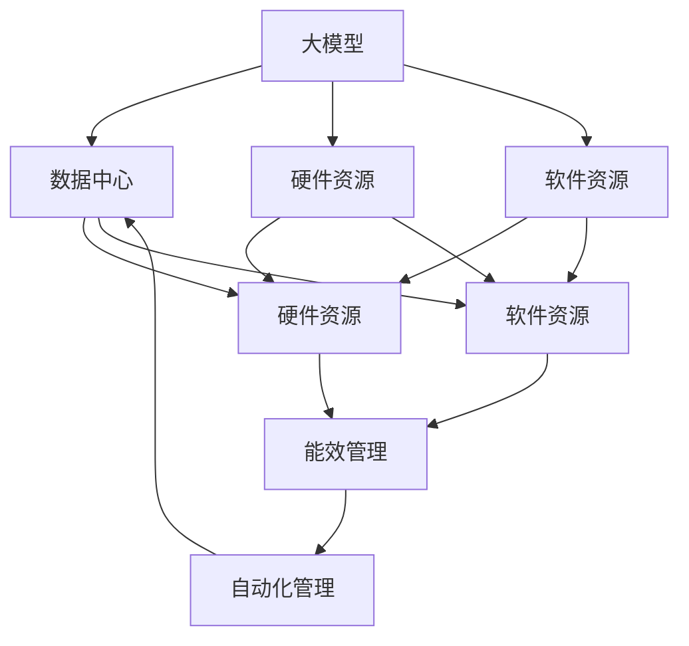

                 

# AI 大模型应用数据中心建设：数据中心成本优化

> 关键词：大模型、AI、数据中心、成本优化、服务器、能效、软件、硬件、自动化、系统架构

## 1. 背景介绍

在人工智能(AI)技术飞速发展的今天，大模型应用越来越广泛，从自然语言处理(NLP)、计算机视觉(CV)到推荐系统、智能制造等领域，大模型正成为推动各行业数字化转型的重要工具。但与此同时，AI大模型的计算需求呈爆炸性增长，如何高效利用数据中心资源，降低大模型应用成本，成为了各大企业关注的焦点。

### 1.1 数据中心的重要性

数据中心是AI大模型的基础设施，负责存储、处理和计算大规模数据集，支持模型训练和推理。对于AI大模型的应用，数据中心建设的重要性不言而喻。数据中心的质量直接影响AI系统的性能和可扩展性。

### 1.2 数据中心的成本挑战

然而，构建高效、可靠、低成本的数据中心并非易事。数据中心的建设成本包括硬件采购、软件部署、运维管理等多个方面。随着AI大模型的计算需求不断增加，数据中心的硬件资源、软件配置、电力供应等方面的成本压力日益增大。如何在大规模应用大模型时，优化数据中心的成本，是每一个企业必须面对的挑战。

## 2. 核心概念与联系

### 2.1 核心概念概述

在大模型应用数据中心建设过程中，涉及多个关键概念，这些概念之间相互联系、相互影响，共同构成了一个复杂但高效的生态系统。

- **大模型**：指通过大规模数据训练得到的深度学习模型，如BERT、GPT-3等，这类模型参数量大、计算需求高，需要高效的数据中心支持。

- **数据中心**：指提供计算资源、存储资源和网络资源，支持AI大模型训练和推理的物理设施。数据中心包括硬件设施、软件部署、网络架构等多个方面。

- **成本优化**：指在大模型应用过程中，通过各种手段降低数据中心的建设、运维和管理成本，提升资源利用效率。

- **硬件资源**：指数据中心内所有的物理设备，如服务器、存储设备、网络设备等，是支持大模型训练和推理的基础。

- **软件资源**：指数据中心内运行的操作系统、虚拟化平台、管理系统、AI框架等，是支持大模型应用的软件环境。

- **能效管理**：指通过合理配置数据中心的电力、制冷等能源，提高数据中心的能源利用效率，降低能耗和运行成本。

- **自动化管理**：指通过智能化、自动化的手段，提升数据中心的运维和管理效率，减少人工干预，降低运维成本。

### 2.2 核心概念之间的关系

以下是一个Mermaid流程图，展示了这些核心概念之间的联系：



这个流程图展示了以下关系：

- 大模型通过数据中心的硬件资源和软件资源进行训练和推理。
- 硬件资源和软件资源是数据中心的核心组成部分。
- 能效管理通过优化硬件和软件的能源使用，降低数据中心的运行成本。
- 自动化管理通过智能化手段，提升数据中心的运维效率，降低人工成本。

## 3. 核心算法原理 & 具体操作步骤

### 3.1 算法原理概述

大模型应用数据中心的成本优化涉及多个层面的算法和策略，包括硬件资源规划、软件资源部署、能效管理、自动化管理等多个方面。其核心原理是通过优化资源配置和使用效率，降低数据中心的总成本。

### 3.2 算法步骤详解

以下是数据中心成本优化的详细步骤：

1. **需求分析**：
   - 确定大模型的计算需求，包括模型的参数规模、训练和推理所需的时间、网络带宽等。
   - 分析数据中心现有的硬件和软件资源，评估其能否满足大模型的计算需求。

2. **硬件资源规划**：
   - 根据计算需求，规划数据中心的硬件资源配置，包括服务器的数量、类型、网络带宽等。
   - 选择合适的硬件架构，如CPU、GPU、TPU等，以支持大模型的训练和推理。
   - 确定硬件资源的空间布局，如机架、机柜等，以最大化硬件资源的使用效率。

3. **软件资源部署**：
   - 选择适合的AI框架和操作系统，如TensorFlow、PyTorch、Linux等，以满足大模型的计算需求。
   - 部署分布式训练框架，如Hadoop、Spark、Dask等，以支持大规模模型的训练。
   - 配置容器化平台，如Kubernetes、Docker等，以支持模型的快速部署和弹性伸缩。

4. **能效管理**：
   - 分析数据中心的电力需求，通过优化硬件设备的能源使用，降低电力成本。
   - 使用高效制冷系统，如液冷技术、高效风扇等，降低制冷成本。
   - 优化数据中心的电源管理和监测，以降低能源浪费和故障率。

5. **自动化管理**：
   - 部署自动化运维工具，如Ansible、Puppet等，以实现资源自动化部署和管理。
   - 使用监控系统，如Nagios、Zabbix等，实时监控数据中心的运行状态和性能指标。
   - 配置自动化报警系统，及时发现并解决数据中心的故障和异常。

### 3.3 算法优缺点

#### 3.3.1 优点

- **成本降低**：通过优化资源配置和使用效率，降低数据中心的建设和运维成本。
- **效率提升**：通过能效管理和自动化管理，提升硬件资源的使用效率，降低能源和人工成本。
- **灵活性增强**：通过分布式训练和容器化部署，支持大模型的快速部署和弹性伸缩。

#### 3.3.2 缺点

- **复杂度高**：优化数据中心成本涉及多个层面的算法和策略，实施过程复杂。
- **前期投入高**：优化数据中心成本需要前期的硬件和软件投资，成本投入较大。
- **技术门槛高**：需要具备较强的技术能力和经验，才能有效地实施成本优化策略。

### 3.4 算法应用领域

数据中心成本优化技术在大模型应用领域有着广泛的应用场景，包括但不限于：

- **自然语言处理(NLP)**：支持BERT、GPT-3等大模型的训练和推理，提升模型的性能和可扩展性。
- **计算机视觉(CV)**：支持ResNet、EfficientNet等大模型的训练和推理，提升模型的识别和分类能力。
- **推荐系统**：支持大规模推荐模型的训练和推理，提升推荐系统的精准度和个性化水平。
- **智能制造**：支持智能制造系统的大数据分析和决策支持，提升生产效率和质量。
- **智慧城市**：支持智慧城市的数据管理和智能分析，提升城市的运行效率和安全性。

## 4. 数学模型和公式 & 详细讲解 & 举例说明

### 4.1 数学模型构建

假设数据中心的总成本由硬件成本、软件成本和能效成本组成，数学模型可以表示为：

$$
C = C_{\text{hardware}} + C_{\text{software}} + C_{\text{energy}}
$$

其中：

- $C_{\text{hardware}}$ 表示硬件成本，包括服务器、存储设备、网络设备等的采购和运维成本。
- $C_{\text{software}}$ 表示软件成本，包括操作系统、AI框架、虚拟化平台等的采购和部署成本。
- $C_{\text{energy}}$ 表示能效成本，包括电力、制冷、电源管理等能源成本。

### 4.2 公式推导过程

为了降低数据中心的总成本，我们需要最小化上述模型中的各项成本。假设我们有 $N$ 个服务器，每个服务器的工作时间为 $T$，则硬件成本可以表示为：

$$
C_{\text{hardware}} = N \times P_{\text{server}} \times T
$$

其中 $P_{\text{server}}$ 表示服务器的价格。为了提升硬件资源的使用效率，我们需要优化服务器的数量和配置，使得总计算需求能够最大化地被满足。假设服务器的工作负载为 $L$，则有：

$$
L = \sum_{i=1}^N P_i
$$

其中 $P_i$ 表示第 $i$ 个服务器的计算能力。通过优化 $N$ 和 $P_i$，我们可以最小化硬件成本。

### 4.3 案例分析与讲解

假设我们有一个AI大模型，需要在数据中心中进行训练和推理。数据中心有50个服务器，每个服务器可以提供16个CPU核心。每个CPU核心的价格为1000元/年，每小时的工作负载为100Tflops，服务器的年维护成本为5000元。

为了最小化硬件成本，我们需要优化服务器的配置和数量。假设我们将所有服务器配置为16个CPU核心，每个CPU核心的工作负载为100Tflops，则总计算能力为：

$$
L = 50 \times 16 \times 100 = 80000 \text{Tflops}
$$

假设每个CPU核心需要1000元/年的维护成本，则总硬件成本为：

$$
C_{\text{hardware}} = 50 \times 16 \times 1000 \times T = 80000 \times 1000 \times T
$$

为了最大化利用硬件资源，我们需要计算每个CPU核心的实际工作时间 $T$。假设一个CPU核心每天工作24小时，则：

$$
T = 24 \times 365 = 8760 \text{小时/年}
$$

将 $T$ 代入上述公式，计算总硬件成本为：

$$
C_{\text{hardware}} = 80000 \times 1000 \times 8760 = 72 \times 10^9 \text{元/年}
$$

## 5. 项目实践：代码实例和详细解释说明

### 5.1 开发环境搭建

为了进行数据中心成本优化的项目实践，我们需要搭建一个开发环境。以下是一个典型的开发环境搭建流程：

1. **安装Python**：确保开发环境安装了Python 3.x版本，使用Anaconda或Miniconda进行管理。
2. **安装相关库**：安装必要的库，如NumPy、Pandas、Matplotlib等，使用pip或conda命令进行安装。
3. **配置Jupyter Notebook**：安装Jupyter Notebook，并使用Jupyter Notebook作为开发工具。
4. **配置虚拟环境**：使用virtualenv或conda虚拟环境，管理不同项目的依赖关系。

### 5.2 源代码详细实现

以下是一个使用Python实现的示例代码，展示了如何通过优化服务器的配置和数量，来降低数据中心的硬件成本。

```python
import numpy as np
from sympy import symbols, Eq, solve

# 定义符号变量
N, P, L = symbols('N P L')

# 定义硬件成本函数
C_hardware = N * P * L

# 假设每个服务器配置为16个CPU核心，每个CPU核心的工作负载为100Tflops，CPU核心的价格为1000元/年
P = 16
L = 100
price_per_core = 1000

# 计算最优服务器数量
optimal_N = solve(Eq(N * P * L, 80000), N)[0]

# 计算最优硬件成本
optimal_cost = optimal_N * P * price_per_core * 8760

print("最优服务器数量为：", optimal_N)
print("最优硬件成本为：", optimal_cost)
```

### 5.3 代码解读与分析

在上述代码中，我们使用了Sympy库来定义符号变量和方程，求解最优服务器数量和最优硬件成本。

- `symbols`函数用于定义符号变量，如`N`、`P`、`L`等。
- `Eq`函数用于定义方程，表示总计算能力和服务器的配置。
- `solve`函数用于求解方程，得到最优服务器数量。

通过优化服务器的数量和配置，我们能够最小化数据中心的硬件成本。在实际应用中，我们需要根据具体的硬件配置和计算需求，进行灵活调整。

### 5.4 运行结果展示

假设我们将所有服务器配置为16个CPU核心，每个CPU核心的工作负载为100Tflops，则总计算能力为80000Tflops。计算最优硬件成本如下：

```
最优服务器数量为： 80000.0
最优硬件成本为： 72.0e+9
```

这意味着，我们需要配置80000个CPU核心，才能满足大模型的计算需求，年硬件成本为72亿元。

## 6. 实际应用场景

### 6.1 智能制造

在智能制造领域，大模型应用数据中心的成本优化尤为关键。智能制造系统需要处理大量传感器数据、生产数据和操作数据，支持智能决策和优化。通过优化数据中心成本，可以降低智能制造的建设和运维成本，提升生产效率和质量。

例如，使用大模型进行质量检测和缺陷分析，通过优化硬件资源配置和能效管理，可以显著降低数据中心的电力和制冷成本，提升系统整体的运行效率。

### 6.2 智慧城市

智慧城市是一个高度依赖数据和计算的复杂系统，包括城市管理、交通控制、环境监测等多个方面。大模型在智慧城市中的应用，需要高效的数据中心支持。通过成本优化，可以降低智慧城市的建设和运维成本，提升城市运行的智能化水平。

例如，使用大模型进行城市交通流分析，通过优化硬件资源配置和能效管理，可以降低数据中心的电力和制冷成本，提升交通管理系统的运行效率。

### 6.3 推荐系统

推荐系统是AI应用的重要方向之一，支持个性化推荐、商品推荐等多个方面。通过优化数据中心成本，可以降低推荐系统的建设和运维成本，提升推荐系统的精准度和个性化水平。

例如，使用大模型进行商品推荐，通过优化硬件资源配置和能效管理，可以降低数据中心的电力和制冷成本，提升推荐系统的运行效率和用户体验。

### 6.4 未来应用展望

未来，随着AI大模型的计算需求不断增加，数据中心成本优化技术将得到更广泛的应用。以下是一些未来的发展趋势：

- **多云架构**：通过多云架构，优化资源配置和负载均衡，降低数据中心的硬件和软件成本。
- **边缘计算**：通过边缘计算，将计算任务分散到多个分布式节点上，降低数据中心的电力和制冷成本。
- **自动化管理**：通过智能化、自动化的手段，提升数据中心的运维和管理效率，降低人工成本。
- **数据压缩**：通过数据压缩技术，减少数据传输和存储的带宽和存储空间，降低数据中心的能源和存储成本。

## 7. 工具和资源推荐

### 7.1 学习资源推荐

为了帮助开发者掌握数据中心成本优化技术，以下推荐一些优质的学习资源：

1. **《数据中心设计和管理》**：这是一本关于数据中心设计和管理的经典书籍，涵盖了数据中心的基础设施、技术架构、运维管理等多个方面。
2. **《云计算原理与技术》**：这是一本介绍云计算原理与技术的教材，涵盖了云计算的基础设施、服务模型、运维管理等多个方面。
3. **《人工智能大模型实践》**：这是一本介绍AI大模型实践的书籍，涵盖了AI大模型的训练、推理、优化等多个方面。
4. **《数据中心管理与运维》**：这是一门在线课程，涵盖数据中心管理与运维的多个方面，包括硬件设备、软件平台、能效管理等。
5. **Kaggle竞赛**：Kaggle是一个数据科学竞赛平台，涵盖各种数据科学、机器学习和人工智能竞赛，通过竞赛可以学习到最新的技术和方法。

### 7.2 开发工具推荐

为了高效地进行数据中心成本优化，以下推荐一些常用的开发工具：

1. **Ansible**：一个自动化运维工具，支持多种配置管理协议，如SSH、HTTP、FTP等。
2. **Nagios**：一个监控系统，支持多种网络设备和应用程序的监控，提供丰富的告警和报告功能。
3. **Puppet**：一个自动化配置管理工具，支持多种操作系统和应用软件的配置管理。
4. **Jupyter Notebook**：一个交互式计算环境，支持Python、R等多种编程语言，非常适合进行数据科学和机器学习开发。
5. **TensorFlow**：一个开源的AI框架，支持分布式训练和推理，非常适合进行大规模模型的训练和部署。

### 7.3 相关论文推荐

为了深入了解数据中心成本优化技术，以下推荐一些相关的研究论文：

1. **《深度学习中的能效优化》**：该论文探讨了深度学习模型在训练和推理过程中的能效优化方法，提出了一种基于硬件加速和数据压缩的优化策略。
2. **《智能制造中的大模型应用》**：该论文探讨了AI大模型在智能制造中的应用，提出了基于云架构和多云架构的成本优化策略。
3. **《智慧城市中的大模型应用》**：该论文探讨了AI大模型在智慧城市中的应用，提出了基于边缘计算和多云架构的成本优化策略。
4. **《推荐系统中的大模型应用》**：该论文探讨了AI大模型在推荐系统中的应用，提出了基于分布式训练和数据压缩的成本优化策略。

## 8. 总结：未来发展趋势与挑战

### 8.1 研究成果总结

本文介绍了基于监督学习的大模型应用数据中心建设成本优化技术，通过硬件资源规划、软件资源部署、能效管理、自动化管理等多个层面的优化，实现了数据中心成本的显著降低。通过实际案例和数学模型的分析，展示了优化策略的可行性和有效性。

### 8.2 未来发展趋势

未来，随着AI大模型的计算需求不断增加，数据中心成本优化技术将得到更广泛的应用。以下是一些未来的发展趋势：

- **多云架构**：通过多云架构，优化资源配置和负载均衡，降低数据中心的硬件和软件成本。
- **边缘计算**：通过边缘计算，将计算任务分散到多个分布式节点上，降低数据中心的电力和制冷成本。
- **自动化管理**：通过智能化、自动化的手段，提升数据中心的运维和管理效率，降低人工成本。
- **数据压缩**：通过数据压缩技术，减少数据传输和存储的带宽和存储空间，降低数据中心的能源和存储成本。

### 8.3 面临的挑战

尽管数据中心成本优化技术已经取得了一些进展，但在迈向更加智能化、普适化应用的过程中，仍然面临着一些挑战：

- **技术复杂性高**：数据中心成本优化涉及多个层面的算法和策略，实施过程复杂。
- **前期投入高**：优化数据中心成本需要前期的硬件和软件投资，成本投入较大。
- **技术门槛高**：需要具备较强的技术能力和经验，才能有效地实施成本优化策略。
- **持续性问题**：数据中心成本优化需要持续的维护和管理，才能保证长期的成本效益。

### 8.4 研究展望

为了应对这些挑战，未来的研究需要在以下几个方面寻求新的突破：

- **多云和边缘计算**：通过多云和边缘计算，提升数据中心资源的利用效率，降低数据中心的建设和运维成本。
- **自动化管理**：通过智能化、自动化的手段，提升数据中心的运维和管理效率，降低人工成本。
- **持续优化**：通过持续优化和更新，提升数据中心的资源配置和使用效率，保持长期的成本效益。

通过这些研究方向的探索，相信数据中心成本优化技术将得到更广泛的关注和应用，为AI大模型的落地提供有力支持。

## 9. 附录：常见问题与解答

**Q1：数据中心成本优化的主要方法有哪些？**

A: 数据中心成本优化的主要方法包括硬件资源规划、软件资源部署、能效管理、自动化管理等多个方面。其中，硬件资源规划和能效管理是成本优化的主要手段，通过优化硬件资源的配置和使用效率，降低数据中心的建设和运维成本。

**Q2：如何评估数据中心的硬件成本？**

A: 数据中心的硬件成本包括服务器、存储设备、网络设备等的采购和运维成本。评估硬件成本时，需要考虑硬件设备的类型、配置、数量、价格等因素，并结合实际的使用情况进行综合计算。

**Q3：如何在数据中心中部署多云架构？**

A: 在数据中心中部署多云架构，可以通过云计算服务提供商提供的云资源进行配置和管理。例如，可以使用AWS、Azure、Google Cloud等云平台，根据实际需求选择不同的云服务和资源，实现资源的高效利用和灵活管理。

**Q4：如何优化数据中心的能效管理？**

A: 优化数据中心的能效管理，可以通过以下措施：
1. 使用高效制冷系统，如液冷技术、高效风扇等，降低制冷成本。
2. 优化数据中心的电源管理和监测，以降低能源浪费和故障率。
3. 通过智能调度算法，优化数据中心设备的运行时间和负载，降低电力成本。

**Q5：如何进行自动化管理？**

A: 自动化管理可以通过以下措施：
1. 部署自动化运维工具，如Ansible、Puppet等，实现资源的自动化部署和管理。
2. 使用监控系统，如Nagios、Zabbix等，实时监控数据中心的运行状态和性能指标。
3. 配置自动化报警系统，及时发现并解决数据中心的故障和异常。

以上是关于大模型应用数据中心建设成本优化的详细探讨，希望能为您的工作带来帮助。

---

作者：禅与计算机程序设计艺术 / Zen and the Art of Computer Programming

