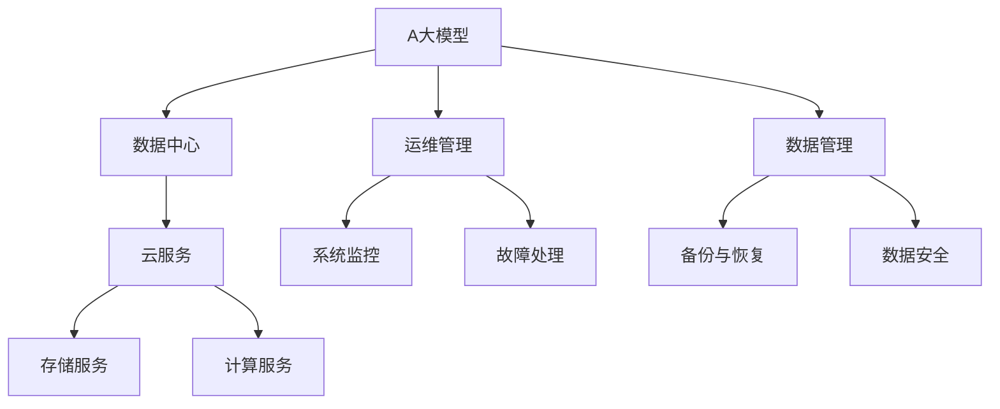

                 

# AI 大模型应用数据中心建设：数据中心运维与管理

> 关键词：AI大模型,数据中心运维,数据管理,自动化,云服务,高可用性

## 1. 背景介绍

在人工智能(AI)技术日益繁荣的今天，大模型（Large Model）的应用成为驱动AI创新发展的重要引擎。这些大模型通过在大规模的语料库上进行预训练，赋予了AI系统强大的语言理解、图像识别和自然语言处理能力。例如，基于Transformer架构的BERT模型、GPT-3模型、OpenAI的DALL·E模型等，已经成为深度学习领域的研究热点。然而，这些大模型的应用并非一蹴而就，需要依托于一个高效、稳定、可扩展的数据中心基础设施。本文将详细探讨AI大模型在数据中心建设中的应用，包括数据中心的运维管理、数据管理和云服务等方面。

### 1.1 数据中心的重要性

数据中心是大模型应用的基石，其重要性不言而喻。数据中心不仅需要提供高性能的计算和存储资源，还必须保证系统的高可用性、可扩展性和安全性。数据中心的运维管理直接影响到AI系统的运行效率和用户满意度。因此，构建高效、可靠的数据中心体系，是AI大模型应用成功的关键。

### 1.2 当前数据中心的挑战

当前，数据中心的建设和运维面临着诸多挑战：
- **资源管理**：AI大模型通常需要庞大的计算和存储资源，如何高效管理这些资源成为一大难题。
- **能耗问题**：大规模计算任务带来的高能耗对环境影响巨大，如何降低能耗和提高能效是数据中心亟待解决的问题。
- **系统稳定性**：AI模型的训练和推理过程对系统稳定性要求极高，数据中心如何保证系统的高可用性是核心考量。
- **网络带宽**：AI模型通常需要高吞吐量的网络带宽，如何在网络架构上实现高效传输成为设计难点。
- **安全性**：数据中心存储大量敏感数据，如何保障数据安全和隐私保护是重要挑战。

为了应对这些挑战，本文将深入探讨AI大模型在数据中心建设中的应用，包括数据中心的运维管理、数据管理和云服务等方面。

## 2. 核心概念与联系

### 2.1 核心概念概述

在探讨AI大模型在数据中心的应用之前，我们先明确几个核心概念：

- **AI大模型**：指通过大规模预训练和微调获得强大语言理解、图像识别等能力的深度学习模型，如BERT、GPT等。
- **数据中心**：指提供计算、存储、网络等基础设施的物理设施，是AI大模型应用的硬件支撑。
- **运维管理**：指数据中心的日常维护和管理，确保AI大模型在稳定、高效的环境中运行。
- **数据管理**：指数据中心的存储、备份、灾难恢复等数据管理技术。
- **云服务**：指通过云计算技术提供的高性能、可扩展的计算和存储服务。

这些概念之间存在密切联系，通过合理的运维管理、数据管理和云服务支持，AI大模型才能在数据中心中高效运行。

### 2.2 概念间的关系

这些核心概念之间的关系可以归纳为下图：



这个图形展示了AI大模型与数据中心的相互关系，以及运维管理、数据管理和云服务在此过程中的作用。

## 3. 核心算法原理 & 具体操作步骤

### 3.1 算法原理概述

AI大模型的应用需要依赖于数据中心提供的计算、存储、网络等基础设施。为了确保AI大模型的高效运行，数据中心的运维管理、数据管理和云服务需要协同工作。

AI大模型的运维管理主要涉及系统监控、故障处理和性能调优等方面。数据管理则包括数据存储、备份和恢复、数据安全和隐私保护等。云服务则通过高效、可扩展的计算和存储资源，支持AI大模型的训练和推理任务。

### 3.2 算法步骤详解

以下是AI大模型在数据中心建设中，运维管理、数据管理和云服务的详细步骤：

#### 3.2.1 运维管理

**系统监控**：通过自动化工具监控AI大模型的运行状态，及时发现系统异常和性能瓶颈。常用的监控工具包括Nagios、Prometheus、Grafana等。

**故障处理**：当系统出现故障时，通过自动化脚本进行快速定位和修复。例如，使用Jenkins自动化脚本进行系统配置调整、重新启动服务等。

**性能调优**：通过监控工具分析系统性能，优化计算资源分配和网络带宽配置，提高AI大模型的运行效率。

#### 3.2.2 数据管理

**数据存储**：选择合适的存储介质和架构，如SSD、NVMe等高性能存储设备，以及分布式文件系统HDFS、Ceph等，支持AI大模型的海量数据存储需求。

**备份与恢复**：定期进行数据备份，使用分布式数据复制和异地容灾技术，确保数据安全和灾难恢复能力。

**数据安全**：使用加密技术和访问控制机制，保护数据中心的敏感数据。例如，使用AES加密算法对存储数据进行加密，使用RBAC（基于角色的访问控制）进行权限管理。

#### 3.2.3 云服务

**存储服务**：通过云存储服务如AWS S3、Google Cloud Storage等，提供高性能、可扩展的数据存储方案。

**计算服务**：使用云弹性计算服务如AWS EC2、Google Compute Engine等，根据AI大模型的需求动态调整计算资源，支持大规模训练和推理任务。

**网络服务**：使用云网络服务如AWS VPC、Google Cloud VPC等，构建高性能、高可用的网络架构，确保AI大模型的高吞吐量需求。

### 3.3 算法优缺点

#### 3.3.1 优点

**高效性**：通过云服务的高效资源管理和弹性扩展，AI大模型能够快速响应高并发需求。

**可扩展性**：云服务的按需计费模式，可以根据AI大模型的资源需求动态调整计算和存储资源，满足不同规模的任务需求。

**安全性**：云服务提供商通常具备强大的安全防护措施，能够保障AI大模型数据的安全性和隐私保护。

#### 3.3.2 缺点

**成本问题**：云服务的按需计费模式可能导致高昂的运营成本，特别是在大规模训练和推理任务中。

**性能瓶颈**：云服务的性能和延迟可能受到网络带宽和数据中心地理位置等因素的影响。

**隐私问题**：云服务的数据传输和存储过程中可能存在隐私泄露风险。

### 3.4 算法应用领域

AI大模型在数据中心中的应用领域非常广泛，包括但不限于以下方面：

- **自然语言处理**：如BERT、GPT等大模型，用于文本分类、情感分析、问答系统等任务。
- **图像识别**：如DALL·E、DETR等大模型，用于图像生成、目标检测、图像标注等任务。
- **语音识别**：如Wav2Vec、Wav2Vec2等大模型，用于语音转文本、语音指令识别等任务。
- **推荐系统**：如GraphSAGE、Graph Neural Network等大模型，用于个性化推荐、社交网络分析等任务。

## 4. 数学模型和公式 & 详细讲解 & 举例说明

### 4.1 数学模型构建

AI大模型的应用涉及到数据中心的海量数据存储、高效计算和网络传输，因此需要一个高效的数学模型来描述这些过程。这里我们使用Markov决策过程（MDP）模型来描述AI大模型的应用场景。

MDP模型包括状态（State）、动作（Action）、奖励（Reward）和转移概率（Transition Probability）等要素。在AI大模型的应用中，状态表示数据中心的当前状态，动作表示对数据中心的操作，奖励表示操作的效益，转移概率表示状态之间的转换概率。

### 4.2 公式推导过程

以AI大模型的训练为例，MDP模型可以描述如下：

**状态（State）**：当前AI大模型的训练状态，包括计算资源使用率、网络带宽、存储资源使用率等。

**动作（Action）**：对数据中心的操作，如增加计算资源、减少网络带宽、备份数据等。

**奖励（Reward）**：操作的效益，如提高AI大模型训练速度、减少故障率等。

**转移概率（Transition Probability）**：操作后数据中心状态的变化概率，如增加计算资源后系统负载增加的概率。

通过构建MDP模型，我们可以使用动态规划等算法优化数据中心的运维管理，确保AI大模型在高效、稳定的环境中运行。

### 4.3 案例分析与讲解

以AWS S3存储服务为例，分析其如何支持AI大模型的数据管理需求。

AWS S3提供高度可扩展、高可用性的数据存储服务，支持AI大模型的海量数据存储需求。通过分布式文件系统和数据复制技术，AWS S3能够提供容错和高可用性保障，支持AI大模型的数据备份和灾难恢复。

AWS S3还支持多种安全机制，如S3Bucket策略、S3Access Control Lists（ACLs）等，确保AI大模型数据的隐私和安全。

## 5. 项目实践：代码实例和详细解释说明

### 5.1 开发环境搭建

为了实现AI大模型在数据中心的运维管理、数据管理和云服务，我们需要一个开发环境来进行测试和调试。以下是开发环境的搭建步骤：

1. **安装Python和相关依赖**：安装Python 3.x版本，并使用pip安装相关依赖，如Nagios、Prometheus、Grafana、Jenkins等。

2. **配置监控系统**：配置Nagios和Prometheus等监控系统，监控AI大模型的运行状态和系统性能。

3. **配置云服务**：配置AWS S3、Google Cloud Storage等云服务，进行数据存储和备份。

### 5.2 源代码详细实现

以下是使用Python和AWS SDK实现AI大模型数据管理的示例代码：

```python
import boto3
import os

# 配置AWS S3客户端
s3 = boto3.client('s3', region_name='us-east-1', aws_access_key_id='access_key',
                  aws_secret_access_key='secret_key')

# 创建存储桶
s3.create_bucket(Bucket='my-bucket')

# 上传文件到存储桶
with open('data.txt', 'rb') as f:
    s3.upload_fileobj(f, 'my-bucket', 'data.txt')

# 查询存储桶对象列表
objects = s3.list_objects(Bucket='my-bucket')
for obj in objects['Contents']:
    print(obj['Key'])
```

### 5.3 代码解读与分析

上述代码展示了如何使用AWS SDK在Python中实现数据存储和查询。通过配置AWS S3客户端，创建存储桶，上传文件，查询存储桶对象列表，我们可以实现对AI大模型数据的存储和备份管理。

### 5.4 运行结果展示

运行上述代码后，我们可以在AWS控制台中查看存储桶和文件对象列表，确认数据是否成功存储和备份。

## 6. 实际应用场景

### 6.1 智能客服系统

智能客服系统是AI大模型应用的重要场景之一。通过微调BERT、GPT等大模型，智能客服系统可以自动理解用户输入，提供个性化的回复和服务。例如，IBM的Watson客服系统，通过训练大模型，实现了实时问答和客户服务。

### 6.2 金融舆情监测

金融舆情监测是AI大模型在金融领域的应用之一。通过收集和分析社交媒体、新闻等海量文本数据，AI大模型可以实时监测市场舆情，提供风险预警和市场分析服务。例如，摩根大通的AI舆情监测系统，通过训练大模型，实现了对金融舆情的实时分析和预测。

### 6.3 个性化推荐系统

个性化推荐系统是AI大模型在电商领域的重要应用。通过训练Graph Neural Network等大模型，个性化推荐系统可以基于用户行为和兴趣，提供个性化的商品推荐。例如，亚马逊的推荐系统，通过训练大模型，实现了精准的商品推荐。

### 6.4 未来应用展望

随着AI大模型技术的不断进步，未来在数据中心建设中的应用将更加广泛和深入。

**5G技术**：未来AI大模型将更加依赖于5G技术，提供更高效、低延迟的网络传输。

**边缘计算**：边缘计算将数据处理从集中式数据中心转移到边缘设备，实现数据的高效处理和实时响应。

**量子计算**：量子计算将进一步提升AI大模型的计算能力，实现更高效的模型训练和推理。

**异构计算**：异构计算将不同计算硬件（如GPU、FPGA、ASIC等）集成，提升AI大模型的处理能力和能效比。

## 7. 工具和资源推荐

### 7.1 学习资源推荐

为了深入了解AI大模型在数据中心的建设和管理，以下是一些学习资源推荐：

1. **《深度学习》教材**：由Ian Goodfellow、Yoshua Bengio、Aaron Courville合著的《深度学习》教材，系统介绍了深度学习的基本理论和应用。

2. **《数据中心运维管理》课程**：由清华大学开设的在线课程，涵盖数据中心的运维管理、故障处理和性能调优等内容。

3. **《云服务技术》课程**：由阿里云、腾讯云等公司开设的在线课程，介绍云服务的原理和应用。

4. **《AI大模型应用》书籍**：介绍AI大模型的应用场景和数据中心建设，包括自然语言处理、图像识别、语音识别等领域。

### 7.2 开发工具推荐

以下是一些常用的开发工具，帮助实现AI大模型在数据中心的应用：

1. **Nagios**：系统监控工具，可以监控AI大模型的运行状态和系统性能。

2. **Prometheus**：开源的监控系统，可以实时采集数据中心的各项指标，并进行数据分析和可视化。

3. **Grafana**：开源的仪表盘工具，可以与Prometheus等监控系统结合，展示系统性能和运行状态。

4. **Jenkins**：自动化脚本工具，可以自动化执行系统配置调整、备份等任务。

5. **AWS SDK**：Python SDK，支持AWS S3、EC2等云服务，实现数据存储和计算资源管理。

### 7.3 相关论文推荐

以下是一些关于AI大模型在数据中心应用的论文推荐：

1. **《AI大模型的应用》论文**：介绍AI大模型在金融、医疗、电商等领域的应用，探讨数据中心建设和管理。

2. **《数据中心运维管理》论文**：研究数据中心的运维管理技术，包括系统监控、故障处理和性能调优等内容。

3. **《云服务技术》论文**：介绍云计算技术的原理和应用，支持AI大模型的计算和存储资源管理。

## 8. 总结：未来发展趋势与挑战

### 8.1 研究成果总结

本文详细介绍了AI大模型在数据中心建设中的应用，包括运维管理、数据管理和云服务等方面。通过理论分析和实践案例，展示了AI大模型在实际应用中的高效性和可扩展性。

### 8.2 未来发展趋势

未来，AI大模型在数据中心中的应用将更加广泛和深入。

**高效性**：5G技术和边缘计算将进一步提升AI大模型的数据传输效率和实时响应能力。

**可扩展性**：云服务将提供更灵活、更高效、更可扩展的计算和存储资源，支持AI大模型的高并发需求。

**安全性**：量子计算和异构计算将提升AI大模型的处理能力和安全性，保障数据隐私和安全。

### 8.3 面临的挑战

尽管AI大模型在数据中心中的应用前景广阔，但也面临诸多挑战：

**成本问题**：大规模计算和存储资源的高成本将对数据中心运营带来压力。

**性能瓶颈**：数据中心的网络带宽和延迟可能限制AI大模型的性能发挥。

**安全性**：数据中心存储和传输大量敏感数据，必须确保数据安全和隐私保护。

### 8.4 研究展望

未来，AI大模型在数据中心中的应用需要不断探索和创新：

**成本优化**：探索更高效的计算和存储资源管理方法，降低AI大模型应用成本。

**性能提升**：优化网络架构和系统设计，提升AI大模型的处理能力和实时响应能力。

**安全保障**：引入量子计算和异构计算技术，提升AI大模型的安全性和隐私保护能力。

## 9. 附录：常见问题与解答

### Q1: 如何确保AI大模型在数据中心中的高效运行？

A: 通过系统监控和故障处理，及时发现和修复系统异常，优化性能调优策略，确保AI大模型在高效、稳定的环境中运行。

### Q2: 数据中心在存储和备份方面有哪些技术手段？

A: 使用分布式文件系统和数据复制技术，支持大规模数据存储和备份，确保数据安全和灾难恢复能力。

### Q3: 云服务有哪些优势和劣势？

A: 云服务能够提供高性能、可扩展的计算和存储资源，但高昂的按需计费模式可能导致高运营成本。

### Q4: 如何保证数据中心的安全性？

A: 使用加密技术和访问控制机制，保护数据中心的敏感数据，确保数据隐私和安全。

### Q5: 未来AI大模型在数据中心中的应用有哪些趋势？

A: 5G技术、边缘计算、量子计算和异构计算将提升AI大模型的处理能力和安全性，支持更广泛的应用场景。

---

作者：禅与计算机程序设计艺术 / Zen and the Art of Computer Programming

