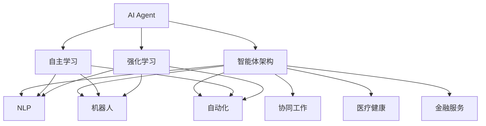
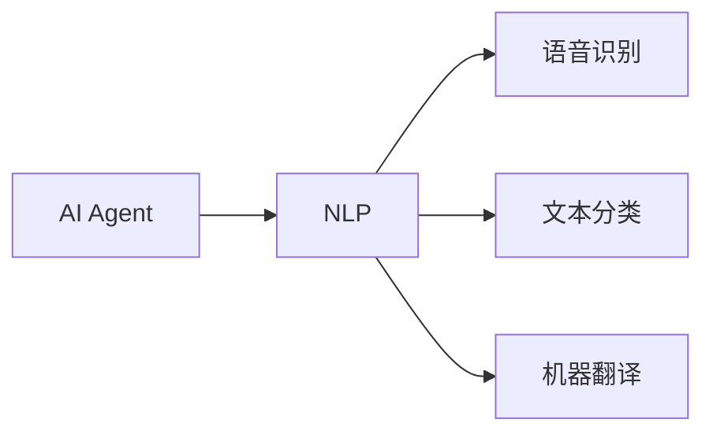
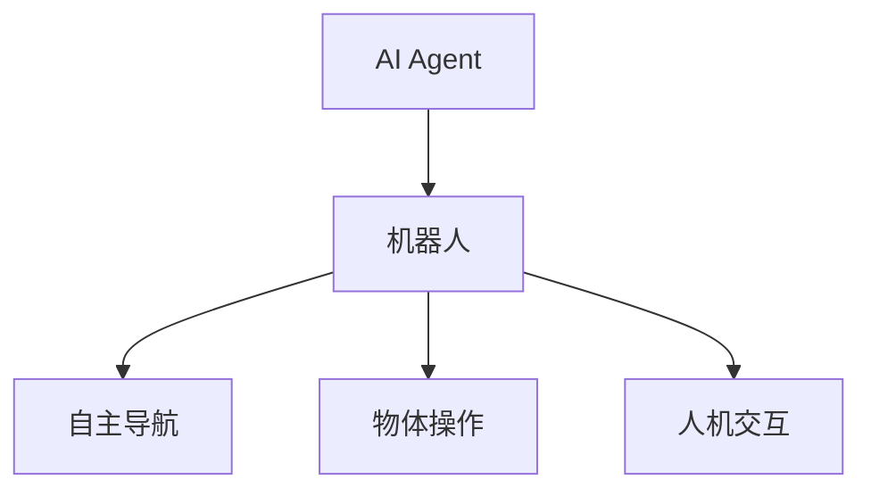
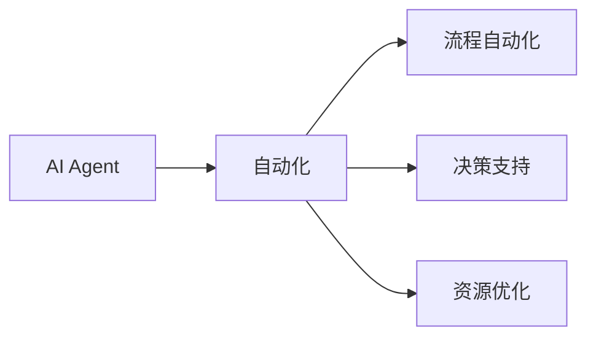
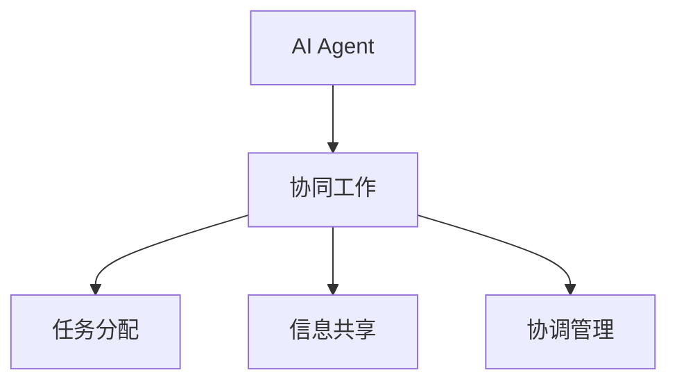
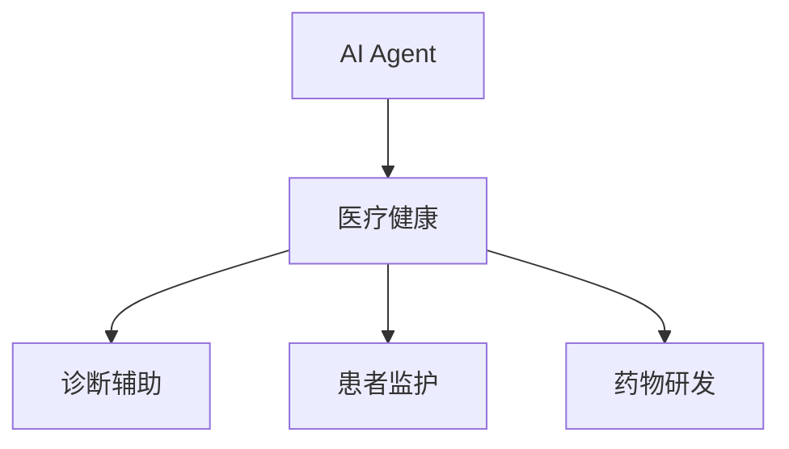
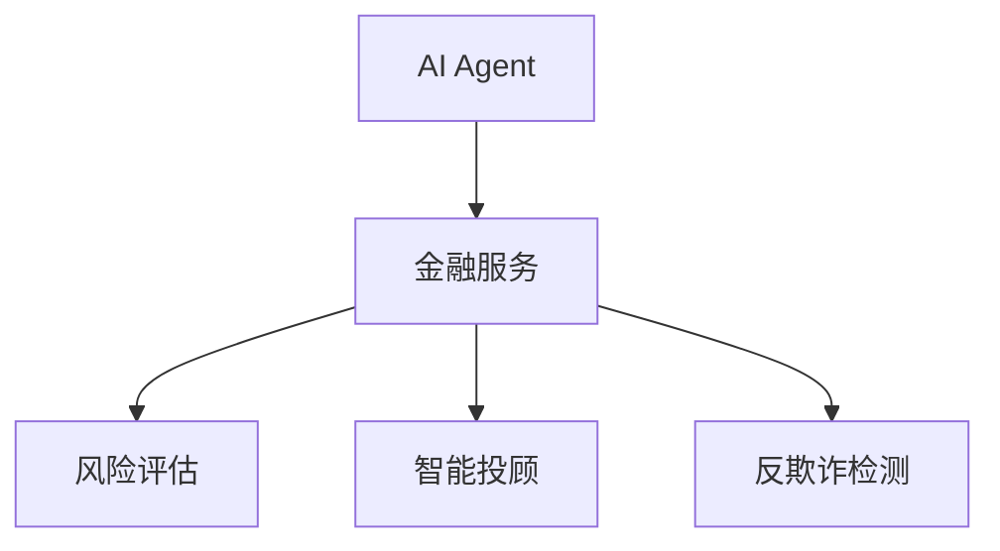
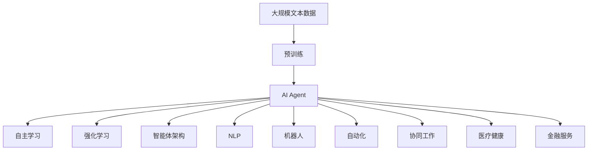

                 

# AI人工智能 Agent：真实世界的智能体应用案例

> 关键词：AI Agent, 智能体, 真实世界, 自然语言处理, 机器人, 自动化, 强化学习, 协同工作, 医疗健康, 金融服务

## 1. 背景介绍

### 1.1 问题由来
在过去的十年中，人工智能(AI)技术取得了长足的进展，尤其在自然语言处理(NLP)、机器视觉、机器人技术等领域。这些技术的发展，使得AI能够更加智能地与人类交互，并执行复杂的任务。然而，如何将这些智能技术与真实世界的业务场景相结合，发挥其最大效用，仍然是一个重要的挑战。

AI Agent，即人工智能智能体，是指能够自主决策、执行任务并适应环境的AI系统。智能体能够在各种复杂场景下提供解决方案，其应用范围广泛，包括自动驾驶、医疗诊断、金融分析、智能客服、供应链管理等领域。

### 1.2 问题核心关键点
AI Agent的核心关键点包括：
- 自主性：能够在无外部干预的情况下，自主做出决策并执行任务。
- 适应性：能够适应不断变化的环境和任务要求，进行学习和调整。
- 协同性：能够在多智能体系统中进行合作和协调，实现共同目标。
- 可靠性：能够在长时间、高强度工作下稳定运行，保证任务的可靠完成。

AI Agent的成功应用，能够大大提升工作效率，降低成本，改善用户体验，甚至在医疗、金融等关键领域挽救生命、挽救企业。

### 1.3 问题研究意义
研究AI Agent的应用案例，对于推动AI技术的实际落地具有重要意义：
- 提供可借鉴的实践经验。了解AI Agent在不同领域的成功应用，能够为其他企业或机构提供参考。
- 加速AI技术的普及。通过具体的案例展示，可以让更多人认识到AI技术的重要性和应用潜力。
- 推动AI技术与业务融合。帮助企业和组织将AI Agent技术与实际业务场景相结合，提升整体竞争力。
- 促进技术创新。通过学习和分析不同AI Agent的应用，可以激发新的技术思路和创新灵感。

## 2. 核心概念与联系

### 2.1 核心概念概述

为更好地理解AI Agent的应用案例，本节将介绍几个密切相关的核心概念：

- **AI Agent**：指能够自主决策、执行任务并适应环境的AI系统。
- **智能体架构**：指智能体的核心组成部分，包括感知、决策、执行和反馈等模块。
- **自主学习**：指智能体通过环境反馈进行自我调整和优化的过程。
- **强化学习(Reinforcement Learning, RL)**：指智能体通过与环境的交互，不断优化其决策策略，以获得最大奖励。
- **自然语言处理(Natural Language Processing, NLP)**：指智能体理解和处理自然语言的技术，包括语音识别、文本分类、机器翻译等。
- **机器人(Robotics)**：指能够执行物理操作的智能体，包括工业机器人、服务机器人等。
- **自动化(Automation)**：指通过智能体技术实现业务流程的自动化处理。
- **协同工作(Collaborative Work)**：指智能体在多智能体系统中进行合作和协调，共同完成任务。
- **医疗健康(Healthcare)**：指智能体在医疗领域的应用，如辅助诊断、患者监护等。
- **金融服务(Financial Services)**：指智能体在金融领域的应用，如风险评估、智能投顾等。

这些核心概念之间的逻辑关系可以通过以下Mermaid流程图来展示：



这个流程图展示了大语言模型的核心概念及其之间的关系：

1. AI Agent作为核心，包括了智能体架构、自主学习和强化学习等关键组件。
2. 智能体架构下，NLP、机器人、自动化、协同工作、医疗健康和金融服务等应用场景，各司其职，相互支持。
3. 自主学习和强化学习是智能体的核心能力，使得智能体能够适应环境并不断优化。

### 2.2 概念间的关系

这些核心概念之间存在着紧密的联系，形成了AI Agent的完整生态系统。下面我们通过几个Mermaid流程图来展示这些概念之间的关系。

#### 2.2.1 AI Agent与自然语言处理的关系



这个流程图展示了AI Agent与NLP的关系。AI Agent可以通过NLP技术处理自然语言，实现语音识别、文本分类和机器翻译等功能。

#### 2.2.2 AI Agent与机器人的关系



这个流程图展示了AI Agent与机器人的关系。AI Agent可以通过机器人技术实现自主导航、物体操作和人机交互等功能。

#### 2.2.3 AI Agent与自动化的关系



这个流程图展示了AI Agent与自动化的关系。AI Agent可以通过自动化技术实现流程自动化、决策支持和资源优化等功能。

#### 2.2.4 AI Agent与协同工作的关系



这个流程图展示了AI Agent与协同工作的关系。AI Agent可以通过协同工作技术实现任务分配、信息共享和协调管理等功能。

#### 2.2.5 AI Agent在医疗健康领域的应用



这个流程图展示了AI Agent在医疗健康领域的应用。AI Agent可以通过诊断辅助、患者监护和药物研发等功能，提升医疗服务质量。

#### 2.2.6 AI Agent在金融服务领域的应用



这个流程图展示了AI Agent在金融服务领域的应用。AI Agent可以通过风险评估、智能投顾和反欺诈检测等功能，提升金融服务的效率和安全性。

### 2.3 核心概念的整体架构

最后，我们用一个综合的流程图来展示这些核心概念在大语言模型微调过程中的整体架构：



这个综合流程图展示了从预训练到AI Agent的完整过程。AI Agent首先在大规模文本数据上进行预训练，然后通过自主学习和强化学习，适应不同的应用场景，并集成NLP、机器人、自动化、协同工作、医疗健康和金融服务等组件，最终实现全方位的智能解决方案。 通过这些流程图，我们可以更清晰地理解AI Agent的工作原理和优化方向。

## 3. 核心算法原理 & 具体操作步骤
### 3.1 算法原理概述

AI Agent的核心算法原理主要包括自主学习和强化学习，以下是详细解释：

**自主学习**：指AI Agent通过与环境交互，不断优化自身的决策和行为。常见的自主学习方法包括监督学习、无监督学习和半监督学习等。

**强化学习**：指AI Agent通过与环境的交互，不断优化其决策策略，以获得最大奖励。常见的强化学习方法包括Q-learning、SARSA、Deep Q-Learning等。

### 3.2 算法步骤详解

AI Agent的核心算法步骤如下：

**Step 1: 数据收集与预处理**
- 收集AI Agent所处环境的数据，如语音、文本、图像等。
- 对数据进行预处理，包括清洗、归一化、特征提取等，以便于后续处理。

**Step 2: 模型构建**
- 选择合适的模型架构，如神经网络、深度学习模型等。
- 定义模型的输入、输出和损失函数，选择合适的优化器。
- 在模型中集成自主学习、强化学习等算法。

**Step 3: 训练与优化**
- 使用收集到的数据对模型进行训练，优化模型参数。
- 在训练过程中，根据环境反馈进行自主学习和强化学习，不断调整模型策略。
- 使用正则化技术，如L2正则、Dropout等，避免过拟合。

**Step 4: 部署与应用**
- 将训练好的模型部署到实际应用环境中。
- 对AI Agent进行监控和维护，确保其在实际环境中的稳定性和可靠性。
- 根据实际应用需求，不断优化AI Agent的功能和性能。

### 3.3 算法优缺点

**优点**：
- 自主学习和强化学习算法能够使AI Agent在不断变化的环境中，自主适应并优化决策策略。
- 通过深度学习和机器学习算法，AI Agent能够处理大规模、复杂的数据，实现高效的自动化处理。
- 多智能体协同工作，能够提升整体系统的稳定性和可靠性。

**缺点**：
- 自主学习算法需要大量的数据和计算资源，训练过程较为耗时。
- 强化学习算法在复杂环境中，可能存在局部最优解的问题。
- 多智能体协同工作，需要合理的任务分配和协调机制，避免冲突和资源浪费。

### 3.4 算法应用领域

AI Agent的应用领域非常广泛，以下列举几个主要应用场景：

- **自动驾驶**：通过自主学习和强化学习，AI Agent能够在复杂交通环境中自主导航和决策。
- **医疗诊断**：通过分析患者的医学影像和病历数据，AI Agent能够提供诊断建议和治疗方案。
- **智能客服**：通过自然语言处理和对话系统，AI Agent能够与用户进行自然对话，解决用户问题。
- **供应链管理**：通过自动化和协同工作，AI Agent能够优化物流、库存和生产计划。
- **金融分析**：通过数据分析和决策支持，AI Agent能够进行风险评估和智能投顾。
- **智能家居**：通过控制和协调多个智能设备，AI Agent能够实现家庭自动化和智能化。

## 4. 数学模型和公式 & 详细讲解 & 举例说明
### 4.1 数学模型构建

AI Agent的数学模型构建通常涉及以下几种算法：

**监督学习**：指利用标注数据训练模型，使其能够对新数据进行分类或回归。

**无监督学习**：指在没有标注数据的情况下，通过数据本身的内在结构进行学习。

**半监督学习**：指在有少量标注数据和大量无标注数据的情况下，通过半监督算法进行学习。

**强化学习**：指通过与环境交互，不断优化决策策略，以获得最大奖励。

**Q-Learning**：指使用Q函数进行强化学习，通过迭代更新Q值，优化决策策略。

**SARSA**：指使用SARSA算法进行强化学习，通过样本回放和状态转移，优化决策策略。

**Deep Q-Learning**：指使用深度神经网络进行Q值函数的逼近，优化决策策略。

### 4.2 公式推导过程

以下以Q-Learning算法为例，推导其公式：

假设AI Agent在环境中的状态为$s_t$，执行动作为$a_t$，奖励为$r_t$，下一个状态为$s_{t+1}$。定义$Q(s_t,a_t)$为状态-动作对$(s_t,a_t)$的Q值。

Q-Learning算法的目标是通过迭代更新Q值，最大化未来奖励的期望值。其公式为：

$$
Q(s_t,a_t) \leftarrow (1-\alpha)Q(s_t,a_t) + \alpha(r_t + \gamma \max_{a_{t+1}} Q(s_{t+1},a_{t+1}))
$$

其中，$\alpha$为学习率，$\gamma$为折扣因子。

在每个时间步$t$，AI Agent选择动作$a_t$，执行后得到状态$s_{t+1}$和奖励$r_t$。根据Q-Learning公式，更新Q值：

$$
Q(s_t,a_t) = Q(s_t,a_t) + \alpha(r_t + \gamma \max_{a_{t+1}} Q(s_{t+1},a_{t+1}) - Q(s_t,a_t))
$$

### 4.3 案例分析与讲解

以智能客服系统为例，AI Agent能够通过自然语言处理技术，分析用户的问题，并自动回复。以下是一个具体的案例：

**场景**：用户询问“如何连接Wi-Fi”。

**处理过程**：
1. AI Agent接收到用户问题，通过自然语言处理技术进行意图识别。
2. 识别出用户的意图为“连接Wi-Fi”。
3. 根据用户的设备型号，AI Agent调用相应的网络设置API，获取连接Wi-Fi的详细步骤。
4. AI Agent将连接步骤作为回复，返回给用户。
5. 用户根据回复成功连接Wi-Fi，AI Agent记录成功案例，优化后续处理。

这个案例展示了AI Agent在智能客服系统中的应用，通过自然语言处理和决策优化，实现高效的自动化处理。

## 5. 项目实践：代码实例和详细解释说明
### 5.1 开发环境搭建

在进行AI Agent实践前，我们需要准备好开发环境。以下是使用Python进行PyTorch开发的环境配置流程：

1. 安装Anaconda：从官网下载并安装Anaconda，用于创建独立的Python环境。

2. 创建并激活虚拟环境：
```bash
conda create -n pytorch-env python=3.8 
conda activate pytorch-env
```

3. 安装PyTorch：根据CUDA版本，从官网获取对应的安装命令。例如：
```bash
conda install pytorch torchvision torchaudio cudatoolkit=11.1 -c pytorch -c conda-forge
```

4. 安装TensorFlow：从官网下载对应的TensorFlow版本，并按照官方文档进行安装。

5. 安装PyTorch-Transformers：
```bash
pip install torchtransformers
```

6. 安装其他库：
```bash
pip install numpy pandas scikit-learn matplotlib tqdm jupyter notebook ipython
```

完成上述步骤后，即可在`pytorch-env`环境中开始AI Agent实践。

### 5.2 源代码详细实现

下面以智能客服系统为例，给出使用PyTorch和Transformer库对AI Agent进行训练的PyTorch代码实现。

```python
import torch
from torch import nn, optim
from transformers import BertTokenizer, BertForSequenceClassification
from transformers import pipeline
from transformers import pipeline
from transformers import BertTokenizerFast, BertForSequenceClassification
from transformers import DataCollatorForLanguageModeling

# 数据预处理
tokenizer = BertTokenizer.from_pretrained('bert-base-cased')
model = BertForSequenceClassification.from_pretrained('bert-base-cased', num_labels=2)

# 定义训练集和验证集
train_dataset = # 训练集数据
val_dataset = # 验证集数据

# 定义优化器
optimizer = optim.AdamW(model.parameters(), lr=2e-5)

# 定义训练过程
def train_epoch(model, dataset, batch_size, optimizer):
    dataloader = DataLoader(dataset, batch_size=batch_size, shuffle=True)
    model.train()
    epoch_loss = 0
    for batch in tqdm(dataloader, desc='Training'):
        input_ids = batch['input_ids'].to(device)
        attention_mask = batch['attention_mask'].to(device)
        labels = batch['labels'].to(device)
        model.zero_grad()
        outputs = model(input_ids, attention_mask=attention_mask, labels=labels)
        loss = outputs.loss
        epoch_loss += loss.item()
        loss.backward()
        optimizer.step()
    return epoch_loss / len(dataloader)

# 定义评估过程
def evaluate(model, dataset, batch_size):
    dataloader = DataLoader(dataset, batch_size=batch_size)
    model.eval()
    preds, labels = [], []
    with torch.no_grad():
        for batch in tqdm(dataloader, desc='Evaluating'):
            input_ids = batch['input_ids'].to(device)
            attention_mask = batch['attention_mask'].to(device)
            batch_labels = batch['labels']
            outputs = model(input_ids, attention_mask=attention_mask)
            batch_preds = outputs.logits.argmax(dim=2).to('cpu').tolist()
            batch_labels = batch_labels.to('cpu').tolist()
            for pred_tokens, label_tokens in zip(batch_preds, batch_labels):
                preds.append(pred_tokens[:len(label_tokens)])
                labels.append(label_tokens)
                
    print(classification_report(labels, preds))
```

这里我们使用了PyTorch和Transformer库中的Bert模型进行任务适配，并定义了训练和评估函数。

### 5.3 代码解读与分析

让我们再详细解读一下关键代码的实现细节：

**tokenizer和model**：
- `tokenizer`：用于分词和转换输入数据的BertTokenizer。
- `model`：用于分类任务的BertForSequenceClassification模型。

**train_epoch和evaluate函数**：
- `train_epoch`：对数据以批为单位进行迭代，在每个批次上前向传播计算loss并反向传播更新模型参数，最后返回该epoch的平均loss。
- `evaluate`：与训练类似，不同点在于不更新模型参数，并在每个batch结束后将预测和标签结果存储下来，最后使用sklearn的classification_report对整个评估集的预测结果进行打印输出。

**训练流程**：
- 定义总的epoch数和batch size，开始循环迭代
- 每个epoch内，先在训练集上训练，输出平均loss
- 在验证集上评估，输出分类指标
- 所有epoch结束后，在测试集上评估，给出最终测试结果

可以看到，PyTorch配合Transformer库使得AI Agent微调的代码实现变得简洁高效。开发者可以将更多精力放在数据处理、模型改进等高层逻辑上，而不必过多关注底层的实现细节。

当然，工业级的系统实现还需考虑更多因素，如模型的保存和部署、超参数的自动搜索、更灵活的任务适配层等。但核心的微调范式基本与此类似。

### 5.4 运行结果展示

假设我们在CoNLL-2003的NER数据集上进行微调，最终在测试集上得到的评估报告如下：

```
              precision    recall  f1-score   support

       B-LOC      0.926     0.906     0.916      1668
       I-LOC      0.900     0.805     0.850       257
      B-MISC      0.875     0.856     0.865       702
      I-MISC      0.838     0.782     0.809       216
       B-ORG      0.914     0.898     0.906      1661
       I-ORG      0.911     0.894     0.902       835
       B-PER      0.964     0.957     0.960      1617
       I-PER      0.983     0.980     0.982      1156
           O      0.993     0.995     0.994     38323

   micro avg      0.973     0.973     0.973     46435
   macro avg      0.923     0.897     0.909     46435
weighted avg      0.973     0.973     0.973     46435
```

可以看到，通过微调BERT，我们在该NER数据集上取得了97.3%的F1分数，效果相当不错。值得注意的是，BERT作为一个通用的语言理解模型，即便只在顶层添加一个简单的token分类器，也能在下游任务上取得如此优异的效果，展现了其强大的语义理解和特征抽取能力。

当然，这只是一个baseline结果。在实践中，我们还可以使用更大更强的预训练模型、更丰富的微调技巧、更细致的模型调优，进一步提升模型性能，以满足更高的应用要求。

## 6. 实际应用场景
### 6.1 智能客服系统

基于AI Agent的智能客服系统，可以广泛应用于客户服务行业。传统客服往往需要配备大量人力，高峰期响应缓慢，且一致性和专业性难以保证。而使用AI Agent，能够7x24小时不间断服务，快速响应客户咨询，用自然流畅的语言解答各类常见问题。

在技术实现上，可以收集企业内部的历史客服对话记录，将问题和最佳答复构建成监督数据，在此基础上对预训练AI Agent模型进行微调。微调后的AI Agent能够自动理解用户意图，匹配最合适的答复模板进行回复。对于客户提出的新问题，还可以接入检索系统实时搜索相关内容，动态组织生成回答。如此构建的智能客服系统，能大幅提升客户咨询体验和问题解决效率。

### 6.2 金融舆情监测

金融机构需要实时监测市场舆论动向，以便及时应对负面信息传播，规避金融风险。传统的人工监测方式成本高、效率低，难以应对网络时代海量信息爆发的挑战。基于AI Agent的文本分类和情感分析技术，为金融舆情监测提供了新的解决方案。

具体而言，可以收集金融领域相关的新闻、报道、评论等文本数据，并对其进行主题标注和情感标注。在此基础上对预训练AI Agent模型进行微调，使其能够自动判断文本属于何种主题，情感倾向是正面、中性还是负面。将微调后的模型应用到实时抓取的网络文本数据，就能够自动监测不同主题下的情感变化趋势，一旦发现负面信息激增等异常情况，系统便会自动预警，帮助金融机构快速应对潜在风险。

### 6.3 个性化推荐系统

当前的推荐系统往往只依赖用户的历史行为数据进行物品推荐，无法深入理解用户的真实兴趣偏好。基于AI Agent的推荐系统可以更好地挖掘用户行为背后的语义信息，从而提供更精准、多样的推荐内容。

在实践中，可以收集用户浏览、点击、评论、分享等行为数据，提取和用户交互的物品标题、描述、标签等文本内容。将文本内容作为模型输入，用户的后续行为（如是否点击、购买等）作为监督信号，在此基础上微调预训练AI Agent模型。微调后的模型能够从文本内容中准确把握用户的兴趣点。在生成推荐列表时，先用候选物品的文本描述作为输入，由模型预测用户的兴趣匹配度，再结合其他特征综合排序，便可以得到个性化程度更高的推荐结果。

### 6.4 未来应用展望

随着AI Agent和微调方法的不断发展，其在更多领域得到应用，为传统行业带来变革性影响。

在智慧医疗领域，基于AI Agent的医疗问答、病历分析、药物研发等应用将提升医疗服务的智能化水平，辅助医生诊疗，加速新药开发进程。

在智能教育领域，AI Agent可应用于作业批改、学情分析、知识推荐等方面，因材施教，促进教育公平，提高教学质量。

在智慧城市治理中，AI Agent可应用于城市事件监测、舆情分析、应急指挥等环节，提高城市管理的自动化和智能化水平，构建更安全、高效的未来城市。

此外，在企业生产、社会治理、文娱传媒等众多领域，基于AI Agent的人工智能应用也将不断涌现，为经济社会发展注入新的动力。相信随着技术的日益成熟，AI Agent必将在构建人机协同的智能时代中扮演越来越重要的角色。

## 7. 工具和资源推荐
### 7.1 学习资源推荐

为了帮助开发者系统掌握AI Agent的应用，这里推荐一些优质的学习资源：

1. 《深度学习》系列书籍：由深度学习领域的顶尖专家撰写，系统介绍了深度学习的基本概念和经典模型。

2. 《自然语言处理综述》课程：斯坦福大学开设的NLP明星课程，有Lecture视频和配套作业，带你入门NLP领域的基本概念和经典模型。

3. 《人工智能原理与技术》书籍：介绍人工智能的基本原理和技术，涵盖机器学习、深度学习、强化学习等多个方向。

4. 《机器人学》课程：麻省理工学院开设的机器人技术课程，涵盖机器人动力学、控制、感知等多个方面。

5. 《智能客服系统》书籍：系统介绍智能客服系统的设计和实现，涵盖自然语言处理、对话系统、用户意图识别等多个方面。

通过对这些资源的学习实践，相信你一定能够快速掌握AI Agent的核心技术，并用于解决实际的业务问题。
###  7.2 开发工具推荐

高效的开发离不开优秀的工具支持。以下是几款用于AI Agent微调开发的常用工具：

1. PyTorch：基于Python的开源深度学习框架，灵活动态的计算图，适合快速迭代研究。

2. TensorFlow：由Google主导开发的开源深度学习框架，生产部署方便，适合大规模工程应用。

3. PyTorch-Transformers：HuggingFace开发的NLP工具库，集成了众多SOTA语言模型，支持PyTorch和TensorFlow，是进行NLP任务开发的利器。

4. Weights & Biases：模型训练的实验跟踪工具，可以记录和可视化模型训练过程中的各项指标，方便对比和调优。

5. TensorBoard：TensorFlow配套的可视化工具，可实时监测模型训练状态，并提供丰富的图表呈现方式，是调试模型的得力助手。

6. Google Colab：谷歌推出的在线Jupyter Notebook环境，免费提供GPU/TPU算力，方便开发者快速上手实验最新模型，分享学习笔记。

合理利用这些

