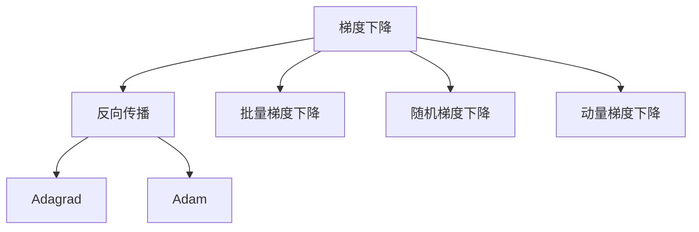
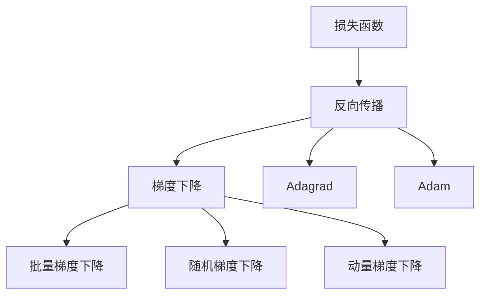
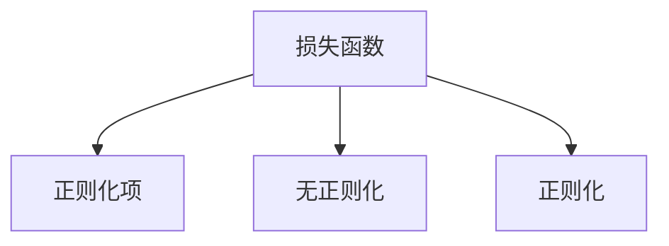
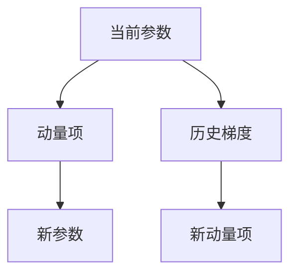
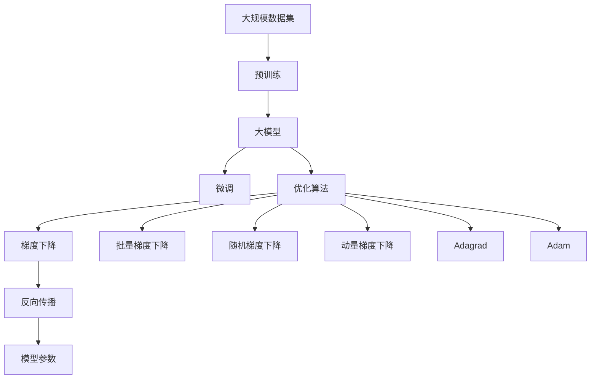

                 

# AI人工智能核心算法原理与代码实例讲解：模型优化

> 关键词：模型优化,算法原理,代码实例,深度学习,神经网络,梯度下降,反向传播,正则化

## 1. 背景介绍

### 1.1 问题由来

在人工智能领域，模型优化是一个永恒的主题。随着深度学习技术的不断发展，越来越多的模型被用于处理各种复杂的任务，如图像识别、自然语言处理、语音识别等。然而，这些模型往往具有大量的参数，需要耗费大量的时间和资源进行训练。为了提高模型的性能和训练效率，模型优化成为了一个重要且必要的研究方向。

### 1.2 问题核心关键点

模型优化的核心目标是通过一些优化算法，使得模型在训练过程中能够不断优化自身的参数，以提高模型的准确率和泛化能力。通常，模型优化分为两种方式：梯度下降和梯度上升。梯度下降是最常见的优化算法，通过不断更新模型参数，使得损失函数最小化。而梯度上升则相反，通过不断更新模型参数，使得损失函数最大化。

### 1.3 问题研究意义

模型优化是深度学习领域的一个重要研究方向，其研究意义主要体现在以下几个方面：

1. **提高模型准确率**：通过优化模型参数，可以显著提高模型的准确率和泛化能力。
2. **加速模型训练**：优化算法可以加快模型训练速度，缩短训练时间。
3. **提升模型性能**：优化算法可以避免模型过拟合，提高模型在测试集上的性能。
4. **降低计算成本**：优化算法可以减少计算资源的使用，降低模型训练的成本。
5. **增强模型鲁棒性**：优化算法可以使模型对输入数据的微小变化具有更强的鲁棒性。

## 2. 核心概念与联系

### 2.1 核心概念概述

为了更好地理解模型优化，我们首先介绍几个相关的核心概念：

- **梯度下降（Gradient Descent）**：梯度下降是深度学习中最常用的优化算法之一。其核心思想是通过计算损失函数对模型参数的梯度，不断调整模型参数，使得损失函数最小化。
- **反向传播（Backpropagation）**：反向传播是一种基于梯度下降的优化算法，用于计算损失函数对模型参数的梯度。反向传播通过链式法则将损失函数对每个模型参数的梯度计算出来，然后根据梯度更新模型参数。
- **正则化（Regularization）**：正则化是一种防止模型过拟合的技术，通过在损失函数中加入正则项，使得模型参数的取值更加平滑，从而避免过拟合。
- **批量梯度下降（Batch Gradient Descent）**：批量梯度下降是梯度下降的一种变体，每次更新参数时使用所有样本的梯度。批量梯度下降可以保证每次更新参数后，损失函数取得局部最小值。
- **随机梯度下降（Stochastic Gradient Descent）**：随机梯度下降是梯度下降的另一种变体，每次更新参数时只使用一个样本的梯度。随机梯度下降可以加快训练速度，但可能会收敛到局部最优解。
- **动量梯度下降（Momentum Gradient Descent）**：动量梯度下降通过引入动量项，可以加速梯度下降的收敛速度，避免陷入局部最优解。
- **Adagrad**：Adagrad是一种自适应学习率算法，根据每个参数的历史梯度信息，动态调整学习率，使得学习率对每个参数的调整更加精细。
- **Adam**：Adam是一种结合了动量梯度下降和Adagrad的优化算法，具有自适应学习率和动量项的双重优势，是一种常用的优化算法。

这些核心概念之间的联系可以通过以下Mermaid流程图来展示：



这个流程图展示了几大优化算法的内在联系：

1. 梯度下降是基础，包括批量梯度下降、随机梯度下降和动量梯度下降等变体。
2. 反向传播是梯度下降的具体实现方法。
3. Adagrad和Adam是梯度下降的变种，通过不同的方式调整学习率。

### 2.2 概念间的关系

这些核心概念之间存在着紧密的联系，形成了模型优化的完整生态系统。下面我通过几个Mermaid流程图来展示这些概念之间的关系。

#### 2.2.1 模型优化的整体架构



这个综合流程图展示了从损失函数到梯度下降的完整过程。模型的损失函数通过反向传播计算梯度，然后通过梯度下降算法更新模型参数。其中，批量梯度下降、随机梯度下降、动量梯度下降和Adagrad、Adam等算法都是优化算法中常用的变体。

#### 2.2.2 正则化在模型优化中的作用



这个流程图展示了正则化在模型优化中的作用。通过在损失函数中加入正则项，可以防止模型过拟合，提高模型的泛化能力。

#### 2.2.3 动量梯度下降的原理



这个流程图展示了动量梯度下降的原理。动量梯度下降通过引入动量项，可以加速梯度下降的收敛速度，避免陷入局部最优解。

### 2.3 核心概念的整体架构

最后，我们用一个综合的流程图来展示这些核心概念在大模型优化过程中的整体架构：



这个综合流程图展示了从预训练到大模型微调的完整过程。大模型首先在大规模数据集上进行预训练，然后通过微调优化模型在特定任务上的性能。在微调过程中，使用优化算法（如梯度下降、批量梯度下降、随机梯度下降、动量梯度下降、Adagrad、Adam等）更新模型参数。最后，通过反向传播计算损失函数，不断更新模型参数，使得损失函数最小化。

## 3. 核心算法原理 & 具体操作步骤
### 3.1 算法原理概述

模型优化算法的核心原理是通过不断地调整模型参数，使得损失函数最小化。其中，梯度下降算法是最常用的优化算法之一。梯度下降的核心思想是：通过计算损失函数对模型参数的梯度，不断更新模型参数，使得损失函数不断减小，从而接近最小值。

### 3.2 算法步骤详解

以下是使用梯度下降算法进行模型优化的详细步骤：

1. **初始化模型参数**：首先，我们需要对模型的参数进行初始化，通常使用随机初始化或预训练权重。
2. **计算损失函数**：将训练数据输入模型，计算模型的损失函数。
3. **计算梯度**：通过反向传播算法，计算损失函数对模型参数的梯度。
4. **更新模型参数**：根据梯度的方向和大小，更新模型参数。
5. **重复执行**：重复执行上述步骤，直到模型收敛或达到预设的迭代次数。

### 3.3 算法优缺点

梯度下降算法有以下优点：

1. **简单易用**：梯度下降算法简单易用，易于实现。
2. **可解释性**：梯度下降算法的原理简单明了，易于理解和解释。
3. **收敛速度快**：在适当的学习率下，梯度下降算法可以很快收敛到最优解。

同时，梯度下降算法也有以下缺点：

1. **收敛速度慢**：在陡峭的损失函数上，梯度下降算法的收敛速度较慢。
2. **易陷入局部最优**：梯度下降算法可能会陷入局部最优解，无法找到全局最优解。
3. **对学习率敏感**：梯度下降算法对学习率的选取敏感，学习率过大或过小都会影响算法的收敛效果。

### 3.4 算法应用领域

模型优化算法在深度学习中有着广泛的应用，以下是几个典型的应用领域：

- **图像识别**：通过优化模型参数，可以显著提高图像识别模型的准确率和泛化能力。
- **自然语言处理**：通过优化模型参数，可以显著提高自然语言处理模型的准确率和泛化能力。
- **语音识别**：通过优化模型参数，可以显著提高语音识别模型的准确率和泛化能力。
- **推荐系统**：通过优化模型参数，可以显著提高推荐系统的推荐效果和用户体验。
- **医疗诊断**：通过优化模型参数，可以显著提高医疗诊断系统的准确率和可靠性。

## 4. 数学模型和公式 & 详细讲解 & 举例说明

### 4.1 数学模型构建

假设我们有一个神经网络模型，其参数为 $\theta$。给定训练数据 $(x_i, y_i)$，其中 $x_i$ 为输入，$y_i$ 为标签。模型的损失函数为 $L(\theta)$，表示模型输出与真实标签之间的差异。模型优化算法通过更新参数 $\theta$，使得损失函数 $L(\theta)$ 最小化。

### 4.2 公式推导过程

以梯度下降算法为例，其更新公式为：

$$
\theta_{t+1} = \theta_t - \eta \nabla_{\theta} L(\theta)
$$

其中，$\eta$ 为学习率，$\nabla_{\theta} L(\theta)$ 为损失函数对模型参数的梯度。

具体来说，通过反向传播算法，我们可以计算出每个参数的梯度，然后根据梯度的方向和大小，更新模型的参数。以下是反向传播算法的基本步骤：

1. **前向传播**：将输入数据 $x$ 输入神经网络，计算每个神经元的输出值。
2. **计算损失函数**：将模型的输出 $y$ 与真实标签 $y'$ 计算损失函数 $L(y, y')$。
3. **反向传播**：通过链式法则，计算损失函数对每个神经元输出的梯度，然后计算每个神经元输出的梯度对参数的梯度，最后计算损失函数对每个参数的梯度。
4. **更新模型参数**：根据梯度的方向和大小，更新模型的参数。

### 4.3 案例分析与讲解

假设我们有一个简单的线性回归模型，其参数为 $\theta = (w, b)$，其中 $w$ 为权重，$b$ 为偏置。给定训练数据 $(x_i, y_i)$，我们的目标是找到最佳的参数 $w$ 和 $b$，使得模型的损失函数最小化。

首先，我们需要定义损失函数。假设我们使用均方误差（MSE）作为损失函数：

$$
L(\theta) = \frac{1}{n} \sum_{i=1}^{n} (y_i - wx_i - b)^2
$$

然后，通过反向传播算法，我们可以计算出损失函数对每个参数的梯度。假设我们使用的是批量梯度下降算法，我们需要计算所有样本的梯度，然后取平均值。以下是反向传播算法的基本步骤：

1. **前向传播**：将输入数据 $x$ 输入神经网络，计算每个神经元的输出值 $y = wx + b$。
2. **计算损失函数**：将模型的输出 $y$ 与真实标签 $y'$ 计算损失函数 $L(y, y') = \frac{1}{2} (y - y')^2$。
3. **反向传播**：通过链式法则，计算损失函数对每个神经元输出的梯度 $\frac{\partial L}{\partial y} = (y - y')$，然后计算每个神经元输出的梯度对参数的梯度 $\frac{\partial L}{\partial w} = x(y - y')$，$\frac{\partial L}{\partial b} = (y - y')$。
4. **更新模型参数**：根据梯度的方向和大小，更新模型的参数 $w \leftarrow w - \eta \frac{\partial L}{\partial w}$，$b \leftarrow b - \eta \frac{\partial L}{\partial b}$。

## 5. 项目实践：代码实例和详细解释说明

### 5.1 开发环境搭建

在进行模型优化实践前，我们需要准备好开发环境。以下是使用Python进行TensorFlow开发的环境配置流程：

1. 安装Anaconda：从官网下载并安装Anaconda，用于创建独立的Python环境。

2. 创建并激活虚拟环境：
```bash
conda create -n tensorflow-env python=3.8 
conda activate tensorflow-env
```

3. 安装TensorFlow：根据CUDA版本，从官网获取对应的安装命令。例如：
```bash
conda install tensorflow
```

4. 安装各类工具包：
```bash
pip install numpy pandas scikit-learn matplotlib tqdm jupyter notebook ipython
```

完成上述步骤后，即可在`tensorflow-env`环境中开始模型优化实践。

### 5.2 源代码详细实现

以下是使用TensorFlow实现线性回归模型的代码：

```python
import tensorflow as tf

# 定义模型参数
w = tf.Variable(0.0, name='w')
b = tf.Variable(0.0, name='b')

# 定义输入数据
x = tf.placeholder(tf.float32, name='x')
y = tf.placeholder(tf.float32, name='y')

# 定义模型
y_pred = tf.matmul(x, w) + b

# 定义损失函数
loss = tf.reduce_mean(tf.square(y_pred - y))

# 定义优化器
optimizer = tf.train.GradientDescentOptimizer(learning_rate=0.01)

# 定义训练过程
train_op = optimizer.minimize(loss)

# 初始化模型
sess = tf.Session()
sess.run(tf.global_variables_initializer())

# 训练模型
for i in range(1000):
    _, loss_val = sess.run([train_op, loss], feed_dict={x: [1.0, 2.0, 3.0], y: [2.0, 4.0, 6.0]})
    if i % 100 == 0:
        print('Step {}: Loss = {}'.format(i, loss_val))

# 评估模型
x_test = [1.0, 2.0, 3.0]
y_test = [2.0, 4.0, 6.0]
y_pred_test = sess.run(y_pred, feed_dict={x: x_test})
print('Test predictions:', y_pred_test)
```

### 5.3 代码解读与分析

让我们再详细解读一下关键代码的实现细节：

**定义模型参数**：
```python
w = tf.Variable(0.0, name='w')
b = tf.Variable(0.0, name='b')
```
定义了模型参数 $w$ 和 $b$。

**定义输入数据**：
```python
x = tf.placeholder(tf.float32, name='x')
y = tf.placeholder(tf.float32, name='y')
```
定义了输入数据 $x$ 和标签 $y$。

**定义模型**：
```python
y_pred = tf.matmul(x, w) + b
```
定义了线性回归模型，输入 $x$ 乘以权重 $w$ 加上偏置 $b$ 得到预测结果 $y_pred$。

**定义损失函数**：
```python
loss = tf.reduce_mean(tf.square(y_pred - y))
```
定义了均方误差（MSE）损失函数，计算预测结果 $y_pred$ 与真实标签 $y$ 的平方差，然后取平均值。

**定义优化器**：
```python
optimizer = tf.train.GradientDescentOptimizer(learning_rate=0.01)
```
定义了梯度下降优化器，学习率为0.01。

**定义训练过程**：
```python
train_op = optimizer.minimize(loss)
```
定义了训练过程，通过优化器最小化损失函数。

**初始化模型**：
```python
sess = tf.Session()
sess.run(tf.global_variables_initializer())
```
初始化TensorFlow会话。

**训练模型**：
```python
for i in range(1000):
    _, loss_val = sess.run([train_op, loss], feed_dict={x: [1.0, 2.0, 3.0], y: [2.0, 4.0, 6.0]})
    if i % 100 == 0:
        print('Step {}: Loss = {}'.format(i, loss_val))
```
在每个训练步骤中，先运行训练操作，然后计算损失值，并每100步输出一次损失值。

**评估模型**：
```python
x_test = [1.0, 2.0, 3.0]
y_test = [2.0, 4.0, 6.0]
y_pred_test = sess.run(y_pred, feed_dict={x: x_test})
print('Test predictions:', y_pred_test)
```
在测试数据集上进行预测，并输出预测结果。

## 6. 实际应用场景

### 6.1 图像识别

图像识别是深度学习应用的一个重要领域。在图像识别任务中，我们通常使用卷积神经网络（CNN）作为模型，通过优化模型参数，提高图像识别的准确率和泛化能力。

### 6.2 自然语言处理

自然语言处理是深度学习应用的另一个重要领域。在自然语言处理任务中，我们通常使用循环神经网络（RNN）或长短时记忆网络（LSTM）作为模型，通过优化模型参数，提高自然语言处理模型的准确率和泛化能力。

### 6.3 推荐系统

推荐系统是深度学习应用的另一个重要领域。在推荐系统任务中，我们通常使用深度神经网络作为模型，通过优化模型参数，提高推荐系统的推荐效果和用户体验。

### 6.4 未来应用展望

随着深度学习技术的发展，模型优化算法将在更多领域得到应用，为传统行业带来变革性影响。

## 7. 工具和资源推荐

### 7.1 学习资源推荐

为了帮助开发者系统掌握模型优化理论基础和实践技巧，这里推荐一些优质的学习资源：

1. 《深度学习》系列课程：由吴恩达教授主讲的Coursera课程，全面介绍了深度学习的基本概念和前沿技术。

2. 《TensorFlow实战》书籍：由Google TensorFlow团队编写的官方指南，提供了大量的代码实例和实践技巧。

3. 《神经网络与深度学习》书籍：由Michael Nielsen编写的经典教材，详细介绍了神经网络和深度学习的原理和应用。

4. 《Python深度学习》书籍：由Francois Chollet编写的官方指南，提供了大量的代码实例和实践技巧。

5. 《Deep Learning Specialization》课程：由Andrew Ng教授主讲的Coursera系列课程，详细介绍了深度学习的基本概念和前沿技术。

### 7.2 开发工具推荐

高效的开发离不开优秀的工具支持。以下是几款用于模型优化开发的常用工具：

1. TensorFlow：由Google主导开发的深度学习框架，支持分布式计算和GPU加速，适合大规模深度学习任务。

2. PyTorch：由Facebook主导开发的深度学习框架，支持动态计算图和GPU加速，适合快速迭代研究。

3. Keras：由Francois Chollet主导开发的深度学习框架，支持快速搭建和训练深度学习模型。

4. Caffe：由Berkeley Vision and Learning Center（BVLC）开发的深度学习框架，支持图像分类、目标检测等任务。

5. MXNet：由Apache开发的深度学习框架，支持多种编程语言和分布式计算。

6. Theano：由蒙特利尔大学开发的深度学习框架，支持GPU加速和符号计算。

### 7.3 相关论文推荐

模型优化是深度学习领域的一个重要研究方向，以下是几篇奠基性的相关论文，推荐阅读：

1. "Adam: A Method for Stochastic Optimization"（Adam论文）：由Diederik Kingma和Jimmy Ba等人撰写，提出Adam优化算法，结合了动量梯度下降和自适应学习率的优势。

2. "On the importance of initialization and momentum in deep learning"（网络初始化和动量论文）：由Xavier Glorot和Yoshua Bengio等人撰写，提出网络初始化方法和动量梯度下降算法，显著提高了深度学习模型的训练效果。

3. "Batch Normalization: Accelerating Deep Network Training by Reducing Internal Covariate Shift"（批归一化论文）：由Sergey Ioffe和Christian Szegedy等人撰写，提出批归一化算法，加快了深度学习模型的训练速度和收敛效果。

4. "Deep Residual Learning for Image Recognition"（残差网络论文）：由Kaiming He等人撰写，提出残差网络架构，解决了深度神经网络训练中的退化问题。

5. "ImageNet Classification with Deep Convolutional Neural Networks"（ImageNet论文）：由Alex Krizhevsky等人撰写，提出卷积神经网络架构，在ImageNet数据集上取得了优异的结果。

这些论文代表了模型优化技术的最新进展，值得仔细学习和研究。

## 8. 总结：未来发展趋势与挑战

### 8.1 总结

本文对模型优化算法的核心原理和代码实例进行了详细讲解。首先，我们介绍了模型优化的背景和意义，明确了模型优化在提高模型性能和训练效率方面的重要性。其次，我们详细介绍了梯度下降、反向传播、正则化等核心概念，并通过Mermaid流程图展示了这些概念之间的联系。然后，我们通过TensorFlow的代码实例，展示了如何实现简单的线性回归模型，并通过训练过程和评估过程，深入讲解了模型优化的详细步骤。最后，我们探讨了模型优化算法的应用领域，并推荐了一些优质的学习资源和工具。

通过本文的系统梳理，可以看到，模型优化算法在深度学习中具有重要的地位，通过不断的优化，可以显著提高模型的性能和泛化能力。未来，随着深度学习技术的不断发展，模型优化算法也将不断演进，为深度学习技术的落地应用提供更坚实的理论基础和更高效的技术手段。

### 8.2 未来发展趋势

展望未来，模型优化算法将呈现以下几个发展趋势：

1. **自适应学习率算法**：随着深度学习任务的复杂性不断提高，自适应学习率算法将成为主流。自适应学习率算法可以根据每个参数的历史梯度信息，动态调整学习率，使得学习率对每个参数的调整更加精细。

2. **多任务学习**：多任务学习是指在优化过程中同时优化多个任务的目标函数，以提高模型的泛化能力和训练效率。多任务学习可以在同一模型中共享参数，提高模型的性能。

3. **强化学习**：强化学习是一种通过与环境交互，不断优化模型参数的优化算法。强化学习可以应用于复杂的决策任务，如自动驾驶、机器人控制等。

4. **分布式训练**：随着深度学习任务的规模不断扩大，分布式训练将成为主流。分布式训练可以将大规模深度学习任务分配到多个计算节点上进行并行计算，加快训练速度。

5. **低精度计算**：低精度计算是指使用低精度的浮点数进行计算，以提高计算效率和训练速度。低精度计算可以显著减少内存和存储的使用，降低计算成本。

6. **模型压缩和量化**：模型压缩和量化是指将大规模深度学习模型压缩为轻量级模型，以提高推理速度和存储效率。模型压缩和量化可以显著减少计算资源的使用，降低推理成本。

以上趋势凸显了模型优化技术的广阔前景。这些方向的探索发展，必将进一步提升深度学习模型的性能和应用范围，为深度学习技术的落地应用提供更坚实的技术手段。

### 8.3 面临的挑战

尽管模型优化技术已经取得了瞩目成就，但在迈向更加智能化、普适化应用的过程中，它仍面临着诸多挑战：

1. **计算资源瓶颈**：大规模深度学习模型的训练需要大量的计算资源，对计算设备的性能和存储容量提出了很高的要求。如何提高计算效率，降低计算成本，是未来需要解决的重要问题。

2. **模型鲁棒性不足**：模型对输入数据的微小变化敏感，容易发生泛化能力下降的问题。如何提高模型的鲁棒性，增强模型的泛化能力，是未来需要解决的重要问题。

3. **模型可解释性不足**：深度学习模型通常被视为“黑盒”，难以解释其内部工作机制和决策逻辑。如何提高模型的可解释性，增强模型的透明度，是未来需要解决的重要问题。

4. **模型安全性和隐私保护**：深度学习模型可能会学习到有偏见、有害的信息，对用户隐私和安全构成威胁。如何确保模型的安全性和隐私保护，是未来需要解决的重要问题。

5. **模型训练和推理效率**：大规模深度学习模型的训练和推理效率低下，难以满足实时应用的需求。如何提高模型的训练和推理效率，是未来需要解决的重要问题。

6. **模型迁移能力不足**：深度学习模型通常在特定任务上表现良好，但在其他任务上的表现往往不佳。如何提高模型的迁移能力，增强模型的泛化能力，是

