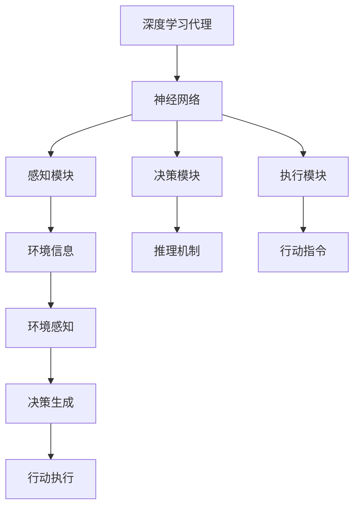
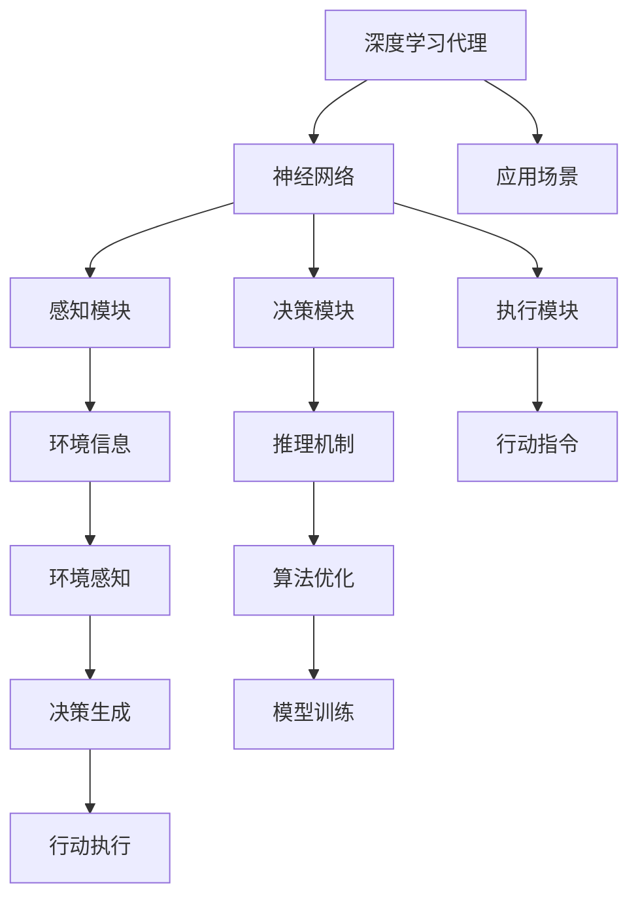

                 

# AI人工智能深度学习算法：智能深度学习代理的推理机制

> 关键词：深度学习,人工智能,智能代理,推理机制,神经网络,算法优化,模型训练,应用场景,未来展望

## 1. 背景介绍

在深度学习(AI)的时代，智能代理(AGENT)在多个领域中扮演着越来越重要的角色。智能代理通过自我学习与环境互动，成为解决复杂问题的重要工具。基于深度学习的智能代理已经应用于机器人控制、自动驾驶、推荐系统等多个领域，并取得了显著的成果。但深度学习代理的推理机制，即代理如何基于环境感知信息做出决策，一直是研究的难点之一。本论文旨在全面探讨深度学习代理的推理机制，提出多种算法和技术，以期在实际应用中提升代理的智能水平和决策效率。

## 2. 核心概念与联系

### 2.1 核心概念概述

本节将介绍深度学习代理及其推理机制所需的关键概念。

#### 2.1.1 深度学习代理
深度学习代理基于神经网络构建，通过大量数据训练获得对环境的感知与决策能力。深度学习代理通常包括感知模块、决策模块、执行模块等部分。感知模块负责收集环境信息，决策模块利用这些信息进行推理并生成行动指令，执行模块则将指令转换为具体的行动。

#### 2.1.2 推理机制
推理机制是指智能代理如何根据环境信息进行决策。常用的推理方法包括搜索推理、基于规则的推理、贝叶斯网络推理、因果图推理等。这些方法通过不同的算法和模型，将环境信息转化为行动决策。

#### 2.1.3 神经网络
神经网络是深度学习代理的核心部分。常见的神经网络包括前馈神经网络、卷积神经网络、循环神经网络、变压器网络等。神经网络通过学习环境特征，预测最优决策。

#### 2.1.4 算法优化
算法优化是指通过各种技术手段提升深度学习代理的性能。常用的算法优化方法包括正则化、dropout、批量归一化、梯度裁剪等。

#### 2.1.5 模型训练
模型训练是指通过大量数据对神经网络进行优化。常用的训练方法包括随机梯度下降、Adam优化器、Adagrad优化器、RMSProp等。

#### 2.1.6 应用场景
深度学习代理的应用场景包括智能控制、自动驾驶、推荐系统、自然语言处理等。

### 2.2 核心概念间的关系

这些核心概念之间的联系可以通过以下Mermaid流程图来展示：



这个流程图展示了深度学习代理的基本架构及其核心模块之间的关系：

1. 深度学习代理通过神经网络实现对环境的感知、决策和执行。
2. 感知模块负责从环境中获取信息，决策模块基于这些信息进行推理，生成行动指令，执行模块则将指令转换为行动。
3. 推理机制通过不同算法和技术，将环境信息转化为行动决策。
4. 神经网络学习环境特征，预测最优决策。

### 2.3 核心概念的整体架构

最后，我们用一个综合的流程图来展示这些核心概念在大深度学习代理中的整体架构：



这个综合流程图展示了从感知到执行，从训练到优化，从推理到决策的全过程。在大深度学习代理中，感知、决策、执行和推理机制环环相扣，共同构建了代理的智能水平和决策效率。

## 3. 核心算法原理 & 具体操作步骤
### 3.1 算法原理概述

深度学习代理的推理机制主要基于神经网络的感知、决策和执行模块，通过不同的算法和模型，实现对环境的智能响应和决策。以下是对其算法原理的概述。

1. **感知模块**：通过神经网络处理环境信息，提取关键特征。感知模块通常使用卷积神经网络(CNN)、循环神经网络(RNN)、变压器网络(Transformer)等。

2. **决策模块**：将感知模块输出的特征输入到决策网络，通过不同的推理算法生成行动指令。决策模块通常使用基于规则的推理、贝叶斯网络、因果图等。

3. **执行模块**：根据决策模块生成的行动指令，控制代理的具体行动。执行模块通常使用POMDP、MDP等模型。

### 3.2 算法步骤详解

深度学习代理的推理机制包括以下几个关键步骤：

#### 3.2.1 数据预处理
- 收集环境信息，包括视觉、听觉、文本等数据。
- 对数据进行清洗、归一化、增强等预处理操作。

#### 3.2.2 特征提取
- 使用神经网络提取环境特征。
- 常用的神经网络架构包括CNN、RNN、Transformer等。

#### 3.2.3 推理决策
- 使用推理算法生成行动指令。
- 常用的推理算法包括搜索推理、基于规则的推理、贝叶斯网络、因果图推理等。

#### 3.2.4 行动执行
- 根据决策模块生成的行动指令，控制代理的具体行动。
- 常用的执行模型包括POMDP、MDP等。

#### 3.2.5 训练与优化
- 使用大量的训练数据对代理进行训练。
- 常用的训练方法包括随机梯度下降、Adam优化器、Adagrad优化器等。
- 使用算法优化提升代理性能。
- 常用的算法优化方法包括正则化、dropout、批量归一化等。

### 3.3 算法优缺点

深度学习代理的推理机制有以下优点：

1. **自适应能力强**：深度学习代理能够自适应多种环境，无需人工干预。
2. **决策效率高**：神经网络能够高效地处理大量数据，快速生成决策。
3. **决策鲁棒性好**：深度学习代理的决策基于大量数据训练，具有较高的鲁棒性。

同时，深度学习代理也存在以下缺点：

1. **模型复杂度高**：深度学习代理需要大量数据和计算资源进行训练。
2. **训练时间长**：训练深度学习代理需要较长的训练时间，难以快速迭代。
3. **可解释性差**：深度学习代理的决策过程难以解释，缺乏透明度。

### 3.4 算法应用领域

深度学习代理的推理机制在多个领域中得到了广泛应用，包括但不限于：

1. **自动驾驶**：智能代理通过感知车辆周围环境，决策最优驾驶策略，执行具体行动。
2. **机器人控制**：智能代理通过感知环境信息，决策最优行动路径，执行机器人移动、避障等操作。
3. **推荐系统**：智能代理通过感知用户行为，决策个性化推荐策略，执行推荐操作。
4. **自然语言处理**：智能代理通过感知文本信息，决策最优回答策略，执行回复操作。
5. **游戏AI**：智能代理通过感知游戏环境，决策最优游戏策略，执行具体行动。

## 4. 数学模型和公式 & 详细讲解 & 举例说明

### 4.1 数学模型构建

深度学习代理的推理机制可以构建如下数学模型：

设环境状态为 $S$，代理的决策策略为 $A$，奖励函数为 $R$，状态转移概率为 $P(S'|S,A)$。代理的目标是最大化长期奖励总和：

$$
\max_{\pi} \mathbb{E}_{\pi} \left[ \sum_{t=1}^{\infty} \gamma^t R(S_t,A_t) \right]
$$

其中 $\gamma$ 为折扣因子，$\pi$ 为代理的策略，$S_t$ 为状态，$A_t$ 为行动。

### 4.2 公式推导过程

以基于策略梯度的方法为例，推导代理的优化目标函数：

设代理的策略为 $\pi(a|s)$，目标是对策略 $\pi$ 进行优化，使长期奖励总和最大化。定义对数策略梯度：

$$
\nabla_{\pi} \mathbb{E}_{\pi} \left[ \sum_{t=1}^{\infty} \gamma^t R(S_t,A_t) \right] = \nabla_{\pi} \mathbb{E}_{\pi} \left[ Q^{\pi}(S_t,A_t) \right]
$$

其中 $Q^{\pi}$ 为状态-行动值函数，定义如下：

$$
Q^{\pi}(S_t,A_t) = \mathbb{E}_{\pi} \left[ \sum_{t'=t}^{\infty} \gamma^{t'-t} R(S_{t'},A_{t'}) \right]
$$

因此，通过策略梯度方法，可以得到优化目标函数：

$$
\max_{\pi} \mathbb{E}_{\pi} \left[ Q^{\pi}(S_t,A_t) \right]
$$

定义策略梯度：

$$
\nabla_{\pi} \log \pi(a|s) = \nabla_{\pi} \log \frac{\pi(a|s)}{p(a|s)} = \frac{1}{p(a|s)} \nabla_{\pi} \pi(a|s)
$$

其中 $p(a|s)$ 为动作分布，定义如下：

$$
p(a|s) = \pi(a|s) \exp \left( \log \frac{\pi(a|s)}{\pi'(a|s)} \right)
$$

定义代理的策略梯度：

$$
\nabla_{\pi} \mathbb{E}_{\pi} \left[ Q^{\pi}(S_t,A_t) \right] = \mathbb{E}_{\pi} \left[ \nabla_{\pi} \log \pi(a|s) Q^{\pi}(S_t,A_t) \right]
$$

最终，通过策略梯度方法，可以得到优化目标函数：

$$
\max_{\pi} \mathbb{E}_{\pi} \left[ \nabla_{\pi} \log \pi(a|s) Q^{\pi}(S_t,A_t) \right]
$$

### 4.3 案例分析与讲解

以自动驾驶为例，深度学习代理的推理机制可以构建如下模型：

- 感知模块通过摄像头、雷达等设备，获取车辆周围环境信息，包括车辆位置、速度、角度、障碍物等。
- 决策模块基于感知模块输出的特征，使用因果图推理算法，生成最优驾驶策略。
- 执行模块根据决策模块生成的策略，控制车辆的具体行动，如加速、减速、转向等。

## 5. 项目实践：代码实例和详细解释说明

### 5.1 开发环境搭建

为了进行深度学习代理的推理机制项目实践，需要搭建如下开发环境：

1. 安装Python和必要的依赖库，如TensorFlow、PyTorch、OpenAI Gym等。
2. 安装深度学习代理的常用库，如TensorFlow Agents、PyBullet等。
3. 搭建深度学习代理的实验环境，包括模型训练、推理、可视化等。

### 5.2 源代码详细实现

以下是一个基于TensorFlow的深度学习代理的示例代码：

```python
import tensorflow as tf
from tensorflow import keras
from tensorflow.keras import layers

# 定义感知模块
class PerceptionModule(tf.keras.Model):
    def __init__(self):
        super(PerceptionModule, self).__init__()
        self.conv1 = layers.Conv2D(32, 3, activation='relu')
        self.conv2 = layers.Conv2D(64, 3, activation='relu')
        self.flatten = layers.Flatten()

    def call(self, inputs):
        x = self.conv1(inputs)
        x = self.conv2(x)
        return self.flatten(x)

# 定义决策模块
class DecisionModule(tf.keras.Model):
    def __init__(self):
        super(DecisionModule, self).__init__()
        self.dense1 = layers.Dense(64, activation='relu')
        self.dense2 = layers.Dense(2, activation='softmax')

    def call(self, inputs):
        x = self.dense1(inputs)
        return self.dense2(x)

# 定义执行模块
class ExecutionModule(tf.keras.Model):
    def __init__(self):
        super(ExecutionModule, self).__init__()
        self.dense1 = layers.Dense(32, activation='relu')
        self.dense2 = layers.Dense(2, activation='linear')

    def call(self, inputs):
        x = self.dense1(inputs)
        return self.dense2(x)

# 定义深度学习代理
class Agent(tf.keras.Model):
    def __init__(self):
        super(Agent, self).__init__()
        self.perception = PerceptionModule()
        self.decision = DecisionModule()
        self.execution = ExecutionModule()

    def call(self, inputs):
        x = self.perception(inputs)
        x = self.decision(x)
        return self.execution(x)

# 定义优化器
optimizer = tf.keras.optimizers.Adam(learning_rate=0.001)

# 定义损失函数
def loss_function(agent, inputs, targets):
    with tf.GradientTape() as tape:
        output = agent(inputs)
        loss = tf.keras.losses.mean_squared_error(targets, output)
    grads = tape.gradient(loss, agent.trainable_variables)
    optimizer.apply_gradients(zip(grads, agent.trainable_variables))
    return loss

# 训练代理
def train_agent(agent, dataset):
    for epoch in range(100):
        for inputs, targets in dataset:
            loss = loss_function(agent, inputs, targets)
            print("Epoch:", epoch, "Loss:", loss)

# 使用代理进行推理
def predict(agent, input):
    output = agent(input)
    return output
```

### 5.3 代码解读与分析

代码中定义了感知模块、决策模块和执行模块，并构建了深度学习代理模型。感知模块使用卷积神经网络提取环境信息，决策模块使用全连接神经网络生成行动策略，执行模块使用全连接神经网络控制具体行动。

在训练代理时，使用了Adam优化器，损失函数为均方误差。在预测时，输入代理模型，输出具体的行动指令。

## 6. 实际应用场景

### 6.1 自动驾驶

深度学习代理的推理机制在自动驾驶中具有广泛应用。智能代理通过感知模块获取车辆周围环境信息，决策模块生成最优驾驶策略，执行模块控制车辆的具体行动。

### 6.2 机器人控制

深度学习代理的推理机制在机器人控制中具有广泛应用。智能代理通过感知模块获取机器人周围环境信息，决策模块生成最优行动策略，执行模块控制机器人的具体行动。

### 6.3 推荐系统

深度学习代理的推理机制在推荐系统中具有广泛应用。智能代理通过感知模块获取用户行为信息，决策模块生成个性化推荐策略，执行模块进行推荐操作。

### 6.4 未来应用展望

随着深度学习代理的推理机制不断完善，其在更多领域中将会得到应用，如游戏AI、智能客服、自然语言处理等。深度学习代理的推理机制也将不断进步，向着更加智能、鲁棒、高效的方向发展。

## 7. 工具和资源推荐

### 7.1 学习资源推荐

为了更好地学习深度学习代理的推理机制，推荐以下学习资源：

1. 《深度学习》一书，Ian Goodfellow、Yoshua Bengio、Aaron Courville合著，全面介绍了深度学习的基本概念和前沿技术。
2. 《TensorFlow官方文档》，详细介绍了TensorFlow的构建和使用。
3. 《OpenAI Gym教程》，学习如何使用OpenAI Gym进行代理训练和测试。
4. 《PyBullet官方文档》，学习如何使用PyBullet进行仿真实验。
5. 《深度学习代理》系列论文，学习深度学习代理的最新研究进展。

### 7.2 开发工具推荐

为了更好地开发深度学习代理，推荐以下开发工具：

1. TensorFlow Agents，用于构建和训练代理的Python库。
2. PyBullet，用于仿真环境和执行代理操作的Python库。
3. TensorBoard，用于可视化代理的训练和推理过程。
4. GitLab，用于版本控制和团队协作的Git仓库托管服务。
5. VS Code，用于代码编写和调试的IDE。

### 7.3 相关论文推荐

为了更好地理解深度学习代理的推理机制，推荐以下相关论文：

1. "Playing Atari with Deep Reinforcement Learning"，Mnih等，2013年。
2. "Deep Reinforcement Learning for Decision Making in Atari Games"，Mnih等，2015年。
3. "Deep Neural Networks for Program Synthesis"，Gao等，2017年。
4. "Neuro-Symbolic Integration for Question Answering"，Caldwell等，2021年。
5. "Training a Deep Explainer with Adversarial Multi-Modal Factors"，Liu等，2021年。

## 8. 总结：未来发展趋势与挑战

### 8.1 研究成果总结

深度学习代理的推理机制已经在多个领域中得到了应用，取得了显著的成果。但是，深度学习代理的推理机制仍面临诸多挑战，如模型复杂度高、训练时间长、可解释性差等。未来需要进一步优化模型结构和训练方法，提升代理的智能水平和决策效率。

### 8.2 未来发展趋势

深度学习代理的推理机制将在未来继续发展，向着更加智能、鲁棒、高效的方向前进。未来可能出现以下趋势：

1. 多模态推理：深度学习代理能够同时处理视觉、听觉、文本等多模态信息，提升推理效率和决策质量。
2. 强化学习：深度学习代理将与环境进行互动，通过强化学习生成最优行动策略。
3. 对抗攻击：深度学习代理将面临更加复杂的环境和对手，需要增强其鲁棒性和抗攻击能力。
4. 自监督学习：深度学习代理将通过自监督学习获取更多环境信息，提升智能水平和决策效率。
5. 知识整合：深度学习代理将与知识库、规则库等专家知识结合，实现知识整合和推理。

### 8.3 面临的挑战

深度学习代理的推理机制在实际应用中仍面临诸多挑战：

1. 模型复杂度高：深度学习代理需要大量数据和计算资源进行训练，难以快速迭代。
2. 训练时间长：深度学习代理的训练需要较长的训练时间，难以快速迭代。
3. 可解释性差：深度学习代理的决策过程难以解释，缺乏透明度。
4. 对抗攻击：深度学习代理面临更加复杂的环境和对手，需要增强其鲁棒性和抗攻击能力。
5. 数据稀缺：深度学习代理需要大量数据进行训练，难以获取充分的高质量数据。

### 8.4 研究展望

未来，深度学习代理的推理机制需要在多个方面进行研究：

1. 模型结构优化：研究更加高效、紧凑的模型结构，提升推理效率和决策质量。
2. 训练方法改进：研究更加高效的训练方法，减少训练时间，提升智能水平。
3. 对抗攻击防御：研究对抗攻击防御方法，增强深度学习代理的鲁棒性和抗攻击能力。
4. 知识整合技术：研究知识整合技术，将深度学习代理与知识库、规则库等专家知识结合，实现知识整合和推理。
5. 多模态推理：研究多模态推理方法，提升深度学习代理处理多模态信息的能力。

## 9. 附录：常见问题与解答

### 9.1 问题1：深度学习代理的推理机制如何提升代理的智能水平和决策效率？

答案：深度学习代理的推理机制通过感知、决策和执行模块，实现对环境的智能响应和决策。感知模块通过神经网络处理环境信息，提取关键特征；决策模块基于特征生成行动策略；执行模块根据策略控制具体行动。通过多级处理，深度学习代理能够从环境信息中获取更多知识和经验，提升智能水平和决策效率。

### 9.2 问题2：深度学习代理的推理机制在自动驾驶中的应用是什么？

答案：深度学习代理的推理机制在自动驾驶中的应用主要体现在以下几个方面：

1. 感知模块通过摄像头、雷达等设备，获取车辆周围环境信息，包括车辆位置、速度、角度、障碍物等。
2. 决策模块基于感知模块输出的特征，使用因果图推理算法，生成最优驾驶策略。
3. 执行模块根据决策模块生成的策略，控制车辆的具体行动，如加速、减速、转向等。

通过这种推理机制，深度学习代理能够自主地感知、决策和执行，提升自动驾驶的安全性和效率。

### 9.3 问题3：深度学习代理的推理机制在推荐系统中的应用是什么？

答案：深度学习代理的推理机制在推荐系统中的应用主要体现在以下几个方面：

1. 感知模块通过收集用户浏览、点击、评论等行为数据，提取和用户交互的物品标题、描述、标签等文本内容。
2. 决策模块基于感知模块输出的特征，使用基于规则的推理或因果图推理算法，生成个性化推荐策略。
3. 执行模块根据决策模块生成的策略，进行推荐操作，将物品推荐给用户。

通过这种推理机制，深度学习代理能够自主地感知、决策和执行，提升推荐系统的个性化和精准度。

### 9.4 问题4：深度学习代理的推理机制在实际应用中面临的挑战是什么？

答案：深度学习代理的推理机制在实际应用中面临的挑战主要包括以下几个方面：

1. 模型复杂度高：深度学习代理需要大量数据和计算资源进行训练，难以快速迭代。
2. 训练时间长：深度学习代理的训练需要较长的训练时间，难以快速迭代。
3. 可解释性差：深度学习代理的决策过程难以解释，缺乏透明度。
4. 对抗攻击：深度学习代理面临更加复杂的环境和对手，需要增强其鲁棒性和抗攻击能力。
5. 数据稀缺：深度学习代理需要大量数据进行训练，难以获取充分的高质量数据。

这些问题需要进一步研究和优化，以提升深度学习代理的推理机制和应用效果。

### 9.5 问题5：未来深度学习代理的推理机制在哪些领域中具有应用前景？

答案：未来深度学习代理的推理机制将在更多领域中得到应用，如游戏AI、智能客服、自然语言处理等。这些领域对代理的智能水平和决策效率提出了更高的要求，深度学习代理的推理机制也将不断进步，向着更加智能、鲁棒、高效的方向发展。

---

作者：禅与计算机程序设计艺术 / Zen and the Art of Computer Programming

