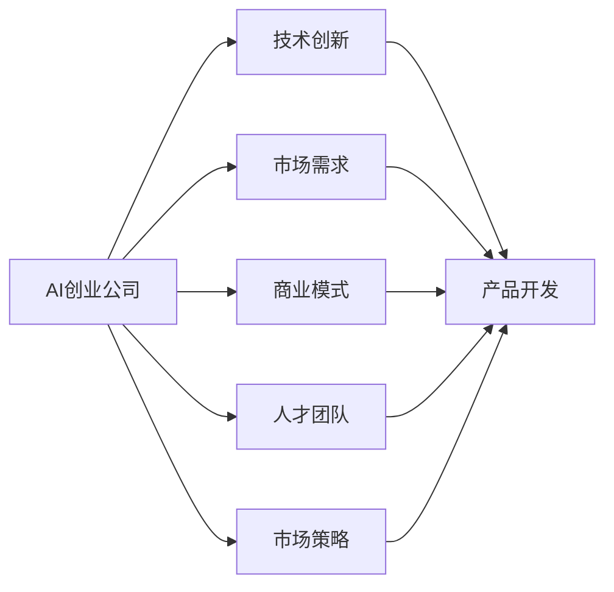
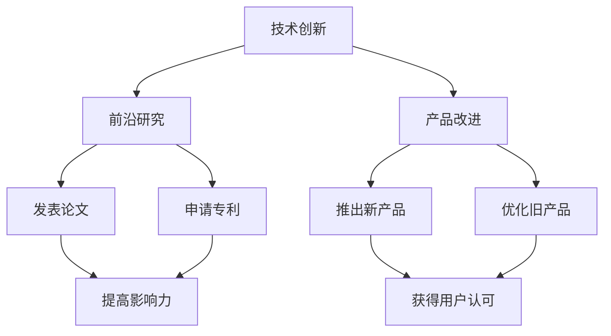
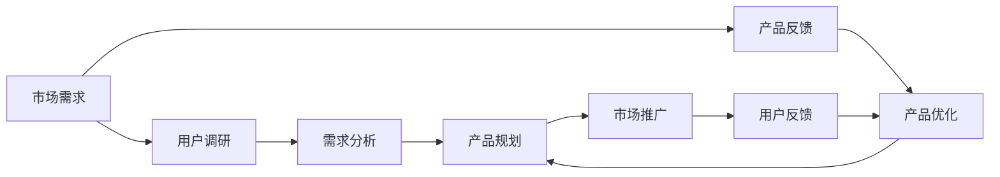
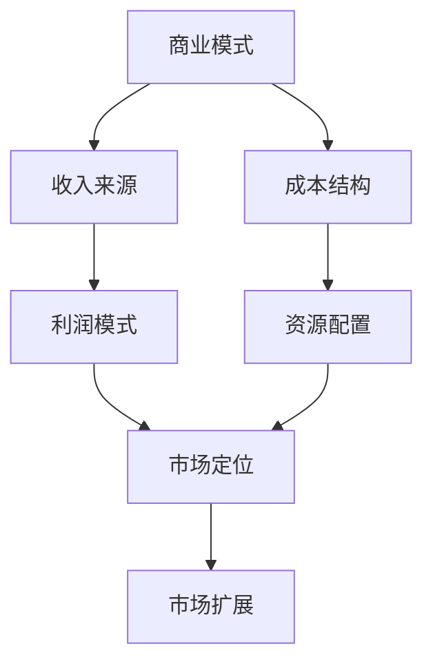
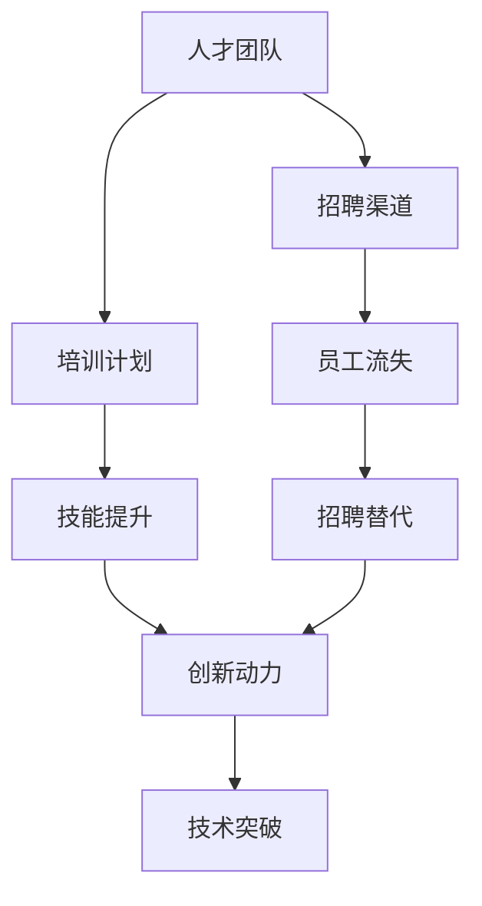
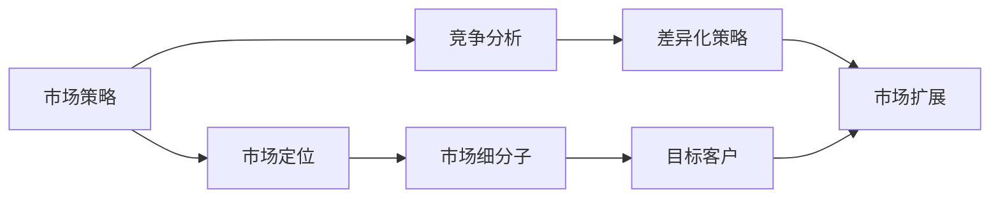
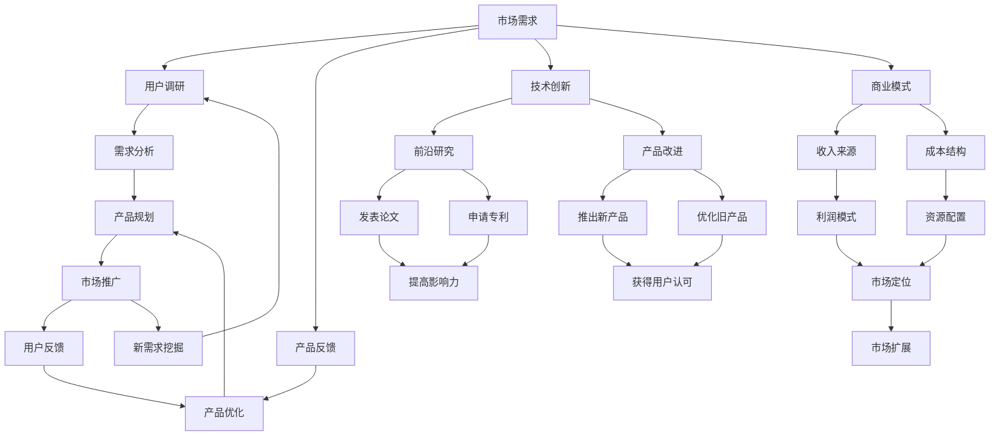

                 

# AI创业公司的未来发展

> 关键词：AI创业、未来发展、技术趋势、创新路径、创业策略

## 1. 背景介绍

### 1.1 问题由来
近年来，人工智能(AI)技术迅猛发展，特别是深度学习、自然语言处理(NLP)、计算机视觉等领域取得了显著突破。这些技术的进步，为AI创业公司提供了广阔的发展空间和机会。同时，AI应用场景的不断扩展，也吸引了大量资本和人才的涌入。但随之而来的，是市场竞争激烈、技术迭代迅速等挑战。如何在激烈的竞争中脱颖而出，抓住未来的技术趋势和市场需求，成为每一个AI创业者需要深思的问题。

### 1.2 问题核心关键点
AI创业公司的核心关键点主要包括以下几个方面：
- **技术优势**：掌握领先的技术，拥有持续的创新能力。
- **市场需求**：紧跟行业趋势，发掘新的应用场景。
- **商业模式**：打造可持续的商业模式，实现盈利和增长。
- **人才团队**：建设高效的人才队伍，打造强大的执行力。
- **市场策略**：制定灵活的市场策略，抓住机会与挑战。

这些关键点构成了AI创业公司成功的基石。以下将详细探讨如何通过技术创新、市场洞察、商业运作、人才建设等多方面努力，推动AI创业公司的未来发展。

### 1.3 问题研究意义
探讨AI创业公司的未来发展，具有重要的现实意义：
- **促进技术进步**：理解技术趋势，推动AI领域的技术创新。
- **指导市场布局**：分析市场需求，为AI创业公司提供市场洞察和策略建议。
- **助力商业模式**：结合实际案例，提出可持续的商业模式设计思路。
- **激发人才潜力**：总结人才建设经验，为AI创业者提供人才策略参考。
- **助力公司成长**：系统分析成功和失败案例，为AI创业公司提供战略指导。

通过深入分析AI创业公司的关键要素和成功经验，希望能够为广大的AI创业者提供有益的参考和借鉴，助力其在竞争激烈的AI市场中取得成功。

## 2. 核心概念与联系

### 2.1 核心概念概述

要深刻理解AI创业公司的未来发展，需要了解以下核心概念：

- **AI创业公司**：专注于AI技术的创业企业，致力于开发、应用、推广AI技术和产品。
- **技术创新**：通过持续的技术研发，开发前沿AI技术或改进现有技术，提升产品和服务的竞争力。
- **市场需求**：基于市场调研和用户反馈，发现和挖掘新的应用场景和用户需求，驱动产品迭代和市场扩展。
- **商业模式**：基于产品、服务和市场特点，设计符合市场规律的商业模式，确保公司的可持续发展。
- **人才团队**：构建一支高效、多元、富有创新精神的人才队伍，推动公司的技术创新和市场发展。
- **市场策略**：基于公司定位和资源优势，制定灵活、创新的市场策略，抓住市场机会和应对竞争挑战。

这些概念之间的联系和互动关系，可以通过以下Mermaid流程图来展示：

这个流程图展示了AI创业公司的各个关键要素及其相互关系：

1. AI创业公司通过技术创新（B）提升产品竞争力。
2. 基于市场需求（C），推动产品迭代和市场扩展。
3. 设计符合市场规律的商业模式（D），确保公司可持续发展。
4. 建设高效的人才团队（E），推动技术创新和市场发展。
5. 制定灵活创新的市场策略（F），抓住市场机会和应对挑战。
6. 技术创新、市场需求、商业模式、人才团队和市场策略共同作用，驱动AI创业公司的持续发展。

### 2.2 概念间的关系

这些核心概念之间存在着紧密的联系，构成了AI创业公司发展的完整生态系统。下面我们通过几个Mermaid流程图来展示这些概念之间的关系。

#### 2.2.1 AI创业公司的技术创新路径

这个流程图展示了技术创新的各个环节和结果：

1. 前沿研究（B）推动技术突破，获得发表论文（D）和专利（E）。
2. 产品改进（C）产生新功能和性能提升，推出新产品（F）或优化旧产品（G）。
3. 新旧产品的市场表现（I），反馈到技术研发中，形成良性循环。

#### 2.2.2 市场需求与产品迭代的关系

这个流程图展示了市场需求和产品迭代的互动过程：

1. 用户调研（B）和产品反馈（C）发现用户需求和问题。
2. 需求分析（D）形成产品优化方向和规划（F）。
3. 产品优化（E）产生新的功能和性能提升。
4. 市场推广（G）获取用户反馈（H），进一步优化产品（E）。

#### 2.2.3 商业模式的构成要素

这个流程图展示了商业模式的构成要素及其作用：

1. 收入来源（B）和成本结构（C）构成利润模式（D）。
2. 资源配置（E）和市场定位（F）决定市场扩展（G）。

#### 2.2.4 人才团队与技术创新的关系

这个流程图展示了人才团队对技术创新的支持过程：

1. 招聘渠道（B）和培训计划（C）提升团队素质（E）和创新动力（G）。
2. 员工流失（D）和招聘替代（F）保持团队稳定性。
3. 创新动力（G）推动技术突破（H）。

#### 2.2.5 市场策略与竞争应对

这个流程图展示了市场策略与竞争应对的互动关系：

1. 市场定位（B）和竞争分析（C）决定市场细分子（D）和差异化策略（E）。
2. 目标客户（F）和市场扩展（G）形成市场策略（A）。

### 2.3 核心概念的整体架构

最后，我们用一个综合的流程图来展示这些核心概念在大规模应用场景中的整体架构：

这个综合流程图展示了从市场需求到产品迭代，再到技术创新和商业模式构建的完整过程。通过这些核心概念的互动，AI创业公司能够持续发展，满足用户需求，实现商业成功。

## 3. 核心算法原理 & 具体操作步骤
### 3.1 算法原理概述

AI创业公司的未来发展，不仅依赖于技术创新，还需要有效的市场策略和商业运作。以下将从技术创新、市场需求、商业模式、人才团队和市场策略五个方面，详细介绍AI创业公司的核心算法原理。

### 3.2 算法步骤详解

#### 3.2.1 技术创新

技术创新是AI创业公司发展的核心驱动力。以下步骤详细阐述了技术创新的全过程：

1. **前沿研究**：
   - 选择前沿的研究方向，如深度学习、自然语言处理、计算机视觉等。
   - 组建高效的研究团队，包括资深科学家和工程师。
   - 利用公共数据集和开源工具，进行模型架构和算法设计。

2. **实验验证**：
   - 构建实验平台，使用GPU/TPU等高性能设备。
   - 对设计好的模型进行训练和验证，评估其性能指标。
   - 进行多次实验和优化，逐步提升模型的精度和效率。

3. **发表论文和申请专利**：
   - 将研究成果整理成论文，提交至知名期刊或会议。
   - 申请相关专利，保护核心技术。

4. **产品开发**：
   - 将前沿研究成果应用到实际产品中，提升用户体验。
   - 进行产品测试和优化，确保产品稳定性和可靠性。

#### 3.2.2 市场需求

市场需求是AI创业公司发展的关键来源。以下步骤详细阐述了如何通过用户调研和产品反馈，发现和满足市场需求：

1. **用户调研**：
   - 进行大规模的市场调研，收集用户需求和反馈。
   - 使用问卷调查、焦点小组、用户访谈等方法，深入了解用户痛点和期望。

2. **产品反馈**：
   - 在产品上线后，收集用户的实时反馈和行为数据。
   - 利用数据挖掘和分析工具，挖掘用户的使用习惯和偏好。

3. **需求分析**：
   - 对用户调研和产品反馈数据进行整理和分析，形成详细的需求报告。
   - 确定产品改进方向和优先级，制定详细的产品规划。

4. **产品优化**：
   - 根据需求分析结果，进行产品功能优化和性能提升。
   - 发布新版本和更新，增强用户体验和满意度。

#### 3.2.3 商业模式

商业模式是AI创业公司可持续发展的基础。以下步骤详细阐述了如何设计符合市场规律的商业模式：

1. **收入来源**：
   - 确定主要收入来源，如订阅服务、广告收入、交易佣金等。
   - 分析市场潜力和用户需求，确定合理的收费标准。

2. **成本结构**：
   - 分析各项成本，包括研发、运营、市场推广等。
   - 制定成本控制策略，确保公司财务健康。

3. **利润模式**：
   - 根据收入和成本结构，计算公司的利润模式。
   - 确保公司盈利能力和增长潜力。

4. **市场定位**：
   - 分析竞争对手和市场环境，确定公司的市场定位。
   - 制定差异化策略，提升市场竞争力。

5. **市场扩展**：
   - 制定市场扩展计划，进入新的市场和区域。
   - 实施市场推广和品牌建设，提升品牌知名度。

#### 3.2.4 人才团队

人才团队是AI创业公司发展的关键因素。以下步骤详细阐述了如何建设高效的人才队伍：

1. **招聘渠道**：
   - 通过招聘平台、校园招聘、行业会议等多种渠道，吸引优秀人才。
   - 设计具有吸引力的薪酬和福利体系，增强人才的吸引力和保留力。

2. **培训计划**：
   - 制定系统的培训计划，提升团队的专业技能和创新能力。
   - 引入导师和顾问，提供技术指导和职业规划。

3. **技能提升**：
   - 组织定期的技术交流和分享活动，促进团队学习和成长。
   - 鼓励员工参加行业会议和培训，拓展视野和经验。

4. **创新动力**：
   - 营造良好的创新氛围，鼓励团队提出和探索新技术。
   - 设立创新奖励机制，激发员工的创新热情。

#### 3.2.5 市场策略

市场策略是AI创业公司成功的关键。以下步骤详细阐述了如何制定灵活创新的市场策略：

1. **市场定位**：
   - 分析市场环境和用户需求，确定公司的市场定位。
   - 制定差异化策略，提升市场竞争力。

2. **竞争分析**：
   - 分析竞争对手的优势和劣势，了解市场动态。
   - 制定应对策略，优化产品和服务。

3. **差异化策略**：
   - 利用技术优势和资源特点，形成差异化的市场策略。
   - 创新产品功能和服务模式，满足用户需求。

4. **市场扩展**：
   - 制定市场扩展计划，进入新的市场和区域。
   - 实施市场推广和品牌建设，提升品牌知名度。

### 3.3 算法优缺点

AI创业公司的发展过程中，需要综合考虑技术的、商业的、人才的多方面因素。以下是各个方面的一些优缺点：

#### 技术创新

**优点**：
- 前沿技术研发，提升产品竞争力和市场地位。
- 带来新的应用场景和用户需求，推动公司增长。

**缺点**：
- 需要高额研发投入，风险较大。
- 技术迭代迅速，需要不断投入研发资源。

#### 市场需求

**优点**：
- 紧跟市场趋势，满足用户需求，提升用户满意度。
- 优化产品功能和服务，增强市场竞争力。

**缺点**：
- 市场调研和用户反馈成本较高。
- 需求多变，产品迭代频繁，投入较大。

#### 商业模式

**优点**：
- 确保公司可持续发展，实现盈利和增长。
- 灵活调整策略，适应市场变化。

**缺点**：
- 需要详细市场分析和战略规划，较为复杂。
- 市场环境变化较快，策略需要及时调整。

#### 人才团队

**优点**：
- 提升团队专业技能和创新能力，增强公司的技术实力。
- 营造良好的创新氛围，激发员工的创新热情。

**缺点**：
- 人才招聘和培养成本较高。
- 需要持续投入，团队管理和培训难度较大。

#### 市场策略

**优点**：
- 制定灵活创新的市场策略，抓住市场机会。
- 增强市场竞争力和品牌影响力。

**缺点**：
- 需要持续的市场分析和策略调整，工作量较大。
- 需要精细的市场推广和品牌建设，投入较大。

### 3.4 算法应用领域

AI创业公司的核心算法原理广泛应用于各个领域，以下列举几个典型应用场景：

#### 1. 金融科技

金融科技（Fintech）是AI创业公司的重要应用领域之一。通过AI技术，实现智能投顾、风险管理、反欺诈检测等功能，提升金融服务的效率和安全性。

**技术创新**：
- 利用深度学习进行量化交易、股票预测等，提升投资收益。
- 开发智能风控模型，识别和预防金融风险。
- 采用自然语言处理技术，实现智能客服和机器人理财。

**市场需求**：
- 金融市场波动性大，客户需求多样化。
- 金融业务涉及大量数据和隐私，客户对安全和隐私有高要求。

**商业模式**：
- 主要收入来源包括服务费、咨询费、数据合作费等。
- 成本结构包括研发、运营、市场推广等。

**人才团队**：
- 需要金融、数据科学、算法等多领域人才。
- 需具备较强的数据分析和模型优化能力。

**市场策略**：
- 制定差异化策略，提供定制化服务。
- 加强市场推广，提升品牌知名度。

#### 2. 医疗健康

AI在医疗健康领域具有广泛的应用前景。通过AI技术，实现疾病预测、影像诊断、个性化治疗等功能，提升医疗服务的质量和效率。

**技术创新**：
- 利用深度学习进行疾病预测和诊断，提升医疗决策的准确性。
- 开发智能影像识别系统，提高影像诊断的效率和精度。
- 采用自然语言处理技术，实现智能问诊和病历管理。

**市场需求**：
- 医疗数据量大，医疗需求复杂多样。
- 医疗数据涉及隐私和安全，客户对数据保护有高要求。

**商业模式**：
- 主要收入来源包括在线问诊、健康管理、数据合作等。
- 成本结构包括研发、设备、人才等。

**人才团队**：
- 需要医疗、数据科学、算法等多领域人才。
- 需具备较强的数据分析和模型优化能力。

**市场策略**：
- 制定差异化策略，提供个性化医疗服务。
- 加强市场推广，提升品牌知名度。

#### 3. 智能制造

智能制造是AI创业公司在制造业的重要应用场景。通过AI技术，实现生产自动化、质量控制、供应链优化等功能，提升制造业的效率和竞争力。

**技术创新**：
- 利用深度学习进行生产流程优化，提升生产效率。
- 开发智能质检系统，提高产品质量和一致性。
- 采用自然语言处理技术，实现生产调度和供应链管理。

**市场需求**：
- 制造业需要高效的自动化和智能化解决方案。
- 制造业数据量大，涉及隐私和安全，客户对数据保护有高要求。

**商业模式**：
- 主要收入来源包括系统销售、维护服务、数据合作等。
- 成本结构包括研发、设备、人才等。

**人才团队**：
- 需要机械工程、数据科学、算法等多领域人才。
- 需具备较强的数据分析和模型优化能力。

**市场策略**：
- 制定差异化策略，提供定制化解决方案。
- 加强市场推广，提升品牌知名度。

#### 4. 智慧城市

智慧城市是AI创业公司在城市治理中的重要应用场景。通过AI技术，实现城市管理、交通管理、公共安全等功能，提升城市的智能化水平和治理效率。

**技术创新**：
- 利用深度学习进行交通流量预测，优化交通管理。
- 开发智能监控系统，提升公共安全管理水平。
- 采用自然语言处理技术，实现智能客服和信息推送。

**市场需求**：
- 城市管理涉及大量数据和复杂流程。
- 城市治理需要高效、准确、可靠的技术支持。

**商业模式**：
- 主要收入来源包括服务费、设备销售、数据合作等。
- 成本结构包括研发、设备、人才等。

**人才团队**：
- 需要城市规划、数据科学、算法等多领域人才。
- 需具备较强的数据分析和模型优化能力。

**市场策略**：
- 制定差异化策略，提供定制化解决方案。
- 加强市场推广，提升品牌知名度。

## 4. 数学模型和公式 & 详细讲解 & 举例说明

### 4.1 数学模型构建

AI创业公司的未来发展涉及多个维度的数学模型构建，以下详细阐述各维度的数学模型构建过程。

#### 4.1.1 技术创新

技术创新的数学模型构建主要涉及前沿研究的算法设计和实验验证。以下是一个典型的机器学习算法构建示例：

**算法设计**：
- 选择算法模型，如深度学习、强化学习、进化算法等。
- 设计算法参数，包括网络结构、损失函数、优化器等。

**实验验证**：
- 构建实验平台，进行模型训练和验证。
- 使用评估指标，如准确率、召回率、F1分数等，评估模型性能。

#### 4.1.2 市场需求

市场需求的研究主要涉及用户调研和产品反馈的数据分析和处理。以下是一个典型的用户调研数据分析示例：

**用户调研**：
- 收集用户调研数据，包括问卷调查、焦点小组、用户访谈等。
- 整理和清洗数据，去除噪音和无效信息。

**产品反馈**：
- 收集产品反馈数据，包括用户行为数据、评价数据等。
- 使用数据挖掘和分析工具，挖掘用户的使用习惯和偏好。

#### 4.1.3 商业模式

商业模式的数学模型构建主要涉及收入来源、成本结构和利润模式的设计。以下是一个典型的利润模式设计示例：

**收入来源**：
- 确定主要收入来源，如订阅服务、广告收入、交易佣金等。
- 分析市场潜力和用户需求，确定合理的收费标准。

**成本结构**：
- 分析各项成本，包括研发、运营、市场推广等。
- 制定成本控制策略，确保公司财务健康。

**利润模式**：
- 根据收入和成本结构，计算公司的利润模式。
- 确保公司盈利能力和增长潜力。

#### 4.1.4 人才团队

人才团队的数学模型构建主要涉及人才招聘、培训和技能提升的策略设计。以下是一个典型的人才招聘策略示例：

**人才招聘**：
- 确定人才招聘渠道，如招聘平台、校园招聘、行业会议等。
- 设计吸引力的薪酬和福利体系，增强人才的吸引力和保留力。

**人才培训**：
- 制定系统的培训计划，提升团队的专业技能和创新能力。
- 引入导师和顾问，提供技术指导和职业规划。

**技能提升**：
- 组织定期的技术交流和分享活动，促进团队学习和成长。
- 鼓励员工参加行业会议和培训，拓展视野和经验。

#### 4.1.5 市场策略

市场策略的数学模型构建主要涉及市场定位、竞争分析和差异化策略的制定。以下是一个典型的市场策略设计示例：

**市场定位**：
- 分析市场环境和用户需求，确定公司的市场定位。
- 制定差异化策略，提升市场竞争力。

**竞争分析**：
- 分析竞争对手和市场环境，了解市场动态。
- 制定应对策略，优化产品和服务。

**差异化策略**：
- 利用技术优势和资源特点，形成差异化的市场策略。
- 创新产品功能和服务模式，满足用户需求。

### 4.2 公式推导过程

以下对各个数学模型的推导过程进行详细阐述。

#### 4.2.1 技术创新

技术创新的数学模型推导主要涉及算法设计和实验验证的数学表达。以下是一个典型的深度学习模型推导示例：

**算法设计**：
- 选择神经网络架构，如卷积神经网络（CNN）、循环神经网络（RNN）等。
- 设计算法参数，包括网络结构、损失函数、优化器等。

**实验验证**：
- 构建实验平台，进行模型训练和验证。
- 使用评估指标，如准确率、召回率、F1分数等，评估模型性能。

#### 4.2.2 市场需求

市场需求的研究主要涉及用户调研和产品反馈的数据分析和处理。以下是一个典型的用户调研数据分析示例：

**用户调研**：
- 收集用户调研数据，包括问卷调查、焦点小组、用户访谈等。
- 整理和清洗数据，去除噪音和无效信息。

**产品反馈**：
- 收集产品反馈数据，包括用户行为数据、评价数据等。
- 使用数据挖掘和分析工具，挖掘用户的使用习惯和偏好。

#### 4.2.3 商业模式

商业模式的数学模型推导主要涉及收入来源、成本结构和利润模式的设计。以下是一个典型的利润模式设计示例：

**收入来源**：
- 确定主要收入来源，如订阅服务、广告收入、交易佣金等。
- 分析市场潜力和用户需求，确定合理的收费标准。

**成本结构**：
- 分析各项成本，包括研发、运营、市场推广等。
- 制定成本控制策略，确保公司财务健康。

**利润模式**：
- 根据收入和成本结构，计算公司的利润模式。
- 确保公司盈利能力和增长潜力。

#### 4.2.4 人才团队

人才团队的数学模型推导主要涉及人才招聘、培训和技能提升的策略设计。以下是一个典型的人才招聘策略示例：

**人才招聘**：
- 确定人才招聘渠道，如招聘平台、校园招聘、行业会议等。
- 设计吸引力的薪酬和福利体系，增强人才的吸引力和保留力。

**人才培训**：
- 制定系统的培训计划，提升团队的专业技能和创新能力。
- 引入导师和顾问，提供技术指导和职业规划。

**技能提升**：
- 组织定期的技术交流和分享活动，促进团队学习和成长。
- 鼓励员工参加行业会议和培训，拓展视野和经验。

#### 4.2.5 市场策略

市场策略的数学模型推导主要涉及市场定位、竞争分析和差异化策略的制定。以下是一个典型的市场策略设计示例：

**市场定位**：
- 分析市场环境和用户需求，确定公司的市场定位。
- 制定差异化策略，提升市场竞争力。

**竞争分析**：
- 分析竞争对手和市场环境，了解市场动态。

