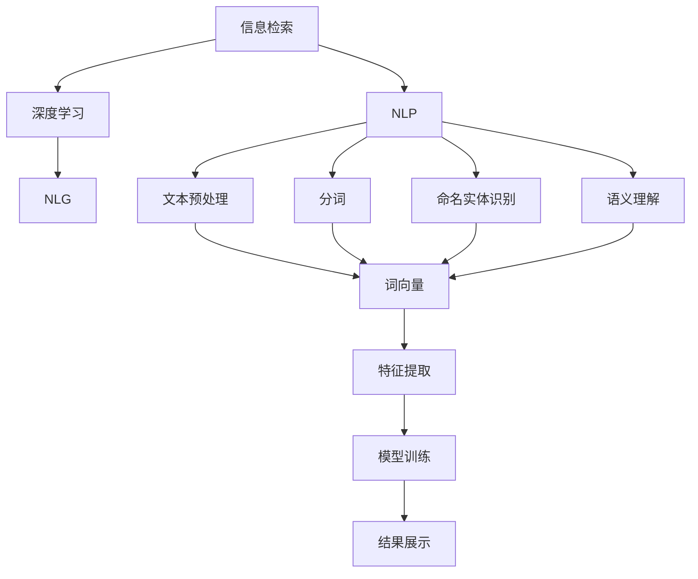
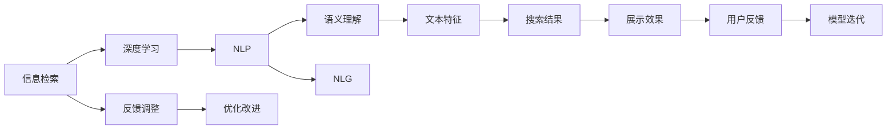
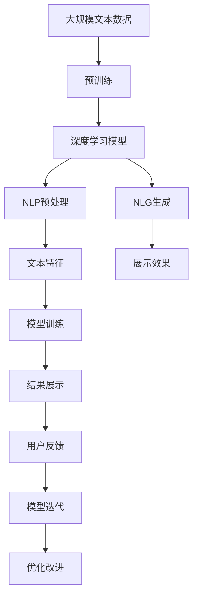

                 

# AI搜索引擎的工作原理及优势

> 关键词：AI搜索引擎,信息检索,语义理解,深度学习,机器学习,自然语言处理(NLP),自然语言生成(NLG)

## 1. 背景介绍

### 1.1 问题由来
搜索引擎作为互联网时代不可或缺的信息检索工具，早已渗透到我们生活的方方面面。传统的搜索引擎主要基于关键词匹配技术，通过搜索匹配网页标题、描述、URL等文本信息中的关键词，来提供搜索结果。然而，随着互联网数据的爆炸性增长，网页数量和内容的多样化使得传统搜索方式难以满足用户的多样化需求。如何从海量信息中快速准确地检索到用户真正需要的信息，成为搜索引擎面临的巨大挑战。

为了应对这一挑战，AI搜索引擎应运而生。基于深度学习和自然语言处理(NLP)技术的AI搜索引擎，可以理解用户的查询意图，准确识别文本中的语义信息，从而在搜索结果中引入语义关联性，大幅提升用户体验和搜索效率。

### 1.2 问题核心关键点
AI搜索引擎的核心在于将传统的基于关键词的搜索技术升级为基于语义的搜索。其关键点包括：

- 语义理解：理解和捕捉用户查询中的语义信息，如查询意图、实体、关系等。
- 深度学习：利用深度学习模型对文本进行特征提取和语义表示，提升搜索结果的相关性和准确性。
- 自然语言处理：通过NLP技术，如分词、词性标注、命名实体识别等，进行文本预处理和信息抽取。
- 自然语言生成：利用NLG技术，生成友好的搜索结果展示方式，提升用户体验。
- 多模态融合：结合图像、视频、语音等多模态信息，提供更丰富的搜索结果。

这些关键技术共同构成了AI搜索引擎的核心竞争力，使得其在面对复杂的搜索需求时，能够提供更高效、准确、个性化的搜索结果。

### 1.3 问题研究意义
AI搜索引擎的兴起，标志着搜索引擎技术从基于规则的机械匹配向基于深度学习的智能推理演进。其研究意义主要体现在以下几个方面：

1. **提升搜索效率**：通过语义理解和深度学习技术，AI搜索引擎能够更准确地理解用户查询意图，快速匹配相关信息，大幅提升搜索效率。
2. **丰富搜索结果**：引入语义关联性，AI搜索引擎能够提供更全面的搜索结果，涵盖网页、图片、视频、知识图谱等多模态信息。
3. **个性化推荐**：基于用户查询历史和行为数据，AI搜索引擎能够个性化推荐搜索结果，提升用户体验。
4. **智能交互**：结合自然语言生成技术，AI搜索引擎可以与用户进行智能对话，提供更自然的交互方式。
5. **技术创新**：AI搜索引擎的发展促进了深度学习、自然语言处理等前沿技术的研究和应用，推动了AI领域的整体进步。

## 2. 核心概念与联系

### 2.1 核心概念概述

为了更深入理解AI搜索引擎的工作原理，本节将介绍几个密切相关的核心概念：

- 信息检索（Information Retrieval, IR）：指从大量数据中查找相关信息的过程，广泛应用于搜索引擎、数据库查询等领域。
- 深度学习（Deep Learning）：一类基于神经网络模型的机器学习方法，通过多层非线性变换进行特征提取和模式识别。
- 自然语言处理（Natural Language Processing, NLP）：涉及计算机与人类语言交互的系列技术，包括文本预处理、分词、命名实体识别、语义理解等。
- 自然语言生成（Natural Language Generation, NLG）：生成可读性强、语义准确的自然语言文本的过程，常用于搜索结果展示和智能对话。
- 多模态融合（Multi-modal Fusion）：将文本、图像、视频、语音等多模态数据进行联合建模和融合，提升系统的理解能力和表达能力。

这些核心概念之间通过以下Mermaid流程图展示它们的关系：

这个流程图展示了信息检索、深度学习、NLP、NLG和多模态融合之间的关系：

1. 信息检索通过深度学习进行特征提取和模式识别。
2. NLP技术用于文本预处理、分词、命名实体识别、语义理解等。
3. NLG技术用于生成友好的搜索结果展示。
4. 多模态融合将文本、图像、视频、语音等多模态数据进行联合建模和融合。

### 2.2 概念间的关系

这些核心概念之间存在着紧密的联系，形成了AI搜索引擎的完整生态系统。通过以下Mermaid流程图，我们可以更清晰地理解这些概念之间的交互：

这个流程图展示了信息检索、深度学习、NLP、NLG和多模态融合之间的交互：

1. 信息检索通过深度学习进行特征提取和模式识别，通过NLP技术进行语义理解，并结合NLG技术生成展示效果。
2. 用户反馈信息通过反馈调整机制，对模型进行迭代优化。

### 2.3 核心概念的整体架构

最后，我们用一个综合的流程图来展示这些核心概念在大语言模型微调过程中的整体架构：

这个综合流程图展示了从预训练到信息检索的完整过程。大语言模型首先在大规模文本数据上进行预训练，然后通过深度学习模型进行特征提取和模式识别，结合NLP技术进行语义理解，并通过NLG技术生成展示效果，最终得到用户反馈信息，对模型进行迭代优化。通过这些流程图，我们可以更清晰地理解AI搜索引擎的工作原理和优化方向。

## 3. 核心算法原理 & 具体操作步骤
### 3.1 算法原理概述

AI搜索引擎的核心算法原理可以概括为以下几个步骤：

1. **文本预处理**：将用户查询和搜索结果进行预处理，包括分词、去除停用词、词性标注等。
2. **特征提取**：利用深度学习模型提取文本的语义特征，如词向量、句向量等。
3. **语义匹配**：通过计算用户查询和搜索结果之间的语义相似度，匹配出最相关的结果。
4. **排序展示**：根据排序策略对搜索结果进行排序，并展示给用户。

这些步骤通过深度学习和自然语言处理技术实现，使得AI搜索引擎能够理解用户查询意图，并从大规模语料库中高效检索出相关结果。

### 3.2 算法步骤详解

以下是AI搜索引擎的核心算法步骤详解：

#### 3.2.1 文本预处理

文本预处理是AI搜索引擎的第一步，其目的是将原始文本转化为模型能够处理的向量表示。文本预处理主要包括以下步骤：

- **分词**：将连续的文本序列切分成一个个单独的词语。不同的语言有不同的分词方式，如中文的分词需要使用特殊的分词工具。
- **去除停用词**：去除无实际语义的停用词，如“的”、“是”等。
- **词性标注**：对每个词语进行词性标注，如名词、动词等，有助于后续的语义理解。
- **命名实体识别**：识别出文本中的人名、地名、机构名等实体，便于提取重要信息。
- **词向量嵌入**：利用Word2Vec、GloVe等技术，将词语转化为高维向量表示，便于机器理解。

#### 3.2.2 特征提取

特征提取是AI搜索引擎的核心环节，其目的是将文本转化为机器能够理解的向量表示。常用的特征提取方法包括：

- **词袋模型**：将文本看作一个词语的集合，忽略词语的顺序和语序关系。
- **TF-IDF模型**：计算词语在文本中的重要性，用于衡量词语的权重。
- **词向量嵌入**：利用深度学习模型，如Word2Vec、GloVe等，将词语转化为高维向量表示。
- **句子向量**：利用句子的词向量进行平均、加权平均等操作，得到句子的向量表示。
- **BERT嵌入**：利用预训练的BERT模型，直接将句子转化为向量表示，更适用于语义理解任务。

#### 3.2.3 语义匹配

语义匹配是AI搜索引擎的关键步骤，其目的是通过计算查询和搜索结果之间的语义相似度，匹配出最相关的结果。常用的语义匹配方法包括：

- **余弦相似度**：计算查询和搜索结果之间的向量夹角，判断相似度。
- **BM25模型**：一种基于信息检索的模型，通过TF-IDF和文档长度等因素计算查询与文档的相关性。
- **Word2Vec和BERT**：利用词向量或句子向量计算语义相似度。
- **TransE和GNN**：利用知识图谱和图神经网络进行语义推理和匹配。

#### 3.2.4 排序展示

排序展示是AI搜索引擎的最后一步，其目的是根据排序策略对搜索结果进行排序，并展示给用户。常用的排序展示方法包括：

- **相关性排序**：根据查询与文档的相关性进行排序，将最相关的结果排在前面。
- **用户行为排序**：根据用户的历史行为数据，如点击率、停留时间等，对结果进行排序。
- **广告排序**：将商业广告排在搜索结果的前面，提升广告效果。
- **互动排序**：根据用户的互动行为，如点赞、评论等，对结果进行排序。

### 3.3 算法优缺点

AI搜索引擎利用深度学习和自然语言处理技术，相较于传统的基于关键词的搜索引擎，具有以下优势：

- **语义理解**：能够理解用户查询的语义意图，提供更相关和有用的搜索结果。
- **上下文理解**：能够理解查询的上下文，提供更全面的搜索结果。
- **个性化推荐**：根据用户的历史行为数据，提供个性化的搜索结果。
- **多模态融合**：结合图像、视频、语音等多模态信息，提供更丰富的搜索结果。

同时，AI搜索引擎也存在以下缺点：

- **计算成本高**：深度学习模型的训练和推理需要大量的计算资源，成本较高。
- **数据依赖**：需要大量的标注数据进行训练，数据获取成本较高。
- **隐私问题**：用户查询和搜索结果的隐私保护是一个重要问题。
- **模型可解释性**：深度学习模型的复杂性使得结果的解释性不足，难以理解模型的内部机制。
- **鲁棒性问题**：模型对噪声和异常数据敏感，鲁棒性有待提升。

### 3.4 算法应用领域

AI搜索引擎作为一种前沿技术，已经在多个领域得到广泛应用，例如：

- **电子商务**：提供商品搜索、价格比较、个性化推荐等功能。
- **新闻媒体**：提供新闻搜索、文章摘要、智能写作等功能。
- **社交网络**：提供用户帖子搜索、智能推荐、智能对话等功能。
- **医疗健康**：提供医学文献搜索、疾病知识图谱、智能问答等功能。
- **金融服务**：提供金融产品搜索、市场行情分析、智能客服等功能。
- **法律服务**：提供法律法规查询、案件相似度匹配、智能咨询等功能。

## 4. 数学模型和公式 & 详细讲解 & 举例说明

### 4.1 数学模型构建

AI搜索引擎的数学模型构建主要包括以下几个部分：

- **文本预处理**：将原始文本转化为词向量表示。
- **特征提取**：利用深度学习模型提取文本的语义特征。
- **语义匹配**：计算查询和搜索结果之间的语义相似度。
- **排序展示**：根据排序策略对搜索结果进行排序。

#### 4.1.1 文本预处理

文本预处理的主要目标是将原始文本转化为模型能够处理的向量表示。常用的文本表示方法包括：

- **词袋模型**：将文本看作一个词语的集合，忽略词语的顺序和语序关系。词袋模型中的每个词语都被视为一个独立的特征。
- **TF-IDF模型**：计算词语在文本中的重要性，用于衡量词语的权重。TF-IDF（Term Frequency-Inverse Document Frequency）公式如下：
  $$
  TF(t,d) = \frac{n_t}{n_d}, \quad IDF(t,D) = \log\frac{N}{df(t)}, \quad TF-IDF(t,d,D) = TF(t,d) \times IDF(t,D)
  $$
  其中 $n_t$ 是词语 $t$ 在文档 $d$ 中出现的次数，$n_d$ 是文档 $d$ 的词语总数，$df(t)$ 是包含词语 $t$ 的文档数，$N$ 是总文档数。
- **词向量嵌入**：利用Word2Vec、GloVe等技术，将词语转化为高维向量表示。Word2Vec的词向量计算公式如下：
  $$
  v_t = \frac{1}{\|v_t\|}\sum_{k=1}^{n}(v_{k} \cdot u_k)
  $$
  其中 $v_t$ 是词语 $t$ 的向量表示，$v_k$ 是词语 $k$ 的向量表示，$u_k$ 是词语 $k$ 的上下文向量。
- **BERT嵌入**：利用预训练的BERT模型，直接将句子转化为向量表示。BERT模型的句子向量计算公式如下：
  $$
  v_s = \frac{1}{\|v_s\|}\sum_{k=1}^{n}(v_{k} \cdot u_k)
  $$
  其中 $v_s$ 是句子 $s$ 的向量表示，$v_k$ 是词语 $k$ 的向量表示，$u_k$ 是词语 $k$ 的上下文向量。

#### 4.1.2 特征提取

特征提取的主要目标是将文本转化为机器能够理解的向量表示。常用的特征提取方法包括：

- **余弦相似度**：计算查询和搜索结果之间的向量夹角，判断相似度。余弦相似度的计算公式如下：
  $$
  sim(x,y) = \frac{x \cdot y}{\|x\| \cdot \|y\|}
  $$
  其中 $x$ 和 $y$ 是两个向量，$\cdot$ 表示点积，$\|x\|$ 和 $\|y\|$ 表示向量的模长。
- **BM25模型**：一种基于信息检索的模型，通过TF-IDF和文档长度等因素计算查询与文档的相关性。BM25模型的文档相似度计算公式如下：
  $$
  Q = \sum_{k=1}^{m}(q_k \times tf_{d_k})
  $$
  $$
  D = \sum_{k=1}^{m}(d_k \times tf_{d_k} \times idf_k)
  $$
  $$
  sim(Q,D) = \frac{Q \times (1 - b + b \times \frac{L_D}{avgL_D})}{D \times \sqrt{\sum_{k=1}^{m}tf_{d_k}^2} \times \sqrt{\sum_{k=1}^{m}tf_{d_k}^2 + c^2 \times \frac{L_D}{avgL_D}^2}}
  $$
  其中 $q_k$ 是查询中的词语，$tf_{d_k}$ 是词语 $k$ 在文档 $d_k$ 中出现的次数，$idf_k$ 是逆文档频率，$b$ 是BM25参数，$L_D$ 是文档长度，$avgL_D$ 是平均文档长度，$c$ 是BM25常数。
- **Word2Vec和BERT**：利用词向量或句子向量计算语义相似度。Word2Vec的词向量计算公式如下：
  $$
  v_t = \frac{1}{\|v_t\|}\sum_{k=1}^{n}(v_{k} \cdot u_k)
  $$
  其中 $v_t$ 是词语 $t$ 的向量表示，$v_k$ 是词语 $k$ 的向量表示，$u_k$ 是词语 $k$ 的上下文向量。BERT的句子向量计算公式如下：
  $$
  v_s = \frac{1}{\|v_s\|}\sum_{k=1}^{n}(v_{k} \cdot u_k)
  $$
  其中 $v_s$ 是句子 $s$ 的向量表示，$v_k$ 是词语 $k$ 的向量表示，$u_k$ 是词语 $k$ 的上下文向量。
- **TransE和GNN**：利用知识图谱和图神经网络进行语义推理和匹配。TransE模型的实体向量计算公式如下：
  $$
  \mathbf{r}_h = [u_h; v_h]
  $$
  $$
  \mathbf{r}_t = [v_t; u_t]
  $$
  $$
  \mathbf{r}_o = [w_h; x_h]
  $$
  $$
  \mathbf{e}_r = \max\limits_{r \in \mathcal{R}}\|\mathbf{h} + \mathbf{t} - \mathbf{r}\|_2
  $$
  其中 $u_h$ 和 $v_h$ 是头实体的向量表示，$w_h$ 和 $x_h$ 是尾实体的向量表示，$r$ 是关系向量，$\mathbf{h}$ 和 $\mathbf{t}$ 是头实体和尾实体的向量表示。GNN的节点向量计算公式如下：
  $$
  \mathbf{h}_{t+1} = \sigma(\mathbf{W}\mathbf{h}_t + \mathbf{U}\mathbf{h}_{t-1})
  $$
  其中 $\mathbf{h}_t$ 是节点 $t$ 的向量表示，$\mathbf{W}$ 是权重矩阵，$\mathbf{U}$ 是邻居节点向量，$\sigma$ 是非线性激活函数。

#### 4.1.3 语义匹配

语义匹配的主要目标是通过计算查询和搜索结果之间的语义相似度，匹配出最相关的结果。常用的语义匹配方法包括：

- **余弦相似度**：计算查询和搜索结果之间的向量夹角，判断相似度。余弦相似度的计算公式如下：
  $$
  sim(x,y) = \frac{x \cdot y}{\|x\| \cdot \|y\|}
  $$
  其中 $x$ 和 $y$ 是两个向量，$\cdot$ 表示点积，$\|x\|$ 和 $\|y\|$ 表示向量的模长。
- **BM25模型**：一种基于信息检索的模型，通过TF-IDF和文档长度等因素计算查询与文档的相关性。BM25模型的文档相似度计算公式如下：
  $$
  Q = \sum_{k=1}^{m}(q_k \times tf_{d_k})
  $$
  $$
  D = \sum_{k=1}^{m}(d_k \times tf_{d_k} \times idf_k)
  $$
  $$
  sim(Q,D) = \frac{Q \times (1 - b + b \times \frac{L_D}{avgL_D})}{D \times \sqrt{\sum_{k=1}^{m}tf_{d_k}^2} \times \sqrt{\sum_{k=1}^{m}tf_{d_k}^2 + c^2 \times \frac{L_D}{avgL_D}^2}}
  $$
  其中 $q_k$ 是查询中的词语，$tf_{d_k}$ 是词语 $k$ 在文档 $d_k$ 中出现的次数，$idf_k$ 是逆文档频率，$b$ 是BM25参数，$L_D$ 是文档长度，$avgL_D$ 是平均文档长度，$c$ 是BM25常数。
- **Word2Vec和BERT**：利用词向量或句子向量计算语义相似度。Word2Vec的词向量计算公式如下：
  $$
  v_t = \frac{1}{\|v_t\|}\sum_{k=1}^{n}(v_{k} \cdot u_k)
  $$
  其中 $v_t$ 是词语 $t$ 的向量表示，$v_k$ 是词语 $k$ 的向量表示，$u_k$ 是词语 $k$ 的上下文向量。BERT的句子向量计算公式如下：
  $$
  v_s = \frac{1}{\|v_s\|}\sum_{k=1}^{n}(v_{k} \cdot u_k)
  $$
  其中 $v_s$ 是句子 $s$ 的向量表示，$v_k$ 是词语 $k$ 的向量表示，$u_k$ 是词语 $k$ 的上下文向量。
- **TransE和GNN**：利用知识图谱和图神经网络进行语义推理和匹配。TransE模型的实体向量计算公式如下：
  $$
  \mathbf{r}_h = [u_h; v_h]
  $$
  $$
  \mathbf{r}_t = [v_t; u_t]
  $$
  $$
  \mathbf{r}_o = [w_h; x_h]
  $$
  $$
  \mathbf{e}_r = \max\limits_{r \in \mathcal{R}}\|\mathbf{h} + \mathbf{t} - \mathbf{r}\|_2
  $$
  其中 $u_h$ 和 $v_h$ 是头实体的向量表示，$w_h$ 和 $x_h$ 是尾实体的向量表示，$r$ 是关系向量，$\mathbf{h}$ 和 $\mathbf{t}$ 是头实体和尾实体的向量表示。GNN的节点向量计算公式如下：
  $$
  \mathbf{h}_{t+1} = \sigma(\mathbf{W}\mathbf{h}_t + \mathbf{U}\mathbf{h}_{t-1})
  $$
  其中 $\mathbf{h}_t$ 是节点 $t$ 的向量表示，$\mathbf{W}$ 是权重矩阵，$\mathbf{U}$ 是邻居节点向量，$\sigma$ 是非线性激活函数。

#### 4.1.4 排序展示

排序展示的主要目标是根据排序策略对搜索结果进行排序，并展示给用户。常用的排序展示方法包括：

- **相关性排序**：根据查询与文档的相关性进行排序，将最相关的结果排在前面。相关性排序的计算公式如下：
  $$
  \text{Relevance} = sim(Q,D)
  $$
  其中 $Q$ 是查询的向量表示，$D$ 是文档的向量表示，$sim$ 是相似度函数。
- **用户行为排序**：根据用户的历史行为数据，如点击率、停留时间等，对结果进行排序。用户行为排序的计算公式如下：
  $$
  \text{User Behavior} = \frac{\text{Click Rate} + \text{Stay Time}}{N}
  $$
  其中 $\text{Click Rate}$ 是点击率，$\text{Stay Time}$ 是停留时间，$N$ 是总点击次数。
- **广告排序**：将商业广告排在搜索结果的前面，提升广告效果。广告排序的计算公式如下：
  $$
  \text{Ad Rank} = \text{Ad Budget} \times \text{Ad Quality}
  $$
  其中 $\text{Ad Budget}$ 是广告预算，$\text{Ad Quality}$ 是广告质量。
- **互动排序**：根据用户的互动行为，如点赞、评论等，对结果进行排序。互动排序的计算公式如下：
  $$
  \text{Interactivity} = \text{Likes} + \text{Comments}
  $$
  其中 $\text{Likes}$ 是点赞数，$\text{Comments}$ 是评论数。

### 4.2 公式推导过程

以下是对核心公式的推导过程：

#### 4.2.1 余弦相似度

余弦相似度的推导过程如下：

假设查询和搜索结果的向量分别为 $x$ 和 $y$，则余弦相似度计算公式为：
$$
sim(x,y) = \frac{x \cdot y}{\|x\| \cdot \|y\|}
$$
其中 $x$ 和 $y$ 是两个向量，$\cdot$ 表示点积，$\|x\|$ 和 $\|y\|$ 表示向量的模长。

#### 4.2.2 BM25模型

BM25模型的推导过程如下：

假设查询 $Q$ 和文档 $D$ 的向量分别为 $Q$ 和 $D$，则BM25模型的文档相似度计算公式为：
$$
Q = \sum_{k=1}^{m}(q_k \times tf_{d_k

